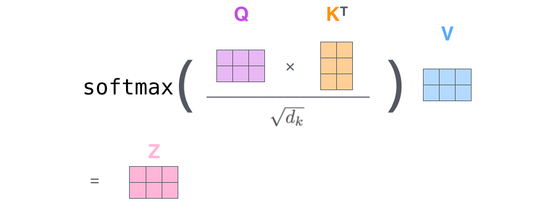
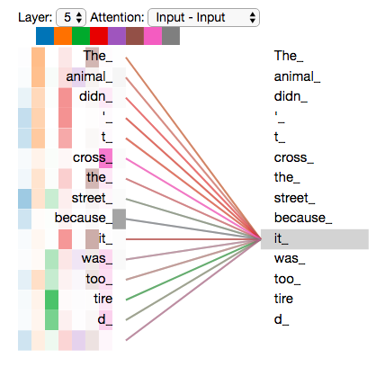

# Transformerの図解

Transformerは論文「[Attention is All You Need](https://arxiv.org/abs/1706.03762)」で提案されたアーキテクチャです。

!!! info "ドキュメントについて"
    本記事は Jay Alammar 氏による [The Illustrated Transformer](https://jalammar.github.io/illustrated-transformer/) （2018, CC BY-NC-SA 4.0）の日本語翻訳＋補足解説です。  
    本記事も同じく[CC BY-NC-SA 4.0 ライセンス](https://creativecommons.org/licenses/by-nc-sa/4.0/) の下で公開します。

## 概要

この記事では、現代の自然言語処理において革命的な変化をもたらしたTransformerアーキテクチャについて学習します。RNNやCNNに依存せず、Attention機構のみで構築されたこのモデルがなぜ効果的なのか、その仕組みを詳しく理解することが目標です。

## 前提知識

この記事を理解するために推奨される知識：

- 機械学習の基本概念（ニューラルネットワーク、順伝播、逆伝播）
- 自然言語処理の基礎（単語埋め込み、系列変換）
- 線形代数の基本（行列の掛け算、ベクトル演算）
- seq2seqモデルの概念（エンコーダー・デコーダーアーキテクチャ）

## 背景と動機

### 系列モデリングの歴史的発展

英語から日本語への翻訳を学習する場面を想像してください。従来のアプローチはどのようなものだったでしょうか？

#### 従来手法の限界：RNN、LSTMの逐次処理問題

Transformerが登場する前、系列データを処理する主流手法は循環ニューラルネットワーク（RNN）と長短期記憶ネットワーク（LSTM）でした。簡単な例で理解しましょう。

「I love machine learning」を翻訳する場合を考えてみます。

```python
# 従来のRNN/LSTMの処理方式
# 時刻1: "I"を処理 → 隠れ状態h1を生成
# 時刻2: h1に基づいて"love"を処理 → 隠れ状態h2を生成  
# 時刻3: h2に基づいて"machine"を処理 → 隠れ状態h3を生成
# 時刻4: h3に基づいて"learning"を処理 → 隠れ状態h4を生成
```

!!! tip "豆知識：隠れ状態（Hidden State）とは"
    隠れ状態は、RNNが系列を処理する際の「記憶」です。これまでのすべての時刻の情報を固定サイズのベクトルに圧縮しようとします。物語を聞く際に、脳が以前のあらすじを記憶して現在の内容を理解するのと似ています。

**逐次処理による問題点：**

1. **並列化不可能**：「I」の処理が完了してから「love」を処理する必要があり、現代GPUの並列計算能力を活用できない
2. **情報ボトルネック**：すべての履歴情報を固定サイズの隠れ状態に圧縮する必要がある
3. **勾配消失**：非常に長い系列に対して、初期の情報が後方に伝達されにくい

#### 並列計算の必要性：なぜ並列学習が重要か？

現代の深層学習において**学習効率**は重要な要求の一つです。例えて言うなら：

- 従来手法：流れ作業のように、順序に従って一つずつ処理する必要がある
- 求められるもの：チーム協働のように、全員が同時に作業できる仕組み

#### 長距離依存の課題：情報伝達のボトルネック

この英語文を考えてください：
「The cat, which we found last week in the garden behind the old house, **is** very friendly.」

従来のRNNが「cat」と「is」の文法関係を理解するには、情報が中間のすべての単語を経由して伝達される必要があります：
```
cat → which → we → found → last → week → in → the → garden → behind → the → old → house → is
```

各ステップで情報が失われる可能性があり、伝言ゲームのような状況になってしまいます。

### 注意機構の発想

#### 人間の注意力との類比：読書時の選択的注意

文章を読む際、私たちの注意力はすべての文字に均等に向けられるわけではありません。読者は：

- 重要な**キーワードに集中し**
- 機能語（the、a、isなど）は**素早く流し読みし**
- 必要に応じて**前の内容を振り返って参照します**

機械学習の注意機構が模倣するのは、まさにこの選択的注意能力です。

#### 機械翻訳におけるアライメント問題：単語対応関係

英日翻訳を考えてみましょう：
```
英語: "I love machine learning"
日本語: "私は機械学習が好きです"

アライメント関係：
I        → 私は
love     → 好きです
machine  → 機械
learning → 学習
```

!!! tip "豆知識：アライメント（Alignment）とは"
    アライメントとは、原言語と目標言語でどの語彙が相互に対応するかを決定する過程です。これは翻訳において極めて重要で、異なる言語の語順が完全に異なる可能性があるからです。

従来手法では、このような複雑なアライメント処理が困難で、特に語順の違いが大きい場合に問題となります。

#### 「全体情報圧縮」から「必要に応じてアクセス」への転換

**従来手法の思考：**
- すべての情報を一つのベクトルに圧縮
- このベクトルがすべての必要情報を含むことを期待

**注意機構の考え方：**
- すべての原始情報を保持
- 必要に応じて動的に関連情報を選択

これは「すべての本を暗記する」から「優れた図書館インデックスシステムを構築する」への転換に例えられます。

### 「Attention is All You Need」の革命的思想

#### 再帰と畳み込みの放棄：純粋注意力アーキテクチャへの大胆な挑戦

2017年、Googleの研究チームが革新的なアイデアを提案しました：
> 「注意機構がこれほど効果的なら、完全に注意力に基づくモデルを構築してはどうだろうか？」

このアイデアの革新性：

- RNNの再帰構造を**完全に放棄**
- CNNの畳み込み操作を**完全に放棄**
- **注意機構のみに依存**した系列関係のモデル化

#### 解決された主要問題：並列化 + 長距離依存 + 解釈可能性

Transformerは三つの主要問題を一挙に解決しました：

1. **並列化**：すべての位置が同時に計算可能
2. **長距離依存**：任意の二つの位置間の直接接続
3. **解釈可能性**：注意重みがモデル決定の透明度を提供

## 全体像

まず、モデルを一つのブラックボックスとして見てみましょう。機械翻訳アプリケーションでは、ある言語の文章を入力として受け取り、別の言語での翻訳を出力します。


このOptimus Primeのような素晴らしい仕組みを開いて見ると、エンコーダー部分、デコーダー部分、そしてそれらを繋ぐ結合部が見えてきます。


エンコーダー部分は複数のエンコーダーを積み重ねた構造になっています（論文では6層構成。6という数字に特別な意味はなく、他の層数でも実験可能です）。デコーダー部分も同様に、同じ数のデコーダーを積み重ねた構造です。


エンコーダーはすべて同じ構造を持ちます（ただし重みは共有しません）。それぞれが2つのサブレイヤーに分かれています。


エンコーダーの入力は最初にself-attention層を通ります。これは、特定の単語をエンコードする際に、入力文の他の単語を見ることを可能にする層です。self-attentionについては後ほど詳しく見ていきます。

self-attention層の出力は順伝播ニューラルネットワーク（feed-forward neural network）に供給されます。まったく同じ順伝播ネットワークが各位置に独立して適用されます。

デコーダーにも同様の層がありますが、それらの間にEncoder-Decoder Attention（Cross Attention）層が配置されており、デコーダーが入力文章の関連する部分を参照できるようになっています（[seq2seqモデル](https://jalammar.github.io/visualizing-neural-machine-translation-mechanics-of-seq2seq-models-with-attention/)でのAttentionと同様です）。


## 可視化にテンソルの導入

モデルの主要コンポーネントを見てきましたので、次に様々なベクトル/テンソルと、これらが各コンポーネント間をどのように流れて、**訓練済みモデル**の入力を出力に変換するかを見ていきましょう。

一般的な自然言語処理アプリケーションと同様に、[埋め込みアルゴリズム](https://medium.com/deeper-learning/glossary-of-deep-learning-word-embedding-f90c3cec34ca)を使って各入力単語をベクトルに変換するところから始めます。この変換では、まず語彙表から各単語に対応するIDを取得し、そのIDに基づいて埋め込みベクトルを生成します。

!!! tip "豆知識：語彙表とは？"
    語彙表はモデルが理解できるすべての単語の集合です：
    
    - **構築方式**：訓練データからすべての一意語彙を収集
    - **特殊トークン**：`<pad>`（パディング）、`<unk>`（未知語）、`<start>`、`<end>`
    - **サイズ制限**：通常最も頻繁な30K-50K個の単語を含む
    - **エンコード方式**：各単語が一意のIDを割り当てられる


*各単語はサイズ512のベクトルに埋め込まれます。これらのベクトルをシンプルなボックスで表現します。*

単語埋め込みは最下層のエンコーダーでのみ行われます。すべてのエンコーダーに共通する仕様は、それぞれがサイズ512のベクトル列を受け取ることです。最下層では単語埋め込みベクトルを受け取りますが、上位層では直下のエンコーダーの出力を受け取ります。このリストのサイズはハイパーパラメータとして設定できます。基本的には、訓練データセット内の最長文の長さになります。

入力系列の単語を埋め込んだ後、それぞれがエンコーダーの2つの層を通って流れます。


ここで、Transformerの重要な特性の一つが見えてきます。各位置の単語がエンコーダー内で独自のパスを通るということです。self-attention層でこれらのパス間には依存関係があります。しかし、順伝播層にはそのような依存関係がないため、順伝播層を通る際には様々なパスを並列実行できます。

次に、より短い文の例に切り替えて、エンコーダーの各サブレイヤーで何が起こるかを見てみましょう。

## エンコーディングの開始！

既に述べたように、エンコーダーは入力としてベクトルのリストを受け取ります。これらのベクトルを「self-attention」層に渡し、次に順伝播ニューラルネットワークに渡すことでこのリストを処理し、出力を上位の次のエンコーダーに送ります。


*各位置の単語はSelf-Attention処理を行います。その後、それぞれが順伝播ニューラルネットワークを通ります。各ベクトルが個別に同じネットワークを通ります。*

## Self-Attentionの概要

「Self-Attention」という用語が当然のように使われていますが、決して馴染み深い概念ではありません。筆者自身も「Attention is All You Need」論文を読むまで、この概念を知りませんでした。どのように動作するかを解説しましょう。

翻訳したい入力文が次のようなものだとします：

「```The animal didn't cross the street because it was too tired```」

この文の「it」は何を指しているでしょうか？streetを指しているのか、animalを指しているのか？人間には簡単な質問ですが、アルゴリズムにとってはそれほど簡単ではありません。

モデルが「it」という単語を処理する際、Self-Attentionによって「it」と「animal」を関連付けることができます。

モデルが各単語（入力系列の各位置）を処理する際、self-attentionにより入力系列の他の位置を見て、この単語のより良いエンコーディングにつながる手がかりを得ることができます。

RNNに馴染みがある方は、隠れ状態を維持することで、RNNが以前に処理した単語/ベクトルの表現を現在処理中のものと統合する方法を思い出してください。Self-Attentionは、Transformerが他の関連単語の情報を現在処理中の単語に組み込むための仕組みです。


*5層目のエンコーダー（最上位層）で「it」という単語をエンコードする際、Attention機構が「The Animal」に注目し、その情報を「it」の表現に組み込んでいる様子を示しています。*

Transformerモデルを読み込んで、このインタラクティブな可視化を使って検証できる[Tensor2Tensor notebook](https://colab.research.google.com/github/tensorflow/tensor2tensor/blob/master/tensor2tensor/notebooks/hello_t2t.ipynb)もぜひチェックしてみてください。

## Self-Attentionの詳細

まず、ベクトルを使用してself-attentionを計算する方法を見てから、実際の実装（行列を使用）を見ていきましょう。

例として「Thinking Machines」という2単語の文を使用します：

- thinking → x1 [512]
- machines → x2 [512]

self-attentionを計算する**第1ステップ**は、エンコーダーの各入力ベクトル（この場合、各単語の埋め込み）から3つのベクトルを作成することです。各単語について、Query（クエリ）ベクトル、Key（キー）ベクトル、Value（バリュー）ベクトルを作成します：


ここで、WQ、WK、WVは学習可能な重み行列です：

- WQ: [512, 64] - Query用重み行列
- WK: [512, 64] - Key用重み行列  
- WV: [512, 64] - Value用重み行列

x1にWQ重み行列を掛けると、その単語に関連する「query」ベクトルであるq1が生成されます。最終的に、入力文の各単語について「query」、「key」、「value」の射影を作成します。

- thinking: q1 = x1 × WQ → [64], k1 = x1 × WK → [64], v1 = x1 × WV → [64]
- machines: q2 = x2 × WQ → [64], k2 = x2 × WK → [64], v2 = x2 × WV → [64]

「query」、「key」、「value」ベクトルとは何でしょうか？

これらは、attentionの計算と思考に有用な抽象化です。以下でattentionがどのように計算されるかを読み進めれば、これらの各ベクトルが果たす役割について知る必要があることはほぼ全て分かるでしょう。

self-attentionを計算する**第2ステップ**は、スコアを計算することです。この例の最初の単語「Thinking」のself-attentionを計算するとしましょう。入力文の各単語をこの単語に対してスコア化する必要があります。スコアは、特定の位置で単語をエンコードする際に、入力文の他の部分にどの程度焦点を当てるかを決定します。

スコアは、queryベクトルと、スコア化する各単語のkeyベクトルの内積を取ることで計算されます：

- score₁₁ = q1 • k1 → スカラー値
- score₁₂ = q1 • k2 → スカラー値

各スコアは64次元ベクトル同士の内積により、単一の数値として計算されます。


!!! tip "豆知識：内積の幾何学的意味"
    内積は二つのベクトルの類似程度を測定します：
    
    - 内積が大 → ベクトル方向が類似 → 内容が関連
    - 内積が小 → ベクトル方向が異なる → 内容が無関連
    - 内積が0 → ベクトルが垂直 → 完全に無関係

    幾何学的に、内積は `|a| × |b| × cos(θ)` に等しく、θは二つのベクトルの夾角です。

    **なぜ内積を選択して他の類似度計算ではないのか？**
    
    1. **計算効率**：行列乗法が高度に並列化可能
    2. **数学的性質**：勾配計算が簡単で、訓練が安定
    3. **拡張可能性**：高次元ベクトルにも同様に適用

**第3と第4ステップ**は、スコアを8で割る（論文で使用されたkeyベクトルの次元の平方根 - 64。これにより、より安定した勾配が得られます。他の値も可能ですが、これがデフォルトです）、その後結果をsoftmax演算に通すことです。Softmaxはスコアを正規化し、すべて正の値になり、合計が1になります。

!!! tip "豆知識：なぜ√d_kで除算するのか？"
    これは**スケール内積注意力**の重要な技術：
    
    - 次元d_kが大きい時、内積の分散が大きくなる
    - 大きな内積値はsoftmax後に極端な重み分布を生成
    - √d_kで除算することで内積の分散を制御し、勾配をより安定させる

    数学的に：ベクトル要素が独立同分布の場合、d_k次元内積の分散は約d_kです。


このsoftmaxスコアは、この位置で各単語がどの程度表現されるかを決定します。明らかに、この位置の単語が最も高いsoftmaxスコアを持ちますが、時には現在の単語に関連する別の単語に注意を払うことが有用です。

!!! tip "豆知識：Softmax関数詳解"
    Softmaxは任意の実数ベクトルを確率分布に変換：
    
    - **出力範囲**：各値は(0,1)間
    - **総和が1**：すべての重みを加えると1に等しい
    - **順序保持**：元々大きい値は変換後も大きい
    - **滑らかな分布**：硬直な0/1選択を生成しない

    Softmaxの数学表現式：`softmax(xᵢ) = exp(xᵢ) / Σⱼexp(xⱼ)`
    
**第5ステップ**は、各valueベクトルにsoftmaxスコアを掛けて重み付けします。この操作により、重要な単語の情報は保持され、関連性の低い単語の情報は抑制されます（例えば、重要な単語には1.0に近い値、関連性の低い単語には0.001のような小さな値が掛けられます）。

**第6ステップ**は、重み付けされたvalueベクトルをすべて足し合わせることです。これにより、この位置（最初の単語）におけるSelf-Attention層の最終出力が得られます。


これでself-attentionの計算は完了です。結果のベクトルは順伝播ニューラルネットワークに送ることができます。しかし、実際の実装では、より高速な処理のためにこの計算は行列形式で行われます。単語レベルでの計算の直感を見てきましたので、今度はそれを見てみましょう。

## Self-Attentionの行列計算

**第1ステップ**は、Query、Key、Valueの行列を計算することです。埋め込みを行列Xにパックし、訓練した重み行列（WQ、WK、WV）を掛けることで行います。


*X行列の各行は、入力文の単語に対応しています。再び、埋め込みベクトル（512、または図の4ボックス）とq/k/vベクトル（64、または図の3ボックス）のサイズの違いが見えます。*

2単語の例の場合：

- X: [2, 512] - 入力埋め込み行列
- WQ: [512, 64] - Query用重み行列
- WK: [512, 64] - Key用重み行列  
- WV: [512, 64] - Value用重み行列

行列計算：

- Q = X × WQ → [2, 64]
- K = X × WK → [2, 64]
- V = X × WV → [2, 64]

**最後に**、行列を扱っているので、ステップ2から6を一つの式にまとめて、Self-Attention層の出力を計算できます：

```
Attention(Q,K,V) = softmax(QK^T / √d_k) × V
```



*行列形式でのself-attention計算*

具体的なshape変化：
```
1. QK^T: [2, 64] × [64, 2] → [2, 2] (attention scores)
2. softmax(QK^T / √d_k): [2, 2] → [2, 2] (attention weights)  
3. 最終結果: [2, 2] × [2, 64] → [2, 64] (weighted values)
```

!!! tip "豆知識：行列の積の復習"
    行列の積 A × B の条件：Aの列数 = Bの行数
    
    - Aが (m×n) 行列、Bが (n×p) 行列の場合
    - 結果Cは (m×p) 行列になる
    - C[i,j] = Σₖ A[i,k] × B[k,j]
    
## Multi-Head Attention（複数ヘッド注意力）

論文では、Multi-Head Attentionと呼ばれる機構を追加することで、Self-Attention層をさらに洗練させました。これにより、Attention層の性能が2つの方法で向上します：

1. **モデルが異なる位置に焦点を当てる能力を拡張**：上記の例では、z1には他のすべてのエンコーディングが少し含まれていますが、実際の単語自体が支配的になる可能性があります。「The animal didn't cross the street because it was too tired」のような文を翻訳する場合、「it」がどの単語を指すかを知ることは重要です。

2. **Attention層に複数の「表現サブ空間」を提供**：次に見るように、Multi-Head Attentionでは1つだけでなく、複数のQuery/Key/Value重み行列のセットがあります（Transformerは8個のAttentionヘッドを使用するため、各エンコーダー/デコーダーに8セット持つことになります）。これらの重み行列セットはランダムに初期化されます。学習後、各セットは入力埋め込み（または下位層のエンコーダー/デコーダーからのベクトル）を異なる表現サブ空間に投影する役割を果たします。


*マルチヘッドattentionでは、各ヘッドに対して別々のQ/K/V重み行列を維持し、異なるQ/K/V行列になります。以前と同様に、XにWQ/WK/WV行列を掛けてQ/K/V行列を生成します。*

上記で説明したのと同じself-attention計算を、異なる重み行列で8回異なって行うと、8つの異なるZ行列を得ます。


ここで問題が生じます。次のフィードフォワード層は8つの行列を受け取ることを想定しておらず、単一の行列（各単語に対するベクトル）を期待しています。そのため、これら8つを単一の行列に統合する方法が必要です。

この問題はどう解決するのでしょうか？**8つの行列を連結し、さらに重み行列WOを掛けることで対処**します：

```
MultiHead(Q,K,V) = Concat(head1, head2, ..., head8) × WO
```

具体的な計算：
```
Concat([Z1, Z2, ..., Z8]) × WO = [2, 512] × [512, 512] → [2, 512]
```

**Shape変化の詳細**：

- 各Zi (i=1...8): [2, 64] （2単語、各64次元）
- 連結後: [2, 512] （64×8=512次元）
- WO重み行列: [512, 512]
- 最終出力: [2, 512] （元の次元に戻る）


これがマルチヘッドself-attentionのほぼすべてです。確かにたくさんの行列があることは理解しています。一つの視覚的表現にまとめて、一箇所で見られるようにしてみましょう。


attentionヘッドについて触れましたので、例文で「it」という単語をエンコードする際に、異なるattentionヘッドがどこに焦点を当てているかを見るため、以前の例を再訪してみましょう：


*「it」という単語をエンコードする際、一つのattentionヘッドは「the animal」に最も焦点を当て、別のヘッドは「tired」に焦点を当てています。ある意味で、モデルの「it」という単語の表現は、「animal」と「tired」両方の表現の一部を組み込んでいます。*

しかし、すべてのattentionヘッドを図に追加すると、解釈が困難になることがあります：



## 位置エンコーディングを使用した系列の順序表現

これまで説明したモデルに欠けているものの一つは、入力系列での単語の順序を考慮する方法です。

これに対処するため、transformerは各入力埋め込みにベクトルを追加します。これらのベクトルは特定のパターンに従って設計され、各単語の位置情報や系列内の異なる単語間の距離情報をモデルに提供します。この仕組みの狙いは、位置情報を埋め込みに加えることで、Q/K/Vベクトルへの変換時に、内積Attentionの計算において埋め込みベクトル間に意味のある距離関係を与えることです。


*モデルに単語の順序感覚を与えるため、位置エンコーディングベクトルを追加します。その値は特定のパターンに従います。*

埋め込みの次元が4だと仮定すると、実際の位置エンコーディングは次のようになります：


*埋め込みサイズ4のおもちゃの例での位置エンコーディングの実例*

このパターンはどのようなものでしょうか？

次の図では、各行が位置エンコーディングのベクトルに対応しています。最初の行は、入力系列の最初の単語の埋め込みに追加するベクトルです。各行には512の値が含まれており、それぞれ1と-1の間の値を持ちます。パターンが見えるように色分けしています。


*20語（行）で埋め込みサイズ512（列）の位置エンコーディングの実例。中央で半分に分かれているように見えます。これは、左半分の値が一つの関数（sineを使用）で生成され、右半分が別の関数（cosineを使用）で生成されているためです。その後、それらが連結されて各位置エンコーディングベクトルを形成します。*

位置エンコーディングの式は論文（セクション3.5）で説明されています。位置エンコーディングを生成するコードは[```get_timing_signal_1d()```](https://github.com/tensorflow/tensor2tensor/blob/23bd23b9830059fbc349381b70d9429b5c40a139/tensor2tensor/layers/common_attention.py)で見ることができます。位置エンコーディングはこの方法に限定されるわけではありません。ただし、この手法には可変長の系列に対応できるという利点があります（例えば、学習時より長い文章の翻訳が求められる場合でも対応可能）。

**2020年7月更新：**
上記で示した位置エンコーディングは、TransformerのTensor2Tensor実装からのものです。論文で示された方法は、2つの信号を直接連結するのではなく、交互に配置するという点で少し異なります。次の図がその様子を示しています。[生成するためのコードはこちら](https://github.com/jalammar/jalammar.github.io/blob/master/notebookes/transformer/transformer_positional_encoding_graph.ipynb)：


## 残差接続

先に進む前に、エンコーダーアーキテクチャの重要な詳細について触れておきましょう。各エンコーダーの各サブレイヤー（Self-Attention、フィードフォワードニューラルネットワーク）には**残差接続（Residual Connection）**が設けられ、その後に**[層正規化（Layer Normalization）](https://arxiv.org/abs/1607.06450)**が続きます。

!!! tip "豆知識：Feed Forward Network（FFN）とは？"
    - 役割：自己注意（Self-Attention）後の特徴を非線形変換し、表現力を高める
    - 構造：2層の全結合層 + 活性化関数（通常 ReLU/GELU）
    - 次元拡張：中間層で隠れ次元を一時的に大きくして（例：d_model=512 → 2048 → 512）、情報を豊かに表現
    - 位置ごと独立：系列内の各トークンに対して 同じ FFN が適用される（トークンごと並列計算可）
    - 数学表現：
    ```
    FFN(x) = max(0, xW₁ + b₁)W₂ + b₂ （ReLU の場合）
    ```


!!! tip "豆知識：Layer Normalization詳解"
    Batch Normalizationと異なり、Layer Normは各サンプルを独立に正規化：
    
    - **Batch Norm**：batch次元で正規化（同一特徴の異なるサンプル間）
    - **Layer Norm**：特徴次元で正規化（同一サンプルの異なる特徴間）
    - **優位性**：batchサイズに依存せず、RNN/Transformerでより安定

self-attentionに関連するベクトルと層正規化操作を可視化すると、次のようになります：


これはデコーダーのサブレイヤーにも当てはまります。2つのエンコーダーとデコーダーを積み重ねたTransformerを考えると、次のようになります：


!!! tip "豆知識：なぜ残差接続（Residual Connection）が必要？"
    - 勾配流動：勾配消失を防ぎ、深層ネットワークの学習を安定化
    - 情報保護：入力情報が層を通じて失われにくい
    - 訓練安定：深層モデルでも最適化が容易になる
    - 恒等写像の学習：最悪でも「入力＝出力」を学習できる
    - 勾配高速道路：勾配が直接前の層に伝わるルートを確保

    数式で表すと：`y = F(x) + x`  
    → サブレイヤー関数 `F(x)` が **元の情報に"何を足すか"** を学習する仕組み。

## デコーダー側

エンコーダー側のほとんどの概念をカバーしましたので、デコーダーのコンポーネントがどのように動作するかも基本的に理解できます。では、それらがどのように連携するかを見てみましょう。

エンコーダーは入力系列の処理から開始します。最上位エンコーダーの出力は、attentionベクトルKとVのセットに変換されます。これらは各デコーダーの「エンコーダー・デコーダーattention」層で使用され、デコーダーが入力系列の適切な場所に焦点を当てることを助けます：


*エンコーディングフェーズを終了した後、デコーディングフェーズを開始します。デコーディングフェーズの各ステップは、出力系列（この場合は英語の翻訳文）の要素を出力します。*

以下のステップは、特別な文終了記号に到達してTransformerデコーダーが出力を完了したことを示すまで、このプロセスを繰り返します。各ステップの出力は、次の時間ステップで最下位デコーダーに供給され、デコーダーはエンコーダーと同様にデコーディング結果を上位に伝播させます。エンコーダーの入力と同様に、これらのデコーダー入力に埋め込みと位置エンコーディングを追加して各単語の位置を示します。


デコーダーのself-attention層は、エンコーダーのものとは少し異なる方法で動作します：

デコーダーでは、Self-Attention層は出力系列の以前の位置にのみ注意を払うことが許可されています。これは、Self-Attention計算のSoftmaxステップの前に、将来の位置をマスクする（`-inf`に設定する）ことで行われます。

「エンコーダー・デコーダーAttention」層は、Multi-Head Self-Attentionとまったく同じように動作しますが、下位の層からQuery行列を作成し、エンコーダースタックの出力からKeyとValue行列を取得する点が異なります。

## 最終的な線形層とSoftmax層

デコーダースタックは浮動小数点数のベクトルを出力します。それをどのように単語に変換するのでしょうか？それが最終的な線形層の仕事で、その後にSoftmax層が続きます。

線形層は、デコーダースタックによって生成されたベクトルを、ロジットベクトルと呼ばれるはるかに大きなベクトルに射影する単純な全結合ニューラルネットワークです。

我々のモデルが、訓練データセットから学習した10,000の一意な英単語（我々のモデルの「出力語彙」）を知っているとしましょう。これにより、ロジットベクトルは10,000セルの幅になります。各セルは一意な単語のスコアに対応します。これが、線形層に続くモデルの出力を解釈する方法です。

そして、Softmax層がこれらのスコアを確率に変換します（すべて正で、合計が1.0になります）。最も高い確率を持つセルが選ばれ、それに関連する単語がこの時間ステップの出力として生成されます。


*この図は、デコーダースタックの出力として生成されたベクトルから下から始まります。その後、出力単語に変換されます。*

## 訓練概要

訓練済みTransformerを通る完全なフォワードパス（順伝播）プロセスをカバーしましたので、モデルの訓練の直感的理解を得ることが有用でしょう。

訓練中、未訓練のモデルは全く同じフォワードパスを通ります。しかし、ラベル付きの訓練データセットで訓練しているため、その出力を実際の正解出力と比較できます。

これを可視化するため、出力語彙が6つの単語（「a」、「am」、「i」、「thanks」、「student」、「<eos>」（文終了記号））のみを含むと仮定しましょう。


*モデルの出力語彙は、訓練を開始する前の前処理フェーズで作成されます。*

出力語彙を定義したら、語彙内の各単語を表現するために同じ幅のベクトルを使用できます。これはOne-Hot Encoding（ワンホットエンコーディング）としても知られています。例えば、「am」という単語は次のベクトルで表現できます：


*例：出力語彙のワンホットエンコーディング*

この要約に続いて、モデルの損失関数について議論しましょう。これは、高性能で正確なモデルを構築するために訓練フェーズで最適化する指標です。

## 損失関数

モデルを訓練していると仮定しましょう。訓練フェーズの最初のステップで、簡単な例である「merci」を「thanks」に翻訳することで訓練しているとします。

これは、出力が「thanks」という単語を示す確率分布になることを期待しているということです。しかし、このモデルはまだ訓練されていないため、正しい出力を生成する可能性は低いです。


*モデルのパラメータ（重み）がすべてランダムに初期化されているため、（未訓練の）モデルは各セル/単語に任意の値を持つ確率分布を生成します。これを実際の出力と比較し、逆伝播を使用してすべてのモデルの重みを調整して、出力を望ましい出力に近づけることができます。*

2つの確率分布をどのように比較するのでしょうか？実際には単純な引き算ではありません。詳細については、[交差エントロピー](https://colah.github.io/posts/2015-09-Visual-Information/)と[Kullback–Leibler divergence](https://www.countbayesie.com/blog/2017/5/9/kullback-leibler-divergence-explained)を参照してください。

ただし、これは過度に簡略化された例であることに注意してください。より現実的には、単一の単語ではなく長い文を使用します。例えば、入力：「je suis étudiant」、期待する出力：「i am a student」。これが実際に意味するのは、モデルに連続して確率分布を出力してもらうということです：

* 各確率分布は語彙サイズ数の次元を持ちます（この例では6ですが、実際は30,000と50,000程度）
* 1番目の確率分布は「i」に最高確率を与えます
* 2番目の確率分布は「am」に最高確率を与えます
* 同様に、5番目の出力分布で「<end of sentence>」記号が示されるまで続きます


*1つのサンプル文に対する訓練例で、モデルを訓練する対象の確率分布。*


大きなデータセットで十分な時間モデルを訓練した後、生成される確率分布が次のようになることを期待します：


*訓練後、モデルが期待する正しい翻訳を出力することを願います。もちろん、このフレーズが訓練データセットの一部だった場合、これは実際の指標ではありません（参照：<a href="https://www.youtube.com/watch?v=TIgfjmp-4BA">交差検証</a>）。各位置が、その時間ステップの出力である可能性が低くても少しの確率を得ることに注意してください。これは、訓練プロセスを助けるsoftmaxの非常に有用な特性です。*

さて、モデルは一度に一つずつ出力を生成するため、モデルがその確率分布から最も高い確率を持つ単語を選択し、残りを捨てると仮定できます。これは1つの方法です（greedy decodingと呼ばれます）。別の方法は、例えば上位2つの単語（例えば「I」と「a」）を保持し、次のステップで、最初の出力位置が単語「I」だったと仮定する場合と、最初の出力位置が単語「a」だったと仮定する場合の2回、モデルを実行することです。位置#1と#2の両方を考慮して、より少ないエラーを生成したバージョンを保持します。位置#2と#3についてこれを繰り返します...など。この方法は「beam search」と呼ばれ、我々の例では、beam_sizeが2（常に2つの部分的仮説（未完成の翻訳）がメモリに保持される）で、top_beamsも2（2つの翻訳を返す）でした。これらは両方とも実験できるハイパーパラメータです。

## 訓練プロセスの詳細な可視化

具体的な例を通して、Transformerの訓練プロセスをより直感的に理解してみましょう。「**I am a student.**」を「**私は学生です。**」に翻訳する訓練例を考えてみます。

### Encoderの入力

**入力系列**: `[I, am, a, student, ., <EOS>]` （6トークン）

各トークンはまず：

1. **単語埋め込み**に変換: 各トークン → [512]次元ベクトル
2. **位置エンコーディング**を追加: 位置情報を付与  
3. **最終的なEncoder入力**: 6個の[512]次元ベクトル

```
I        → 埋め込み[512] + 位置[0] = エンコーダー入力[0]
am       → 埋め込み[512] + 位置[1] = エンコーダー入力[1]
a        → 埋め込み[512] + 位置[2] = エンコーダー入力[2] 
student  → 埋め込み[512] + 位置[3] = エンコーダー入力[3]
.        → 埋め込み[512] + 位置[4] = エンコーダー入力[4]
<EOS>    → 埋め込み[512] + 位置[5] = エンコーダー入力[5]
```

!!! note "特別なトークンの使い分け"
    - **<BOS>** (Beginning of Sentence): **Decoder専用**の文開始記号
    - **<EOS>** (End of Sentence): **Encoder/Decoder共通**の文終了記号
    - Encoderは入力文の終了を示すため`<EOS>`のみ使用
    - Decoderは生成開始のため`<BOS>`から始まり、`<EOS>`で終了

### Decoderの入力と目標出力

**完全な目標系列**: `[私, は, 学生, です, 。, <EOS>]` （6トークン）

訓練時、Decoderは**Teacher Forcing**を使用し、目標系列を右にシフトして入力とします：

| 時間ステップ | Decoder入力 | 目標出力 | 説明 |
|------------|------------|----------|------|
| t=1 | `<BOS>` | `私` | 文開始記号から「私」を予測 |
| t=2 | `<BOS> 私` | `は` | 「私」まで見て「は」を予測 |
| t=3 | `<BOS> 私 は` | `学生` | 「私は」まで見て「学生」を予測 |
| t=4 | `<BOS> 私 は 学生` | `です` | 「私は学生」まで見て「です」を予測 |
| t=5 | `<BOS> 私 は 学生 です` | `。` | 「私は学生です」まで見て「。」を予測 |
| t=6 | `<BOS> 私 は 学生 です 。` | `<EOS>` | 全体を見て文終了を予測 |

**要約**：

- **Decoder入力**: `[<BOS>, 私, は, 学生, です, 。]` （6トークン、右シフト）
- **目標出力**: `[私, は, 学生, です, 。, <EOS>]` （6トークン）

!!! note "Teacher Forcingの重要な特徴"
    - **入力**: 正解系列を1つずつシフトして使用
    - **出力**: 正解系列を1つずつシフトして予測
    - **並列処理**: 全ての時間ステップを同時に計算可能（訓練時のみ）

### 損失計算の詳細

**訓練時に計算される損失数**: **6つの位置**（t=1からt=6）

各位置での損失計算：

```
時間ステップ t=1:
- Decoder出力: [P(私)=0.1, P(は)=0.2, P(学生)=0.1, ..., P(です)=0.05, ...]
- 目標: 「私」（one-hot: [1, 0, 0, ..., 0]）
- 損失₁ = -log(0.1) = 2.30

時間ステップ t=2:  
- Decoder出力: [P(私)=0.05, P(は)=0.3, P(学生)=0.1, ..., P(です)=0.1, ...]
- 目標: 「は」（one-hot: [0, 1, 0, ..., 0]）
- 損失₂ = -log(0.3) = 1.20

... (以下同様に t=6まで)
```

**総損失** = (損失₁ + 損失₂ + 損失₃ + 損失₄ + 損失₅ + 損失₆) / 6

### 重要なポイント
    
!!! note "マスク機構"
    Decoderの Self-Attentionでは、**未来の情報を見ることができません**：
    
    **マスクの仕組み詳細：**
    
    1. **アテンションスコア計算**: 通常通りQ×K^Tでスコア行列を計算
    2. **マスク適用**: 未来位置のスコアを-∞に設定
    3. **Softmax処理**: e^(-∞) = 0となり、該当位置の重みが0になる
    4. **結果**: 各位置は過去と現在の情報のみを参照可能
    
    ```python
    # マスクの例（4×4行列）
    mask = [
        [0,   -∞,  -∞,  -∞],  # 位置1: 自分のみ参照
        [0,    0,  -∞,  -∞],  # 位置2: 位置1,2を参照
        [0,    0,   0,  -∞],  # 位置3: 位置1,2,3を参照
        [0,    0,   0,   0]   # 位置4: すべて参照可能
    ]
    ```
    
    この仕組みにより、自己回帰的な生成（左から右への順次生成）が実現されます。


## さらなる理解の助けに

これがTransformerの主要概念との氷を砕く有用な出発点だったことを願います。より深く学びたい場合は、次のステップをお勧めします：

* [Attention Is All You Need](https://arxiv.org/abs/1706.03762)論文、Transformerブログ投稿（[Transformer: A Novel Neural Network Architecture for Language Understanding](https://ai.googleblog.com/2017/08/transformer-novel-neural-network.html)）、[Tensor2Tensor announcement](https://ai.googleblog.com/2017/06/accelerating-deep-learning-research.html)を読む
* モデルとその詳細を説明する[Łukasz Kaiserの講演](https://www.youtube.com/watch?v=rBCqOTEfxvg)を見る
* [Tensor2Tensorリポジトリの一部として提供されるJupyter Notebook](https://colab.research.google.com/github/tensorflow/tensor2tensor/blob/master/tensor2tensor/notebooks/hello_t2t.ipynb)で遊ぶ
* [Tensor2Tensorリポジトリ](https://github.com/tensorflow/tensor2tensor)を探索する

フォローアップ研究：

* [Depthwise Separable Convolutions for Neural Machine Translation](https://arxiv.org/abs/1706.03059)
* [One Model To Learn Them All](https://arxiv.org/abs/1706.05137)
* [Discrete Autoencoders for Sequence Models](https://arxiv.org/abs/1801.09797)
* [Generating Wikipedia by Summarizing Long Sequences](https://arxiv.org/abs/1801.10198)
* [Image Transformer](https://arxiv.org/abs/1802.05751)
* [Training Tips for the Transformer Model](https://arxiv.org/abs/1804.00247)
* [Self-Attention with Relative Position Representations](https://arxiv.org/abs/1803.02155)
* [Fast Decoding in Sequence Models using Discrete Latent Variables](https://arxiv.org/abs/1803.03382)
* [Adafactor: Adaptive Learning Rates with Sublinear Memory Cost](https://arxiv.org/abs/1804.04235)

## まとめ

この記事では、現代の自然言語処理を革新したTransformerアーキテクチャについて詳しく学習しました。以下が主要な学習ポイントです：

### 重要な概念
- **Self-Attention機構**: 入力系列の各位置が他の位置の情報を考慮できる仕組み
- **Multi-Head Attention**: 複数の表現部分空間で並列にattentionを計算する手法
- **位置エンコーディング**: 系列の順序情報をモデルに与える方法
- **エンコーダー・デコーダーアーキテクチャ**: 入力の表現学習と出力生成を分離した構造

### アーキテクチャの特徴
- **並列処理**: RNNとは異なり、系列の各位置を並列処理可能
- **長距離依存関係**: Self-attentionにより遠い位置の単語間の関係も効果的に捉える
- **スケーラビリティ**: 大規模なデータセットと計算資源を効果的に活用

### 実用的な価値
Transformerは機械翻訳だけでなく、BERT、GPT、T5など多くの成功した言語モデルの基盤となっており、現代のNLPにおいて不可欠なアーキテクチャとなっています。

## 次のステップ

Transformerの理解をさらに深めるために：

1. **実装**: PyTorchやTensorFlowでシンプルなTransformerを実装してみる
2. **実験**: 異なるヘッド数や層数での性能変化を観察
3. **事前学習モデル**: BERT、GPTなどの実際のTransformerベースモデルを試用
4. **応用分野**: 機械翻訳以外のタスク（文書分類、感情分析など）での活用を検討

この基礎知識があれば、現代の大規模言語モデルの理解がより深まることでしょう。