# Transformer Models - 基礎から応用まで

## 概要

本記事では、現代のAIを支える重要な技術であるTransformerモデルについて詳しく解説します。自然言語処理（NLP）の基本概念から大規模言語モデル（LLM）の最新動向まで、実践的なコード例とともに学習していきます。

!!! info "参考資料"
    本ドキュメントは [Hugging Face LLM Course](https://huggingface.co/learn/llm-course/chapter1/1) を参考に、日本語で学習内容をまとめた個人的な学習ノートです。詳細な内容や最新情報については、原文も併せてご参照ください。

## 前提知識

- Python の基本的な理解
- 機械学習の基礎概念
- ディープラーニングの基本的な知識

## 自然言語処理（NLP）と大規模言語モデル（LLM）の理解

このコースは当初NLP（自然言語処理）に焦点を当てていましたが、現在では同分野の最新の進歩を表す大規模言語モデル（LLM）に重点を置くように発展しています。

### 両者の違いとは？

* **NLP（自然言語処理）** は、コンピュータが人間の言語を理解、解釈、生成できるようにすることに焦点を当てた、より広範な分野です。NLPには感情分析、固有表現認識、機械翻訳などの多くの技術とタスクが含まれます。
* **LLM（大規模言語モデル）** は、その巨大なサイズ、膨大な訓練データ、タスク固有の訓練を最小限に抑えて幅広い言語タスクを実行する能力を特徴とするNLPモデルの強力なサブセットです。LlamaやGPT、Claudeシリーズなどのモデルは、NLPで可能なことを革命的に変えたLLMの例です。

## 自然言語処理と大規模言語モデル

### NLPとは何か？

NLPは、人間の言語に関するあらゆることを理解することに焦点を当てた言語学と機械学習の分野です。NLPタスクの目的は、単語を個別に理解するだけでなく、それらの単語の文脈を理解することです。

以下は一般的なNLPタスクのリストと、それぞれの例です：

* **文全体の分類**: レビューの感情を取得する、メールがスパムかどうかを検出する、文が文法的に正しいか、または2つの文が論理的に関連しているかどうかを判定する
* **文中の各単語の分類**: 文の文法的構成要素（名詞、動詞、形容詞）または固有表現（人、場所、組織）を識別する
* **テキストコンテンツの生成**: 自動生成されたテキストでプロンプトを完成させる、マスクされた単語でテキストの空白を埋める
* **テキストから答えを抽出する**: 質問と文脈が与えられたとき、文脈で提供された情報に基づいて質問への答えを抽出する
* **入力テキストから新しい文を生成する**: テキストを別の言語に翻訳する、テキストを要約する

ただし、NLPは書かれたテキストに限定されません。音声認識やコンピュータビジョンの複雑な課題にも取り組んでおり、音声サンプルの転写や画像の説明の生成などを行います。

### 大規模言語モデル（LLM）の台頭

近年、NLP分野は大規模言語モデル（LLM）によって革命的な変化を遂げています。GPT（Generative Pre-trained Transformer）やLlamaなどのアーキテクチャを含むこれらのモデルは、言語処理で可能なことを変革しました。

!!! tip "豆知識"
    大規模言語モデル（LLM）は、膨大なテキストデータで訓練されたAIモデルで、人間のようなテキストを理解・生成し、言語のパターンを認識し、タスク固有の訓練なしに多様な言語タスクを実行できます。これらは自然言語処理（NLP）分野における重要な進歩を表しています。

LLMの特徴：

- **スケール**: 数百万、数十億、さらには数千億のパラメータを含む
- **一般的な能力**: タスク固有の訓練なしに複数のタスクを実行できる
- **文脈内学習**: プロンプトで提供された例から学習できる
- **創発的能力**: これらのモデルがサイズで成長するにつれ、明示的にプログラムされたり予想されたりしなかった能力を示す

LLMの出現により、特定のNLPタスクのための専門モデルを構築するパラダイムから、幅広い言語タスクに対処するためにプロンプトを与えたりファインチューニングしたりできる単一の大型モデルを使用するパラダイムへと移行しました。これにより、洗練された言語処理がより身近になった一方で、効率性、倫理、デプロイメントなどの分野で新たな課題も生じています。

ただし、LLMには重要な制限もあります：

- **幻覚**: 間違った情報を確信を持って生成する可能性がある
- **真の理解の欠如**: 世界の真の理解を欠き、純粋に統計的パターンで動作する
- **バイアス**: 訓練データや入力に存在するバイアスを再現する可能性がある
- **文脈ウィンドウ**: 限られた文脈ウィンドウを持つ（ただし、これは改善されている）
- **計算リソース**: 重要な計算リソースを必要とする

### なぜ言語処理は困難なのか？

コンピュータは人間と同じ方法で情報を処理しません。例えば、「お腹が空いた」という文を読むとき、私たちはその意味を簡単に理解できます。同様に、「お腹が空いた」と「悲しい」の2つの文が与えられたとき、私たちはこれらがどの程度似ているかを簡単に判断できます。機械学習（ML）モデルにとって、このようなタスクはより困難です。テキストは、モデルがそれから学習できる方法で処理される必要があります。そして言語は複雑なため、この処理をどのように行うべきかを慎重に考える必要があります。テキストを表現する方法について多くの研究が行われており、次の章でいくつかの方法を見ていきます。

LLMの進歩があっても、多くの基本的な課題が残っています。これには曖昧さ、文化的文脈、皮肉、ユーモアの理解が含まれます。LLMは多様なデータセットでの大規模な訓練を通じてこれらの課題に対処しますが、多くの複雑なシナリオで人間レベルの理解には依然として及びません。

## Transformers でできること

### パイプラインを使った作業

Transformersライブラリの最も基本的なオブジェクトは `pipeline()` 関数です。これは、モデルと必要な前処理および後処理ステップを接続し、任意のテキストを直接入力して理解可能な答えを得ることができます：

```python
import transformers
```

```python
# 高レベルヘルパーとしてパイプラインを使用
from transformers import pipeline

classifier = pipeline("sentiment-analysis", model="distilbert/distilbert-base-uncased-finetuned-sst-2-english")
classifier("I've been waiting for a HuggingFace course my whole life.")
```

**実行結果：**
```
Device set to use mps:0

[{'label': 'POSITIVE', 'score': 0.9598050713539124}]
```

```python
classifier(
    ["I've been waiting for a HuggingFace course my whole life.", "I hate this so much!"]
)
```

**実行結果：**
```
[{'label': 'POSITIVE', 'score': 0.9598050713539124},
 {'label': 'NEGATIVE', 'score': 0.9994558691978455}]
```

デフォルトでは、このパイプラインは英語の感情分析用にファインチューニングされた特定の事前訓練済みモデルを選択します。分類器オブジェクトを作成すると、モデルがダウンロードされてキャッシュされます。コマンドを再実行すると、キャッシュされたモデルが使用され、モデルを再度ダウンロードする必要がありません。

テキストをパイプラインに渡すときに関与する3つの主要なステップがあります：

1. テキストは、モデルが理解できる形式に前処理されます。
2. 前処理された入力がモデルに渡されます。
3. モデルの予測が後処理され、理解できるようになります。

### 異なるモダリティ用の利用可能なパイプライン

`pipeline()` 関数は複数のモダリティをサポートし、テキスト、画像、音声、さらにはマルチモーダルなタスクで作業できます。このコースではテキストタスクに焦点を当てますが、Transformerアーキテクチャの可能性を理解するのに役立つので、簡単に概要を説明します。

利用可能なものの概要は以下の通りです：

#### テキストパイプライン

- `text-generation`: プロンプトからテキストを生成
- `text-classification`: テキストを事前定義されたカテゴリに分類
- `summarization`: キー情報を保持しながらテキストの短縮版を作成
- `translation`: テキストをある言語から別の言語に翻訳
- `zero-shot-classification`: 特定のラベルでの事前訓練なしにテキストを分類
- `feature-extraction`: テキストのベクトル表現を抽出

#### 画像パイプライン

- `image-to-text`: 画像のテキスト説明を生成
- `image-classification`: 画像内のオブジェクトを識別
- `object-detection`: 画像内のオブジェクトを特定し識別

#### 音声パイプライン

- `automatic-speech-recognition`: 音声をテキストに変換
- `audio-classification`: 音声をカテゴリに分類
- `text-to-speech`: テキストを話し言葉の音声に変換

#### マルチモーダルパイプライン

- `image-text-to-text`: テキストプロンプトに基づいて画像に応答

### ゼロショット分類

ラベル付けされていないテキストを分類する必要がある、より困難なタスクから始めましょう。これは実際のプロジェクトでは一般的なシナリオです。なぜなら、テキストにアノテーションを付けることは通常時間がかかり、ドメインの専門知識を必要とするからです。この用途では、`zero-shot-classification` パイプラインが非常に強力です：分類に使用するラベルを指定できるため、事前訓練済みモデルのラベルに依存する必要がありません。モデルが正／負のラベルを使用して文を分類する方法をすでに見てきましたが、他の任意のラベルセットを使用してテキストを分類することもできます。

```python
from transformers import pipeline

classifier = pipeline("zero-shot-classification")
classifier("This is a course about the Transformers library",
           candidate_labels=["education", "politics", "business"])
```

**実行結果：**
```
Device set to use mps:0
{'sequence': 'This is a course about the Transformers library',
 'labels': ['education', 'business', 'politics'],
 'scores': [0.8445975184440613, 0.11197531223297119, 0.04342718794941902]}
```

このパイプラインは *ゼロショット* と呼ばれます。なぜなら、それを使用するためにデータでモデルをファインチューニングする必要がないからです。希望する任意のラベルリストに対して直接確率スコアを返すことができます！

### テキスト生成

次に、パイプラインを使用してテキストを生成する方法を見てみましょう。ここでの主なアイデアは、プロンプトを提供すると、モデルが残りのテキストを生成することで自動完成することです。これは、多くの携帯電話にある予測テキスト機能に似ています。テキスト生成にはランダム性が関与するため、以下に示すのと同じ結果が得られなくても正常です。

```python
from transformers import pipeline

generator = pipeline("text-generation", model="openai-community/gpt2") 
generator("In this course, we will teach you how to")
```

**実行結果：**
```
Device set to use mps:0
Setting `pad_token_id` to `eos_token_id`:50256 for open-end generation.

[{'generated_text': 'In this course, we will teach you how to use the most powerful JavaScript APIs and APIs with the most powerful technologies.\n\nIn this course, we will introduce you to the most powerful JavaScript APIs.\n\nWe will also introduce you to the most powerful JavaScript APIs.\n\nIn this course, we will learn how to use the most powerful JavaScript APIs to build mobile apps.\n\nWe will also learn how to use the most powerful JavaScript APIs to build mobile apps.\n\nWe will also learn how to use the most powerful JavaScript APIs to build mobile apps.\n\nIn this course, we will learn how to use the most powerful JavaScript APIs to build mobile apps.\n\nWe will also learn how to use the most powerful JavaScript APIs to build mobile apps.\n\nIn this course, we will learn how to use the most powerful JavaScript APIs to build mobile apps.\n\nWe will also learn how to use the most powerful JavaScript APIs to build mobile apps.\n\nThis course is designed to showcase the most powerful JavaScript APIs available, in this way, that can be used in mobile apps.\n\nThis course is designed to showcase the most powerful JavaScript APIs available, in this way, that can be used in mobile apps.\n\nThis course is designed to showcase the most powerful JavaScript APIs available,'}]
```

`num_return_sequences` 引数で生成される異なるシーケンスの数を制御し、`max_length` 引数で出力テキストの総長を制御できます。

```python
generator = pipeline("text-generation", model="openai-community/gpt2") 
generator("In this course, we will teach you how to",
          num_return_sequences=2,
          max_new_tokens=15,
          truncation=True)
```

**実行結果：**
```
Device set to use mps:0
Setting `pad_token_id` to `eos_token_id`:50256 for open-end generation.

[{'generated_text': 'In this course, we will teach you how to use the new Microsoft Paint 3D editor and 3D Markdown editor in'},
 {'generated_text': 'In this course, we will teach you how to manipulate the world in a way that is both effective and practical.\n\n'}]
```

### Hub の任意のモデルをパイプラインで使用

前の例では、当該タスクのデフォルトモデルを使用しましたが、特定のタスク（テキスト生成など）のパイプラインでHubから特定のモデルを選択することもできます。[Model Hub](https://huggingface.co/models) に移動し、左側の対応するタグをクリックして、そのタスクでサポートされているモデルのみを表示します。[こちら](https://huggingface.co/models?pipeline_tag=text-generation) のようなページが表示されるはずです。

[`distilgpt2`](https://huggingface.co/distilbert/distilgpt2) モデルを試してみましょう！前と同じパイプラインに読み込む方法は以下の通りです：

```python
from transformers import pipeline

generator = pipeline("text-generation", model="distilgpt2")
generator("In this course, we will teach you how to",
    max_new_tokens=30,
    num_return_sequences=2,
    truncation=True)
```

**実行結果：**
```
Device set to use mps:0
Setting `pad_token_id` to `eos_token_id`:50256 for open-end generation.

[{'generated_text': 'In this course, we will teach you how to use your tool to add a new feature to your application with the new API:\n\n\n\n\n\n\n\n\n\n\n\n\n\n'},
 {'generated_text': 'In this course, we will teach you how to do so, so that you can build your own relationships with them.'}]
```

言語タグをクリックしてモデルの検索を絞り込み、別の言語でテキストを生成するモデルを選択できます。Model Hubには、複数の言語をサポートする多言語モデルのチェックポイントも含まれています。

モデルをクリックして選択すると、直接オンラインで試すことができるウィジェットがあることがわかります。この方法で、モデルをダウンロードする前にモデルの機能を素早くテストできます。

#### 推論プロバイダー

すべてのモデルは、Hugging Face [ウェブサイト](https://huggingface.co/docs/inference-providers/en/index) で利用可能な推論プロバイダーを使用してブラウザから直接テストできます。このページでカスタムテキストを入力し、モデルが入力データを処理するのを見ることで、直接モデルで遊ぶことができます。

### マスク埋め

次に試すパイプラインは `fill-mask` です。このタスクのアイデアは、与えられたテキストの空白を埋めることです：

```python
from transformers import pipeline

unmasker = pipeline("fill-mask", model="bert-base-cased")
unmasker("Hello I'm a [MASK] model.")
```

**実行結果：**
```
Device set to use mps:0

[{'score': 0.0901925191283226,
  'token': 4633,
  'token_str': 'fashion',
  'sequence': "Hello I ' m a fashion model."},
 {'score': 0.06349994987249374,
  'token': 1207,
  'token_str': 'new',
  'sequence': "Hello I ' m a new model."},
 {'score': 0.06228220462799072,
  'token': 2581,
  'token_str': 'male',
  'sequence': "Hello I ' m a male model."},
 {'score': 0.04417308047413826,
  'token': 1848,
  'token_str': 'professional',
  'sequence': "Hello I ' m a professional model."},
 {'score': 0.03326161950826645,
  'token': 7688,
  'token_str': 'super',
  'sequence': "Hello I ' m a super model."}]
```

`top_k` 引数は、表示したい可能性の数を制御します。ここで、モデルは特別な `<mask>` ワードを埋めることに注意してください。これは *マスクトークン* と呼ばれることがよくあります。他のマスク埋めモデルは異なるマスクトークンを持つ可能性があるため、他のモデルを探索するときは常に適切なマスクワードを確認することが良いでしょう。確認する一つの方法は、ウィジェットで使用されているマスクワードを見ることです。

### 固有表現認識

固有表現認識（NER）は、モデルが入力テキストのどの部分が人、場所、組織などのエンティティに対応するかを見つけるタスクです。例を見てみましょう：

```python
from transformers import pipeline

ner = pipeline("ner", aggregation_strategy="simple", model="dbmdz/bert-large-cased-finetuned-conll03-english")
ner("My name is Sylvain and I work at Hugging Face in Brooklyn. ")
```

**実行結果：**
```
Device set to use mps:0

[{'entity_group': 'PER',
  'score': np.float32(0.9981694),
  'word': 'Sylvain',
  'start': 11,
  'end': 18},
 {'entity_group': 'ORG',
  'score': np.float32(0.9796019),
  'word': 'Hugging Face',
  'start': 33,
  'end': 45},
 {'entity_group': 'LOC',
  'score': np.float32(0.9932106),
  'word': 'Brooklyn',
  'start': 49,
  'end': 57}]
```

ここで、モデルはSylvainが人（PER）、Hugging Faceが組織（ORG）、Brooklynが場所（LOC）であることを正しく識別しました。

パイプライン作成関数で `grouped_entities=True` オプションを渡して、同じエンティティに対応する文の部分を再グループ化するようにパイプラインに指示します：ここで、モデルは名前が複数の単語で構成されていても、「Hugging」と「Face」を単一の組織として正しくグループ化しました。実際、次の章で見るように、前処理では単語をより小さな部分に分割することさえあります。例えば、`Sylvain` は4つの部分に分割されます：`S`、`##yl`、`##va`、`##in`。後処理ステップで、パイプラインはこれらの部分を正常に再グループ化しました。

### 質問応答

`question-answering` パイプラインは、与えられた文脈からの情報を使用して質問に答えます：

```python
from transformers import pipeline

question_answerer = pipeline("question-answering", model="distilbert/distilbert-base-cased-distilled-squad")
question_answerer(
    question="Where do I work?",
    context="My name is Sylvain and I work at Hugging Face in Brooklyn.",
)
```

**実行結果：**
```
Device set to use mps:0
{'score': 0.638590395450592, 'start': 33, 'end': 45, 'answer': 'Hugging Face'}
```

このパイプラインは、提供された文脈から情報を抽出することで機能することに注意してください；答えを生成するわけではありません。

### 要約

要約は、テキスト内で参照されるすべての（またはほとんどの）重要な側面を保持しながら、テキストをより短いテキストに削減するタスクです。例は以下の通りです：

```python
from transformers import pipeline

summarizer = pipeline("summarization", model="sshleifer/distilbart-cnn-12-6")
summarizer(
    """
    America has changed dramatically during recent years. Not only has the number of 
    graduates in traditional engineering disciplines such as mechanical, civil, 
    electrical, chemical, and aeronautical engineering declined, but in most of 
    the premier American universities engineering curricula now concentrate on 
    and encourage largely the study of engineering science. As a result, there 
    are declining offerings in engineering subjects dealing with infrastructure, 
    the environment, and related issues, and greater concentration on high 
    technology subjects, largely supporting increasingly complex scientific 
    developments. While the latter is important, it should not be at the expense 
    of more traditional engineering.

    Rapidly developing economies such as China and India, as well as other 
    industrial countries in Europe and Asia, continue to encourage and advance 
    the teaching of engineering. Both China and India, respectively, graduate 
    six and eight times as many traditional engineers as does the United States. 
    Other industrial countries at minimum maintain their output, while America 
    suffers an increasingly serious decline in the number of engineering graduates 
    and a lack of well-educated engineers.
"""
)
```

**実行結果：**
```
Device set to use mps:0
[{'summary_text': ' America has changed dramatically during recent years . The numberof engineering graduates in the U.S. has declined in traditional engineeringdisciplines such as mechanical, civil,    electrical, chemical, and aeronauticalengineering . Rapidly developing economies such as China and India continue toencourage and advance the teaching of engineering .'}]
```

テキスト生成と同様に、結果の `max_length` または `min_length` を指定できます。

### 翻訳

翻訳では、タスク名に言語ペアを提供すれば（`"translation_en_to_fr"` など）デフォルトモデルを使用できますが、最も簡単な方法は [Model Hub](https://huggingface.co/models) で使用したいモデルを選択することです。ここでは、中国語から英語への翻訳を試します：

```python
from transformers import pipeline

translator = pipeline("translation",model="Helsinki-NLP/opus-mt-zh-en")
translator("我在Hugging Face工作。")
```

**実行結果：**
```
Device set to use mps:0
[{'translation_text': 'I work for Hugging Face.'}]
```

テキスト生成や要約と同様に、結果の `max_length` または `min_length` を指定できます。

## Transformersはどのように動作するか？

このセクションでは、Transformerモデルのアーキテクチャを見て、注意メカニズム、エンコーダ・デコーダアーキテクチャなどの概念をさらに深く掘り下げます。

🚀 ここではレベルを上げています。このセクションは詳細で技術的なので、すべてをすぐに理解できなくても心配しないでください。これらの概念については、コースの後半で再び扱います。

### Transformerの歴史

Transformerモデルの（短い）歴史におけるいくつかの参考点は以下の通りです：

[Transformerアーキテクチャ](https://arxiv.org/abs/1706.03762) は2017年6月に導入されました。元の研究の焦点は翻訳タスクでした。その後、以下を含むいくつかの影響力のあるモデルが導入されました：

- **2018年6月**: [GPT](https://cdn.openai.com/research-covers/language-unsupervised/language_understanding_paper.pdf)、最初の事前訓練済みTransformerモデル、様々なNLPタスクでファインチューニングに使用され、最先端の結果を得た

- **2018年10月**: [BERT](https://arxiv.org/abs/1810.04805)、もう一つの大型の事前訓練済みモデル、文のより良い要約を生成するために設計された（詳細は次の章で！）

- **2019年2月**: [GPT-2](https://cdn.openai.com/better-language-models/language_models_are_unsupervised_multitask_learners.pdf)、GPTの改良された（そしてより大きな）バージョン、倫理的な懸念のためすぐには公開されなかった

- **2019年10月**: [T5](https://huggingface.co/papers/1910.10683)、sequence-to-sequence Transformerアーキテクチャのマルチタスク重視実装

- **2020年5月**: [GPT-3](https://huggingface.co/papers/2005.14165)、ファインチューニングの必要なしに（*ゼロショット学習* と呼ばれる）様々なタスクで良好に実行できる、GPT-2のさらに大きなバージョン

- **2022年1月**: [InstructGPT](https://huggingface.co/papers/2203.02155)、指示により良く従うように訓練されたGPT-3のバージョン

このリストは包括的ではなく、異なる種類のTransformerモデルのいくつかを強調することを意図しています。大まかに、これらは3つのカテゴリにグループ化できます：

- **2023年1月**: [Llama](https://huggingface.co/papers/2302.13971)、様々な言語でテキストを生成できる大規模言語モデル

- **2023年3月**: [Mistral](https://huggingface.co/papers/2310.06825)、評価されたすべてのベンチマークでLlama 2 13Bを上回る70億パラメータの言語モデル、より高速な推論のためのグループクエリアテンションと任意の長さのシーケンスを処理するスライディングウィンドウアテンションを活用

- **2024年5月**: [Gemma 2](https://huggingface.co/papers/2408.00118)、2Bから27Bパラメータの範囲の軽量で最先端のオープンモデルファミリー、インターリーブされたローカル・グローバルアテンションとグループクエリアテンションを組み合わせ、小さなモデルは知識蒸留を使用して訓練され、2-3倍大きなモデルと競合する性能を提供

- **2024年11月**: [SmolLM2](https://huggingface.co/papers/2502.02737)、コンパクトなサイズにもかかわらず印象的な性能を達成する最先端の小規模言語モデル（1億3500万から17億パラメータ）、モバイルとエッジデバイスで新しい可能性を切り開く

- GPTライク（*自己回帰* Transformerモデルとも呼ばれる）
- BERTライク（*自己符号化* Transformerモデルとも呼ばれる）
- T5ライク（*sequence-to-sequence* Transformerモデルとも呼ばれる）

これらのファミリーについては、後でより詳しく掘り下げます。

### Transformersは言語モデルである

上記で言及されたすべてのTransformerモデル（GPT、BERT、T5など）は *言語モデル* として訓練されています。これは、大量の生テキストで自己教師あり方式で訓練されたことを意味します。

自己教師あり学習は、目的がモデルの入力から自動的に計算される訓練の一種です。つまり、データにラベルを付けるために人間は必要ありません！

このタイプのモデルは、訓練された言語の統計的理解を発達させますが、特定の実用的なタスクにはあまり有用ではありません。このため、一般的な事前訓練済みモデルは *転移学習* または *ファインチューニング* と呼ばれるプロセスを経ます。このプロセスの間、モデルは教師あり方式で（つまり、人間のアノテーション付きラベルを使用して）与えられたタスクでファインチューニングされます。

タスクの例は、*n* 個の前の単語を読んだ後の文の次の単語を予測することです。これは *因果言語モデリング* と呼ばれます。出力が過去と現在の入力に依存するが、将来のものには依存しないためです。

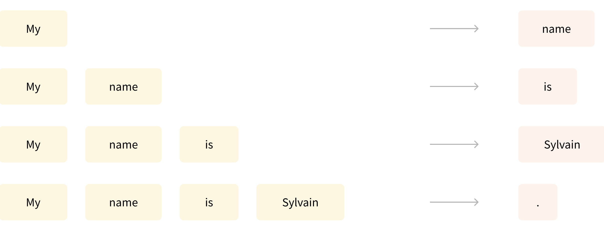

別の例は *マスク言語モデリング* で、モデルが文中のマスクされた単語を予測します。

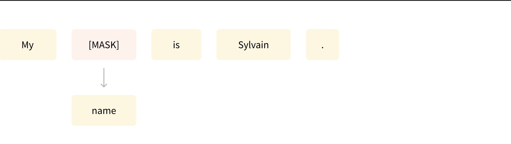

### Transformersは大きなモデルである

いくつかの外れ値（DistilBERTなど）を除いて、より良い性能を達成する一般的な戦略は、モデルのサイズと事前訓練されるデータの量を増やすことです。

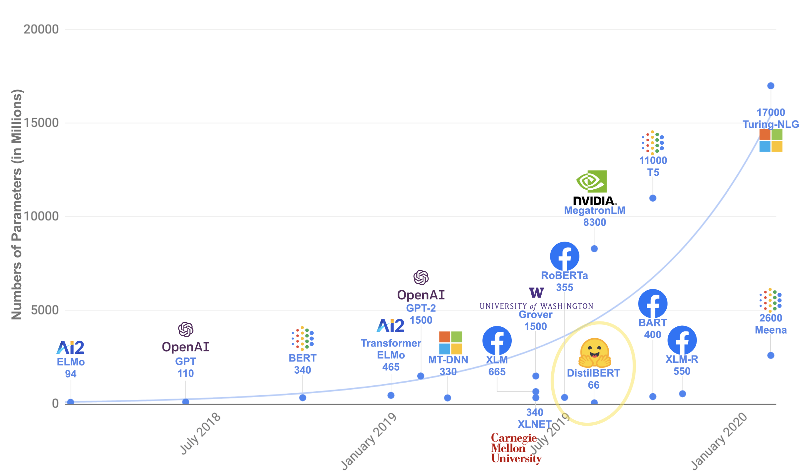

残念ながら、モデル、特に大きなモデルの訓練には大量のデータが必要です。これは時間と計算リソースの点で非常にコストがかかります。以下のグラフで見ることができるように、環境への影響にも変換されます。

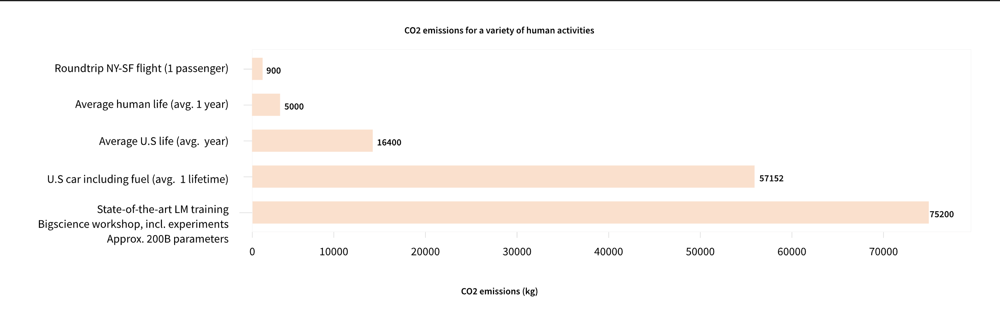

### 転移学習

*事前訓練* は、モデルをゼロから訓練する行為です：重みがランダムに初期化され、事前の知識なしに訓練が開始されます。

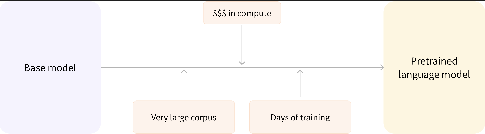

この事前訓練は通常、非常に大量のデータで行われます。したがって、非常に大きなデータコーパスが必要で、訓練には数週間かかることがあります。

一方、*ファインチューニング* は、モデルが事前訓練された **後** に行われる訓練です。ファインチューニングを実行するには、まず事前訓練済み言語モデルを取得し、次にタスクに固有のデータセットで追加の訓練を実行します。待って―なぜ最初から最終用途のためにモデルを訓練しない（**スクラッチから**）のでしょうか？いくつかの理由があります：

* 事前訓練済みモデルは、ファインチューニングデータセットと類似性のあるデータセットで既に訓練されています。したがって、ファインチューニングプロセスは、事前訓練中に初期モデルが取得した知識を活用できます（例えば、NLP問題では、事前訓練済みモデルはタスクに使用している言語のある種の統計的理解を持っているでしょう）。
* 事前訓練済みモデルは既に多くのデータで訓練されているため、ファインチューニングは良い結果を得るためにはるかに少ないデータを必要とします。
* 同じ理由で、良い結果を得るのに必要な時間とリソースの量ははるかに少なくなります。

例えば、英語で訓練された事前訓練済みモデルを活用し、次にarXivコーパスでファインチューニングして、科学／研究ベースのモデルを作ることができます。ファインチューニングには限られた量のデータのみが必要です：事前訓練済みモデルが取得した知識が「転移」されるため、*転移学習* という用語が使われます。

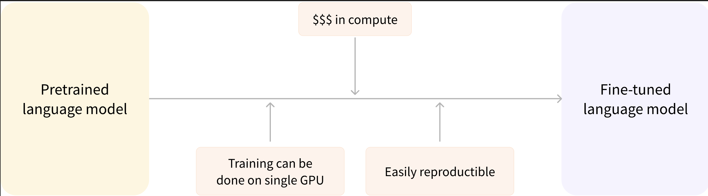

したがって、モデルのファインチューニングは、時間、データ、金銭、環境のコストが低くなります。完全な事前訓練よりも制約が少ないため、異なるファインチューニングスキームで反復することも、より迅速で簡単です。

このプロセスは、スクラッチから訓練するよりも良い結果を達成します（大量のデータがない限り）。そのため、常に事前訓練済みモデル―手元のタスクにできるだけ近いモデル―を活用し、それをファインチューニングする必要があります。

### 一般的なTransformerアーキテクチャ

このセクションでは、Transformerモデルの一般的なアーキテクチャを概観します。いくつかの概念を理解できなくても心配しないでください；各構成要素を詳しく説明するセクションが後にあります。

モデルは主に2つのブロックで構成されています：
* **エンコーダ（左）**: エンコーダは入力を受け取り、その表現（特徴）を構築します。これは、モデルが入力から理解を獲得するように最適化されていることを意味します。
* **デコーダ（右）**: デコーダは、エンコーダの表現（特徴）を他の入力と一緒に使用して、ターゲットシーケンスを生成します。これは、モデルが出力を生成するように最適化されていることを意味します。

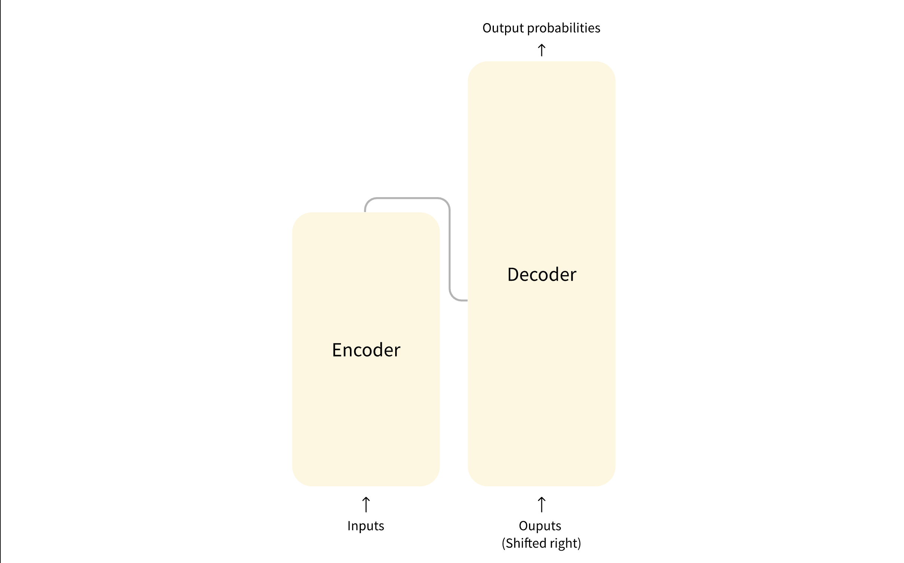

これらの各部分は、タスクに応じて独立して使用できます：

* **エンコーダのみのモデル**: 文分類や固有表現認識など、入力の理解を必要とするタスクに適している。
* **デコーダのみのモデル**: テキスト生成などの生成タスクに適している。
* **エンコーダ・デコーダモデル** または **sequence-to-sequenceモデル**: 翻訳や要約など、入力を必要とする生成タスクに適している。

後のセクションでこれらのアーキテクチャを独立して詳しく掘り下げます。

#### アテンション層

Transformerモデルの重要な特徴は、*アテンション層* と呼ばれる特別な層で構築されていることです。実際、Transformerアーキテクチャを導入した論文のタイトルは["Attention Is All You Need"](https://arxiv.org/abs/1706.03762)でした！アテンション層の詳細についてはコースの後半で探求します；今知っておく必要があるのは、この層がモデルに対し、渡された文中の特定の単語に特定の注意を払う（そして他の単語をある程度無視する）ように指示することです。各単語の表現を扱うときです。

これを文脈に入れるために、英語からフランス語にテキストを翻訳するタスクを考えてみましょう。「You like this course」という入力が与えられたとき、翻訳モデルは「like」という単語の適切な翻訳を得るために隣接する「You」という単語にも注意を払う必要があります。なぜなら、フランス語では動詞「like」は主語によって異なる活用をするからです。しかし、文の残りの部分はその単語の翻訳には有用ではありません。同じように、「this」を翻訳するとき、モデルは「course」という単語にも注意を払う必要があります。なぜなら、「this」は関連する名詞が男性形か女性形かによって異なって翻訳されるからです。再び、文中の他の単語は「course」の翻訳には関係ありません。より複雑な文（そしてより複雑な文法規則）では、モデルは各単語を適切に翻訳するために、文中のさらに離れた場所にある単語に特別な注意を払う必要があります。

同じ概念が自然言語に関連する任意のタスクに適用されます：単語それ自体に意味がありますが、その意味は文脈によって深く影響を受けます。文脈とは、研究されている単語の前または後にある他の任意の単語（複数可）です。

これで、アテンション層が何であるかのアイデアを得たので、Transformerアーキテクチャをより詳しく見てみましょう。

#### 元のアーキテクチャ

Transformerアーキテクチャは当初翻訳のために設計されました。訓練中、エンコーダは特定の言語で入力（文）を受け取り、デコーダは希望するターゲット言語で同じ文を受け取ります。エンコーダでは、アテンション層は文中のすべての単語を使用できます（今見たように、与えられた単語の翻訳は、文中のその前にも後にもあるものに依存する可能性があるため）。しかし、デコーダは順次動作し、既に翻訳した文中の単語のみに注意を払うことができます（つまり、現在生成されている単語より前の単語のみ）。例えば、翻訳されたターゲットの最初の3つの単語を予測したとき、それらをデコーダに与え、デコーダはエンコーダのすべての入力を使用して4番目の単語を予測しようとします。

訓練中に速度を上げるため（モデルがターゲット文にアクセスできるとき）、デコーダには全体のターゲットが供給されますが、将来の単語を使用することは許可されません（位置2の単語を予測しようとするときに位置2の単語にアクセスできれば、問題はそれほど困難ではないでしょう！）。例えば、4番目の単語を予測しようとするとき、アテンション層は位置1から3の単語のみにアクセスできます。

元のTransformerアーキテクチャは次のようになっており、エンコーダが左側、デコーダが右側にあります：

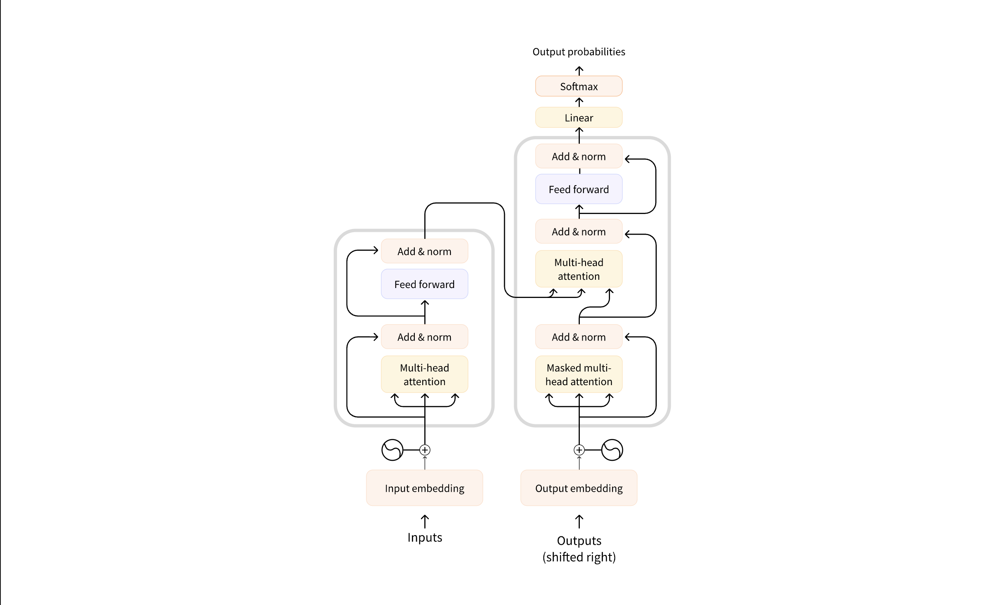

デコーダブロック内の最初のアテンション層は、デコーダへのすべての（過去の）入力に注意を払いますが、2番目のアテンション層はエンコーダの出力を使用することに注意してください。したがって、現在の単語を最適に予測するために、入力文全体にアクセスできます。これは、異なる言語が異なる順序で単語を配置する文法規則を持つ可能性があるため、または文中で後に提供される一部の文脈が与えられた単語の最適な翻訳を決定するのに役立つ可能性があるため、非常に有用です。

*アテンションマスク* は、エンコーダ／デコーダでモデルが特定の特別な単語に注意を払うことを防ぐためにも使用できます―例えば、文を一緒にバッチ処理するときにすべての入力を同じ長さにするために使用される特別なパディング単語です。

#### アーキテクチャ vs. チェックポイント

このコースでTransformerモデルに掘り下げるとき、*アーキテクチャ* と *チェックポイント* および *モデル* の言及を見るでしょう。これらの用語はすべて若干異なる意味を持ちます：

* **アーキテクチャ**: これはモデルの骨格です―モデル内で発生する各層と各操作の定義。
* **チェックポイント**: これらは、与えられたアーキテクチャに読み込まれる重みです。
* **モデル**: これは「アーキテクチャ」や「チェックポイント」ほど正確ではない包括的な用語です：両方を意味する可能性があります。このコースでは、曖昧さを減らすために重要な場合は *アーキテクチャ* または *チェックポイント* を指定します。

例えば、BERTはアーキテクチャであり、`bert-base-cased`はBERTの最初のリリースでGoogleチームによって訓練された重みのセットでチェックポイントです。しかし、「BERTモデル」や「`bert-base-cased`モデル」と言うことができます。

## Transformersがタスクを解決する方法

[Transformers でできること] では、自然言語処理（NLP）、音声と音響、コンピュータビジョンタスク、およびそれらの重要な応用について学びました。このページでは、モデルがこれらのタスクをどのように解決するかを詳しく見て、内部で何が起こっているかを説明します。与えられたタスクを解決する方法は多くありますが、一部のモデルは特定の技術を実装したり、新しい角度からタスクにアプローチしたりする可能性がありますが、Transformerモデルでは一般的なアイデアは同じです。その柔軟なアーキテクチャのおかげで、ほとんどのモデルはエンコーダ、デコーダ、またはエンコーダ・デコーダ構造のバリアントです。

タスクがどのように解決されるかを説明するために、有用な予測を出力するためにモデル内で何が起こるかを詳しく見ていきます。以下のモデルとそれに対応するタスクをカバーします：

- 音声分類と自動音声認識（ASR）のための[Wav2Vec2](https://huggingface.co/docs/transformers/model_doc/wav2vec2)
- 画像分類のための[Vision Transformer (ViT)](https://huggingface.co/docs/transformers/model_doc/vit)と[ConvNeXT](https://huggingface.co/docs/transformers/model_doc/convnext)
- 物体検出のための[DETR](https://huggingface.co/docs/transformers/model_doc/detr)
- 画像セグメンテーションのための[Mask2Former](https://huggingface.co/docs/transformers/model_doc/mask2former)
- 深度推定のための[GLPN](https://huggingface.co/docs/transformers/model_doc/glpn)
- エンコーダを使用するテキスト分類、トークン分類、質問応答などのNLPタスクのための[BERT](https://huggingface.co/docs/transformers/model_doc/bert)
- デコーダを使用するテキスト生成などのNLPタスクのための[GPT2](https://huggingface.co/docs/transformers/model_doc/gpt2)
- エンコーダ・デコーダを使用する要約や翻訳などのNLPタスクのための[BART](https://huggingface.co/docs/transformers/model_doc/bart)

### 言語用のTransformerモデル

言語モデルは現代のNLPの核心にあります。これらは、テキスト内の単語やトークン間の統計的パターンと関係を学習することで、人間の言語を理解し生成するように設計されています。

Transformerは当初機械翻訳のために設計され、それ以来、すべてのAIタスクを解決するためのデフォルトアーキテクチャになりました。一部のタスクはTransformerのエンコーダ構造に適しており、他のタスクはデコーダにより適しています。さらに他のタスクは、Transformerのエンコーダ・デコーダ構造の両方を利用します。

#### 言語モデルの動作方法

言語モデルは、周囲の単語の文脈が与えられた単語の確率を予測するように訓練されることで動作します。これにより、他のタスクに一般化できる言語の基本的な理解が得られます。

Transformerモデルを訓練するための2つの主要なアプローチがあります：

1. **マスク言語モデリング（MLM）**: BERTなどのエンコーダモデルで使用されるこのアプローチは、入力の一部のトークンをランダムにマスクし、周囲の文脈に基づいて元のトークンを予測するようにモデルを訓練します。これにより、モデルは双方向の文脈を学習できます（マスクされた単語の前後の単語を見る）。

2. **因果言語モデリング（CLM）**: GPTなどのデコーダモデルで使用されるこのアプローチは、シーケンス内のすべての前のトークンに基づいて次のトークンを予測します。モデルは左からの文脈（前のトークン）のみを使用して次のトークンを予測できます。

#### 言語モデルの種類

Transformersライブラリでは、言語モデルは一般的に3つのアーキテクチャカテゴリに分類されます：

1. **エンコーダのみのモデル**（BERTなど）: これらのモデルは双方向アプローチを使用して両方向からの文脈を理解します。分類、固有表現認識、質問応答など、テキストの深い理解を必要とするタスクに最適です。

2. **デコーダのみのモデル**（GPT、Llamaなど）: これらのモデルはテキストを左から右に処理し、テキスト生成タスクに特に優れています。文を完成させたり、エッセイを書いたり、プロンプトに基づいてコードを生成したりできます。

3. **エンコーダ・デコーダモデル**（T5、BARTなど）: これらのモデルは両方のアプローチを組み合わせ、エンコーダを使用して入力を理解し、デコーダを使用して出力を生成します。翻訳、要約、質問応答などのsequence-to-sequenceタスクに優れています。

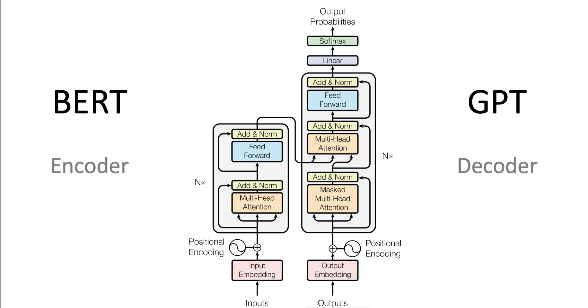

前のセクションでカバーしたように、言語モデルは通常、大量のテキストデータで自己教師あり方式（人間のアノテーションなし）で事前訓練され、次に特定のタスクでファインチューニングされます。転移学習として知られるこのアプローチにより、これらのモデルは比較的少量のタスク固有データで多くの異なるNLPタスクに適応できます。

以下のセクションでは、特定のモデルアーキテクチャと、それらが音声、ビジョン、テキストドメインの様々なタスクにどのように適用されるかを探求します。

!!! tip "豆知識"
    特定のNLPタスクに最適なTransformerアーキテクチャ（エンコーダ、デコーダ、または両方）のどの部分かを理解することは、適切なモデルを選択するために重要です。一般的に、双方向の文脈を必要とするタスクはエンコーダを使用し、テキストを生成するタスクはデコーダを使用し、あるシーケンスを別のシーケンスに変換するタスクはエンコーダ・デコーダを使用します。

#### テキスト生成

テキスト生成は、プロンプトや入力に基づいて一貫性があり文脈に関連するテキストを作成することを含みます。

[GPT-2](https://huggingface.co/docs/transformers/model_doc/gpt2)は、大量のテキストで事前訓練されたデコーダのみのモデルです。プロンプトが与えられると説得力のある（ただし常に真実ではない！）テキストを生成し、明示的に訓練されていないにもかかわらず質問応答などの他のNLPタスクを完了できます。

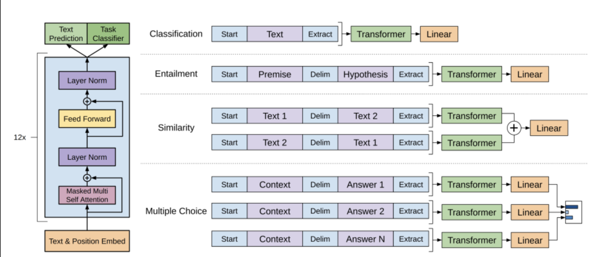

1. GPT-2は[バイトペア符号化（BPE）](https://huggingface.co/docs/transformers/tokenizer_summary#bytepair-encoding-bpe)を使用して単語をトークン化し、トークン埋め込みを生成します。位置符号化がトークン埋め込みに追加され、シーケンス内の各トークンの位置を示します。入力埋め込みは複数のデコーダブロックを通過して、最終的な隠れ状態を出力します。各デコーダブロック内で、GPT-2は *マスクされた自己アテンション* 層を使用します。これは、GPT-2が将来のトークンに注意を払うことができないことを意味します。左側のトークンのみに注意を払うことが許可されています。これは、マスクされた自己アテンションでは、将来のトークンのスコアを`0`に設定するためにアテンションマスクが使用されるため、BERTの[`mask`]トークンとは異なります。

2. デコーダからの出力は言語モデリングヘッドに渡され、隠れ状態をロジットに変換するために線形変換を実行します。ラベルは、ロジットを右に1つシフトすることで作成されるシーケンス内の次のトークンです。クロスエントロピー損失がシフトされたロジットとラベルの間で計算され、次の最も可能性の高いトークンを出力します。

GPT-2の事前訓練目的は完全に[因果言語モデリング](https://huggingface.co/docs/transformers/glossary#causal-language-modeling)に基づいており、シーケンス内の次の単語を予測します。これにより、GPT-2はテキストを生成するタスクに特に優れています。

テキスト生成に挑戦する準備はできましたか？完全な[因果言語モデリングガイド](https://huggingface.co/docs/transformers/tasks/language_modeling#causal-language-modeling)をチェックして、DistilGPT-2をファインチューニングし、推論に使用する方法を学びましょう！

#### テキスト分類

テキスト分類は、感情分析、トピック分類、スパム検出など、テキスト文書を事前定義されたカテゴリに割り当てることを含みます。

[BERT](https://huggingface.co/docs/transformers/model_doc/bert)はエンコーダのみのモデルで、深い双方向性を効果的に実装し、両側の単語に注意を払うことでテキストのより豊かな表現を学習した最初のモデルです。

1. BERTは[WordPiece](https://huggingface.co/docs/transformers/tokenizer_summary#wordpiece)トークナイゼーションを使用してテキストのトークン埋め込みを生成します。単一の文と文のペアを区別するために、特別な`[SEP]`トークンが追加されて区別されます。特別な`[CLS]`トークンがすべてのテキストシーケンスの最初に追加されます。`[CLS]`トークンを持つ最終出力は、分類タスクの分類ヘッドへの入力として使用されます。BERTは、トークンが文のペアの最初または2番目の文に属するかを示すためにセグメント埋め込みも追加します。

2. BERTは2つの目的で事前訓練されます：マスク言語モデリングと次文予測です。マスク言語モデリングでは、入力トークンのある割合がランダムにマスクされ、モデルはこれらを予測する必要があります。これは双方向性の問題を解決します。モデルがすべての単語を見て次の単語を「予測」できる場合、チートできます。予測されたマスクトークンの最終隠れ状態は、語彙上のソフトマックスを持つフィードフォワードネットワークに渡され、マスクされた単語を予測します。

    2番目の事前訓練目的は次文予測です。モデルは文Bが文Aに続くかどうかを予測する必要があります。半分の時間で文Bは次の文であり、残りの半分の時間では、文Bはランダムな文です。次の文かどうかの予測は、2つのクラス（`IsNext`と`NotNext`）上のソフトマックスを持つフィードフォワードネットワークに渡されます。

3. 入力埋め込みは複数のエンコーダ層を通過して、最終的な隠れ状態を出力します。

事前訓練済みモデルをテキスト分類に使用するには、ベースBERTモデルの上にシーケンス分類ヘッドを追加します。シーケンス分類ヘッドは、最終隠れ状態を受け入れ、それらをロジットに変換するために線形変換を実行する線形層です。クロスエントロピー損失がロジットとターゲットの間で計算され、最も可能性の高いラベルを見つけます。

テキスト分類に挑戦する準備はできましたか？完全な[テキスト分類ガイド](https://huggingface.co/docs/transformers/tasks/sequence_classification)をチェックして、DistilBERTをファインチューニングし、推論に使用する方法を学びましょう！

#### トークン分類

トークン分類は、固有表現認識や品詞タグ付けなど、シーケンス内の各トークンにラベルを割り当てることを含みます。

固有表現認識（NER）などのトークン分類タスクにBERTを使用するには、ベースBERTモデルの上にトークン分類ヘッドを追加します。トークン分類ヘッドは、最終隠れ状態を受け入れ、それらをロジットに変換するために線形変換を実行する線形層です。クロスエントロピー損失がロジットと各トークンの間で計算され、最も可能性の高いラベルを見つけます。

トークン分類に挑戦する準備はできましたか？完全な[トークン分類ガイド](https://huggingface.co/docs/transformers/tasks/token_classification)をチェックして、DistilBERTをファインチューニングし、推論に使用する方法を学びましょう！

#### 質問応答

質問応答は、与えられた文脈や章内で質問への答えを見つけることを含みます。

質問応答にBERTを使用するには、ベースBERTモデルの上にスパン分類ヘッドを追加します。この線形層は最終隠れ状態を受け入れ、答えに対応する`span`開始と終了ロジットを計算するために線形変換を実行します。クロスエントロピー損失がロジットとラベル位置の間で計算され、答えに対応するテキストの最も可能性の高いスパンを見つけます。

質問応答に挑戦する準備はできましたか？完全な[質問応答ガイド](https://huggingface.co/docs/transformers/tasks/question_answering)をチェックして、DistilBERTをファインチューニングし、推論に使用する方法を学びましょう！

!!! tip "豆知識"
    💡 BERTが事前訓練されると、異なるタスクに使用するのがいかに簡単かに注目してください。事前訓練済みモデルに特定のヘッドを追加して、隠れ状態を希望する出力に操作するだけです！

#### 要約

要約は、キー情報と意味を保持しながら、より長いテキストをより短いバージョンに凝縮することを含みます。

[BART](https://huggingface.co/docs/transformers/model_doc/bart)や[T5](model_doc/t5)などのエンコーダ・デコーダモデルは、要約タスクのsequence-to-sequenceパターン用に設計されています。このセクションでBARTがどのように動作するかを説明し、最後にT5をファインチューニングしてみることができます。

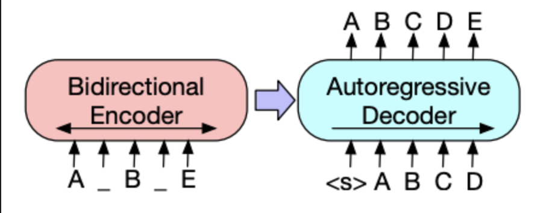

1. BARTのエンコーダアーキテクチャはBERTと非常に似ており、テキストのトークンと位置埋め込みを受け入れます。BARTは入力を破損させ、次にデコーダでそれを再構築することで事前訓練されます。特定の破損戦略を持つ他のエンコーダとは異なり、BARTは任意のタイプの破損を適用できます。ただし、*テキスト埋込み*破損戦略が最も効果的です。テキスト埋込みでは、多数のテキストスパンが **単一の** [`mask`]トークンに置き換えられます。これは重要です。なぜなら、モデルはマスクされたトークンを予測する必要があり、モデルに欠落したトークンの数を予測することを教えるからです。入力埋め込みとマスクされたスパンはエンコーダを通過して最終隠れ状態を出力しますが、BERTとは異なり、BARTは最後に単語を予測するための最終フィードフォワードネットワークを追加しません。

2. エンコーダの出力はデコーダに渡され、デコーダはエンコーダの出力からマスクされたトークンと任意の破損していないトークンを予測する必要があります。これにより、デコーダが元のテキストを復元するのに役立つ追加の文脈が提供されます。デコーダからの出力は言語モデリングヘッドに渡され、隠れ状態をロジットに変換するために線形変換を実行します。クロスエントロピー損失がロジットとラベルの間で計算されます。ラベルは右に1つシフトされただけのトークンです。

要約に挑戦する準備はできましたか？完全な[要約ガイド](https://huggingface.co/docs/transformers/tasks/summarization)をチェックして、T5をファインチューニングし、推論に使用する方法を学びましょう！

#### 翻訳

翻訳は、意味を保持しながらテキストをある言語から別の言語に変換することを含みます。翻訳は、[BART](https://huggingface.co/docs/transformers/model_doc/bart)や[T5](model_doc/t5)などのエンコーダ・デコーダモデルを使用できるsequence-to-sequenceタスクのもう一つの例です。このセクションでBARTがどのように動作するかを説明し、最後にT5をファインチューニングしてみることができます。

BARTは、ソース言語をターゲット言語にデコードできる入力にマップするために、別個のランダムに初期化されたエンコーダを追加することで翻訳に適応します。この新しいエンコーダの埋め込みは、元の単語埋め込みの代わりに事前訓練済みエンコーダに渡されます。ソースエンコーダは、ソースエンコーダ、位置埋め込み、入力埋め込みをモデル出力からのクロスエントロピー損失で更新することで訓練されます。モデルパラメータはこの最初のステップで凍結され、すべてのモデルパラメータが2番目のステップで一緒に訓練されます。

BARTは、多くの異なる言語で事前訓練された翻訳を目的とした多言語バージョンであるmBARTによってその後フォローアップされています。

翻訳に挑戦する準備はできましたか？完全な[翻訳ガイド](https://huggingface.co/docs/transformers/tasks/translation)をチェックして、T5をファインチューニングし、推論に使用する方法を学びましょう！

!!! tip "豆知識"
    このガイド全体で見てきたように、多くのモデルは異なるタスクに対処するにもかかわらず、類似のパターンに従います。これらの共通パターンを理解することで、新しいモデルがどのように動作するかを素早く把握し、既存のモデルを特定のニーズに適応させることができます。

### テキストを超えたモダリティ

Transformerはテキストに限定されません。音声、画像、ビデオなど、他のモダリティにも適用できます。もちろん、このコースではテキストに焦点を当てますが、他のモダリティを簡単に紹介できます。

#### 音声と音響

まず、テキストや画像と比較して独特の課題を提示する音声と音響データをTransformerモデルがどのように処理するかを探求しましょう。

[Whisper](https://huggingface.co/docs/transformers/main/en/model_doc/whisper)は、68万時間のラベル付き音声データで事前訓練されたエンコーダ・デコーダ（sequence-to-sequence）transformerです。この大量の事前訓練データにより、英語や多くの他の言語での音声タスクでゼロショット性能が可能になります。デコーダにより、Whisperはエンコーダが学習した音声表現を、追加のファインチューニングなしでテキストなどの有用な出力にマップできます。Whisperはそのまま動作します。

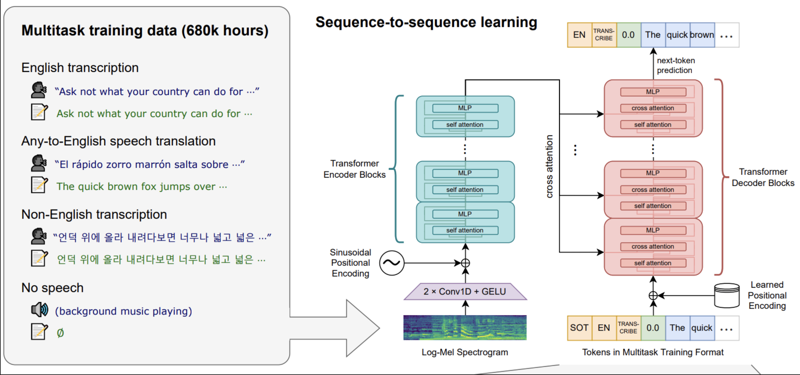

図は[Whisper論文](https://huggingface.co/papers/2212.04356)からです。

このモデルには2つの主要な構成要素があります：

1. **エンコーダ**は入力音声を処理します。生音声は最初にlog-Melスペクトログラムに変換されます。このスペクトログラムは次にTransformerエンコーダネットワークを通過します。

2. **デコーダ**は符号化された音声表現を取得し、対応するテキストトークンを自己回帰的に予測します。これは、前のトークンとエンコーダ出力が与えられた次のテキストトークンを予測するように訓練された標準のTransformerデコーダです。特別なトークンがデコーダ入力の開始時に使用され、転写、翻訳、言語識別などの特定のタスクに向けてモデルを誘導します。

Whisperは、ウェブから収集された68万時間のラベル付き音声データの大規模で多様なデータセットで事前訓練されました。この大規模で弱い監督の事前訓練が、多くの言語とタスクにわたる強力なゼロショット性能の鍵です。

Whisperが事前訓練されたので、ゼロショット推論に直接使用するか、特定のタスクでの性能向上のためにデータでファインチューニングできます。自動音声認識や音声翻訳などです！

!!! tip "豆知識"
    Whisperの重要な革新は、インターネットからの多様で弱い監督の音声データでの前例のない規模での訓練です。これにより、タスク固有のファインチューニングなしで異なる言語、アクセント、タスクに驚くほどよく一般化できます。

#### 自動音声認識

自動音声認識に事前訓練済みモデルを使用するには、完全なエンコーダ・デコーダ構造を活用します。エンコーダが音声入力を処理し、デコーダがトークンごとに自己回帰的に転写を生成します。ファインチューニング時、モデルは通常、音声入力に基づいて正しいテキストトークンを予測するために標準のsequence-to-sequence損失（クロスエントロピーなど）を使用して訓練されます。

推論にファインチューニングされたモデルを使用する最も簡単な方法は、`pipeline`内です。

```python
from transformers import pipeline

transcriber = pipeline(
    task="automatic-speech-recognition", model="openai/whisper-base.en"
)
transcriber("https://huggingface.co/datasets/Narsil/asr_dummy/resolve/main/mlk.flv")
```

**実行結果：**
```
Device set to use mps:0
{'text': ' I have a dream that one day this nation will rise up and live out the truemeaning of its creed.'}
```

自動音声認識に挑戦する準備はできましたか？完全な[自動音声認識ガイド](https://huggingface.co/docs/transformers/tasks/asr)をチェックして、Whisperをファインチューニングし、推論に使用する方法を学びましょう！

#### コンピュータビジョン

次に、画像やビデオからの視覚情報を理解し解釈することを扱うコンピュータビジョンタスクに移りましょう。

コンピュータビジョンタスクにアプローチする2つの方法があります：

1. 画像をパッチのシーケンスに分割し、Transformerで並列に処理する。
2. [ConvNeXT](https://huggingface.co/docs/transformers/model_doc/convnext)などの現代的なCNNを使用する。これは畳み込み層に依存しますが、現代のネットワーク設計を採用しています。

!!! tip "豆知識"
    3番目のアプローチは、Transformerと畳み込みを混合します（例：[Convolutional Vision Transformer](https://huggingface.co/docs/transformers/model_doc/cvt)や[LeViT](https://huggingface.co/docs/transformers/model_doc/levit)）。これらは、ここで検討する2つのアプローチを組み合わせるだけなので、議論しません。

ViTとConvNeXTは一般的に画像分類に使用されますが、物体検出、セグメンテーション、深度推定などの他のビジョンタスクについては、DETR、Mask2Former、GLPNをそれぞれ見ていきます；これらのモデルはそれらのタスクにより適しています。

#### 画像分類

画像分類は、基本的なコンピュータビジョンタスクの1つです。異なるモデルアーキテクチャがこの問題にどのようにアプローチするかを見てみましょう。

ViTとConvNeXTは両方とも画像分類に使用できます；主な違いは、ViTがアテンションメカニズムを使用するのに対し、ConvNeXTが畳み込みを使用することです。

[ViT](https://huggingface.co/docs/transformers/model_doc/vit)は畳み込みを純粋なTransformerアーキテクチャに完全に置き換えます。元のTransformerに慣れている場合、ViTを理解するのにほぼ到達しています。

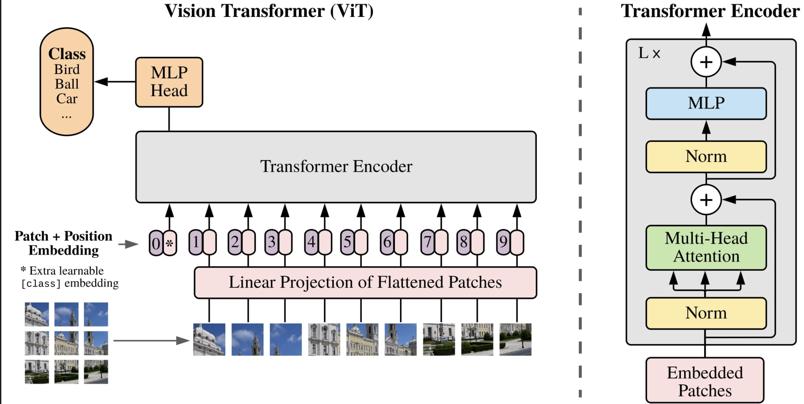

ViTが導入した主な変更は、画像がTransformerに供給される方法でした：

1. 画像は重複しない正方形のパッチに分割され、それぞれがベクトルまたは*パッチ埋め込み*に変換されます。パッチ埋め込みは、適切な入力次元（ベースTransformerでは各パッチ埋め込みに768値）を作成する畳み込み2D層から生成されます。224x224ピクセルの画像があった場合、196個の16x16画像パッチに分割できます。テキストが単語にトークン化されるのと同じように、画像はパッチのシーケンスに「トークン化」されます。

2. *学習可能な埋め込み* - BERTと同じような特別な`[CLS]`トークン - がパッチ埋め込みの最初に追加されます。`[CLS]`トークンの最終隠れ状態は、付属の分類ヘッドへの入力として使用されます；他の出力は無視されます。このトークンは、モデルが画像の表現を符号化する方法を学習するのに役立ちます。

3. パッチと学習可能な埋め込みに追加する最後のものは*位置埋め込み*です。なぜなら、モデルは画像パッチがどのように順序付けられているかを知らないからです。位置埋め込みも学習可能で、パッチ埋め込みと同じサイズを持ちます。最後に、すべての埋め込みがTransformerエンコーダに渡されます。

4. 出力、具体的には`[CLS]`トークンを持つ出力のみが、多層パーセプトロンヘッド（MLP）に渡されます。ViTの事前訓練目的は単純に分類です。他の分類ヘッドと同様に、MLPヘッドは出力をクラスラベル上のロジットに変換し、最も可能性の高いクラスを見つけるためにクロスエントロピー損失を計算します。

画像分類に挑戦する準備はできましたか？完全な[画像分類ガイド](https://huggingface.co/docs/transformers/tasks/image_classification)をチェックして、ViTをファインチューニングし、推論に使用する方法を学びましょう！

!!! tip "豆知識"
    ViTとBERTの類似性に注目してください：両方とも全体的な表現をキャプチャするために特別なトークン（`[CLS]`）を使用し、両方とも埋め込みに位置情報を追加し、両方ともTransformerエンコーダを使用してトークン/パッチのシーケンスを処理します。

## Transformerアーキテクチャ

以前のセクションでは、一般的なTransformerアーキテクチャを紹介し、これらのモデルが様々なタスクをどのように解決できるかを探求しました。次に、Transformerモデルの3つの主要なアーキテクチャバリアントを詳しく見て、それぞれをいつ使用するかを理解しましょう。それから、これらのアーキテクチャが異なる言語タスクにどのように適用されるかを見ました。

このセクションでは、Transformerモデルの3つの主要なアーキテクチャバリアントをより深く掘り下げ、それぞれをいつ使用するかを理解します。

!!! tip "豆知識"
    ほとんどのTransformerモデルは3つのアーキテクチャの1つを使用することを覚えておいてください：エンコーダのみ、デコーダのみ、またはエンコーダ・デコーダ（sequence-to-sequence）。これらの違いを理解することで、特定のタスクに適したモデルを選択するのに役立ちます。

### エンコーダモデル

エンコーダモデルは、Transformerモデルのエンコーダのみを使用します。各段階で、アテンション層は初期文中のすべての単語にアクセスできます。これらのモデルはしばしば「双方向」アテンションを持つと特徴付けられ、しばしば*自己符号化モデル*と呼ばれます。

これらのモデルの事前訓練は通常、与えられた文を何らかの方法で破損させ（例えば、その中のランダムな単語をマスクすることで）、モデルに初期文を見つけるか再構築するタスクを与えることを中心に展開されます。

エンコーダモデルは、文分類、固有表現認識（より一般的には単語分類）、抽出的質問応答など、完全な文の理解を必要とするタスクに最適です。

このモデルファミリーの代表には以下が含まれます：

- [BERT](https://huggingface.co/docs/transformers/model_doc/bert)
- [DistilBERT](https://huggingface.co/docs/transformers/model_doc/distilbert)
- [ModernBERT](https://huggingface.co/docs/transformers/en/model_doc/modernbert)

### デコーダモデル

デコーダモデルは、Transformerモデルのデコーダのみを使用します。各段階で、与えられた単語について、アテンション層は文中でその前に位置する単語のみにアクセスできます。これらのモデルはしばしば*自己回帰モデル*と呼ばれます。

デコーダモデルの事前訓練は通常、文中の次の単語を予測することを中心に展開されます。

これらのモデルは、テキスト生成を含むタスクに最適です。

このモデルファミリーの代表には以下が含まれます：

- [Hugging Face SmolLMシリーズ](https://huggingface.co/HuggingFaceTB/SmolLM2-1.7B-Instruct)
- [MetaのLlamaシリーズ](https://huggingface.co/docs/transformers/en/model_doc/llama4)
- [GoogleのGemmaシリーズ](https://huggingface.co/docs/transformers/main/en/model_doc/gemma3)
- [DeepSeekのV3](https://huggingface.co/deepseek-ai/DeepSeek-V3)

#### 現代の大規模言語モデル（LLM）

ほとんどの現代の大規模言語モデル（LLM）は、デコーダのみのアーキテクチャを使用します。これらのモデルは、過去数年間でサイズと能力が劇的に成長し、最大のモデルの一部は数千億のパラメータを含んでいます。

現代のLLMは通常、2つの段階で訓練されます：
1. **事前訓練**: モデルは膨大な量のテキストデータで次のトークンを予測することを学習します
2. **指示チューニング**: モデルは指示に従い、有用な応答を生成するようにファインチューニングされます

このアプローチにより、幅広いトピックとタスクにわたって人間のようなテキストを理解し生成できるモデルが生まれました。

#### 現代のLLMの主要能力

現代のデコーダベースのLLMは印象的な能力を示しています：

| 能力 | 説明 | 例 |
|------|-----|---|
| テキスト生成 | 一貫性があり文脈に関連するテキストの作成 | エッセイ、ストーリー、メールの執筆 |
| 要約 | 長い文書のより短いバージョンの作成 | レポートのエグゼクティブサマリーの作成 |
| 翻訳 | 言語間でのテキストの変換 | 英語からスペイン語への翻訳 |
| 質問応答 | 事実に関する質問への答えの提供 | 「フランスの首都は何ですか？」 |
| コード生成 | コードスニペットの書き込みや完成 | 説明に基づいた関数の作成 |
| 推論 | 問題を段階的に解決 | 数学問題や論理パズルの解決 |
| 少ショット学習 | プロンプト内の少数の例からの学習 | 2-3例を見た後のテキスト分類 |

HubのモデルリポジトリページでデコーダベースのLLMを直接ブラウザで試すことができます。以下は古典的な[GPT-2](https://huggingface.co/openai-community/gpt2)（OpenAIの最高のオープンソースモデル！）の例です。

### Sequence-to-sequenceモデル

エンコーダ・デコーダモデル（*sequence-to-sequenceモデル*とも呼ばれる）は、Transformerアーキテクチャの両方の部分を使用します。各段階で、エンコーダのアテンション層は初期文中のすべての単語にアクセスできるのに対し、デコーダのアテンション層は入力内の与えられた単語より前に位置する単語のみにアクセスできます。

これらのモデルの事前訓練は異なる形を取ることができますが、しばしば入力が何らかの方法で破損された文を再構築することを含みます（例えば、ランダムな単語をマスクすることで）。T5モデルの事前訓練は、ランダムなテキストスパン（複数の単語を含むことができる）を単一のマスク特別トークンに置き換えることで構成され、タスクはこのマスクトークンが置き換えるテキストを予測することです。

Sequence-to-sequenceモデルは、要約、翻訳、生成的質問応答など、与えられた入力に応じて新しい文を生成することを中心とするタスクに最適です。

#### 実用的な応用

Sequence-to-sequenceモデルは、意味を保持しながらあるテキスト形式を別の形式に変換するタスクに優れています。いくつかの実用的な応用を以下に示します：

| 応用 | 説明 | 例のモデル |
|------|-----|-----------|
| 機械翻訳 | 言語間でのテキストの変換 | Marian、T5 |
| テキスト要約 | より長いテキストの簡潔な要約の作成 | BART、T5 |
| データからテキストへの生成 | 構造化データの自然言語への変換 | T5 |
| 文法修正 | テキストの文法エラーの修正 | T5 |
| 質問応答 | 文脈に基づいた答えの生成 | BART、T5 |

このモデルファミリーの代表には以下が含まれます：

- [BART](https://huggingface.co/docs/transformers/model_doc/bart)
- [mBART](https://huggingface.co/docs/transformers/model_doc/mbart)
- [Marian](https://huggingface.co/docs/transformers/model_doc/marian)
- [T5](https://huggingface.co/docs/transformers/model_doc/t5)

### 適切なアーキテクチャの選択

特定のNLPタスクで作業するとき、どのアーキテクチャを使用するかをどのように決定しますか？以下は簡単なガイドです：

| タスク | 推奨アーキテクチャ | 例 |
|------|------------------|---|
| テキスト分類（感情、トピック） | エンコーダ | BERT、RoBERTa |
| テキスト生成（創作執筆） | デコーダ | GPT、LLaMA |
| 翻訳 | エンコーダ・デコーダ | T5、BART |
| 要約 | エンコーダ・デコーダ | BART、T5 |
| 固有表現認識 | エンコーダ | BERT、RoBERTa |
| 質問応答（抽出的） | エンコーダ | BERT、RoBERTa |
| 質問応答（生成的） | エンコーダ・デコーダまたはデコーダ | T5、GPT |
| 会話AI | デコーダ | GPT、LLaMA |

!!! tip "豆知識"
    どのモデルを使用するか迷ったときは、以下を考慮してください：
    
    1. あなたのタスクはどのような理解を必要としますか？（双方向か単方向か）
    2. 新しいテキストを生成しているのか、既存のテキストを分析しているのか？
    3. あるシーケンスを別のシーケンスに変換する必要がありますか？
    
    これらの質問への答えが、適切なアーキテクチャに導いてくれます。 

### アテンションメカニズム

ほとんどのTransformerモデルは、アテンション行列が正方形であるという意味で完全なアテンションを使用します。長いテキストがあるときには、大きな計算ボトルネックになる可能性があります。LongformerやReformerは、より効率的になり、アテンション行列のスパース版を使用して訓練を高速化しようとするモデルです。

!!! tip "豆知識"
    標準的なアテンションメカニズムは、シーケンス長をnとしてO(n²)の計算複雑度を持ちます。これは非常に長いシーケンスでは問題になります。以下の特殊なアテンションメカニズムは、この制限に対処するのに役立ちます。

#### LSHアテンション

[Reformer](https://huggingface.co/docs/transformers/model_doc/reformer)はLSHアテンションを使用します。softmax(QK^t)では、行列QK^tの最大の要素（softmax次元で）のみが有用な貢献をします。したがって、Q内の各クエリqについて、qに近いK内のキーkのみを考慮できます。ハッシュ関数を使用してqとkが近いかどうかを判定します。アテンションマスクは現在のトークンをマスクするように修正されます（最初の位置を除く）。なぜなら、それはクエリとキーを等しくする（したがって非常に類似する）からです。ハッシュは少しランダムになる可能性があるため、実際には複数のハッシュ関数が使用され（n_roundsパラメータによって決定）、次に平均化されます。

#### ローカルアテンション

[Longformer](https://huggingface.co/docs/transformers/model_doc/longformer)はローカルアテンションを使用します：しばしば、ローカルコンテキスト（例えば、左右の2つのトークンは何か？）は与えられたトークンに対してアクションを取るのに十分です。また、小さなウィンドウを持つアテンション層を積み重ねることで、最後の層はウィンドウ内のトークンだけでなく、より多くの受容野を持ち、全体の文の表現を構築できます。

いくつかの事前選択された入力トークンにはグローバルアテンションも与えられます：これらの少数のトークンについて、アテンション行列はすべてのトークンにアクセスでき、このプロセスは対称的です：他のすべてのトークンはこれらの特定のトークンにアクセスできます（ローカルウィンドウ内のものに加えて）。これは論文の図2dに示されており、サンプルアテンションマスクについては以下を参照してください：

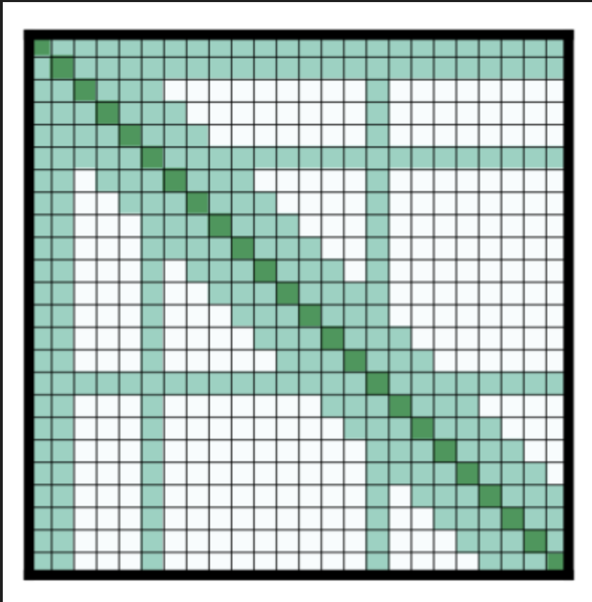

より少ないパラメータでこれらのアテンション行列を使用することで、モデルはより大きなシーケンス長を持つ入力を持つことができます。

#### 軸位置エンコーディング

#### 軸位置エンコーディング

[Reformer](https://huggingface.co/docs/transformers/model_doc/reformer)は軸位置エンコーディングを使用します：従来のTransformerモデルでは、位置エンコーディング$E$は$l \times d$のサイズの行列です。$l$はシーケンス長、$d$は隠れ状態の次元です。非常に長いテキストがある場合、この行列は巨大になり、GPU上で多くのスペースを占有する可能性があります。

これを軽減するために、軸位置エンコーディングは、その大きな行列$E$を2つのより小さな行列$E_1$と$E_2$に因数分解することで構成されます。次元は$l_1 \times d_1$と$l_2 \times d_2$で、以下の条件を満たします：

$l_1 \times l_2 = l$
$d_1 + d_2 = d$

長さの積により、これははるかに小さくなります。$E$内の時間ステップ$j$の埋め込みは、$E_1$内の時間ステップ$(j \bmod l_1)$と$E_2$内の$(j \div l_1)$の埋め込みを連結することで取得されます。

## まとめ

本記事では、Transformerモデルの基本概念から実装まで幅広く解説しました。自然言語処理の基礎から始まり、大規模言語モデルの台頭、そして具体的なタスクでの応用まで、現代のAI技術の核心となる技術について理解を深めることができました。

### 学習のポイント

- **NLPとLLMの違い**: NLPは広範な分野であり、LLMはその中の強力なサブセット
- **Transformerアーキテクチャ**: エンコーダ、デコーダ、エンコーダ・デコーダの3つの主要な構造
- **実践的応用**: パイプラインを使った簡単な実装から、特定タスクでのファインチューニングまで
- **モデル選択**: タスクの性質に応じた適切なアーキテクチャの選択方法
- **最新動向**: 現代のLLMの能力と制限、効率的なアテンションメカニズム

Transformerモデルは急速に発展している分野です。基本概念を理解することで、新しいモデルや技術にも対応できる基盤が築けるでしょう。実際にコードを実行し、様々なタスクでモデルを試すことで、より深い理解が得られます。