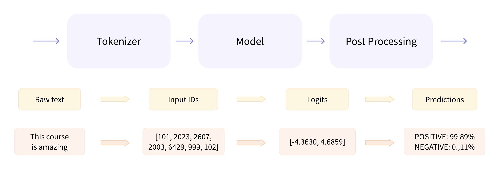
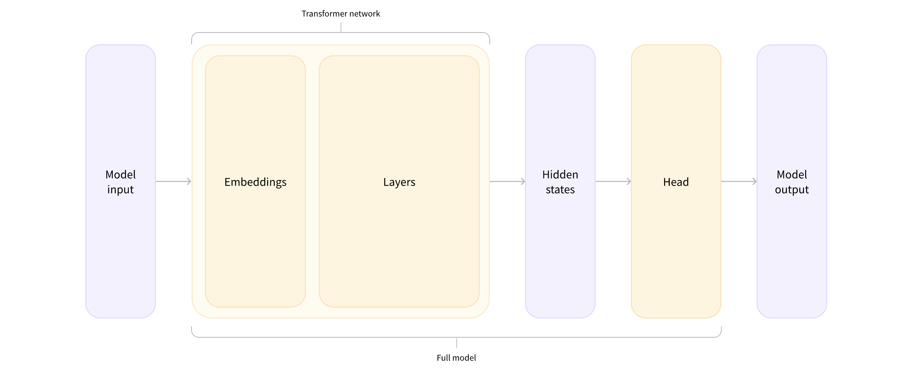
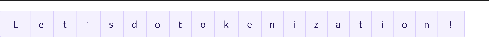

# Transformersライブラリの使い方

## 概要

本記事では、Hugging Face Transformersライブラリの基本的な使用方法について詳しく解説します。Transformerモデルの基本概念から、実際にモデルとトークナイザーを使用してテキスト分類を行う方法まで、実践的な内容を学習できます。

!!! info "参考資料"
    本ドキュメントは [Hugging Face LLM Course](https://huggingface.co/learn/llm-course/chapter2/1) を参考に、日本語で学習内容をまとめた個人的な学習ノートです。詳細な内容や最新情報については、原文も併せてご参照ください。

**学習目標:**
- Transformersライブラリの基本的な使い方を理解する
- pipelineの仕組みと内部動作を把握する
- モデルとトークナイザーの操作方法を習得する
- 複数のテキストシーケンスを効率的に処理する方法を学ぶ

## 前提知識

- Python プログラミングの基本知識
- 機械学習・深層学習の基礎概念
- PyTorchの基本的な使用経験（推奨）
- 自然言語処理（NLP）の基本概念

## はじめに

Transformerモデルは通常非常に大きく、数百万から数百億のパラメータを持ちます。これらのモデルの訓練と展開は複雑な作業です。さらに、ほぼ毎日新しいモデルがリリースされ、それぞれが独自の実装を持っているため、すべてを試すのは簡単な作業ではありません。

Transformersライブラリは、この問題を解決するために作成されました。その目標は、任意のTransformerモデルを読み込み、訓練し、保存できる単一のAPIを提供することです。ライブラリの主な特徴は以下の通りです：

- **使いやすさ**: 最先端のNLPモデルをダウンロード、読み込み、推論に使用することが、わずか2行のコードで可能
- **柔軟性**: すべてのモデルは、その中核でシンプルなPyTorchの`nn.Module`クラスであり、それぞれの機械学習（ML）フレームワークで他のモデルと同様に扱うことが可能
- **シンプルさ**: ライブラリ全体でほとんど抽象化が行われていない。「All in one file」が中核概念で、モデルのフォワードパスは単一のファイルで完全に定義されているため、コード自体が理解しやすく、変更しやすい

この最後の特徴により、Transformersは他のMLライブラリとは大きく異なります。モデルは複数のファイルで共有されるモジュール上に構築されるのではなく、各モデルが独自のレイヤーを持っています。モデルをより親しみやすく理解しやすくするだけでなく、他のモデルに影響を与えることなく1つのモデルで簡単に実験できます。

## pipelineの仕組み

まず、完全な例から始めて、第1章で以下のコードを実行したときに裏で何が起こったかを見てみましょう：

```python
from transformers import pipeline

classifier = pipeline("sentiment-analysis", model="distilbert/distilbert-base-uncased-finetuned-sst-2-english")
classifier(
    [
        "I've been waiting for a HuggingFace course my whole life.",
        "I hate this so much!",
    ]
)
```

**実行結果:**
```
[{'label': 'POSITIVE', 'score': 0.9598050713539124},
 {'label': 'NEGATIVE', 'score': 0.9994558691978455}]
```

このpipelineは3つのステップをまとめています：前処理、モデルを通じた入力の処理、後処理：



### トークナイザーによる前処理

他のニューラルネットワークと同様に、Transformerモデルは生のテキストを直接処理できないため、パイプラインの最初のステップは、テキスト入力をモデルが理解できる数値に変換することです。これを行うために*トークナイザー*を使用します。トークナイザーは以下の責任を持ちます：

- 入力を単語、サブワード、または記号（句読点など）に分割し、これらを*トークン*と呼ぶ
- 各トークンを整数にマッピング
- モデルに有用な可能性のある追加の入力を追加

この前処理は、モデルが事前訓練されたときとまったく同じ方法で行われる必要があるため、まず[Model Hub](https://huggingface.co/models)からその情報をダウンロードする必要があります。これを行うために、`AutoTokenizer`クラスとその`from_pretrained()`メソッドを使用します。モデルのチェックポイント名を使用して、モデルのトークナイザーに関連するデータを自動的に取得し、キャッシュします（以下のコードを初回実行時のみダウンロードされます）。

`sentiment-analysis` pipelineのデフォルトのチェックポイントは`distilbert-base-uncased-finetuned-sst-2-english`なので、以下を実行します：

```python
from transformers import AutoTokenizer

checkpoint = "distilbert-base-uncased-finetuned-sst-2-english"
tokenizer = AutoTokenizer.from_pretrained(checkpoint)
```

トークナイザーを取得したら、文書を直接渡すことができ、モデルに供給する準備ができた辞書が返されます！残る作業は、入力IDのリストをテンソルに変換することだけです。

バックエンドとしてどのMLフレームワークが使用されているかを気にせずにTransformersを使用できます。一部のモデルではPyTorchやFlaxの場合があります。しかし、Transformerモデルは入力として*テンソル*のみを受け入れます。テンソルについて初めて聞く場合は、代わりにNumPy配列として考えることができます。NumPy配列は、スカラー（0次元）、ベクトル（1次元）、行列（2次元）、またはより多くの次元を持つことができます。事実上テンソルです。他のMLフレームワークのテンソルも同様に動作し、通常はNumPy配列と同じくらい簡単にインスタンス化できます。

取得したいテンソルのタイプ（PyTorchまたはプレーンなNumPy）を指定するには、`return_tensors`引数を使用します：

```python
from pprint import pprint

raw_inputs = [
        "I've been waiting for a HuggingFace course my whole life.",
        "I hate this so much!",
]

inputs = tokenizer(raw_inputs, padding=True, truncation=True, return_tensors="pt")
pprint(inputs)
```

**実行結果:**
```
{'attention_mask': tensor([[1, 1, 1, 1, 1, 1, 1, 1, 1, 1, 1, 1, 1, 1, 1, 1],
        [1, 1, 1, 1, 1, 1, 1, 1, 0, 0, 0, 0, 0, 0, 0, 0]]),
 'input_ids': tensor([[  101,  1045,  1005,  2310,  2042,  3403,  2005,  1037, 17662, 12172,
          2607,  2026,  2878,  2166,  1012,   102],
        [  101,  1045,  5223,  2023,  2061,  2172,   999,   102,     0,     0,
             0,     0,     0,     0,     0,     0]])}
```

出力自体は、`input_ids`と`attention_mask`の2つのキーを含む辞書です。`input_ids`には、各文のトークンの一意識別子である整数の2つの行（各文に1つずつ）が含まれています。`attention_mask`については、この章で後ほど説明します。

### モデルを通じた処理

トークナイザーと同じ方法で事前訓練済みモデルをダウンロードできます。Transformersは、`from_pretrained()`メソッドも持つ`AutoModel`クラスを提供しています：

```python
from transformers import AutoModel

checkpoint = "distilbert-base-uncased-finetuned-sst-2-english"
model = AutoModel.from_pretrained(checkpoint)
```

このコードスニペットでは、パイプラインで以前に使用したのと同じチェックポイントをダウンロードし（実際にはすでにキャッシュされているはずです）、それでモデルをインスタンス化しました。

このアーキテクチャには、基本的なTransformerモジュールのみが含まれています。一部の入力が与えられると、*隠れ状態*、*特徴*とも呼ばれるものを出力します。各モデル入力に対して、**Transformerモデルによるその入力の文脈的理解**を表す高次元ベクトルを取得します。

これが理解できない場合でも心配しないでください。後ですべて説明します。

これらの隠れ状態は単独でも有用ですが、通常は*ヘッド*として知られるモデルの別の部分への入力です。第1章では、同じアーキテクチャで異なるタスクを実行できましたが、これらの各タスクには異なるヘッドが関連付けられています。

#### 高次元ベクトル？

Transformerモジュールによって出力されるベクトルは通常大きくなります。一般的に3つの次元があります：

- **バッチサイズ**: 一度に処理されるシーケンスの数（例では2）
- **シーケンス長**: シーケンスの数値表現の長さ（例では16）
- **隠れサイズ**: 各モデル入力のベクトル次元

最後の値のために「高次元」と言われます。隠れサイズは非常に大きくなることがあります（小さなモデルでは768が一般的で、大きなモデルでは3072以上に達することもあります）。

前処理した入力をモデルに与えると、これを確認できます：

```python
outputs = model(**inputs)
print(outputs.last_hidden_state.shape)
```

**実行結果:**
```
torch.Size([2, 16, 768])
```

Transformersモデルの出力は`namedtuple`や辞書のように動作することに注意してください。属性（私たちが行ったように）、キー（`outputs["last_hidden_state"]`）、または探しているものの正確な位置を知っている場合はインデックス（`outputs[0]`）で要素にアクセスできます。

#### モデルヘッド：数値を意味のあるものにする

モデルヘッドは、隠れ状態の高次元ベクトルを入力として受け取り、それらを異なる次元に投影します。通常、1つまたは少数の線形レイヤーで構成されています：



Transformerモデルの出力は、処理されるためにモデルヘッドに直接送られます。

この図では、モデルは埋め込みレイヤーとそれに続くレイヤーで表されています。埋め込みレイヤーは、トークン化された入力の各入力IDを、関連するトークンを表すベクトルに変換します。後続のレイヤーは、注意機構を使用してこれらのベクトルを操作し、文の最終表現を生成します。

Transformersには多くの異なるアーキテクチャが利用可能で、それぞれが特定のタスクに取り組むように設計されています。以下は網羅的ではないリストです：

- `*Model`（隠れ状態を取得）
- `*ForCausalLM`
- `*ForMaskedLM`
- `*ForMultipleChoice`
- `*ForQuestionAnswering`
- `*ForSequenceClassification`
- `*ForTokenClassification`
- その他

この例では、シーケンス分類ヘッドを持つモデルが必要です（文書をポジティブまたはネガティブとして分類できるように）。そのため、実際には`AutoModel`クラスではなく、`AutoModelForSequenceClassification`を使用します：

```python
from transformers import AutoModelForSequenceClassification

checkpoint = "distilbert-base-uncased-finetuned-sst-2-english"
model = AutoModelForSequenceClassification.from_pretrained(checkpoint)
outputs = model(**inputs)
```

出力の形状を見ると、次元がはるかに低くなっています。モデルヘッドは、前に見た高次元ベクトルを入力として受け取り、2つの値（ラベルごとに1つ）を含むベクトルを出力します：

```python
print(outputs)
print(outputs.logits.shape)
```

**実行結果:**
```
SequenceClassifierOutput(loss=None, logits=tensor([[-1.5607,  1.6123],
        [ 4.1692, -3.3464]], grad_fn=<AddmmBackward0>), hidden_states=None, attentions=None)
torch.Size([2, 2])
```

2つの文書と2つのラベルがあるため、モデルから得られる結果は2×2の形状です。

### 出力の後処理

モデルから出力として得られる値は、それ自体では必ずしも意味をなしません。見てみましょう：

```python
print(outputs.logits)
```

**実行結果:**
```
tensor([[-1.5607,  1.6123],
        [ 4.1692, -3.3464]], grad_fn=<AddmmBackward0>)
```

モデルが最初の文について`[0.0402, 0.9598]`、2番目の文書について`[0.9995, 0.0005]`を予測したことがわかります。これらは認識可能な確率スコアです。

各位置に対応するラベルを取得するには、モデル設定の`id2label`属性を調べることができます（次のセクションで詳しく説明）：

```python
model.config.id2label
```

**実行結果:**
```
{0: 'NEGATIVE', 1: 'POSITIVE'}
```

これで、モデルが以下を予測したと結論できます：

- 最初の文：NEGATIVE: 0.0402、POSITIVE: 0.9598
- 2番目の文：NEGATIVE: 0.9995、POSITIVE: 0.0005

パイプラインの3つのステップ（トークナイザーによる前処理、モデルを通じた入力の処理、後処理）を正常に再現しました！それでは、これらの各ステップをより深く掘り下げてみましょう。

## モデル

このセクションでは、モデルの作成と使用について詳しく見ていきます。チェックポイントから任意のモデルをインスタンス化したい場合に便利な`AutoModel`クラスを使用します。

### Transformerの作成

`AutoModel`をインスタンス化するときに何が起こるかを調べることから始めましょう：

```python
from transformers import AutoModel

model = AutoModel.from_pretrained("bert-base-cased")
```

トークナイザーと同様に、`from_pretrained()`メソッドはHugging Face Hubからモデルデータをダウンロードしてキャッシュします。前述のように、チェックポイント名は特定のモデルアーキテクチャと重みに対応し、この場合は基本的なアーキテクチャ（12レイヤー、768隠れサイズ、12注意ヘッド）と大文字・小文字を区別する入力を持つBERTモデルです。Hubには多くのチェックポイントが利用可能です。[こちら](https://huggingface.co/models)で探索できます。

`AutoModel`クラスとその関連クラスは、実際には指定されたチェックポイントに適したモデルアーキテクチャを取得するように設計されたシンプルなラッパーです。これは「auto」クラスで、適切なモデルアーキテクチャを推測し、正しいモデルクラスをインスタンス化します。ただし、使用したいモデルのタイプがわかっている場合は、そのアーキテクチャを定義するクラスを直接使用できます：

```python
from transformers import BertModel

model = BertModel.from_pretrained("bert-base-cased")
```

### 読み込みと保存

モデルの保存は、トークナイザーの保存と同じくらい簡単です。実際、モデルには同じ`save_pretrained()`メソッドがあり、モデルの重みとアーキテクチャ設定を保存します：

```python
model.save_pretrained("models/")
```

```python
# これにより、ディスクに2つのファイルが保存されます
%ls models
```

**実行結果:**
```
config.json 
model.safetensors
```

*config.json*ファイルを見ると、モデルアーキテクチャを構築するために必要なすべての属性が表示されます。このファイルには、チェックポイントがどこから来たのか、最後にチェックポイントを保存したときに使用していたTransformersのバージョンなどのメタデータも含まれています。

*model.safetensors*ファイルは状態辞書として知られており、モデルのすべての重みが含まれています。この2つのファイルは連携して動作します。設定ファイルはモデルアーキテクチャについて知るために必要であり、モデルの重みはモデルのパラメータです。

保存されたモデルを再利用するには、再び`from_pretrained()`メソッドを使用します：

```python
from transformers import AutoModel
model = AutoModel.from_pretrained("models")
```

### テキストのエンコード

Transformerモデルは、入力を数値に変換することでテキストを処理します。ここでは、テキストがトークナイザーによって処理されるときに正確に何が起こるかを見ていきます。第1章で、トークナイザーがテキストをトークンに分割し、これらのトークンを数値に変換することをすでに見ました。簡単なトークナイザーを通してこの変換を確認できます：

```python
from transformers import AutoTokenizer
from pprint import pprint

tokenizer = AutoTokenizer.from_pretrained("bert-base-cased")
encoded_input = tokenizer("Hello, I'm a single sentence!")
pprint(encoded_input)
```

**実行結果:**
```
{'attention_mask': [1, 1, 1, 1, 1, 1, 1, 1, 1, 1, 1, 1],
 'input_ids': [101, 8667, 117, 146, 112, 182, 170, 1423, 5650, 1233, 106, 102],
 'token_type_ids': [0, 0, 0, 0, 0, 0, 0, 0, 0, 0, 0, 0]}
```

以下のフィールドを持つ辞書を取得します：
- input_ids：トークンの数値表現
- token_type_ids：入力のどの部分が文Aで、どの部分が文Bかをモデルに伝える（次のセクションでより詳しく説明）
- attention_mask：どのトークンに注意を払うべきで、どのトークンに注意を払うべきでないかを示す（すぐに詳しく説明）

入力IDをデコードして元のテキストを取得できます：

```python
tokenizer.decode(encoded_input["input_ids"])
```

**実行結果:**
```
"[CLS] Hello, I ' m a single sentence! [SEP]"
```

トークナイザーが特別なトークン — `[CLS]`と`[SEP]` — をモデルが必要とするものとして追加したことに気づくでしょう。すべてのモデルが特別なトークンを必要とするわけではありません。これらは、モデルがそれらで事前訓練された場合に利用され、その場合、トークナイザーはモデルがこれらのトークンを期待するため、それらを追加する必要があります。

複数の文を一度にエンコードすることもできます。バッチ化してまとめるか（これについてはすぐに説明します）、リストを渡すことで可能です：

```python
encoded_input = tokenizer("How are you?", "I'm fine, thank you!", return_tensors="pt")
pprint(encoded_input)
```

**実行結果:**
```
{'attention_mask': tensor([[1, 1, 1, 1, 1, 1, 1, 1, 1, 1, 1, 1, 1, 1, 1]]),
 'input_ids': tensor([[ 101, 1731, 1132, 1128,  136,  102,  146,  112,  182, 2503,  117, 6243,
         1128,  106,  102]]),
 'token_type_ids': tensor([[0, 0, 0, 0, 0, 0, 1, 1, 1, 1, 1, 1, 1, 1, 1]])}
```

しかし、問題があります。2つのリストの長さが同じではありません！配列とテンソルは長方形である必要があるため、これらのリストを単純にPyTorchテンソル（またはNumPy配列）に変換することはできません。トークナイザーはそのためのオプション（パディング）を提供しています。

#### 入力のパディング

トークナイザーに入力をパディングするよう求めると、最も長いものより短い文に特別なパディングトークンを追加することで、すべての文を同じ長さにします：

```python
encoded_input = tokenizer(["How are you?", "I'm fine, thank you!"], padding=True, return_tensors="pt")
pprint(encoded_input)
```

**実行結果:**
```
{'attention_mask': tensor([[1, 1, 1, 1, 1, 1, 0, 0, 0, 0],
        [1, 1, 1, 1, 1, 1, 1, 1, 1, 1]]),
 'input_ids': tensor([[ 101, 1731, 1132, 1128,  136,  102,    0,    0,    0,    0],
        [ 101,  146,  112,  182, 2503,  117, 6243, 1128,  106,  102]]),
 'token_type_ids': tensor([[0, 0, 0, 0, 0, 0, 0, 0, 0, 0],
        [0, 0, 0, 0, 0, 0, 0, 0, 0, 0]])}
```

これで長方形のテンソルができました！パディングトークンがID 0で入力IDにエンコードされ、attention maskの値も0になっていることに注意してください。これは、これらのパディングトークンがモデルによって分析されるべきではないためです。実際の文の一部ではありません。

#### 入力の切り捨て

テンソルがモデルで処理するには大きすぎる場合があります。たとえば、BERTは最大512トークンのシーケンスでのみ事前訓練されているため、より長いシーケンスを処理できません。モデルが処理できるよりも長いシーケンスがある場合は、`truncation`パラメータで切り捨てる必要があります：

```python
encoded_input = tokenizer(
    "This is a very very very very very very very very very very very very very very very very very very very very very very very very very very very very very very very very very very very very very very very very very very very very very very very very very long sentence.",
    truncation=True,
)
print(encoded_input["input_ids"])
```

**実行結果:**
```
[101, 1188, 1110, 170, 1304, 1304, 1304, 1304, 1304, 1304, 1304, 1304, 1304, 1304, 1304, 1304, 1304, 1304, 1304, 1304, 1304, 1304, 1304, 1304, 1304, 1304, 1304, 1304, 1304, 1304, 1304, 1304, 1304, 1304, 1304, 1304, 1304, 1304, 1304, 1304, 1304, 1304, 1304, 1304, 1304, 1304, 1304, 1304, 1304, 1304, 1304, 1304, 1304, 1263, 5650, 119, 102]
```

パディングと切り捨ての引数を組み合わせることで、テンソルが必要な正確なサイズになることを確実にできます：

```python
encoded_input = tokenizer(
    ["How are you?", "I'm fine, thank you!"],
    padding=True,
    truncation=True,
    max_length=5,
    return_tensors="pt",
)
print(encoded_input)
```

**実行結果:**
```
{'input_ids': tensor([[ 101, 1731, 1132, 1128,  102],
        [ 101,  146,  112,  182,  102]]), 'token_type_ids': tensor([[0, 0, 0, 0, 0],
        [0, 0, 0, 0, 0]]), 'attention_mask': tensor([[1, 1, 1, 1, 1],
        [1, 1, 1, 1, 1]])}
```

#### 特別なトークンの追加

特別なトークン（または少なくともその概念）は、BERTおよび派生モデルにとって特に重要です。これらのトークンは、文の境界をより良く表現するために追加されます。たとえば、文の始まり（`[CLS]`）や文の間の区切り（`[SEP]`）などです。簡単な例を見てみましょう：

```python
encoded_input = tokenizer("How are you?")
pprint(encoded_input["input_ids"])
tokenizer.decode(encoded_input["input_ids"])
```

**実行結果:**
```
[101, 1731, 1132, 1128, 136, 102]
'[CLS] How are you? [SEP]'
```

これらの特別なトークンは、トークナイザーによって自動的に追加されます。すべてのモデルが特別なトークンを必要とするわけではありません。これらは主に、モデルがそれらで事前訓練された場合に使用され、その場合、トークナイザーはモデルがこれらのトークンを期待するため、それらを追加します。

#### なぜこれらすべてが必要なのか？

具体的な例を考えてみましょう。これらのエンコードされたシーケンスを考えてみます。
トークン化されると、以下のようになります：

```python
sequences = [
    "I've been waiting for a HuggingFace course my whole life.",
    "I hate this so much!",
]
input_ids = tokenizer(sequences, padding=True)["input_ids"]
pprint(input_ids, compact=True)
```

**実行結果:**
```
[[101, 146, 112, 1396, 1151, 2613, 1111, 170, 20164, 10932, 2271, 7954, 1736,
  1139, 2006, 1297, 119, 102],
 [101, 146, 4819, 1142, 1177, 1277, 106, 102, 0, 0, 0, 0, 0, 0, 0, 0, 0, 0]]
```

これはエンコードされたシーケンスのリストです：リストのリストです。テンソルは長方形の形状のみを受け入れます（行列を考えてください）。この「配列」はすでに長方形の形状なので、テンソルに変換するのは簡単です：

```python
import torch
model_inputs = torch.tensor(input_ids)
```

#### モデルへの入力としてテンソルを使用する

モデルでテンソルを使用することは非常に簡単です — 入力でモデルを呼び出すだけです：

```python
output = model(model_inputs)
```

モデルは多くの異なる引数を受け入れますが、入力IDのみが必要です。他の引数が何をするのか、いつ必要なのかについては後で説明しますが、まず、Transformerモデルが理解できる入力を構築するトークナイザーについて詳しく見る必要があります。

## トークナイザー

トークナイザーは、NLPパイプラインのコアコンポーネントの1つです。1つの目的を果たします：テキストをモデルが処理できるデータに変換することです。モデルは数値のみを処理できるため、トークナイザーはテキスト入力を数値データに変換する必要があります。このセクションでは、トークン化パイプラインで正確に何が起こるかを探ります。

NLPタスクでは、一般的に処理されるデータは生のテキストです。

しかし、モデルは数値のみを処理できるため、生のテキストを数値に変換する方法を見つける必要があります。それがトークナイザーの役割であり、これを行う方法はたくさんあります。目標は、最も意味のある表現 — つまり、モデルにとって最も理にかなった表現を見つけ、可能であれば最小の表現を見つけることです。

トークン化アルゴリズムの例をいくつか見て、トークン化について持つかもしれない疑問のいくつかに答えてみましょう。

### 単語ベース

思い浮かぶ最初のタイプのトークナイザーは_単語ベース_です。一般的にセットアップと使用が非常に簡単で、いくつかのルールだけで、しばしば良好な結果をもたらします。たとえば、以下の画像では、目標は生のテキストを単語に分割し、それぞれの数値表現を見つけることです：


テキストを分割する方法はさまざまです。たとえば、Pythonの`split()`関数を適用して、空白を使用してテキストを単語にトークン化できます：

```python
tokenized_text = "Hello, how are you!".split()
pprint(tokenized_text)
```

**実行結果:**
```
['Hello,', 'how', 'are', 'you!']
```

句読点に対する追加のルールを持つ単語トークナイザーの変種もあります。この種のトークナイザーでは、かなり大きな「語彙」を得ることができます。語彙は、コーパス内の独立したトークンの総数によって定義されます。

各単語には0から語彙のサイズまでのIDが割り当てられます。モデルはこれらのIDを使用して各単語を識別します。

単語ベースのトークナイザーで言語を完全にカバーしたい場合、言語内の各単語の識別子が必要になり、膨大な数のトークンが生成されます。たとえば、英語には50万を超える単語があるため、各単語から入力IDへのマップを構築するには、そのたくさんのIDを追跡する必要があります。さらに、「dog」のような単語は「dogs」のような単語とは異なって表現され、モデルは最初「dog」と「dogs」が似ていることを知る方法がありません。これらの2つの単語を無関係として識別します。「run」と「running」などの他の似たような単語にも同じことが当てはまり、モデルは最初それらが似ていることを見ません。

最後に、語彙にない単語を表すカスタムトークンが必要です。これは「未知」トークンとして知られ、しばしば「[UNK]」や「&lt;unk&gt;」として表されます。トークナイザーがこれらのトークンを多く生成している場合、一般的にそれは悪い兆候です。単語の合理的な表現を取得できず、途中で情報を失っているからです。語彙を作成する際の目標は、トークナイザーができるだけ少ない単語を未知トークンにトークン化するように行うことです。

未知トークンの量を減らす1つの方法は、より深いレベルに行くことで、_文字ベース_のトークナイザーを使用することです。

### 文字ベース

文字ベースのトークナイザーは、単語ではなく文字にテキストを分割します。これには2つの主な利点があります：

- 語彙がはるかに小さい
- 語彙外（未知）トークンがはるかに少ない。すべての単語が文字から構築できるため

しかし、ここでも空白と句読点に関する疑問が生じます：



このアプローチも完璧ではありません。表現が単語ではなく文字に基づいているため、直感的にはあまり意味がないと主張できます。各文字は単独では多くを意味しませんが、単語の場合はそうです。しかし、これも言語によって異なります。たとえば中国語では、各文字はラテン語の文字よりも多くの情報を持っています。

考慮すべきもう1つのことは、モデルによって処理される非常に大量のトークンになることです。単語ベースのトークナイザーでは単語が単一のトークンになるのに対し、文字に変換すると簡単に10以上のトークンになる可能性があります。

両方の世界の最良を得るために、2つのアプローチを組み合わせた第3の技術を使用できます：*サブワードトークン化*。

### サブワードトークン化

サブワードトークン化アルゴリズムは、頻繁に使用される単語はより小さなサブワードに分割されるべきではないが、稀な単語は意味のあるサブワードに分解されるべきであるという原則に依存しています。

たとえば、「annoyingly」は稀な単語と見なされ、「annoying」と「ly」に分解される可能性があります。これらは両方とも、より頻繁に独立したサブワードとして現れる可能性が高く、同時に「annoying」と「ly」の複合的な意味によって「annoyingly」の意味が保持されます。

サブワードトークン化アルゴリズムがシーケンス「Let's do tokenization!」をトークン化する方法を示す例です：


これらのサブワードは多くの意味的意味を提供します。たとえば、上記の例では「tokenization」が「token」と「ization」に分割され、スペース効率が良い（長い単語を表すのに2つのトークンのみが必要）ながら意味的意味を持つ2つのトークンになりました。これにより、小さな語彙で比較的良好なカバレッジを持ち、未知トークンがほとんどない状態を実現できます。

このアプローチは、サブワードを連結して（ほぼ）任意に長い複雑な単語を形成できるトルコ語などの膠着語では特に有用です。

当然のことながら、他にも多くの技術があります。いくつか挙げると：

- GPT-2で使用されるByte-level BPE
- BERTで使用されるWordPiece
- いくつかの多言語モデルで使用されるSentencePieceまたはUnigram

これで、APIを開始するのに十分なトークナイザーの動作に関する知識があるはずです。

### 読み込みと保存

トークナイザーの読み込みと保存は、モデルと同じくらい簡単です。実際、同じ2つのメソッド（`from_pretrained()`と`save_pretrained()`）に基づいています。これらのメソッドは、トークナイザーが使用するアルゴリズム（モデルの*アーキテクチャ*のようなもの）とその語彙（モデルの*重み*のようなもの）を読み込みまたは保存します。

BERTと同じチェックポイントで訓練されたBERTトークナイザーの読み込みは、モデルの読み込みと同じ方法で行われますが、`BertTokenizer`クラスを使用します：

```python
from transformers import BertTokenizer

tokenizer = BertTokenizer.from_pretrained("bert-base-cased")
```

`AutoModel`と同様に、`AutoTokenizer`クラスは、チェックポイント名に基づいてライブラリ内の適切なトークナイザークラスを取得し、任意のチェックポイントで直接使用できます：

```python
from transformers import AutoTokenizer

tokenizer = AutoTokenizer.from_pretrained("bert-base-cased")
```

前のセクションで示したようにトークナイザーを使用できるようになりました：

```python
pprint(tokenizer("Using a Transformer network is simple"))
```

**実行結果:**
```
{'attention_mask': [1, 1, 1, 1, 1, 1, 1, 1, 1],
 'input_ids': [101, 7993, 170, 13809, 23763, 2443, 1110, 3014, 102],
 'token_type_ids': [0, 0, 0, 0, 0, 0, 0, 0, 0]}
```

トークナイザーの保存は、モデルの保存と同じです：

```python
tokenizer.save_pretrained("models")
```

**実行結果:**
```
('models/tokenizer_config.json',
 'models/special_tokens_map.json',
 'models/vocab.txt',
 'models/added_tokens.json',
 'models/tokenizer.json')
```

まず、`input_ids`がどのように生成されるかを見てみましょう。これを行うには、トークナイザーの中間メソッドを見る必要があります。

### エンコード

テキストを数値に変換することは_エンコード_として知られています。エンコードは2段階のプロセスで行われます：トークン化、その後の入力IDへの変換。

見てきたように、最初のステップはテキストを単語（または単語の一部、句読点記号など）に分割することで、通常*トークン*と呼ばれます。このプロセスを管理できる複数のルールがあり、そのためモデルが事前訓練されたときに使用されたのと同じルールを使用することを確認するために、モデルの名前を使用してトークナイザーをインスタンス化する必要があります。

2番目のステップは、これらのトークンを数値に変換することで、テンソルを構築してモデルに供給できます。これを行うために、トークナイザーには*語彙*があり、これは`from_pretrained()`メソッドでインスタンス化するときにダウンロードする部分です。繰り返しますが、モデルが事前訓練されたときに使用されたのと同じ語彙を使用する必要があります。

2つのステップをより良く理解するために、それらを別々に探索します。実際には、トークンの入力を直接呼び出すべきですが、トークン化パイプラインの一部を個別に実行するいくつかのメソッドを使用して、これらのステップの中間結果を示します。

#### トークン化

トークン化プロセスは、トークナイザーの`tokenize()`メソッドによって行われます：

```python
from transformers import AutoTokenizer

tokenizer = AutoTokenizer.from_pretrained("bert-base-cased")

sequence = "Using a Transformer network is simple"

tokens = tokenizer.tokenize(sequence)
pprint(tokens)
```

**実行結果:**
```
['Using', 'a', 'Trans', '##former', 'network', 'is', 'simple']
```

このトークナイザーはサブワードトークナイザーです：語彙で表現できるトークンを取得するまで単語を分割します。ここでは`transformer`の場合がそうで、2つのトークン（`Trans`と`##former`）に分割されています。

#### トークンから入力IDへ

入力IDへの変換は、トークナイザーの`convert_tokens_to_ids()`メソッドによって処理されます：

```python
ids = tokenizer.convert_tokens_to_ids(tokens)
pprint(ids)

tokens = tokenizer.convert_ids_to_tokens(ids)
pprint(tokens)
```

**実行結果:**
```
[7993, 170, 13809, 23763, 2443, 1110, 3014]
['Using', 'a', 'Trans', '##former', 'network', 'is', 'simple']
```

### デコード

*デコード*は逆方向に行きます：語彙インデックスから文字列を取得したいのです。これは以下のように`decode()`メソッドで行うことができます：

```python
decoded_string = tokenizer.decode(ids)
pprint(decoded_string)
```

**実行結果:**
```
'Using a Transformer network is simple'
```

`decode`メソッドは、インデックスをトークンに戻すだけでなく、同じ単語の一部だったトークンをグループ化して読みやすい文を生成することに注意してください。この動作は、新しいテキストを予測するモデル（プロンプトから生成されたテキスト、または翻訳や要約などのシーケンス間の問題）を使用するときに非常に有用です。

これで、トークナイザーが処理できる原子操作（トークン化、IDへの変換、IDから文字列への変換）を理解できたはずです。しかし、氷山の一角をかじっただけです。次のセクションでは、アプローチを限界まで持っていき、それらを克服する方法を見ていきます。

## 複数シーケンスの処理

前のセクションでは、最もシンプルな使用例（小さな長さの単一シーケンスで推論を行う）を探索しました。しかし、すでにいくつかの疑問が浮かんでいます：

- 複数のシーケンスをどのように処理するか？
- *異なる長さ*の複数のシーケンスをどのように処理するか？
- 語彙インデックスはモデルがうまく動作できる唯一の入力か？
- 長すぎるシーケンスのようなものはあるか？

これらの疑問がどのような問題を引き起こすかを見て、Transformers APIを使用してそれらをどのように解決できるかを見てみましょう。

### モデルは入力のバッチを期待する

前の演習では、シーケンスが数値のリストにどのように変換されるかを見ました。この数値のリストをテンソルに変換して、モデルに送信しましょう：

```python
import torch

from transformers import AutoTokenizer, AutoModelForSequenceClassification

checkpoint = "distilbert-base-uncased-finetuned-sst-2-english"
tokenizer = AutoTokenizer.from_pretrained(checkpoint)
model = AutoModelForSequenceClassification.from_pretrained(checkpoint)

sequence = "I've been waiting for a Huggingface course my whole life."

tokens = tokenizer.tokenize(sequence)
ids = tokenizer.convert_tokens_to_ids(tokens)
input_ids = torch.tensor(ids)

# この行は失敗します
model(input_ids)
```

問題は、モデルに単一のシーケンスを送信したことですが、Transformersモデルはデフォルトで複数の文を期待することです。ここで、トークナイザーを`sequence`に適用したときに裏でトークナイザーが行ったすべてを実行しようとしました。しかし、よく見ると、トークナイザーは入力IDのリストをテンソルに変換しただけでなく、その上に次元を追加したことがわかります：

```python
tokenized_inputs = tokenizer(sequence, return_tensors="pt")
print(tokenized_inputs["input_ids"])
```

**実行結果:**
```
tensor([[  101,  1045,  1005,  2310,  2042,  3403,  2005,  1037, 17662, 12172,
          2607,  2026,  2878,  2166,  1012,   102]])
```

再試行して、新しい次元を追加しましょう：

```python
import torch
from transformers import AutoTokenizer, AutoModelForSequenceClassification

checkpoint = "distilbert-base-uncased-finetuned-sst-2-english"
tokenizer = AutoTokenizer.from_pretrained(checkpoint)
model = AutoModelForSequenceClassification.from_pretrained(checkpoint)

sequence = "I've been waiting for a HuggingFace course my whole life."

tokens = tokenizer.tokenize(sequence)
ids = tokenizer.convert_tokens_to_ids(tokens)

input_ids = torch.tensor([ids])
print("Input IDs:", input_ids)

output = model(input_ids)
print("Logits:", output.logits)
```

**実行結果:**
```
Input IDs: tensor([[ 1045,  1005,  2310,  2042,  3403,  2005,  1037, 17662, 12172,  2607,
          2026,  2878,  2166,  1012]])
Logits: tensor([[-2.7276,  2.8789]], grad_fn=<AddmmBackward0>)
```

*バッチング*は、複数の文を一度にモデルに送信する行為です。文が1つしかない場合は、単一のシーケンスでバッチを構築するだけです：

```python
batched_ids = [ids, ids]
batched_input_ids = torch.tensor(batched_ids)
output = model(batched_input_ids)
print("Logits:", output.logits)
```

**実行結果:**
```
Logits: tensor([[-2.7276,  2.8789],
        [-2.7276,  2.8789]], grad_fn=<AddmmBackward0>)
```

バッチングにより、複数の文書をモデルに供給するときにモデルが機能します。複数のシーケンスを使用することは、単一のシーケンスでバッチを構築するのと同じくらい簡単です。しかし、2番目の問題があります。2つ（またはそれ以上）の文書を一緒にバッチ化しようとするとき、それらは異なる長さの可能性があります。以前にテンソルを扱ったことがある場合、テンソルは長方形の形状である必要があることを知っているので、入力IDのリストを直接テンソルに変換することはできません。この問題を回避するために、通常入力を*パッド*します。

### 入力のパディング

以下のリストのリストはテンソルに変換できません：

```python
batched_ids = [
    [200, 200, 200],
    [200, 200]
]
```

これを回避するために、*パディング*を使用してテンソルを長方形にします。パディングは、値が少ない文に*パディングトークン*と呼ばれる特別な単語を追加することで、すべての文が同じ長さになることを確実にします。たとえば、10語の10文と20語の1文がある場合、パディングにより、すべての文が20語になります。私たちの例では、結果のテンソルは次のようになります：

```python
padding_id = 100

batched_ids = [
    [200, 200, 200],
    [200, 200, padding_id],
]
```

パディングトークンIDは`tokenizer.pad_token_id`で見つけることができます。それを使用して、2つの文を個別にモデルに送信し、一緒にバッチ化してみましょう：

```python
model = AutoModelForSequenceClassification.from_pretrained(checkpoint)

sequence1_ids = [[200,200,200]]
sequence2_ids = [[200,200]]
batched_ids = [
    [200, 200, 200],
    [200, 200, tokenizer.pad_token_id],
]

print(model(torch.tensor(sequence1_ids)).logits)
print(model(torch.tensor(sequence2_ids)).logits)
print(model(torch.tensor(batched_ids)).logits)
```

**実行結果:**
```
tensor([[ 1.5694, -1.3895]], grad_fn=<AddmmBackward0>)
tensor([[ 0.5803, -0.4125]], grad_fn=<AddmmBackward0>)
tensor([[ 1.5694, -1.3895],
        [ 1.3374, -1.2163]], grad_fn=<AddmmBackward0>)
```

バッチ予測のlogitsに何か問題があります：2行目は2番目の文のlogitsと同じであるべきですが、完全に異なる値を得ています！

これは、Transformerモデルの主要な特徴が、各トークンを*文脈化*する注意レイヤーであるためです。これらは、シーケンスのすべてのトークンに注意を払うため、パディングトークンを考慮に入れます。異なる長さの個別の文をモデルに通すときや、同じ文とパディングが適用されたバッチを通すときに同じ結果を得るには、これらの注意レイヤーにパディングトークンを無視するよう伝える必要があります。これは`attention mask`を使用して行われます。

### `attention mask`

*`attention mask`*は、入力IDテンソルとまったく同じ形状のテンソルで、0と1で埋められています：1は対応するトークンに注意を払うべきであることを示し、0は対応するトークンに注意を払うべきでない（つまり、モデルの注意レイヤーによって無視されるべき）ことを示します。

`attention mask`で前の例を完成させましょう：

```python
batched_ids = [
    [200, 200, 200],
    [200, 200, tokenizer.pad_token_id],
]

attention_mask = [
    [1, 1, 1],
    [1, 1, 0],
]

outputs = model(torch.tensor(batched_ids), attention_mask=torch.tensor(attention_mask))
print(outputs.logits)
```

**実行結果:**
```
tensor([[ 1.5694, -1.3895],
        [ 0.5803, -0.4125]], grad_fn=<AddmmBackward0>)
```

これで、バッチの2番目の文に対して同じlogitsを得ました。

2番目のシーケンスの最後の値がパディングIDであり、`attention mask`では0値であることに注意してください。

**試してみよう！**

セクション2で使用した2つの文（「I've been waiting for a HuggingFace course my whole life.」と「I hate this so much!」）にトークン化を手動で適用してください。それらをモデルに通し、セクション2と同じlogitsを得ることを確認してください。次に、パディングトークンを使用してそれらを一緒にバッチ化し、適切な`attention mask`を作成してください。モデルを通すときに同じ結果を得ることを確認してください！

```python
import torch
from transformers import AutoTokenizer, AutoModelForSequenceClassification

checkpoint = "distilbert-base-uncased-finetuned-sst-2-english"
tokenizer = AutoTokenizer.from_pretrained(checkpoint)
model = AutoModelForSequenceClassification.from_pretrained(checkpoint)

sequence1 = "I've been waiting for a HuggingFace course my whole life."
sequence2 = "I hate this so much!"

tokens1 = tokenizer.tokenize(sequence1)
ids1 = tokenizer.convert_tokens_to_ids(tokens1)

tokens2 = tokenizer.tokenize(sequence2)
ids2 = tokenizer.convert_tokens_to_ids(tokens2)

max_len = len(ids1)
pad_id = tokenizer.pad_token_id

ids2 = ids2 + [pad_id] * (max_len - len(ids2))

# `attention mask`
mask1 = [1] * len(ids1)
mask2 = [1] * len(tokens2) + [0] * (max_len - len(tokens2))
attention_mask = torch.tensor([mask1, mask2])
input_ids = torch.tensor([ids1, ids2])

print(model(torch.tensor([ids1])).logits)
print(model(torch.tensor([ids2[:len(tokens2)]])).logits)

output = model(input_ids, attention_mask=attention_mask)
print("Logits:", output.logits)
```

**実行結果:**
```
tensor([[-2.7276,  2.8789]], grad_fn=<AddmmBackward0>)
tensor([[ 2.5423, -2.1265]], grad_fn=<AddmmBackward0>)
Logits: tensor([[-2.7276,  2.8789],
        [ 2.5423, -2.1265]], grad_fn=<AddmmBackward0>)
```

### より長いシーケンス

Transformerモデルでは、モデルに渡すことができるシーケンスの長さに制限があります。ほとんどのモデルは最大512または1024トークンのシーケンスを処理し、より長いシーケンスを処理するよう求められるとクラッシュします。この問題には2つの解決策があります：

- より長いサポートされるシーケンス長を持つモデルを使用する
- シーケンスを切り捨てる

モデルには異なるサポートされるシーケンス長があり、一部は非常に長いシーケンスの処理に特化しています。[Longformer](https://huggingface.co/docs/transformers/model_doc/longformer)は一例で、もう一つは[LED](https://huggingface.co/docs/transformers/model_doc/led)です。非常に長いシーケンスを必要とするタスクに取り組んでいる場合は、これらのモデルを調べることをお勧めします。

それ以外の場合は、`max_sequence_length`パラメータを指定してシーケンスを切り捨てることをお勧めします：

```python
sequence = sequence[:max_sequence_length]
```

## すべてをまとめる

最後のいくつかのセクションでは、手作業でほとんどの作業を行うよう最善を尽くしてきました。トークナイザーがどのように動作するかを探索し、トークン化、入力IDへの変換、パディング、切り捨て、`attention mask`について見てきました。

しかし、セクション2で見たように、Transformers APIは、ここで詳しく見ていく高レベル関数ですべてを処理できます。文に対して`tokenizer`を直接呼び出すと、モデルに渡す準備ができた入力が返されます：

```python
from transformers import AutoTokenizer

checkpoint = "distilbert-base-uncased-finetuned-sst-2-english"
tokenizer = AutoTokenizer.from_pretrained(checkpoint)

sequence = "I've been waiting for a HuggingFace course my whole life."

model_inputs = tokenizer(sequence)
```

ここで、`model_inputs`変数には、モデルが適切に動作するために必要なすべてが含まれています。DistilBERTの場合、入力IDと`attention mask`が含まれます。追加の入力を受け入れる他のモデルでは、`tokenizer`オブジェクトによってそれらも出力されます。

以下のいくつかの例で見るように、この方法は非常に強力です。まず、単一のシーケンスをトークン化できます：

```python
sequence = "I've been waiting for a HuggingFace course my whole life."

model_inputs = tokenizer(sequence)

pprint(model_inputs, compact=True)
```

**実行結果:**
```
{'attention_mask': [1, 1, 1, 1, 1, 1, 1, 1, 1, 1, 1, 1, 1, 1, 1, 1],
 'input_ids': [101, 1045, 1005, 2310, 2042, 3403, 2005, 1037, 17662, 12172,
               2607, 2026, 2878, 2166, 1012, 102]}
```

APIに変更なしで、一度に複数のシーケンスも処理します：

```python
sequences = ["I've been waiting for a HuggingFace course my whole life.", "So have I!"]

model_inputs = tokenizer(sequences)

pprint(model_inputs, compact=True)
```

**実行結果:**
```
{'attention_mask': [[1, 1, 1, 1, 1, 1, 1, 1, 1, 1, 1, 1, 1, 1, 1, 1],
                    [1, 1, 1, 1, 1, 1]],
 'input_ids': [[101, 1045, 1005, 2310, 2042, 3403, 2005, 1037, 17662, 12172,
                2607, 2026, 2878, 2166, 1012, 102],
               [101, 2061, 2031, 1045, 999, 102]]}
```

いくつかの目的に応じてパディングできます：

```python
# 最大シーケンス長までシーケンスをパディング
model_inputs = tokenizer(sequences, padding="longest")
pprint(model_inputs, compact=True)

# モデルの最大長までシーケンスをパディング
# （BERTまたはDistilBERTの場合は512）
model_inputs = tokenizer(sequences, padding="max_length")
# pprint(model_inputs, compact=True)

# 指定された最大長までシーケンスをパディング
model_inputs = tokenizer(sequences, padding="max_length", max_length=8)
pprint(model_inputs, compact=True)
```

**実行結果:**
```
{'attention_mask': [[1, 1, 1, 1, 1, 1, 1, 1, 1, 1, 1, 1, 1, 1, 1, 1],
                    [1, 1, 1, 1, 1, 1, 0, 0, 0, 0, 0, 0, 0, 0, 0, 0]],
 'input_ids': [[101, 1045, 1005, 2310, 2042, 3403, 2005, 1037, 17662, 12172,
                2607, 2026, 2878, 2166, 1012, 102],
               [101, 2061, 2031, 1045, 999, 102, 0, 0, 0, 0, 0, 0, 0, 0, 0, 0]]}
{'attention_mask': [[1, 1, 1, 1, 1, 1, 1, 1, 1, 1, 1, 1, 1, 1, 1, 1],
                    [1, 1, 1, 1, 1, 1, 0, 0]],
 'input_ids': [[101, 1045, 1005, 2310, 2042, 3403, 2005, 1037, 17662, 12172,
                2607, 2026, 2878, 2166, 1012, 102],
               [101, 2061, 2031, 1045, 999, 102, 0, 0]]}
```

シーケンスを切り捨てることもできます：

```python
sequences = ["I've been waiting for a HuggingFace course my whole life.", "So have I!"]

# モデルの最大長より長いシーケンスを切り捨て
# （BERTまたはDistilBERTの場合は512）
model_inputs = tokenizer(sequences, truncation=True)
pprint(model_inputs, compact=True)

# 指定された最大長より長いシーケンスを切り捨て
model_inputs = tokenizer(sequences, max_length=8, truncation=True)
pprint(model_inputs, compact=True)
```

**実行結果:**
```
{'attention_mask': [[1, 1, 1, 1, 1, 1, 1, 1, 1, 1, 1, 1, 1, 1, 1, 1],
                    [1, 1, 1, 1, 1, 1]],
 'input_ids': [[101, 1045, 1005, 2310, 2042, 3403, 2005, 1037, 17662, 12172,
                2607, 2026, 2878, 2166, 1012, 102],
               [101, 2061, 2031, 1045, 999, 102]]}
{'attention_mask': [[1, 1, 1, 1, 1, 1, 1, 1], [1, 1, 1, 1, 1, 1]],
 'input_ids': [[101, 1045, 1005, 2310, 2042, 3403, 2005, 102],
               [101, 2061, 2031, 1045, 999, 102]]}
```

`tokenizer`オブジェクトは、特定のフレームワークテンソルへの変換を処理でき、その後モデルに直接送信できます。たとえば、以下のコードサンプルでは、異なるフレームワークからテンソルを返すようトークナイザーに促しています — `"pt"`はPyTorchテンソルを返し、`"np"`はNumPy配列を返します：

```python
sequences = ["I've been waiting for a HuggingFace course my whole life.", "So have I!"]

# PyTorchテンソルを返す
model_inputs = tokenizer(sequences, padding=True, return_tensors="pt")
pprint(model_inputs, compact=True)

# NumPy配列を返す
model_inputs = tokenizer(sequences, padding=True, return_tensors="np")
pprint(model_inputs, compact=True)
```

**実行結果:**
```
{'attention_mask': tensor([[1, 1, 1, 1, 1, 1, 1, 1, 1, 1, 1, 1, 1, 1, 1, 1],
        [1, 1, 1, 1, 1, 1, 0, 0, 0, 0, 0, 0, 0, 0, 0, 0]]),
 'input_ids': tensor([[  101,  1045,  1005,  2310,  2042,  3403,  2005,  1037, 17662, 12172,
          2607,  2026,  2878,  2166,  1012,   102],
        [  101,  2061,  2031,  1045,   999,   102,     0,     0,     0,     0,
             0,     0,     0,     0,     0,     0]])}
{'attention_mask': array([[1, 1, 1, 1, 1, 1, 1, 1, 1, 1, 1, 1, 1, 1, 1, 1],
       [1, 1, 1, 1, 1, 1, 0, 0, 0, 0, 0, 0, 0, 0, 0, 0]]),
 'input_ids': array([[  101,  1045,  1005,  2310,  2042,  3403,  2005,  1037, 17662,
        12172,  2607,  2026,  2878,  2166,  1012,   102],
       [  101,  2061,  2031,  1045,   999,   102,     0,     0,     0,
            0,     0,     0,     0,     0,     0,     0]])}
```

### 特別なトークン

トークナイザーによって返される入力IDを見ると、以前のものとは少し異なっていることがわかります：

```python
sequence = "I've been waiting for a HuggingFace course my whole life."

model_inputs = tokenizer(sequence)
print(model_inputs["input_ids"])

tokens = tokenizer.tokenize(sequence)
ids = tokenizer.convert_tokens_to_ids(tokens)
print(ids)
```

**実行結果:**
```
[101, 1045, 1005, 2310, 2042, 3403, 2005, 1037, 17662, 12172, 2607, 2026, 2878, 2166, 1012, 102]
[1045, 1005, 2310, 2042, 3403, 2005, 1037, 17662, 12172, 2607, 2026, 2878, 2166, 1012]
```

1つのトークンIDが最初に追加され、1つが最後に追加されました。上記の2つのIDシーケンスをデコードして、これが何についてかを見てみましょう：

```python
print(tokenizer.decode(model_inputs["input_ids"]))
print(tokenizer.decode(ids))
```

**実行結果:**
```
[CLS] i've been waiting for a huggingface course my whole life. [SEP]
i've been waiting for a huggingface course my whole life.
```

トークナイザーは、最初に特別な単語`[CLS]`を、最後に特別な単語`[SEP]`を追加しました。これは、モデルがそれらで事前訓練されたためで、推論で同じ結果を得るためにそれらも追加する必要があります。一部のモデルは特別な単語を追加しないか、異なるものを追加することに注意してください。モデルは最初のみ、または最後のみにこれらの特別な単語を追加する場合もあります。いずれの場合も、トークナイザーはどれが期待されているかを知っており、これを処理してくれます。

### まとめ：トークナイザーからモデルまで

テキストに適用されたときに`tokenizer`オブジェクトが使用するすべての個別ステップを見てきたので、複数のシーケンス（パディング！）、非常に長いシーケンス（切り捨て！）、および複数のタイプのテンソルをそのメインAPIで処理できる方法を最後にもう一度見てみましょう：

```python
import torch
from transformers import AutoTokenizer, AutoModelForSequenceClassification

checkpoint = "distilbert-base-uncased-finetuned-sst-2-english"
tokenizer = AutoTokenizer.from_pretrained(checkpoint)
model = AutoModelForSequenceClassification.from_pretrained(checkpoint)
sequences = ["I've been waiting for a HuggingFace course my whole life.", "So have I!"]

tokens = tokenizer(sequences, padding=True, truncation=True, return_tensors="pt")
pprint(tokens, compact=True)

output = model(**tokens)
pprint(output.logits)
```

**実行結果:**
```
{'attention_mask': tensor([[1, 1, 1, 1, 1, 1, 1, 1, 1, 1, 1, 1, 1, 1, 1, 1],
        [1, 1, 1, 1, 1, 1, 0, 0, 0, 0, 0, 0, 0, 0, 0, 0]]),
 'input_ids': tensor([[  101,  1045,  1005,  2310,  2042,  3403,  2005,  1037, 17662, 12172,
          2607,  2026,  2878,  2166,  1012,   102],
        [  101,  2061,  2031,  1045,   999,   102,     0,     0,     0,     0,
             0,     0,     0,     0,     0,     0]])}
tensor([[-1.5607,  1.6123],
        [-3.6183,  3.9137]], grad_fn=<AddmmBackward0>)
```

## まとめ

この記事では、Hugging Face Transformersライブラリの基本的な使用方法について詳しく学習しました。主な学習ポイントを振り返ってみましょう：

### 学習したポイント

1. **pipelineの仕組み**: 前処理（トークン化）→ モデル処理 → 後処理の3段階構成
2. **トークナイザーの役割**: テキストを数値に変換し、パディングや切り捨てを処理
3. **モデルの操作**: 事前訓練済みモデルの読み込み、保存、推論の実行
4. **バッチ処理**: 複数シーケンスの効率的な処理と`attention mask`の重要性
5. **統一API**: `tokenizer()`関数による高レベルな操作の簡略化

## 参考資料

- [Hugging Face Transformers ドキュメント](https://huggingface.co/docs/transformers)
- [Model Hub](https://huggingface.co/models) - 事前訓練済みモデルの探索
- [Datasets ライブラリ](https://huggingface.co/docs/datasets) - データセットの処理
- [Tokenizers ライブラリ](https://huggingface.co/docs/tokenizers) - 高速トークン化