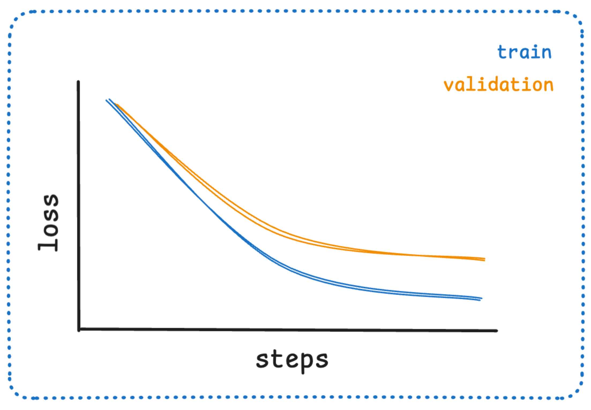
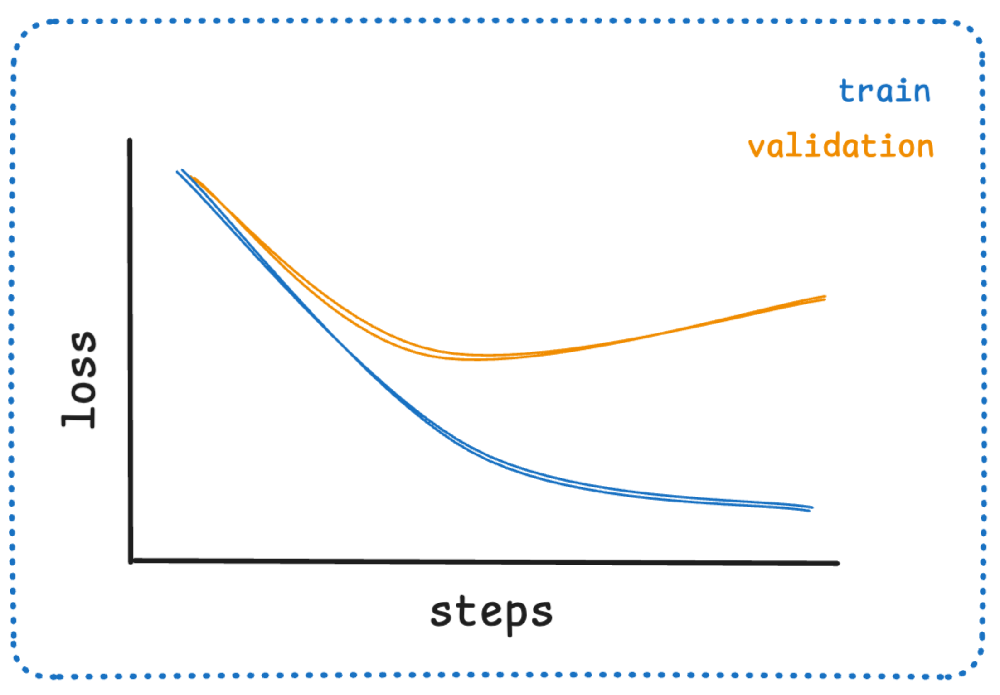
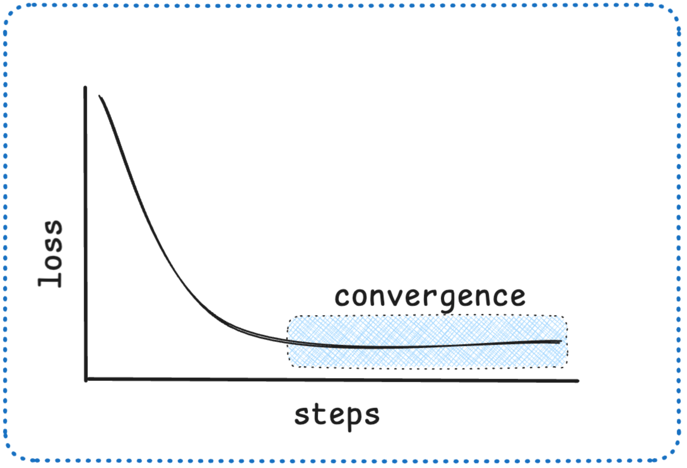
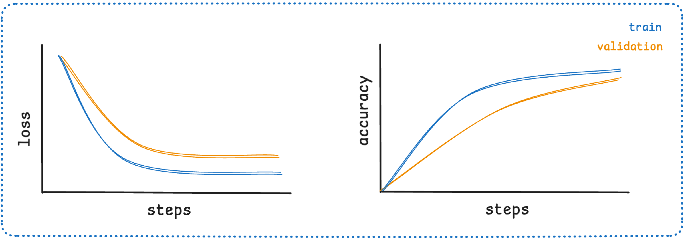
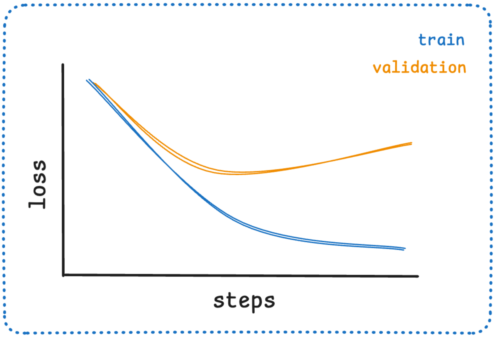
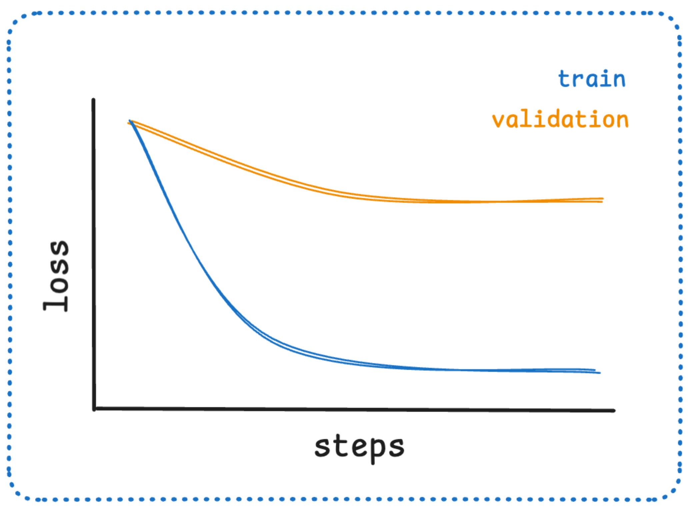
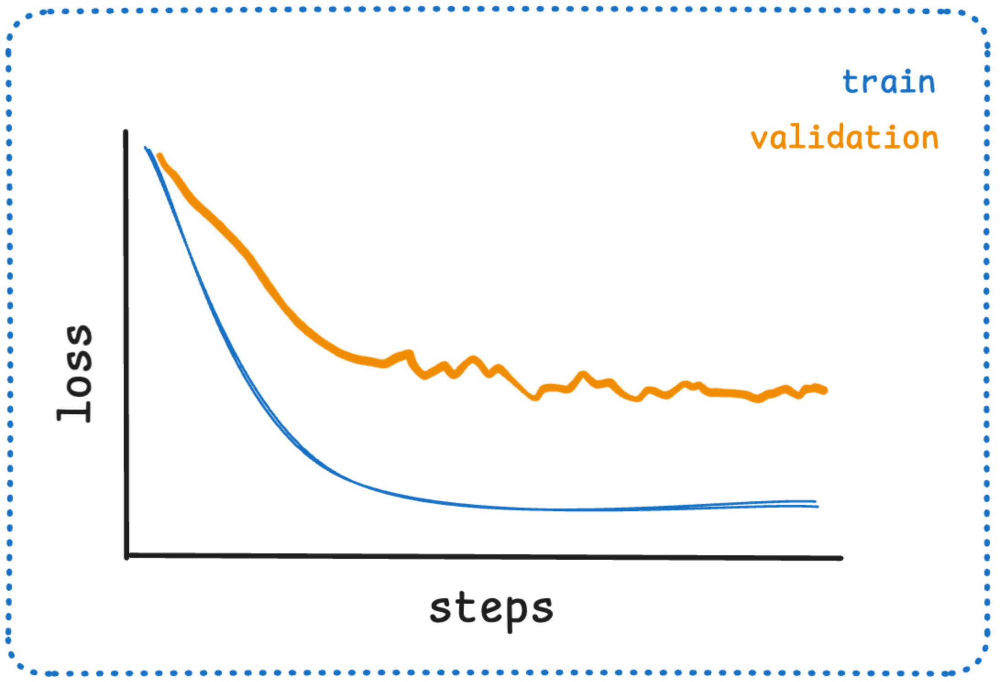
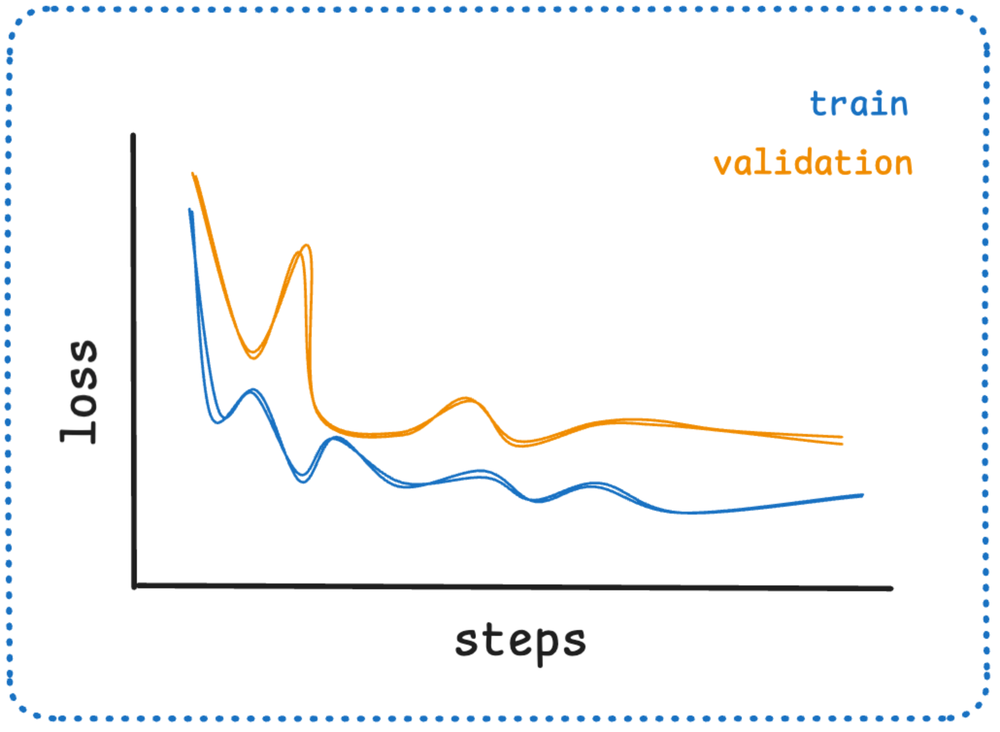

# 事前訓練済みモデルのファインチューニング

## 概要

この記事では、Hugging Face Transformersエコシステムを使用して事前訓練済みモデルをファインチューニングする方法を学習します。モダンな機械学習の最良実践を適用しながら、高レベルなTrainer APIから低レベルなカスタム訓練ループまでを包括的に解説します。

!!! info "参考資料"
    本ドキュメントは [Hugging Face LLM Course](https://huggingface.co/learn/llm-course/chapter3/1) を参考に、日本語で学習内容をまとめた個人的な学習ノートです。詳細な内容や最新情報については、原文も併せてご参照ください。

## 学習目標

この記事を通じて、以下のスキルを習得できます：

* Hugging Face Hubからの大規模データセットの準備と処理
* 高レベルな`Trainer` APIを使用したモダンなベストプラクティスでのモデルファインチューニング
* 最適化テクニックを含むカスタム訓練ループの実装
* Accelerateライブラリを活用した分散訓練の実行
* 最大パフォーマンスのための最新ファインチューニング技術の適用

## 前提知識

- Python基礎知識
- PyTorchの基本的な理解
- 機械学習の基本概念（損失関数、最適化、評価指標）
- Transformersモデルの基本理解

!!! tip "豆知識"
    開始前に、データ処理について[Datasetsドキュメント](https://huggingface.co/docs/datasets/)を確認することをお勧めします。

この記事では、Transformersライブラリ以外のHugging Faceライブラリも紹介します。Datasets、Tokenizers、Accelerate、Evaluateライブラリがどのようにモデル訓練をより効率的かつ効果的にするかを学びます。

各主要セクションでは異なる内容を学習します：

- **セクション2**: モダンなデータ前処理技術と効率的なデータセット処理
- **セクション3**: 最新機能を含む強力なTrainer APIの習得
- **セクション4**: 一から訓練ループを実装し、Accelerateを使用した分散訓練の理解

この記事を完了すると、高レベルAPIとカスタム訓練ループの両方を使用して、独自のデータセットでモデルをファインチューニングできるようになり、この分野の最新ベストプラクティスを適用できるようになります。

この記事では**PyTorch**に特化して説明します。PyTorchはモダンな深層学習研究と本番環境の標準フレームワークとなっているためです。Hugging Faceエコシステムの最新APIとベストプラクティスを使用します。

## データの処理

[前章](02_using_transformers.md)の例を続けて、1つのバッチでシーケンス分類器を訓練する方法を示します：

```python
import torch
from torch.optim import AdamW
from transformers import AutoTokenizer, AutoModelForSequenceClassification

checkpoint = "bert-base-uncased"
tokenizer = AutoTokenizer.from_pretrained(checkpoint)
model = AutoModelForSequenceClassification.from_pretrained(checkpoint)
sequence = [
    "I've been waiting for a HuggingFace course my whole life.",
    "This course is amazing!",
]

batch = tokenizer(sequence, padding=True, truncation=True, return_tensors="pt")

batch["labels"] = torch.tensor([1, 1])

optimizer = AdamW(model.parameters())
loss = model(**batch).loss
loss.backward()
optimizer.step()
```

**実行結果:**
```
Some weights of BertForSequenceClassification were not initialized from the model checkpoint at bert-base-uncased and are newly initialized: ['classifier.bias', 'classifier.weight']
You should probably TRAIN this model on a down-stream task to be able to use it for predictions and inference.
```

当然ながら、2つの文だけでモデルを訓練しても良い結果は得られません。より良い結果を得るためには、より大きなデータセットを準備する必要があります。

このセクションでは、William B. DolanとChris Brockettによる[論文](https://www.aclweb.org/anthology/I05-5002.pdf)で紹介されたMRPC（Microsoft Research Paraphrase Corpus）データセットを例として使用します。このデータセットは5,801組の文ペアで構成され、それらが言い換え（パラフレーズ）かどうか（つまり、両方の文が同じ意味かどうか）を示すラベルが付いています。この章では小さなデータセットであるため、訓練実験が容易だという理由で選択しました。

### Hubからのデータセット読み込み

Hubにはモデルだけでなく、さまざまな言語の複数のデータセットも含まれています。データセットは[こちら](https://huggingface.co/datasets)で閲覧でき、このセクションを完了した後に新しいデータセットの読み込みと処理を試すことをお勧めします（一般的なドキュメントは[こちら](https://huggingface.co/docs/datasets/loading)）。今はMRPCデータセットに焦点を当てましょう！これは[GLUEベンチマーク](https://gluebenchmark.com/)を構成する10個のデータセットの1つで、10の異なるテキスト分類タスクでMLモデルのパフォーマンスを測定するために使用される学術ベンチマークです。

Hugging Face Datasetsライブラリは、Hubのデータセットをダウンロードしてキャッシュする非常にシンプルなコマンドを提供します。MRPCデータセットは次のようにダウンロードできます：

```python
from datasets import load_dataset

raw_datasets = load_dataset("glue", "mrpc")
raw_datasets
```

**実行結果:**
```
DatasetDict({
    train: Dataset({
        features: ['sentence1', 'sentence2', 'label', 'idx'],
        num_rows: 3668
    })
    validation: Dataset({
        features: ['sentence1', 'sentence2', 'label', 'idx'],
        num_rows: 408
    })
    test: Dataset({
        features: ['sentence1', 'sentence2', 'label', 'idx'],
        num_rows: 1725
    })
})
```

ご覧のとおり、訓練セット、検証セット、テストセットを含む`DatasetDict`オブジェクトが得られます。それぞれには複数の列（`sentence1`、`sentence2`、`label`、`idx`）と可変数の行があり、これは各セットの要素数です（つまり、訓練セットには3,668組の文ペア、検証セットには408組、テストセットには1,725組があります）。

!!! tip "豆知識"
    このコマンドはデータセットをダウンロードしてキャッシュし、デフォルトでは*~/.cache/huggingface/datasets*に保存されます。第2章で学んだように、`HF_HOME`環境変数を設定してキャッシュフォルダをカスタマイズできます。

辞書のようにインデックスを使用して、`raw_datasets`オブジェクトの各文ペアにアクセスできます：

```python
raw_train_dataset = raw_datasets["train"]
raw_train_dataset[0]
```

**実行結果:**
```
{'sentence1': 'Amrozi accused his brother , whom he called " the witness " , of deliberately distorting his evidence .',
 'sentence2': 'Referring to him as only " the witness " , Amrozi accused his brother of deliberately distorting his evidence .',
 'label': 1,
 'idx': 0}
```

ラベルはすでに整数になっているので、前処理は不要です。どの整数がどのラベルに対応するかを知るには、`raw_train_dataset`の`features`を調べます。これにより各列のタイプがわかります：

```python
raw_train_dataset.features
```

**実行結果:**
```
{'sentence1': Value('string'),
 'sentence2': Value('string'),
 'label': ClassLabel(names=['not_equivalent', 'equivalent']),
 'idx': Value('int32')}
```

内部的に、`label`は`ClassLabel`タイプで、整数とラベル名のマッピングは*names*フォルダに保存されています。`0`は`not_equivalent`に対応し、`1`は`equivalent`に対応します。

!!! tip "試してみよう！"
    訓練セットの15番目の要素と検証セットの87番目の要素を見てください。それらのラベルは何ですか？

```python
# 訓練セットの15番目の要素
train_label_15th = raw_train_dataset[14]["label"]
class_label = raw_train_dataset.features["label"]
print(class_label.int2str(train_label_15th))

# 検証セットの87番目の要素
raw_test_dataset = raw_datasets["test"]
test_label_87th = raw_test_dataset[86]["label"]
class_label = raw_test_dataset.features["label"]
print(class_label.int2str(test_label_87th))
```

**実行結果:**
```
not_equivalent
equivalent
```

### データセットの前処理

データセットを前処理するためには、テキストをモデルが理解できる数値に変換する必要があります。[前章](02_using_transformers.md)で学んだように、この処理はトークナイザーで行います。

トークナイザーには1つの文または文のリストを渡すことができるため、各ペアのすべての第1文とすべての第2文を直接トークン化できます：

```python
from transformers import AutoTokenizer

checkpoint = "bert-base-uncased"
tokenizer = AutoTokenizer.from_pretrained(checkpoint)
tokenized_sentences_1 = tokenizer(list(raw_datasets["train"]["sentence1"]))
tokenized_sentences_2 = tokenizer(list(raw_datasets["train"]["sentence2"]))
```

しかし、2つのシーケンスをモデルに渡して、文が言い換えかどうかの予測を得ることはできません。2つのシーケンスをペアとして処理し、適切な前処理を適用する必要があります。

幸い、トークナイザーはシーケンスのペアも受け取ることができ、BERTモデルが期待する形式で準備できます：

```python
from pprint import pprint
inputs = tokenizer("This is the first sentence.", "This is the second one.")
pprint(inputs, compact=True)
```

**実行結果:**
```
{'attention_mask': [1, 1, 1, 1, 1, 1, 1, 1, 1, 1, 1, 1, 1, 1, 1],
 'input_ids': [101, 2023, 2003, 1996, 2034, 6251, 1012, 102, 2023, 2003, 1996,
               2117, 2028, 1012, 102],
 'token_type_ids': [0, 0, 0, 0, 0, 0, 0, 0, 1, 1, 1, 1, 1, 1, 1]}
```

[第2章](02_using_transformers.md)で`input_ids`と`attention_mask`キーについて説明しましたが、`token_type_ids`については後回しにしていました。この例では、これがモデルに入力のどの部分が第1文でどの部分が第2文かを伝えるものです。

!!! tip "試してみよう！"
    訓練セットの15番目の要素を取り、2つの文を別々にトークン化し、ペアとしてもトークン化してください。2つの結果の違いは何ですか？

```python
# 訓練セットの15番目の要素
raw_train_dataset_15th = raw_datasets["train"][14]
sentence1 = raw_train_dataset_15th["sentence1"]
sentence2 = raw_train_dataset_15th["sentence2"]

tokens_s1 = tokenizer(sentence1)
tokens_s2 = tokenizer(sentence2)

tokens_pair = tokenizer(sentence1, sentence2)

print("sentence1:")
pprint(tokens_s1, compact=True)
print("sentence2:")
pprint(tokens_s2, compact=True)
print("pair:")
pprint(tokens_pair, compact=True)
```

**実行結果:**
```
sentence1:
{'attention_mask': [1, 1, 1, 1, 1, 1, 1, 1, 1, 1, 1, 1, 1, 1, 1, 1, 1, 1, 1, 1,
                    1, 1, 1, 1],
 'input_ids': [101, 1043, 7677, 22637, 2002, 10993, 3917, 1010, 2132, 1997,
               1996, 2334, 7071, 3131, 1010, 2056, 1996, 2873, 2001, 4755, 4229,
               5467, 1012, 102],
 'token_type_ids': [0, 0, 0, 0, 0, 0, 0, 0, 0, 0, 0, 0, 0, 0, 0, 0, 0, 0, 0, 0,
                    0, 0, 0, 0]}
sentence2:
{'attention_mask': [1, 1, 1, 1, 1, 1, 1, 1, 1, 1, 1, 1, 1, 1, 1, 1, 1, 1, 1, 1,
                    1, 1, 1, 1, 1, 1, 1, 1, 1, 1],
 'input_ids': [101, 1996, 2132, 1997, 1996, 2334, 7071, 3131, 1010, 1043, 7677,
               22637, 2002, 10993, 3917, 1010, 2056, 1996, 2873, 4062, 2018,
               3478, 2000, 18235, 2094, 2417, 2644, 4597, 1012, 102],
 'token_type_ids': [0, 0, 0, 0, 0, 0, 0, 0, 0, 0, 0, 0, 0, 0, 0, 0, 0, 0, 0, 0,
                    0, 0, 0, 0, 0, 0, 0, 0, 0, 0]}
pair:
{'attention_mask': [1, 1, 1, 1, 1, 1, 1, 1, 1, 1, 1, 1, 1, 1, 1, 1, 1, 1, 1, 1,
                    1, 1, 1, 1, 1, 1, 1, 1, 1, 1, 1, 1, 1, 1, 1, 1, 1, 1, 1, 1,
                    1, 1, 1, 1, 1, 1, 1, 1, 1, 1, 1, 1, 1],
 'input_ids': [101, 1043, 7677, 22637, 2002, 10993, 3917, 1010, 2132, 1997,
               1996, 2334, 7071, 3131, 1010, 2056, 1996, 2873, 2001, 4755, 4229,
               5467, 1012, 102, 1996, 2132, 1997, 1996, 2334, 7071, 3131, 1010,
               1043, 7677, 22637, 2002, 10993, 3917, 1010, 2056, 1996, 2873,
               4062, 2018, 3478, 2000, 18235, 2094, 2417, 2644, 4597, 1012,
               102],
 'token_type_ids': [0, 0, 0, 0, 0, 0, 0, 0, 0, 0, 0, 0, 0, 0, 0, 0, 0, 0, 0, 0,
                    0, 0, 0, 0, 1, 1, 1, 1, 1, 1, 1, 1, 1, 1, 1, 1, 1, 1, 1, 1,
                    1, 1, 1, 1, 1, 1, 1, 1, 1, 1, 1, 1, 1]}
```

`input_ids`内のIDを単語にデコードすると：

```python
tokens = tokenizer.convert_ids_to_tokens(inputs["input_ids"])
print(tokens)
```

**実行結果:**
```
['[CLS]', 'this', 'is', 'the', 'first', 'sentence', '.', '[SEP]', 'this', 'is', 'the', 'second', 'one', '.', '[SEP]']
```

ご覧のとおり、`[CLS] sentence1 [SEP]`に対応する入力の部分はすべてトークンタイプID `0`を持ち、他の部分（`sentence2 [SEP]`に対応）はすべてトークンタイプID `1`を持ちます。

異なるチェックポイントを選択した場合、トークン化された入力に`token_type_ids`が必ずしも含まれるとは限らないことに注意してください（例えば、DistilBERTモデルを使用した場合は返されません）。これらは、モデルが事前訓練中にそれらを見ているため、それらをどう処理するかを知っている場合にのみ返されます。

ここで、BERTはトークンタイプIDで事前訓練されており、第1章で説明したマスク言語モデリング目的に加えて、_次文予測_と呼ばれる追加の目的があります。このタスクの目標は、文ペア間の関係をモデリングすることです。

次文予測では、モデルに文のペア（ランダムにマスクされたトークンを含む）が提供され、第2文が第1文に続くかどうかを予測するよう求められます。タスクを自明でなくするため、半分の時間では文は元の文書で互いに続いており、残りの半分では2つの文は2つの異なる文書から来ています。

一般的に、トークン化された入力に`token_type_ids`があるかどうか心配する必要はありません。トークナイザーとモデルに同じチェックポイントを使用する限り、トークナイザーが自分のモデルに何を提供すべきかを知っているため、すべて問題ありません。

トークナイザーが1組の文をどう処理できるかを見たので、それを使用してデータセット全体をトークン化できます。第2章のように、第1文のリスト、次に第2文のリストを渡すことで、文ペアのリストをトークナイザーに渡すことができます。これは第2章で見たパディングと切り詰めオプションとも互換性があります。したがって、訓練データセットを前処理する1つの方法は：

```python
tokenized_dataset = tokenizer(
    list(raw_datasets["train"]["sentence1"]),
    list(raw_datasets["train"]["sentence2"]),
    padding=True,
    truncation=True
)
for k, v in tokenized_dataset.items():
    print(k, v[:2])  # 2サンプル
```

**実行結果:**
```
input_ids [[101, 2572, 3217, 5831, 5496, 2010, 2567, 1010, 3183, 2002, 2170, 1000, 1996, 7409, 1000, 1010, 1997, 9969, 4487, 23809, 3436, 2010, 3350, 1012, 102, 7727, 2000, 2032, 2004, 2069, 1000, 1996, 7409, 1000, 1010, 2572, 3217, 5831, 5496, 2010, 2567, 1997, 9969, 4487, 23809, 3436, 2010, 3350, 1012, 102, 0, 0, 0, 0, 0, 0, 0, 0, 0, 0, 0, 0, 0, 0, 0, 0, 0, 0, 0, 0, 0, 0, 0, 0, 0, 0, 0, 0, 0, 0, 0, 0, 0, 0, 0, 0, 0, 0, 0, 0, 0, 0, 0, 0, 0, 0, 0, 0, 0, 0, 0, 0, 0], [101, 9805, 3540, 11514, 2050, 3079, 11282, 2243, 1005, 1055, 2077, 4855, 1996, 4677, 2000, 3647, 4576, 1999, 2687, 2005, 1002, 1016, 1012, 1019, 4551, 1012, 102, 9805, 3540, 11514, 2050, 4149, 11282, 2243, 1005, 1055, 1999, 2786, 2005, 1002, 6353, 2509, 2454, 1998, 2853, 2009, 2000, 3647, 4576, 2005, 1002, 1015, 1012, 1022, 4551, 1999, 2687, 1012, 102, 0, 0, 0, 0, 0, 0, 0, 0, 0, 0, 0, 0, 0, 0, 0, 0, 0, 0, 0, 0, 0, 0, 0, 0, 0, 0, 0, 0, 0, 0, 0, 0, 0, 0, 0, 0, 0, 0, 0, 0, 0, 0, 0, 0]]
token_type_ids [[0, 0, 0, 0, 0, 0, 0, 0, 0, 0, 0, 0, 0, 0, 0, 0, 0, 0, 0, 0, 0, 0, 0, 0, 0, 1, 1, 1, 1, 1, 1, 1, 1, 1, 1, 1, 1, 1, 1, 1, 1, 1, 1, 1, 1, 1, 1, 1, 1, 1, 0, 0, 0, 0, 0, 0, 0, 0, 0, 0, 0, 0, 0, 0, 0, 0, 0, 0, 0, 0, 0, 0, 0, 0, 0, 0, 0, 0, 0, 0, 0, 0, 0, 0, 0, 0, 0, 0, 0, 0, 0, 0, 0, 0, 0, 0, 0, 0, 0, 0, 0, 0, 0], [0, 0, 0, 0, 0, 0, 0, 0, 0, 0, 0, 0, 0, 0, 0, 0, 0, 0, 0, 0, 0, 0, 0, 0, 0, 0, 0, 1, 1, 1, 1, 1, 1, 1, 1, 1, 1, 1, 1, 1, 1, 1, 1, 1, 1, 1, 1, 1, 1, 1, 1, 1, 1, 1, 1, 1, 1, 1, 1, 0, 0, 0, 0, 0, 0, 0, 0, 0, 0, 0, 0, 0, 0, 0, 0, 0, 0, 0, 0, 0, 0, 0, 0, 0, 0, 0, 0, 0, 0, 0, 0, 0, 0, 0, 0, 0, 0, 0, 0, 0, 0, 0, 0]]
attention_mask [[1, 1, 1, 1, 1, 1, 1, 1, 1, 1, 1, 1, 1, 1, 1, 1, 1, 1, 1, 1, 1, 1, 1, 1, 1, 1, 1, 1, 1, 1, 1, 1, 1, 1, 1, 1, 1, 1, 1, 1, 1, 1, 1, 1, 1, 1, 1, 1, 1, 1, 0, 0, 0, 0, 0, 0, 0, 0, 0, 0, 0, 0, 0, 0, 0, 0, 0, 0, 0, 0, 0, 0, 0, 0, 0, 0, 0, 0, 0, 0, 0, 0, 0, 0, 0, 0, 0, 0, 0, 0, 0, 0, 0, 0, 0, 0, 0, 0, 0, 0, 0, 0, 0], [1, 1, 1, 1, 1, 1, 1, 1, 1, 1, 1, 1, 1, 1, 1, 1, 1, 1, 1, 1, 1, 1, 1, 1, 1, 1, 1, 1, 1, 1, 1, 1, 1, 1, 1, 1, 1, 1, 1, 1, 1, 1, 1, 1, 1, 1, 1, 1, 1, 1, 1, 1, 1, 1, 1, 1, 1, 1, 1, 0, 0, 0, 0, 0, 0, 0, 0, 0, 0, 0, 0, 0, 0, 0, 0, 0, 0, 0, 0, 0, 0, 0, 0, 0, 0, 0, 0, 0, 0, 0, 0, 0, 0, 0, 0, 0, 0, 0, 0, 0, 0, 0, 0]]
```

これは良い方法ですが、辞書を返す（`input_ids`、`attention_mask`、`token_type_ids`というキーと、リストのリストである値を持つ）という欠点があります。また、トークン化中にデータセット全体をメモリに保存するのに十分なRAMがある場合にのみ機能します（Hugging Face Datasetsライブラリのデータセットは[Apache Arrow](https://arrow.apache.org/)ファイルとしてディスクに保存されるため、要求したサンプルのみがメモリに読み込まれます）。

データをデータセットとして保持するには、[`Dataset.map()`](https://huggingface.co/docs/datasets/package_reference/main_classes#datasets.Dataset.map)メソッドを使用します。これにより、トークン化以上の前処理が必要な場合に追加の柔軟性も得られます。`map()`メソッドは、データセットの各要素に関数を適用することで機能するため、入力をトークン化する関数を定義しましょう：

```python
def tokenize_function(example):
    return tokenizer(example["sentence1"], example["sentence2"], truncation=True)
```

この関数は辞書（データセットの項目のような）を受け取り、`input_ids`、`attention_mask`、`token_type_ids`キーを持つ新しい辞書を返します。`example`辞書に複数のサンプル（各キーが文のリスト）が含まれている場合でも機能することに注意してください。これは、前に見たように、`tokenizer`が文ペアのリストで動作するためです。これにより、`map()`の呼び出しで`batched=True`オプションを使用でき、トークン化が大幅に高速化されます。`tokenizer`は[Hugging Face Tokenizers](https://github.com/huggingface/tokenizers)ライブラリのRustで書かれたトークナイザーによってサポートされています。このトークナイザーは非常に高速ですが、一度に多くの入力を与えた場合にのみその効果を発揮します。

今のところ、トークン化関数で`padding`引数を省略していることに注意してください。これは、すべてのサンプルを最大長にパディングするのは効率的ではないためです。バッチを構築する際にサンプルをパディングする方が良く、その場合はデータセット全体の最大長ではなく、そのバッチ内の最大長にのみパディングすれば済みます。これにより、入力の長さが非常に変動する場合に多くの時間と処理能力を節約できます！

以下は、すべてのデータセットに一度にトークン化関数を適用する方法です。`map`の呼び出しで`batched=True`を使用しているため、関数はデータセットの各要素に個別ではなく、データセットの複数要素に一度に適用されます。これにより、より高速な前処理が可能になります。

```python
tokenized_datasets = raw_datasets.map(tokenize_function, batched=True)
print(tokenized_datasets)
```

**実行結果:**
```
Map:   0%|          | 0/1725 [00:00<?, ? examples/s]
Map: 100%|██████████| 1725/1725 [00:00<00:00, 35443.43 examples/s]

DatasetDict({
    train: Dataset({
        features: ['sentence1', 'sentence2', 'label', 'idx', 'input_ids', 'token_type_ids', 'attention_mask'],
        num_rows: 3668
    })
    validation: Dataset({
        features: ['sentence1', 'sentence2', 'label', 'idx', 'input_ids', 'token_type_ids', 'attention_mask'],
        num_rows: 408
    })
    test: Dataset({
        features: ['sentence1', 'sentence2', 'label', 'idx', 'input_ids', 'token_type_ids', 'attention_mask'],
        num_rows: 1725
    })
})
```

Datasetsライブラリがこの処理を適用する方法は、前処理関数によって返される辞書の各キーに対して、データセットに新しいフィールドを追加することです。

`tokenize_function`は`input_ids`、`attention_mask`、`token_type_ids`キーを持つ辞書を返すため、これら3つのフィールドがデータセットのすべての分割に追加されます。前処理関数が`map()`を適用したデータセット内の既存のキーに対して新しい値を返した場合、既存のフィールドも変更できることに注意してください。

最後に行う必要があるのは、要素をバッチにまとめる際に、最も長い要素の長さまですべての例をパディングすることです — これを*動的パディング*と呼びます。

#### 動的パディング

バッチ内でサンプルをまとめる役割を果たす関数は*collate関数*と呼ばれます。これは`DataLoader`を構築する際に渡すことができる引数で、デフォルトはサンプルをPyTorchテンソルに変換して連結する関数です（要素がリスト、タプル、または辞書の場合は再帰的に）。私たちのケースでは、すべての入力が同じサイズではないため、これは不可能です。意図的にパディングを遅らせ、各バッチで必要な分だけ適用し、過度に長い入力と大量のパディングを避けています。これにより訓練がかなり高速化されますが、TPUで訓練している場合は問題を引き起こす可能性があることに注意してください — TPUは追加のパディングが必要でも固定された形状を好みます。

実際にこれを行うには、データセットの項目をバッチにまとめたい場合に、適切な量のパディングを適用するcollate関数を定義する必要があります。幸い、Transformersライブラリは`DataCollatorWithPadding`を通じてそのような関数を提供しています。インスタンス化時にトークナイザーを受け取り（使用するパディングトークンや、モデルがパディングを入力の左側または右側に期待するかを知るため）、必要なすべての処理を行います：

```python
from transformers import DataCollatorWithPadding

data_collator = DataCollatorWithPadding(tokenizer=tokenizer)
```

この新しいツールをテストするため、バッチにまとめたい訓練セットからいくつかのサンプルを取得しましょう。ここでは、文字列を含み、テンソルを作成できない（文字列でテンソルを作成することはできない）`idx`、`sentence1`、`sentence2`列を削除し、バッチ内の各エントリの長さを見てみます：

```python
samples = tokenized_datasets["train"][:8]
samples = {k: v for k, v in samples.items() if k not in ["idx", "sentence1", "sentence2"]}
[len(x) for x in samples["input_ids"]]
```

**実行結果:**
```
[50, 59, 47, 67, 59, 50, 62, 32]
```

驚くことではありませんが、32から67までの様々な長さのサンプルが得られます。動的パディングとは、このバッチ内のサンプルはすべて、バッチ内の最大長である67までパディングされるべきということです。動的パディングなしでは、すべてのサンプルをデータセット全体の最大長、またはモデルが受け入れることができる最大長までパディングする必要があります。`data_collator`がバッチを適切に動的パディングしているかダブルチェックしましょう：

```python
batch = data_collator(samples)
{k: v.shape for k, v in batch.items()}
```

**実行結果:**
```
{'input_ids': torch.Size([8, 67]),
 'token_type_ids': torch.Size([8, 67]),
 'attention_mask': torch.Size([8, 67]),
 'labels': torch.Size([8])}
```

## Trainer APIを使用したモデルのファインチューニング

以下のコード例は、前のセクションの例をすでに実行していることを前提としています。必要なもののショート要約を以下に示します：

```python
from datasets import load_dataset
from transformers import AutoTokenizer, DataCollatorWithPadding

raw_datasets = load_dataset("glue", "mrpc")
checkpoint = "bert-base-uncased"
tokenizer = AutoTokenizer.from_pretrained(checkpoint)

def tokenize_function(example):
    return tokenizer(example["sentence1"],example["sentence2"], truncation=True)

tokenized_datasets = raw_datasets.map(tokenize_function, batched=True)
data_collator = DataCollatorWithPadding(tokenizer=tokenizer)
```

**実行結果:**
```
Map: 100%|██████████| 1725/1725 [00:00<00:00, 31091.75 examples/s]
```

### 訓練

`Trainer`を定義する前の最初のステップは、`Trainer`が訓練と評価に使用するすべてのハイパーパラメータを含む`TrainingArguments`クラスを定義することです。提供する必要がある唯一の引数は、訓練されたモデルが保存されるディレクトリと、途中のチェックポイントです。残りはすべてデフォルトのままにでき、基本的なファインチューニングにはかなり良く機能するはずです。

```python
from transformers import TrainingArguments

training_args = TrainingArguments("test-trainer")
```

!!! tip "高度な設定"
    利用可能なすべての訓練引数と最適化戦略の詳細については、[TrainingArgumentsドキュメント](https://huggingface.co/docs/transformers/main/en/main_classes/trainer#transformers.TrainingArguments)と[訓練設定クックブック](https://huggingface.co/learn/cookbook/en/fine_tuning_code_llm_on_single_gpu)をご確認ください。

2番目のステップはモデルを定義することです。

```python
from transformers import AutoModelForSequenceClassification

model = AutoModelForSequenceClassification.from_pretrained(checkpoint, num_labels=2)
```

**実行結果:**
```
Some weights of BertForSequenceClassification were not initialized from the model checkpoint at bert-base-uncased and are newly initialized: ['classifier.bias', 'classifier.weight']
You should probably TRAIN this model on a down-stream task to be able to use it for predictions and inference.
```

この事前訓練されたモデルをインスタンス化した後に警告が表示されます。これは、BERTが文ペアの分類で事前訓練されていないため、事前訓練されたモデルのヘッドが破棄され、シーケンス分類に適した新しいヘッドが代わりに追加されたためです。警告は、一部の重みが使用されなかった（破棄された事前訓練ヘッドに対応）こと、および他の重みがランダムに初期化された（新しいヘッド用）ことを示しています。モデルを訓練することを推奨して終わり、それがまさに今から行うことです。

モデルができたら、これまでに構築したすべてのオブジェクト（`model`、`training_args`、訓練と検証データセット、`data_collator`、`processing_class`）を渡して`Trainer`を定義できます。`processing_class`パラメータは、Trainerに処理に使用するトークナイザーを伝える新しい追加機能です：

```python
from transformers import Trainer

trainer = Trainer(
    model,
    training_args,
    train_dataset=tokenized_datasets["train"],
    eval_dataset=tokenized_datasets["validation"],
    data_collator=data_collator,
    processing_class=tokenizer,
)
```

`processing_class`としてトークナイザーを渡すと、`Trainer`によって使用されるデフォルトの`data_collator`は`DataCollatorWithPadding`になります。この場合、`data_collator=data_collator`行をスキップできますが、処理パイプラインのこの重要な部分を示すためにここに含めました。

データセットでモデルをファインチューニングするには、`Trainer`の`train()`メソッドを呼び出すだけです：

```python
trainer.train()
```

**実行結果:**

|Step|Training Loss|
|-|-|
|500|0.576900|
|1000|0.369200|

これによりファインチューニングが開始されます（GPUで数分程度かかります）。500ステップごとに訓練損失が報告されます。ただし、モデルがどの程度良く（または悪く）実行されているかは教えてくれません。これは以下の理由によります：

1. `TrainingArguments`で`eval_strategy`を`"steps"`（`eval_steps`ごとに評価）または`"epoch"`（各エポックの終わりに評価）に設定して、訓練中に評価するよう`Trainer`に指示しませんでした。
2. その評価中にメトリックを計算するための`compute_metrics()`関数を`Trainer`に提供しませんでした（そうでなければ評価は損失のみを出力し、これはあまり直感的な数値ではありません）。

### 評価

有用な`compute_metrics()`関数を構築し、次回の訓練時に使用する方法を見てみましょう。この関数は`EvalPrediction`オブジェクト（`predictions`フィールドと`label_ids`フィールドを持つ名前付きタプル）を受け取り、文字列から浮動小数点数へのマッピングである辞書を返す必要があります（文字列は返されるメトリックの名前、浮動小数点数はその値）。モデルからいくつかの予測を得るには、`Trainer.predict()`コマンドを使用できます：

```python
predictions = trainer.predict(tokenized_datasets["validation"])
print(predictions.predictions.shape, predictions.label_ids.shape)
```

**実行結果:**
```
(408, 2) (408,)
```

`predict()`メソッドの出力は、3つのフィールドを持つ別の名前付きタプルです：`predictions`、`label_ids`、`metrics`。`metrics`フィールドには、渡されたデータセットでの損失と、いくつかの時間メトリック（予測にかかった時間の合計と平均）が含まれます。`compute_metrics()`関数を完成させて`Trainer`に渡すと、そのフィールドには`compute_metrics()`によって返されるメトリックも含まれます。

ご覧のとおり、`predictions`は408 x 2の形状を持つ2次元配列です（408は使用したデータセットの要素数）。これらは`predict()`に渡したデータセットの各要素のロジットです（前章で見たように、すべてのTransformerモデルはロジットを返します）。それらをラベルと比較できる予測に変換するには、2番目の軸で最大値のインデックスを取る必要があります：

```python
import numpy as np

preds = np.argmax(predictions.predictions, axis=-1)
```

これで、これらの`preds`をラベルと比較できます。`compute_metric()`関数を構築するために、[Evaluate](https://github.com/huggingface/evaluate/)ライブラリのメトリックを使用します。データセットを読み込んだのと同じように簡単に、MRPCデータセットに関連するメトリックを読み込むことができます。今回は`evaluate.load()`関数を使用します。返されるオブジェクトには、メトリック計算に使用できる`compute()`メソッドがあります：

```python
import evaluate
metric = evaluate.load("glue", "mrpc")
metric.compute(predictions=preds, references=predictions.label_ids)
```

**実行結果:**
```
{'accuracy': 0.8651960784313726, 'f1': 0.9063032367972743}
```

得られる正確な結果は異なる場合があります。これは、モデルヘッドのランダム初期化によって到達したメトリックが変わる可能性があるためです。ここでは、モデルが検証セットで86.52%の精度と90.63%のF1スコアを持つことがわかります。これらは、GLUEベンチマークのMRPCデータセットで結果を評価するために使用される2つのメトリックです。[BERTペーパー](https://arxiv.org/pdf/1810.04805.pdf)の表では、ベースモデルで88.9のF1スコアが報告されています。それは`uncased`モデルでしたが、現在`cased`モデルを使用しているため、より良い結果が説明できます。

すべてをまとめると、`compute_metrics()`関数は次のようになります：

```python
def compute_metrics(eval_preds):
    metric = evaluate.load("glue", "mrpc")
    logits, labels = eval_preds
    predictions = np.argmax(logits, axis=-1)
    return metric.compute(predictions=predictions, references=labels)
```

各エポックの終わりにメトリックを報告するために実際に使用されているのを見るために、この`compute_metrics()`関数で新しい`Trainer`を定義する方法を示します：

```python
training_args = TrainingArguments("test-trainer", eval_strategy="epoch")
model = AutoModelForSequenceClassification.from_pretrained(checkpoint, num_labels=2)

trainer = Trainer(
    model,
    training_args,
    train_dataset=tokenized_datasets["train"],
    eval_dataset=tokenized_datasets["validation"],
    data_collator=data_collator,
    processing_class=tokenizer,
    compute_metrics=compute_metrics,
)
```

**実行結果:**
```
Some weights of BertForSequenceClassification were not initialized from the model checkpoint at bert-base-uncased and are newly initialized: ['classifier.bias', 'classifier.weight']
You should probably TRAIN this model on a down-stream task to be able to use it for predictions and inference.
```

`eval_strategy`を`"epoch"`に設定した新しい`TrainingArguments`と新しいモデルを作成することに注意してください。そうでなければ、すでに訓練したモデルの訓練を続けるだけになってしまいます。新しい訓練実行を開始するには、以下を実行します：

```python
trainer.train()
```

**実行結果:**
```
|Epoch	|Training Loss	|Validation Loss	|Accuracy	|F1|
|-|-|-|-|-|
|1|	No log|	0.381103|	0.845588	|0.890815|
|2|	0.519900|	0.458264|	0.852941	|0.897611|
|3|	0.292800	|0.665536	|0.857843	|0.900685|
```

今回は、訓練損失に加えて、各エポックの終わりに検証損失とメトリックが報告されます。再び、モデルのランダムヘッド初期化のため、到達する正確な精度/F1スコアは私たちが見つけたものとは少し異なるかもしれませんが、同じような範囲にあるはずです。

### 高度な訓練機能

`Trainer`には、モダンな深層学習のベストプラクティスをアクセスしやすくする多くの組み込み機能があります：

**混合精度訓練**: GPUメモリを節約し、訓練を高速化：

```python
training_args = TrainingArguments(
    "test-training",
    eval_strategy="epoch",
    fp16=True  # 混合精度を有効化
)
```

**勾配累積**: GPUメモリが限られている場合の効果的な大きなバッチサイズ：

```python
training_args = TrainingArguments(
    "test-trainer",
    eval_strategy="epoch",
    per_device_train_batch_size=4,
    gradient_accumulation_steps=4,  # 効果的なバッチサイズ = 4 * 4 = 16
)
```

**学習率スケジューリング**: Trainerはデフォルトで線形減衰を使用しますが、これをカスタマイズできます：

```python
training_args = TrainingArguments(
    "test-trainer",
    eval_strategy="epoch",
    learning_rate=2e-5,
    lr_scheduler_type="cosine",  # 異なるスケジューラーを試す
)
```

## 完全な訓練ループ

最後のセクションで行ったのと同じ結果を、`Trainer`クラスを使用せずに、モダンなPyTorchベストプラクティスでスクラッチから訓練ループを実装して達成する方法を見ていきます。再び、セクション2でデータ処理を行ったと仮定します。必要なすべてをカバーする短い要約を以下に示します：

```python
from datasets import load_dataset
from transformers import AutoTokenizer, DataCollatorWithPadding

raw_datasets = load_dataset("glue", "mrpc")
checkpoint = "bert-base-uncased"
tokenizer = AutoTokenizer.from_pretrained(checkpoint)


def tokenize_function(example):
    return tokenizer(example["sentence1"], example["sentence2"], truncation=True)


tokenized_datasets = raw_datasets.map(tokenize_function, batched=True)
data_collator = DataCollatorWithPadding(tokenizer=tokenizer)
```

**実行結果:**
```
Map: 100%|██████████| 3668/3668 [00:00<00:00, 33587.91 examples/s]
```

### 訓練の準備

実際に訓練ループを書く前に、いくつかのオブジェクトを定義する必要があります。最初のものは、バッチを反復処理するために使用するデータローダーです。しかし、これらのデータローダーを定義する前に、`tokenized_datasets`に少し後処理を適用し、`Trainer`が自動的に行ったいくつかのことを処理する必要があります。具体的には、以下が必要です：

- モデルが期待しない値に対応する列を削除する（`sentence1`や`sentence2`列など）
- 列`label`を`labels`に名前変更する（モデルは引数が`labels`という名前であることを期待するため）
- リストではなくPyTorchテンソルを返すようにデータセットの形式を設定する

`tokenized_datasets`には、これらの各ステップに対応するメソッドがあります：

```python
tokenized_datasets = tokenized_datasets.remove_columns(["sentence1", "sentence2", "idx"])
tokenized_datasets = tokenized_datasets.rename_column("label", "labels")
tokenized_datasets.set_format("torch")
```

```python
tokenized_datasets["train"].column_names
```

**実行結果:**
```
['labels', 'input_ids', 'token_type_ids', 'attention_mask']
```

これで完了したので、データローダーを簡単に定義できます：

```python
from torch.utils.data import DataLoader

train_dataloader = DataLoader(
    tokenized_datasets["train"], shuffle=True, batch_size=8, collate_fn=data_collator
)

eval_dataloader = DataLoader(
    tokenized_datasets["validation"], batch_size=8, collate_fn=data_collator
)
```

データ処理に間違いがないことを素早く確認するために、このようにバッチを検査できます：

```python
for batch in train_dataloader:
    break
{k: v.shape for k, v in batch.items()}
```

**実行結果:**
```
{'labels': torch.Size([8]),
 'input_ids': torch.Size([8, 70]),
 'token_type_ids': torch.Size([8, 70]),
 'attention_mask': torch.Size([8, 70])}
```

訓練データローダーに`shuffle=True`を設定し、バッチ内の最大長にパディングしているため、実際の形状はおそらく少し異なることに注意してください。

データ前処理が完全に終了したので（あらゆるML実践者にとって満足のいく、しかし捉えどころのない目標）、モデルに目を向けましょう。前のセクションと全く同じようにインスタンス化します：

```python
from transformers import AutoModelForSequenceClassification

model = AutoModelForSequenceClassification.from_pretrained(checkpoint, num_labels=2)
```

**実行結果:**
```
Some weights of BertForSequenceClassification were not initialized from the model checkpoint at bert-base-uncased and are newly initialized: ['classifier.bias', 'classifier.weight']
You should probably TRAIN this model on a down-stream task to be able to use it for predictions and inference.
```

損失とロジットの両方を取得していることを確認するために、実際にこのモデルを1つのバッチで通します：

```python
batch = batch.to("mps")
outputs = model(**batch)
print(outputs.loss, outputs.logits.shape)
```

**実行結果:**
```
tensor(0.0035, device='mps:0', grad_fn=<NllLossBackward0>) torch.Size([8, 2])
```

すべてのHugging Face Transformersモデルは、`labels`が提供されると損失を返し、ロジットも取得できます（バッチ内の各入力に対して2つ、つまり8 x 2のサイズのテンソル）。

訓練ループを書く準備がほぼ整いました！あと2つだけ必要なものがあります：オプティマイザーと学習率スケジューラーです。`Trainer`が手動で行っていたことを再現しようとしているので、同じデフォルトを使用します。`Trainer`が使用するオプティマイザーは`AdamW`で、これはAdamと同じですが、重み減衰正則化のひねりがあります（Ilya LoshchilovとFrank Hutterによる["Decoupled Weight Decay Regularization"](https://arxiv.org/abs/1711.05101)を参照）：

```python
from torch.optim import AdamW

optimizer = AdamW(model.parameters(), lr=5e-5)
```

!!! tip "モダン最適化のコツ"
    さらに良いパフォーマンスのために、以下を試すことができます：

    - **重み減衰付きAdamW**: `AdamW(model.parameters(), lr=5e-5, weight_decay=0.01)`
    - **8ビットAdam**: メモリ効率的な最適化のために`bitsandbytes`を使用
    - **異なる学習率**: 大きなモデルには低い学習率（1e-5から3e-5）がしばしば良く機能します

最後に、デフォルトで使用される学習率スケジューラーは、最大値（5e-5）から0への単純な線形減衰です。適切に定義するには、実行する訓練ステップ数を知る必要があります。これは、実行したいエポック数に訓練バッチ数（訓練データローダーの長さ）を掛けたものです。`Trainer`はデフォルトで3エポックを使用するので、それに従います：

```python
from transformers import get_scheduler
num_epochs = 3
num_training_steps = num_epochs * len(train_dataloader)

lr_scheduler = get_scheduler(
    "linear",
    optimizer=optimizer,
    num_warmup_steps=0,
    num_training_steps=num_training_steps
)

print(num_training_steps)
```

**実行結果:**
```
1377
```

### 訓練ループ

最後の1つ：GPUにアクセスできる場合はそれを使用したいです（CPUでは、訓練に数分ではなく数時間かかる可能性があります）。これを行うために、モデルとバッチを配置する`device`を定義します：

```python
import torch

# CUDA用
# device = torch.device("cuda") if torch.cuda.is_available() else torch.device("cpu")
device = torch.device("mps") if torch.mps.is_available() else torch.device("cpu")
model.to(device)
device
```

**実行結果:**
```
device(type='mps')
```

これで訓練の準備が整いました！訓練がいつ終了するかの感覚を得るために、`tqdm`ライブラリを使用して訓練ステップ数にプログレスバーを追加します：

```python
from tqdm import tqdm

progress_bar = tqdm(range(num_training_steps))

model.train()
for epoch in range(num_epochs):
    for batch in train_dataloader:
        batch = {k: v.to(device) for k, v in batch.items()}
        outputs = model(**batch)
        loss = outputs.loss
        loss.backward()

        optimizer.step()
        lr_scheduler.step()
        optimizer.zero_grad()
        progress_bar.update(1)
```

**実行結果:**
```
100%|██████████| 1377/1377 [01:17<00:00, 14.10it/s]
```

!!! tip "モダン訓練最適化"
    訓練ループをさらに効率的にするために、以下を検討してください：
    
    - **勾配クリッピング**: `optimizer.step()`の前に`torch.nn.utils.clip_grad_norm_(model.parameters(), max_norm=1.0)`を追加
    - **混合精度**: より高速な訓練のために`torch.cuda.amp.autocast()`と`GradScaler`を使用
    - **勾配累積**: より大きなバッチサイズをシミュレートするために複数のバッチで勾配を累積
    - **チェックポイント**: 訓練が中断された場合に再開できるよう定期的にモデルチェックポイントを保存

ご覧のとおり、訓練ループの核心部分は導入部のものとよく似ています。レポートを求めていないので、この訓練ループはモデルの調子について何も教えてくれません。そのためには評価ループを追加する必要があります。

### 評価ループ

前に行ったように、Hugging Face Evaluateライブラリが提供するメトリックを使用します。すでに`metric.compute()`メソッドを見ましたが、メトリックは実際に予測ループを進める際に`add_batch()`メソッドでバッチを累積できます。すべてのバッチを累積したら、`metric.compute()`で最終結果を取得できます。評価ループでこのすべてを実装する方法は次のとおりです：

```python
import evaluate

metric = evaluate.load("glue", "mrpc")
model.eval()
for batch in eval_dataloader:
    batch = {k: v.to(device) for k, v in batch.items()}
    with torch.no_grad():
        outputs = model(**batch)
    logits = outputs.logits
    predictions = torch.argmax(logits, dim=-1)
    metric.add_batch(predictions=predictions, references=batch["labels"])

metric.compute()
```

**実行結果:**
```
{'accuracy': 0.8578431372549019, 'f1': 0.9006849315068494}
```

### Hugging Face Accelerateで訓練ループを強化

前に定義した訓練ループは、単一のCPUまたはGPUで正常に機能します。しかし、[Hugging Face Accelerate](https://github.com/huggingface/accelerate)ライブラリを使用すると、わずかな調整で複数のGPUまたはTPUでの分散訓練を有効にできます。Hugging Face Accelerateは、分散訓練、混合精度、およびデバイス配置の複雑さを自動的に処理します。訓練と検証データローダーの作成から始めて、手動訓練ループがどのようになるかを以下に示します：

```python
from accelerate import Accelerator
from torch.optim import AdamW
from transformers import AutoModelForSequenceClassification, get_scheduler

accelerator = Accelerator()

model = AutoModelForSequenceClassification.from_pretrained(checkpoint, num_labels=2)
optimizer = AdamW(model.parameters(), lr=3e-5)

train_dl, eval_dl, model, optimizer = accelerator.prepare(
    train_dataloader, eval_dataloader, model, optimizer
)

num_epochs = 3
num_training_steps = num_epochs * len(train_dl)
lr_scheduler = get_scheduler(
    "linear",
    optimizer=optimizer,
    num_warmup_steps=0,
    num_training_steps=num_training_steps,
)

progress_bar = tqdm(range(num_training_steps))

model.train()
for epoch in range(num_epochs):
    for batch in train_dl:
        outputs = model(**batch)
        loss = outputs.loss
        accelerator.backward(loss)

        optimizer.step()
        lr_scheduler.step()
        optimizer.zero_grad()
        progress_bar.update(1)
```

追加する最初の行はインポート行です。2番目の行は環境を調べて適切な分散セットアップを初期化する`Accelerator`オブジェクトをインスタンス化します。Hugging Face Accelerateがデバイス配置を処理するため、モデルをデバイスに配置する行を削除できます（または、好む場合は`device`の代わりに`accelerator.device`を使用するように変更できます）。

その後、主な作業は、データローダー、モデル、オプティマイザーを`accelerator.prepare()`に送る行で行われます。これにより、分散訓練が意図したとおりに機能するように、これらのオブジェクトが適切なコンテナーにラップされます。残りの変更は、バッチを`device`に配置する行を削除すること（再び、これを保持したい場合は`accelerator.device`を使用するように変更するだけです）と、`loss.backward()`を`accelerator.backward(loss)`に置き換えることです。

これを`train.py`スクリプトに置くと、あらゆる種類の分散セットアップで実行可能なスクリプトになります。分散セットアップで試すには、次のコマンドを実行します：

```bash
accelerate config
```

これにより、いくつかの質問に答えるよう求められ、以下のコマンドで使用される設定ファイルに回答がダンプされます：

```bash
accelerate launch train.py
```

### 次のステップとベストプラクティス

これで一から訓練を実装する方法を学んだので、本番使用のための追加の考慮事項をいくつか示します：

**モデル評価**: 精度だけでなく、複数のメトリックでモデルを常に評価してください。包括的な評価にはHugging Face Evaluateライブラリを使用してください。

**ハイパーパラメータチューニング**: 体系的なハイパーパラメータ最適化にはOptunaやRay Tuneなどのライブラリの使用を検討してください。

**モデル監視**: 訓練中は訓練メトリック、学習曲線、検証パフォーマンスを追跡してください。

**モデル共有**: 訓練が完了したら、コミュニティで利用できるようにHugging Face Hubでモデルを共有してください。

**効率性**: 大きなモデルについては、勾配チェックポイント、パラメータ効率的ファインチューニング（LoRA、AdaLoRA）、または量子化手法などの技術を検討してください。

これでカスタム訓練ループを使用したファインチューニングの詳細な解説を終了します。ここで学んだスキルは、訓練プロセスを完全に制御する必要がある場合や、`Trainer` APIが提供するものを超えたカスタム訓練ロジックを実装したい場合に役立ちます。

## 学習曲線の理解

`Trainer` APIとカスタム訓練ループの両方を使用してファインチューニングを実装する方法を学んだので、結果をどう解釈するかを理解することが重要です。学習曲線は、訓練中のモデルのパフォーマンスを評価し、パフォーマンスを低下させる前に潜在的な問題を特定するのに非常に有用なツールです。

このセクションでは、精度と損失曲線の読み方と解釈方法、異なる曲線の形状がモデルの動作について何を教えてくれるか、一般的な訓練問題にどう対処するかを探ります。

### 学習曲線とは何か？

学習曲線は、訓練中の時間経過によるモデルのパフォーマンスメトリックの視覚的表現です。監視すべき最も重要な2つの曲線は：

- **損失曲線**: 訓練ステップやエポックにわたってモデルの誤差（損失）がどう変化するかを示す
- **精度曲線**: 訓練ステップやエポックにわたる正解予測の割合を示す

これらの曲線は、モデルが効果的に学習しているかどうかを理解するのに役立ち、パフォーマンスを向上させるための調整を行う指針となります。Transformersでは、これらのメトリックは各バッチで個別に計算され、ディスクにログされます。その後、[Weights & Biases](https://wandb.ai/)などのライブラリを使用してこれらの曲線を視覚化し、時間経過によるモデルのパフォーマンスを追跡できます。

#### 損失曲線

損失曲線は、時間経過によるモデルの誤差の減少を示します。典型的な成功した訓練実行では、以下のような曲線が見られます：



- **高い初期損失**: モデルは最適化なしで開始するため、最初は予測が悪い
- **損失の減少**: 訓練が進むにつれて、損失は一般的に減少するはず
- **収束**: 最終的に、損失は低い値で安定し、モデルがデータのパターンを学習したことを示す

前の章と同様に、`Trainer` APIを使用してこれらのメトリックを追跡し、ダッシュボードで視覚化できます。以下は、Weights & Biasesでこれを行う方法の例です。

#### 精度曲線

精度曲線は、時間経過による正解予測の割合を示します。損失曲線とは異なり、精度曲線は一般的にモデルが学習するにつれて増加し、損失曲線よりも多くのステップを含むことができます。



- **低いスタート**: モデルがまだデータのパターンを学習していないため、初期精度は低いはず
- **訓練とともに増加**: モデルがパターンを学習できる場合、精度は一般的に向上するはず
- **プラトーを示すことがある**: 精度は滑らかに増加するのではなく、しばしば離散的なジャンプで増加する

!!! tip "精度曲線が「段階的」な理由"
    損失は連続的ですが、精度は離散的な予測と真のラベルを比較することで計算されます。モデルの信頼度のわずかな改善は最終予測を変更しない可能性があり、閾値を越えるまで精度は平坦なままになります。

#### 収束

収束は、モデルのパフォーマンスが安定し、損失と精度曲線が平坦になったときに発生します。これは、モデルがデータのパターンを学習し、使用準備ができたという兆候です。簡単に言えば、訓練するたびにモデルが安定したパフォーマンスに収束することを目指しています。



モデルが収束したら、新しいデータで予測を行うために使用し、評価メトリックを参照してモデルのパフォーマンスを理解できます。

### 学習曲線パターンの解釈

異なる曲線の形状は、モデルの訓練の異なる側面を明らかにします。最も一般的なパターンとその意味を見てみましょう。

#### 健全な学習曲線

適切に動作している訓練実行は、通常以下のような曲線の形状を示します：



上の図を見てみましょう。損失曲線（左）と対応する精度曲線（右）の両方が表示されています。これらの曲線には明確な特徴があります。

損失曲線は、時間経過によるモデルの損失値を示しています。最初は損失が高く、その後徐々に減少し、モデルが改善していることを示します。損失値の減少は、予測された出力と真の出力の間の誤差を表すため、モデルがより良い予測を行っていることを示唆します。

次に精度曲線に注目しましょう。これは時間経過によるモデルの精度を表しています。精度曲線は低い値から始まり、訓練が進むにつれて増加します。精度は正しく分類されたインスタンスの割合を測定します。したがって、精度曲線が上昇するにつれて、モデルがより多くの正しい予測を行っていることを表します。

曲線の滑らかさと精度曲線の「プラトー」の存在は1つの注目すべき違いです。損失は滑らかに減少する一方、精度曲線のプラトーは連続的な増加ではなく離散的なジャンプを示します。この動作は精度の測定方法によるものです。モデルの出力がターゲットに近づくと損失は改善できますが、最終予測がまだ正しくない場合があります。しかし、精度は予測が正しくなる閾値を越えた場合にのみ改善し、プラトーを作ります。

例えば、猫（0）と犬（1）を区別するバイナリ分類器で、モデルが犬の画像（真値1）に対して0.3を予測した場合、これは0に丸められ、正しくない分類になります。次のステップで0.4を予測した場合、まだ正しくありません。0.4は0.3よりも1に近いため損失は減少しますが、精度は変わらず、プラトーを作ります。精度は、モデルが1に丸められる0.5より大きな値を予測した場合にのみジャンプします。

!!! tip "健全な曲線の特徴"

    - **損失の滑らかな減少**: 訓練と検証の両方の損失が着実に減少
    - **訓練/検証パフォーマンスの近接**: 訓練と検証メトリック間の小さなギャップ
    - **収束**: 曲線が平坦になり、モデルがパターンを学習したことを示す

#### 実践例

学習曲線の実践例をいくつか見てみましょう。まず、訓練中に学習曲線を監視するアプローチをいくつか取り上げます。以下では、学習曲線で観察できる異なるパターンを分析します。

##### 訓練中

訓練プロセス中（`trainer.train()`を実行した後）、これらの主要指標を監視できます：

1. **損失収束**: 損失がまだ減少しているか、プラトーに達したか？
2. **過学習の兆候**: 訓練損失が減少している間に検証損失が増加し始めているか？
3. **学習率**: 曲線が過度に不安定（LRが高すぎる）または平坦すぎる（LRが低すぎる）か？
4. **安定性**: 問題を示す突然のスパイクや下降があるか？

##### 訓練後

訓練プロセスが完了した後、完全な曲線を分析してモデルのパフォーマンスを理解できます。

1. **最終パフォーマンス**: モデルは許容可能なパフォーマンスレベルに達したか？
2. **効率性**: より少ないエポックで同じパフォーマンスを達成できたか？
3. **汎化**: 訓練と検証のパフォーマンスはどの程度近いか？
4. **傾向**: 追加の訓練がパフォーマンスを改善する可能性があるか？

!!! tip "W&Bダッシュボード機能"
    Weights & Biasesは学習曲線の美しいインタラクティブなプロットを自動的に作成します。以下ができます：
    
    - 複数の実行を並べて比較
    - カスタムメトリックと視覚化を追加
    - 異常な動作のアラートを設定
    - チームと結果を共有

##### 過学習

過学習は、モデルが訓練データから過度に学習し、異なるデータ（検証セットで表される）に汎化できない場合に発生します。



**症状:**

- 検証損失が増加またはプラトーしている間に訓練損失が減少し続ける
- 訓練と検証精度の大きなギャップ
- 検証精度よりもはるかに高い訓練精度

**過学習の解決策:**

- **正則化**: ドロップアウト、重み減衰、またはその他の正則化技術を追加
- **早期停止**: 検証パフォーマンスの改善が止まったときに訓練を停止
- **データ拡張**: 訓練データの多様性を増加
- **モデル複雑度の削減**: より小さなモデルまたはより少ないパラメータを使用

以下のサンプルでは、過学習を防ぐために早期停止を使用します。`early_stopping_patience`を3に設定し、検証損失が3回連続して改善しない場合、訓練が停止されます。

```python
# 早期停止で過学習を検出する例
from transformers import EarlyStoppingCallback

training_args = TrainingArguments(
    output_dir="./results",
    eval_strategy="steps",
    eval_steps=100,
    save_strategy="steps",
    save_steps=100,
    load_best_model_at_end=True,
    metric_for_best_model="eval_loss",
    greater_is_better=False,
    num_train_epochs=10,  # 高く設定するが、早期に停止
)

# 過学習を防ぐために早期停止を追加
trainer = Trainer(
    model=model,
    args=training_args,
    train_dataset=tokenized_datasets["train"],
    eval_dataset=tokenized_datasets["validation"],
    data_collator=data_collator,
    processing_class=tokenizer,
    compute_metrics=compute_metrics,
    callbacks=[EarlyStoppingCallback(early_stopping_patience=3)],
)
```

##### 学習不足

学習不足は、モデルがデータの基礎パターンを捉えるには単純すぎる場合に発生します。これはいくつかの理由で起こる可能性があります：

- モデルが小さすぎるか、パターンを学習する能力が不足している
- 学習率が低すぎて、学習が遅い
- データセットが小さすぎるか、問題を代表していない
- モデルが適切に正則化されていない



**症状:**

- 訓練と検証の両方の損失が高いまま
- モデルパフォーマンスが訓練の早期にプラトーに達する
- 期待よりも低い訓練精度

**学習不足の解決策:**

- **モデル容量の増加**: より大きなモデルまたはより多くのパラメータを使用
- **より長い訓練**: エポック数を増加
- **学習率の調整**: 異なる学習率を試す
- **データ品質の確認**: データが適切に前処理されていることを確認

##### 不安定な学習曲線

不安定な学習曲線は、モデルが効果的に学習していない場合に発生します。これはいくつかの理由で起こる可能性があります：

- 学習率が高すぎて、モデルが最適パラメータを飛び越えてしまう
- バッチサイズが小さすぎて、モデルの学習が遅い
- モデルが適切に正則化されておらず、訓練データに過学習してしまう
- データセットが適切に前処理されておらず、モデルがノイズから学習してしまう



**症状:**
- 損失や精度の頻繁な変動
- 曲線が高い分散や不安定性を示す
- 明確な傾向のないパフォーマンスの振動

訓練と検証の両方の曲線が不安定な動作を示します。



**不安定な曲線の解決策:**

- **学習率の低下**: より安定した訓練のためにステップサイズを減少
- **バッチサイズの増加**: より大きなバッチはより安定した勾配を提供
- **勾配クリッピング**: 勾配爆発を防ぐ
- **より良いデータ前処理**: 一貫したデータ品質を確保

### 重要なポイント

学習曲線の理解は、効果的な機械学習実践者になるために重要です。これらの視覚的ツールは、モデルの訓練進捗に関する即座のフィードバックを提供し、訓練をいつ停止するか、ハイパーパラメータを調整するか、異なるアプローチを試すかについて情報に基づいた決定を下すのに役立ちます。練習により、健全な学習曲線がどのように見えるか、問題が生じたときにそれらにどう対処するかについて直感的な理解を深めることができます。

!!! tip "重要なポイント"

    - 学習曲線はモデル訓練進捗を理解するための必須ツールです
    - 損失と精度曲線の両方を監視しますが、それらには異なる特徴があることを覚えておいてください
    - 過学習は訓練/検証パフォーマンスの乖離として現れます
    - 学習不足は訓練と検証データの両方で低いパフォーマンスとして現れます
    - Weights & Biasesのようなツールは学習曲線の追跡と分析を容易にします
    - 早期停止と適切な正則化はほとんどの一般的な訓練問題に対処できます

    🔬 **次のステップ**: 独自のファインチューニング実験で学習曲線の分析を練習してください。異なるハイパーパラメータを試し、それらが曲線の形状にどう影響するかを観察してください。この実践経験は、訓練進捗を読む直感を養う最良の方法です。

## まとめ

この記事では、Hugging Face Transformersエコシステムを使用した事前訓練済みモデルのファインチューニングについて包括的に学習しました。データ処理から高レベルなTrainer APIの使用、カスタム訓練ループの実装、学習曲線の解釈まで、現代の機械学習で必要なスキルを習得しました。

学習したポイントを振り返ると、効率的なデータ処理技術、動的パディングの重要性、Trainer APIの強力な機能、分散訓練のためのAccelerateライブラリの活用方法を理解しました。また、訓練過程を監視し、過学習や学習不足などの一般的な問題を特定・解決する方法も学びました。

## 参考資料

- [Hugging Face Transformers Documentation](https://huggingface.co/docs/transformers/)
- [Datasets Library Documentation](https://huggingface.co/docs/datasets/)
- [Accelerate Library Documentation](https://huggingface.co/docs/accelerate/)
- [GLUE Benchmark](https://gluebenchmark.com/)
- [Weights & Biases](https://wandb.ai/)
- [BERT Paper](https://arxiv.org/pdf/1810.04805.pdf)
        
    