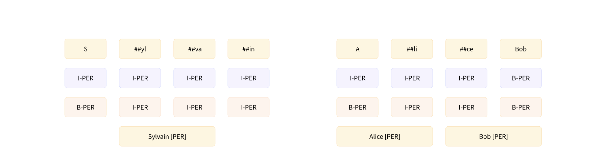
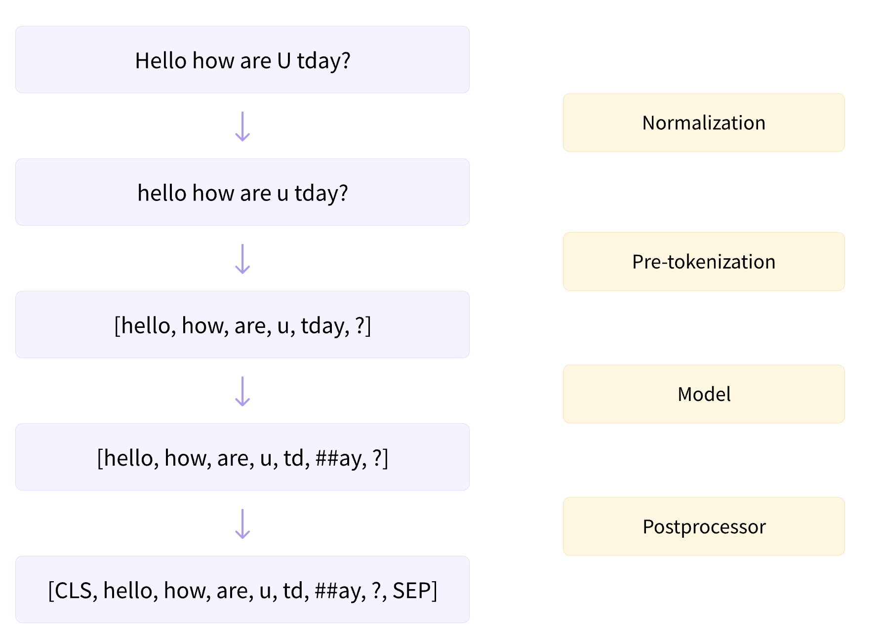

# HuggingFace Tokenizersライブラリの完全ガイド

## 概要

この記事では、自然言語処理において重要な役割を果たすトークナイザーについて、特にHugging Face Tokenizersライブラリを中心に詳しく解説します。新しいトークナイザーを一から訓練する方法、高速トークナイザーの特別な機能、そして主要なサブワード・トークン化アルゴリズムの違いについて学習します。

実際のコード例を通じて、BPE（Byte-Pair Encoding）、WordPiece、Unigramの3つの主要アルゴリズムの仕組みを理解し、独自のトークナイザーを構築する方法を習得できます。

!!! info "参考資料"
    本ドキュメントは [Hugging Face LLM Course](https://huggingface.co/learn/llm-course/chapter6/1) を参考に、日本語で学習内容をまとめた個人的な学習ノートです。詳細な内容や最新情報については、原文も併せてご参照ください。

## 前提知識

この記事を理解するために、以下の知識があることを推奨します：

- Pythonプログラミングの基礎知識
- Transformersモデルの基本的な理解
- 機械学習とディープラーニングの概念
- pandas、numpy等のデータ処理ライブラリの使用経験

## はじめに

第3章では、特定のタスクでモデルをファインチューニングする方法を学びました。その際、モデルが事前学習で使用したのと同じトークナイザーを使用しました。しかし、モデルを一から訓練したい場合はどうでしょうか？このような場合、別のドメインや言語のコーパスで事前学習されたトークナイザーを使用するのは通常最適ではありません。例えば、英語のコーパスで訓練されたトークナイザーは、日本語のテキストのコーパスでは適切に動作しません。これは、両言語でのスペースや句読点の使用方法が大きく異なるためです。

この章では、テキストのコーパスで全く新しいトークナイザーを訓練し、それを言語モデルの事前学習に使用する方法を学習します。これはすべて[Hugging Face Tokenizers](https://github.com/huggingface/tokenizers)ライブラリの支援を受けて行われます。このライブラリは[Hugging Face Transformers](https://github.com/huggingface/transformers)ライブラリの「高速」トークナイザーを提供しています。このライブラリが提供する機能について詳しく見て、高速トークナイザーが「低速」バージョンとどのように異なるかを探ります。

扱うトピックは以下の通りです：

- 新しいテキストコーパスで、特定のチェックポイントで使用されているものと類似した新しいトークナイザーを訓練する方法
- 高速トークナイザーの特別な機能
- 現在NLPで使用されている3つの主要なサブワード・トークン化アルゴリズムの違い
- Hugging Face Tokenizersライブラリを使用して、一からトークナイザーを構築し、データで訓練する方法

## 既存のトークナイザーから新しいトークナイザーを訓練する

対象言語の言語モデルが利用できない場合や、自分のコーパスがモデルの訓練データと大きく異なる場合、データに適応したトークナイザーを使用してモデルを一から再訓練することが望ましいでしょう。これには、データセット上で新しいトークナイザーを訓練する必要があります。しかし、これは具体的に何を意味するのでしょうか？

第2章で最初にトークナイザーを見た時、ほとんどのTransformerモデルが**サブワード・トークン化アルゴリズム**を使用することを確認しました。どのサブワードが関心があり、手元のコーパスで最も頻繁に出現するかを特定するために、トークナイザーは、コーパス内のすべてのテキストを詳細に調べる必要があります。このプロセスを**訓練**と呼びます。この訓練を支配する正確なルールは、使用されるトークナイザーの種類によって異なり、この章の後半で3つの主要アルゴリズムについて説明します。

!!! tip "重要な違い"
    トークナイザーの訓練はモデルの訓練とは異なります！モデルの訓練では確率的勾配降下法を使用して、各バッチで損失を少しずつ小さくします。これは本質的にランダムです（同じ訓練を2回行った場合に同じ結果を得るには、シードを設定する必要があります）。トークナイザーの訓練は統計的プロセスで、特定のコーパスに対してどのサブワードが最適かを特定しようとし、選択に使用される正確なルールはトークン化アルゴリズムによって異なります。これは決定論的で、同じアルゴリズムで同じコーパスで訓練すると常に同じ結果が得られます。

### コーパスの構築

Hugging Face Transformersには、既存のトークナイザーと同じ特性を持つ新しいトークナイザーを訓練するために使用できる非常にシンプルなAPIがあります：`AutoTokenizer.train_new_from_iterator()`。実際の動作を確認するために、GPT-2を英語以外の言語で一から訓練したいとします。最初のタスクは、その言語で訓練コーパス内に大量のデータを収集することです。わかりやすい例として、ここではロシア語や中国語のような言語は使用せず、特殊な英語言語であるPythonコードを使用します。

[Hugging Face Datasets](https://github.com/huggingface/datasets)ライブラリは、Pythonソースコードのコーパスを構築するのに役立ちます。通常の`load_dataset()`関数を使用して、[CodeSearchNet](https://huggingface.co/datasets/code_search_net)データセットをダウンロードしてキャッシュします。このデータセットは[CodeSearchNet challenge](https://wandb.ai/github/CodeSearchNet/benchmark)用に作成され、複数のプログラミング言語でGitHub上のオープンソースライブラリから数百万の関数を含んでいます。ここでは、このデータセットのPython部分を読み込みます：

```python
from datasets import load_dataset

# 読み込みに数分かかる可能性があるので、コーヒーやお茶を用意してお待ちください！
raw_datasets = load_dataset("claudios/code_search_net", "python")
```

**実行結果:**
```
Generating train split: 100%|██████████| 412178/412178 [00:00<00:00, 954840.50 examples/s]
Generating test split: 100%|██████████| 22176/22176 [00:00<00:00, 1246554.16 examples/s]
Generating validation split: 100%|██████████| 23107/23107 [00:00<00:00, 1231765.62 examples/s]
```

訓練分割を見て、アクセス可能な列を確認できます：

```python
raw_datasets["train"]
```

**実行結果:**
```
Dataset({
    features: ['repository_name', 'func_path_in_repository', 'func_name', 'whole_func_string', 'language', 'func_code_string', 'func_documentation_string', 'func_code_url'],
    num_rows: 412178
})
```

データセットがdocstringsとコードを分離し、両方のトークン化を提案していることがわかります。ここでは、トークナイザーを訓練するために`whole_func_string`列のみを使用します。`train`分割にインデックスを付けることで、これらの関数の例を確認できます：

```python
print(raw_datasets["train"][111111]["whole_func_string"])
```

**実行結果:**
```
def progress_task(name=None, t=INFO, max_value=100, *args, **kwargs):
    """
    This decorator extends the basic @task decorator by allowing users to
    display some form of progress on the console. The module can receive
    an increment in the progress through "tick_progress".
    """
    return task(name=name, t=t, init_progress=True, max_value=max_value,
                *args, **kwargs)
```

最初に行う必要があることは、データセットを**テキストリストのイテレータ**に変換することです。例えば、リストのリストです。リストのテキストを使用することで、トークナイザーは（個別のテキストを一つずつ処理する代わりに）テキストのバッチで訓練することで高速化できます。また、すべてをメモリに一度に保存したくない場合は、イテレータである必要があります。コーパスが巨大な場合、Hugging Face DatasetsがすべてをRAMに読み込まず、データセットの要素をディスク上に格納するという事実を活用したいでしょう。

以下のようにすると、それぞれ1,000テキストのリストのリストが作成されますが、すべてがメモリに読み込まれます：

```python
# データセットが小さくない限り、次の行をコメントアウトしないでください！
# training_corpus = [raw_datasets["train"][i: i + 1000]["whole_func_string"] for i in range(0, len(raw_datasets["train"]), 1000)]
```

Pythonジェネレータを使用すると、実際に必要になるまでPythonが何もメモリに読み込まないようにできます。このようなジェネレータを作成するには、ブラケットを括弧に置き換えるだけです：

```python
training_corpus = (
    raw_datasets["train"][i : i + 1000]["whole_func_string"]
    for i in range(0, len(raw_datasets["train"]), 1000)
)
```

このコード行はデータセットの要素を取得しません。Python `for`ループで使用できるオブジェクトを作成するだけです。テキストは必要な時（つまり、それらを必要とする`for`ループのステップにいる時）にのみ読み込まれ、一度に1,000テキストのみがメモリに読み込まれます。このように、巨大なデータセットを処理していても、すべてのメモリを使い果たすことはありません。

ジェネレータオブジェクトの問題は、一度しか使用できないことです。以下のように最初の10桁のリストを2回取得する代わりに：

```python
gen = (i for i in range(10))
print(list(gen))
print(list(gen))
```

**実行結果:**
```
[0, 1, 2, 3, 4, 5, 6, 7, 8, 9]
[]
```

一回取得し、その後空のリストが返されます。そのため、代わりにジェネレータを返す関数を定義します：

```python
def get_training_corpus():
    return (
        raw_datasets["train"][i : i + 1000]["whole_func_string"]
        for i in range(0, len(raw_datasets["train"]), 1000)
    )

training_corpus = get_training_corpus()
```

`yield`文を使用して`for`ループ内でジェネレータを定義することもできます：

```python
def get_training_corpus():
    dataset = raw_datasets["train"]
    for start_idx in range(0, len(dataset), 1000):
        samples = dataset[start_idx : start_idx + 1000]
        yield samples["whole_func_string"]
```

これにより、前のものとまったく同じジェネレータが生成されますが、リスト内包表記では不可能な、より複雑なロジックを使用できます。

### 新しいトークナイザーの訓練

テキストのバッチのイテレータの形でコーパスを準備できたので、新しいトークナイザーを訓練する準備が整いました。これを行うには、まずモデルと組み合わせたいトークナイザー（ここではGPT-2）を読み込む必要があります：

```python
from transformers import AutoTokenizer

old_tokenizer = AutoTokenizer.from_pretrained("gpt2")
```

新しいトークナイザーを訓練するつもりでも、これを行うのは良いアイデアです。完全に一から始める必要がないからです。このように、トークン化アルゴリズムや使用したい特別なトークンについて何も指定する必要がありません。新しいトークナイザーはGPT-2とまったく同じになり、変化するのは語彙のみで、これはコーパスでの訓練によって決定されます。

まず、このトークナイザーが例の関数をどのように処理するかを見てみましょう：

```python
from pprint import pprint
example = '''def add_numbers(a, b):
    """Add the two numbers `a` and `b`."""
    return a + b'''

tokens = old_tokenizer.tokenize(example)
pprint(tokens, compact=True)
```

**実行結果:**
```
['def', 'Ä add', '_', 'n', 'umbers', '(', 'a', ',', 'Ä b', '):', 'ÄŠ', 'Ä ', 'Ä ',
 'Ä ', 'Ä """', 'Add', 'Ä the', 'Ä two', 'Ä numbers', 'Ä `', 'a', '`', 'Ä and', 'Ä `',
 'b', '`', '."', '""', 'ÄŠ', 'Ä ', 'Ä ', 'Ä ', 'Ä return', 'Ä a', 'Ä +', 'Ä b']
```

このトークナイザーには、スペースと改行をそれぞれ表す`Ä `や`ÄŠ`のような特別なシンボルがあります。見てのとおり、これはあまり効率的ではありません：トークナイザーは各スペースに対して個別のトークンを返しますが、インデントレベルをグループ化できます（4つまたは8つのスペースのセットがコードでは非常に一般的であるため）。また、`_`文字を見慣れていないため、関数名を少し奇妙に分割しています。

新しいトークナイザーを訓練して、これらの問題が解決するかどうか見てみましょう。これには、`train_new_from_iterator()`メソッドを使用します：

```python
tokenizer = old_tokenizer.train_new_from_iterator(training_corpus, 52000)
```

コーパスが非常に大きい場合、このコマンドには少し時間がかかる可能性がありますが、1.6 GBのテキストのこのデータセットでは非常に高速です（12コアのAMD Ryzen 9 3900X CPUで1分16秒）。

`AutoTokenizer.train_new_from_iterator()`は、使用しているトークナイザーが「高速」トークナイザーの場合にのみ動作することに注意してください。次のセクションで見るように、Hugging Face Transformersライブラリには2つのタイプのトークナイザーが含まれています：純粋にPythonで書かれたものと、[Rust](https://www.rust-lang.org)プログラミング言語で書かれたHugging Face Tokenizersライブラリによってサポートされている高速なものです。Pythonはデータサイエンスとディープラーニングアプリケーションで最もよく使用される言語ですが、何かを高速化するために並列化する必要がある場合、別の言語で書く必要があります。例えば、モデル計算の中心にある行列乗算は、GPU用に最適化されたCライブラリであるCUDAで書かれています。

純粋なPythonで全く新しいトークナイザーを訓練することは非常に遅いので、Hugging Face Tokenizersライブラリを開発しました。GPUでの入力のバッチでモデルを実行するためにCUDA言語を学ぶ必要がなかったように、高速トークナイザーを使用するためにRustを学ぶ必要はありません。Hugging Face Tokenizersライブラリは、内部的にRustのコード片を呼び出す多くのメソッドにPythonバインディングを提供します。例えば、新しいトークナイザーの訓練を並列化したり、第3章で見たように、入力のバッチのトークン化を行います。

ほとんどのTransformerモデルには高速トークナイザーが利用可能です（[ここ](https://huggingface.co/transformers/#supported-frameworks)で確認できる例外もあります）。`AutoTokenizer` APIは、利用可能であれば常に高速トークナイザーを選択します。次のセクションでは、高速トークナイザーが持つ他の特別な機能について詳しく見ていきます。これらは、トークン分類や質問応答のようなタスクで本当に役立ちます。しかし、それに飛び込む前に、前の例で私たちの全く新しいトークナイザーを試してみましょう：

```python
tokens = tokenizer.tokenize(example)
pprint(tokens, compact=True)
```

**実行結果:**
```
['def', 'Ä add', '_', 'numbers', '(', 'a', ',', 'Ä b', '):', 'ÄŠÄ Ä Ä ', 'Ä """',
 'Add', 'Ä the', 'Ä two', 'Ä numbers', 'Ä `', 'a', '`', 'Ä and', 'Ä `', 'b', '`."""',
 'ÄŠÄ Ä Ä ', 'Ä return', 'Ä a', 'Ä +', 'Ä b']
```

ここでも、スペースと改行を表す特別なシンボル`Ä `と`ÄŠ`が見られますが、トークナイザーがPython関数のコーパスに非常に特化したトークンを学習したことも確認できます。例えば、インデントを表す`ÄŠÄ Ä Ä `トークンや、docstringを開始する3つの引用符を表す`Ä """`トークンがあります。また、トークナイザーは`_`で関数名を正しく分割しました。これは非常にコンパクトな表現です。比較として、同じ例で通常の英語トークナイザーを使用すると、より長い文章が得られます：

```python
print(len(tokens))
print(len(old_tokenizer.tokenize(example)))
```

**実行結果:**
```
27
36
```

別の例を見てみましょう：

```python
example = """class LinearLayer():
    def __init__(self, input_size, output_size):
        self.weight = torch.randn(input_size, output_size)
        self.bias = torch.zeros(output_size)

    def __call__(self, x):
        return x @ self.weights + self.bias
    """
pprint(tokenizer.tokenize(example), compact=True)
```

**実行結果:**
```
['class', 'Ä Linear', 'Layer', '():', 'ÄŠÄ Ä Ä ', 'Ä def', 'Ä __', 'init', '__(',
 'self', ',', 'Ä input', '_', 'size', ',', 'Ä output', '_', 'size', '):',
 'ÄŠÄ Ä Ä Ä Ä Ä Ä ', 'Ä self', '.', 'weight', 'Ä =', 'Ä torch', '.', 'randn', '(', 'input',
 '_', 'size', ',', 'Ä output', '_', 'size', ')', 'ÄŠÄ Ä Ä Ä Ä Ä Ä ', 'Ä self', '.',
 'bias', 'Ä =', 'Ä torch', '.', 'zeros', '(', 'output', '_', 'size', ')', 'ÄŠÄŠÄ Ä Ä ',
 'Ä def', 'Ä __', 'call', '__(', 'self', ',', 'Ä x', '):', 'ÄŠÄ Ä Ä Ä Ä Ä Ä ', 'Ä return',
 'Ä x', 'Ä @', 'Ä self', '.', 'weights', 'Ä +', 'Ä self', '.', 'bias', 'ÄŠÄ Ä Ä Ä ']
```

インデントに対応するトークンに加えて、ここでは二重インデントのトークン`ÄŠÄ Ä Ä Ä Ä Ä Ä `も確認できます。`class`、`init`、`call`、`self`、`return`のようなPythonの特別な単語は、それぞれ一つのトークンとしてトークン化されています。また、`_`と`.`での分割に加えて、トークナイザーはキャメルケースの名前も正しく分割します：`LinearLayer`は`["Ä Linear", "Layer"]`としてトークン化されます。

### トークナイザーの保存

後で使用できるように、新しいトークナイザーを保存する必要があります。モデルと同様に、これは`save_pretrained()`メソッドで行われます：

```python
tokenizer.save_pretrained("coder-search-net-tokenizer")
```

**実行結果:**
```
('coder-search-net-tokenizer/tokenizer_config.json',
 'coder-search-net-tokenizer/special_tokens_map.json',
 'coder-search-net-tokenizer/vocab.json',
 'coder-search-net-tokenizer/merges.txt',
 'coder-search-net-tokenizer/added_tokens.json',
 'coder-search-net-tokenizer/tokenizer.json')
```

これにより、*code-search-net-tokenizer*という名前の新しいフォルダが作成され、トークナイザーの再読み込みに必要なすべてのファイルが含まれます。

その後、`from_pretrained()`メソッドでトークナイザーをどこからでも読み込むことができます：

```python
tokenizer = AutoTokenizer.from_pretrained("coder-search-net-tokenizer")
```

## 高速トークナイザーの特別な機能

このセクションでは、Hugging Face Transformersのトークナイザーの機能をより詳しく見ていきます。これまでは、入力をトークン化したり、IDをテキストにデコードしたりするためにのみ使用していましたが、トークナイザー（特にHugging Face Tokenizersライブラリによってサポートされているもの）はもっと多くのことができます。これらの追加機能を説明するために、第1章で最初に遭遇した`token-classification`（`ner`と呼んでいました）と`question-answering`パイプラインの結果を再現する方法を探求します。

以下の議論では、「低速」トークナイザーと「高速」トークナイザーを頻繁に区別します。低速トークナイザーはHugging Face TransformersライブラリのPythonで書かれたものです。一方、高速版はHugging Face Tokenizersによって提供され、Rustで書かれています。

|               | 高速トークナイザー | 低速トークナイザー
:--------------:|:--------------:|:-------------:
`batched=True`  | 10.8s          | 4min41s
`batched=False` | 59.2s          | 5min3s

### バッチエンコーディング

トークナイザーの出力は単純なPython辞書ではありません。実際に取得するのは特別な`BatchEncoding`オブジェクトです。これは辞書のサブクラスです（そのため、以前はその結果にインデックスを付けることができました）が、主に高速トークナイザーで使用される追加のメソッドがあります。

並列化機能に加えて、高速トークナイザーの主要な機能は、最終的なトークンが元のテキストの範囲を常に追跡することです。これは**オフセットマッピング**と呼ばれる機能です。これにより、各単語がどのトークンを生成したかをマッピングしたり、元のテキストの各文字がどのトークンの内部にあるかをマッピングしたり、その逆を行う機能が解放されます。

例を見てみましょう：

```python
from transformers import AutoTokenizer

tokenizer = AutoTokenizer.from_pretrained("bert-base-cased")
example = "My name is Sylvain and I work at Hugging Face in Brooklyn."
encoding = tokenizer(example)
print(type(encoding))
```

**実行結果:**
```
<class 'transformers.tokenization_utils_base.BatchEncoding'>
```

前述のとおり、トークナイザーの出力で`BatchEncoding`オブジェクトを取得します。

`AutoTokenizer`クラスはデフォルトで高速トークナイザーを選択するので、この`BatchEncoding`オブジェクトが提供する追加のメソッドを使用できます。トークナイザーが高速か低速かをチェックする方法は2つあります。`tokenizer`の`is_fast`属性をチェックできます：

```python
tokenizer.is_fast
```

**実行結果:**
```
True
```

または`encoding`の同じ属性をチェックできます：

```python
encoding.is_fast
```

**実行結果:**
```
True
```

高速トークナイザーができることを見てみましょう。まず、IDをトークンに変換せずにトークンにアクセスできます：

```python
pprint(encoding.tokens(), compact=True)
```

**実行結果:**
```
['[CLS]', 'My', 'name', 'is', 'S', '##yl', '##va', '##in', 'and', 'I', 'work',
 'at', 'Hu', '##gging', 'Face', 'in', 'Brooklyn', '.', '[SEP]']
```

この場合、インデックス5のトークンは`##yl`で、元の文の単語「Sylvain」の一部です。`word_ids()`メソッドを使用して、各トークンが由来する単語のインデックスを取得することもできます：

```python
encoding.word_ids()
```

**実行結果:**
```
[None, 0, 1, 2, 3, 3, 3, 3, 4, 5, 6, 7, 8, 8, 9, 10, 11, 12, None]
```

トークナイザーの特別なトークン`[CLS]`と`[SEP]`が`None`にマッピングされ、その後、各トークンが元の単語にマッピングされることがわかります。これは、トークンが単語の開始にあるかどうか、または2つのトークンが同じ単語内にあるかどうかを決定するのに特に有用です。`##`プレフィックスに依存することもできますが、これはBERTのようなトークナイザーでのみ動作します。この方法は、高速である限り、あらゆるタイプのトークナイザーで動作します。次の章では、この機能を使用して、固有表現認識（NER）や品詞タギング（POS）のようなタスクで、各単語に持っているラベルをトークンに適切に適用する方法を説明します。また、マスクド言語モデリング（**全単語マスキング**と呼ばれる技術）で、同じ単語から来るすべてのトークンをマスクするためにも使用できます。

!!! tip
    単語とは何かという概念は複雑です。例えば、「I'll」（「I will」の短縮形）は1つの単語でしょうか、それとも2つの単語でしょうか？実際には、トークナイザーと適用する前処理操作によって異なります。一部のトークナイザーはスペースでのみ分割するため、これを1つの単語とみなします。その他のトークナイザーはスペースに加えて句読点も使用するため、2つの単語とみなします。

!!! question "試してみましょう！"
    `bert-base-cased`と`roberta-base`チェックポイントからトークナイザーを作成し、「81s」でトークン化してください。何が観察されますか？単語IDは何ですか？

```python
from transformers import AutoTokenizer
bert_tokenizer = AutoTokenizer.from_pretrained("bert-base-cased")
bert_encoding = bert_tokenizer("81s")
print(f"bert_encoding tokens: {bert_encoding.tokens()}")
print(f"bert_encoding word_ids: {bert_encoding.word_ids()}")

roberta_tokenizer = AutoTokenizer.from_pretrained("roberta-base")
roberta_encoding = roberta_tokenizer("81s")
print(f"roberta_encoding tokens: {roberta_encoding.tokens()}")
print(f"roberta_encoding word_ids: {roberta_encoding.word_ids()}")
```

**実行結果:**
```
bert_encoding tokens: ['[CLS]', '81', '##s', '[SEP]']
bert_encoding word_ids: [None, 0, 0, None]
roberta_encoding tokens: ['<s>', '81', 's', '</s>']
roberta_encoding word_ids: [None, 0, 1, None]
```

同様に、トークンが由来する文にマッピングするために使用できる`sentence_ids()`メソッドもあります（ただし、この場合、トークナイザーによって返される`token_type_ids`が同じ情報を提供できます）。

最後に、`word_to_chars()`または`token_to_chars()`および`char_to_word()`または`char_to_token()`メソッドを通じて、任意の単語またはトークンを元のテキストの文字にマッピングしたり、その逆を行うことができます。例えば、`word_ids()`メソッドは`##yl`が インデックス3の単語の一部であることを教えてくれましたが、文中ではどの単語でしょうか？次のようにして確認できます：

```python
start, end = encoding.word_to_chars(3)
example[start:end]
```

**実行結果:**
```
'Sylvain'
```

前述のとおり、これは高速トークナイザーが**オフセット**のリストで各トークンが由来するテキストのスパンを追跡しているという事実によって支えられています。その使用法を説明するために、次に`token-classification`パイプラインの結果を手動で再現する方法を示します。

### `token-classification`パイプラインの内部

第1章では、NERを初めて体験しました。NERは、テキストのどの部分が人、場所、組織などのエンティティに対応するかを特定するタスクです。Hugging Face Transformersの`pipeline()`関数を使用しました。その後、第2章では、パイプラインが生のテキストから予測を取得するために必要な3つのステージ（トークン化、モデルを通じた入力の渡し、後処理）をグループ化する方法を見ました。`token-classification`パイプラインの最初の2つのステップは他のパイプラインと同じですが、後処理はもう少し複雑です。見てみましょう！

#### パイプラインでの基本結果の取得

まず、トークン分類パイプラインを取得して、手動で比較するための結果を得ましょう。デフォルトで使用されるモデルは[`dbmdz/bert-large-cased-finetuned-conll03-english`](https://huggingface.co/dbmdz/bert-large-cased-finetuned-conll03-english)で、文に対してNERを実行します：

```python
from transformers import pipeline

token_classifier = pipeline("token-classification", model="dbmdz/bert-large-cased-finetuned-conll03-english")
pprint(token_classifier("My name is Sylvain and I work at Hugging Face in Brooklyn."), width=200)
```

**実行結果:**
```
[{'end': 12, 'entity': 'I-PER', 'index': 4, 'score': np.float32(0.99938285), 'start': 11, 'word': 'S'},
 {'end': 14, 'entity': 'I-PER', 'index': 5, 'score': np.float32(0.99815494), 'start': 12, 'word': '##yl'},
 {'end': 16, 'entity': 'I-PER', 'index': 6, 'score': np.float32(0.9959072), 'start': 14, 'word': '##va'},
 {'end': 18, 'entity': 'I-PER', 'index': 7, 'score': np.float32(0.99923277), 'start': 16, 'word': '##in'},
 {'end': 35, 'entity': 'I-ORG', 'index': 12, 'score': np.float32(0.9738931), 'start': 33, 'word': 'Hu'},
 {'end': 40, 'entity': 'I-ORG', 'index': 13, 'score': np.float32(0.97611505), 'start': 35, 'word': '##gging'},
 {'end': 45, 'entity': 'I-ORG', 'index': 14, 'score': np.float32(0.9887976), 'start': 41, 'word': 'Face'},
 {'end': 57, 'entity': 'I-LOC', 'index': 16, 'score': np.float32(0.9932106), 'start': 49, 'word': 'Brooklyn'}]
```

モデルは「Sylvain」によって生成された各トークンを人として、「Hugging Face」によって生成された各トークンを組織として、「Brooklyn」トークンを場所として適切に識別しました。また、パイプラインに同じエンティティに対応するトークンをまとめるように依頼することもできます：

```python
from transformers import pipeline

token_classifier = pipeline("token-classification", aggregation_strategy="simple", model="dbmdz/bert-large-cased-finetuned-conll03-english")
pprint(token_classifier("My name is Sylvain and I work at Hugging Face in Brooklyn."), width=200)
```

**実行結果:**
```
[{'end': 18, 'entity_group': 'PER', 'score': np.float32(0.9981694), 'start': 11, 'word': 'Sylvain'},
 {'end': 45, 'entity_group': 'ORG', 'score': np.float32(0.9796019), 'start': 33, 'word': 'Hugging Face'},
 {'end': 57, 'entity_group': 'LOC', 'score': np.float32(0.9932106), 'start': 49, 'word': 'Brooklyn'}]
```

選択された`aggregation_strategy`は、グループ化された各エンティティに対して計算されるスコアを変更します。`"simple"`では、スコアは単に特定のエンティティ内の各トークンのスコアの平均です。例えば、「Sylvain」のスコアは、前の例で見たトークン`S`、`##yl`、`##va`、`##in`のスコアの平均です。利用可能なその他の戦略は次のとおりです：

- `"first"`：各エンティティのスコアはそのエンティティの最初のトークンのスコアです（そのため「Sylvain」の場合、トークン`S`のスコア0.993828になります）
- `"max"`：各エンティティのスコアはそのエンティティ内のトークンの最大スコアです（そのため「Hugging Face」の場合、「Face」のスコア0.98879766になります）
- `"average"`：各エンティティのスコアはそのエンティティを構成する単語のスコアの平均です（そのため「Sylvain」の場合、`"simple"`戦略との違いはありませんが、「Hugging Face」のスコアは「Hugging」0.975と「Face」0.98879のスコアの平均である0.9819になります）

#### 入力から予測まで

まず、入力をトークン化してモデルを通す必要があります。これは第2章でまったく同じように行われます。`AutoXxx`クラスを使用してトークナイザーとモデルをインスタンス化し、例に使用します：

```python
from transformers import AutoTokenizer, AutoModelForTokenClassification

model_checkpoint = "dbmdz/bert-large-cased-finetuned-conll03-english"
tokenizer = AutoTokenizer.from_pretrained(model_checkpoint)
model = AutoModelForTokenClassification.from_pretrained(model_checkpoint)

example = "My name is Sylvain and I work at Hugging Face in Brooklyn."
inputs = tokenizer(example, return_tensors="pt")
outputs = model(**inputs)
```

ここでは`AutoModelForTokenClassification`を使用しているので、入力シーケンスの各トークンに対して一組のロジットを取得します：

```python
print(inputs["input_ids"].shape)
print(outputs.logits.shape)
```

**実行結果:**
```
torch.Size([1, 19])
torch.Size([1, 19, 9])
```

1つのシーケンスを含む19トークンのバッチがあり、モデルには9つの異なるラベルがあるため、モデルの出力は1 x 19 x 9の形状になります。テキスト分類パイプラインと同様に、ソフトマックス関数を使用してそれらのロジットを確率に変換し、argmaxを取って予測を得ます（ソフトマックスは順序を変更しないため、ロジットでargmaxを取ることができます）：

```python
import torch

probabilities = torch.nn.functional.softmax(outputs.logits, dim=-1)[0].tolist()
predictions = outputs.logits.argmax(dim=-1)[0].tolist()
print(predictions)
```

**実行結果:**
```
[0, 0, 0, 0, 4, 4, 4, 4, 0, 0, 0, 0, 6, 6, 6, 0, 8, 0, 0]
```

`model.config.id2label`属性には、予測を理解するために使用できるインデックスからラベルへのマッピングが含まれています：

```python
model.config.id2label
```

**実行結果:**
```
{0: 'O',
 1: 'B-MISC',
 2: 'I-MISC',
 3: 'B-PER',
 4: 'I-PER',
 5: 'B-ORG',
 6: 'I-ORG',
 7: 'B-LOC',
 8: 'I-LOC'}
```

前述のとおり、9つのラベルがあります：`O`は名前付きエンティティ内にないトークンのラベル（「outside」の意味）で、各タイプのエンティティ（その他、人、組織、場所）に対して2つのラベルがあります。ラベル`B-XXX`はトークンがエンティティ`XXX`の開始にあることを示し、ラベル`I-XXX`はトークンがエンティティ`XXX`の内部にあることを示します。例えば、現在の例では、モデルがトークン`S`を`B-PER`（人エンティティの開始）に分類し、トークン`##yl`、`##va`、`##in`を`I-PER`（人エンティティの内部）に分類することが期待されます。

この場合、モデルがこれら4つのトークンすべてに`I-PER`ラベルを付けたことが間違いだと思うかもしれませんが、それは完全に正しくありません。実際には、`B-`と`I-`ラベルには**IOB1**と**IOB2**という2つの形式があります。IOB2形式（下図のピンク）は我々が紹介したもので、IOB1形式（下図の青）では、`B-`で始まるラベルは同じタイプの2つの隣接するエンティティを分離するためにのみ使用されます。使用しているモデルはその形式を使用するデータセットでファインチューニングされているため、`S`トークンに`I-PER`ラベルを割り当てます。



このマップを使用して、最初のパイプラインの結果を（ほぼ完全に）再現する準備ができました。`O`として分類されなかった各トークンのスコアとラベルを取得するだけです：

```python
results = []
tokens = inputs.tokens()

for idx, pred in enumerate(predictions):
    label = model.config.id2label[pred]
    if label != "O":
        results.append(
            {"entity": label, "score": probabilities[idx][pred], "index": idx, "word": tokens[idx]}
        )

pprint(results, width=100)
```

**実行結果:**
```
[{'entity': 'I-PER', 'index': 4, 'score': 0.9993828535079956, 'word': 'S'},
 {'entity': 'I-PER', 'index': 5, 'score': 0.9981549382209778, 'word': '##yl'},
 {'entity': 'I-PER', 'index': 6, 'score': 0.995907187461853, 'word': '##va'},
 {'entity': 'I-PER', 'index': 7, 'score': 0.9992326498031616, 'word': '##in'},
 {'entity': 'I-ORG', 'index': 12, 'score': 0.9738929867744446, 'word': 'Hu'},
 {'entity': 'I-ORG', 'index': 13, 'score': 0.9761149883270264, 'word': '##gging'},
 {'entity': 'I-ORG', 'index': 14, 'score': 0.9887974858283997, 'word': 'Face'},
 {'entity': 'I-LOC', 'index': 16, 'score': 0.99321049451828, 'word': 'Brooklyn'}]
```

これは以前持っていたものと非常に似ていますが、1つの例外があります：パイプラインは、元の文の各エンティティの`start`と`end`に関する情報も提供しました。ここでオフセットマッピングが活躍します。オフセットを取得するには、入力にトークナイザーを適用する際に`return_offsets_mapping=True`を設定するだけです：

```python
inputs_with_offsets = tokenizer(example, return_offsets_mapping=True)
print(inputs_with_offsets["offset_mapping"])
```

**実行結果:**
```
[(0, 0), (0, 2), (3, 7), (8, 10), (11, 12), (12, 14), (14, 16), (16, 18), (19, 22), (23, 24), (25, 29), (30, 32), (33, 35), (35, 40), (41, 45), (46, 48), (49, 57), (57, 58), (0, 0)]
```

各タプルは、各トークンに対応するテキストのスパンで、`(0, 0)`は特別なトークンのために予約されています。前述のとおり、インデックス5のトークンは`##yl`で、ここではオフセットとして`(12, 14)`があります。例の対応するスライスを取得すると：

```python
# `##`なしで適切なテキストスパンを取得します
example[12:14]
```

**実行結果:**
```
'yl'
```

これを使用して、前の結果を完成させることができます：

```python
results = []
inputs_with_offsets = tokenizer(example, return_offsets_mapping=True)
tokens = inputs_with_offsets.tokens()
offsets = inputs_with_offsets["offset_mapping"]

for idx, pred in enumerate(predictions):
    label = model.config.id2label[pred]
    if label != "O":
        start, end = offsets[idx]
        results.append(
            {
                "entity": label,
                "score": probabilities[idx][pred],
                "index": idx,
                "word": tokens[idx],
                "start": start,
                "end": end,
            }
        )

pprint(results, width=150)
```

**実行結果:**
```
[{'end': 12, 'entity': 'I-PER', 'index': 4, 'score': 0.9993828535079956, 'start': 11, 'word': 'S'},
 {'end': 14, 'entity': 'I-PER', 'index': 5, 'score': 0.9981549382209778, 'start': 12, 'word': '##yl'},
 {'end': 16, 'entity': 'I-PER', 'index': 6, 'score': 0.995907187461853, 'start': 14, 'word': '##va'},
 {'end': 18, 'entity': 'I-PER', 'index': 7, 'score': 0.9992326498031616, 'start': 16, 'word': '##in'},
 {'end': 35, 'entity': 'I-ORG', 'index': 12, 'score': 0.9738929867744446, 'start': 33, 'word': 'Hu'},
 {'end': 40, 'entity': 'I-ORG', 'index': 13, 'score': 0.9761149883270264, 'start': 35, 'word': '##gging'},
 {'end': 45, 'entity': 'I-ORG', 'index': 14, 'score': 0.9887974858283997, 'start': 41, 'word': 'Face'},
 {'end': 57, 'entity': 'I-LOC', 'index': 16, 'score': 0.99321049451828, 'start': 49, 'word': 'Brooklyn'}]
```

#### エンティティのグループ化

オフセットを使用して各エンティティのstartキーとendキーを決定するのは便利ですが、その情報は厳密には必要ありません。しかし、エンティティをグループ化したい場合、オフセットは多くの煩雑なコードを節約してくれます。例えば、トークン`Hu`、`##gging`、`Face`をグループ化したい場合、最初の2つは`##`を削除して添付し、`Face`は`##`で始まらないのでスペースで追加するという特別なルールを作成できます。しかし、これは特定のタイプのトークナイザーでのみ動作します。SentencePieceやByte-Pair-Encodingトークナイザー（この章で後述）には別のルールセットを書く必要があります。

オフセットがあれば、すべてのカスタムコードが不要になります：最初のトークンで始まり最後のトークンで終わる元のテキストのスパンを取るだけです。トークン`Hu`、`##gging`、`Face`の場合、文字33（`Hu`の開始）で開始し、文字45（`Face`の終了）の前で終了する必要があります：

```python
example[33:45]
```

**実行結果:**
```
'Hugging Face'
```

エンティティをグループ化しながら予測を後処理するコードを書くために、`I-XXX`でラベル付けされた連続するエンティティをグループ化します（最初のものは`B-XXX`または`I-XXX`でラベル付けできます）。つまり、`O`、新しいタイプのエンティティ、または同じタイプのエンティティが開始することを伝える`B-XXX`を取得した場合、エンティティのグループ化を停止します：

```python
import numpy as np

results = []
inputs_with_offsets = tokenizer(example, return_offsets_mapping=True)
tokens = inputs_with_offsets.tokens()
offsets = inputs_with_offsets["offset_mapping"]

idx = 0
while idx < len(predictions):
    pred = predictions[idx]
    label = model.config.id2label[pred]
    if label != "O":
        # B-またはI-を削除
        label = label[2:]
        start, _ = offsets[idx]

        # I-labelでラベル付けされたすべてのトークンを取得
        all_scores = []
        while (
            idx < len(predictions)
            and model.config.id2label[predictions[idx]] == f"I-{label}"
        ):
            all_scores.append(probabilities[idx][pred])
            _, end = offsets[idx]
            idx += 1

        # スコアはそのグループ化されたエンティティ内のすべてのトークンのスコアの平均
        score = np.mean(all_scores).item()
        word = example[start:end]
        results.append(
            {
                "entity_group": label,
                "score": score,
                "word": word,
                "start": start,
                "end": end,
            }
        )
    idx += 1

pprint(results, width=150)
```

**実行結果:**
```
[{'end': 18, 'entity_group': 'PER', 'score': 0.998169407248497, 'start': 11, 'word': 'Sylvain'},
 {'end': 45, 'entity_group': 'ORG', 'score': 0.9796018203099569, 'start': 33, 'word': 'Hugging Face'},
 {'end': 57, 'entity_group': 'LOC', 'score': 0.99321049451828, 'start': 49, 'word': 'Brooklyn'}]
```

これらのオフセットが非常に有用なタスクの別の例は質問応答です。次のセクションで飛び込むそのパイプラインにより、入力を特定の長さに切り捨てる際にオーバーフローするトークンを処理する方法について、Hugging Face Transformersライブラリのトークナイザーの最後の機能の1つも見ることができます。

## 正規化と前処理

Transformerモデルで使用される3つの最も一般的なサブワード・トークン化アルゴリズム（Byte-Pair Encoding [BPE]、WordPiece、Unigram）についてより深く掘り下げる前に、各トークナイザーがテキストに適用する前処理について最初に見てみましょう。トークン化パイプラインのステップの概要は次のとおりです：



テキストをサブトークン（そのモデルに従って）に分割する前に、トークナイザーは2つのステップを実行します：**正規化**と**前処理**。

### 正規化

正規化ステップには、不要な空白の除去、小文字化、アクセント記号の除去などの一般的なクリーンアップが含まれます。[Unicode正規化](http://www.unicode.org/reports/tr15/)（NFCやNFKCなど）に精通している場合、これもトークナイザーが適用する可能性があるものです。

Hugging Face Transformersの`tokenizer`には`backend_tokenizer`という属性があり、Hugging Face Tokenizersライブラリからの基礎となるトークナイザーにアクセスを提供します：

```python
from transformers import AutoTokenizer

tokenizer = AutoTokenizer.from_pretrained("bert-base-uncased")
print(type(tokenizer.backend_tokenizer))
```

**実行結果:**
```
<class 'tokenizers.Tokenizer'>
```

`tokenizer`オブジェクトの`normalizer`属性には、正規化がどのように実行されるかを確認するために使用できる`normalize_str()`メソッドがあります：

```python
print(tokenizer.backend_tokenizer.normalizer.normalize_str("Héllò hôw are ü?"))
```

**実行結果:**
```
hello how are u?
```

この例では、`bert-base-uncased`チェックポイントを選択したため、適用された正規化は小文字化とアクセント記号の除去でした。

!!! question "試してみましょう！"
    `bert-base-cased`チェックポイントからトークナイザーを読み込み、同じ例を渡してください。casedバージョンとuncasedバージョンのトークナイザーの主な違いは何でしょうか？

```python
tokenizer = AutoTokenizer.from_pretrained("bert-base-cased")
print(tokenizer.backend_tokenizer.normalizer.normalize_str("Héllò hôw are ü?"))
```

**実行結果:**
```
Héllò hôw are ü?
```

### 前処理

次のセクションで見るように、トークナイザーは生のテキストだけでは訓練できません。代わりに、最初にテキストを単語のような小さなエンティティに分割する必要があります。そこで前処理ステップが登場します。第2章で見たように、単語ベースのトークナイザーは、空白と句読点で生のテキストを単語に分割するだけです。これらの単語は、トークナイザーが訓練中に学習できるサブトークンの境界になります。

高速トークナイザーがどのように前処理を実行するかを確認するために、`tokenizer`オブジェクトの`pre_tokenizer`属性の`pre_tokenize_str()`メソッドを使用できます：

```python
from transformers import AutoTokenizer

tokenizer = AutoTokenizer.from_pretrained("bert-base-uncased")
tokenizer.backend_tokenizer.pre_tokenizer.pre_tokenize_str("Hello, how are you?")
```

**実行結果:**
```
[('Hello', (0, 5)),
 (',', (5, 6)),
 ('how', (7, 10)),
 ('are', (11, 14)),
 ('you', (15, 18)),
 ('?', (18, 19))]
```

トークナイザーが既にオフセットを追跡していることに注目してください。これが前のセクションで使用したオフセットマッピングを提供できる理由です。ここで、トークナイザーは2つのスペースを無視して1つだけで置き換えますが、オフセットは`are`と`you`の間でそれを考慮してジャンプします。

BERTトークナイザーを使用しているため、前処理には空白と句読点での分割が含まれます。他のトークナイザーはこのステップで異なるルールを持つ可能性があります。例えば、GPT-2トークナイザーを使用する場合：

```python
tokenizer = AutoTokenizer.from_pretrained("gpt2")
tokenizer.backend_tokenizer.pre_tokenizer.pre_tokenize_str("Hello, how are  you?")
```

**実行結果:**
```
[('Hello', (0, 5)),
 (',', (5, 6)),
 ('Ġ how', (6, 10)),
 ('Ġ are', (10, 14)),
 ('Ġ ', (14, 15)),
 ('Ġ you', (15, 19)),
 ('?', (19, 20))]
```

これも空白と句読点で分割しますが、スペースを保持して`Ġ`記号に置き換えるため、トークンをデコードする際に元のスペースを復元できます。

また、BERTトークナイザーとは異なり、このトークナイザーは二重スペースを無視しないことにも注目してください。

最後の例として、SentencePieceアルゴリズムに基づくT5トークナイザーを見てみましょう：

```python
tokenizer = AutoTokenizer.from_pretrained("t5-small")
tokenizer.backend_tokenizer.pre_tokenizer.pre_tokenize_str("Hello, how are  you?")
```

**実行結果:**
```
[('▁Hello,', (0, 6)),
 ('▁how', (7, 10)),
 ('▁are', (11, 14)),
 ('▁you?', (16, 20))]
```

GPT-2トークナイザーと同様に、これはスペースを保持し、特定のトークン（`_`）に置き換えますが、T5トークナイザーは句読点ではなく空白でのみ分割します。また、デフォルトで文の最初（`Hello`の前）にスペースを追加し、`are`と`you`の間の二重スペースを無視したことにも注目してください。

いくつかの異なるトークナイザーがテキストを処理する方法を少し見たので、基礎となるアルゴリズム自体の探索を開始できます。広く適用可能なSentencePieceを簡単に見てから、次の3つのセクションで、サブワード・トークン化に使用される3つの主要アルゴリズムの動作を検証します。

### SentencePiece

[SentencePiece](https://github.com/google/sentencepiece)は、次の3つのセクションで見るモデルのいずれかと組み合わせて使用できるテキストの前処理用のトークン化アルゴリズムです。テキストをUnicode文字のシーケンスとして考慮し、スペースを特別な文字`▁`に置き換えます。Unigramアルゴリズムと組み合わせて使用すると、前処理ステップも必要ありません。これはスペース文字が使用されていない言語（中国語や日本語など）に非常に役立ちます。

SentencePieceのもう1つの主要な機能は**可逆的トークン化**です：スペースの特別な処理がないため、トークンのデコードは単純にそれらを連結し、`_`をスペースに置き換えることで行われます。これにより、正規化されたテキストが得られます。前述のとおり、BERTトークナイザーは重複するスペースを除去するため、そのトークン化は可逆的ではありません。

### アルゴリズムの概要

以下のセクションでは、3つの主要なサブワード・トークン化アルゴリズムについて詳しく説明します：BPE（GPT-2などで使用）、WordPiece（例えばBERTで使用）、Unigram（T5などで使用）。始める前に、それぞれがどのように動作するかの簡単な概要を示します。次の各セクションを読んだ後、この表が理解できない場合は、遠慮なく戻って確認してください。

| モデル | BPE | WordPiece | Unigram |
|:----:|:---:|:---------:|:------:|
| 訓練 | 小さな語彙から開始してトークンをマージするルールを学習 | 小さな語彙から開始してトークンをマージするルールを学習 | 大きな語彙から開始してトークンを削除するルールを学習 |
| 訓練ステップ | 最も一般的なペアに対応するトークンをマージ | ペアの頻度に基づく最高スコアを持つペアに対応するトークンをマージし、各個別トークンがより頻度が低いペアを優先 | 全コーパスで計算された損失を最小化するすべてのトークンを語彙から除去 |
| 学習内容 | マージルールと語彙 | 語彙のみ | 各トークンのスコア付き語彙 |
| エンコーディング | 単語を文字に分割し、訓練中に学習されたマージを適用 | 語彙内の最初から始まる最長のサブワードを見つけ、単語の残りの部分に対して同じことを行う | 訓練中に学習されたスコアを使用して、最も可能性の高いトークン分割を見つける |

## Byte-Pair Encodingトークン化

Byte-Pair Encoding（BPE）は元々テキストを圧縮するアルゴリズムとして開発され、その後OpenAIがGPTモデルを事前学習する際にトークン化に使用しました。GPT、GPT-2、RoBERTa、BART、DeBERTaなど、多くのTransformerモデルで使用されています。

!!! tip 
    このセクションではBPEを詳細に説明し、完全な実装を示すところまで行います。一般的なトークン化アルゴリズムの概要だけが欲しい場合は、最後まで飛ばしても構いません。

### 訓練アルゴリズム

BPE訓練は、（正規化と前処理ステップが完了した後）コーパスで使用される単語の一意のセットを計算し、これらの単語を書くために使用されるすべてのシンボルを取ることで語彙を構築することから始まります。非常に簡単な例として、コーパスで以下の5つの単語が使用されているとします：

```
"hug", "pug", "pun", "bun", "hugs"
```

基本語彙は`["b", "g", "h", "n", "p", "s", "u"]`になります。実世界の場合、その基本語彙には少なくともすべてのASCII文字が含まれ、おそらく一部のUnicode文字も含まれるでしょう。トークン化している例が訓練コーパスにない文字を使用している場合、その文字は未知トークンに変換されます。これが、多くのNLPモデルが絵文字を含むコンテンツの分析で非常に悪い性能を示す理由の1つです。

!!! tip "GPT-2とRoBERTaの工夫"
    GPT-2とRoBERTaトークナイザー（かなり似ている）には、これに対処する巧妙な方法があります：Unicode文字で書かれているとして単語を見るのではなく、バイトで見ます。このように、基本語彙のサイズは小さく（256）、考えられるすべての文字が含まれ、未知トークンに変換されることはありません。この技巧は**バイトレベルBPE**と呼ばれます。

この基本語彙を取得した後、既存の語彙の2つの要素を一緒にマージして新しいものにする**マージ**（ルール）を学習することで、望ましい語彙サイズに達するまで新しいトークンを追加します。そのため、最初はこれらのマージは2文字のトークンを作成し、その後、訓練が進むにつれて、より長いサブワードを作成します。

トークナイザー訓練中の任意のステップで、BPEアルゴリズムは既存トークンの最も頻繁なペア（ここでの「ペア」は単語内の2つの連続するトークンを意味します）を検索します。その最も頻繁なペアがマージされ、次のステップのためにすすぎと繰り返しを行います。

前の例に戻って、単語が以下の頻度を持っていたとします：

```
("hug", 10), ("pug", 5), ("pun", 12), ("bun", 4), ("hugs", 5)
```

つまり、`"hug"`がコーパス内に10回、`"pug"`が5回、`"pun"`が12回、`"bun"`が4回、`"hugs"`が5回存在したということです。訓練を開始するため、各単語を文字に分割し（初期語彙を形成するもの）、各単語をトークンのリストとして見ることができます：

```
("h" "u" "g", 10), ("p" "u" "g", 5), ("p" "u" "n", 12), ("b" "u" "n", 4), ("h" "u" "g" "s", 5)
```

次に、ペアを見ます。ペア`("h", "u")`は単語`"hug"`と`"hugs"`に存在するので、コーパス内で合計15回存在します。しかし、最も頻繁なペアではありません：その栄誉は`("u", "g")`に属し、`"hug"`、`"pug"`、`"hugs"`に存在し、語彙内で合計20回存在します。

したがって、トークナイザーが学習する最初のマージルールは`("u", "g") -> "ug"`で、`"ug"`が語彙に追加され、ペアはコーパスのすべての単語でマージされる必要があります。このステージの終わりに、語彙とコーパスは次のようになります：

```
Vocabulary: ["b", "g", "h", "n", "p", "s", "u", "ug"]
Corpus: ("h" "ug", 10), ("p" "ug", 5), ("p" "u" "n", 12), ("b" "u" "n", 4), ("h" "ug" "s", 5)
```

これで、2文字よりも長いトークンを生成するペアがいくつかあります：例えば、ペア`("h", "ug")`（コーパス内で15回存在）。しかし、このステージで最も頻繁なペアは`("u", "n")`で、コーパス内で16回存在するため、学習される2番目のマージルールは`("u", "n") -> "un"`です。これを語彙に追加し、すべての既存の出現をマージすると：

```
Vocabulary: ["b", "g", "h", "n", "p", "s", "u", "ug", "un"]
Corpus: ("h" "ug", 10), ("p" "ug", 5), ("p" "un", 12), ("b" "un", 4), ("h" "ug" "s", 5)
```

今、最も頻繁なペアは`("h", "ug")`なので、マージルール`("h", "ug") -> "hug"`を学習し、最初の3文字トークンを取得します。マージ後、コーパスは次のようになります：

```
Vocabulary: ["b", "g", "h", "n", "p", "s", "u", "ug", "un", "hug"]
Corpus: ("hug", 10), ("p" "ug", 5), ("p" "un", 12), ("b" "un", 4), ("hug" "s", 5)
```

そして、望ましい語彙サイズに達するまでこのように続けます。

!!! question "今度はあなたの番！"
    次のマージルールは何だと思いますか？
    
    答え：
    ```
    Vocabulary: ["b", "g", "h", "n", "p", "s", "u", "ug", "un", "hug", "pun"]
    Corpus: ("hug", 10), ("p" "ug", 5), ("pun", 12), ("b" "un", 4), ("hug" "s", 5)
    ```

### トークン化アルゴリズム

トークン化は訓練プロセスに密接に従います。新しい入力は以下のステップを適用してトークン化されます：

1. 正規化
2. 前処理
3. 単語を個別の文字に分割
4. 学習されたマージルールを順番に分割に適用

訓練中に使用した例を使用し、学習した3つのマージルールを使用しましょう：

```
("u", "g") -> "ug"
("u", "n") -> "un"
("h", "ug") -> "hug"
```

単語`"bug"`は`["b", "ug"]`としてトークン化されます。しかし、`"mug"`は`["[UNK]", "ug"]`としてトークン化されます。文字`"m"`が基本語彙になかったからです。同様に、単語`"thug"`は`["[UNK]", "hug"]`としてトークン化されます：文字`"t"`が基本語彙になく、マージルールを適用すると最初に`"u"`と`"g"`がマージされ、次に`"h"`と`"ug"`がマージされます。

!!! question "今度はあなたの番！"
    単語`"unhug"`はどのようにトークン化されると思いますか？

    答え：`["un", "hug"]`

### BPEの実装

BPEアルゴリズムの実装を見てみましょう。これは大きなコーパスで実際に使用できる最適化されたバージョンではありません。アルゴリズムをもう少しよく理解できるようにコードを示すだけです。

最初にコーパスが必要なので、いくつかの文で簡単なものを作成しましょう：

```python
corpus = [
    "This is the Hugging Face Course.",
    "This chapter is about tokenization.",
    "This section shows several tokenizer algorithms.",
    "Hopefully, you will be able to understand how they are trained and generate tokens.",
]
```

次に、そのコーパスを単語に前処理する必要があります。BPEトークナイザー（GPT-2など）を複製しているので、前処理に`gpt2`トークナイザーを使用します：

```python
from transformers import AutoTokenizer

tokenizer = AutoTokenizer.from_pretrained("gpt2")
```

次に、前処理を行う際にコーパス内の各単語の頻度を計算します：

```python
from collections import defaultdict

word_freqs = defaultdict(int)

for text in corpus:
    words_with_offsets = tokenizer.backend_tokenizer.pre_tokenizer.pre_tokenize_str(text)
    new_words = [word for word, offset in words_with_offsets]
    for word in new_words:
        word_freqs[word] += 1

print(word_freqs)
```

**実行結果:**
```
defaultdict(<class 'int'>, {'This': 3, 'Ġ is': 2, 'Ġ the': 1, 'Ġ Hugging': 1, 'Ġ Face': 1, 'Ġ Course': 1, '.': 4, 'Ġ chapter': 1, 'Ġ about': 1, 'Ġ tokenization': 1, 'Ġ section': 1, 'Ġ shows': 1, 'Ġ several': 1, 'Ġ tokenizer': 1, 'Ġ algorithms': 1, 'Hopefully': 1, ',': 1, 'Ġ you': 1, 'Ġ will': 1, 'Ġ be': 1, 'Ġ able': 1, 'Ġ to': 1, 'Ġ understand': 1, 'Ġ how': 1, 'Ġ they': 1, 'Ġ are': 1, 'Ġ trained': 1, 'Ġ and': 1, 'Ġ generate': 1, 'Ġ tokens': 1})
```

次のステップは、コーパスで使用されるすべての文字で形成される基本語彙を計算することです：

```python
alphabet = []

for word in word_freqs.keys():
    for letter in word:
        if letter not in alphabet:
            alphabet.append(letter)
alphabet.sort()

print(alphabet)
```

**実行結果:**
```
[',', '.', 'C', 'F', 'H', 'T', 'a', 'b', 'c', 'd', 'e', 'f', 'g', 'h', 'i', 'k', 'l', 'm', 'n', 'o', 'p', 'r', 's', 't', 'u', 'v', 'w', 'y', 'z', 'Ġ ']
```

また、その語彙の最初にモデルで使用される特別なトークンも追加します。GPT-2の場合、唯一の特別なトークンは`"<|endoftext|>"`です：

```python
vocab = ["<|endoftext|>"] + alphabet.copy()
```

次に、訓練を開始できるように、各単語を個別の文字に分割する必要があります：

```python
splits = {word: [c for c in word] for word in word_freqs.keys()}
```

訓練の準備が整ったので、各ペアの頻度を計算する関数を書きましょう。訓練の各ステップでこれを使用する必要があります：

```python
def compute_pair_freqs(splits):
    pair_freqs = defaultdict(int)
    for word, freq in word_freqs.items():
        split = splits[word]
        if len(split) == 1:
            continue
        for i in range(len(split) - 1):
            pair = (split[i], split[i + 1])
            pair_freqs[pair] += freq
    return pair_freqs
```

初期分割後、この辞書の一部を見てみましょう：

```python
pair_freqs = compute_pair_freqs(splits)

for i, key in enumerate(pair_freqs.keys()):
    print(f"{key}: {pair_freqs[key]}")
    if i >= 5:
        break
```

**実行結果:**
```
('T', 'h'): 3
('h', 'i'): 3
('i', 's'): 5
('Ġ ', 'i'): 2
('Ġ ', 't'): 7
('t', 'h'): 3
```

今、最も頻繁なペアを見つけるには、簡単なループが必要です：

```python
best_pair = ""
max_freq = None

for pair, freq in pair_freqs.items():
    if max_freq is None or max_freq < freq:
        best_pair = pair
        max_freq = freq

print(best_pair, max_freq)
```

**実行結果:**
```
('Ġ ', 't') 7
```

最初に学習するマージは`('Ġ ', 't') -> 'Ġ t'`で、語彙に`'Ġ t'`を追加します：

```python
merges = {("Ġ ", "t"): "Ġ t"}
vocab.append("Ġ t")
```

続行するには、`splits`辞書にそのマージを適用する必要があります。別の関数を書きましょう：

```python
def merge_pair(a, b, splits):
    for word in word_freqs:
        split = splits[word]
        if len(split) == 1:
            continue

        i = 0
        while i < len(split) - 1:
            if split[i] == a and split[i + 1] == b:
                split = split[:i] + [a + b] + split[i + 2 :]
            else:
                i += 1
        splits[word] = split
    return splits
```

最初のマージの結果を見てみましょう：

```python
splits = merge_pair("Ġ ", "t", splits)
print(splits["Ġ trained"])
```

**実行結果:**
```
['Ġ t', 'r', 'a', 'i', 'n', 'e', 'd']
```

すべてを学習したいマージまでループするために必要なすべてがあります。語彙サイズを50にしましょう：

```python
vocab_size = 50

while len(vocab) < vocab_size:
    pair_freqs = compute_pair_freqs(splits)
    best_pair = ""
    max_freq = None
    for pair, freq in pair_freqs.items():
        if max_freq is None or max_freq < freq:
            best_pair = pair
            max_freq = freq
    splits = merge_pair(*best_pair, splits)
    merges[best_pair] = best_pair[0] + best_pair[1]
    vocab.append(best_pair[0] + best_pair[1])
```

結果として、19のマージルールを学習しました（初期語彙のサイズは31 - アルファベットの30文字＋特別なトークン）：

```python
print(merges)
```

**実行結果:**
```
{('Ġ ', 't'): 'Ġ t', ('i', 's'): 'is', ('e', 'r'): 'er', ('Ġ ', 'a'): 'Ġ a', ('Ġ t', 'o'): 'Ġ to', ('e', 'n'): 'en', ('T', 'h'): 'Th', ('Th', 'is'): 'This', ('o', 'u'): 'ou', ('s', 'e'): 'se', ('Ġ to', 'k'): 'Ġ tok', ('Ġ tok', 'en'): 'Ġ token', ('n', 'd'): 'nd', ('Ġ ', 'is'): 'Ġ is', ('Ġ t', 'h'): 'Ġ th', ('Ġ th', 'e'): 'Ġ the', ('i', 'n'): 'in', ('Ġ a', 'b'): 'Ġ ab', ('Ġ token', 'i'): 'Ġ tokeni'}
```

語彙は特別なトークン、初期アルファベット、すべてのマージの結果で構成されています：

```python
print(vocab)
```

**実行結果:**
```
['<|endoftext|>', ',', '.', 'C', 'F', 'H', 'T', 'a', 'b', 'c', 'd', 'e', 'f', 'g', 'h', 'i', 'k', 'l', 'm', 'n', 'o', 'p', 'r', 's', 't', 'u', 'v', 'w', 'y', 'z', 'Ġ ', 'Ġ t', 'is', 'er', 'Ġ a', 'Ġ to', 'en', 'Th', 'This', 'ou', 'se', 'Ġ tok', 'Ġ token', 'nd', 'Ġ is', 'Ġ th', 'Ġ the', 'in', 'Ġ ab', 'Ġ tokeni']
```

!!! tip "同一コーパスでも異なる結果"
    同じコーパスで`train_new_from_iterator()`を使用しても、まったく同じ語彙にはなりません。これは、最も頻繁なペアの選択がある場合に、最初に遭遇したものを選択したのに対し、Hugging Face Tokenizersライブラリは内部IDに基づいて最初のものを選択するためです。

新しいテキストをトークン化するために、前処理を行い、分割してから、学習したすべてのマージルールを適用します：

```python
def tokenize(text):
    pre_tokenize_result = tokenizer._tokenizer.pre_tokenizer.pre_tokenize_str(text)
    pre_tokenized_text = [word for word, offset in pre_tokenize_result]
    splits = [[l for l in word] for word in pre_tokenized_text]
    for pair, merge in merges.items():
        for idx, split in enumerate(splits):
            i = 0
            while i < len(split) - 1:
                if split[i] == pair[0] and split[i + 1] == pair[1]:
                    split = split[:i] + [merge] + split[i + 2 :]
                else:
                    i += 1
            splits[idx] = split

    return sum(splits, [])
```

アルファベット内の文字で構成される任意のテキストでこれを試すことができます：

```python
tokenize("This is not a token.")
```

**実行結果:**
```
['This', 'Ġ is', 'Ġ ', 'n', 'o', 't', 'Ġ a', 'Ġ token', '.']
```

!!! warning "未知文字への対処"
    未知の文字がある場合、実装はエラーをスローします。何も処理していないためです。GPT-2には実際には未知トークンがありません（バイトレベルBPEを使用する場合、未知文字を取得することは不可能です）が、可能なすべてのバイトを初期語彙に含めていないため、ここで発生する可能性があります。BPEのこの側面はこのセクションの範囲を超えているため、詳細は省略しています。

## WordPieceトークン化

WordPieceは、GoogleがBERTを事前学習するために開発したトークン化アルゴリズムです。その後、DistilBERT、MobileBERT、Funnel Transformers、MPNETなど、BERTベースの多くのTransformerモデルで再使用されています。訓練の観点ではBPEと非常に似ていますが、実際のトークン化は異なって行われます。

!!! tip
    このセクションではWordPieceを詳細に説明し、完全な実装を示すところまで行います。一般的なトークン化アルゴリズムの概要だけが欲しい場合は、最後まで飛ばしても構いません。

### 訓練アルゴリズム

!!! warning
    GoogleはWordPieceの訓練アルゴリズムの実装をオープンソース化したことがないため、以下は公開された文献に基づく最善の推測です。100％正確ではない可能性があります。

BPEと同様に、WordPieceは、モデルで使用される特別なトークンと初期アルファベットを含む小さな語彙から開始します。プレフィックス（BERTの`##`など）を追加してサブワードを識別するため、各単語は最初にその単語内のすべての文字にプレフィックスを追加することで分割されます。例えば、`"word"`は次のように分割されます：

```
w ##o ##r ##d
```

したがって、初期アルファベットには、単語の最初に存在するすべての文字と、WordPieceプレフィックスが前に付いた単語内に存在する文字が含まれます。

次に、BPEと同様に、WordPieceはマージルールを学習します。主な違いは、マージするペアの選択方法です。最も頻繁なペアを選択する代わりに、WordPieceは次の式を使用して各ペアのスコアを計算します：

$\mathrm{score} = \frac{\mathrm{freq\_of\_pair}}{\mathrm{freq\_of\_first\_element} \times \mathrm{freq\_of\_second\_element}}$

ペアの頻度をその各部分の頻度の積で割ることにより、アルゴリズムは個々の部分が語彙でより頻度が低いペアのマージを優先します。例えば、そのペアがコーパス内で非常に頻繁に出現しても、`"un"`と`"##able"`の2つのペアはそれぞれ他の多くの単語に出現し、高い頻度を持つ可能性が高いため、必ずしも`("un", "##able")`をマージするわけではありません。対照的に、`("hu", "##gging")`のようなペアは（単語「hugging」がコーパス内に頻繁に出現すると仮定して）`"hu"`と`"##gging"`は個々により頻度が低い可能性が高いため、より高速にマージされるでしょう。

BPE訓練例で使用したのと同じ語彙を見てみましょう：

```
("hug", 10), ("pug", 5), ("pun", 12), ("bun", 4), ("hugs", 5)
```

ここでの分割は：

```
("h" "##u" "##g", 10), ("p" "##u" "##g", 5), ("p" "##u" "##n", 12), ("b" "##u" "##n", 4), ("h" "##u" "##g" "##s", 5)
```

つまり、初期語彙は`["b", "h", "p", "##g", "##n", "##s", "##u"]`になります（今のところ特別なトークンを忘れるとして）。最も頻繁なペアは`("##u", "##g")`（20回存在）ですが、`"##u"`の個々の頻度が非常に高いため、そのスコアは最高ではありません（1/36）。`"##u"`を含むすべてのペアは実際に同じスコア（1/36）を持つため、最高スコアは`"##u"`なしの唯一のペア`("##g", "##s")`の1/20になり、最初に学習されるマージは`("##g", "##s") -> ("##gs")`です。

マージするとき、2つのトークン間の`##`を削除するので、語彙に`"##gs"`を追加し、コーパスの単語にマージを適用します：

```
Vocabulary: ["b", "h", "p", "##g", "##n", "##s", "##u", "##gs"]
Corpus: ("h" "##u" "##g", 10), ("p" "##u" "##g", 5), ("p" "##u" "##n", 12), ("b" "##u" "##n", 4), ("h" "##u" "##gs", 5)
```

この時点で、`"##u"`はすべての可能なペアに含まれるため、すべて同じスコアになります。この場合、最初のペアがマージされるとしましょう。そのため、`("h", "##u") -> "hu"`です。これにより：

```
Vocabulary: ["b", "h", "p", "##g", "##n", "##s", "##u", "##gs", "hu"]
Corpus: ("hu" "##g", 10), ("p" "##u" "##g", 5), ("p" "##u" "##n", 12), ("b" "##u" "##n", 4), ("hu" "##gs", 5)
```

次に最高スコアは`("hu", "##g")`と`("hu", "##gs")`で共有されます（他のすべてのペアの1/21と比較して1/15）。そのため、最大スコアを持つ最初のペアがマージされます：

```
Vocabulary: ["b", "h", "p", "##g", "##n", "##s", "##u", "##gs", "hu", "hug"]
Corpus: ("hug", 10), ("p" "##u" "##g", 5), ("p" "##u" "##n", 12), ("b" "##u" "##n", 4), ("hu" "##gs", 5)
```

そして、望ましい語彙サイズに達するまでこのように続けます。

### トークン化アルゴリズム

WordPieceでのトークン化はBPEと異なり、WordPieceは最終的な語彙のみを保存し、学習されたマージルールは保存しません。トークン化する単語から開始して、WordPieceは語彙内にある最長のサブワードを見つけ、それで分割します。例えば、上記の例で学習した語彙を使用する場合、単語`"hugs"`について、最初から始まる語彙内の最長サブワードは`"hug"`なので、そこで分割して`["hug", "##s"]`を取得します。次に`"##s"`を続行します。これは語彙内にあるので、`"hugs"`のトークン化は`["hug", "##s"]`です。

BPEでは、学習した順番でマージを適用して`["hu", "##gs"]`としてトークン化するので、エンコーディングが異なります。

別の例として、単語`"bugs"`がどのようにトークン化されるかを見てみましょう。`"b"`は語彙内にある単語の最初から始まる最長サブワードなので、そこで分割して`["b", "##ugs"]`を取得します。次に`"##u"`は語彙内にある`"##ugs"`の最初から始まる最長サブワードなので、そこで分割して`["b", "##u", "##gs"]`を取得します。最後に、`"##gs"`は語彙内にあるので、この最後のリストが`"bugs"`のトークン化です。

トークン化が語彙内のサブワードを見つけることができないステージに到達すると、単語全体が未知としてトークン化されます。そのため、例えば`"mug"`は`["[UNK]"]`としてトークン化され、`"bum"`も同様です（`"b"`と`"##u"`で開始できても、`"##m"`は語彙にないため、結果のトークン化は`["b", "##u", "[UNK]"]`ではなく、単に`["[UNK]"]`になります）。これはBPEとの別の違いで、BPEは語彙にない個々の文字のみを未知として分類します。

!!! question "今度はあなたの番！"
    単語`"pugs"`はどのようにトークン化されるでしょうか？
    
    答え：`["p", "##u", "##gs"]`

### WordPieceの実装

WordPieceアルゴリズムの実装を見てみましょう。BPEと同様に、これは教育的なもので、大きなコーパスでは使用できません。

BPEの例と同じコーパスを使用します：

```python
corpus = [
    "This is the Hugging Face Course.",
    "This chapter is about tokenization.",
    "This section shows several tokenizer algorithms.",
    "Hopefully, you will be able to understand how they are trained and generate tokens.",
]
```

まず、WordPieceトークナイザー（BERTなど）を複製しているので、前処理に`bert-base-cased`トークナイザーを使用する必要があります：

```python
from transformers import AutoTokenizer

tokenizer = AutoTokenizer.from_pretrained("bert-base-cased")
```

次に、前処理を行う際にコーパス内の各単語の頻度を計算します：

```python
from collections import defaultdict

word_freqs = defaultdict(int)
for text in corpus:
    words_with_offsets = tokenizer.backend_tokenizer.pre_tokenizer.pre_tokenize_str(text)
    new_words = [word for word, offset in words_with_offsets]
    for word in new_words:
        word_freqs[word] += 1

print(word_freqs)
```

**実行結果:**
```
defaultdict(<class 'int'>, {'This': 3, 'is': 2, 'the': 1, 'Hugging': 1, 'Face': 1, 'Course': 1, '.': 4, 'chapter': 1, 'about': 1, 'tokenization': 1, 'section': 1, 'shows': 1, 'several': 1, 'tokenizer': 1, 'algorithms': 1, 'Hopefully': 1, ',': 1, 'you': 1, 'will': 1, 'be': 1, 'able': 1, 'to': 1, 'understand': 1, 'how': 1, 'they': 1, 'are': 1, 'trained': 1, 'and': 1, 'generate': 1, 'tokens': 1})
```

前述のとおり、アルファベットは単語のすべての最初の文字と、`##`プレフィックスが付いた単語に現れるすべての他の文字で構成される一意のセットです：

```python
alphabet = []
for word in word_freqs.keys():
    if word[0] not in alphabet:
        alphabet.append(word[0])
    for letter in word[1:]:
        if f"##{letter}" not in alphabet:
            alphabet.append(f"##{letter}")

alphabet.sort()
print(alphabet)
```

**実行結果:**
```
['##a', '##b', '##c', '##d', '##e', '##f', '##g', '##h', '##i', '##k', '##l', '##m', '##n', '##o', '##p', '##r', '##s', '##t', '##u', '##v', '##w', '##y', '##z', ',', '.', 'C', 'F', 'H', 'T', 'a', 'b', 'c', 'g', 'h', 'i', 's', 't', 'u', 'w', 'y']
```

また、その語彙の最初にモデルで使用される特別なトークンも追加します。BERTの場合、リストは`["[PAD]", "[UNK]", "[CLS]", "[SEP]", "[MASK]"]`です：

```python
vocab = ["[PAD]", "[UNK]", "[CLS]", "[SEP]", "[MASK]"] + alphabet.copy()
```

次に、各単語を分割する必要があります。最初の文字以外のすべての文字に`##`プレフィックスが付きます：

```python
splits = {
    word: [c if i == 0 else f"##{c}" for i, c in enumerate(word)]
    for word in word_freqs.keys()
}
```

訓練の準備が整ったので、各ペアのスコアを計算する関数を書きましょう。訓練の各ステップでこれを使用する必要があります：

```python
def compute_pair_scores(splits):
    letter_freqs = defaultdict(int)
    pair_freqs = defaultdict(int)
    for word, freq in word_freqs.items():
        split = splits[word]
        if len(split) == 1:
            letter_freqs[split[0]] += freq
            continue
        for i in range(len(split) - 1):
            pair = (split[i], split[i + 1])
            letter_freqs[split[i]] += freq
            pair_freqs[pair] += freq
        letter_freqs[split[-1]] += freq

    scores = {
        pair: freq / (letter_freqs[pair[0]] * letter_freqs[pair[1]])
        for pair, freq in pair_freqs.items()
    }
    return scores
```

初期分割後、この辞書の一部を見てみましょう：

```python
pair_scores = compute_pair_scores(splits)
for i, key in enumerate(pair_scores.keys()):
    print(f"{key}: {pair_scores[key]}")
    if i >= 5:
        break
```

**実行結果:**
```
('T', '##h'): 0.125
('##h', '##i'): 0.03409090909090909
('##i', '##s'): 0.02727272727272727
('i', '##s'): 0.1
('t', '##h'): 0.03571428571428571
('##h', '##e'): 0.011904761904761904
```

最高スコアを持つペアを見つけるには、簡単なループが必要です：

```python
best_pair = ""
max_score = None
for pair, score in pair_scores.items():
    if max_score is None or max_score < score:
        best_pair = pair
        max_score = score

print(best_pair, max_score)
```

**実行結果:**
```
('a', '##b') 0.2
```

最初に学習するマージは`('a', '##b') -> 'ab'`で、語彙に`'ab'`を追加します：

```python
vocab.append("ab")
```

続行するには、`splits`辞書にそのマージを適用する必要があります。別の関数を書きましょう：

```python
def merge_pair(a, b, splits):
    for word in word_freqs:
        split = splits[word]
        if len(split) == 1:
            continue
        i = 0
        while i < len(split) - 1:
            if split[i] == a and split[i + 1] == b:
                merge = a + b[2:] if b.startswith("##") else a + b
                split = split[:i] + [merge] + split[i + 2 :]
            else:
                i += 1
        splits[word] = split
    return splits
```

最初のマージの結果を見てみましょう：

```python
splits = merge_pair("a", "##b", splits)
splits["about"]
```

**実行結果:**
```
['ab', '##o', '##u', '##t']
```

すべてを学習したいマージまでループするために必要なすべてがあります。語彙サイズを70にしましょう：

```python
vocab_size = 70
while len(vocab) < vocab_size:
    scores = compute_pair_scores(splits)
    best_pair, max_score = "", None
    for pair, score in scores.items():
        if max_score is None or max_score < score:
            best_pair = pair
            max_score = score
    splits = merge_pair(*best_pair, splits)
    new_token = (
        best_pair[0] + best_pair[1][2:]
        if best_pair[1].startswith("##")
        else best_pair[0] + best_pair[1]
    )
    vocab.append(new_token)
```

```python
print(vocab)
```

**実行結果:**
```
['[PAD]', '[UNK]', '[CLS]', '[SEP]', '[MASK]', '##a', '##b', '##c', '##d', '##e', '##f', '##g', '##h', '##i', '##k', '##l', '##m', '##n', '##o', '##p', '##r', '##s', '##t', '##u', '##v', '##w', '##y', '##z', ',', '.', 'C', 'F', 'H', 'T', 'a', 'b', 'c', 'g', 'h', 'i', 's', 't', 'u', 'w', 'y', 'ab', '##fu', 'Fa', 'Fac', '##ct', '##ful', '##full', '##fully', 'Th', 'ch', '##hm', 'cha', 'chap', 'chapt', '##thm', 'Hu', 'Hug', 'Hugg', 'sh', 'th', 'is', '##thms', '##za', '##zat', '##ut']
```

見てのとおり、BPEと比較して、このトークナイザーはトークンとして単語の一部をもう少し速く学習します。

!!! tip "同一コーパスでも異なる結果"
    同じコーパスで`train_new_from_iterator()`を使用しても、まったく同じ語彙にはなりません。これは、Hugging Face TokenizersライブラリがWordPieceを訓練用に実装していない（内部について完全に確信していないため）ため、代わりにBPEを使用するためです。

新しいテキストをトークン化するために、前処理を行い、分割してから、各単語にトークン化アルゴリズムを適用します。つまり、最初の単語の最初から始まる最大のサブワードを探して分割し、次に2番目の部分でプロセスを繰り返し、その単語の残りの部分とテキストの以下の単語についても同様に行います：

```python
def encode_word(word):
    tokens = []
    while len(word) > 0:
        i = len(word)
        while i > 0 and word[:i] not in vocab:
            i -= 1
        if i == 0:
            return ["[UNK]"]
        tokens.append(word[:i])
        word = word[i:]
        if len(word) > 0:
            word = f"##{word}"
    return tokens
```

語彙内にある単語と、そうでない単語でテストしてみましょう：

```python
print(encode_word("Hugging"))
print(encode_word("HOgging"))
```

**実行結果:**
```
['Hugg', '##i', '##n', '##g']
['[UNK]']
```

次に、テキストをトークン化する関数を書きましょう：

```python
def tokenize(text):
    pre_tokenize_result = tokenizer._tokenizer.pre_tokenizer.pre_tokenize_str(text)
    pre_tokenized_text = [word for word, offset in pre_tokenize_result]
    encoded_words = [encode_word(word) for word in pre_tokenized_text]
    return sum(encoded_words, [])
```

```python
print(tokenize("This is the Hugging Face course!"))
```

**実行結果:**
```
['Th', '##i', '##s', 'is', 'th', '##e', 'Hugg', '##i', '##n', '##g', 'Fac', '##e', 'c', '##o', '##u', '##r', '##s', '##e', '[UNK]']
```

## Unigramトークン化

Unigramアルゴリズムは[SentencePiece](https://huggingface.co/papers/1808.06226)と組み合わせて使用されます。これは、AlBERT、T5、mBART、Big Bird、XLNetなどのモデルで使用されるトークン化アルゴリズムです。

SentencePieceは、すべての言語がスペースを使用して単語を分離するわけではないという事実に対処します。代わりに、SentencePieceは入力を生の入力ストリームとして扱い、使用する文字セットにスペースを含めます。次に、Unigramアルゴリズムを使用して適切な語彙を構築できます。

!!! tip
    このセクションではUnigramを詳細に説明し、完全な実装を示すところまで行います。一般的なトークン化アルゴリズムの概要だけが欲しい場合は、最後まで飛ばしても構いません。

### 訓練アルゴリズム

BPEやWordPieceと比較して、Unigramは逆方向に動作します：大きな語彙から開始し、望ましい語彙サイズに達するまでトークンを削除します。基本語彙を構築するためのいくつかのオプションがあります：例えば、前処理された単語で最も一般的なサブストリングを取得する、または大きな語彙サイズで初期コーパスにBPEを適用することができます。

訓練の各ステップで、Unigramアルゴリズムは現在の語彙が与えられたコーパス上での損失を計算します。次に、語彙内の各シンボルについて、シンボルが削除された場合に全体の損失がどの程度増加するかを計算し、最小に増加させるシンボルを探します。これらのシンボルはコーパス上の全体的な損失に対する影響が低いため、ある意味で「あまり必要でない」ため、削除の最良の候補です。

これはすべて非常にコストの高い操作なので、最低損失増加に関連する単一シンボルを削除するのではなく、最低損失増加に関連するシンボルの\\(p\\)パーセント（\\(p\\)は制御できるハイパーパラメータで、通常10または20）を削除します。このプロセスは、語彙が望ましいサイズに達するまで繰り返されます。

基本文字は絶対に削除しないことに注意してください。これにより、任意の単語がトークン化できることが保証されます。

これでもまだ少し曖昧です：アルゴリズムの主要部分は、コーパス上での損失を計算し、語彙からいくつかのトークンを削除するときにそれがどのように変化するかを確認することですが、これを行う方法をまだ説明していません。このステップは、Unigramモデルのトークン化アルゴリズムに依存しているため、次にこれについて詳しく説明します。

前の例のコーパスを再利用します：

```
("hug", 10), ("pug", 5), ("pun", 12), ("bun", 4), ("hugs", 5)
```

この例では、初期語彙にすべての厳密なサブストリングを取ります：

```
["h", "u", "g", "hu", "ug", "p", "pu", "n", "un", "b", "bu", "s", "hug", "gs", "ugs"]
```

### トークン化アルゴリズム

Unigramモデルは、各トークンが前のトークンから独立していると考える言語モデルの一種です。最も単純な言語モデルであり、前のコンテキストが与えられたトークンXの確率は、単にトークンXの確率です。そのため、Unigram言語モデルを使用してテキストを生成する場合、常に最も一般的なトークンを予測することになります。

特定のトークンの確率は、元のコーパス内でのその頻度（見つけた回数）を、語彙内のすべてのトークンのすべての頻度の合計で割ったものです（確率の合計が1になることを確認するため）。例えば、`"ug"`は`"hug"`、`"pug"`、`"hugs"`に存在するため、コーパス内で頻度が20です。

語彙内のすべての可能なサブワードの頻度は次のとおりです：

```
("h", 15) ("u", 36) ("g", 20) ("hu", 15) ("ug", 20) ("p", 17) ("pu", 17) ("n", 16)
("un", 16) ("b", 4) ("bu", 4) ("s", 5) ("hug", 15) ("gs", 5) ("ugs", 5)
```

すべての頻度の合計は210なので、サブワード`"ug"`の確率は20/210です。

今、特定の単語をトークン化するために、すべての可能なトークンへのセグメンテーションを見て、Unigramモデルに従って各々の確率を計算します。すべてのトークンは独立していると見なされるため、この確率は単に各トークンの確率の積です。例えば、`"pug"`のトークン化`["p", "u", "g"]`の確率は：

$P([``p", ``u", ``g"]) = P(``p") \times P(``u") \times P(``g") = \frac{5}{210} \times \frac{36}{210} \times \frac{20}{210} = 0.000389$

比較として、トークン化`["pu", "g"]`の確率は：

$P([``pu", ``g"]) = P(``pu") \times P(``g") = \frac{5}{210} \times \frac{20}{210} = 0.0022676$

そのため、そちらの方がはるかに可能性が高いです。一般に、可能な限り少ないトークン数でのトークン化が最高確率を持ちます（各トークンに対して210での除算が繰り返されるため）。これは、直感的に望むもの（単語をできるだけ少ないトークン数に分割する）に対応します。

Unigramモデルでの単語のトークン化は、最高確率を持つトークン化です。`"pug"`の例では、各可能なセグメンテーションで得られる確率は次のとおりです：

```
["p", "u", "g"] : 0.000389
["p", "ug"] : 0.0022676
["pu", "g"] : 0.0022676
```

そのため、`"pug"`は`["p", "ug"]`または`["pu", "g"]`としてトークン化されます。これらのセグメンテーションのうちどちらが最初に遭遇されるかによります（より大きなコーパスでは、このような等価ケースは稀です）。

この場合、すべての可能なセグメンテーションを見つけて確率を計算するのは簡単でしたが、一般的にはもう少し困難です。これに使用される古典的なアルゴリズムは**Viterbiアルゴリズム**と呼ばれます。本質的に、特定の単語の可能なセグメンテーションを検出するためにグラフを構築します。文字_a_から文字_b_への分岐がある場合、_a_から_b_までのサブワードが語彙内にあるといって、そのブランチにサブワードの確率を属性として割り当てます。

そのグラフで最高スコアを持つパスを見つけるために、Viterbiアルゴリズムが決定します。単語の各位置について、その位置で終わる最高スコアのセグメンテーションを決定します。最初から最後に行くので、その最高スコアは、現在位置で終わるすべてのサブワードをループして、このサブワードが始まる位置からの最高のトークン化スコアを使用することで見つけることができます。次に、最後に到達するために取ったパスを展開するだけです。

語彙と単語`"unhug"`を使用した例を見てみましょう。各位置について、そこで終わる最高スコアのサブワードは以下の通りです：

```
Character 0 (u): "u" (score 0.171429)
Character 1 (n): "un" (score 0.076191)
Character 2 (h): "un" "h" (score 0.005442)
Character 3 (u): "un" "hu" (score 0.005442)
Character 4 (g): "un" "hug" (score 0.005442)
```

したがって、`"unhug"`は`["un", "hug"]`としてトークン化されます。

### 訓練に戻る

トークン化がどのように動作するかを見たので、訓練中に使用される損失についてもう少し深く掘り下げることができます。任意の段階で、この損失は、現在の語彙とコーパス内の各トークンの頻度によって決定されるUnigramモデルを使用して、コーパス内のすべての単語をトークン化することで計算されます（前述のとおり）。

コーパス内の各単語にはスコアがあり、損失はそれらのスコアの負の対数尤度、つまり、コーパス内のすべての単語についてのすべての`-log(P(word))`の合計です。

以下のコーパスを使った例に戻りましょう：

```
("hug", 10), ("pug", 5), ("pun", 12), ("bun", 4), ("hugs", 5)
```

それぞれのスコアを持つ各単語のトークン化は：

```
"hug": ["hug"] (score 0.071428)
"pug": ["pu", "g"] (score 0.007710)
"pun": ["pu", "n"] (score 0.006168)
"bun": ["bu", "n"] (score 0.001451)
"hugs": ["hug", "s"] (score 0.001701)
```

そのため、損失は：

```
10 * (-log(0.071428)) + 5 * (-log(0.007710)) + 12 * (-log(0.006168)) + 4 * (-log(0.001451)) + 5 * (-log(0.001701)) = 169.8
```

今、各トークンを削除することが損失にどのように影響するかを計算する必要があります。これはかなり面倒なので、ここでは2つのトークンについてのみ行い、コードがある時の全体的なプロセスは後で保存します。この（非常に）特殊なケースでは、すべての単語の2つの同等なトークン化がありました：前述のように、例えば`"pug"`は同じスコアで`["p", "ug"]`としてトークン化できました。したがって、語彙から`"pu"`トークンを削除すると、まったく同じ損失が得られます。

一方、`"hug"`を削除すると損失が悪化します。`"hug"`と`"hugs"`のトークン化が以下のようになるためです：

```
"hug": ["hu", "g"] (score 0.006802)
"hugs": ["hu", "gs"] (score 0.001701)
```

これらの変更により、損失は以下だけ上昇します：

```
- 10 * (-log(0.071428)) + 10 * (-log(0.006802)) = 23.5
```

したがって、トークン`"pu"`はおそらく語彙から削除されますが、`"hug"`は削除されません。

### Unigramの実装

これまで見てきたすべてをコードで実装してみましょう。BPEやWordPieceと同様に、これはUnigramアルゴリズムの効率的な実装ではありません（全く逆です）が、理解するのに役立つはずです。

前と同じコーパスを例として使用します：

```python
corpus = [
    "This is the Hugging Face Course.",
    "This chapter is about tokenization.",
    "This section shows several tokenizer algorithms.",
    "Hopefully, you will be able to understand how they are trained and generate tokens.",
]
```

今回は、モデルとして`xlnet-base-cased`を使用します：

```python
from transformers import AutoTokenizer

tokenizer = AutoTokenizer.from_pretrained("xlnet-base-cased")
```

BPEやWordPieceと同様に、コーパス内の各単語の出現回数をカウントすることから始めます：

```python
from collections import defaultdict

word_freqs = defaultdict(int)
for text in corpus:
    words_with_offsets = tokenizer.backend_tokenizer.pre_tokenizer.pre_tokenize_str(text)
    new_words = [word for word, offset in words_with_offsets]
    for word in new_words:
        word_freqs[word] += 1

print(word_freqs)
```

**実行結果:**
```
defaultdict(<class 'int'>, {'▁This': 3, '▁is': 2, '▁the': 1, '▁Hugging': 1, '▁Face': 1, '▁Course.': 1, '▁chapter': 1, '▁about': 1, '▁tokenization.': 1, '▁section': 1, '▁shows': 1, '▁several': 1, '▁tokenizer': 1, '▁algorithms.': 1, '▁Hopefully,': 1, '▁you': 1, '▁will': 1, '▁be': 1, '▁able': 1, '▁to': 1, '▁understand': 1, '▁how': 1, '▁they': 1, '▁are': 1, '▁trained': 1, '▁and': 1, '▁generate': 1, '▁tokens.': 1})
```

次に、最終的に欲しい語彙サイズより大きな何かに語彙を初期化する必要があります。すべての基本文字を含める必要があります（そうでないと、すべての単語をトークン化できません）が、大きなサブストリングについては、最も一般的なもののみを保持するので、頻度で並べ替えます：

```python
char_freqs = defaultdict(int)
subwords_freqs = defaultdict(int)
for word, freq in word_freqs.items():
    for i in range(len(word)):
        char_freqs[word[i]] += freq
        # 長さが少なくとも2のサブワードをループする
        for j in range(i + 2, len(word) + 1):
            subwords_freqs[word[i:j]] += freq

# サブワードを頻度で並べ替え
sorted_subwords = sorted(subwords_freqs.items(), key=lambda x: x[1], reverse=True)
sorted_subwords[:10]
```

**実行結果:**
```
[('▁t', 7),
 ('is', 5),
 ('er', 5),
 ('▁a', 5),
 ('▁to', 4),
 ('to', 4),
 ('en', 4),
 ('▁T', 3),
 ('▁Th', 3),
 ('▁Thi', 3)]
```

文字と最良のサブワードをグループ化して、サイズ300の初期語彙に到達します：

```python
token_freqs = list(char_freqs.items()) + sorted_subwords[: 300 - len(char_freqs)]
token_freqs = {token: freq for token, freq in token_freqs}
```

!!! tip "SentencePieceの効率的なアルゴリズム"
    SentencePieceは、初期語彙を作成するためにEnhanced Suffix Array（ESA）と呼ばれるより効率的なアルゴリズムを使用します。

次に、すべての頻度の合計を計算して、頻度を確率に変換します。私たちのモデルでは、確率の対数を格納します。小さな数を掛けるよりも対数を足す方が数値的に安定しており、これによりモデルの損失の計算が簡単になります：

```python
from math import log

total_sum = sum([freq for token, freq in token_freqs.items()])
model = {token: -log(freq / total_sum) for token, freq in token_freqs.items()}
```

主要な関数は、Viterbiアルゴリズムを使用して単語をトークン化するものです。前述のとおり、このアルゴリズムは単語の各サブストリングの最良のセグメンテーションを計算し、`best_segmentations`という変数に格納します。単語内の各位置（0から総長まで）に対して1つの辞書を格納し、2つのキーを持ちます：最良のセグメンテーションの最後のトークンの開始のインデックスと、最良のセグメンテーションのスコアです。最後のトークンの開始のインデックスがあれば、リストが完全に入力されたら完全なセグメンテーションを取得できます。

リストの入力は2つのループだけで行われます：メインループは各開始位置を通り、2番目のループはその開始位置で始まるすべてのサブストリングを試します。サブストリングが語彙内にある場合、その終了位置までの単語の新しいセグメンテーションがあり、これを`best_segmentations`にあるものと比較します。

メインループが終了したら、最後から開始し、一つの開始位置から次の開始位置にホップして、進行中にトークンを記録し、単語の開始に到達するまで続けます：

```python
def encode_word(word, model):
    best_segmentations = [{"start": 0, "score": 1}] + [
        {"start": None, "score": None} for _ in range(len(word))
    ]
    for start_idx in range(len(word)):
        # これはループの前のステップで適切に入力されているはず
        best_score_at_start = best_segmentations[start_idx]["score"]
        for end_idx in range(start_idx + 1, len(word) + 1):
            token = word[start_idx:end_idx]
            if token in model and best_score_at_start is not None:
                score = model[token] + best_score_at_start
                # end_idxで終わる より良いセグメンテーションを見つけた場合、更新する
                if (
                    best_segmentations[end_idx]["score"] is None
                    or best_segmentations[end_idx]["score"] > score
                ):
                    best_segmentations[end_idx] = {"start": start_idx, "score": score}

    segmentation = best_segmentations[-1]
    if segmentation["score"] is None:
        # 単語のトークン化が見つからなかった -> 未知
        return ["<unk>"], None

    score = segmentation["score"]
    start = segmentation["start"]
    end = len(word)
    tokens = []
    while start != 0:
        tokens.insert(0, word[start:end])
        next_start = best_segmentations[start]["start"]
        end = start
        start = next_start
    tokens.insert(0, word[start:end])
    return tokens, score
```

```python
print(encode_word("Hopefully", model))
print(encode_word("This", model))
```

**実行結果:**
```
(['H', 'o', 'p', 'e', 'f', 'u', 'll', 'y'], 41.5157494601402)
(['This'], 6.288267030694535)
```

コーパス上でのモデルの損失を計算するのは簡単です！

```python
def compute_loss(model):
    loss = 0
    for word, freq in word_freqs.items():
        _, word_loss = encode_word(word, model)
        loss += freq * word_loss
    return loss
```

```python
compute_loss(model)
```

**実行結果:**
```
413.10377642940875
```

各トークンのスコアを計算するのも非常に困難ではありません。各トークンを削除して得られるモデルの損失を計算するだけです：

```python
import copy

def compute_scores(model):
    scores = {}
    model_loss = compute_loss(model)
    for token, score in model.items():
        # 長さ1のトークンは常に保持
        if len(token) == 1:
            continue
        model_without_token = copy.deepcopy(model)
        _ = model_without_token.pop(token)
        scores[token] = compute_loss(model_without_token) - model_loss
    return scores
```

```python
scores = compute_scores(model)
print(scores["ll"])
print(scores["his"])
```

**実行結果:**
```
6.376412403623874
0.0
```

!!! tip
    このアプローチは非常に非効率的なため、SentencePieceはトークンXなしのモデルの損失の近似を使用します：一から始める代わりに、残っている語彙でのトークンXをそのセグメンテーションに置き換えるだけです。このように、すべてのスコアをモデル損失と同時に一度に計算できます。

すべてが整ったので、最後に行う必要があることは、モデルで使用される特別なトークンを語彙に追加し、望ましいサイズに達するまで語彙から十分なトークンを剪定するまでループすることです：

```python
percent_to_remove = 0.1
while len(model) > 100:
    scores = compute_scores(model)
    sorted_scores = sorted(scores.items(), key=lambda x: x[1])
    # 最低スコアのpercent_to_removeトークンを削除
    for i in range(int(len(model) * percent_to_remove)):
        _ = token_freqs.pop(sorted_scores[i][0])

    total_sum = sum([freq for token, freq in token_freqs.items()])
    model = {token: -log(freq / total_sum) for token, freq in token_freqs.items()}
```

次に、テキストをトークン化するには、前処理を適用してから`encode_word()`関数を使用するだけです：

```python
def tokenize(text, model):
    words_with_offsets = tokenizer.backend_tokenizer.pre_tokenizer.pre_tokenize_str(text)
    pre_tokenized_text = [word for word, offset in words_with_offsets]
    encoded_words = [encode_word(word, model)[0] for word in pre_tokenized_text]
    return sum(encoded_words, [])

print(tokenize("This is the Hugging Face course.", model))
```

**実行結果:**
```
['▁This', '▁is', '▁the', '▁Hugging', '▁Face', '▁', 'c', 'ou', 'r', 's', 'e', '.']
```

!!! tip 
    XLNetTokenizerはSentencePieceを使用するため、`"_"`文字が含まれています。SentencePieceでデコードするには、すべてのトークンを連結して`"_"`をスペースに置き換えます。

## ブロックごとのトークナイザー構築

前のセクションで見たように、トークン化にはいくつかのステップが含まれます：

- 正規化（必要と思われるテキストのクリーンアップ、スペースやアクセント記号の除去、Unicode正規化など）
- 前処理（入力を単語に分割）
- モデルを通じて入力を実行（前処理された単語を使用してトークンのシーケンスを生成）
- 後処理（トークナイザーの特別なトークンの追加、アテンションマスクとトークンタイプIDの生成）

思い出すために、全体的なプロセスをもう一度見てみましょう：


Hugging Face Tokenizersライブラリは、これらの各ステップに対して複数のオプションを提供するように構築されており、それらを組み合わせることができます。このセクションでは、古いものから新しいトークナイザーを訓練するのではなく、一からトークナイザーを構築する方法を見ていきます。思い付くあらゆる種類のトークナイザーを構築できるようになります。

より正確には、ライブラリは中心となる`Tokenizer`クラスを中心に構築されており、構成要素がサブモジュールにまとめられています：

- `normalizers`は使用できる`Normalizer`のすべての可能なタイプを含みます（完全なリストは[ここ](https://huggingface.co/docs/tokenizers/api/normalizers)）。
- `pre_tokenizers`は使用できる`PreTokenizer`のすべての可能なタイプを含みます（完全なリストは[ここ](https://huggingface.co/docs/tokenizers/api/pre-tokenizers)）。
- `models`は`BPE`、`WordPiece`、`Unigram`などの使用できる様々なタイプの`Model`を含みます（完全なリストは[ここ](https://huggingface.co/docs/tokenizers/api/models)）。
- `trainers`はコーパス上でモデルを訓練するために使用できるすべての異なるタイプの`Trainer`を含みます（モデルのタイプごとに1つ；完全なリストは[ここ](https://huggingface.co/docs/tokenizers/api/trainers)）。
- `post_processors`は使用できる様々なタイプの`PostProcessor`を含みます（完全なリストは[ここ](https://huggingface.co/docs/tokenizers/api/post-processors)）。
- `decoders`はトークン化の出力をデコードするために使用できる様々なタイプの`Decoder`を含みます（完全なリストは[ここ](https://huggingface.co/docs/tokenizers/components#decoders)）。

構成要素の完全なリストは[ここ](https://huggingface.co/docs/tokenizers/components)で見つけることができます。

### コーパスの取得

新しいトークナイザーを訓練するために、テキストの小さなコーパスを使用します（例が高速に実行されるように）。コーパスを取得するステップは、この章の最初に取ったものと似ていますが、今回は[WikiText-2](https://huggingface.co/datasets/wikitext)データセットを使用します：

```python
from datasets import load_dataset

dataset = load_dataset("wikitext", name="wikitext-2-raw-v1", split="train")

def get_training_corpus():
    for i in range(0, len(dataset), 1000):
        yield dataset[i : i + 1000]["text"]
```

**実行結果:**
```
Generating test split: 100%|██████████| 4358/4358 [00:00<00:00, 780910.70 examples/s]
Generating train split: 100%|██████████| 36718/36718 [00:00<00:00, 2049920.86 examples/s]
Generating validation split: 100%|██████████| 3760/3760 [00:00<00:00, 1191401.60 examples/s]
```

関数`get_training_corpus()`は、トークナイザーを訓練するために使用する1,000テキストのバッチを生成するジェネレータです。

Hugging Face Tokenizersは、テキストファイルでも直接訓練できます。WikiText-2からのすべてのテキスト/入力を含むテキストファイルをローカルで使用できるように生成する方法は次のとおりです：

```python
with open("wikitext-2.txt", "w", encoding="utf-8") as f:
    for i in range(len(dataset)):
        f.write(dataset[i]["text"] + "\n")
```

次に、独自のBERT、GPT-2、XLNetトークナイザーをブロックごとに構築する方法を示します。これにより、3つの主要なトークン化アルゴリズムのそれぞれの例が得られます：WordPiece、BPE、Unigram。BERTから始めましょう！

### WordPieceトークナイザーを一から構築

Hugging Face Tokenizersライブラリでトークナイザーを構築するには、`model`で`Tokenizer`オブジェクトをインスタンス化してから、その`normalizer`、`pre_tokenizer`、`post_processor`、`decoder`属性を欲しい値に設定します。

この例では、WordPieceモデルで`Tokenizer`を作成します：

```python
from tokenizers import (
    decoders,
    models,
    normalizers,
    pre_tokenizers,
    processors,
    trainers,
    Tokenizer
)

tokenizer = Tokenizer(models.WordPiece(unk_token="[UNK]"))
```

モデルが以前に見たことのない文字に遭遇したときに何を返すかがわかるように、`unk_token`を指定する必要があります。ここで設定できる他の引数には、モデルの`vocab`（モデルを訓練するつもりなので、これを設定する必要はありません）や、各単語の最大長を指定する`max_input_chars_per_word`があります（渡された値より長い単語は分割されます）。

トークン化の最初のステップは正規化なので、それから始めましょう。BERTは広く使用されているため、BERTに設定できる古典的なオプションを持つ`BertNormalizer`があります：`lowercase`と`strip_accents`は自明で、`clean_text`はすべての制御文字を削除し、繰り返しスペースを1つに置き換え、`handle_chinese_chars`は中国語文字の周りにスペースを配置します。`bert-base-uncased`トークナイザーを複製するために、この正規化器を設定できます：

```python
tokenizer.normalizer = normalizers.BertNormalizer(lowercase=True)
```

しかし、一般的に言えば、新しいトークナイザーを構築する際、Hugging Face Tokenizersライブラリで既に実装されているそのような便利な正規化器にアクセスできない場合があります。手でBERT正規化器を作成する方法を見てみましょう。ライブラリは`Lowercase`正規化器と`StripAccents`正規化器を提供し、`Sequence`を使用して複数の正規化器を構成できます：

```python
tokenizer.normalizer = normalizers.Sequence(
    [normalizers.NFD(), normalizers.Lowercase(), normalizers.StripAccents()]
)
```

また、`StripAccents`正規化器がアクセント付き文字を適切に認識してそれらを削除しないため、`NFD` Unicode正規化器も使用しています。

前述のとおり、`normalizer`の`normalize_str()`メソッドを使用して、特定のテキストに対する効果を確認できます：

```python
print(tokenizer.normalizer.normalize_str("Héllò hôw are ü?"))
```

**実行結果:**
```
hello how are u?
```

!!! tip "正規化器の同等性について"
    文字列`u"\u0085"`を含む文字列で前の正規化器の2つのバージョンをテストする場合、これら2つの正規化器は完全に同等ではないことに気付くでしょう。`normalizers.Sequence`のバージョンをあまり複雑にしないために、`clean_text`引数が`True`に設定されている場合（デフォルトの動作）に`BertNormalizer`が必要とするRegex置換を含めていません。しかし心配しないでください：便利な`BertNormalizer`を使用せずにまったく同じ正規化を得ることは可能で、正規化器シーケンスに2つの`normalizers.Replace`を追加するだけです。

次は前処理ステップです。ここでも、使用できる事前構築された`BertPreTokenizer`があります：

```python
tokenizer.pre_tokenizer = pre_tokenizers.BertPreTokenizer()
```

または、一から構築できます：

```python
tokenizer.pre_tokenizer = pre_tokenizers.Whitespace()
```

`Whitespace`前処理器は空白およびすべての文字、数字、アンダースコア文字以外の文字で分割するため、技術的には空白と句読点で分割します：

```python
tokenizer.pre_tokenizer.pre_tokenize_str("Let's test my pre-tokenizer.")
```

**実行結果:**
```
[('Let', (0, 3)),
 ("'", (3, 4)),
 ('s', (4, 5)),
 ('test', (6, 10)),
 ('my', (11, 13)),
 ('pre', (14, 17)),
 ('-', (17, 18)),
 ('tokenizer', (18, 27)),
 ('.', (27, 28))]
```

空白でのみ分割したい場合は、代わりに`WhitespaceSplit`前処理器を使用する必要があります：

```python
pre_tokenizer = pre_tokenizers.WhitespaceSplit()
pre_tokenizer.pre_tokenize_str("Let's test my pre-tokenizer.")
```

**実行結果:**
```
[("Let's", (0, 5)),
 ('test', (6, 10)),
 ('my', (11, 13)),
 ('pre-tokenizer.', (14, 28))]
```

正規化器と同様に、`Sequence`を使用して複数の前処理器を構成できます：

```python
pre_tokenizer = pre_tokenizers.Sequence(
    [pre_tokenizers.WhitespaceSplit(), pre_tokenizers.Punctuation()]
)
pre_tokenizer.pre_tokenize_str("Let's test my pre-tokenizer.")
```

**実行結果:**
```
[('Let', (0, 3)),
 ("'", (3, 4)),
 ('s', (4, 5)),
 ('test', (6, 10)),
 ('my', (11, 13)),
 ('pre', (14, 17)),
 ('-', (17, 18)),
 ('tokenizer', (18, 27)),
 ('.', (27, 28))]
```

トークン化パイプラインの次のステップは、モデルを通じて入力を実行することです。初期化でモデルを既に指定しましたが、まだ訓練する必要があります。これには`WordPieceTrainer`が必要です。Hugging Face Tokenizersでトレーナーをインスタンス化する際に覚えておく必要がある主なことは、使用するつもりのすべての特別なトークンを渡す必要があることです。そうしないと、訓練コーパスにないため、語彙に追加されません：

```python
special_tokens = ["[UNK]", "[PAD]", "[CLS]", "[SEP]", "[MASK]"]
trainer = trainers.WordPieceTrainer(vocab_size=25000, special_tokens=special_tokens)
```

`vocab_size`と`special_tokens`の指定に加えて、`min_frequency`（語彙に含まれるためにトークンが出現する必要がある回数）を設定したり、`continuing_subword_prefix`を変更したりできます（`##`以外の何かを使用したい場合）。

前に定義したイテレータを使用してモデルを訓練するには、このコマンドを実行するだけです：

```python
tokenizer.train_from_iterator(get_training_corpus(), trainer=trainer)
```

テキストファイルを使用してトークナイザーを訓練することもできます。これは次のようになります（事前に空の`WordPiece`でモデルを再初期化します）：

```python
# tokenizer.model = models.WordPiece(unk_token="[UNK]")
# tokenizer.train(["wikitext-2.txt"], trainer=trainer)
```

どちらの場合でも、`encode()`メソッドを呼び出してテキストでトークナイザーをテストできます：

```python
encoding = tokenizer.encode("Let's test this tokenizer.")
print(encoding.tokens)
```

**実行結果:**
```
['[CLS]', 'let', "'", 's', 'test', 'this', 'tok', '##eni', '##zer', '.', '[SEP]']
```

取得される`encoding`は`Encoding`で、様々な属性でトークナイザーの必要なすべての出力を含んでいます：`ids`、`type_ids`、`tokens`、`offsets`、`attention_mask`、`special_tokens_mask`、`overflowing`。

トークン化パイプラインの最後のステップは後処理です。最初に`[CLS]`トークンを追加し、最後に`[SEP]`トークンを追加する必要があります（または文のペアがある場合は各文の後）。これには`TemplateProcessor`を使用しますが、まず語彙内の`[CLS]`と`[SEP]`トークンのIDを知る必要があります：

```python
cls_token_id = tokenizer.token_to_id("[CLS]")
sep_token_id = tokenizer.token_to_id("[SEP]")
print(cls_token_id, sep_token_id)
```

**実行結果:**
```
2 3
```

`TemplateProcessor`のテンプレートを書くには、単一文と文のペアをどのように扱うかを指定する必要があります。両方について、使用したい特別なトークンを書きます；最初の（または単一の）文は`$A`で表され、2番目の文（ペアをエンコードする場合）は`$B`で表されます。これらのそれぞれ（特別なトークンと文）について、コロンの後に対応するトークンタイプIDも指定します。

典型的なBERTテンプレートは次のように定義されます：

```python
tokenizer.post_processor = processors.TemplateProcessing(
    single=f"[CLS]:0 $A:0 [SEP]:0",
    pair=f"[CLS]:0 $A:0 [SEP]:0 $B:1 [SEP]:1",
    special_tokens=[("[CLS]", cls_token_id), ("[SEP]", sep_token_id)],
)
```

トークナイザーが特別なトークンを適切にそのIDに変換できるように、特別なトークンのIDを渡す必要があることに注意してください。

これが追加されると、前の例に戻ると次が得られます：

```python
encoding = tokenizer.encode("Let's test this tokenizer.")
print(encoding.tokens)
```

**実行結果:**
```
['[CLS]', 'let', "'", 's', 'test', 'this', 'tok', '##eni', '##zer', '.', '[SEP]']
```

文のペアでは、適切な結果が得られます：

```python
encoding = tokenizer.encode("Let's test this tokenizer...", "on a pair of sentences.")
print(encoding)
print(encoding.tokens)
print(encoding.type_ids)
```

**実行結果:**
```
Encoding(num_tokens=18, attributes=[ids, type_ids, tokens, offsets, attention_mask, special_tokens_mask, overflowing])
['[CLS]', 'let', "'", 's', 'test', 'this', 'tok', '##eni', '##zer', '...', '[SEP]', 'on', 'a', 'pair', 'of', 'sentences', '.', '[SEP]']
[0, 0, 0, 0, 0, 0, 0, 0, 0, 0, 0, 1, 1, 1, 1, 1, 1, 1]
```

このトークナイザーを一から構築するのはほぼ終了しました。最後のステップはデコーダーを含めることです：

```python
tokenizer.decoder = decoders.WordPiece(prefix="##")
```

前の`encoding`でテストしてみましょう：

```python
tokenizer.decode(encoding.ids)
```

**実行結果:**
```
"let ' s test this tokenizer... on a pair of sentences."
```

素晴らしい！このように単一のJSONファイルでトークナイザーを保存できます：

```python
tokenizer.save("tokenizer.json")
```

その後、`from_file()`メソッドで`Tokenizer`オブジェクトでそのファイルを再読み込みできます：

```python
new_tokenizer = Tokenizer.from_file("tokenizer.json")

new_encoding = new_tokenizer.encode("Let's test this tokenizer...", "on a pair of sentences.")

print(new_encoding.tokens)
```

**実行結果:**
```
['[CLS]', 'let', "'", 's', 'test', 'this', 'tok', '##eni', '##zer', '...', '[SEP]', 'on', 'a', 'pair', 'of', 'sentences', '.', '[SEP]']
```

Hugging Face Transformersでこのトークナイザーを使用するには、`PreTrainedTokenizerFast`でラップする必要があります。汎用クラスを使用するか、トークナイザーが既存のモデルに対応する場合はそのクラスを使用できます（ここでは`BertTokenizerFast`）。まったく新しいトークナイザーを構築するためにこのレッスンを適用する場合は、最初のオプションを使用する必要があります。

`PreTrainedTokenizerFast`でトークナイザーをラップするには、構築したトークナイザーを`tokenizer_object`として渡すか、保存したトークナイザーファイルを`tokenizer_file`として渡すことができます。覚えておく必要がある重要なことは、そのクラスが`tokenizer`オブジェクトからどのトークンがマスクトークンで、`[CLS]`トークンなどかを推測できないため、すべての特別なトークンを手動で設定する必要があることです：

```python
from transformers import PreTrainedTokenizerFast

wrapped_tokenizer = PreTrainedTokenizerFast(
    tokenizer_object=tokenizer,
    # tokenizer_file="tokenizer.json", # または、トークナイザーファイルから読み込み
    unk_token="[UNK]",
    pad_token="[PAD]",
    cls_token="[CLS]",
    sep_token="[SEP]",
    mask_token="[MASK]",
)
```

特定のトークナイザークラス（`BertTokenizerFast`など）を使用している場合、デフォルトと異なる特別なトークンのみを指定する必要があります（ここでは何もありません）：

```python
from transformers import BertTokenizerFast

wrapped_tokenizer = BertTokenizerFast(tokenizer_object=tokenizer)
```

このトークナイザーを他のHugging Face Transformersトークナイザーと同じように使用できます。`save_pretrained()`メソッドで保存できます。

### BPEトークナイザーを一から構築

GPT-2トークナイザーを構築してみましょう。BERTトークナイザーと同様に、BPEモデルで`Tokenizer`を初期化することから始めます：

```python
tokenizer = Tokenizer(models.BPE())
```

BERTと同様に、語彙がある場合はこのモデルを初期化できます（この場合は`vocab`と`merges`を渡す必要があります）が、一から訓練するため、これを行う必要はありません。GPT-2はバイトレベルBPEを使用するため、`unk_token`を指定する必要もありません。

GPT-2は正規化器を使用しないため、そのステップをスキップして前処理に直接進みます：

```python
tokenizer.pre_tokenizer = pre_tokenizers.ByteLevel(add_prefix_space=False)
```

ここで`ByteLevel`に追加したオプションは、文の最初にスペースを追加しないことです（そうしないとデフォルトになります）。前と同様に、例のテキストの前処理を確認できます：

```python
tokenizer.pre_tokenizer.pre_tokenize_str("Let's test pre-tokenization!")
```

**実行結果:**
```
[('Let', (0, 3)),
 ("'s", (3, 5)),
 ('Ġ test', (5, 10)),
 ('Ġ pre', (10, 14)),
 ('-', (14, 15)),
 ('tokenization', (15, 27)),
 ('!', (27, 28))]
```

次はモデルで、これには訓練が必要です。GPT-2の場合、唯一の特別なトークンはend-of-textトークンです：

```python
trainer = trainers.BpeTrainer(vocab_size=25000, special_tokens=["<|endoftext|>"])
tokenizer.train_from_iterator(get_training_corpus(), trainer=trainer)
```

`WordPieceTrainer`と同様に、`vocab_size`と`special_tokens`に加えて、望む場合は`min_frequency`を指定できます。または、単語終了サフィックス（`</w>`など）がある場合、`end_of_word_suffix`で設定できます。

このトークナイザーはテキストファイルでも訓練できます：

```python
# tokenizer.model = models.BPE()
# tokenizer.train(["wikitext-2.txt"], trainer=trainer)
```

サンプルテキストのトークン化を見てみましょう：

```python
encoding = tokenizer.encode("Let's test this tokenizer.")
print(encoding.tokens)
```

**実行結果:**
```
['L', 'et', "'", 's', 'Ġ test', 'Ġ this', 'Ġ token', 'izer', '.']
```

GPT-2トークナイザーにバイトレベル後処理を適用します：

```python
tokenizer.post_processor = processors.ByteLevel(trim_offsets=False)
```

`trim_offsets = False`オプションは、後処理器に「Ġ」で始まるトークンのオフセットをそのままにしておくように指示します：このように、オフセットの開始は単語の最初の文字ではなく、単語の前のスペースを指すようになります（スペースは技術的にはトークンの一部であるため）。エンコードしたばかりのテキストでの結果を見てみましょう。ここで、`'Ġ test'`はインデックス4のトークンです：

```python
sentence = "Let's test this tokenizer."
encoding = tokenizer.encode(sentence)
start, end = encoding.offsets[4]
sentence[start:end]
```

**実行結果:**
```
' test'
```

最後に、バイトレベルデコーダーを追加します：

```python
tokenizer.decoder = decoders.ByteLevel()
decoded_text = tokenizer.decode(encoding.ids)
print(f"Decoded: {decoded_text}")
```

**実行結果:**
```
Decoded: Let's test this tokenizer.
```

素晴らしい！完了したので、前と同じようにトークナイザーを保存し、Hugging Face Transformersで使用したい場合は`PreTrainedTokenizerFast`または`GPT2TokenizerFast`でラップできます：

```python
from transformers import PreTrainedTokenizerFast

wrapped_tokenizer = PreTrainedTokenizerFast(
    tokenizer_object=tokenizer,
    bos_token="<|endoftext|>",
    eos_token="<|endoftext|>",
)

# または
# from transformers import GPT2TokenizerFast
# wrapped_tokenizer = GPT2TokenizerFast(tokenizer_object=tokenizer)
```

### Unigramトークナイザーを一から構築

XLNetトークナイザーを構築してみましょう。前のトークナイザーと同様に、Unigramモデルで`Tokenizer`を初期化することから始めます：

```python
tokenizer = Tokenizer(models.Unigram())
```

ここでも、語彙がある場合はこのモデルを初期化できます。

正規化については、XLNet（SentencePieceから来る）いくつかの置換を使用します：

```python
from tokenizers import Regex

tokenizer.normalizer = normalizers.Sequence(
    [
        normalizers.Replace("``", '"'),
        normalizers.Replace("''", '"'),
        normalizers.NFKD(),
        normalizers.StripAccents(),
        normalizers.Replace(Regex(" {2,}"), " "),
    ]
)
```

これは<code>``</code>と<code>''</code>を<code>"</code>に置き換え、2つ以上のスペースの任意のシーケンスを単一のスペースに置き換え、トークン化するテキスト内のアクセント記号を除去します。

任意のSentencePieceトークナイザーに使用する前処理器は`Metaspace`です：

```python
tokenizer.pre_tokenizer = pre_tokenizers.Metaspace()
```

前と同様に、例のテキストの前処理を確認できます：

```python
tokenizer.pre_tokenizer.pre_tokenize_str("Let's test the pre-tokenizer!")
```

**実行結果:**
```
[("▁Let's", (0, 5)),
 ('▁test', (5, 10)),
 ('▁the', (10, 14)),
 ('▁pre-tokenizer!', (14, 29))]
```

次はモデルで、これには訓練が必要です。XLNetにはかなり多くの特別なトークンがあります：

```python
special_tokens = ["<cls>", "<sep>", "<unk>", "<pad>", "<mask>", "<s>", "</s>"]
trainer = trainers.UnigramTrainer(
    vocab_size=25000, special_tokens=special_tokens, unk_token="<unk>"
)
tokenizer.train_from_iterator(get_training_corpus(), trainer=trainer)
```

`UnigramTrainer`で忘れてはならない非常に重要な引数は`unk_token`です。また、Unigramアルゴリズム固有の他の引数も渡すことができます。例えば、トークンを削除する各ステップでの`shrinking_factor`（デフォルトは0.75）や、特定のトークンの最大長を指定する`max_piece_length`（デフォルトは16）です。

このトークナイザーはテキストファイルでも訓練できます：

```python
# tokenizer.model = models.Unigram()
# tokenizer.train(["wikitext-2.txt"], trainer=trainer)
```

サンプルテキストのトークン化を見てみましょう：

```python
encoding = tokenizer.encode("Let's test this tokenizer.")
print(encoding.tokens)
```

**実行結果:**
```
['▁Let', "'", 's', '▁test', '▁this', '▁to', 'ken', 'izer', '.']
```

XLNetの特殊性は、文の最後にタイプID 2で`<cls>`トークンを置くことです（他のトークンと区別するため）。結果として、左側にパディングが行われます。すべての特別なトークンとトークンタイプIDをテンプレートで処理できますが、BERTと同様に、まず`<cls>`と`<sep>`トークンのIDを取得する必要があります：

```python
cls_token_id = tokenizer.token_to_id("<cls>")
sep_token_id = tokenizer.token_to_id("<sep>")
print(cls_token_id, sep_token_id)
```

**実行結果:**
```
0 1
```

テンプレートは次のようになります：

```python
tokenizer.post_processor = processors.TemplateProcessing(
    single="$A:0 <sep>:0 <cls>:2",
    pair="$A:0 <sep>:0 $B:1 <sep>:1 <cls>:2",
    special_tokens=[("<sep>", sep_token_id), ("<cls>", cls_token_id)],
)
```

文のペアをエンコードして動作することをテストできます：

```python
encoding = tokenizer.encode("Let's test this tokenizer...", "on a pair of sentences!")
print(encoding.tokens)
print(encoding.type_ids)
```

**実行結果:**
```
['▁Let', "'", 's', '▁test', '▁this', '▁to', 'ken', 'izer', '.', '.', '.', '<sep>', '▁', 'on', '▁', 'a', '▁pair', '▁of', '▁sentence', 's', '!', '<sep>', '<cls>']
[0, 0, 0, 0, 0, 0, 0, 0, 0, 0, 0, 0, 1, 1, 1, 1, 1, 1, 1, 1, 1, 1, 2]
```

最後に、`Metaspace`デコーダーを追加します：

```python
tokenizer.decoder = decoders.Metaspace()
```

このトークナイザーは完了です！前と同じようにトークナイザーを保存し、Hugging Face Transformersで使用したい場合は`PreTrainedTokenizerFast`または`XLNetTokenizerFast`でラップできます。`PreTrainedTokenizerFast`を使用する際に注意すべき点は、特別なトークンに加えて、Hugging Face Transformersライブラリに左パディングするように伝える必要があることです：

```python
from transformers import PreTrainedTokenizerFast

wrapped_tokenizer = PreTrainedTokenizerFast(
    tokenizer_object=tokenizer,
    bos_token="<s>",
    eos_token="</s>",
    unk_token="<unk>",
    pad_token="<pad>",
    cls_token="<cls>",
    sep_token="<sep>",
    mask_token="<mask>",
    padding_side="left",
)

# または
# from transformers import XLNetTokenizerFast
# wrapped_tokenizer = XLNetTokenizerFast(tokenizer_object=tokenizer)
```

様々な構成要素がどのように使用されて既存のトークナイザーを構築するかを見たので、Hugging Face Tokenizersライブラリで望むトークナイザーを書いて、Hugging Face Transformersで使用できるはずです。

## まとめ

この記事を通じて、Hugging Face Tokenizersライブラリを使用した高度なトークン化技術について詳しく学習しました。新しいトークナイザーの訓練から、高速トークナイザーの特別な機能、そして3つの主要なサブワード・トークン化アルゴリズム（BPE、WordPiece、Unigram）の実装まで、実践的なコード例とともに幅広いトピックをカバーしました。

### 学習ポイントの振り返り

1. **新しいトークナイザーの訓練**: 既存のトークナイザーをベースとして、新しいコーパスに適応させる方法を習得
2. **高速トークナイザーの機能**: オフセットマッピングを活用したトークン分類や質問応答タスクの実装
3. **アルゴリズムの理解**: BPE、WordPiece、Unigramの訓練プロセスとトークン化方法の違いを詳細に学習
4. **一からの構築**: Hugging Face Tokenizersライブラリを使用して、各コンポーネントを組み合わせたカスタムトークナイザーの構築

### 次のステップ

- より大規模なコーパスでのトークナイザー訓練に挑戦
- 特定のドメイン（医療、法律、技術文書など）に特化したトークナイザーの開発
- 多言語対応トークナイザーの構築
- 実際のTransformerモデルと組み合わせた事前学習の実践

### 参考資料

- [Hugging Face Tokenizers ドキュメント](https://huggingface.co/docs/tokenizers)
- [Hugging Face Transformers ライブラリ](https://github.com/huggingface/transformers)
- [BPE: Neural Machine Translation of Rare Words with Subword Units](https://arxiv.org/abs/1508.07909)
- [WordPiece: Japanese and Korean Voice Search](https://research.google/pubs/pub37842/)
- [SentencePiece: A simple and language independent subword tokenizer and detokenizer for Neural Text Processing](https://arxiv.org/abs/1808.06226)

この知識を基に、自然言語処理プロジェクトでより効果的なトークン化戦略を実装し、モデルの性能向上を目指してください。トークン化は機械学習モデルの基盤となる重要な技術であり、その理解と実践的な応用能力は、NLP分野での成功に不可欠です。

