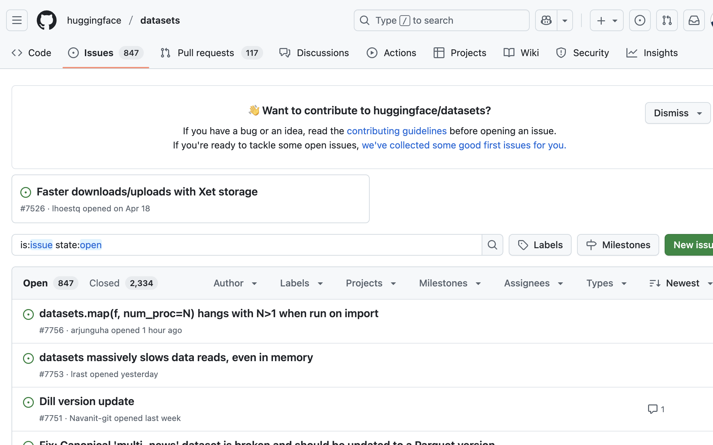

# Hugging Face Datasetsライブラリの完全ガイド

## 概要

この記事では、Hugging Face Datasetsライブラリを深く掘り下げ、以下の重要な質問に答えていきます：

- データセットがHubにない場合はどうすればよいか？
- データセットをどのようにスライスや操作するか？（Pandasを使う必要がある場合は？）
- 独自のデータセットを作成するにはどうすればよいか？

!!! info "参考資料"
    本ドキュメントは [Hugging Face LLM Course](https://huggingface.co/learn/llm-course/chapter5/1) を参考に、日本語で学習内容をまとめた個人的な学習ノートです。詳細な内容や最新情報については、原文も併せてご参照ください。

## 前提知識

この記事を理解するには、以下の知識が必要です：

- Pythonプログラミングの基本
- pandasライブラリの基本的な使い方
- 機械学習の基本概念
- Hugging Face Transformersライブラリの基本的な使い方

## データセットがHubにない場合の対処法

[Hugging Face Hub](https://huggingface.co/datasets)からデータセットをダウンロードする方法は既に学習済みです。しかし、実際にはラップトップやリモートサーバーに保存されたデータを扱うことが多いでしょう。

このセクションでは、Hugging Face Hubで利用できないデータセットをHugging Face Datasetsで読み込む方法を説明します。

### ローカルおよびリモートデータセットの操作

|    データ形式     | ローディングスクリプト |                         例                         |
| :----------------: | :------------: | :-----------------------------------------------------: |
|     CSV & TSV      |     `csv`      |     `load_dataset("csv", data_files="my_file.csv")`     |
|     テキストファイル     |     `text`     |    `load_dataset("text", data_files="my_file.txt")`     |
| JSON & JSON Lines  |     `json`     |   `load_dataset("json", data_files="my_file.jsonl")`    |
| Pickle形式のDataFrames |    `pandas`    | `load_dataset("pandas", data_files="my_dataframe.pkl")` |

上の表に示すように、各データ形式に対応する方法は非常にシンプルです。`load_dataset()`関数でローディングスクリプトの種類を指定し、`data_files`引数で1つまたは複数のファイルパスを指定するだけで読み込めます。まずはローカルファイルからデータセットを読み込み、その後リモートファイルで同じことを行う方法を見てみましょう。

### ローカルデータセットの読み込み

この例では、イタリア語での質問応答の大規模データセットである[SQuAD-itデータセット](https://github.com/crux82/squad-it/)を使用します。

トレーニングとテストの分割がGitHubでホストされているので、シンプルな`wget`コマンドでダウンロードできます：

```bash
# GitHubからSQuAD-itデータセットのファイルをダウンロード
wget https://github.com/crux82/squad-it/raw/master/SQuAD_it-train.json.gz
wget https://github.com/crux82/squad-it/raw/master/SQuAD_it-test.json.gz
```

**実行結果:**
```
SQuAD_it-train.json 100%[===================>]   7.37M  6.87MB/s 時間 1.1s       
2025-09-05 20:03:03 (6.87 MB/s) - `SQuAD_it-train.json.gz' へ保存完了 [7725286/7725286]

SQuAD_it-test.json. 100%[===================>]   1.00M  3.13MB/s 時間 0.3s       
2025-09-05 20:03:04 (3.13 MB/s) - `SQuAD_it-test.json.gz' へ保存完了 [1051245/1051245]
```

これにより、*SQuAD_it-train.json.gz*と*SQuAD_it-test.json.gz*という2つの圧縮ファイルがダウンロードされます。これらはLinuxの`gzip`コマンドで解凍できます：

```bash
# 圧縮ファイルを解凍（-d: 解凍、-k: 元ファイル保持、-v: 詳細表示）
gzip -dkv SQuAD_it-*.json.gz
```

**実行結果:**
```
SQuAD_it-test.json.gz:	   87.4% -- replaced with SQuAD_it-test.json
SQuAD_it-train.json.gz:	   82.2% -- replaced with SQuAD_it-train.json
```

圧縮ファイルが_SQuAD_it-train.json_と_SQuAD_it-test.json_に置き換えられ、データがJSON形式で保存されていることがわかります。

`load_dataset()`関数でJSONファイルを読み込むには、通常のJSON（ネストした辞書のような）かJSON Lines（行区切りJSON）のどちらを扱っているかを知る必要があります。多くの質問応答データセットと同様に、SQuAD-itはネスト構造を採用しており、すべてのテキストが`data`フィールドに保存されています。つまり、以下のように`field`引数を指定してデータセットを読み込むことができます：

```python
# DatasetsライブラリからJSONデータセットを読み込み
from datasets import load_dataset

# JSONファイルを読み込み、dataフィールドを指定
squad_it_dataset = load_dataset("json", data_files="SQuAD_it-train.json", field="data")
```

デフォルトでは、ローカルファイルの読み込みは`train`分割を持つ`DatasetDict`オブジェクトを作成します。`squad_it_dataset`オブジェクトを調べることでこれを確認できます：

```python
# データセットの構造を確認
squad_it_dataset
```

**実行結果:**
```
DatasetDict({
    train: Dataset({
        features: ['title', 'paragraphs'],
        num_rows: 442
    })
})
```

これにより、行数とトレーニングセットに関連する列名が表示されます。以下のようにして`train`分割にインデックスを付けることで、例の1つを表示できます：

```python
# トレーニングセットの最初の例を表示
squad_it_dataset["train"][0]
```

**実行結果:**
```python
{
    "title": "Terremoto del Sichuan del 2008",
    "paragraphs": [
        {
            "context": "Il terremoto del Sichuan del 2008 o il terremoto...",
            "qas": [
                {
                    "answers": [{"answer_start": 29, "text": "2008"}],
                    "id": "56cdca7862d2951400fa6826",
                    "question": "In quale anno si è verificato il terremoto nel Sichuan?",
                },
                ...
            ],
        },
        ...
    ],
}
```

素晴らしい！最初のローカルデータセットを読み込みました！しかし、これはトレーニングセットでは機能しましたが、実際に欲しいのは、`Dataset.map()`関数を両方の分割に一度に適用できるように、`train`と`test`の両方の分割を単一の`DatasetDict`オブジェクトに含めることです。これを行うには、各分割名をその分割に関連するファイルにマップする辞書を`data_files`引数に提供できます：

```python
# トレーニングとテストデータを含む辞書を作成
data_files = {"train": "SQuAD_it-train.json", "test": "SQuAD_it-test.json"}
squad_it_dataset = load_dataset("json", data_files=data_files, field="data")
squad_it_dataset
```

**実行結果:**
```
DatasetDict({
    train: Dataset({
        features: ['title', 'paragraphs'],
        num_rows: 442
    })
    test: Dataset({
        features: ['title', 'paragraphs'],
        num_rows: 48
    })
})
```

Hugging Face Datasetsのローディングスクリプトは、実際には入力ファイルの自動解凍をサポートしているため、圧縮ファイルに直接`data_files`引数を指定することで、`gzip`の使用をスキップできました：

```python
# 圧縮ファイルを直接指定（自動解凍される）
data_files = {"train": "SQuAD_it-train.json.gz", "test": "SQuAD_it-test.json.gz"}
squad_it_dataset = load_dataset("json", data_files=data_files, field="data")
```

これは、多くのGZIPファイルを手動で解凍したくない場合に便利です。自動解凍は、ZIPやTARなどの他の一般的な形式にも適用されるため、圧縮ファイルに`data_files`を指定するだけで準備完了です！

### リモートデータセットの読み込み

会社でデータサイエンティストやプログラマーとして働いている場合、分析したいデータセットはリモートサーバーに保存されていることが多いでしょう。幸いにも、リモートファイルの読み込みはローカルファイルの読み込みと同等に簡単です！ローカルファイルのパスの代わりに、`load_dataset()`の`data_files`引数でリモートファイルが保存されている1つまたは複数のURLを指定します。例えば、GitHubでホストされているSQuAD-itデータセットの場合、以下のように`data_files`を_SQuAD_it-*.json.gz_ URLに指定できます：

```python
# リモートURLから直接データセットを読み込み
url = "https://github.com/crux82/squad-it/raw/master/"
data_files = {
    "train": url + "SQuAD_it-train.json.gz",
    "test": url + "SQuAD_it-test.json.gz",
}
squad_it_dataset = load_dataset("json", data_files=data_files, field="data")
```

これは上記で取得したのと同じ`DatasetDict`オブジェクトを返しますが、_SQuAD_it-*.json.gz_ファイルを手動でダウンロードして解凍するステップを省略できます。これで、Hugging Face Hubでホストされていないデータセットを読み込むさまざまな方法の探索を終えます。作業に使うデータセットができたので、さまざまなデータ処理テクニックを実際に試してみましょう！

## データのスライスと処理

ほとんどの場合、作業するデータはモデルの訓練に完璧に準備されていません。このセクションでは、Hugging Face Datasetsがデータセットをクリーンアップするために提供するさまざまな機能を探索します。

### データのスライスと処理

Pandasと同様に、Hugging Face Datasetsは`Dataset`と`DatasetDict`オブジェクトの内容を操作するためのいくつかの関数を提供します。このセクションでは、利用可能なその他の関数について探索します。

この例では、[UC Irvine機械学習リポジトリ](https://archive.ics.uci.edu/ml/index.php)でホストされている[Drug Review Dataset](https://archive.ics.uci.edu/ml/datasets/Drug+Review+Dataset+%28Drugs.com%29)を使用します。これには、治療対象の症状と患者の満足度の10段階評価とともに、さまざまな薬物に関する患者レビューが含まれています。

まず、データをダウンロードして抽出する必要があります。これは`wget`と`unzip`コマンドで実行できます：

```bash
# Drug ReviewデータセットのダウンロードとZIPファイルの解凍
wget "https://archive.ics.uci.edu/ml/machine-learning-databases/00462/drugsCom_raw.zip"
unzip drugsCom_raw.zip
```

**実行結果:**
```
drugsCom_raw.zip        [        <=>         ]  41.00M  2.88MB/s 時間 16s        
2025-09-05 20:18:09 (2.63 MB/s) - `drugsCom_raw.zip' へ保存終了 [42989872]

Archive:  drugsCom_raw.zip
  inflating: drugsComTest_raw.tsv    
  inflating: drugsComTrain_raw.tsv   
```

TSVはコンマではなくタブ文字を区切り文字として使用するCSVの変種であるため、以下のように`load_dataset()`関数で`csv`ローディングスクリプトを使用し、`delimiter`引数を指定してこれらのファイルを読み込むことができます：

```python
# DatasetsライブラリでTSVファイルを読み込み
from datasets import load_dataset

# \tはPythonでのタブ文字
data_files = {"train": "drugsComTrain_raw.tsv", "test": "drugsComTest_raw.tsv"}
drug_dataset = load_dataset("csv", data_files=data_files, delimiter="\t")
```

データ分析を行う際の良い慣行は、扱うデータの特性を迅速に理解するために小さなランダムサンプルを取得することです。Hugging Face Datasetsでは、`Dataset.shuffle()`と`Dataset.select()`関数を連鎖させることでランダムサンプルを作成できます：

```python
# ランダムサンプルを作成してデータの最初の数例を確認
drug_sample = drug_dataset["train"].shuffle(seed=42).select(range(1000))
# 最初の数例を覗いてみる
drug_sample[:3]
```

**実行結果:**
```
{'Unnamed: 0': [87571, 178045, 80482],
 'drugName': ['Naproxen', 'Duloxetine', 'Mobic'],
 'condition': ['Gout, Acute', 'ibromyalgia', 'Inflammatory Conditions'],
 'review': ['"like the previous person mention, I&#039;m a strong believer of aleve, it works faster for my gout than the prescription meds I take. No more going to the doctor for refills.....Aleve works!"',
  '"I have taken Cymbalta for about a year and a half for fibromyalgia pain. It is great\r\nas a pain reducer and an anti-depressant, however, the side effects outweighed \r\nany benefit I got from it. I had trouble with restlessness, being tired constantly,\r\ndizziness, dry mouth, numbness and tingling in my feet, and horrible sweating. I am\r\nbeing weaned off of it now. Went from 60 mg to 30mg and now to 15 mg. I will be\r\noff completely in about a week. The fibro pain is coming back, but I would rather deal with it than the side effects."',
  '"I have been taking Mobic for over a year with no side effects other than an elevated blood pressure.  I had severe knee and ankle pain which completely went away after taking Mobic.  I attempted to stop the medication however pain returned after a few days."'],
 'rating': [9.0, 3.0, 10.0],
 'date': ['September 2, 2015', 'November 7, 2011', 'June 5, 2013'],
 'usefulCount': [36, 13, 128]}
```

再現性のために`Dataset.shuffle()`でシードを固定していることに注意してください。`Dataset.select()`は反復可能なインデックスを期待するため、シャッフルされたデータセットから最初の1,000例を取得するために`range(1000)`を渡しました。このサンプルから、データセットにはすでにいくつかの特性があることがわかります：

- `Unnamed: 0`列は各患者の匿名化IDのように見えます。
- `condition`列には大文字と小文字が混在したラベルが含まれています。
- レビューの長さはさまざまで、Pythonの改行区切り文字（`\r\n`）やHTML文字コード（`&#039;`など）が混在しています。

Hugging Face Datasetsを使用してこれらの問題のそれぞれに対処する方法を見てみましょう。`Unnamed: 0`列の患者ID仮説をテストするために、`Dataset.unique()`関数を使用して、IDの数が各分割の行数と一致することを確認できます：

```python
# 各分割でユニークIDの数が総行数と一致することを確認
for split in drug_dataset.keys():
    assert len(drug_dataset[split]) == len(drug_dataset[split].unique("Unnamed: 0"))
```

これで仮説が確認されたようです。`DatasetDict.rename_column()`関数を使用して、列をより解釈しやすいものに名前変更し、データセットを少しクリーンアップしましょう：

```python
# 列名をより意味のあるものに変更
drug_dataset = drug_dataset.rename_column(
    original_column_name="Unnamed: 0", new_column_name="patient_id"
)
drug_dataset
```

**実行結果:**
```
DatasetDict({
    train: Dataset({
        features: ['patient_id', 'drugName', 'condition', 'review', 'rating', 'date', 'usefulCount'],
        num_rows: 161297
    })
    test: Dataset({
        features: ['patient_id', 'drugName', 'condition', 'review', 'rating', 'date', 'usefulCount'],
        num_rows: 53766
    })
})
```

次に、`Dataset.map()`を使用してすべての`condition`ラベルを正規化しましょう。`drug_dataset`内の各分割のすべての行に適用できる簡単な関数を定義できます：

```python
# 症状名を小文字に変換する関数
def lowercase_condition(example):
    return {"condition": example["condition"].lower()}

drug_dataset.map(lowercase_condition) # AttributeError: 'NoneType' object has no attribute 'lower'
```

おっと、map関数で問題が発生しました！エラーから、`condition`列の一部のエントリが`None`であり、文字列ではないため小文字に変換できないことが推測できます。`Dataset.filter()`を使用してこれらの行を削除しましょう。これは`Dataset.map()`と同様に動作し、データセットの単一の例を受け取る関数を期待します。以下のような明示的な関数を書く代わりに：

```python
# None値をフィルタリングする関数（明示的バージョン）
def filter_nones(x):
    return x["condition"] is not None
```

そして`drug_dataset.filter(filter_nones)`を実行する代わりに、_ラムダ関数_を使用して1行でこれを実行できます。Pythonでは、ラムダ関数は明示的に名前を付けることなく定義できる小さな関数です。

```python
# None値を含む行をフィルタリング
drug_dataset = drug_dataset.filter(lambda x: x["condition"] is not None)
```

**実行結果:**
```
Filter: 100%|██████████| 160398/160398 [00:01<00:00, 130404.65 examples/s]
Filter: 100%|██████████| 53471/53471 [00:00<00:00, 135494.43 examples/s]
```

`None`エントリが削除されたので、`condition`列を正規化できます：

```python
# 症状名を小文字に正規化
drug_dataset = drug_dataset.map(lowercase_condition)
# 小文字化が機能したことを確認
drug_dataset["train"]["condition"][:3]
```

**実行結果:**
```
Map: 100%|██████████| 160398/160398 [00:05<00:00, 31554.40 examples/s]
Map: 100%|██████████| 53471/53471 [00:01<00:00, 31674.86 examples/s]

['left ventricular dysfunction', 'adhd', 'birth control']
```

動作しました！ラベルをクリーンアップしたので、次はレビュー自体をクリーンアップしてみましょう。

### 新しい列の作成

顧客レビューを扱う場合、各レビューの単語数を確認することは良い慣行です。レビューは「Great!」のような単一の単語かもしれませんし、数千単語の本格的なエッセイかもしれません。ユースケースに応じて、これらの極端なケースを異なって処理する必要があります。各レビューの単語数を計算するために、各テキストを空白で分割することに基づく大まかなヒューリスティックを使用します。

各レビューの単語数をカウントする簡単な関数を定義しましょう：

```python
# レビューの単語数を計算する関数
def compute_review_length(example):
    return {"review_length": len(example["review"].split())}
```

`lowercase_condition()`関数とは異なり、`compute_review_length()`はデータセットの列名の1つに対応しないキーを持つ辞書を返します。この場合、`compute_review_length()`が`Dataset.map()`に渡されると、データセットのすべての行に適用され、新しい`review_length`列が作成されます：

```python
# レビューの長さ情報を含む新しい列を追加
drug_dataset = drug_dataset.map(compute_review_length)
# 最初のトレーニング例を調査
drug_dataset["train"][0]
```

**実行結果:**
```
Map: 100%|██████████| 160398/160398 [00:04<00:00, 36199.78 examples/s]
Map: 100%|██████████| 53471/53471 [00:01<00:00, 36566.94 examples/s]

{'patient_id': 206461,
 'drugName': 'Valsartan',
 'condition': 'left ventricular dysfunction',
 'review': '"It has no side effect, I take it in combination of Bystolic 5 Mg and Fish Oil"',
 'rating': 9.0,
 'date': 'May 20, 2012',
 'usefulCount': 27,
 'review_length': 17}
```

期待通り、`review_length`列がトレーニングセットに追加されたことがわかります。`Dataset.sort()`でこの新しい列をソートして、極値がどのようなものかを確認できます：

```python
# レビューの長さでソートして短いレビューを確認
drug_dataset["train"].sort("review_length")[:3]
```

**実行結果:**
```
{'patient_id': [111469, 13653, 53602],
 'drugName': ['Ledipasvir / sofosbuvir',
  'Amphetamine / dextroamphetamine',
  'Alesse'],
 'condition': ['hepatitis c', 'adhd', 'birth control'],
 'review': ['"Headache"', '"Great"', '"Awesome"'],
 'rating': [10.0, 10.0, 10.0],
 'date': ['February 3, 2015', 'October 20, 2009', 'November 23, 2015'],
 'usefulCount': [41, 3, 0],
 'review_length': [1, 1, 1]}
```

予想通り、一部のレビューには単語が1つしか含まれていません。これは感情分析には問題ないかもしれませんが、症状を予測したい場合は情報になりません。

`Dataset.filter()`関数を使用して、30語未満のレビューを削除しましょう。`condition`列で行ったのと同様に、レビューがこのしきい値を超える長さを要求することで、非常に短いレビューをフィルタリングできます：

```python
# 30語未満の短いレビューをフィルタリング
drug_dataset = drug_dataset.filter(lambda x: x["review_length"] > 30)
print(drug_dataset.num_rows)
```

**実行結果:**
```
Filter: 100%|██████████| 160398/160398 [00:00<00:00, 357531.63 examples/s]
Filter: 100%|██████████| 53471/53471 [00:00<00:00, 374090.52 examples/s]
{'train': 138514, 'test': 46108}
```

ご覧のとおり、これにより元のトレーニングセットとテストセットから約15%のレビューが削除されました。

最後に対処する必要があるのは、レビューにHTML文字コードが存在することです。Pythonの`html`モジュールを使用して、以下のようにこれらの文字をアンエスケープできます：

```python
# HTML文字コードをアンエスケープ
import html

text = "I&#039;m a transformer called BERT"
html.unescape(text)
```

**実行結果:**
```
"I'm a transformer called BERT"
```

`Dataset.map()`を使用して、コーパス内のすべてのHTML文字をアンエスケープします：

```python
# すべてのレビューのHTML文字をアンエスケープ
drug_dataset = drug_dataset.map(lambda x: {"review": html.unescape(x["review"])})
```

**実行結果:**
```
Map: 100%|██████████| 138514/138514 [00:05<00:00, 27595.76 examples/s]
Map: 100%|██████████| 46108/46108 [00:01<00:00, 27529.15 examples/s]
```

ご覧のとおり、`Dataset.map()`メソッドはデータ処理に非常に役立ちます。しかし、できることのすべてには触れていません！

### `map()`メソッドの超能力

`Dataset.map()`メソッドは`batched`引数を取り、`True`に設定すると、一度に例のバッチをmap関数に送信します（バッチサイズは設定可能ですが、デフォルトは1,000です）。例えば、すべてのHTMLをアンエスケープした前のmap関数は実行に少し時間がかかりました（進行状況バーから所要時間を読み取ることができます）。リスト内包表記を使用して同時に複数の要素を処理することで、これを高速化できます。

`batched=True`を指定すると、関数はデータセットのフィールドを持つ辞書を受け取りますが、各値は単一の値ではなく、_値のリスト_になります。`Dataset.map()`の戻り値も同じである必要があります：更新または追加したいフィールドを持つ辞書と値のリストです。例えば、`batched=True`を使用してすべてのHTML文字をアンエスケープする別の方法は次のとおりです：

```python
# バッチ処理でHTML文字をアンエスケープ（高速化）
new_drug_dataset = drug_dataset.map(
    lambda x: {"review": [html.unescape(o) for o in x["review"]]}, batched=True
)
```

**実行結果:**
```
Map: 100%|██████████| 138514/138514 [00:00<00:00, 979367.85 examples/s]
Map: 100%|██████████| 46108/46108 [00:00<00:00, 1043782.45 examples/s]
```

ノートブックでこのコードを実行している場合、このコマンドが前のものよりもはるかに高速に実行されることがわかります。これは、レビューが既にHTMLアンエスケープされているからではありません（`batched=True`なしで前のセクションの命令を再実行すると、以前と同じ時間がかかります）。これは、リスト内包表記が通常`for`ループで同じコードを実行するよりも高速であり、一度に1つずつではなく、同時に多くの要素にアクセスすることでパフォーマンスが向上するためです。

`batched=True`での`Dataset.map()`の使用は、「高速」トークナイザーの速度を解放するために不可欠です。これらは大きなテキストリストを素早くトークン化できます。例えば、高速トークナイザーですべての薬物レビューをトークン化するには、このような関数を使用できます：

```python
# トークナイザーを使用してテキストをトークン化
from transformers import AutoTokenizer

tokenizer = AutoTokenizer.from_pretrained("bert-base-cased")

def tokenize_function(examples):
    return tokenizer(examples["review"], truncation=True)
```

1つまたは複数の例をトークナイザーに渡すことができるため、`batched=True`の有無にかかわらずこの関数を使用できます。この機会を利用して、さまざまなオプションのパフォーマンスを比較してみましょう。ノートブックでは、測定したいコード行の前に`%time`を追加することで、1行の命令の時間を測定できます：

```python
# バッチ処理でのトークン化のパフォーマンス測定
%time tokenized_dataset = drug_dataset.map(tokenize_function, batched=True)
```

**実行結果:**
```
Map: 100%|██████████| 138514/138514 [00:09<00:00, 14578.72 examples/s]
Map: 100%|██████████| 46108/46108 [00:03<00:00, 14226.14 examples/s]
CPU times: user 1min 59s, sys: 1.65 s, total: 2min
Wall time: 12.7 s
```

```python
# 単一処理でのトークン化のパフォーマンス測定
%time tokenized_dataset = drug_dataset.map(tokenize_function, batched=False)
```

**実行結果:**
```
Map: 100%|██████████| 138514/138514 [00:28<00:00, 4897.70 examples/s]
Map: 100%|██████████| 46108/46108 [00:09<00:00, 4887.94 examples/s]
CPU times: user 37.4 s, sys: 356 ms, total: 37.8 s
Wall time: 37.7 s
```

`Dataset.map()`には独自の並列化機能もあります。Rustでバックアップされていないため、遅いトークナイザーが高速なトークナイザーに追いつくことはありませんが、それでも役立ちます（特に高速バージョンがないトークナイザーを使用している場合）。マルチプロセッシングを有効にするには、`Dataset.map()`の呼び出しで`num_proc`引数を使用して、使用するプロセス数を指定します：

```python
# 遅いトークナイザーでマルチプロセッシングを使用
slow_tokenizer = AutoTokenizer.from_pretrained("bert-base-cased", use_fast=False)

def slow_tokenize_function(examples):
    return slow_tokenizer(examples["review"], truncation=True)

tokenized_dataset = drug_dataset.map(slow_tokenize_function, batched=True, num_proc=8)
```

**実行結果:**
```
Map (num_proc=8): 100%|██████████| 138514/138514 [00:09<00:00, 14687.58 examples/s]
Map (num_proc=8): 100%|██████████| 46108/46108 [00:03<00:00, 14247.44 examples/s]
```

使用する最適なプロセス数を決定するために少し実験してみることができます。私たちの場合、8が最高の速度向上を生み出すようでした。マルチプロセッシングあり/なしでの数値は次のとおりです：

| オプション         | 高速トークナイザー | 遅いトークナイザー |
|:--------------:|:--------------:|:-------------:|
| `batched=True`  | 10.8s          | 4min41s |
| `batched=False` | 59.2s          | 5min3s |
| `batched=True`, `num_proc=8`  | 6.52s          | 41.3s |
| `batched=False`, `num_proc=8` | 9.49s          | 45.2s |

これらは遅いトークナイザーにとってはるかに合理的な結果ですが、高速トークナイザーのパフォーマンスも大幅に改善されました。ただし、これが常にそうとは限らないことに注意してください。8以外の`num_proc`値に対して、テストでは`batched=True`をそのオプションなしで使用する方が高速であることが示されました。一般的に、`batched=True`で高速トークナイザーにPythonマルチプロセッシングを使用することはお勧めしません。

動作を見てみましょう！ここでは例をトークン化し、最大長128に切り詰めますが、最初の1つだけでなく、テキストの*すべての*チャンクを返すようにトークナイザーに要求します。これは`return_overflowing_tokens=True`で実行できます：

```python
# テキストを切り詰めてオーバーフローするトークンも返す関数
def tokenize_and_split(examples):
    return tokenizer(
        examples["review"],
        truncation=True,
        max_length=128,
        return_overflowing_tokens=True,
    )
```

データセット全体で`Dataset.map()`を使用する前に、1つの例でこれをテストしてみましょう：

```python
# 1つの例でトークン化をテスト
result = tokenize_and_split(drug_dataset["train"][0])
[len(inp) for inp in result["input_ids"]]
```

**実行結果:**
```
[128, 49]
```

トレーニングセットの最初の例は、指定した最大トークン数を超えてトークン化されたため、2つの特徴量になりました：長さ128の最初のものと長さ49の2番目のものです。では、データセット全体でこれを実行してみましょう！

```python
# データセット全体でトークン化と分割を実行
tokenized_dataset = drug_dataset.map(tokenize_and_split, batched=True)
# ArrowInvalid: Column 1 named condition expected length 1463 but got length 1000
```

うまくいきませんでした！なぜでしょうか？エラーメッセージを見ると手がかりが得られます：列の1つで長さの不一致があり、1つが1,463の長さで、もう1つが1,000の長さです。`Dataset.map()`の[ドキュメント](https://huggingface.co/docs/datasets/package_reference/main_classes#datasets.Dataset.map)を見たことがある場合、マッピングしている関数に渡されるサンプル数であることを思い出すかもしれません。ここでは、これらの1,000例が1,463の新しい特徴量を与え、形状エラーが発生しました。

問題は、異なるサイズの2つの異なるデータセットを混合しようとしていることです：`drug_dataset`列には一定数の例があります（エラーでの1,000）が、構築している`tokenized_dataset`にはより多くあります（エラーメッセージの1,463；`return_overflowing_tokens=True`を使用して長いレビューを複数の例にトークン化しているため、1,000より多くなります）。これは`Dataset`では機能しないため、古いデータセットから列を削除するか、新しいデータセットと同じサイズにする必要があります。`remove_columns`引数で前者を実行できます：

```python
# 古い列を削除してトークン化を実行
tokenized_dataset = drug_dataset.map(
    tokenize_and_split, batched=True, remove_columns=drug_dataset["train"].column_names
)
```

**実行結果:**
```
Map: 100%|██████████| 138514/138514 [00:25<00:00, 5401.52 examples/s]
Map: 100%|██████████| 46108/46108 [00:08<00:00, 5380.35 examples/s]
```

これでエラーなく動作します。新しいデータセットが元のデータセットよりもはるかに多くの要素を持っていることを長さを比較することで確認できます：

```python
# 新旧データセットのサイズ比較
len(tokenized_dataset["train"]), len(drug_dataset["train"])
```

**実行結果:**
```
(206772, 138514)
```

古い列を新しいものと同じサイズにすることで、不一致の長さ問題に対処することもできると述べました。これを行うには、`return_overflowing_tokens=True`を設定したときにトークナイザーが返す`overflow_to_sample_mapping`フィールドが必要です。これにより、新しい特徴量インデックスから、それが発生したサンプルのインデックスへのマッピングが提供されます。これを使用して、新しい特徴量を生成するたびに各例の値を繰り返すことで、元のデータセットに存在する各キーを適切なサイズの値のリストに関連付けることができます：

```python
# オーバーフローマッピングを使用して元の列も保持
def tokenize_and_split(examples):
    result = tokenizer(
        examples["review"],
        truncation=True,
        max_length=128,
        return_overflowing_tokens=True,
    )
    # 新旧インデックス間のマッピングを抽出
    sample_map = result.pop("overflow_to_sample_mapping")
    for key, values in examples.items():
        result[key] = [values[i] for i in sample_map]
    return result
```

古い列を削除する必要なく、`Dataset.map()`で動作することがわかります：

```python
# 元の列を保持したままトークン化
tokenized_dataset = drug_dataset.map(tokenize_and_split, batched=True)
tokenized_dataset
```

**実行結果:**
```
Map: 100%|██████████| 138514/138514 [00:26<00:00, 5299.52 examples/s]
Map: 100%|██████████| 46108/46108 [00:08<00:00, 5344.97 examples/s]

DatasetDict({
    train: Dataset({
        features: ['patient_id', 'drugName', 'condition', 'review', 'rating', 'date', 'usefulCount', 'review_length', 'input_ids', 'token_type_ids', 'attention_mask'],
        num_rows: 206772
    })
    test: Dataset({
        features: ['patient_id', 'drugName', 'condition', 'review', 'rating', 'date', 'usefulCount', 'review_length', 'input_ids', 'token_type_ids', 'attention_mask'],
        num_rows: 68876
    })
})
```

以前と同じ数のトレーニング特徴量が得られますが、ここではすべての古いフィールドを保持しました。モデルを適用した後に何らかの後処理でそれらが必要な場合は、このアプローチを使用したいかもしれません。

Hugging Face Datasetsをさまざまな方法でデータセットを前処理するために使用する方法を見てきました。Hugging Face Datasetsの処理関数はモデルトレーニングのニーズのほとんどをカバーしますが、`DataFrame.groupby()`や可視化用の高レベルAPIなど、より強力な機能にアクセスするためにPandasに切り替える必要がある場合があります。幸い、Hugging Face DatasetsはPandas、NumPy、PyTorch、TensorFlow、JAXなどのライブラリと相互運用できるように設計されています。これがどのように機能するかを見てみましょう。

### `Dataset`から`DataFrame`への変換とその逆

さまざまなサードパーティライブラリ間の変換を可能にするために、Hugging Face Datasetsは`Dataset.set_format()`関数を提供します。この関数はデータセットの_出力形式_のみを変更するため、基盤となる_データ形式_（Apache Arrow）に影響を与えることなく、別の形式に簡単に切り替えることができます。フォーマットはインプレースで実行されます。デモンストレーションとして、データセットをPandasに変換してみましょう：

```python
# データセットの出力形式をPandasに設定
drug_dataset.set_format("pandas")
```

これで、データセットの要素にアクセスすると、辞書の代わりに`pandas.DataFrame`が得られます：

```python
# Pandas形式でデータを表示
drug_dataset["train"][:3]
```

**実行結果:**

| インデックス | patient_id | drugName | condition | review | rating | date | usefulCount | review_length |
|---|---|---|---|---|---|---|---|---|
| 0 | 95260 | Guanfacine | adhd | "My son is halfway through his fourth week of ..." | 8.0 | April 27, 2010 | 192 | 141 |
| 1 | 92703 | Lybrel | birth control | "I used to take another oral contraceptive, wh..." | 5.0 | December 14, 2009 | 17 | 134 |
| 2 | 138000 | Ortho Evra | birth control | "This is my first time using any form of birth..." | 8.0 | November 3, 2015 | 10 | 89 |

トレーニングセット全体の`pandas.DataFrame`を作成するには、`drug_dataset["train"]`のすべての要素を選択します：

```python
# トレーニングセット全体をDataFrameとして取得
train_df = drug_dataset["train"][:]
```

!!! tip 
    内部的には、`Dataset.set_format()`はデータセットの`__getitem__()`ダンダーメソッドの戻り形式を変更します。これは、`"pandas"`形式の`Dataset`から`train_df`のような新しいオブジェクトを作成したい場合、`pandas.DataFrame`を取得するためにデータセット全体をスライスする必要があることを意味します。出力形式に関係なく、`drug_dataset["train"]`の型が`Dataset`であることを自分で確認できます。

ここから、欲しいすべてのPandas機能を使用できます。例えば、`condition`エントリ間のクラス分布を計算するためにファンシーなチェーンを実行できます：

```python
# Pandasを使用してクラス分布を計算
frequencies = (
    train_df["condition"]
    .value_counts()
    .to_frame()
    .reset_index()
    .rename(columns={"index": "condition", "count": "frequency"})
)
frequencies.head()
```

**実行結果:**

| インデックス | condition | frequency |
|---|---|---|
| 0 | birth control | 27655 |
| 1 | depression | 8023 |
| 2 | acne | 5209 |
| 3 | anxiety | 4991 |
| 4 | pain | 4744 |

Pandas分析が完了したら、以下のように`Dataset.from_pandas()`関数を使用して、いつでも新しい`Dataset`オブジェクトを作成できます：

```python
# PandasのDataFrameから新しいDatasetを作成
from datasets import Dataset

freq_dataset = Dataset.from_pandas(frequencies)
freq_dataset
```

**実行結果:**
```
Dataset({
    features: ['condition', 'frequency'],
    num_rows: 819
})
```

これで、Hugging Face Datasetsで利用可能なさまざまな前処理テクニックのツアーを終了します。セクションを締めくくるために、データセットを分類器のトレーニング用に準備するための検証セットを作成しましょう。その前に、`drug_dataset`の出力形式を`"pandas"`から`"arrow"`にリセットします：

```python
# データセットの形式をリセット
drug_dataset.reset_format()
```

### 検証セットの作成

評価に使用できるテストセットはありますが、開発中にテストセットには手をつけず、別の検証セットを作成することは良い慣行です。検証セットでモデルのパフォーマンスに満足したら、テストセットで最終的な健全性チェックを実行できます。このプロセスは、テストセットに過適合し、実世界のデータで失敗するモデルをデプロイするリスクを軽減するのに役立ちます。

Hugging Face Datasetsは、`scikit-learn`の有名な機能に基づく`Dataset.train_test_split()`関数を提供します。これを使用してトレーニングセットを`train`と`validation`分割に分割してみましょう（再現性のために`seed`引数を設定します）：

```python
# トレーニングセットを訓練用と検証用に分割
drug_dataset_clean = drug_dataset["train"].train_test_split(train_size=0.8, seed=42)
# デフォルトの"test"分割を"validation"に名前変更
drug_dataset_clean["validation"] = drug_dataset_clean.pop("test")
# "test"セットを`DatasetDict`に追加
drug_dataset_clean["test"] = drug_dataset["test"]
drug_dataset_clean
```

**実行結果:**
```
DatasetDict({
    train: Dataset({
        features: ['patient_id', 'drugName', 'condition', 'review', 'rating', 'date', 'usefulCount', 'review_length'],
        num_rows: 110811
    })
    validation: Dataset({
        features: ['patient_id', 'drugName', 'condition', 'review', 'rating', 'date', 'usefulCount', 'review_length'],
        num_rows: 27703
    })
    test: Dataset({
        features: ['patient_id', 'drugName', 'condition', 'review', 'rating', 'date', 'usefulCount', 'review_length'],
        num_rows: 46108
    })
})
```

### データセットの保存

Hugging Face Datasetsはダウンロードされたすべてのデータセットとそれに実行された操作をキャッシュしますが、データセットをディスクに保存したい場合があります（例：キャッシュが削除された場合）。以下の表に示すように、Hugging Face Datasetsはデータセットを異なる形式で保存するための3つの主要な関数を提供します：

| データ形式 |        関数        |
| :---------: | :--------------------: |
|    Arrow    | `Dataset.save_to_disk()` |
|     CSV     |    `Dataset.to_csv()`    |
|    JSON     |   `Dataset.to_json()`    |

例えば、クリーンアップしたデータセットをArrow形式で保存してみましょう：

```python
# データセットをArrow形式でディスクに保存
drug_dataset_clean.save_to_disk("drug-reviews")
```

**実行結果:**
```
Saving the dataset (1/1 shards): 100%|██████████| 110811/110811 [00:00<00:00, 249039.27 examples/s]
Saving the dataset (1/1 shards): 100%|██████████| 27703/27703 [00:00<00:00, 255657.51 examples/s]
Saving the dataset (1/1 shards): 100%|██████████| 46108/46108 [00:00<00:00, 2614416.04 examples/s]
```

これにより、以下の構造のディレクトリが作成されます：

```
drug-reviews/
├── dataset_dict.json
├── test
│   ├── dataset.arrow
│   ├── dataset_info.json
│   └── state.json
├── train
│   ├── dataset.arrow
│   ├── dataset_info.json
│   ├── indices.arrow
│   └── state.json
└── validation
    ├── dataset.arrow
    ├── dataset_info.json
    ├── indices.arrow
    └── state.json
```

各分割が独自の*dataset.arrow*テーブルに関連付けられ、*dataset_info.json*と*state.json*にメタデータがあることがわかります。Arrow形式は、大きなデータセットを処理および転送する高性能アプリケーションの構築に最適化された、列と行の素晴らしいテーブルと考えることができます。

データセットが保存されたら、以下のように`load_from_disk()`関数を使用してロードできます：

```python
# 保存されたデータセットをディスクからロード
from datasets import load_from_disk

drug_dataset_reloaded = load_from_disk("drug-reviews")
drug_dataset_reloaded
```

**実行結果:**
```
DatasetDict({
    train: Dataset({
        features: ['patient_id', 'drugName', 'condition', 'review', 'rating', 'date', 'usefulCount', 'review_length'],
        num_rows: 110811
    })
    validation: Dataset({
        features: ['patient_id', 'drugName', 'condition', 'review', 'rating', 'date', 'usefulCount', 'review_length'],
        num_rows: 27703
    })
    test: Dataset({
        features: ['patient_id', 'drugName', 'condition', 'review', 'rating', 'date', 'usefulCount', 'review_length'],
        num_rows: 46108
    })
})
```

CSVとJSON形式の場合、各分割を別々のファイルとして保存する必要があります。これを行う1つの方法は、`DatasetDict`オブジェクトのキーと値を反復処理することです：

```python
# 各分割をJSONLファイルとして保存
for split, dataset in drug_dataset_clean.items():
    dataset.to_json(f"drug-reviews-{split}.jsonl")
```

**実行結果:**
```
Creating json from Arrow format: 100%|██████████| 111/111 [00:00<00:00, 175.11ba/s]
Creating json from Arrow format: 100%|██████████| 28/28 [00:00<00:00, 180.40ba/s]
Creating json from Arrow format: 100%|██████████| 47/47 [00:00<00:00, 382.06ba/s]
```

```python
# 保存されたJSONLファイルからデータセットを再読み込み
data_files = {
    "train": "drug-reviews-train.jsonl",
    "validation": "drug-reviews-validation.jsonl",
    "test": "drug-reviews-test.jsonl",
}
drug_dataset_reloaded = load_dataset("json", data_files=data_files)
```

**実行結果:**
```
Generating train split: 110811 examples [00:00, 1512530.86 examples/s]
Generating validation split: 27703 examples [00:00, 1649252.75 examples/s]
Generating test split: 46108 examples [00:00, 1849870.09 examples/s]
```

## 独自データセットの作成

NLPアプリケーションを構築するために必要なデータセットが存在しない場合があり、自分で作成する必要があります。このセクションでは、GitHubリポジトリのバグや機能を追跡するために一般的に使用される[GitHubイシュー](https://github.com/features/issues/)のコーパスを作成する方法を示します。このコーパスは、以下を含むさまざまな目的に使用できます：

- オープンイシューやプルリクエストを閉じるのにかかる時間の探索
- イシューの説明に基づいてイシューをメタデータでタグ付けできる_マルチラベル分類器_のトレーニング（例：「バグ」、「拡張」、「質問」）
- ユーザーのクエリに一致するイシューを見つけるセマンティック検索エンジンの作成

ここではコーパスの作成に焦点を当て、次のセクションでセマンティック検索アプリケーションに取り組みます。メタになるために、人気のオープンソースプロジェクトに関連するGitHubイシューを使用します：Hugging Face Datasets！これらのイシューでデータを取得し、含まれる情報を探索する方法を見てみましょう。

### データの取得

Hugging Face Datasetsのすべてのイシューは、リポジトリの[Issuesタブ](https://github.com/huggingface/datasets/issues)に移動することで見つけることができます。



これらのイシューの1つをクリックすると、タイトル、説明、およびイシューを特徴付けるラベルのセットが含まれていることがわかります。

リポジトリのすべてのイシューをダウンロードするには、[GitHub REST API](https://docs.github.com/en/rest)を使用して[`Issues`エンドポイント](https://docs.github.com/en/rest/reference/issues#list-repository-issues)をポーリングします。このエンドポイントはJSONオブジェクトのリストを返し、各オブジェクトにはタイトルと説明、およびイシューのステータスなどに関するメタデータを含む多数のフィールドが含まれています。

イシューをダウンロードする便利な方法は、PythonでHTTPリクエストを行う標準的な方法である`requests`ライブラリを使用することです。`requests.get()`関数を呼び出すことで、`Issues`エンドポイントにGETリクエストを送信できます。例えば、以下のコマンドを実行して、最初のページの最初のイシューを取得できます：

```python
# GitHub APIからイシューを取得
import requests

url = "https://api.github.com/repos/huggingface/datasets/issues?page=1&per_page=1"
response = requests.get(url)
```

`response`オブジェクトには、HTTPステータスコードを含む、リクエストに関する多くの有用な情報が含まれています：

```python
# HTTPステータスコードを確認
response.status_code
```

**実行結果:**
```
200
```

`200`ステータスはリクエストが成功したことを意味します（可能なHTTPステータスコードのリストは[こちら](https://en.wikipedia.org/wiki/List_of_HTTP_status_codes)で見つけることができます）。しかし、実際に興味があるのは_ペイロード_で、これはバイト、文字列、JSONなどのさまざまな形式でアクセスできます。イシューがJSON形式であることがわかっているので、以下のようにペイロードを調べてみましょう：

```python
# JSON形式でレスポンスのペイロードを表示
response.json()
```

**実行結果:**
```
[{'url': 'https://api.github.com/repos/huggingface/datasets/issues/7756',
  'repository_url': 'https://api.github.com/repos/huggingface/datasets',
  'labels_url': 'https://api.github.com/repos/huggingface/datasets/issues/7756/labels{/name}',
  'comments_url': 'https://api.github.com/repos/huggingface/datasets/issues/7756/comments',
  'events_url': 'https://api.github.com/repos/huggingface/datasets/issues/7756/events',
  'html_url': 'https://github.com/huggingface/datasets/issues/7756',
  'id': 3387076693,
  'node_id': 'I_kwDODunzps7J4rBV',
  'number': 7756,
  'title': 'datasets.map(f, num_proc=N) hangs with N>1 when run on import',
  'user': {'login': 'arjunguha',
   'id': 20065,
   'node_id': 'MDQ6VXNlcjIwMDY1',
   'avatar_url': 'https://avatars.githubusercontent.com/u/20065?v=4',
   'gravatar_id': '',
   'url': 'https://api.github.com/users/arjunguha',
   'html_url': 'https://github.com/arjunguha',
   'followers_url': 'https://api.github.com/users/arjunguha/followers',
   'following_url': 'https://api.github.com/users/arjunguha/following{/other_user}',
   'gists_url': 'https://api.github.com/users/arjunguha/gists{/gist_id}',
   'starred_url': 'https://api.github.com/users/arjunguha/starred{/owner}{/repo}',
   'subscriptions_url': 'https://api.github.com/users/arjunguha/subscriptions',
   'organizations_url': 'https://api.github.com/users/arjunguha/orgs',
   'repos_url': 'https://api.github.com/users/arjunguha/repos',
   'events_url': 'https://api.github.com/users/arjunguha/events{/privacy}',
   'received_events_url': 'https://api.github.com/users/arjunguha/received_events',
   'type': 'User',
   'user_view_type': 'public',
   'site_admin': False},
  'labels': [],
  'state': 'open',
  'locked': False,
  'assignee': None,
  'assignees': [],
  'milestone': None,
  'comments': 0,
  'created_at': '2025-09-05T10:32:01Z',
  'updated_at': '2025-09-05T10:32:01Z',
  'closed_at': None,
  'author_association': 'NONE',
  'type': None,
  'active_lock_reason': None,
  'sub_issues_summary': {'total': 0, 'completed': 0, 'percent_completed': 0},
  'issue_dependencies_summary': {'blocked_by': 0,
   'total_blocked_by': 0,
   'blocking': 0,
   'total_blocking': 0},
  'body': '### Describe the bug\n\nIf you `import` a module that runs `datasets.map(f, num_proc=N)` at the top-level, Python hangs.\n\n\n### Steps to reproduce the bug\n\n1. Create a file that runs datasets.map at the top-level:\n\n```bash\ncat <<EOF > import_me.py\nimport datasets\n\nthe_dataset = datasets.load_dataset("openai/openai_humaneval")\nthe_dataset = the_dataset.map(lambda item: item, num_proc=2)\nEOF\n```\n\n2. Start Python REPL:\n\n```bash\nuv run --python 3.12.3 --with "datasets==4.0.0"  python3\nPython 3.12.3 (main, Aug 14 2025, 17:47:21) [GCC 13.3.0] on linux\nType "help", "copyright", "credits" or "license" for more information.\n```\n\n3. Import the file:\n\n```python\nimport import_me\n````\n\nObserve hang.\n\n### Expected behavior\n\nIdeally would not hang, or would fallback to num_proc=1 with a warning.\n\n### Environment info\n\n\n- `datasets` version: 4.0.0\n- Platform: Linux-6.14.0-29-generic-x86_64-with-glibc2.39\n- Python version: 3.12.3\n- `huggingface_hub` version: 0.34.4\n- PyArrow version: 21.0.0\n- Pandas version: 2.3.2\n- `fsspec` version: 2025.3.0\n',
  'closed_by': None,
  'reactions': {'url': 'https://api.github.com/repos/huggingface/datasets/issues/7756/reactions',
   'total_count': 0,
   '+1': 0,
   '-1': 0,
   'laugh': 0,
   'hooray': 0,
   'confused': 0,
   'heart': 0,
   'rocket': 0,
   'eyes': 0},
  'timeline_url': 'https://api.github.com/repos/huggingface/datasets/issues/7756/timeline',
  'performed_via_github_app': None,
  'state_reason': None}]
```

たくさんの情報ですね！イシューを説明する`title`、`body`、`number`などの有用なフィールドや、イシューを開いたGitHubユーザーに関する情報が見えます。

GitHub[ドキュメント](https://docs.github.com/en/rest/overview/resources-in-the-rest-api#rate-limiting)で説明されているように、認証されていないリクエストは1時間あたり60リクエストに制限されています。`per_page`クエリパラメータを増やして行うリクエスト数を減らすことはできますが、数千を超えるイシューを持つリポジトリでは、依然として制限に達してしまいます。代わりに、_パーソナルアクセストークン_を作成するGitHubの[手順](https://docs.github.com/en/github/authenticating-to-github/creating-a-personal-access-token)に従って、制限を1時間あたり5,000リクエストまで増やすべきです。トークンを取得したら、リクエストヘッダーの一部として含めることができます：

```python
# GitHubトークンを使用した認証設定
GITHUB_TOKEN = 'xxx'  # GitHubトークンをここにコピーしてください
headers = {"Authorization": f"token {GITHUB_TOKEN}"}
```

アクセストークンができたので、GitHubリポジトリからすべてのイシューをダウンロードできる関数を作成しましょう：

```python
# GitHubイシューを取得する関数
import time, requests
import math
from pathlib import Path
import pandas as pd
from tqdm.notebook import tqdm

def fetch_issues(
    owner="huggingface",
    repo="datasets",
    num_issues=10_000,
    rate_limit=5_000,
    issues_path=Path("."),
):
    if not issues_path.is_dir():
        issues_path.mkdir(exist_ok=True)

    batch = []
    all_issues = []
    per_page = 100  # ページあたりのイシュー数
    num_pages = math.ceil(num_issues / per_page)
    base_url = "https://api.github.com/repos"

    for page in tqdm(range(num_pages)):
        # state=allでオープンとクローズ両方のイシューを取得
        query = f"issues?page={page}&per_page={per_page}&state=all"
        issues = requests.get(f"{base_url}/{owner}/{repo}/{query}", headers=headers)
        batch.extend(issues.json())

        if len(batch) > rate_limit and len(all_issues) < num_issues:
            all_issues.extend(batch)
            batch = []  # 次の時間間隔のためにバッチをフラッシュ
            print(f"GitHubの制限に到達しました。1時間スリープします...")
            time.sleep(60 * 60 + 1)

    all_issues.extend(batch)
    df = pd.DataFrame.from_records(all_issues)
    df.to_json(f"{issues_path}/{repo}-issues.jsonl", orient="records", lines=True)
    print(
        f"{repo}のすべてのイシューをダウンロードしました！データセットは{issues_path}/{repo}-issues.jsonlに保存されています"
    )
```

`fetch_issues()`を呼び出すと、GitHubの1時間あたりのリクエスト数制限を超えないようにバッチですべてのイシューをダウンロードします。結果は_repository_name-issues.jsonl_ファイルに保存され、各行はイシューを表すJSONオブジェクトです。この関数を使用してHugging Face Datasetsからすべてのイシューを取得してみましょう：

```python
# インターネット接続によっては、実行に数分かかる場合があります...
fetch_issues()
```

**実行結果:**
```
  0%|          | 0/100 [00:00<?, ?it/s]
GitHubの制限に到達しました。1時間スリープします...
datasetsのすべてのイシューをダウンロードしました！データセットは./datasets-issues.jsonlに保存されています
```

```python
# ダウンロードしたデータをDatasetに変換
import pandas as pd
from datasets import Dataset

df = pd.read_json("datasets-issues.jsonl", lines=True)
issues_dataset = Dataset.from_pandas(df)
issues_dataset
```

**実行結果:**
```
Dataset({
    features: ['url', 'repository_url', 'labels_url', 'comments_url', 'events_url', 'html_url', 'id', 'node_id', 'number', 'title', 'user', 'labels', 'state', 'locked', 'assignee', 'assignees', 'milestone', 'comments', 'created_at', 'updated_at', 'closed_at', 'author_association', 'type', 'active_lock_reason', 'sub_issues_summary', 'issue_dependencies_summary', 'body', 'closed_by', 'reactions', 'timeline_url', 'performed_via_github_app', 'state_reason', 'draft', 'pull_request'],
    num_rows: 7676
})
```

### データのクリーンアップ

GitHubドキュメントの上記スニペットは、`pull_request`列を使用してイシューとプルリクエストを区別できることを示しています。ランダムサンプルを見て、違いが何かを確認してみましょう。`Dataset.shuffle()`と`Dataset.select()`を連鎖させてランダムサンプルを作成し、`html_url`と`pull_request`列を圧縮してさまざまなURLを比較できます：

```python
# ランダムサンプルでイシューとプルリクエストの違いを確認
sample = issues_dataset.shuffle(seed=666).select(range(3))

# URLとプルリクエストエントリを出力
for url, pr in zip(sample["html_url"], sample["pull_request"]):
    print(f">> URL: {url}")
    print(f">> プルリクエスト: {pr}\n")
```

**実行結果:**
```
>> URL: https://github.com/huggingface/datasets/issues/277
>> プルリクエスト: None

>> URL: https://github.com/huggingface/datasets/issues/6132
>> プルリクエスト: None

>> URL: https://github.com/huggingface/datasets/pull/6943
>> プルリクエスト: {'diff_url': 'https://github.com/huggingface/datasets/pull/6943.diff', 'html_url': 'https://github.com/huggingface/datasets/pull/6943', 'merged_at': '2024-06-03T05:17:40Z', 'patch_url': 'https://github.com/huggingface/datasets/pull/6943.patch', 'url': 'https://api.github.com/repos/huggingface/datasets/pulls/6943'}
```

ここで、各プルリクエストがさまざまなURLに関連付けられている一方で、通常のイシューには`None`エントリがあることがわかります。この区別を使用して、`pull_request`フィールドが`None`かどうかをチェックする新しい`is_pull_request`列を作成できます：

```python
# プルリクエストかどうかを示す新しい列を追加
issues_dataset = issues_dataset.map(
    lambda x: {"is_pull_request": False if x["pull_request"] is None else True}
)
```

一部の列を削除または名前変更してデータセットをさらにクリーンアップすることもできますが、一般的に、この段階ではデータセットを「生の」状態にできるだけ保つことは良い慣行です。これにより、複数のアプリケーションで簡単に使用できます。

### データセットの拡張

以下のスクリーンショットに示すように、イシューやプルリクエストに関連するコメントは、特にライブラリに関するユーザーのクエリに答える検索エンジンの構築に興味がある場合、豊富な情報源を提供します。

GitHub REST APIは、イシュー番号に関連するすべてのコメントを返す[`Comments`エンドポイント](https://docs.github.com/en/rest/reference/issues#list-issue-comments)を提供します。エンドポイントをテストして、何を返すかを確認してみましょう：

```python
# 特定のイシューのコメントを取得
issue_number = 2792
url = f"https://api.github.com/repos/huggingface/datasets/issues/{issue_number}/comments"
response = requests.get(url, headers=headers)
response.json()
```

**実行結果:**
```
[{'url': 'https://api.github.com/repos/huggingface/datasets/issues/comments/897594128',
  'html_url': 'https://github.com/huggingface/datasets/pull/2792#issuecomment-897594128',
  'issue_url': 'https://api.github.com/repos/huggingface/datasets/issues/2792',
  'id': 897594128,
  'node_id': 'IC_kwDODunzps41gDMQ',
  'user': {'login': 'bhavitvyamalik',
   'id': 19718818,
   'node_id': 'MDQ6VXNlcjE5NzE4ODE4',
   'avatar_url': 'https://avatars.githubusercontent.com/u/19718818?v=4',
   'gravatar_id': '',
   'url': 'https://api.github.com/users/bhavitvyamalik',
   'html_url': 'https://github.com/bhavitvyamalik',
   'followers_url': 'https://api.github.com/users/bhavitvyamalik/followers',
   'following_url': 'https://api.github.com/users/bhavitvyamalik/following{/other_user}',
   'gists_url': 'https://api.github.com/users/bhavitvyamalik/gists{/gist_id}',
   'starred_url': 'https://api.github.com/users/bhavitvyamalik/starred{/owner}{/repo}',
   'subscriptions_url': 'https://api.github.com/users/bhavitvyamalik/subscriptions',
   'organizations_url': 'https://api.github.com/users/bhavitvyamalik/orgs',
   'repos_url': 'https://api.github.com/users/bhavitvyamalik/repos',
   'events_url': 'https://api.github.com/users/bhavitvyamalik/events{/privacy}',
   'received_events_url': 'https://api.github.com/users/bhavitvyamalik/received_events',
   'type': 'User',
   'user_view_type': 'public',
   'site_admin': False},
  'created_at': '2021-08-12T12:21:52Z',
  'updated_at': '2021-08-12T12:31:17Z',
  'author_association': 'CONTRIBUTOR',
  'body': "@albertvillanova my tests are failing here:\r\n```\r\ndataset_name = 'gooaq'\r\n\r\n    def test_load_dataset(self, dataset_name):\r\n        configs = self.dataset_tester.load_all_configs(dataset_name, is_local=True)[:1]\r\n>       self.dataset_tester.check_load_dataset(dataset_name, configs, is_local=True, use_local_dummy_data=True)\r\n\r\ntests/test_dataset_common.py:234: \r\n_ _ _ _ _ _ _ _ _ _ _ _ _ _ _ _ _ _ _ _ _ _ _ _ _ _ _ _ _ _ _ _ _ _ _ _ _ _ _ _ \r\ntests/test_dataset_common.py:187: in check_load_dataset\r\n    self.parent.assertTrue(len(dataset[split]) > 0)\r\nE   AssertionError: False is not true\r\n```\r\nWhen I try loading dataset on local machine it works fine. Any suggestions on how can I avoid this error?",
  'reactions': {'url': 'https://api.github.com/repos/huggingface/datasets/issues/comments/897594128/reactions',
   'total_count': 0,
   '+1': 0,
   '-1': 0,
   'laugh': 0,
   'hooray': 0,
   'confused': 0,
   'heart': 0,
   'rocket': 0,
   'eyes': 0},
  'performed_via_github_app': None},
 {'url': 'https://api.github.com/repos/huggingface/datasets/issues/comments/898644889',
  'html_url': 'https://github.com/huggingface/datasets/pull/2792#issuecomment-898644889',
  'issue_url': 'https://api.github.com/repos/huggingface/datasets/issues/2792',
  'id': 898644889,
  'node_id': 'IC_kwDODunzps41kDuZ',
  'user': {'login': 'bhavitvyamalik',
   'id': 19718818,
   'node_id': 'MDQ6VXNlcjE5NzE4ODE4',
   'avatar_url': 'https://avatars.githubusercontent.com/u/19718818?v=4',
   'gravatar_id': '',
   'url': 'https://api.github.com/users/bhavitvyamalik',
   'html_url': 'https://github.com/bhavitvyamalik',
   'followers_url': 'https://api.github.com/users/bhavitvyamalik/followers',
   'following_url': 'https://api.github.com/users/bhavitvyamalik/following{/other_user}',
   'gists_url': 'https://api.github.com/users/bhavitvyamalik/gists{/gist_id}',
   'starred_url': 'https://api.github.com/users/bhavitvyamalik/starred{/owner}{/repo}',
   'subscriptions_url': 'https://api.github.com/users/bhavitvyamalik/subscriptions',
   'organizations_url': 'https://api.github.com/users/bhavitvyamalik/orgs',
   'repos_url': 'https://api.github.com/users/bhavitvyamalik/repos',
   'events_url': 'https://api.github.com/users/bhavitvyamalik/events{/privacy}',
   'received_events_url': 'https://api.github.com/users/bhavitvyamalik/received_events',
   'type': 'User',
   'user_view_type': 'public',
   'site_admin': False},
  'created_at': '2021-08-13T18:28:27Z',
  'updated_at': '2021-08-13T18:28:27Z',
  'author_association': 'CONTRIBUTOR',
  'body': 'Thanks for the help, @albertvillanova! All tests are passing now.',
  'reactions': {'url': 'https://api.github.com/repos/huggingface/datasets/issues/comments/898644889/reactions',
   'total_count': 0,
   '+1': 0,
   '-1': 0,
   'laugh': 0,
   'hooray': 0,
   'confused': 0,
   'heart': 0,
   'rocket': 0,
   'eyes': 0},
  'performed_via_github_app': None}]
```

コメントが`body`フィールドに保存されていることがわかるので、`response.json()`の各要素の`body`内容を取り出すことで、イシューに関連するすべてのコメントを返す簡単な関数を書きましょう：

```python
# イシューのコメントを取得する関数
def get_comments(issue_number):
    url = f"https://api.github.com/repos/huggingface/datasets/issues/{issue_number}/comments"
    response = requests.get(url, headers=headers)
    return [r["body"] for r in response.json()]
```

これで良さそうなので、`Dataset.map()`を使用してデータセット内の各イシューに新しい`comments`列を追加しましょう：

```python
# インターネット接続によっては、数分かかる場合があります...
issues_with_comments_dataset = issues_dataset.map(
    lambda x: {"comments": get_comments(x["number"])}
)
```

このデータセットをローカルに保存します。

```python
# データセットをJSONL形式で保存
issues_with_comments_dataset.to_json("issues_with_comments-dataset.jsonl")
```

## FAISSを使った意味検索

### 意味検索のための埋め込み

Transformerベースの言語モデルは、テキストのスパン内の各トークンを_埋め込みベクトル_として表現します。個々の埋め込みベクトルを統合（プール）することで、文全体、段落、さらには文書全体のベクトル表現を作成することができます。これらの埋め込みは、各埋め込み間のドット積類似度（または他の類似度メトリック）を計算し、最も重複の大きい文書を返すことで、コーパス内の類似文書を見つけるために使用できます。

このセクションでは、埋め込みを使用して意味検索エンジンを開発します。これらの検索エンジンは、クエリ内のキーワードと文書をマッチングすることに基づく従来のアプローチよりもいくつかの利点があります。

### データセットの読み込みと準備

最初に行う必要があるのは、GitHubイシューのデータセットをダウンロードすることなので、いつものように`load_dataset()`関数を使用しましょう：

```python
# GitHubイシューデータセットの読み込み
from datasets import load_dataset

issues_dataset = load_dataset("lewtun/github-issues", split="train")
issues_dataset
```

**実行結果:**
```
Repo card metadata block was not found. Setting CardData to empty.

Dataset({
    features: ['url', 'repository_url', 'labels_url', 'comments_url', 'events_url', 'html_url', 'id', 'node_id', 'number', 'title', 'user', 'labels', 'state', 'locked', 'assignee', 'assignees', 'milestone', 'comments', 'created_at', 'updated_at', 'closed_at', 'author_association', 'active_lock_reason', 'pull_request', 'body', 'timeline_url', 'performed_via_github_app', 'is_pull_request'],
    num_rows: 3019
})
```

ここでは`load_dataset()`でデフォルトの`train`分割を指定したので、`DatasetDict`ではなく`Dataset`を返します。まず最初にプルリクエストをフィルタリングする必要があります。これらはユーザークエリに答えるためにはめったに使用されず、検索エンジンにノイズを導入するためです。既によく知られているように、`Dataset.filter()`関数を使用してデータセット内のこれらの行を除外できます。ついでに、コメントのない行もフィルタリングしましょう。これらはユーザークエリに対する回答を提供しないためです：

```python
# プルリクエストとコメントなしの行をフィルタリング
issues_dataset = issues_dataset.filter(
    lambda x: (x["is_pull_request"] == False and len(x["comments"]) > 0)
)
issues_dataset
```

**実行結果:**
```
Dataset({
    features: ['url', 'repository_url', 'labels_url', 'comments_url', 'events_url', 'html_url', 'id', 'node_id', 'number', 'title', 'user', 'labels', 'state', 'locked', 'assignee', 'assignees', 'milestone', 'comments', 'created_at', 'updated_at', 'closed_at', 'author_association', 'active_lock_reason', 'pull_request', 'body', 'timeline_url', 'performed_via_github_app', 'is_pull_request'],
    num_rows: 808
})
```

データセットには多くの列が含まれていますが、検索エンジンの構築に必要なものはごく一部です。検索の観点から、最も情報価値の高い列は`title`、`body`、`comments`であり、`html_url`はソースイシューへのリンクを提供してくれます。`Dataset.remove_columns()`関数を使用して残りを削除しましょう：

```python
# 検索に必要な列のみを保持
columns = issues_dataset.column_names
columns_to_keep = ["title", "body", "html_url", "comments"]
columns_to_remove = set(columns_to_keep).symmetric_difference(columns)
issues_dataset = issues_dataset.remove_columns(columns_to_remove)
issues_dataset
```

**実行結果:**
```
Dataset({
    features: ['html_url', 'title', 'comments', 'body'],
    num_rows: 808
})
```

埋め込みを作成するために、これらのフィールドには有用なコンテキスト情報が含まれることが多いため、各コメントにイシューのタイトルと本文を拡張します。`comments`列は現在各イシューのコメントのリストなので、各行が`(html_url, title, body, comment)`タプルで構成されるように列を「展開」する必要があります。Pandasでは、リストのような列の各要素に対して新しい行を作成し、他のすべての列の値を複製する[`DataFrame.explode()`関数](https://pandas.pydata.org/pandas-docs/stable/reference/api/pandas.DataFrame.explode.html)でこれを実行できます。これを実際に見るために、まずPandas `DataFrame`形式に切り替えましょう：

```python
# Pandas形式に変換してデータ操作を行う
issues_dataset.set_format("pandas")
df = issues_dataset[:]
```

この`DataFrame`の最初の行を調べると、このイシューに関連する4つのコメントがあることがわかります：

```python
# 最初の行のコメントリストを確認
df["comments"][0].tolist()
```

**実行結果:**
```
['Cool, I think we can do both :)',
 '@lhoestq now the 2 are implemented.\r\n\r\nPlease note that for the the second protection, finally I have chosen to protect the master branch only from **merge commits** (see update comment above), so no need to disable/re-enable the protection on each release (direct commits, different from merge commits, can be pushed to the remote master branch; and eventually reverted without messing up the repo history).']
```

`df`を展開すると、これらのコメントのそれぞれに対して1行ずつ取得することが期待されます。それが実際にそうなのかを確認してみましょう：

```python
# コメントを展開して各コメントを個別の行にする
comments_df = df.explode("comments", ignore_index=True)
comments_df.head(4)
```

**実行結果:**

| インデックス | html_url | title | comments | body |
|---|---|---|---|---|
| 0 | https://github.com/huggingface/datasets/issues... | Protect master branch | Cool, I think we can do both :) | After accidental merge commit (91c55355b634d0d... |
| 1 | https://github.com/huggingface/datasets/issues... | Protect master branch | @lhoestq now the 2 are implemented.\r\n\r\nPle... | After accidental merge commit (91c55355b634d0d... |
| 2 | https://github.com/huggingface/datasets/issues... | Backwards compatibility broken for cached data... | Hi ! I guess the caching mechanism should have... | ## Describe the bug\r\nAfter upgrading to data... |
| 3 | https://github.com/huggingface/datasets/issues... | Backwards compatibility broken for cached data... | If it's easy enough to implement, then yes ple... | ## Describe the bug\r\nAfter upgrading to data... |

素晴らしい！行が複製され、`comments`列に個別のコメントが含まれていることがわかります！Pandasでの作業が終わったので、メモリ内の`DataFrame`をロードして素早く`Dataset`に戻すことができます：

```python
# DataFrameをDatasetに変換
from datasets import Dataset

comments_dataset = Dataset.from_pandas(comments_df)
comments_dataset
```

**実行結果:**
```
Dataset({
    features: ['html_url', 'title', 'comments', 'body'],
    num_rows: 2964
})
```

コメントごとに1行ができたので、コメントあたりの単語数を含む新しい`comments_length`列を作成しましょう：

```python
# コメントの長さを計算する新しい列を追加
comments_dataset = comments_dataset.map(
    lambda x: {"comment_length": len(x["comments"].split())}
)
```

この新しい列を使用して短いコメントをフィルタリングできます。これらには通常「cc @lewtun」や「Thanks!」などの検索エンジンに関連しないものが含まれています。フィルタに選択する正確な数はありませんが、15語程度が良いスタートのようです：

```python
# 15語未満の短いコメントをフィルタリング
comments_dataset = comments_dataset.filter(lambda x: x["comment_length"] > 15)
comments_dataset
```

**実行結果:**
```
Filter:   0%|          | 0/2964 [00:00<?, ? examples/s]

Dataset({
    features: ['html_url', 'title', 'comments', 'body', 'comment_length'],
    num_rows: 2175
})
```

データセットを少しクリーンアップしたので、イシューのタイトル、説明、コメントを新しい`text`列で連結しましょう。いつものように、`Dataset.map()`に渡すことができる簡単な関数を書きます：

```python
# タイトル、本文、コメントを連結する関数
def concatenate_text(examples):
    return {
        "text": examples["title"]
        + " \n "
        + examples["body"]
        + " \n "
        + examples["comments"]
    }

comments_dataset = comments_dataset.map(concatenate_text)
```

ついに埋め込みを作成する準備ができました！見てみましょう。

### テキスト埋め込みの作成

`AutoModel`クラスを使用してトークン埋め込みを取得できます。モデルをロードするための適切なチェックポイントを選択するだけです。幸い、埋め込みの作成に特化した`sentence-transformers`というライブラリがあります。ライブラリの[ドキュメント](https://www.sbert.net/examples/applications/semantic-search/README.html#symmetric-vs-asymmetric-semantic-search)で説明されているように、私たちのユースケースは_非対称意味検索_の例です。短いクエリがあり、その答えをイシューコメントのようなより長い文書で見つけたいからです。ドキュメントの便利な[モデル概要表](https://www.sbert.net/docs/pretrained_models.html#model-overview)によると、`multi-qa-mpnet-base-dot-v1`チェックポイントが意味検索で最高のパフォーマンスを持っているので、アプリケーションでそれを使用します。同じチェックポイントを使用してトークナイザーもロードします：

```python
# 意味検索用のモデルとトークナイザーをロード
from transformers import AutoTokenizer, AutoModel

model_ckpt = "sentence-transformers/multi-qa-mpnet-base-dot-v1"
tokenizer = AutoTokenizer.from_pretrained(model_ckpt)
model = AutoModel.from_pretrained(model_ckpt)
```

埋め込みプロセスを高速化するため、モデルと入力をGPUデバイスに配置すると役立ちます。今それを行いましょう：

```python
# モデルをGPUデバイスに移動
import torch

device = torch.device("mps")
model.to(device)
```

前述のように、GitHubイシューコーパスの各エントリを単一のベクトルとして表現したいので、トークン埋め込みを何らかの方法で「プール」または平均化する必要があります。人気のあるアプローチの1つは、モデルの出力に対して*CLSプーリング*を実行することです。これは、特別な`[CLS]`トークンの最後の隠れ状態を単純に収集するものです。以下の関数がこれを実行してくれます：

```python
# CLSプーリングを実行する関数
def cls_pooling(model_output):
    return model_output.last_hidden_state[:, 0]
```

次に、文書のリストをトークン化し、テンソルをGPUに配置し、モデルに送り、最後に出力にCLSプーリングを適用するヘルパー関数を作成します：

```python
# 埋め込みを取得するヘルパー関数
def get_embeddings(text_list):
    encoded_input = tokenizer(
        text_list, padding=True, truncation=True, return_tensors="pt"
    )
    encoded_input = {k: v.to(device) for k, v in encoded_input.items()}
    model_output = model(**encoded_input)
    return cls_pooling(model_output)
```

コーパスの最初のテキストエントリを渡して出力形状を調べることで、関数が動作することをテストできます：

```python
# 埋め込み関数をテスト
embedding = get_embeddings(comments_dataset["text"][0])
embedding.shape
```

**実行結果:**
```
torch.Size([1, 768])
```

素晴らしい！コーパスの最初のエントリを768次元ベクトルに変換しました！`Dataset.map()`を使用して`get_embeddings()`関数をコーパスの各行に適用できるので、以下のように新しい`embeddings`列を作成しましょう：

```python
# データセット全体の埋め込みを作成
embeddings_dataset = comments_dataset.map(
    lambda x: {"embeddings": get_embeddings(x["text"]).detach().cpu().numpy()[0]}
)
```

埋め込みをNumPy配列に変換していることに注意してください。これは、FAISSでインデックスを付けようとするときにHugging Face Datasetsがこの形式を要求するためです。次にこれを行います。

### 効率的な類似度検索のためのFAISS

埋め込みのデータセットができたので、それらを検索する方法が必要です。これを行うために、Hugging Face Datasetsの_FAISSインデックス_と呼ばれる特別なデータ構造を使用します。[FAISS](https://faiss.ai/)（Facebook AI Similarity Searchの略）は、埋め込みベクトルを素早く検索およびクラスタリングするための効率的なアルゴリズムを提供するライブラリです。

FAISSの背後にある基本的なアイデアは、入力埋め込みと類似している埋め込みを見つけることができる_インデックス_と呼ばれる特別なデータ構造を作成することです。Hugging Face DatasetsでFAISSインデックスを作成するのは簡単です。`Dataset.add_faiss_index()`関数を使用し、データセットのどの列をインデックス化したいかを指定します：

```python
# FAISSインデックスを作成
embeddings_dataset.add_faiss_index(column="embeddings")
```

**実行結果:**
```

Dataset({
    features: ['html_url', 'title', 'comments', 'body', 'comment_length', 'text', 'embeddings'],
    num_rows: 2175
})
```

`Dataset.get_nearest_examples()`関数で最近傍検索を行うことで、このインデックスでクエリを実行できるようになりました。まず以下のように質問を埋め込むことでこれをテストしてみましょう：

```python
# 質問を埋め込みベクトルに変換
question = "How can I load a dataset offline?"
question_embedding = get_embeddings([question]).cpu().detach().numpy()
question_embedding.shape
```

**実行結果:**
```
(1, 768)
```

文書と同様に、クエリを表す768次元ベクトルができました。これをコーパス全体と比較して最も類似した埋め込みを見つけることができます：

```python
# 最も類似した例を検索
scores, samples = embeddings_dataset.get_nearest_examples(
    "embeddings", question_embedding, k=5
)
```

`Dataset.get_nearest_examples()`関数は、クエリと文書間の重複をランク付けするスコアと、対応するサンプルセット（ここでは上位5つのマッチ）のタプルを返します。これらを`pandas.DataFrame`に集めて簡単にソートできるようにしましょう：

```python
# 結果をDataFrameに整理
import pandas as pd

samples_df = pd.DataFrame.from_dict(samples)
samples_df["scores"] = scores
samples_df.sort_values("scores", ascending=False, inplace=True)
```

最初の数行を反復処理して、クエリが利用可能なコメントとどの程度うまくマッチしたかを確認できます：

```python
# 検索結果を表示
for _, row in samples_df.iterrows():
    print(f"コメント: {row.comments}")
    print(f"スコア: {row.scores}")
    print(f"タイトル: {row.title}")
    print(f"URL: {row.html_url}")
    print("=" * 50)
    print()
```

**実行結果:**
```
    COMMENT: Requiring online connection is a deal breaker in some cases unfortunately so it'd be great if offline mode is added similar to how `transformers` loads models offline fine.

    @mandubian's second bullet point suggests that there's a workaround allowing you to use your offline (custom?) dataset with `datasets`. Could you please elaborate on how that should look like?
    SCORE: 25.50501251220703
    TITLE: Discussion using datasets in offline mode
    URL: https://github.com/huggingface/datasets/issues/824
    ==================================================

    COMMENT: The local dataset builders (csv, text , json and pandas) are now part of the `datasets` package since #1726 :)
    You can now use them offline
    ```python
    datasets = load_dataset('text', data_files=data_files)
    ```

    We'll do a new release soon
    SCORE: 24.55551528930664
    TITLE: Discussion using datasets in offline mode
    URL: https://github.com/huggingface/datasets/issues/824
    ==================================================

    COMMENT: I opened a PR that allows to reload modules that have already been loaded once even if there's no internet.

    Let me know if you know other ways that can make the offline mode experience better. I'd be happy to add them :) 

    I already note the "freeze" modules option, to prevent local modules updates. It would be a cool feature.

    ----------

    > @mandubian's second bullet point suggests that there's a workaround allowing you to use your offline (custom?) dataset with `datasets`. Could you please elaborate on how that should look like?

    Indeed `load_dataset` allows to load remote dataset script (squad, glue, etc.) but also you own local ones.
    For example if you have a dataset script at `./my_dataset/my_dataset.py` then you can do
    ```python
    load_dataset("./my_dataset")
    ```
    and the dataset script will generate your dataset once and for all.

    ----------

    About I'm looking into having `csv`, `json`, `text`, `pandas` dataset builders already included in the `datasets` package, so that they are available offline by default, as opposed to the other datasets that require the script to be downloaded.
    cf #1724 
    SCORE: 24.14898681640625
    TITLE: Discussion using datasets in offline mode
    URL: https://github.com/huggingface/datasets/issues/824
    ==================================================

    COMMENT: > here is my way to load a dataset offline, but it **requires** an online machine
    > 
    > 1. (online machine)
    > 
    > ```
    > 
    > import datasets
    > 
    > data = datasets.load_dataset(...)
    > 
    > data.save_to_disk(/YOUR/DATASET/DIR)
    > 
    > ```
    > 
    > 2. copy the dir from online to the offline machine
    > 
    > 3. (offline machine)
    > 
    > ```
    > 
    > import datasets
    > 
    > data = datasets.load_from_disk(/SAVED/DATA/DIR)
    > 
    > ```
    > 
    > 
    > 
    > HTH.


    SCORE: 22.894004821777344
    TITLE: Discussion using datasets in offline mode
    URL: https://github.com/huggingface/datasets/issues/824
    ==================================================

    COMMENT: here is my way to load a dataset offline, but it **requires** an online machine
    1. (online machine)
    ```
    import datasets
    data = datasets.load_dataset(...)
    data.save_to_disk(/YOUR/DATASET/DIR)
    ```
    2. copy the dir from online to the offline machine
    3. (offline machine)
    ```
    import datasets
    data = datasets.load_from_disk(/SAVED/DATA/DIR)
    ```

    HTH.
    SCORE: 22.406654357910156
    TITLE: Discussion using datasets in offline mode
    URL: https://github.com/huggingface/datasets/issues/824
    ==================================================

```

悪くありません！2番目のヒットがクエリにマッチしているようです。

## まとめ

この記事では、Hugging Face Datasetsライブラリの包括的な使用方法を学びました。主な学習ポイントを振り返ってみましょう：

**データセットの読み込みと操作**
- ローカルおよびリモートファイルからのデータセット読み込み方法
- CSV、JSON、TSV、Pandasなど様々な形式への対応
- 自動解凍機能による効率的なファイル処理

**データの前処理とクリーニング**
- `Dataset.map()`を使用した効率的なデータ変換
- バッチ処理とマルチプロセッシングによる高速化
- Pandasとの相互運用性による高度なデータ操作

**データセットの保存と管理**
- Arrow、CSV、JSON形式での保存オプション
- 検証セットの作成による適切なモデル評価体制の構築
- メモリ効率的なデータ管理手法

**実践的なアプリケーション**
- GitHub APIを使用した独自データセットの作成
- FAISSを活用した高速な意味検索システムの構築
- トランスフォーマーモデルによるテキスト埋め込みの生成

## 次のステップ

この記事で学んだ技術を活用して、以下のような発展的なプロジェクトに取り組むことができます：

- より大規模なデータセットでの分散処理
- カスタム埋め込みモデルの作成と最適化
- マルチモーダル検索システムの構築
- ストリーミングデータセットの処理

## 参考資料

- [Hugging Face Datasets公式ドキュメント](https://huggingface.co/docs/datasets)
- [FAISS公式ドキュメント](https://faiss.ai/)
- [Sentence Transformersライブラリ](https://www.sbert.net/)
- [Apache Arrow仕様](https://arrow.apache.org/)
- [GitHub REST API仕様](https://docs.github.com/en/rest)