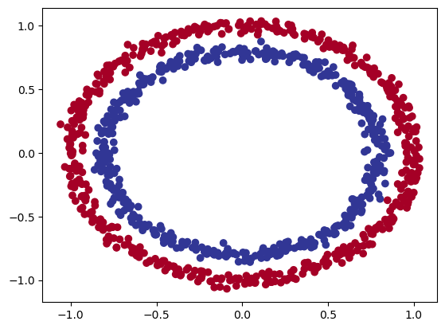
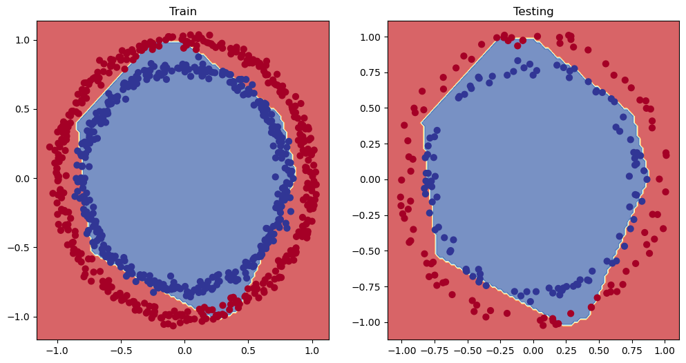
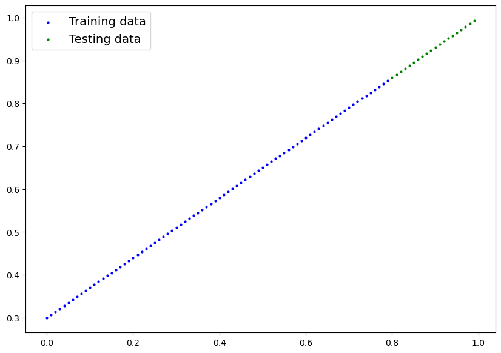
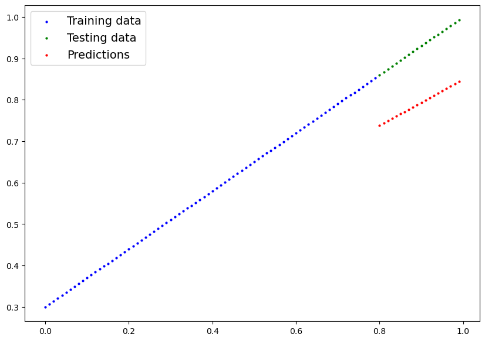
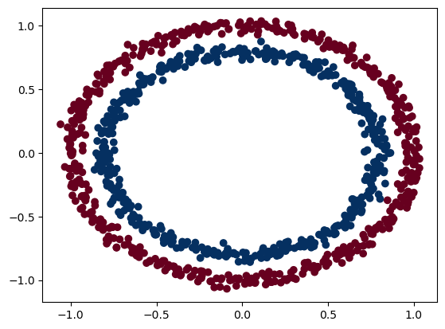
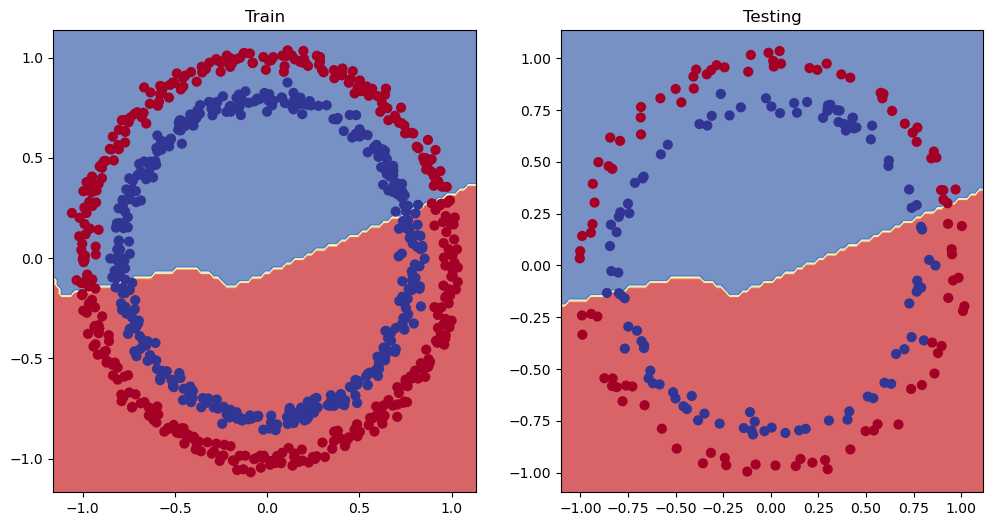
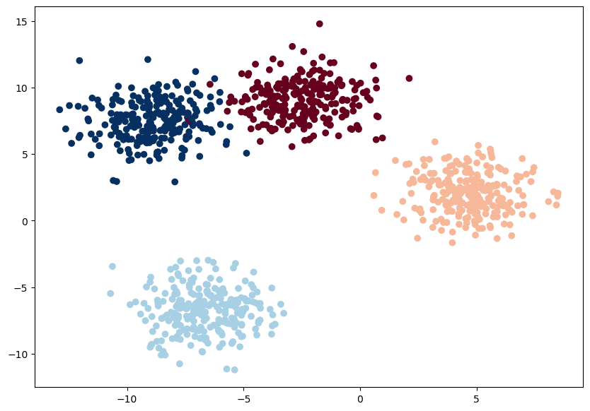
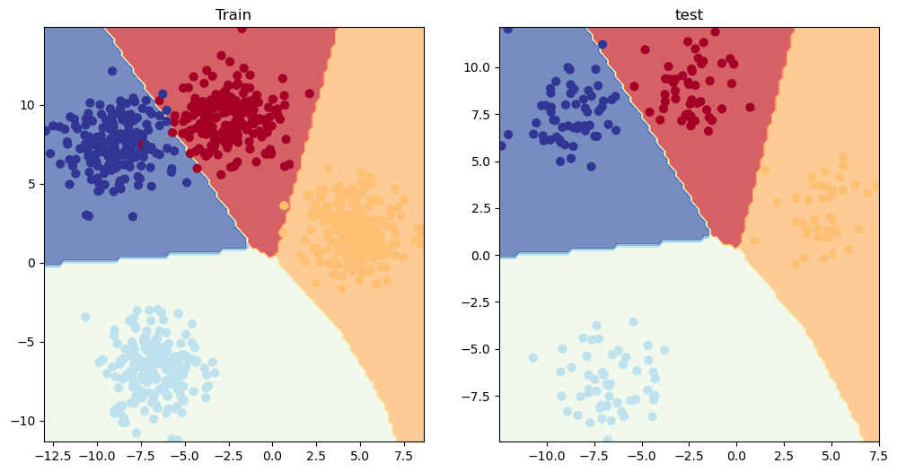

# PyTorchによるニューラルネットワーク分類

## 概要

本記事では、PyTorchを使用してニューラルネットワークによる分類タスクを実装する方法を学びます。二値分類から多クラス分類まで、実践的なコード例と可視化を通じて、分類問題を解決するための基礎知識と実装スキルを身につけることができます。

## 前提知識

- Pythonの基本的な文法
- NumPyとPandasの基礎知識
- 機械学習の基本概念（教師あり学習、分類タスク）
- PyTorchの基本的な使い方（テンソル操作、勾配計算）

## 実装内容

### 0. 分類ニューラルネットワークのアーキテクチャ

分類タスクにおけるニューラルネットワークの基本的な構成要素を理解しましょう。

|ハイパーパラメータ |二値分類|多クラス分類|
|-|-|-|
|入力層の形状 (in_features)|特徴量の数と同じ（例：心臓病予測での年齢、性別、身長、体重、喫煙状況なら5）|二値分類と同じ|
|隠れ層|問題に依存、最小 = 1、最大 = 無制限|二値分類と同じ|
|隠れ層のニューロン数|問題に依存、一般的に10～512|二値分類と同じ|
|出力層の形状 (out_features)|1（どちらかのクラス）|クラス数（例：食べ物、人、犬の写真なら3）|
|隠れ層の活性化関数|通常ReLU（他の選択肢も多数）|二値分類と同じ|
|出力層の活性化関数|Sigmoid (torch.sigmoid)|Softmax (torch.softmax)|
|損失関数|バイナリクロスエントロピー (torch.nn.BCELoss)|クロスエントロピー (torch.nn.CrossEntropyLoss)|
|最適化アルゴリズム|SGD、Adam（torch.optimに他の選択肢あり）|二値分類と同じ|

### 1. 分類用データの作成と準備

まずは、二値分類の問題を解くために、円形のデータセットを作成します。このデータセットは、2つのクラス（内側の円と外側の円）に分かれた点で構成されています。

```python
import sklearn
from sklearn.datasets import make_circles

# 1000個のサンプルを作成
n_samples = 1000

# 円形データの生成
X, y = make_circles(n_samples = n_samples,
                    noise = 0.03,      # ノイズを追加してより現実的に
                    random_state=42)   # 再現性のため乱数シードを固定
print(type(X))
print(f"最初の5つのX特徴量:\n{X[:5]}")
print(f"\n最初の5つのyラベル:\n{y[:5]}")
```

**出力：**
```
<class 'numpy.ndarray'>
最初の5つのX特徴量:
[[ 0.75424625  0.23148074]
 [-0.75615888  0.15325888]
 [-0.81539193  0.17328203]
 [-0.39373073  0.69288277]
 [ 0.44220765 -0.89672343]]

最初の5つのyラベル:
[1 1 1 1 0]
```

次に、データをPandasのDataFrameに変換して可視化します：

```python
# 円形データのDataFrameを作成
import pandas as pd
circles = pd.DataFrame({"X1":X[:,0],
                        "X2":X[:,1],
                        "label":y})
print(circles.head(10))

# データの可視化
import matplotlib.pyplot as plt

plt.scatter(x=X[:,0],
            y=X[:,1],
            c=y,
            cmap=plt.cm.RdYlBu)
```

**出力：**
```
         X1        X2  label
0  0.754246  0.231481      1
1 -0.756159  0.153259      1
2 -0.815392  0.173282      1
3 -0.393731  0.692883      1
4  0.442208 -0.896723      0
5 -0.479646  0.676435      1
6 -0.013648  0.803349      1
7  0.771513  0.147760      1
8 -0.169322 -0.793456      1
9 -0.121486  1.021509      0
```



この可視化から、データが2つの同心円状に分布していることがわかります。青い点（ラベル0）が内側の円を、赤い点（ラベル1）が外側の円を形成しています。

### 1.1 入力と出力の形状を確認

モデルを構築する前に、データの形状を理解することが重要です：

```python
print(X.shape, y.shape)
print(type(X))

# 1つのサンプルの特徴量とラベルを確認
X_sample = X[0]
y_sample = y[0]
print(f"1つのサンプルのX値: {X_sample} と対応するy値: {y_sample}")
print(f"1つのサンプルのX形状: {X_sample.shape} と対応するy形状: {y_sample.shape}")
```

**出力：**
```
(1000, 2) (1000,)
<class 'numpy.ndarray'>
1つのサンプルのX値: [0.75424625 0.23148074] と対応するy値: 1
1つのサンプルのX形状: (2,) と対応するy形状: ()
```

### 1.2 データをテンソルに変換し、訓練・テストセットに分割

PyTorchで扱うために、NumPy配列をテンソルに変換します：

```python
# データをテンソルに変換
import torch

X = torch.from_numpy(X).type(torch.float)
y = torch.from_numpy(y).type(torch.float)

print(X[0],y[0])

# データを訓練セットとテストセットに分割
from sklearn.model_selection import train_test_split

X_train, X_test, y_train, y_test = train_test_split(X,y,test_size=0.2)
print(X_test.shape, y_test.shape)
print(X_train[:5], y_train[:5])
len(X_train),len(X_test),len(y_train),len(y_test)
```

**出力：**
```
tensor([0.7542, 0.2315]) tensor(1.)
torch.Size([200, 2]) torch.Size([200])
tensor([[-0.5945,  0.5481],
        [-0.4160,  0.7137],
        [-0.7646, -0.2763],
        [ 0.6387,  0.5345],
        [ 0.8572, -0.5925]]) tensor([1., 1., 1., 1., 0.])
(800, 200, 800, 200)
```

## 2. モデルの構築

データの準備ができたので、次はモデルを構築します。以下の手順で進めます：

1. デバイスに依存しないコードを設定（CPUまたはGPUで実行可能）
2. nn.Moduleを継承したモデルクラスの定義
3. 損失関数とオプティマイザの定義
4. トレーニングループの作成

```python
from torch import nn

# デバイスの設定（M1/M2 MacではMPS、それ以外はCPU）
device = "mps" if torch.mps.is_available() else "cpu"
```

次に、以下の特徴を持つモデルクラスを作成します：

1. nn.Moduleをサブクラス化（PyTorchのほぼすべてのモデルはnn.Moduleのサブクラス）
2. コンストラクタで2つのnn.Linear層を作成（入力と出力の形状に対応）
3. forward()メソッドで順伝播計算を定義
4. モデルクラスをインスタンス化し、ターゲットデバイスに送信

```python
# 1. nn.Moduleを継承したモデルクラスを構築
class CircleModelV0(nn.Module):
    def __init__(self):
        super().__init__()
        # 2. データの形状を扱える2つのnn.Linear層を作成
        # 2つの特徴量を入力、5つの特徴量を出力
        self.layer_1 = nn.Linear(in_features=2, out_features=5)
        # 5つの特徴量を入力、1つの特徴量（y）を出力
        self.layer_2 = nn.Linear(in_features=5, out_features=1)
        
    # 3. 順伝播を定義するforward()メソッド
    def forward(self, x):
        return self.layer_2(self.layer_1(x))

# 4. モデルクラスのインスタンスを作成し、ターゲットデバイスに送信
model_0 = CircleModelV0().to(device=device)
next(model_0.parameters()).device
```

**出力：**
```
device(type='mps', index=0)
```

より簡潔に、nn.Sequential()を使用して同じモデルを作成することもできます：

```python
# nn.Sequential()を使用して上記のモデルを複製
model_0 = nn.Sequential(
    nn.Linear(in_features=2, out_features=5),
    nn.ReLU(),
    nn.Linear(in_features=5, out_features=1)
).to(device=device)
model_0.state_dict()
```

**出力：**
```
OrderedDict([('0.weight',
              tensor([[ 0.2976,  0.6313],
                      [ 0.4087, -0.3091],
                      [ 0.4082,  0.1265],
                      [ 0.3591, -0.4310],
                      [-0.7000, -0.2732]], device='mps:0')),
             ('0.bias',
              tensor([-0.5424,  0.5802,  0.2037,  0.2929,  0.2236], device='mps:0')),
             ('2.weight',
              tensor([[-0.0078,  0.3500, -0.3178,  0.0282, -0.3052]], device='mps:0')),
             ('2.bias', tensor([0.1379], device='mps:0'))])
```

訓練前のモデルで予測を行ってみましょう：

```python
# 予測を行う
with torch.inference_mode():
    untrained_preds = model_0(X_test.to(device))
print(f"予測の長さ: {len(untrained_preds)}, 形状: {untrained_preds.shape}")
print(f"テストサンプルの長さ: {len(X_test)}, 形状: {X_test.shape}")
print(f"最初の10個の予測: {untrained_preds[:10]}")
print(f"最初の10個のラベル: {y_test[:10]}")
```

**出力：**
```
予測の長さ: 200, 形状: torch.Size([200, 1])
テストサンプルの長さ: 200, 形状: torch.Size([200, 2])
最初の10個の予測: tensor([[ 0.3639],
        [ 0.1690],
        [ 0.4165],
        [ 0.2865],
        [ 0.1603],
        [ 0.0203],
        [ 0.0058],
        [-0.0157],
        [-0.0180],
        [ 0.1476]], device='mps:0')
最初の10個のラベル: tensor([1., 1., 0., 1., 1., 1., 0., 1., 1., 0.])
```

### 2.1 損失関数とオプティマイザの設定

問題の種類によって、適切な損失関数を選択する必要があります：

|損失関数/オプティマイザ|問題タイプ|PyTorchコード|
|-|-|-|
|確率的勾配降下法 (SGD)|分類、回帰、その他多数|torch.optim.SGD()|
|Adamオプティマイザ|分類、回帰、その他多数|torch.optim.Adam()|
|バイナリクロスエントロピー損失|二値分類|torch.nn.BCELossWithLogits or torch.nn.BCELoss|
|クロスエントロピー損失|多クラス分類|torch.nn.CrossEntropyLoss|
|平均絶対誤差 (MAE/L1損失)|回帰|torch.nn.L1Loss|
|平均二乗誤差 (MSE/L2損失)|回帰|torch.nn.MSELoss|

PyTorchには2つのバイナリクロスエントロピー実装があります：

- `torch.nn.BCELoss()` - ターゲット（ラベル）と入力（特徴量）間のバイナリクロスエントロピーを測定
- `torch.nn.BCEWithLogitsLoss()` - 上記と同じだが、シグモイド層が組み込まれている

`torch.nn.BCEWithLogitsLoss()`の方が数値的に安定しているため、一般的にこちらを使用します：

```python
# 損失関数を作成
loss_fn = nn.BCEWithLogitsLoss()

# オプティマイザを作成（学習率0.1のSGD）
optimizer = torch.optim.SGD(params=model_0.parameters(),
                            lr=0.1)

# 精度を計算する関数
def accuracy_fn(y_true, y_pred):
    correct = torch.eq(y_true, y_pred).sum().item()
    acc = (correct/len(y_pred)) * 100
    return acc
```

## 3. モデルの訓練

**PyTorchの訓練ループのステップ**

1. **順伝播** - モデルが訓練データを一度通過し、forward()関数の計算を実行
2. **損失の計算** - モデルの出力（予測）を正解ラベルと比較し、どれだけ間違っているかを評価
3. **勾配をゼロにリセット** - オプティマイザの勾配をゼロに設定（デフォルトでは累積されるため）
4. **逆伝播の実行** - 更新される各モデルパラメータに対する損失の勾配を計算
5. **オプティマイザのステップ** - 損失勾配に基づいてパラメータを更新

### 3.1 生のモデル出力から予測ラベルへの変換（ロジット → 予測確率 → 予測ラベル）

まず、モデルの出力がどのようなものか確認しましょう：

```python
# テストデータに対する順伝播の最初の5つの出力を表示
y_logits = model_0(X_test.to(device))[:5]
y_logits
```

**出力：**
```
tensor([[0.3639],
        [0.1690],
        [0.4165],
        [0.2865],
        [0.1603]], device='mps:0', grad_fn=<SliceBackward0>)
```

これらの値（ロジット）を確率に変換するには、シグモイド関数を使用します：

```python
# モデルのロジットにシグモイド関数を適用
y_pred_probs = torch.sigmoid(y_logits)
print(y_test[:5], torch.round(y_pred_probs))

# 予測ラベルを見つける（0.5を閾値として丸める）
y_preds = torch.round(y_pred_probs)

# 完全な処理
y_pred_labels = torch.round(torch.sigmoid(model_0(X_test.to(device))[:5]))

# 等価性を確認
print(torch.eq(y_preds.squeeze(), y_pred_labels.squeeze()))

# 余分な次元を削除
y_preds.squeeze()
```

**出力：**
```
tensor([1., 1., 0., 1., 1.]) tensor([[1.],
        [1.],
        [1.],
        [1.],
        [1.]], device='mps:0', grad_fn=<RoundBackward0>)
tensor([True, True, True, True, True], device='mps:0')
tensor([1., 1., 1., 1., 1.], device='mps:0', grad_fn=<SqueezeBackward0>)
```

### 3.2 トレーニングとテストのループを構築

それでは、完全な訓練ループを実装しましょう：

```python
torch.mps.manual_seed(42)

# エポック数の設定
epochs = 1000

# データをターゲットデバイスに配置
X_train, X_test = X_train.to(device), X_test.to(device)
y_train, y_test = y_train.to(device), y_test.to(device)

# 訓練と評価のループを構築
for epoch in range(epochs):
    # 訓練モード
    model_0.train()
    
    # 1. 順伝播
    y_logits = model_0(X_train).squeeze()
    y_preds = torch.round(torch.sigmoid(y_logits))
    
    # 2. 損失と精度の計算
    loss = loss_fn(y_logits, y_train)
    acc = accuracy_fn(y_true=y_train,
                      y_pred=y_preds)
    
    # 3. オプティマイザの勾配をゼロに
    optimizer.zero_grad()
    
    # 4. 逆伝播
    loss.backward()
    
    # 5. オプティマイザのステップ
    optimizer.step()

    # 評価モード
    model_0.eval()
    with torch.inference_mode():
        test_logits = model_0(X_test).squeeze()
        test_preds = torch.round(torch.sigmoid(test_logits))
        test_loss = loss_fn(test_logits, y_test)
        test_acc = accuracy_fn(y_true=y_test,
                               y_pred=test_preds)
    
    # 進捗を出力
    if epoch % 100 == 0:
        print(f"エポック: {epoch} | 損失: {loss:.5f}, 精度: {acc:.2f}% | テスト損失: {test_loss:.5f}, テスト精度: {test_acc:.2f}%")
```

**出力：**
```
エポック: 0 | 損失: 0.69555, 精度: 56.62% | テスト損失: 0.68961, テスト精度: 54.00%
エポック: 100 | 損失: 0.68488, 精度: 57.00% | テスト損失: 0.68687, テスト精度: 53.00%
エポック: 200 | 損失: 0.68111, 精度: 57.50% | テスト損失: 0.68388, テスト精度: 54.50%
エポック: 300 | 損失: 0.67678, 精度: 58.13% | テスト損失: 0.68012, テスト精度: 53.50%
エポック: 400 | 損失: 0.67158, 精度: 59.25% | テスト損失: 0.67569, テスト精度: 54.50%
エポック: 500 | 損失: 0.66526, 精度: 60.25% | テスト損失: 0.66991, テスト精度: 56.00%
エポック: 600 | 損失: 0.65724, 精度: 62.12% | テスト損失: 0.66266, テスト精度: 56.00%
エポック: 700 | 損失: 0.64689, 精度: 65.25% | テスト損失: 0.65343, テスト精度: 58.50%
エポック: 800 | 損失: 0.63465, 精度: 72.38% | テスト損失: 0.64152, テスト精度: 66.00%
エポック: 900 | 損失: 0.62025, 精度: 82.38% | テスト損失: 0.62660, テスト精度: 75.50%
```

## 4. 予測を行い、モデルを評価する

訓練されたモデルの決定境界を可視化してみましょう：

```python
from helper_functions import plot_predictions, plot_decision_boundary

# モデルの決定境界をプロット
plt.figure(figsize=(12, 6))
plt.subplot(1, 2, 1)
plt.title("訓練データ")
plot_decision_boundary(model_0, X_train, y_train)
plt.subplot(1, 2, 2)
plt.title("テストデータ")
plot_decision_boundary(model_0, X_test, y_test)
```



この可視化から、モデルが線形の決定境界しか学習できていないことがわかります。円形のデータに対して直線で分離しようとしているため、性能が低いのです。

## 5. モデルの改善（モデルの観点から）

モデルのアンダーフィットの問題を修正する方法はいくつかあります：

|改善手法|効果|
|-|-|
|レイヤーを追加|各レイヤーがデータ内の新しいパターンを学習できるようになる|
|隠れユニットを増やす|レイヤーあたりの隠れユニットが多いほど、学習能力が向上|
|より長く訓練する|モデルがデータを見る機会が増え、より多くを学習する可能性がある|
|活性化関数を変更する|非線形活性化関数を使用することで、直線以外のパターンも学習可能に|
|学習率を変更する|パラメータの更新幅を調整し、最適な学習速度を見つける|
|損失関数を変更する|問題に適した損失関数を選択する|
|転移学習を使用する|事前学習済みモデルを活用する|

まず、レイヤーと隠れユニットを増やしてみましょう：

```python
class CircleModelV1(nn.Module):
    def __init__(self, *args, **kwargs):
        super().__init__(*args, **kwargs)
        self.layer_1 = nn.Linear(in_features=2, out_features=10)
        self.layer_2 = nn.Linear(in_features=10, out_features=10)
        self.layer_3 = nn.Linear(in_features=10, out_features=1)

    def forward(self, x):
        return self.layer_3(self.layer_2(self.layer_1(x)))

model_1 = CircleModelV1().to(device)
model_1
```

**出力：**
```
CircleModelV1(
  (layer_1): Linear(in_features=2, out_features=10, bias=True)
  (layer_2): Linear(in_features=10, out_features=10, bias=True)
  (layer_3): Linear(in_features=10, out_features=1, bias=True)
)
```

このモデルを訓練します：

```python
loss_fn = nn.BCEWithLogitsLoss()
optimizer = torch.optim.SGD(model_1.parameters(), 0.1)
torch.manual_seed(42)
torch.mps.manual_seed(42)

# エポック数の設定
epochs = 1000

# データをターゲットデバイスに配置
X_train, X_test = X_train.to(device), X_test.to(device)
y_train, y_test = y_train.to(device), y_test.to(device)

# 訓練と評価のループを構築
for epoch in range(epochs):
    # 訓練
    model_1.train()
    # 1. 順伝播
    y_logits = model_1(X_train).squeeze()
    y_preds = torch.round(torch.sigmoid(y_logits))
    # 2. 損失/精度の計算
    loss = loss_fn(y_logits, y_train)
    acc = accuracy_fn(y_true=y_train,
                      y_pred=y_preds)
    # 3. オプティマイザの勾配をゼロに
    optimizer.zero_grad()
    # 4. 逆伝播
    loss.backward()
    # 5. オプティマイザのステップ
    optimizer.step()

    # テスト
    model_1.eval()
    with torch.inference_mode():
        test_logits = model_1(X_test).squeeze()
        test_preds = torch.round(torch.sigmoid(test_logits))
        test_loss = loss_fn(test_logits, y_test)
        test_acc = accuracy_fn(y_true=y_test,
                               y_pred=test_preds)
    
    # 出力
    if epoch % 100 == 0:
        print(f"エポック: {epoch} | 損失: {loss:.5f}, 精度: {acc:.2f}% | テスト損失: {test_loss:.5f}, テスト精度: {test_acc:.2f}%")
```

**出力：**
```
エポック: 0 | 損失: 0.71811, 精度: 50.50% | テスト損失: 0.72682, テスト精度: 48.00%
エポック: 100 | 損失: 0.69348, 精度: 49.50% | テスト損失: 0.69462, テスト精度: 45.50%
エポック: 200 | 損失: 0.69311, 精度: 47.62% | テスト損失: 0.69401, テスト精度: 44.50%
エポック: 300 | 損失: 0.69307, 精度: 43.12% | テスト損失: 0.69389, テスト精度: 43.00%
エポック: 400 | 損失: 0.69307, 精度: 41.25% | テスト損失: 0.69385, テスト精度: 40.50%
エポック: 500 | 損失: 0.69307, 精度: 41.62% | テスト損失: 0.69384, テスト精度: 40.50%
エポック: 600 | 損失: 0.69307, 精度: 41.62% | テスト損失: 0.69383, テスト精度: 40.50%
エポック: 700 | 損失: 0.69307, 精度: 41.88% | テスト損失: 0.69383, テスト精度: 40.50%
エポック: 800 | 損失: 0.69307, 精度: 41.88% | テスト損失: 0.69383, テスト精度: 40.00%
エポック: 900 | 損失: 0.69307, 精度: 41.88% | テスト損失: 0.69383, テスト精度: 40.00%
```

レイヤーと隠れユニットを増やしても、性能は改善されませんでした。これは、モデルがまだ線形の決定境界しか学習できないためです。

### 5.1 モデルが直線をモデル化できるかの確認

モデルが本当に学習できるのか確認するため、線形データで試してみましょう：

```python
# データを作成（ノートブック01と同じ）
weight = 0.7
bias = 0.3
start = 0
end = 1
step = 0.01

# データを作成
X_regression = torch.arange(start, end, step).unsqueeze(dim=1)
y_regression = weight * X_regression + bias # 線形回帰の式

# データを確認
print(len(X_regression))
X_regression[:5], y_regression[:5]
```

**出力：**
```
100
(tensor([[0.0000],
         [0.0100],
         [0.0200],
         [0.0300],
         [0.0400]]),
 tensor([[0.3000],
         [0.3070],
         [0.3140],
         [0.3210],
         [0.3280]]))
```

訓練とテストセットに分割：

```python
# 訓練とテストセットを作成
train_split = int(0.8 * len(X_regression)) # データの80%を訓練用に使用
X_train_regression, y_train_regression = X_regression[:train_split], y_regression[:train_split]
X_test_regression, y_test_regression = X_regression[train_split:], y_regression[train_split:]

# 各分割の長さを確認
print(len(X_train_regression), 
    len(y_train_regression), 
    len(X_test_regression), 
    len(y_test_regression))
```

**出力：**
```
80 80 20 20
```

データを可視化：

```python
plot_predictions(train_data=X_train_regression,
    train_labels=y_train_regression,
    test_data=X_test_regression,
    test_labels=y_test_regression
)
```



線形データ用のモデルを作成：

```python
# model_1と同じアーキテクチャ（ただしnn.Sequentialを使用）
model_2 = nn.Sequential(
    nn.Linear(in_features=1, out_features=10),
    nn.Linear(in_features=10, out_features=10),
    nn.Linear(in_features=10, out_features=1)
).to(device)

model_2
```

**出力：**
```
Sequential(
  (0): Linear(in_features=1, out_features=10, bias=True)
  (1): Linear(in_features=10, out_features=10, bias=True)
  (2): Linear(in_features=10, out_features=1, bias=True)
)
```

回帰問題なので、損失関数を変更：

```python
# 損失関数とオプティマイザ
loss_fn = nn.L1Loss()
optimizer = torch.optim.SGD(model_2.parameters(), lr=0.1)
```

モデルを訓練：

```python
# モデルを訓練
torch.manual_seed(42)

# エポック数を設定
epochs = 1000

# データをターゲットデバイスに配置
X_train_regression, y_train_regression = X_train_regression.to(device), y_train_regression.to(device)
X_test_regression, y_test_regression = X_test_regression.to(device), y_test_regression.to(device)

for epoch in range(epochs):
    ### 訓練 
    # 1. 順伝播
    y_pred = model_2(X_train_regression)
    
    # 2. 損失を計算（回帰問題なので精度は計算しない）
    loss = loss_fn(y_pred, y_train_regression)

    # 3. オプティマイザの勾配をゼロに
    optimizer.zero_grad()

    # 4. 逆伝播
    loss.backward()

    # 5. オプティマイザのステップ
    optimizer.step()

    ### テスト
    model_2.eval()
    with torch.inference_mode():
      # 1. 順伝播
      test_pred = model_2(X_test_regression)
      # 2. 損失を計算 
      test_loss = loss_fn(test_pred, y_test_regression)

    # 進捗を出力
    if epoch % 100 == 0: 
        print(f"エポック: {epoch} | 訓練損失: {loss:.5f}, テスト損失: {test_loss:.5f}")
```

**出力：**
```
エポック: 0 | 訓練損失: 0.75986, テスト損失: 0.54143
エポック: 100 | 訓練損失: 0.09309, テスト損失: 0.02901
エポック: 200 | 訓練損失: 0.07376, テスト損失: 0.02850
エポック: 300 | 訓練損失: 0.06745, テスト損失: 0.00615
エポック: 400 | 訓練損失: 0.06107, テスト損失: 0.02004
エポック: 500 | 訓練損失: 0.05698, テスト損失: 0.01061
エポック: 600 | 訓練損失: 0.04857, テスト損失: 0.01326
エポック: 700 | 訓練損失: 0.06109, テスト損失: 0.02127
エポック: 800 | 訓練損失: 0.05599, テスト損失: 0.01426
エポック: 900 | 訓練損失: 0.05571, テスト損失: 0.00603
```

予測結果を可視化：

```python
# 評価モードに切り替え
model_2.eval()

# 予測を実行（推論）
with torch.inference_mode():
    y_preds = model_2(X_test_regression)

# データと予測をプロット（matplotlibはGPU上のデータを扱えないため、CPUに移動）
plot_predictions(train_data=X_train_regression.cpu(),
                 train_labels=y_train_regression.cpu(),
                 test_data=X_test_regression.cpu(),
                 test_labels=y_test_regression.cpu(),
                 predictions=y_preds.cpu())
```



モデルは線形データを学習できることが確認できました。つまり、円形データの問題は、モデルが線形の決定境界しか学習できないことにあります。

## 6. 欠けている部分：非線形性

モデルが直線（線形）を描画できることはわかりましたが、円形データを分類するには非線形の決定境界が必要です。

### 6.1 非線形データ（赤と青の円）の再作成

データを再作成して、新しいアプローチを試しましょう：

```python
# データを作成してプロット
import matplotlib.pyplot as plt
from sklearn.datasets import make_circles

n_sample = 1000
X, y = make_circles(n_samples=1000,
                    noise=0.03,
                    random_state=42)

plt.scatter(X[:,0], X[:,1], c=y, cmap=plt.cm.RdBu)
```



```python
import torch
from sklearn.model_selection import train_test_split

X = torch.from_numpy(X).type(torch.float)
y = torch.from_numpy(y).type(torch.float)

# 訓練とテストセットに分割
X_train, X_test, y_train, y_test = train_test_split(X, 
                                                    y, 
                                                    test_size=0.2,
                                                    random_state=42
)
X_train[:5], y_train[:5]
```

**出力：**
```
(tensor([[ 0.6579, -0.4651],
         [ 0.6319, -0.7347],
         [-1.0086, -0.1240],
         [-0.9666, -0.2256],
         [-0.1666,  0.7994]]),
 tensor([1., 0., 0., 0., 1.]))
```

### 6.2 非線形性を持つモデルの構築

PyTorchには多くの非線形活性化関数がありますが、最も一般的で高性能なものの1つがReLU（Rectified Linear Unit、整流線形ユニット）です：

```python
from torch import nn
class CircleModelV2(nn.Module):
    def __init__(self, *args, **kwargs):
        super().__init__(*args, **kwargs)
        self.layer_1 = nn.Linear(in_features=2, out_features=10)
        self.layer_2 = nn.Linear(in_features=10, out_features=10)
        self.relu = nn.ReLU()  # 非線形活性化関数
        self.layer_3 = nn.Linear(in_features=10, out_features=1)

    def forward(self, x):
        # ReLU活性化関数を層の間に適用
        return self.layer_3(self.relu(self.layer_2(self.relu(self.layer_1(x)))))

model_3 = CircleModelV2().to(device)
model_3
```

**出力：**
```
CircleModelV2(
  (layer_1): Linear(in_features=2, out_features=10, bias=True)
  (layer_2): Linear(in_features=10, out_features=10, bias=True)
  (relu): ReLU()
  (layer_3): Linear(in_features=10, out_features=1, bias=True)
)
```

### 6.3 非線形活性化関数を使用したモデルの訓練

```python
# 損失関数とオプティマイザを設定
loss_fn = nn.BCEWithLogitsLoss()
optimizer = torch.optim.SGD(model_3.parameters(), 0.1)
```

```python
# モデルを訓練
torch.manual_seed(42)
torch.mps.manual_seed(42)
epochs = 1000

X_train, y_train = X_train.to(device), y_train.to(device)
X_test, y_test = X_test.to(device), y_test.to(device)

for epoch in range(epochs):
    model_3.train()
    y_logits = model_3(X_train).squeeze()
    y_preds = torch.round(torch.sigmoid(y_logits))

    loss = loss_fn(y_logits, y_train)
    acc = accuracy_fn(y_true=y_train,
                      y_pred=y_preds)
    
    optimizer.zero_grad()
    loss.backward()
    optimizer.step()

    model_3.eval()
    with torch.inference_mode():
        test_logits = model_3(X_test).squeeze()
        test_preds = torch.round(torch.sigmoid(test_logits))
        test_loss = loss_fn(test_logits, y_test)
        test_acc = accuracy_fn(y_true=y_test,
                          y_pred=test_preds)
        if epoch % 100 == 0:
            print(f"エポック: {epoch} | 損失: {loss:.5f}, 精度: {acc:.2f}% | テスト損失: {test_loss:.5f}, テスト精度: {test_acc:.2f}%")
```

**出力：**
```
エポック: 0 | 損失: 0.69293, 精度: 50.00% | テスト損失: 0.69323, テスト精度: 50.00%
エポック: 100 | 損失: 0.69276, 精度: 52.75% | テスト損失: 0.69285, テスト精度: 47.50%
エポック: 200 | 損失: 0.69257, 精度: 53.12% | テスト損失: 0.69269, テスト精度: 48.00%
エポック: 300 | 損失: 0.69238, 精度: 52.50% | テスト損失: 0.69251, テスト精度: 47.00%
エポック: 400 | 損失: 0.69219, 精度: 53.00% | テスト損失: 0.69234, テスト精度: 47.00%
エポック: 500 | 損失: 0.69200, 精度: 53.00% | テスト損失: 0.69216, テスト精度: 47.00%
エポック: 600 | 損失: 0.69182, 精度: 52.75% | テスト損失: 0.69198, テスト精度: 46.50%
エポック: 700 | 損失: 0.69163, 精度: 52.75% | テスト損失: 0.69181, テスト精度: 46.50%
エポック: 800 | 損失: 0.69144, 精度: 52.75% | テスト損失: 0.69163, テスト精度: 46.50%
エポック: 900 | 損失: 0.69126, 精度: 52.50% | テスト損失: 0.69145, テスト精度: 46.00%
```

### 6.4 非線形活性化関数で学習したモデルの評価

訓練されたモデルの予測を確認してみましょう：

```python
X_train, y_train = X_train.to(device), y_train.to(device)
X_test, y_test = X_test.to(device), y_test.to(device)
model_3.eval()
with torch.inference_mode():
    y_logits = model_3(X_test).squeeze()
    y_sigmoid = torch.sigmoid(y_logits)
    y_preds = torch.round(y_sigmoid).squeeze()

print("ロジット:", y_logits[:10])
print("シグモイド後:", y_sigmoid[:10])
print("予測:", y_preds[:10])
print("正解:", y_test[:10])
```

**出力：**
```
ロジット: tensor([ 0.0579,  0.0834, -0.0096,  0.0914, -0.0713, -0.0642,  0.0245, -0.0113,
        -0.0082,  0.0840], device='mps:0')
シグモイド後: tensor([0.5145, 0.5208, 0.4976, 0.5228, 0.4822, 0.4840, 0.5061, 0.4972, 0.4979,
        0.5210], device='mps:0')
予測: tensor([1., 1., 0., 1., 0., 0., 1., 0., 0., 1.], device='mps:0')
正解: tensor([1., 0., 1., 0., 1., 1., 0., 0., 1., 0.], device='mps:0')
```

決定境界を可視化：

```python
from helper_functions import plot_predictions, plot_decision_boundary

# モデルの決定境界をプロット
plt.figure(figsize=(12, 6))
plt.subplot(1, 2, 1)
plt.title("訓練データ")
plot_decision_boundary(model_3, X_train, y_train)
plt.subplot(1, 2, 2)
plt.title("テストデータ")
plot_decision_boundary(model_3, X_test, y_test)
```



ReLU活性化関数を追加しても、まだ円形データをうまく分類できていません。これは、モデルのアーキテクチャやハイパーパラメータをさらに調整する必要があることを示しています。

## 8. 多クラス分類モデルの構築

二値分類から多クラス分類に進みましょう。多クラス分類は、2つ以上のクラスから選択する問題です（例：画像を猫、犬、鶏として分類）。

### 8.1 多クラス分類用のデータセット作成

Scikit-Learnの`make_blobs()`メソッドを使用して、多クラスデータを作成します：

```python
import torch
import matplotlib.pyplot as plt
from sklearn.datasets import make_blobs
from sklearn.model_selection import train_test_split

# データ作成のハイパーパラメータを設定
NUM_CLASSES = 4
NUM_FEATURES = 2
RANDOM_SEED = 42

# 1. 多クラスデータを作成
X_blob, y_blob = make_blobs(n_samples=1000,
                            n_features=NUM_FEATURES,
                            centers=NUM_CLASSES,
                            cluster_std=1.5,  # クラスターに少し変動を加える
                            random_state=RANDOM_SEED)

# 2. データをテンソルに変換
X_blob = torch.from_numpy(X_blob).type(torch.float)
y_blob = torch.from_numpy(y_blob).type(torch.LongTensor)

# 3. 訓練とテストセットに分割
X_blob_train, X_blob_test, y_blob_train, y_blob_test = train_test_split(X_blob,
                                                                        y_blob,
                                                                        test_size=0.2,
                                                                        random_state=RANDOM_SEED)

print(X_blob_test[:5])
# データをプロット
plt.figure(figsize=(10, 7))
plt.scatter(X_blob[:, 0], X_blob[:, 1], c=y_blob, cmap=plt.cm.RdBu)
```

**出力：**
```
tensor([[ 4.6675,  4.4878],
        [-7.9969,  6.8803],
        [-6.2801, -7.8571],
        [ 3.6833,  1.1767],
        [-0.1404, 10.1654]])
```



### 8.2 多クラス分類モデルの構築

```python
import torch

device = "mps" if torch.mps.is_available() else "cpu"
```

```python
# モデルを構築
from torch import nn
class BlobModel(nn.Module):
    def __init__(self, input_features, output_features, hidden_units=8):
        """多クラス分類モデルのハイパーパラメータを初期化
        
        Args:
            input_features (int): モデルへの入力特徴量の数
            output_features (int): モデルの出力特徴量の数（クラス数）
            hidden_units (int): 層間の隠れユニット数、デフォルトは8
        """
        super().__init__()
        self.linear_layer_stack = nn.Sequential(
            nn.Linear(in_features=input_features, out_features=hidden_units),
            nn.ReLU(),
            nn.Linear(in_features=hidden_units, out_features=hidden_units),
            nn.ReLU(),
            nn.Linear(in_features=hidden_units, out_features=output_features)
        )
    def forward(self, x):
        return self.linear_layer_stack(x)

# BlobModelのインスタンスを作成し、ターゲットデバイスに送信
model_4 = BlobModel(input_features=NUM_FEATURES,
                    output_features=NUM_CLASSES,
                    hidden_units=8).to(device=device)
model_4
```

**出力：**
```
BlobModel(
  (linear_layer_stack): Sequential(
    (0): Linear(in_features=2, out_features=8, bias=True)
    (1): ReLU()
    (2): Linear(in_features=8, out_features=8, bias=True)
    (3): ReLU()
    (4): Linear(in_features=8, out_features=4, bias=True)
  )
)
```

```python
# 多クラス分類用の損失関数を作成
loss_fn = nn.CrossEntropyLoss()
# オプティマイザを作成
optimizer = torch.optim.SGD(params=model_4.parameters(),
                            lr=0.1)
```

### 8.4 多クラス分類モデルの予測確率の取得

```python
model_4.eval()
with torch.inference_mode():
    y_logits = model_4(X_blob_test.to(device))[:5]

print("ロジット:", y_logits)
print("正解ラベル:", y_blob_test[:5])
```

**出力：**
```
ロジット: tensor([[-0.7646, -0.7412, -1.5777, -1.1376],
        [-0.0973, -0.9431, -0.5963, -0.1371],
        [ 0.2528, -0.2379,  0.1882, -0.0066],
        [-0.4134, -0.5204, -0.9303, -0.6963],
        [-0.3118, -1.3736, -1.1991, -0.3834]], device='mps:0')
正解ラベル: tensor([1, 3, 2, 1, 0])
```

多クラス分類では、ソフトマックス関数を使用してロジットを確率に変換します：

```python
y_pred_probs = torch.softmax(y_logits, dim=1)
print("ロジット:", y_logits[:5])
print("確率:", y_pred_probs[:5])
```

**出力：**
```
ロジット: tensor([[-0.7646, -0.7412, -1.5777, -1.1376],
        [-0.0973, -0.9431, -0.5963, -0.1371],
        [ 0.2528, -0.2379,  0.1882, -0.0066],
        [-0.4134, -0.5204, -0.9303, -0.6963],
        [-0.3118, -1.3736, -1.1991, -0.3834]], device='mps:0')
確率: tensor([[0.3169, 0.3244, 0.1405, 0.2182],
        [0.3336, 0.1432, 0.2026, 0.3206],
        [0.3011, 0.1843, 0.2823, 0.2323],
        [0.3078, 0.2766, 0.1836, 0.2320],
        [0.3719, 0.1286, 0.1532, 0.3463]], device='mps:0')
```

ソフトマックス関数の出力を確認：

```python
# 最初のサンプルのソフトマックス出力の合計
print("確率:", y_pred_probs[0])
print("合計:", torch.sum(y_pred_probs[0]))
print("最大値:", torch.max(y_pred_probs[0]))
print("最大値のインデックス（予測クラス）:", torch.argmax(y_pred_probs[0]))
```

**出力：**
```
確率: tensor([0.3169, 0.3244, 0.1405, 0.2182], device='mps:0')
合計: tensor(1., device='mps:0')
最大値: tensor(0.3244, device='mps:0')
最大値のインデックス（予測クラス）: tensor(1, device='mps:0')
```

### 8.5 多クラス分類モデルの訓練とテストループの作成

```python
torch.manual_seed(42)
torch.mps.manual_seed(42)

# 多クラス分類用の損失関数を作成
loss_fn = nn.CrossEntropyLoss()
# オプティマイザを作成
optimizer = torch.optim.SGD(params=model_4.parameters(),
                            lr=0.1)

# エポック数を設定
epochs = 100

# データをターゲットデバイスに配置
X_blob_train, y_blob_train = X_blob_train.to(device), y_blob_train.to(device)
X_blob_test, y_blob_test = X_blob_test.to(device), y_blob_test.to(device)

for epoch in range(epochs):
    model_4.train()

    y_logits = model_4(X_blob_train)
    y_pred = torch.softmax(y_logits, dim=1).argmax(dim=1)

    loss = loss_fn(y_logits, y_blob_train)
    acc = accuracy_fn(y_true=y_blob_train,
                      y_pred=y_pred)
    optimizer.zero_grad()
    loss.backward()
    optimizer.step()

    model_4.eval()
    with torch.inference_mode():
        test_logits = model_4(X_blob_test)
        test_pred = torch.softmax(test_logits, dim=1).argmax(dim=1)

        test_loss = loss_fn(test_logits, y_blob_test)
        test_acc = accuracy_fn(y_true=y_blob_test,
                               y_pred=test_pred)
        if epoch % 10 == 0:
            print(f"エポック: {epoch} | 損失: {loss:.5f}, 精度: {acc:.2f}% | テスト損失: {test_loss:.5f}, テスト精度: {test_acc:.2f}%")
```

**出力：**
```
エポック: 0 | 損失: 1.15883, 精度: 40.38% | テスト損失: 1.09558, テスト精度: 48.00%
エポック: 10 | 損失: 0.64476, 精度: 96.75% | テスト損失: 0.66235, テスト精度: 97.50%
エポック: 20 | 損失: 0.42535, 精度: 98.50% | テスト損失: 0.43536, テスト精度: 99.50%
エポック: 30 | 損失: 0.25294, 精度: 99.12% | テスト損失: 0.25096, テスト精度: 99.50%
エポック: 40 | 損失: 0.11232, 精度: 99.25% | テスト損失: 0.10479, テスト精度: 99.50%
エポック: 50 | 損失: 0.06627, 精度: 99.25% | テスト損失: 0.05896, テスト精度: 99.50%
エポック: 60 | 損失: 0.05068, 精度: 99.25% | テスト損失: 0.04272, テスト精度: 99.50%
エポック: 70 | 損失: 0.04300, 精度: 99.25% | テスト損失: 0.03435, テスト精度: 99.50%
エポック: 80 | 損失: 0.03836, 精度: 99.25% | テスト損失: 0.02889, テスト精度: 99.50%
エポック: 90 | 損失: 0.03525, 精度: 99.25% | テスト損失: 0.02503, テスト精度: 99.50%
```

### 8.6 多クラス分類モデルの予測と評価

```python
# 予測を実行
model_4.eval()

with torch.inference_mode():
    y_logits = model_4(X_blob_test)

y_pred_probs = torch.softmax(y_logits[:10], dim=1)
print("予測確率:")
print(y_pred_probs)
print("\n予測クラス:", y_pred_probs.argmax(dim=1))
print("正解クラス:", y_blob_test[:10])
```

**出力：**
```
予測確率:
tensor([[1.3437e-03, 9.9865e-01, 1.2164e-06, 5.3854e-07],
        [4.9905e-03, 7.4740e-05, 1.0630e-03, 9.9387e-01],
        [1.3985e-03, 8.6060e-04, 9.9463e-01, 3.1073e-03],
        [4.7389e-03, 9.9483e-01, 3.1955e-04, 1.1353e-04],
        [9.9388e-01, 6.0966e-03, 2.4904e-06, 2.2377e-05],
        [1.3372e-03, 1.1504e-05, 3.0644e-04, 9.9834e-01],
        [2.9138e-03, 2.1537e-03, 9.8781e-01, 7.1181e-03],
        [9.9838e-01, 6.0198e-04, 3.4435e-05, 9.7989e-04],
        [2.8147e-04, 1.5016e-04, 9.9882e-01, 7.5044e-04],
        [9.9825e-01, 1.4575e-03, 1.5997e-05, 2.7210e-04]], device='mps:0')

予測クラス: tensor([1, 3, 2, 1, 0, 3, 2, 0, 2, 0], device='mps:0')
正解クラス: tensor([1, 3, 2, 1, 0, 3, 2, 0, 2, 0])
```

```python
plt.figure(figsize=(12, 6))
plt.subplot(1, 2, 1)
plt.title("Train")
plot_decision_boundary(model_4, X_blob_train, y_blob_train)
plt.subplot(1, 2, 2)
plt.title("test")
plot_decision_boundary(model_4, X_blob_test, y_blob_test)
```


*図5: 多クラス分類の決定境界。左：訓練データ、右：テストデータ*

## 9. 実装時の注意点とベストプラクティス

### 9.1 データ型の注意点

```python
# CrossEntropyLossを使用する際の注意点
# ラベルは長整数型（LongTensor）である必要がある
y_blob_train_long = y_blob_train.long()
y_blob_test_long = y_blob_test.long()

# BCEWithLogitsLossを使用する際は浮動小数点型
y_train_float = y_train.float()
y_test_float = y_test.float()
```

### 9.2 モデルの保存と読み込み

```python
# モデルの保存
torch.save(model_4.state_dict(), "multi_class_model.pth")

# モデルの読み込み
loaded_model = BlobModel(input_features=NUM_FEATURES,
                        output_features=NUM_CLASSES,
                        hidden_units=8)
loaded_model.load_state_dict(torch.load("multi_class_model.pth"))
loaded_model.to(device)
```

### 9.3 ハイパーパラメータチューニングのヒント

```python
# 学習率の調整例
learning_rates = [0.001, 0.01, 0.1, 1.0]
best_acc = 0
best_lr = 0

for lr in learning_rates:
    # 新しいモデルとオプティマイザを作成
    test_model = BlobModel(NUM_FEATURES, NUM_CLASSES, 8).to(device)
    test_optimizer = torch.optim.SGD(test_model.parameters(), lr=lr)
    
    # 簡単な訓練ループ（省略）
    # ...
    
    # 最良の学習率を記録
    if test_acc > best_acc:
        best_acc = test_acc
        best_lr = lr

print(f"最適な学習率: {best_lr}, 最高精度: {best_acc:.2f}%")
```

## 10. よくあるエラーとその対処法

### 10.1 形状エラー

```python
# エラー例: RuntimeError: Expected floating point type for target with class probabilities
# 原因: CrossEntropyLossでラベルがfloat型になっている
# 解決法: ラベルをlong型に変換
y_correct = y_blob_train.long()

# エラー例: RuntimeError: The size of tensor a (4) must match the size of tensor b (1)
# 原因: 出力層のニューロン数とクラス数が一致していない
# 解決法: モデル定義を確認し、output_featuresをクラス数に合わせる
```

### 10.2 学習が進まない場合

```python
# 学習率が高すぎる場合の対処
# 症状: 損失が振動する、NaNになる
# 解決法: 学習率を下げる
optimizer = torch.optim.SGD(model.parameters(), lr=0.001)  # 0.1から0.001に変更

# 勾配爆発の対処
# 症状: 損失が急激に増加する
# 解決法: 勾配クリッピングを使用
torch.nn.utils.clip_grad_norm_(model.parameters(), max_norm=1.0)
```

## まとめ

このガイドでは、PyTorchを使った分類問題の解き方を学びました。主要なポイントを振り返ってみましょう。

### 学習したポイント

1. **基本的なアーキテクチャ**: 二項分類と多クラス分類の違いとそれぞれの適切な設計
2. **データ準備**: scikit-learnを使った合成データの作成と前処理
3. **モデル構築**: `nn.Module`を継承したカスタムモデルの作成方法
4. **訓練ループ**: PyTorchの標準的な5ステップ訓練ループ
5. **活性化関数の重要性**: 非線形問題におけるReLUの効果
6. **損失関数の選択**: 問題に応じた適切な損失関数の使い分け
7. **評価方法**: 様々な評価指標による総合的な性能評価

## 参考資料

### 公式ドキュメント
- [PyTorch公式チュートリアル](https://pytorch.org/tutorials/)
- [PyTorch nn.Module API](https://pytorch.org/docs/stable/generated/torch.nn.Module.html)