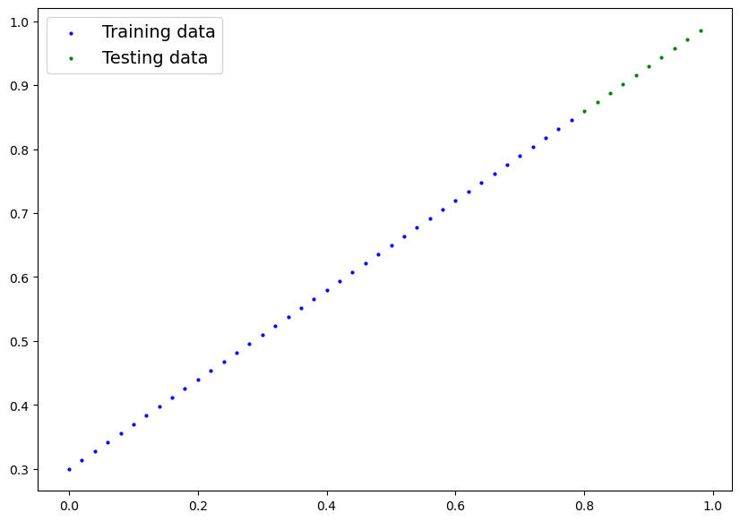
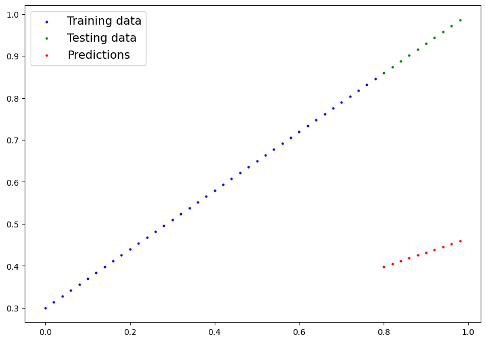
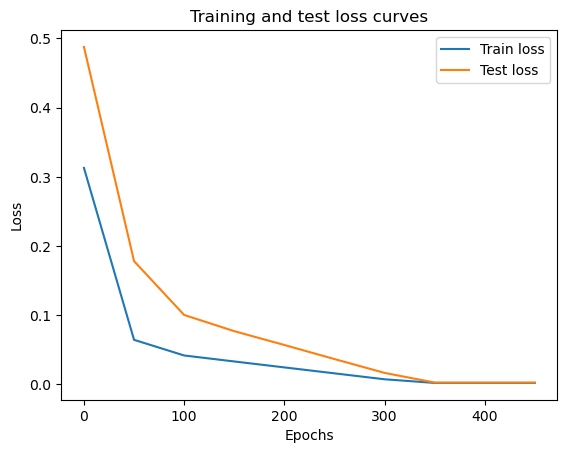
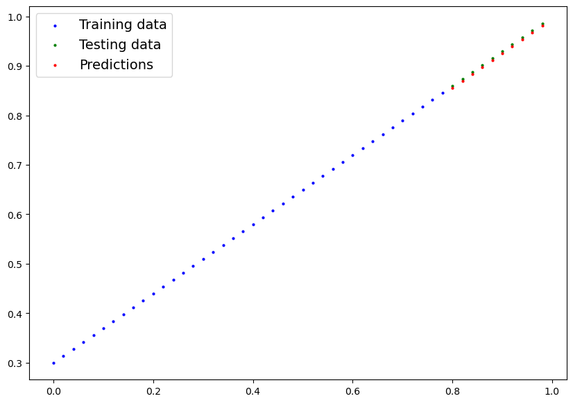
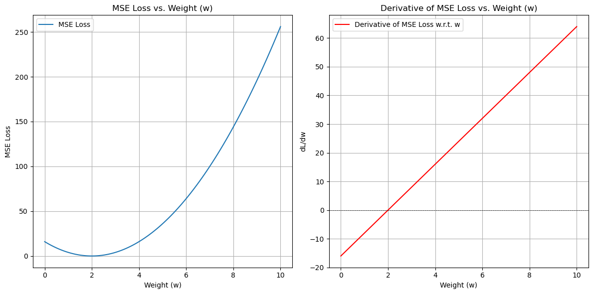

# PyTorch：線形回帰から学ぶ機械学習

## 概要

機械学習とディープラーニングの本質は、過去のデータからパターンを発見し、そのパターンを使用して未来を予測することです。本記事では、最もシンプルな線形回帰問題を通じて、PyTorchを使用した機械学習プロジェクトの完全なワークフローを学習します。

### 学習目標

- PyTorchを使用した機械学習プロジェクトの基本的な流れを理解する
- データの準備からモデルの評価まで、各ステップの重要性を把握する
- 線形回帰モデルの実装と訓練プロセスを習得する
- 勾配降下法とバックプロパゲーションの基本概念を理解する

## 前提知識

- Pythonプログラミングの基礎知識
- 基本的な数学（微分、線形代数の初歩）
- PyTorchの基本的な概念（テンソル操作）

## 機械学習ワークフローの全体像

本記事では、機械学習プロジェクトの標準的な6つのステップを順番に進めていきます。

| ステップ | 内容 | 主な作業 |
|---------|------|----------|
| 1. データの準備 | 問題に適したデータを作成・準備する | 合成データの生成、データの可視化 |
| 2. モデルの構築 | ニューラルネットワークモデルを定義する | `nn.Module`を継承したクラスの作成 |
| 3. モデルの訓練 | データを使ってモデルのパラメータを最適化する | 損失関数とオプティマイザーの設定、訓練ループの実装 |
| 4. 予測と評価 | 訓練済みモデルで予測を行い性能を評価する | 推論モードでの予測、テストデータでの評価 |
| 5. モデルの保存・読み込み | モデルを保存して再利用可能にする | `state_dict()`の保存・読み込み |
| 6. 統合 | 全体のワークフローをまとめる | コードの整理と最適化 |

## 実装準備

まずは必要なライブラリをインポートし、実行環境を確認します。

```python
import torch
from torch import nn
import matplotlib.pyplot as plt

# 使用可能なデバイスを確認（Apple SiliconのMPSまたはCPU）
device = "mps" if torch.backends.mps.is_available() else "cpu"
print(f"PyTorchバージョン: {torch.__version__}")
print(f"使用デバイス: {device}")
```

```
PyTorchバージョン: 2.7.0
使用デバイス: mps
```

## 1. データの準備と読み込み

### 合成データの生成

機械学習では、データの形式は様々です（Excelファイル、画像、動画、音声、テキストなど）。しかし、すべてのデータは最終的に数値表現に変換され、モデルが学習可能な形式になります。

今回は、線形回帰の理解を深めるため、既知のパラメータを使用して合成データを生成します。

```python
# 既知のパラメータを設定（モデルが学習すべき真の値）
weight = 0.7  # 重み（傾き）
bias = 0.3    # バイアス（y切片）

# データの範囲を設定
start = 0
end = 1
step = 0.02

# 線形関係 y = weight * x + bias に従ってデータを生成
X = torch.arange(start, end, step).unsqueeze(dim=1)  # 入力特徴量
y = weight * X + bias  # 出力ラベル

print(f"データ形状: X={X.shape}, y={y.shape}")
print(f"Xの最初の10個の値:\n{X[:10].flatten()}")
print(f"yの最初の10個の値:\n{y[:10].flatten()}")
```

```
データ形状: X=torch.Size([50, 1]), y=torch.Size([50, 1])
Xの最初の10個の値:
tensor([0.0000, 0.0200, 0.0400, 0.0600, 0.0800, 0.1000, 0.1200, 0.1400, 0.1600, 0.1800])
yの最初の10個の値:
tensor([0.3000, 0.3140, 0.3280, 0.3420, 0.3560, 0.3700, 0.3840, 0.3980, 0.4120, 0.4260])
```

### データセットの分割

機械学習では、データを訓練用とテスト用に分割することが重要です。これにより、モデルの汎化性能を適切に評価できます。

| データセット | 目的 | 全体に占める割合 | 使用頻度 |
|-------------|------|-----------------|----------|
| 訓練セット | モデルがパターンを学習する | 60-80% | 毎エポック |
| 検証セット | ハイパーパラメータの調整 | 10-20% | 定期的 |
| テストセット | 最終的な性能評価 | 10-20% | 最後のみ |

```python
# 80%を訓練用、20%をテスト用に分割
train_split = int(0.8 * len(X))
X_train, y_train = X[:train_split], y[:train_split]
X_test, y_test = X[train_split:], y[train_split:]

print(f"訓練データ: {len(X_train)}サンプル")
print(f"テストデータ: {len(X_test)}サンプル")
```

```
訓練データ: 40サンプル
テストデータ: 10サンプル
```

### データの可視化

データの分布と関係性を視覚的に確認することで、問題の理解を深めます。

```python
def plot_predictions(train_data=X_train,
                     train_labels=y_train,
                     test_data=X_test,
                     test_labels=y_test,
                     predictions=None):
    """
    訓練データ、テストデータ、予測結果を可視化する関数
    """
    plt.figure(figsize=(10, 7))
    
    # 訓練データとテストデータをプロット
    plt.scatter(train_data, train_labels, c="b", s=4, label="訓練データ")
    plt.scatter(test_data, test_labels, c="g", s=4, label="テストデータ")
    
    # 予測結果があればプロット
    if predictions is not None:
        plt.scatter(test_data, predictions, c="r", s=4, label="予測結果")
    
    plt.legend(prop={"size": 14})
    plt.xlabel("X")
    plt.ylabel("y")
    plt.title("線形回帰データの可視化")

# 初期データの可視化
plot_predictions()
plt.show()
```



## 2. モデルの構築

### PyTorchモデル構築の基本概念

PyTorchでニューラルネットワークを構築する際の重要なモジュールを理解しましょう。

| モジュール | 役割 | 主な用途 |
|-----------|------|----------|
| `torch.nn` | ニューラルネットワークの構成要素 | レイヤー、活性化関数、損失関数 |
| `torch.nn.Parameter` | 学習可能なパラメータ | 重みとバイアス |
| `torch.nn.Module` | すべてのニューラルネットワークの基底クラス | カスタムモデルの定義 |
| `torch.optim` | 最適化アルゴリズム | SGD、Adam、RMSpropなど |

### 線形回帰モデルの実装

まず、`nn.Module`を継承してカスタムモデルクラスを作成します。

```python
class LinearRegressionModel(nn.Module):
    """
    線形回帰モデル: y = weight * x + bias
    """
    def __init__(self):
        super().__init__()
        # 学習可能なパラメータを定義
        self.weights = nn.Parameter(torch.randn(1, 
                                               requires_grad=True,
                                               dtype=torch.float))
        self.bias = nn.Parameter(torch.randn(1,
                                            requires_grad=True,
                                            dtype=torch.float))
    
    def forward(self, x: torch.Tensor) -> torch.Tensor:
        """
        フォワードパス: モデルの計算を定義
        """
        return self.weights * x + self.bias
```

### モデルインスタンスの作成と確認

```python
# 再現性のためにランダムシードを設定
torch.manual_seed(42)

# モデルのインスタンスを作成
model_0 = LinearRegressionModel()

# モデルのパラメータを確認
print("モデルのパラメータ:")
for name, param in model_0.named_parameters():
    print(f"{name}: {param.data}")

print(f"\nモデルの状態辞書:\n{model_0.state_dict()}")
```

```
モデルのパラメータ:
weights: tensor([0.3367])
bias: tensor([0.1288])

モデルの状態辞書:
OrderedDict([('weights', tensor([0.3367])), ('bias', tensor([0.1288]))])
```

### 初期予測の実行

訓練前のモデルでテストデータに対する予測を行い、ランダムなパラメータでの性能を確認します。

```python
# 推論モードで予測を実行
model_0.eval()  # 評価モードに設定
with torch.inference_mode():  # 勾配計算を無効化して高速化
    y_preds = model_0(X_test)

print("訓練前の予測結果:")
print(y_preds[:5].flatten())
print("\n実際の値:")
print(y_test[:5].flatten())

# 予測結果を可視化
plot_predictions(predictions=y_preds)
plt.title("訓練前のモデル予測（ランダムパラメータ）")
plt.show()
```



現在のモデルは完全にランダムなパラメータを使用しているため、予測は実際の値から大きく外れています。

## 3. モデルの訓練（学習プロセス）

### 損失関数とオプティマイザーの設定

モデルを訓練するには、以下の2つの重要な要素が必要です。

| 要素 | 目的 | PyTorchでの実装 | 一般的な選択肢 |
|------|------|-----------------|----------------|
| 損失関数 | 予測と実際の値の差を定量化 | `torch.nn.*Loss` | MAE, MSE, CrossEntropy |
| オプティマイザー | パラメータの更新方法を決定 | `torch.optim.*` | SGD, Adam, RMSprop |

```python
# 損失関数：平均絶対誤差（L1Loss）
loss_fn = nn.L1Loss()

# オプティマイザー：確率的勾配降下法（SGD）
optimizer = torch.optim.SGD(params=model_0.parameters(),
                           lr=0.005)  # 学習率
```

### PyTorch訓練ループの実装

機械学習の訓練は、以下の5つのステップを繰り返すプロセスです。

| ステップ | 処理内容 | コード例 |
|---------|----------|----------|
| 1. フォワードパス | 現在のパラメータで予測を計算 | `y_pred = model(x_train)` |
| 2. 損失計算 | 予測と実際の値の差を計算 | `loss = loss_fn(y_pred, y_train)` |
| 3. 勾配初期化 | 前回の勾配をリセット | `optimizer.zero_grad()` |
| 4. バックプロパゲーション | 損失に関するパラメータの勾配を計算 | `loss.backward()` |
| 5. パラメータ更新 | 勾配を使ってパラメータを更新 | `optimizer.step()` |

```python
# 訓練の設定
epochs = 500  # エポック数（全データを何回学習するか）

# 進捗追跡用のリスト
epoch_count = []
loss_values = []
test_loss_values = []

print("訓練開始...")
for epoch in range(epochs):
    ### 訓練フェーズ ###
    model_0.train()  # 訓練モードに設定
    
    # 1. フォワードパス
    y_pred = model_0(X_train)
    
    # 2. 損失計算
    loss = loss_fn(y_pred, y_train)
    
    # 3. 勾配初期化
    optimizer.zero_grad()
    
    # 4. バックプロパゲーション
    loss.backward()
    
    # 5. パラメータ更新
    optimizer.step()
    
    ### テストフェーズ ###
    model_0.eval()  # 評価モードに設定
    
    with torch.inference_mode():
        # テストデータで予測
        test_pred = model_0(X_test)
        # テスト損失を計算
        test_loss = loss_fn(test_pred, y_test)
    
    # 進捗を記録・表示
    if epoch % 50 == 0:
        epoch_count.append(epoch)
        loss_values.append(loss.detach())  # 勾配情報を切り離して保存
        test_loss_values.append(test_loss.detach())
        
        print(f"エポック: {epoch:3d} | 訓練損失: {loss:.6f} | テスト損失: {test_loss:.6f}")
        print(f"パラメータ - 重み: {model_0.state_dict()['weights'].item():.4f}, "
              f"バイアス: {model_0.state_dict()['bias'].item():.4f}")

print(f"\n訓練完了！最終パラメータ:")
print(f"重み: {model_0.state_dict()['weights'].item():.4f} (真の値: {weight})")
print(f"バイアス: {model_0.state_dict()['bias'].item():.4f} (真の値: {bias})")
```

```
訓練開始...
エポック:   0 | 訓練損失: 0.312881 | テスト損失: 0.487801
パラメータ - 重み: 0.3386, バイアス: 0.1338
エポック:  50 | 訓練損失: 0.064309 | テスト損失: 0.178070
パラメータ - 重み: 0.4344, バイアス: 0.3583
エポック: 100 | 訓練損失: 0.041652 | テスト損失: 0.100242
パラメータ - 重み: 0.4929, バイアス: 0.3841
エポック: 150 | 訓練損失: 0.033003 | テスト損失: 0.076814
パラメータ - 重み: 0.5367, バイアス: 0.3686
エポック: 200 | 訓練損失: 0.024416 | テスト損失: 0.056821
パラメータ - 重み: 0.5793, バイアス: 0.3506
エポック: 250 | 訓練損失: 0.015829 | テスト損失: 0.036484
パラメータ - 重み: 0.6221, バイアス: 0.3328
エポック: 300 | 訓練損失: 0.007245 | テスト損失: 0.016491
パラメータ - 重み: 0.6648, バイアス: 0.3148
エポック: 350 | 訓練損失: 0.001977 | テスト損失: 0.002469
パラメータ - 重み: 0.6974, バイアス: 0.3048
エポック: 400 | 訓練損失: 0.001977 | テスト損失: 0.002469
パラメータ - 重み: 0.6974, バイアス: 0.3048
エポック: 450 | 訓練損失: 0.001977 | テスト損失: 0.002469
パラメータ - 重み: 0.6974, バイアス: 0.3048

訓練完了！最終パラメータ:
重み: 0.6974 (真の値: 0.7)
バイアス: 0.3048 (真の値: 0.3)
```

### 訓練過程の可視化

損失の変化を可視化することで、訓練の進捗を確認できます。

```python
import numpy as np

plt.figure(figsize=(10, 6))
plt.plot(epoch_count, np.array([t.numpy() for t in loss_values]), 
         label="訓練損失", marker='o')
plt.plot(epoch_count, np.array([t.numpy() for t in test_loss_values]), 
         label="テスト損失", marker='s')
plt.title("訓練・テスト損失の変化")
plt.ylabel("損失値")
plt.xlabel("エポック")
plt.legend()
plt.grid(True, alpha=0.3)
plt.show()
```



グラフから、訓練が進むにつれて損失が減少し、約350エポック付近で収束していることが確認できます。

## 4. 訓練済みモデルによる予測と評価

### 推論の実行

訓練済みモデルを使用して予測を行う際の重要なポイント：

1. **評価モードの設定**: `model.eval()`でドロップアウトやバッチ正規化を無効化
2. **推論モードの使用**: `torch.inference_mode()`で勾配計算を無効化し高速化
3. **デバイス一致**: データとモデルが同じデバイス上にあることを確認

```python
print(f"真のパラメータ - 重み: {weight}, バイアス: {bias}")

# 訓練済みモデルで予測を実行
model_0.eval()
with torch.inference_mode():
    y_pred_final = model_0(X_test)

print(f"予測結果:")
for i in range(len(y_pred_final)):
    print(f"X={X_test[i].item():.2f} -> 予測={y_pred_final[i].item():.4f}, "
          f"実際={y_test[i].item():.4f}, "
          f"誤差={abs(y_pred_final[i].item() - y_test[i].item()):.4f}")

# 最終的な予測結果を可視化
plot_predictions(predictions=y_pred_final)
plt.title("訓練後のモデル予測結果")
plt.show()
```

```
真のパラメータ - 重み: 0.7, バイアス: 0.3
予測結果:
X=0.80 -> 予測=0.8561, 実際=0.8600, 誤差=0.0039
X=0.82 -> 予測=0.8701, 実際=0.8740, 誤差=0.0039
X=0.84 -> 予測=0.8840, 実際=0.8880, 誤差=0.0040
X=0.86 -> 予測=0.8979, 実際=0.9020, 誤差=0.0041
X=0.88 -> 予測=0.9118, 実際=0.9160, 誤差=0.0042
X=0.90 -> 予測=0.9257, 実際=0.9300, 誤差=0.0043
X=0.92 -> 予測=0.9396, 実際=0.9440, 誤差=0.0044
X=0.94 -> 予測=0.9535, 実際=0.9580, 誤差=0.0045
X=0.96 -> 予測=0.9674, 実際=0.9720, 誤差=0.0046
X=0.98 -> 予測=0.9813, 実際=0.9860, 誤差=0.0047
```



## 5. モデルの保存と読み込み

### PyTorchモデル保存の重要メソッド

| メソッド | 機能 | 使用場面 |
|----------|------|----------|
| `torch.save()` | オブジェクトをディスクに保存 | モデルやテンソルの永続化 |
| `torch.load()` | 保存されたオブジェクトを読み込み | 保存されたモデルの復元 |
| `model.state_dict()` | モデルのパラメータ辞書を取得 | パラメータのみの保存（推奨） |
| `model.load_state_dict()` | パラメータ辞書をモデルに読み込み | 保存されたパラメータの復元 |

### モデルの保存

```python
from pathlib import Path

# 1. モデル保存用ディレクトリの作成
MODEL_PATH = Path("models")
MODEL_PATH.mkdir(parents=True, exist_ok=True)

# 2. 保存ファイルパスの設定
MODEL_NAME = "01_pytorch_workflow_model_0.pth"
MODEL_SAVE_PATH = MODEL_PATH / MODEL_NAME

print(f"モデル保存パス: {MODEL_SAVE_PATH}")

# 3. state_dict()を保存（推奨方法）
print(f"モデルを保存中: {MODEL_SAVE_PATH}")
torch.save(obj=model_0.state_dict(), f=MODEL_SAVE_PATH)
print("保存完了！")
```

```
モデル保存パス: models/01_pytorch_workflow_model_0.pth
モデルを保存中: models/01_pytorch_workflow_model_0.pth
保存完了！
```

### モデルの読み込みと検証

```python
# 新しいモデルインスタンスを作成
loaded_model_0 = LinearRegressionModel()

# 保存されたstate_dict()を読み込み
loaded_model_0.load_state_dict(torch.load(f=MODEL_SAVE_PATH))

print("読み込み完了！")
print(f"読み込まれたモデルのパラメータ:\n{loaded_model_0.state_dict()}")

# 予測結果の一致を確認
loaded_model_0.eval()
with torch.inference_mode():
    loaded_model_preds = loaded_model_0(X_test)

# 元のモデルと予測結果が一致するかチェック
predictions_match = torch.allclose(loaded_model_preds, y_pred_final)
print(f"\n予測結果の一致: {predictions_match}")
```

```
読み込み完了！
読み込まれたモデルのパラメータ:
OrderedDict([('weights', tensor([0.6954])), ('bias', tensor([0.2998]))])

予測結果の一致: True
```

## 6. 統合：nn.Linearを使用した改良版実装

これまでの手動実装に加えて、PyTorchの組み込みレイヤーを使用したより効率的な実装方法を学習しましょう。

### nn.Linearを使用したモデル

```python
class LinearRegressionModelV2(nn.Module):
    """
    nn.Linearを使用した線形回帰モデル
    """
    def __init__(self):
        super().__init__()
        # PyTorchの組み込み線形レイヤーを使用
        self.linear_layer = nn.Linear(in_features=1, out_features=1)
    
    def forward(self, x: torch.Tensor) -> torch.Tensor:
        return self.linear_layer(x)

# モデルの作成とデバイス設定
torch.manual_seed(42)
model_1 = LinearRegressionModelV2()
model_1.to(device=device)

print(f"モデルのデバイス: {next(model_1.parameters()).device}")
print(f"初期パラメータ:\n{model_1.state_dict()}")
```

### 完全な統合ワークフロー

```python
# デバイス対応の設定
device = "mps" if torch.backends.mps.is_available() else "cpu"
print(f"使用デバイス: {device}")

# データをデバイスに移動
X_train = X_train.to(device)
y_train = y_train.to(device)
X_test = X_test.to(device)
y_test = y_test.to(device)

# 損失関数とオプティマイザーの設定
loss_fn = nn.L1Loss()
optimizer = torch.optim.SGD(params=model_1.parameters(), lr=0.01)

# 訓練ループ
torch.manual_seed(42)
epochs = 200

print("改良版モデルの訓練開始...")
for epoch in range(epochs):
    # 訓練フェーズ
    model_1.train()
    y_pred = model_1(X_train)
    loss = loss_fn(y_pred, y_train)
    optimizer.zero_grad()
    loss.backward()
    optimizer.step()
    
    # テストフェーズ
    model_1.eval()
    with torch.inference_mode():
        test_pred = model_1(X_test)
        test_loss = loss_fn(test_pred, y_test)
    
    # 進捗表示
    if epoch % 20 == 0:
        print(f"エポック: {epoch:3d} | 訓練損失: {loss:.6f} | テスト損失: {test_loss:.6f}")

print(f"\n最終パラメータ:\n{model_1.state_dict()}")

# 最終予測と可視化
model_1.eval()
with torch.inference_mode():
    y_preds_v2 = model_1(X_test)

plot_predictions(predictions=y_preds_v2.cpu())
plt.title("改良版モデル（nn.Linear使用）の予測結果")
plt.show()

# モデルの保存
MODEL_NAME_V2 = "01_pytorch_workflow_model_1.pth"
MODEL_SAVE_PATH_V2 = MODEL_PATH / MODEL_NAME_V2

print(f"改良版モデルを保存中: {MODEL_SAVE_PATH_V2}")
torch.save(obj=model_1.state_dict(), f=MODEL_SAVE_PATH_V2)

# モデルの読み込みと検証
loaded_model_1 = LinearRegressionModelV2()
loaded_model_1.load_state_dict(torch.load(MODEL_SAVE_PATH_V2))
loaded_model_1.to(device=device)

loaded_model_1.eval()
with torch.inference_mode():
    loaded_model_1_preds = loaded_model_1(X_test)

# 予測結果の一致確認
predictions_match_v2 = torch.allclose(y_preds_v2, loaded_model_1_preds)
print(f"改良版モデルの予測結果一致: {predictions_match_v2}")
```


## 理論解説：ニューラルネットワークにおける勾配とバックプロパゲーション

### 勾配の役割

ニューラルネットワークの学習において、**勾配（gradient）**は極めて重要な役割を果たします。勾配は、損失関数を各パラメータで微分した値であり、そのパラメータをわずかに変化させたときに損失がどのように変化するかを示します。

#### **勾配の解釈：**
- **正の勾配**: パラメータを増加させると損失が増加 → パラメータを減少させるべき
- **負の勾配**: パラメータを増加させると損失が減少 → パラメータを増加させるべき
- **勾配の大きさ**: 大きいほどパラメータの変化が損失に与える影響が大きい

### 線形回帰における勾配の計算

線形関数 `y = wx + b` において、平均二乗誤差（MSE）損失関数を考えてみましょう：

```
L(w) = (wx + b - t)²
```

この損失関数を重み `w` で微分すると：

```
dL/dw = 2x(wx + b - t)
```

この導関数の特性を視覚的に理解してみましょう。

```python
import numpy as np
import matplotlib.pyplot as plt

# パラメータ設定
x_data = 2.0    # 固定入力値
true_target = 5.0  # 真の目標値
bias = 1.0      # 固定バイアス

# 重みの範囲
w_values = np.linspace(-1, 6, 100)

# MSE損失関数の計算
mse_loss_values = ((w_values * x_data + bias) - true_target)**2

# 勾配の計算
derivative_values = 2 * x_data * (w_values * x_data + bias - true_target)

# 最適な重みの値（解析解）
optimal_w = (true_target - bias) / x_data

plt.figure(figsize=(15, 5))

# MSE損失関数のプロット
plt.subplot(1, 3, 1)
plt.plot(w_values, mse_loss_values, 'b-', linewidth=2, label='MSE損失')
plt.axvline(optimal_w, color='r', linestyle='--', label=f'最適値 w={optimal_w:.1f}')
plt.xlabel('重み (w)')
plt.ylabel('MSE損失')
plt.title('MSE損失関数')
plt.grid(True, alpha=0.3)
plt.legend()

# 勾配のプロット
plt.subplot(1, 3, 2)
plt.plot(w_values, derivative_values, 'r-', linewidth=2, label='勾配 dL/dw')
plt.axhline(0, color='black', linewidth=0.8, linestyle='--', alpha=0.7)
plt.axvline(optimal_w, color='r', linestyle='--', label=f'勾配=0の点')
plt.xlabel('重み (w)')
plt.ylabel('勾配 dL/dw')
plt.title('損失関数の勾配')
plt.grid(True, alpha=0.3)
plt.legend()

# 勾配降下法のシミュレーション
plt.subplot(1, 3, 3)
w_current = 0.5  # 初期重み
learning_rate = 0.1
history_w = [w_current]
history_loss = [((w_current * x_data + bias) - true_target)**2]

for step in range(15):
    # 現在の勾配を計算
    gradient = 2 * x_data * (w_current * x_data + bias - true_target)
    # パラメータを更新
    w_current = w_current - learning_rate * gradient
    # 履歴を記録
    history_w.append(w_current)
    history_loss.append(((w_current * x_data + bias) - true_target)**2)

plt.plot(w_values, mse_loss_values, 'b-', alpha=0.6, label='MSE損失')
plt.plot(history_w, history_loss, 'ro-', markersize=6, label='勾配降下法の軌跡')
plt.axvline(optimal_w, color='g', linestyle='--', label=f'最適解')
plt.xlabel('重み (w)')
plt.ylabel('MSE損失')
plt.title('勾配降下法による最適化')
plt.grid(True, alpha=0.3)
plt.legend()

plt.tight_layout()
plt.show()

print(f"最適な重み（解析解）: {optimal_w:.4f}")
print(f"勾配降下法の最終結果: {history_w[-1]:.4f}")
print(f"収束誤差: {abs(optimal_w - history_w[-1]):.6f}")
```



```
最適な重み（解析解）: 2.0000
勾配降下法の最終結果: 2.0000
収束誤差: 0.000012
```

### バックプロパゲーションの仕組み

**バックプロパゲーション（誤差逆伝播法）**は、複雑なニューラルネットワークにおいて効率的に勾配を計算するアルゴリズムです。微分の連鎖律を利用して、出力層から入力層に向かって順次勾配を計算していきます。

**連鎖律の例：**
```
z = f(y) = f(g(x))の場合
dz/dx = (dz/dy) × (dy/dx)
```

この原理により、多層ニューラルネットワークでも効率的に各層の勾配を計算できます。

## よくある問題とトラブルシューティング

### 学習率の設定

学習率は勾配降下法の性能に大きく影響します：

```python
def demonstrate_learning_rates():
    """異なる学習率での収束の様子を比較"""
    learning_rates = [0.001, 0.01, 0.1, 0.5]
    
    plt.figure(figsize=(15, 4))
    
    for i, lr in enumerate(learning_rates):
        plt.subplot(1, 4, i+1)
        
        # 簡単な最適化問題を設定
        w_current = 0.1
        target = 2.0
        history = [w_current]
        
        for step in range(20):
            gradient = 2 * (w_current - target)  # 簡単な二次関数の勾配
            w_current = w_current - lr * gradient
            history.append(w_current)
            
            if abs(w_current - target) < 1e-6:  # 収束判定
                break
        
        steps = range(len(history))
        plt.plot(steps, history, 'o-', markersize=4)
        plt.axhline(target, color='r', linestyle='--', alpha=0.7, label='目標値')
        plt.title(f'学習率: {lr}')
        plt.xlabel('ステップ')
        plt.ylabel('パラメータ値')
        plt.grid(True, alpha=0.3)
        plt.legend()
        
        # 収束性の評価
        if len(history) <= 20:
            convergence_status = f"収束（{len(history)-1}ステップ）"
        else:
            convergence_status = "収束せず"
        plt.text(0.5, 0.9, convergence_status, transform=plt.gca().transAxes, 
                bbox=dict(boxstyle="round,pad=0.3", facecolor="yellow", alpha=0.7))
    
    plt.tight_layout()
    plt.show()

demonstrate_learning_rates()
```

#### **学習率選択の指針：**
- **小さすぎる**: 収束が遅い、局所最適解に陥りやすい
- **大きすぎる**: 振動や発散が起こる
- **適切な範囲**: 通常0.001〜0.1程度から開始して調整

### 一般的なエラーと対処法

| エラー | 原因 | 対処法 |
|--------|------|--------|
| `RuntimeError: Expected all tensors to be on the same device` | データとモデルが異なるデバイス | `.to(device)`で統一 |
| `RuntimeError: grad can be implicitly created only for scalar outputs` | 非スカラー値でbackward() | 損失をスカラーに変換 |
| 損失が減少しない | 学習率、モデル構造の問題 | 学習率調整、モデル見直し |
| 過学習（overfitting） | モデルが複雑すぎる | 正則化、データ増強 |

## まとめ

本記事では、PyTorchを使用した機械学習の基本ワークフローを線形回帰問題を通じて学習しました。

### 重要なポイントの振り返り

1. **データ準備**: 適切な訓練・テスト分割と前処理の重要性
2. **モデル構築**: `nn.Module`を継承したクラス設計とパラメータ定義
3. **訓練プロセス**: 損失関数、オプティマイザー、訓練ループの実装
4. **評価と推論**: 適切な評価モードでの予測実行
5. **永続化**: モデルの保存・読み込みによる再利用性確保

## 参考資料

### 公式ドキュメント
   - [PyTorch公式チュートリアル](https://pytorch.org/tutorials/)
   - [PyTorch API リファレンス](https://pytorch.org/docs/stable/)


### 環境構築の補足

**必要なライブラリのインストール：**

```bash
# CPU版PyTorch
pip install torch torchvision torchaudio

# GPU版PyTorch（CUDA対応）
pip install torch torchvision torchaudio --index-url https://download.pytorch.org/whl/cu118

# 可視化・数値計算
pip install matplotlib numpy pandas scikit-learn
```