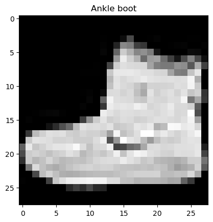
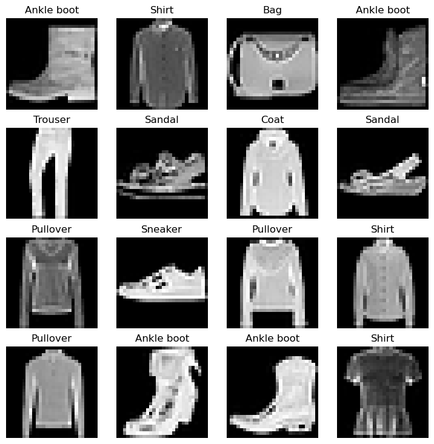
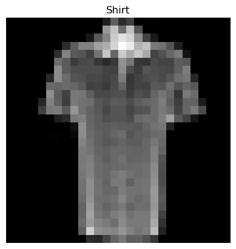
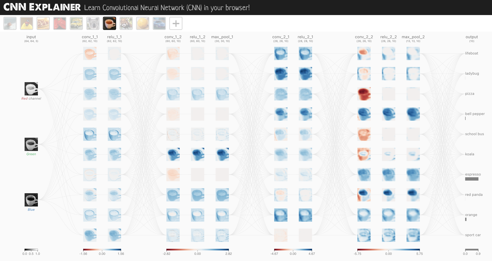
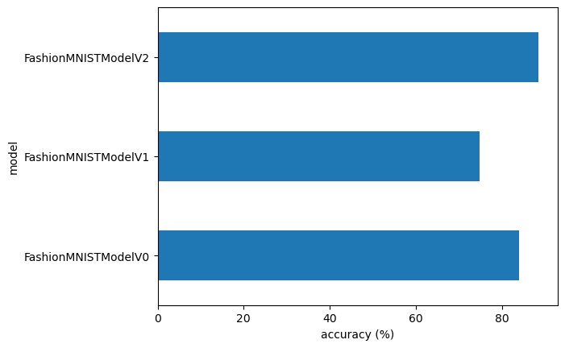
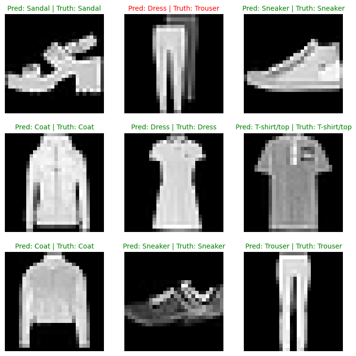
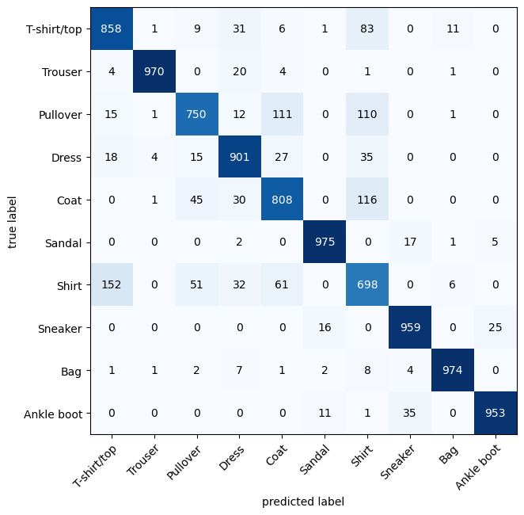

# PyTorchでコンピュータビジョン入門

## 概要

コンピュータビジョンは、コンピュータに画像を理解させる技術です。本記事では、PyTorchを使ってファッション画像の分類モデルを構築しながら、コンピュータビジョンの基礎を学びます。

**学習目標：**
- PyTorchのコンピュータビジョン関連ライブラリの理解
- 画像データの前処理とDataLoaderの使用方法
- ベースライン、非線形、CNNモデルの構築と比較
- 混同行列による詳細な評価手法

## 前提知識

- Pythonプログラミングの基礎
- PyTorchの基本的な使い方
- 機械学習の基本概念（損失関数、最適化、バックプロパゲーション）

## 実装内容

本記事で構築する内容：

| **トピック** | **内容** |
|-------------|---------|
| **0. PyTorchのコンピュータビジョンライブラリ** | `torchvision`とその構成要素について学習 |
| **1. データの読み込み** | FashionMNISTデータセットの取得と基本的な探索 |
| **2. データの準備** | DataLoaderを使ったバッチ処理の設定 |
| **3. `model_0`：ベースラインモデル** | 最もシンプルなモデルの構築と訓練 |
| **4. `model_0`の予測と評価** | ベースラインモデルの性能評価 |
| **5. デバイス非依存コードの設定** | GPU/CPUを自動選択するコードの実装 |
| **6. `model_1`：非線形性の追加** | ReLU層を追加したモデルの検証 |
| **7. `model_2`：畳み込みニューラルネットワーク** | CNNアーキテクチャの実装 |
| **8. モデル比較** | 3つのモデルの性能とトレードオフの分析 |
| **9. 最良モデルの評価** | ランダムサンプルでの予測結果の可視化 |
| **10. 混同行列の作成** | 分類性能の詳細な分析手法 |
| **11. モデルの保存と読み込み** | 訓練済みモデルの保存・復元方法 |

## 0. PyTorchのコンピュータビジョンライブラリ

まず、PyTorchのコンピュータビジョン関連ライブラリについて理解しましょう。

| PyTorchモジュール | 機能 |
|------------------|------|
| [`torchvision`](https://pytorch.org/vision/stable/index.html) | コンピュータビジョン用のデータセット、モデル、変換処理を提供 |
| [`torchvision.datasets`](https://pytorch.org/vision/stable/datasets.html) | 様々な画像データセット（分類、物体検出など）を提供 |
| [`torchvision.models`](https://pytorch.org/vision/stable/models.html) | 事前訓練済みのコンピュータビジョンモデルを提供 |
| [`torchvision.transforms`](https://pytorch.org/vision/stable/transforms.html) | 画像の前処理・データ拡張のための変換処理 |
| [`torch.utils.data.Dataset`](https://pytorch.org/docs/stable/data.html#torch.utils.data.Dataset) | PyTorchの基本データセットクラス |
| [`torch.utils.data.DataLoader`](https://pytorch.org/docs/stable/data.html#module-torch.utils.data) | データセットからバッチを作成するためのイテレータ |

まず必要なライブラリをインポートして、バージョンを確認します。

```python
# PyTorchのインポート
import torch
from torch import nn

# torchvisionのインポート
import torchvision
from torchvision import datasets
from torchvision.transforms import ToTensor

# 可視化用ライブラリ
import matplotlib.pyplot as plt

# バージョン確認
# 注意：PyTorchは1.10.0以上、torchvisionは0.11以上が必要
print(f"PyTorch version: {torch.__version__}\ntorchvision version: {torchvision.__version__}")
```

**実行結果：**
```
PyTorch version: 2.7.0
torchvision version: 0.22.0
```

## 1. データセットの取得

コンピュータビジョンの学習を始めるために、FashionMNISTデータセットを使用します。

**FashionMNISTについて：**
- 10種類のファッションアイテムの28x28ピクセルのグレースケール画像
- 訓練用60,000枚、テスト用10,000枚の画像
- 多クラス分類問題として設計


データセットをダウンロードして基本情報を確認しましょう。

```python
# 訓練用データの設定
train_data = datasets.FashionMNIST(
    root="data",           # データの保存先
    train=True,           # 訓練用データを取得
    download=True,        # データが存在しない場合はダウンロード
    transform=ToTensor(), # PIL画像をPyTorchテンソルに変換
    target_transform=None # ラベルの変換（今回は使用しない）
)

# テスト用データの設定
test_data = datasets.FashionMNIST(
    root="data",
    train=False,          # テスト用データを取得
    download=True,
    transform=ToTensor()
)
```

**実行結果：**
```
100%|██████████| 26.4M/26.4M [00:13<00:00, 1.92MB/s]
100%|██████████| 29.5k/29.5k [00:00<00:00, 92.8kB/s]
100%|██████████| 4.42M/4.42M [00:02<00:00, 1.47MB/s]
100%|██████████| 5.15k/5.15k [00:00<00:00, 7.49MB/s]
```

### 1.1 コンピュータビジョンモデルの入出力形状

データの詳細を確認しましょう。

```python
# 最初のサンプルを確認
image, label = train_data[0]
print(f"画像の形状: {image.shape}, ラベル: {label}")

# データセットのサイズを確認
print(f"訓練データ数: {len(train_data)}, テストデータ数: {len(test_data)}")

# クラス名を確認
class_names = train_data.classes
print(f"クラス名: {class_names}")
```

**実行結果：**
```
画像の形状: torch.Size([1, 28, 28]), ラベル: 9
訓練データ数: 60000, テストデータ数: 10000
クラス名: ['T-shirt/top', 'Trouser', 'Pullover', 'Dress', 'Coat', 'Sandal', 'Shirt', 'Sneaker', 'Bag', 'Ankle boot']
```

**画像の形状について：**
- `[1, 28, 28]` = `[カラーチャンネル数, 高さ, 幅]`
- カラーチャンネル数が1 = グレースケール画像
- この形状は`CHW`（Channels, Height, Width）形式

### 1.2 データの可視化

実際の画像を確認してみましょう。

```python
# 単一画像の表示
image, label = train_data[0]
print(f"画像の形状: {image.shape}")
plt.figure(figsize=(6, 6))
plt.imshow(image.squeeze(), cmap="gray")  # squeeze()で次元を削除
plt.title(f"{class_names[label]} (ラベル: {label})")
plt.axis("off")
plt.show()
```



複数の画像をランダムに表示して、データセットの多様性を確認します。

```python
# 複数画像のランダム表示
torch.manual_seed(42)
fig = plt.figure(figsize=(9, 9))
rows, cols = 4, 4

for i in range(1, rows * cols + 1):
    # ランダムにサンプルを選択
    random_idx = torch.randint(0, len(train_data), size=[1]).item()
    img, label = train_data[random_idx]
    
    # サブプロットを作成
    fig.add_subplot(rows, cols, i)
    plt.imshow(img.squeeze(), cmap="gray")
    plt.title(class_names[label])
    plt.axis(False)

plt.tight_layout()
plt.show()
```



## 2. DataLoaderでデータを準備

大規模なデータセットを効率的に処理するために、`DataLoader`を使用してバッチ処理を設定します。

**バッチ処理の利点：**
- メモリ効率の向上
- 勾配降下法の安定化
- 計算の並列化

```python
from torch.utils.data import DataLoader

# バッチサイズの設定（ハイパーパラメータ）
BATCH_SIZE = 32

# DataLoaderの作成
train_dataloader = DataLoader(
    train_data,           # データセット
    batch_size=BATCH_SIZE, # バッチサイズ
    shuffle=True          # エポックごとにデータをシャッフル
)

test_dataloader = DataLoader(
    test_data,
    batch_size=BATCH_SIZE,
    shuffle=False         # テストデータはシャッフル不要
)

# DataLoaderの情報を確認
print(f"訓練DataLoader: {len(train_dataloader)} バッチ (各バッチ {BATCH_SIZE} サンプル)")
print(f"テストDataLoader: {len(test_dataloader)} バッチ (各バッチ {BATCH_SIZE} サンプル)")
```

**実行結果：**
```
訓練DataLoader: 1875 バッチ (各バッチ 32 サンプル)
テストDataLoader: 313 バッチ (各バッチ 32 サンプル)
```

バッチデータの形状を確認します。

```python
# バッチデータの確認
train_features_batch, train_labels_batch = next(iter(train_dataloader))
print(f"バッチ画像の形状: {train_features_batch.shape}")
print(f"バッチラベルの形状: {train_labels_batch.shape}")

# バッチから単一サンプルを表示
torch.manual_seed(42)
random_idx = torch.randint(0, len(train_features_batch), size=[1]).item()
img, label = train_features_batch[random_idx], train_labels_batch[random_idx]

plt.figure(figsize=(6, 6))
plt.imshow(img.squeeze(), cmap="gray")
plt.title(class_names[label])
plt.axis("off")
plt.show()

print(f"単一画像の形状: {img.shape}")
print(f"ラベル: {label} ({class_names[label]})")
```

**実行結果：**
```
バッチ画像の形状: torch.Size([32, 1, 28, 28])
バッチラベルの形状: torch.Size([32])
単一画像の形状: torch.Size([1, 28, 28])
ラベル: 6 (Shirt)
```



## 3. `model_0`：ベースラインモデルの構築

機械学習では、まず最もシンプルなベースラインモデルを構築して、後のモデルとの比較基準とします。

**ベースラインモデルの特徴：**
- 2つの`nn.Linear()`層で構成
- `nn.Flatten()`で画像を1次元ベクトルに変換
- 複雑な処理は避けてシンプルな構造

```python
from torch import nn

class FashionMNISTModelV0(nn.Module):
    def __init__(self, input_shape: int, hidden_units: int, output_shape: int):
        super().__init__()
        self.layer_stack = nn.Sequential(
            nn.Flatten(),  # 画像を1次元ベクトルに変換
            nn.Linear(in_features=input_shape, out_features=hidden_units),
            nn.Linear(in_features=hidden_units, out_features=output_shape)
        )
    
    def forward(self, x):
        return self.layer_stack(x)
```

**`nn.Flatten()`の動作確認：**

```python
# Flattenレイヤーの動作を確認
flatten_model = nn.Flatten()
x = train_features_batch[0]  # 単一サンプル

print(f"Flatten前の形状: {x.shape} -> [カラーチャンネル, 高さ, 幅]")
output = flatten_model(x)
print(f"Flatten後の形状: {output.shape} -> [カラーチャンネル, 高さ×幅]")
```

**実行結果：**
```
Flatten前の形状: torch.Size([1, 28, 28]) -> [カラーチャンネル, 高さ, 幅]
Flatten後の形状: torch.Size([1, 784]) -> [カラーチャンネル, 高さ×幅]
```

**パラメータの設定：**

```python
torch.manual_seed(42)

# モデルのインスタンス化
model_0 = FashionMNISTModelV0(
    input_shape=784,              # 28×28=784 ピクセル
    hidden_units=10,              # 隠れ層のニューロン数
    output_shape=len(class_names) # クラス数（10）
)

print(model_0)
```

**実行結果：**
```
FashionMNISTModelV0(
  (layer_stack): Sequential(
    (0): Flatten(start_dim=1, end_dim=-1)
    (1): Linear(in_features=784, out_features=10, bias=True)
    (2): Linear(in_features=10, out_features=10, bias=True)
  )
)
```

### 3.1 損失関数、最適化器、評価指標の設定

```python
# ヘルパー関数のインポート（正確度計算用）
from helper_functions import accuracy_fn

# 損失関数と最適化器の設定
loss_fn = nn.CrossEntropyLoss()  # 多クラス分類用
optimizer = torch.optim.SGD(params=model_0.parameters(), lr=0.1)
```

### 3.2 実験時間測定関数の作成

異なるデバイス（CPU/GPU）での訓練時間を比較するため、時間測定関数を作成します。

```python
from timeit import default_timer as timer

def print_train_time(start: float, end: float, device: torch.device = None):
    """訓練時間を表示する関数
    
    Args:
        start (float): 開始時間
        end (float): 終了時間
        device (torch.device): 計算デバイス
    
    Returns:
        float: 経過時間（秒）
    """
    total_time = end - start
    print(f"訓練時間 on {device}: {total_time:.3f} 秒")
    return total_time
```

### 3.3 訓練ループの実装と実行

バッチデータを使った訓練ループを実装します。各バッチで損失と正確度を計算し、エポックごとに平均値を表示します。

```python
from tqdm import tqdm

# シードと時間測定の開始
torch.manual_seed(42)
train_time_start_on_cpu = timer()

epochs = 3

# 訓練とテストのループ
for epoch in tqdm(range(epochs)):
    print(f"エポック: {epoch}\n-------")
    
    ### 訓練フェーズ ###
    train_loss = 0
    model_0.train()  # 訓練モードに設定
    
    for batch, (X, y) in enumerate(train_dataloader):
        # 1. 順伝播
        y_pred = model_0(X)
        
        # 2. 損失計算
        loss = loss_fn(y_pred, y)
        train_loss += loss
        
        # 3. 勾配をゼロに
        optimizer.zero_grad()
        
        # 4. 逆伝播
        loss.backward()
        
        # 5. パラメータ更新
        optimizer.step()
        
        # 進捗表示
        if batch % 400 == 0:
            print(f"処理済みサンプル: {batch * len(X)}/{len(train_dataloader.dataset)}")
    
    # バッチあたりの平均損失を計算
    train_loss /= len(train_dataloader)
    
    ### テストフェーズ ###
    test_loss, test_acc = 0, 0
    model_0.eval()  # 評価モードに設定
    
    with torch.inference_mode():
        for X, y in test_dataloader:
            # 1. 順伝播
            test_pred = model_0(X)
            
            # 2. 損失計算
            test_loss += loss_fn(test_pred, y)
            
            # 3. 正確度計算
            test_acc += accuracy_fn(y_true=y, y_pred=test_pred.argmax(dim=1))
        
        # バッチあたりの平均値を計算
        test_loss /= len(test_dataloader)
        test_acc /= len(test_dataloader)
    
    print(f"\n訓練損失: {train_loss:.5f} | テスト損失: {test_loss:.5f}, テスト正確度: {test_acc:.2f}%\n")

# 訓練時間の計算
train_time_end_on_cpu = timer()
total_train_time_model_0 = print_train_time(
    start=train_time_start_on_cpu,
    end=train_time_end_on_cpu,
    device="cpu"
)
```

**実行結果：**
```
エポック: 0
-------
処理済みサンプル: 0/60000
処理済みサンプル: 12800/60000
処理済みサンプル: 25600/60000
処理済みサンプル: 38400/60000
処理済みサンプル: 51200/60000

訓練損失: 0.44395 | テスト損失: 0.46506, テスト正確度: 83.65%

エポック: 1
-------
処理済みサンプル: 0/60000
処理済みサンプル: 12800/60000
処理済みサンプル: 25600/60000
処理済みサンプル: 38400/60000
処理済みサンプル: 51200/60000

訓練損失: 0.43662 | テスト損失: 0.46453, テスト正確度: 83.89%

エポック: 2
-------
処理済みサンプル: 0/60000
処理済みサンプル: 12800/60000
処理済みサンプル: 25600/60000
処理済みサンプル: 38400/60000
処理済みサンプル: 51200/60000

訓練損失: 0.43045 | テスト損失: 0.46594, テスト正確度: 83.93%

訓練時間 on cpu: 5.841 秒
```

## 4. `model_0`の予測と評価

モデルの性能を評価するための汎用関数を作成します。この関数は後で他のモデルとの比較にも使用します。

```python
def eval_model(model: torch.nn.Module, 
               data_loader: torch.utils.data.DataLoader, 
               loss_fn: torch.nn.Module, 
               accuracy_fn,
               device: torch.device = "cpu"):
    """モデルの評価を行う関数
    
    Args:
        model: 評価対象のPyTorchモデル
        data_loader: 評価用データローダー
        loss_fn: 損失関数
        accuracy_fn: 正確度計算関数
        device: 計算デバイス
    
    Returns:
        dict: 評価結果（モデル名、損失、正確度）
    """
    loss, acc = 0, 0
    model.eval()
    
    with torch.inference_mode():
        for X, y in data_loader:
            X, y = X.to(device), y.to(device)
            
            # 予測の実行
            y_pred = model(X)
            
            # 損失と正確度の累積
            loss += loss_fn(y_pred, y)
            acc += accuracy_fn(y_true=y, y_pred=y_pred.argmax(dim=1))
        
        # バッチあたりの平均値を計算
        loss /= len(data_loader)
        acc /= len(data_loader)
        
    return {
        "model_name": model.__class__.__name__,
        "model_loss": loss.item(),
        "model_acc": acc
    }

# `model_0`の結果を計算
torch.manual_seed(42)
model_0_results = eval_model(
    model=model_0,
    data_loader=test_dataloader,
    loss_fn=loss_fn,
    accuracy_fn=accuracy_fn
)

print(model_0_results)
```

**実行結果：**
```
{'model_name': 'FashionMNISTModelV0', 'model_loss': 0.46593600511550903, 'model_acc': 83.92571884984025}
```

## 5. デバイス非依存コードの設定

モデルをGPUまたはCPUで自動的に実行できるよう、デバイス非依存コードを設定します。

```python
# デバイスの自動選択
device = "mps" if torch.mps.is_available() else "cpu"
print(f"使用デバイス: {device}")
```

**実行結果：**
```
使用デバイス: mps
```

## 6. `model_1`：非線形性の追加

ベースラインモデルに非線形活性化関数（ReLU）を追加して性能向上を試みます。

```python
class FashionMNISTModelV1(nn.Module):
    def __init__(self, input_shape: int, hidden_units: int, output_shape: int):
        super().__init__()
        self.layer_stack = nn.Sequential(
            nn.Flatten(),
            nn.Linear(in_features=input_shape, out_features=hidden_units),
            nn.ReLU(),  # 非線形活性化関数を追加
            nn.Linear(in_features=hidden_units, out_features=output_shape),
            nn.ReLU()   # 出力層にも追加
        )
    
    def forward(self, x: torch.Tensor):
        return self.layer_stack(x)

# モデルのインスタンス化（GPUに送信）
torch.manual_seed(42)
model_1 = FashionMNISTModelV1(
    input_shape=784,
    hidden_units=10,
    output_shape=len(class_names)
).to(device)

print(f"モデルのデバイス: {next(model_1.parameters()).device}")
```

**実行結果：**
```
モデルのデバイス: mps:0
```

### 6.1 損失関数と最適化器の設定

```python
loss_fn = nn.CrossEntropyLoss()
optimizer = torch.optim.SGD(params=model_1.parameters(), lr=0.1)
```

### 6.2 訓練・テスト関数の作成

繰り返し使用するため、訓練とテストの処理を関数化します。

```python
def train_step(model: torch.nn.Module,
               data_loader: torch.utils.data.DataLoader,
               loss_fn: torch.nn.Module,
               optimizer: torch.optim.Optimizer,
               accuracy_fn,
               device: torch.device = device):
    """訓練ステップを実行する関数"""
    train_loss, train_acc = 0, 0
    model.to(device)
    model.train()
    
    for batch, (X, y) in enumerate(data_loader):
        # データをGPUに送信
        X, y = X.to(device), y.to(device)
        
        # 1. 順伝播
        y_pred = model(X)
        
        # 2. 損失計算
        loss = loss_fn(y_pred, y)
        train_loss += loss
        train_acc += accuracy_fn(y_true=y, y_pred=y_pred.argmax(dim=1))
        
        # 3. 勾配をゼロに
        optimizer.zero_grad()
        
        # 4. 逆伝播
        loss.backward()
        
        # 5. パラメータ更新
        optimizer.step()
    
    # バッチあたりの平均値を計算
    train_loss /= len(data_loader)
    train_acc /= len(data_loader)
    print(f"訓練損失: {train_loss:.5f} | 訓練正確度: {train_acc:.2f}%")

def test_step(data_loader: torch.utils.data.DataLoader,
              model: torch.nn.Module,
              loss_fn: torch.nn.Module,
              accuracy_fn,
              device: torch.device = device):
    """テストステップを実行する関数"""
    test_loss, test_acc = 0, 0
    model.to(device)
    model.eval()
    
    with torch.inference_mode():
        for X, y in data_loader:
            X, y = X.to(device), y.to(device)
            
            # 1. 順伝播
            test_pred = model(X)
            
            # 2. 損失と正確度の計算
            test_loss += loss_fn(test_pred, y)
            test_acc += accuracy_fn(y_true=y, y_pred=test_pred.argmax(dim=1))
        
        # バッチあたりの平均値を計算
        test_loss /= len(data_loader)
        test_acc /= len(data_loader)
        print(f"テスト損失: {test_loss:.5f} | テスト正確度: {test_acc:.2f}%\n")
```

### 6.3 `model_1`の訓練実行

```python
torch.manual_seed(42)
train_time_start_on_gpu = timer()

epochs = 3
for epoch in tqdm(range(epochs)):
    print(f"エポック: {epoch}\n---------")
    train_step(data_loader=train_dataloader, 
               model=model_1, 
               loss_fn=loss_fn,
               optimizer=optimizer,
               accuracy_fn=accuracy_fn)
    test_step(data_loader=test_dataloader,
              model=model_1,
              loss_fn=loss_fn,
              accuracy_fn=accuracy_fn)

train_time_end_on_gpu = timer()
total_train_time_model_1 = print_train_time(start=train_time_start_on_gpu,
                                            end=train_time_end_on_gpu,
                                            device=device)
```

**実行結果：**
```
エポック: 0
---------
訓練損失: 1.09199 | 訓練正確度: 61.34%
テスト損失: 0.95636 | テスト正確度: 65.00%

エポック: 1
---------
訓練損失: 0.78097 | 訓練正確度: 71.94%
テスト損失: 0.72611 | テスト正確度: 73.99%

エポック: 2
---------
訓練損失: 0.67040 | 訓練正確度: 75.94%
テスト損失: 0.69007 | テスト正確度: 74.81%

訓練時間 on mps: 13.751 秒
```

### 6.4 `model_1`の評価

```python
# デバイス対応版のeval_model関数を使用
torch.manual_seed(42)
model_1_results = eval_model(
    model=model_1,
    data_loader=test_dataloader,
    loss_fn=loss_fn,
    accuracy_fn=accuracy_fn,
    device=device
)

print("`model_1`の結果:", model_1_results)
print("`model_0`の結果:", model_0_results)
```

**実行結果：**
```
`model_1`の結果: {'model_name': 'FashionMNISTModelV1', 'model_loss': 0.6900655031204224, 'model_acc': 74.810303514377}
`model_0`の結果: {'model_name': 'FashionMNISTModelV0', 'model_loss': 0.46593600511550903, 'model_acc': 83.92571884984025}
```

**興味深い結果：** 

非線形活性化関数を追加した`model_1`が、ベースライン`model_0`よりも性能が低下しました。これは**オーバーフィッティング**（過学習）の兆候である可能性があります。

**オーバーフィッティングの対策：**

1. より小さな/異なるモデルアーキテクチャの使用
2. より大きなデータセットの使用
3. 正則化手法の適用

## 7. `model_2`：畳み込みニューラルネットワーク（CNN）

コンピュータビジョンに特化したCNNアーキテクチャを実装します。CNN Explainerの[TinyVGG](https://poloclub.github.io/cnn-explainer/)アーキテクチャを参考にします。

**CNNの基本構造：**
`入力層 → [畳み込み層 → 活性化層 → プーリング層] → 出力層`



### 7.1 CNNモデルの実装

```python
class FashionMNISTModelV2(nn.Module):
    """
    TinyVGGアーキテクチャを模倣したCNNモデル
    参考: https://poloclub.github.io/cnn-explainer/
    """
    def __init__(self, input_shape: int, hidden_units: int, output_shape: int):
        super().__init__()
        
        # 1つ目の畳み込みブロック
        self.block_1 = nn.Sequential(
            nn.Conv2d(in_channels=input_shape, 
                      out_channels=hidden_units, 
                      kernel_size=3,    # 3x3のフィルター
                      stride=1,         # ストライド（デフォルト）
                      padding=1),       # パディング（出力サイズを維持）
            nn.ReLU(),
            nn.Conv2d(in_channels=hidden_units, 
                      out_channels=hidden_units,
                      kernel_size=3,
                      stride=1,
                      padding=1),
            nn.ReLU(),
            nn.MaxPool2d(kernel_size=2,    # 2x2の最大プーリング
                         stride=2)         # サイズを半分に
        )
        
        # 2つ目の畳み込みブロック
        self.block_2 = nn.Sequential(
            nn.Conv2d(hidden_units, hidden_units, 3, padding=1),
            nn.ReLU(),
            nn.Conv2d(hidden_units, hidden_units, 3, padding=1),
            nn.ReLU(),
            nn.MaxPool2d(2)
        )
        
        # 分類器（全結合層）
        self.classifier = nn.Sequential(
            nn.Flatten(),
            # 28x28 → 14x14 → 7x7 なので、最終的にhidden_units*7*7の特徴量
            nn.Linear(in_features=hidden_units*7*7, 
                      out_features=output_shape)
        )
    
    def forward(self, x: torch.Tensor):
        x = self.block_1(x)
        x = self.block_2(x)
        x = self.classifier(x)
        return x

# モデルのインスタンス化
torch.manual_seed(42)
model_2 = FashionMNISTModelV2(
    input_shape=1,                 # グレースケール画像（1チャンネル）
    hidden_units=10, 
    output_shape=len(class_names)
).to(device)

print(model_2)
```

**実行結果：**
```
FashionMNISTModelV2(
  (block_1): Sequential(
    (0): Conv2d(1, 10, kernel_size=(3, 3), stride=(1, 1), padding=(1, 1))
    (1): ReLU()
    (2): Conv2d(10, 10, kernel_size=(3, 3), stride=(1, 1), padding=(1, 1))
    (3): ReLU()
    (4): MaxPool2d(kernel_size=2, stride=2, padding=0, dilation=1, ceil_mode=False)
  )
  (block_2): Sequential(
    (0): Conv2d(10, 10, kernel_size=(3, 3), stride=(1, 1), padding=(1, 1))
    (1): ReLU()
    (2): Conv2d(10, 10, kernel_size=(3, 3), stride=(1, 1), padding=(1, 1))
    (3): ReLU()
    (4): MaxPool2d(kernel_size=2, stride=2, padding=0, dilation=1, ceil_mode=False)
  )
  (classifier): Sequential(
    (0): Flatten(start_dim=1, end_dim=-1)
    (1): Linear(in_features=490, out_features=10, bias=True)
  )
)
```

### 7.2 畳み込み層（nn.Conv2d）の理解

畳み込み層の動作を詳しく理解するため、テストデータで実験してみましょう。

```python
# テスト用のダミーデータを作成
torch.manual_seed(42)
images = torch.randn(size=(32, 3, 64, 64))  # [バッチサイズ, チャンネル, 高さ, 幅]
test_image = images[0]

print(f"バッチ画像の形状: {images.shape}")
print(f"単一画像の形状: {test_image.shape}")

# 畳み込み層の作成
conv_layer = nn.Conv2d(in_channels=3,      # 入力チャンネル数
                       out_channels=10,     # 出力チャンネル数
                       kernel_size=3,       # フィルターサイズ
                       stride=1,            # ストライド
                       padding=0)           # パディング

# 畳み込み層を通した後の形状
output = conv_layer(test_image.unsqueeze(dim=0))  # バッチ次元を追加
print(f"畳み込み後の形状: {output.shape}")
```

**実行結果：**
```
バッチ画像の形状: torch.Size([32, 3, 64, 64])
単一画像の形状: torch.Size([3, 64, 64])
畳み込み後の形状: torch.Size([1, 10, 62, 62])
```

**パラメータの効果確認：**

```python
# 異なるパラメータでの畳み込み層
conv_layer_2 = nn.Conv2d(in_channels=3,
                         out_channels=10,
                         kernel_size=(5, 5),  # より大きなフィルター
                         stride=2,            # より大きなストライド
                         padding=0)

output_2 = conv_layer_2(test_image.unsqueeze(dim=0))
print(f"異なる設定での畳み込み後の形状: {output_2.shape}")

# 重みとバイアスの形状確認
print(f"重み形状: {conv_layer_2.weight.shape}")
print(f"バイアス形状: {conv_layer_2.bias.shape}")
```

**実行結果：**
```
異なる設定での畳み込み後の形状: torch.Size([1, 10, 30, 30])
重み形状: torch.Size([10, 3, 5, 5])
バイアス形状: torch.Size([10])
```

### 7.3 最大プーリング層（nn.MaxPool2d）の理解

```python
# 最大プーリング層の動作確認
max_pool_layer = nn.MaxPool2d(kernel_size=2)

# 畳み込み → 最大プーリングの流れ
test_conv_output = conv_layer(test_image.unsqueeze(dim=0))
test_pooled_output = max_pool_layer(test_conv_output)

print(f"畳み込み後: {test_conv_output.shape}")
print(f"最大プーリング後: {test_pooled_output.shape}")

# 小さなテンソルでの動作確認
torch.manual_seed(42)
small_tensor = torch.randn(size=(1, 1, 2, 2))
print(f"\n元のテンソル:\n{small_tensor}")

pooled_tensor = max_pool_layer(small_tensor)
print(f"\n最大プーリング後:\n{pooled_tensor}")
print(f"形状変化: {small_tensor.shape} → {pooled_tensor.shape}")
```

**実行結果：**
```
畳み込み後: torch.Size([1, 10, 62, 62])
最大プーリング後: torch.Size([1, 10, 31, 31])

元のテンソル:
tensor([[[[0.3367, 0.1288],
          [0.2345, 0.2303]]]])

最大プーリング後:
tensor([[[[0.3367]]]])
形状変化: torch.Size([1, 1, 2, 2]) → torch.Size([1, 1, 1, 1])
```

**重要な概念：** ニューラルネットワークの各層は、高次元データをより低次元の表現に圧縮することで、重要な特徴を抽出しています。これは**知能としての圧縮**という概念とも関連しています。


### 7.4 `model_2`の訓練

```python
# 損失関数と最適化器の設定
loss_fn = nn.CrossEntropyLoss()
optimizer = torch.optim.SGD(params=model_2.parameters(), lr=0.1)

# 訓練の実行
torch.manual_seed(42)
train_time_start_model_2 = timer()

epochs = 3
for epoch in tqdm(range(epochs)):
    print(f"エポック: {epoch}\n---------")
    train_step(data_loader=train_dataloader, 
               model=model_2, 
               loss_fn=loss_fn,
               optimizer=optimizer,
               accuracy_fn=accuracy_fn,
               device=device)
    test_step(data_loader=test_dataloader,
              model=model_2,
              loss_fn=loss_fn,
              accuracy_fn=accuracy_fn,
              device=device)

train_time_end_model_2 = timer()
total_train_time_model_2 = print_train_time(start=train_time_start_model_2,
                                           end=train_time_end_model_2,
                                           device=device)
```

**実行結果：**
```
エポック: 0
---------
訓練損失: 0.59410 | 訓練正確度: 78.41%
テスト損失: 0.39081 | テスト正確度: 86.08%

エポック: 1
---------
訓練損失: 0.35714 | 訓練正確度: 87.16%
テスト損失: 0.35427 | テスト正確度: 87.36%

エポック: 2
---------
訓練損失: 0.32061 | 訓練正確度: 88.43%
テスト損失: 0.32339 | テスト正確度: 88.47%

訓練時間 on mps: 19.458 秒
```

### 7.5 `model_2`の評価

```python
# `model_2`の結果を取得
model_2_results = eval_model(
    model=model_2,
    data_loader=test_dataloader,
    loss_fn=loss_fn,
    accuracy_fn=accuracy_fn,
    device=device
)

print("`model_2`（CNN）の結果:", model_2_results)
```

**実行結果：**
```
`model_2`（CNN）の結果: {'model_name': 'FashionMNISTModelV2', 'model_loss': 0.3233945667743683, 'model_acc': 88.46845047923323}
```

## 8. モデル結果と訓練時間の比較

3つのモデルを総合的に比較してみましょう。

```python
import pandas as pd

# 結果をDataFrameにまとめ
compare_results = pd.DataFrame([model_0_results, model_1_results, model_2_results])

# 訓練時間も追加
compare_results["training_time"] = [
    total_train_time_model_0,
    total_train_time_model_1,
    total_train_time_model_2
]

print("モデル比較結果:")
print(compare_results)
```

**実行結果：**
```
モデル比較結果:
           model_name  model_loss  model_acc  training_time
0  FashionMNISTModelV0    0.465936  83.925719       5.840571
1  FashionMNISTModelV1    0.690066  74.810304      13.751049
2  FashionMNISTModelV2    0.323395  88.468450      19.458489
```

### 8.1 性能と速度のトレードオフ

結果から以下のことが分かります：

1. **CNN（`model_2`）**：最高性能（88.47%）だが最も訓練時間が長い
2. **ベースライン（`model_0`）**：バランスの良い性能（83.93%）と短い訓練時間
3. **非線形モデル（`model_1`）**：最も低い性能（74.81%）で中程度の訓練時間

**パフォーマンス-速度トレードオフ：** 一般的に、より複雑なモデルはより良い性能を示しますが、訓練時間と推論時間が長くなります。

```python
# 正確度の可視化
compare_results.set_index("model_name")["model_acc"].plot(kind="barh")
plt.xlabel("正確度 (%)")
plt.ylabel("モデル")
plt.title("モデル別正確度比較")
plt.show()
```



## 9. 最良モデルでのランダム予測と評価

最良性能を示したCNNモデル（model_2）を使って、ランダムサンプルで詳細な予測評価を行います。

### 9.1 予測関数の作成

```python
def make_predictions(model: torch.nn.Module, data: list, device: torch.device = device):
    """モデルで予測を実行する関数
    
    Args:
        model: 訓練済みモデル
        data: 予測対象のデータリスト
        device: 計算デバイス
    
    Returns:
        torch.Tensor: 予測確率のテンソル
    """
    pred_probs = []
    model.eval()
    
    with torch.inference_mode():
        for sample in data:
            # サンプルの前処理（バッチ次元の追加とデバイス移動）
            sample = torch.unsqueeze(sample, dim=0).to(device)
            
            # 順伝播（ロジット出力）
            pred_logit = model(sample)
            
            # 確率への変換（ソフトマックス適用）
            pred_prob = torch.softmax(pred_logit.squeeze(), dim=0)
            
            # CPUに移動して結果リストに追加
            pred_probs.append(pred_prob.cpu())
    
    return torch.stack(pred_probs)
```

### 9.2 テストサンプルの準備

```python
import random
random.seed(42)

# ランダムに9個のテストサンプルを選択
test_samples = []
test_labels = []
for sample, label in random.sample(list(test_data), k=9):
    test_samples.append(sample)
    test_labels.append(label)

print(f"テストサンプル画像形状: {test_samples[0].shape}")
print(f"テストサンプルラベル: {test_labels[0]} ({class_names[test_labels[0]]})")
```

**実行結果：**
```
テストサンプル画像形状: torch.Size([1, 28, 28])
テストサンプルラベル: 5 (Sandal)
```

### 9.3 予測の実行と結果の解析

```python
# 予測の実行
pred_probs = make_predictions(model=model_2, data=test_samples)

# 予測確率から予測クラスへの変換
pred_classes = pred_probs.argmax(dim=1)

print("予測確率（最初の2サンプル）:")
print(pred_probs[:2])
print(f"\n予測クラス: {pred_classes}")
print(f"正解ラベル: {test_labels}")
```

**実行結果：**
```
予測確率（最初の2サンプル）:
tensor([[3.6584e-08, 8.0141e-09, 1.4409e-08, 7.5137e-08, 3.7370e-09, 9.9992e-01,
         9.6478e-08, 1.4915e-06, 3.9395e-05, 4.1798e-05],
        [1.1877e-01, 2.9905e-01, 6.0677e-03, 4.2386e-01, 1.0221e-01, 3.5574e-05,
         4.7972e-02, 2.3109e-04, 2.1487e-05, 1.7808e-03]])

予測クラス: tensor([5, 3, 7, 4, 3, 0, 4, 7, 1])
正解ラベル: [5, 1, 7, 4, 3, 0, 4, 7, 1]
```

### 9.4 予測結果の可視化

```python
# 予測結果の可視化
plt.figure(figsize=(9, 9))
nrows, ncols = 3, 3

for i, sample in enumerate(test_samples):
    plt.subplot(nrows, ncols, i+1)
    
    # 画像の表示
    plt.imshow(sample.squeeze(), cmap="gray")
    
    # 予測と正解のラベル取得
    pred_label = class_names[pred_classes[i]]
    truth_label = class_names[test_labels[i]]
    
    # タイトルテキストの作成
    title_text = f"予測: {pred_label} | 正解: {truth_label}"
    
    # 正解/不正解に応じて色を変更
    if pred_label == truth_label:
        plt.title(title_text, fontsize=10, c="g")  # 正解なら緑
    else:
        plt.title(title_text, fontsize=10, c="r")  # 不正解なら赤
    
    plt.axis(False)

plt.tight_layout()
plt.show()
```



**結果分析：** 9個中8個で正確な予測ができており、モデルの性能の高さを確認できます。唯一の間違いも、似たようなアイテム間での混同であり、理解できる誤差といえます。

## 10. 混同行列による詳細な予測評価

分類モデルの性能をより詳細に分析するため、混同行列を作成します。混同行列は、モデルがどのクラス間で「混同」しているかを視覚的に示します。

### 10.1 全テストデータでの予測

```python
from tqdm import tqdm

# 全テストデータで予測を実行
y_preds = []
model_2.eval()

with torch.inference_mode():
    for X, y in tqdm(test_dataloader, desc="予測実行中"):
        X, y = X.to(device), y.to(device)
        
        # 順伝播
        y_logit = model_2(X)
        
        # ロジット → 確率 → 予測ラベル
        y_pred = torch.softmax(y_logit, dim=1).argmax(dim=1)
        
        # CPUに移動
        y_preds.append(y_pred.cpu())

# 予測結果を結合
y_pred_tensor = torch.cat(y_preds)
print(f"予測結果のサイズ: {y_pred_tensor.shape}")
```

**実行結果：**
```
予測実行中: 100%|██████████| 313/313 [00:00<00:00, 573.80it/s]
予測結果のサイズ: torch.Size([10000])
```

### 10.2 混同行列の作成と可視化

```python
from torchmetrics import ConfusionMatrix
from mlxtend.plotting import plot_confusion_matrix

# 混同行列の計算
confmat = ConfusionMatrix(num_classes=len(class_names), task='multiclass')
confmat_tensor = confmat(preds=y_pred_tensor, target=test_data.targets)

# 混同行列の可視化
fig, ax = plot_confusion_matrix(
    conf_mat=confmat_tensor.numpy(),
    class_names=class_names,
    figsize=(10, 7),
    show_normed=False,  # 正規化しない（実際の数を表示）
    colorbar=True
)
plt.title("FashionMNIST 混同行列")
plt.show()
```



### 10.3 混同行列の解釈

混同行列から以下の洞察が得られます：

1. **対角線上の値が高い**：全体的に良好な性能
2. **主な混同パターン**：
   - 「Pullover」と「Shirt」の間での混同
   - 「T-shirt/top」と「Shirt」の間での混同
   - これらは視覚的に似ているため、理解できる誤差

3. **モデルの強み**：
   - 「Sandal」「Sneaker」「Bag」などは高い精度で分類
   - 形状が明確に異なるアイテムの識別が得意

この情報により、モデルの改善方向や、どのクラスでより多くのデータが必要かなどの示唆が得られます。

## 11. 最良モデルの保存と読み込み

訓練済みモデルを将来使用するため、保存と読み込みの方法を学びます。

### 11.1 モデルの保存

```python
from pathlib import Path

# モデル保存ディレクトリの作成
MODEL_PATH = Path("models")
MODEL_PATH.mkdir(parents=True, exist_ok=True)

# 保存パスの設定
MODEL_NAME = "03_pytorch_computer_vision_model_2.pth"
MODEL_SAVE_PATH = MODEL_PATH / MODEL_NAME

# モデルの状態辞書を保存
print(f"モデルを保存中: {MODEL_SAVE_PATH}")
torch.save(obj=model_2.state_dict(), f=MODEL_SAVE_PATH)
```

**実行結果：**
```
モデルを保存中: models/03_pytorch_computer_vision_model_2.pth
```

### 11.2 モデルの読み込み

```python
# 新しいモデルインスタンスの作成
loaded_model_2 = FashionMNISTModelV2(
    input_shape=1,
    hidden_units=10,
    output_shape=10
)

# 保存された状態辞書の読み込み
loaded_model_2.load_state_dict(torch.load(f=MODEL_SAVE_PATH))

# デバイスに移動
loaded_model_2 = loaded_model_2.to(device)

print("モデルの読み込み完了")
```

### 11.3 読み込みモデルの検証

```python
# 読み込んだモデルの評価
torch.manual_seed(42)
loaded_model_2_results = eval_model(
    model=loaded_model_2,
    data_loader=test_dataloader,
    loss_fn=loss_fn,
    accuracy_fn=accuracy_fn,
    device=device
)

print("読み込んだモデルの結果:", loaded_model_2_results)
print("元のモデルの結果:", model_2_results)

# 結果の一致確認
results_match = torch.isclose(
    torch.tensor(model_2_results["model_loss"]),
    torch.tensor(loaded_model_2_results["model_loss"]),
    atol=1e-08,
    rtol=0.0001
)
print(f"結果が一致しているか: {results_match}")
```

**実行結果：**
```
読み込んだモデルの結果: {'model_name': 'FashionMNISTModelV2', 'model_loss': 0.3233945667743683, 'model_acc': 88.46845047923323}
元のモデルの結果: {'model_name': 'FashionMNISTModelV2', 'model_loss': 0.3233945667743683, 'model_acc': 88.46845047923323}
結果が一致しているか: tensor(True)
```

## まとめ

本記事では、PyTorchを使ったコンピュータビジョンの基礎を学びました。

### 学習した重要ポイント

#### 1. **データ準備の重要性**：
   * `torchvision.datasets`でのデータ取得
   * `DataLoader`でのバッチ処理
   * 画像データの形状理解（CHW形式）

#### 2. **モデル設計の比較**：
   - ベースライン（線形層のみ）
   - 非線形活性化関数の追加
   - CNN（畳み込み）アーキテクチャ

#### 3. **性能評価手法**：
   - 基本的な損失・正確度計算
   - 混同行列による詳細分析
   - 視覚的な予測結果確認

#### 4. **実践的なスキル**：
   - デバイス非依存コードの書き方
   - モデルの保存・読み込み
   - 実験結果の比較・可視化

### 注意事項とトラブルシューティング

#### 1. **メモリ不足エラー**：

   - バッチサイズを小さくする
   - 画像サイズを縮小する
   - グラデーション蓄積を使用する

#### 2. **GPU関連の問題**：

   - CUDA/MPS対応の確認
   - デバイス間でのテンソル移動の確認
   - メモリクリア（`torch.cuda.empty_cache()`）

#### 3. **学習が進まない場合**：

   - 学習率の調整
   - 損失関数の確認
   - データの正規化
   - 勾配爆発/消失の確認

#### 4. **過学習の対策**：

   - 訓練データの増加
   - 正則化手法の適用
   - Early Stopping
   - モデルの簡素化

### 参考リソース

- [PyTorch公式チュートリアル](https://pytorch.org/tutorials/)
- [CNN Explainer](https://poloclub.github.io/cnn-explainer/) - CNNの動作を可視化
- [torchvision.models](https://pytorch.org/vision/stable/models.html) - 事前訓練済みモデル
- [Papers With Code](https://paperswithcode.com/) - 最新の研究論文と実装
