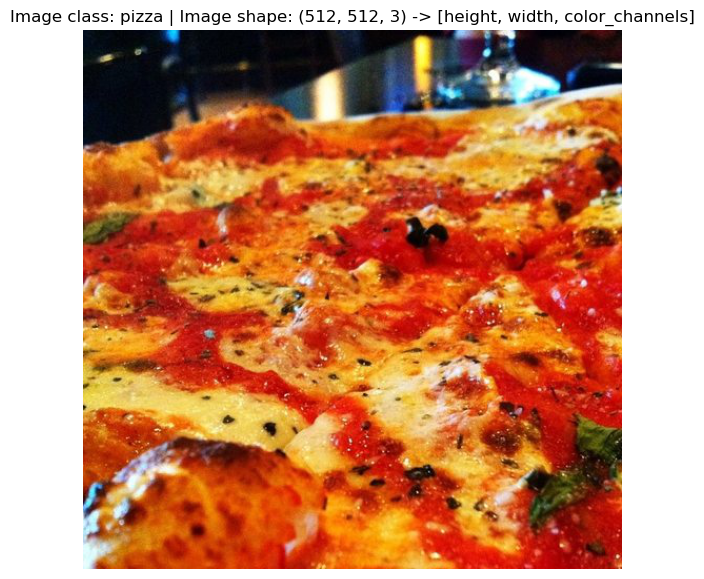
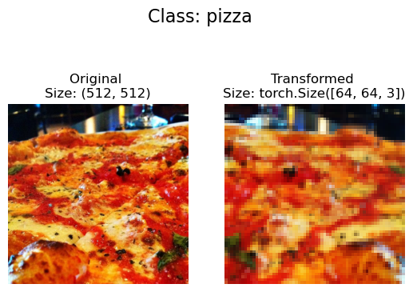
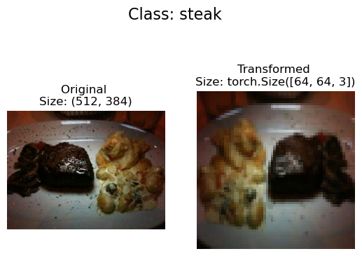
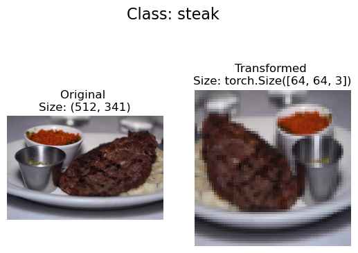
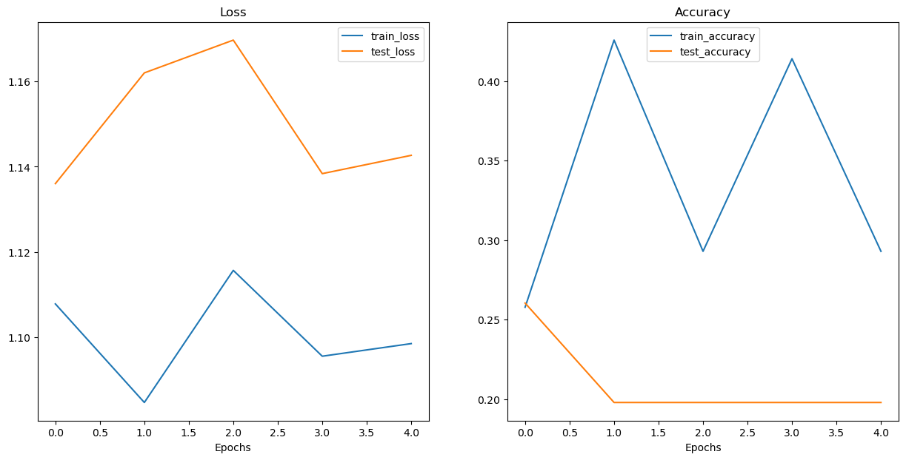
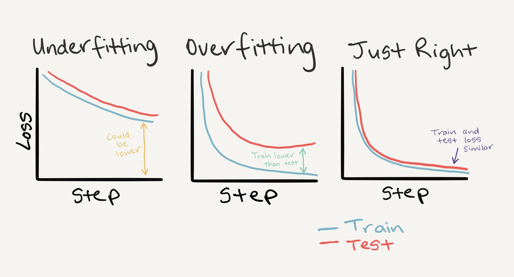
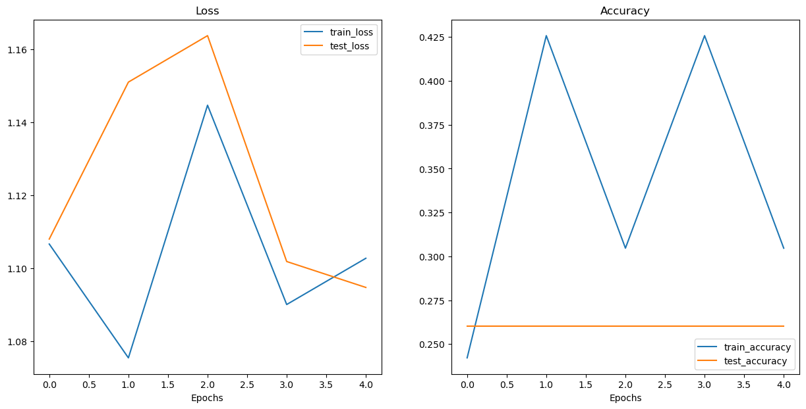
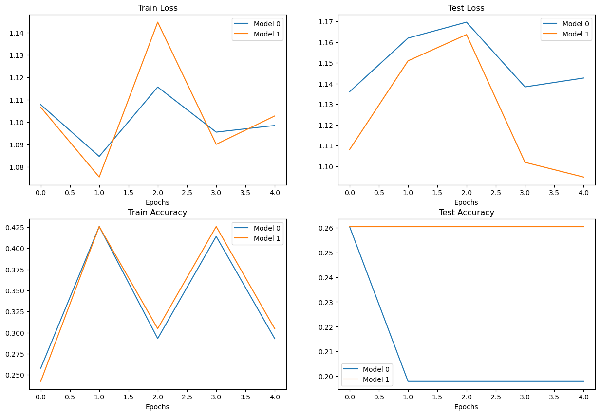
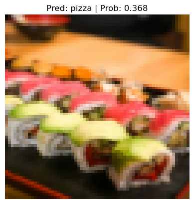

# PyTorchカスタムデータセット - 画像分類モデルの構築

## 概要

このノートブックでは、PyTorchを使用してカスタムデータセットを作成し、コンピュータビジョンモデルを構築する方法を学習します。具体的には、pizza、steak、sushiの3つのクラスの画像を分類するモデルを構築します。

## 学習目標

- PyTorchでカスタムデータセットクラスの作成方法を理解する
- `torchvision.datasets.ImageFolder`の使用方法を習得する
- データ拡張（data augmentation）の効果を理解する
- TinyVGGアーキテクチャを実装し、訓練する
- 損失曲線の解釈とオーバーフィッティング/アンダーフィッティングの対策を学ぶ

## 前提知識

- Python基礎知識
- PyTorchの基本概念（テンソル、自動微分）
- 畳み込みニューラルネットワーク（CNN）の基礎
- 機械学習の基本概念（訓練、検証、テスト）

## 実装内容

### 0. PyTorchのインポートとデバイス設定

まず、必要なライブラリをインポートし、デバイスに依存しないコードを設定します。

```python
import torch
from torch import nn

# PyTorchのバージョンを確認（torch >= 1.10.0が必要）
torch.__version__
```

出力結果：
```
'2.7.0'
```

```python
# デバイスに依存しないコードの設定
device = "mps" if torch.mps.is_available() else "cpu"
device
```

出力結果：
```
'mps'
```

**解説**：この設定により、利用可能なハードウェア（GPU/CPU）に応じて最適なデバイスが自動選択されます。

### 1. データの取得

今回使用するデータセットは、[Food101データセット](https://data.vision.ee.ethz.ch/cvl/datasets_extra/food-101/)のサブセットです。Food101は101種類の食べ物の画像を含む人気のコンピュータビジョンベンチマークデータセットです。

私たちは3つのクラス（pizza、steak、sushi）に絞り、それぞれランダムに10%のサンプルを使用します。

```python
import requests
import zipfile
from pathlib import Path

# データフォルダのパスを設定
data_path = Path("data/")
image_path = data_path / "pizza_steak_sushi"

# 画像フォルダが存在しない場合、ダウンロードして準備
if image_path.is_dir():
    print(f"{image_path} ディレクトリが存在します。")
else:
    print(f"{image_path} ディレクトリが見つかりません。作成中...")
    image_path.mkdir(parents=True, exist_ok=True)
    
    # pizza、steak、sushiデータをダウンロード
    with open(data_path / "pizza_steak_sushi.zip", "wb") as f:
        request = requests.get("https://github.com/vinsmoke-three/deeplearning-with-pytorch/raw/main/data/pizza_steak_sushi.zip")
        print("pizza、steak、sushiデータをダウンロード中...")
        f.write(request.content)

    # zipファイルを解凍
    with zipfile.ZipFile(data_path / "pizza_steak_sushi.zip", "r") as zip_ref:
        print("pizza、steak、sushiデータを解凍中...") 
        zip_ref.extractall(image_path)
```

出力結果：
```
data/pizza_steak_sushi ディレクトリが見つかりません。作成中...
pizza、steak、sushiデータをダウンロード中...
pizza、steak、sushiデータを解凍中...
```

### 2. データの理解と準備

データの探索は機械学習の最初の重要なステップです。データセットの構造を理解しましょう。

データは以下のような標準的な画像分類フォーマットで格納されています：

```
pizza_steak_sushi/
    train/
        pizza/
            image01.jpeg
            image02.jpeg
            ...
        steak/
            image24.jpeg
            ...
        sushi/
            image37.jpeg
            ...
    test/
        pizza/
        steak/
        sushi/
```

```python
import os
def walk_through_dir(dir_path):
    """
    指定されたディレクトリパスの内容を表示します。
    Args:
        dir_path (str or pathlib.Path): 対象ディレクトリ
    
    Returns:
        各サブディレクトリ内のディレクトリ数と画像数を出力
    """
    for dirpath, dirnames, filenames in os.walk(dir_path):
        print(f"'{dirpath}' には {len(dirnames)} 個のディレクトリと {len(filenames)} 個の画像があります。")
```

```python
walk_through_dir(image_path)
```

出力結果：
```
'data/pizza_steak_sushi' には 2 個のディレクトリと 0 個の画像があります。
'data/pizza_steak_sushi/test' には 3 個のディレクトリと 0 個の画像があります。
'data/pizza_steak_sushi/test/steak' には 0 個のディレクトリと 19 個の画像があります。
'data/pizza_steak_sushi/test/sushi' には 0 個のディレクトリと 31 個の画像があります。
'data/pizza_steak_sushi/test/pizza' には 0 個のディレクトリと 25 個の画像があります。
'data/pizza_steak_sushi/train' には 3 個のディレクトリと 0 個の画像があります。
'data/pizza_steak_sushi/train/steak' には 0 個のディレクトリと 75 個の画像があります。
'data/pizza_steak_sushi/train/sushi' には 0 個のディレクトリと 72 個の画像があります。
'data/pizza_steak_sushi/train/pizza' には 0 個のディレクトリと 78 個の画像があります。
```

訓練用と検証用のパスを設定しましょう：

```python
# 訓練用と検証用のパスを設定
train_dir = image_path / "train"
test_dir = image_path / "test"

train_dir, test_dir
```

出力結果：
```
(PosixPath('data/pizza_steak_sushi/train'),
 PosixPath('data/pizza_steak_sushi/test'))
```

### 2.1 画像の可視化

データ探索において**可視化**は極めて重要です。ランダムな画像を表示してデータを理解しましょう。

```python
import random
from PIL import Image

# シードを設定
random.seed(42)

# 1. すべての画像パスを取得（*は「任意の組み合わせ」を意味）
image_path_list = list(image_path.glob("*/*/*.jpg"))

# 2. ランダムな画像パスを取得
random_image_path = random.choice(image_path_list)

# 3. パス名から画像クラスを取得
image_class = random_image_path.parent.stem

# 4. 画像を開く
img = Image.open(random_image_path)

# 5. メタデータを出力
print(f"ランダム画像パス: {random_image_path}")
print(f"画像クラス: {image_class}")
print(f"画像の高さ: {img.height}") 
print(f"画像の幅: {img.width}")
img
```

出力結果：
```
ランダム画像パス: data/pizza_steak_sushi/test/pizza/2236338.jpg
画像クラス: pizza
画像の高さ: 512
画像の幅: 512
```


`matplotlib`でも同様に表示できます：

```python
import numpy as np
import matplotlib.pyplot as plt

# 画像を配列に変換
img_as_array = np.asarray(img)

# matplotlibで画像をプロット
plt.figure(figsize=(10, 7))
plt.imshow(img_as_array)
plt.title(f"画像クラス: {image_class} | 画像形状: {img_as_array.shape} -> [高さ, 幅, カラーチャンネル]")
plt.axis(False);
```



### 3. データの変換

PyTorchでデータを使用する前に、以下の変換が必要です：

1. テンソル（画像の数値表現）への変換
2. `torch.utils.data.Dataset`と`torch.utils.data.DataLoader`への変換

### 3.1 `torchvision.transforms`によるデータ変換

`torchvision.transforms`は、画像をテンソルに変換し、データ拡張を行うための多くの事前構築されたメソッドを提供します。

以下の変換ステップを実装します：
1. `transforms.Resize()`で画像のサイズを512x512から64x64にリサイズ
2. `transforms.RandomHorizontalFlip()`でランダムに水平方向に反転
3. `transforms.ToTensor()`でPIL画像をPyTorchテンソルに変換

```python
import torch
from torch.utils.data import DataLoader
from torchvision import datasets, transforms

# 画像変換を定義
data_transform = transforms.Compose([
    # 画像を64x64にリサイズ
    transforms.Resize(size=(64, 64)),
    # 50%の確率で水平方向にランダム反転
    transforms.RandomHorizontalFlip(p=0.5),
    # 画像をtorch.Tensorに変換（ピクセル値も0-255から0.0-1.0に変換）
    transforms.ToTensor()
])
```

変換を可視化する関数を作成しましょう：

```python
def plot_transformed_images(image_paths, transform, n=3, seed=42):
    """画像パスのリストからランダムな画像をプロットします。

    Args:
        image_paths (list): 対象画像パスのリスト
        transform (PyTorch Transforms): 画像に適用する変換
        n (int, optional): プロットする画像数. デフォルト 3
        seed (int, optional): ランダムジェネレータのシード. デフォルト 42
    """
    random.seed(seed)
    random_image_paths = random.sample(image_paths, k=n)
    for image_path in random_image_paths:
        with Image.open(image_path) as f:
            fig, ax = plt.subplots(1, 2)
            ax[0].imshow(f) 
            ax[0].set_title(f"オリジナル \nサイズ: {f.size}")
            ax[0].axis("off")

            # 画像を変換してプロット
            # permute()でmatplotlib用に形状を変更（PyTorchのデフォルト[C, H, W]をmatplotlibの[H, W, C]に）
            transformed_image = transform(f).permute(1, 2, 0) 
            ax[1].imshow(transformed_image) 
            ax[1].set_title(f"変換後 \nサイズ: {transformed_image.shape}")
            ax[1].axis("off")

            fig.suptitle(f"クラス: {image_path.parent.stem}", fontsize=16)

plot_transformed_images(image_path_list, 
                        transform=data_transform, 
                        n=3)
```





**重要なポイント**：画像のサイズが大きいほど、モデルはより多くの情報を抽出できますが、計算量も増加します。

### 4. オプション1：`ImageFolder`による画像データの読み込み

データが標準的な画像分類フォーマットの場合、`torchvision.datasets.ImageFolder`を使用できます。

```python
# ImageFolderを使用してデータセットを作成
from torchvision import datasets
train_data = datasets.ImageFolder(root=train_dir, # 画像の対象フォルダ
                                  transform=data_transform, # データ（画像）に実行する変換
                                  target_transform=None) # ラベルに実行する変換（必要な場合）

test_data = datasets.ImageFolder(root=test_dir, 
                                 transform=data_transform)

print(f"訓練データ:\n{train_data}\n検証データ:\n{test_data}")
```

出力結果：
```
訓練データ:
Dataset ImageFolder
    Number of datapoints: 225
    Root location: data/pizza_steak_sushi/train
    StandardTransform
Transform: Compose(
               Resize(size=(64, 64), interpolation=bilinear, max_size=None, antialias=True)
               RandomHorizontalFlip(p=0.5)
               ToTensor()
           )
検証データ:
Dataset ImageFolder
    Number of datapoints: 75
    Root location: data/pizza_steak_sushi/test
    StandardTransform
Transform: Compose(
               Resize(size=(64, 64), interpolation=bilinear, max_size=None, antialias=True)
               RandomHorizontalFlip(p=0.5)
               ToTensor()
           )
```

データセットの属性を確認しましょう：

```python
# クラス名をリストとして取得
class_names = train_data.classes
class_names
```

出力結果：
```
['pizza', 'steak', 'sushi']
```

```python
# クラス名を辞書として取得
class_dict = train_data.class_to_idx
class_dict
```

出力結果：
```
{'pizza': 0, 'steak': 1, 'sushi': 2}
```

```python
# データセットの長さを確認
len(train_data), len(test_data)
```

出力結果：
```
(225, 75)
```

個別のサンプルとラベルを確認してみましょう：

```python
img, label = train_data[0][0], train_data[0][1]
print(f"画像テンソル:\n{img}")
print(f"画像形状: {img.shape}")
print(f"画像データ型: {img.dtype}")
print(f"画像ラベル: {label}")
print(f"ラベルデータ型: {type(label)}")
```

出力結果：
```
画像テンソル:
tensor([[[0.1137, 0.1020, 0.0980,  ..., 0.1255, 0.1216, 0.1176],
         [0.1059, 0.0980, 0.0980,  ..., 0.1294, 0.1294, 0.1294],
         ...
画像形状: torch.Size([3, 64, 64])
画像データ型: torch.float32
画像ラベル: 0
ラベルデータ型: <class 'int'>
```

**重要**：画像は`CHW`（カラーチャンネル、高さ、幅）の形式ですが、`matplotlib`は`HWC`を期待するため、表示時は`permute()`で次元を並び替える必要があります。

```python
# 次元の順序を並び替え
img_permute = img.permute(1, 2, 0)

# 異なる形状を出力（permute前後）
print(f"オリジナル形状: {img.shape} -> [カラーチャンネル, 高さ, 幅]")
print(f"permute後の形状: {img_permute.shape} -> [高さ, 幅, カラーチャンネル]")

# 画像をプロット
plt.figure(figsize=(10, 7))
plt.imshow(img.permute(1, 2, 0))
plt.axis("off")
plt.title(class_names[label], fontsize=14);
```


### 4.1 `DataLoader`への変換

`Dataset`を`DataLoader`に変換してイテラブルにし、モデルがサンプルと目標値の関係を学習できるようにします。

```python
# DataLoaderを作成
from torch.utils.data import DataLoader
train_dataloader = DataLoader(dataset=train_data, 
                              batch_size=1, # バッチあたりのサンプル数
                              num_workers=1, # データローディングのサブプロセス数
                              shuffle=True) # データをシャッフルするか

test_dataloader = DataLoader(dataset=test_data, 
                             batch_size=1, 
                             num_workers=1, 
                             shuffle=False) # テストデータは通常シャッフルしない

train_dataloader, test_dataloader
```

形状を確認しましょう：

```python
img, label = next(iter(train_dataloader))

# バッチサイズが1になります
print(f"画像形状: {img.shape} -> [バッチサイズ, カラーチャンネル, 高さ, 幅]")
print(f"ラベル形状: {label.shape}")
```

出力結果：
```
画像形状: torch.Size([1, 3, 64, 64]) -> [バッチサイズ, カラーチャンネル, 高さ, 幅]
ラベル形状: torch.Size([1])
```

### 5. オプション2：カスタム`Dataset`による画像データの読み込み

事前構築された`Dataset`関数が存在しない場合、独自のカスタム`Dataset`を作成できます。

`torch.utils.data.Dataset`をサブクラス化してカスタム`Dataset`を作成しましょう：

```python
import os
import pathlib
import torch

from PIL import Image
from torch.utils.data import Dataset
from torchvision import transforms
from typing import Tuple, Dict, List
```

### 5.1 クラス名を取得するヘルパー関数の作成

```python
def find_classes(directory: str) -> Tuple[List[str], Dict[str, int]]:
    """対象ディレクトリ内のクラスフォルダ名を見つけます。
    
    対象ディレクトリが標準的な画像分類フォーマットであることを前提とします。

    Args:
        directory (str): クラス名を読み込む対象ディレクトリ

    Returns:
        Tuple[List[str], Dict[str, int]]: (クラス名のリスト, dict(クラス名: インデックス...))
    
    例:
        find_classes("food_images/train")
        >>> (["class_1", "class_2"], {"class_1": 0, ...})
    """
    # 1. 対象ディレクトリをスキャンしてクラス名を取得
    classes = sorted(entry.name for entry in os.scandir(directory) if entry.is_dir())
    
    # 2. クラス名が見つからない場合はエラーを発生
    if not classes:
        raise FileNotFoundError(f"{directory}でクラスが見つかりませんでした。")
        
    # 3. インデックスラベルの辞書を作成（コンピュータは文字列より数値を好む）
    class_to_idx = {cls_name: i for i, cls_name in enumerate(classes)}
    return classes, class_to_idx
```

```python
find_classes(str(train_dir))
```

出力結果：
```
(['pizza', 'steak', 'sushi'], {'pizza': 0, 'steak': 1, 'sushi': 2})
```

### 5.2 `ImageFolder`を複製するカスタム`Dataset`の作成

```python
# カスタムデータセットクラスを作成（torch.utils.data.Datasetを継承）
from torch.utils.data import Dataset

# 1. torch.utils.data.Datasetをサブクラス化
class ImageFolderCustom(Dataset):
    
    # 2. targ_dirとtransform（オプション）パラメータで初期化
    def __init__(self, targ_dir: str, transform=None) -> None:
        
        # 3. クラス属性を作成
        # すべての画像パスを取得
        self.paths = list(pathlib.Path(targ_dir).glob("*/*.jpg"))
        # 変換を設定
        self.transform = transform
        # classesとclass_to_idx属性を作成
        self.classes, self.class_to_idx = find_classes(targ_dir)

    # 4. 画像を読み込む関数を作成
    def load_image(self, index: int) -> Image.Image:
        "パスを通じて画像を開いて返します。"
        image_path = self.paths[index]
        return Image.open(image_path) 
    
    # 5. __len__()メソッドをオーバーライド（推奨）
    def __len__(self) -> int:
        "サンプルの総数を返します。"
        return len(self.paths)
    
    # 6. __getitem__()メソッドをオーバーライド（必須）
    def __getitem__(self, index: int) -> Tuple[torch.Tensor, int]:
        "データの1サンプル、データとラベル（X, y）を返します。"
        img = self.load_image(index)
        class_name  = self.paths[index].parent.name # data_folder/class_name/image.jpegのパスを期待
        class_idx = self.class_to_idx[class_name]

        # 必要に応じて変換
        if self.transform:
            return self.transform(img), class_idx # データ、ラベル（X, y）を返す
        else:
            return img, class_idx # データ、ラベル（X, y）を返す
```

カスタムデータセットをテストしましょう：

```python
# 訓練用変換（データ拡張あり）
train_transforms = transforms.Compose([
    transforms.Resize((64, 64)),
    transforms.RandomHorizontalFlip(p=0.5),
    transforms.ToTensor()
])

# テスト用変換（データ拡張なし、リサイズのみ）
test_transforms = transforms.Compose([
    transforms.Resize((64, 64)),
    transforms.ToTensor()
])
```

```python
train_data_custom = ImageFolderCustom(targ_dir=train_dir, 
                                      transform=train_transforms)
test_data_custom = ImageFolderCustom(targ_dir=test_dir, 
                                     transform=test_transforms)
train_data_custom, test_data_custom
```

```python
# 等価性をチェック
print((len(train_data_custom) == len(train_data)) & (len(test_data_custom) == len(test_data)))
print(train_data_custom.classes == train_data.classes)
print(train_data_custom.class_to_idx == train_data.class_to_idx)
```

出力結果：
```
True
True
True
```

### 6. データ拡張の他の形式

**データ拡張**は、訓練データの多様性を人工的に増加させるプロセスです。これにより、モデルのより良い汎化能力（学習したパターンが未来の未知の例により堅牢）を得ることができます。

`transforms.TrivialAugmentWide()`を使用してみましょう：

```python
from torchvision import transforms

train_transforms = transforms.Compose([
    transforms.Resize((224, 224)),
    transforms.TrivialAugmentWide(num_magnitude_bins=31), # 強度レベル
    transforms.ToTensor() # すべてを0と1の間にするためToTensor()を最後に使用
])

# テストデータにはデータ拡張は不要
test_transforms = transforms.Compose([
    transforms.Resize((224, 224)), 
    transforms.ToTensor()
])
```

### 7. モデル0：データ拡張なしのTinyVGG

### 7.1 モデル0用のデータ読み込み

```python
# シンプルな変換を作成
simple_transform = transforms.Compose([ 
    transforms.Resize((64, 64)),
    transforms.ToTensor(),
])
```

```python
# 1. データを読み込んで変換
from torchvision import datasets
train_data_simple = datasets.ImageFolder(root=train_dir, transform=simple_transform)
test_data_simple = datasets.ImageFolder(root=test_dir, transform=simple_transform)

# 2. DataLoaderに変換
import os
from torch.utils.data import DataLoader

# バッチサイズとワーカー数を設定
BATCH_SIZE = 32
NUM_WORKERS = 0
print(f"バッチサイズ{BATCH_SIZE}、{NUM_WORKERS}ワーカーでDataLoaderを作成します。")

# DataLoaderを作成
train_dataloader_simple = DataLoader(train_data_simple, 
                                     batch_size=BATCH_SIZE, 
                                     shuffle=True, 
                                     num_workers=NUM_WORKERS)

test_dataloader_simple = DataLoader(test_data_simple, 
                                    batch_size=BATCH_SIZE, 
                                    shuffle=False, 
                                    num_workers=NUM_WORKERS)
```

### 7.2 TinyVGGモデルクラスの作成

```python
class TinyVGG(nn.Module):
    """
    TinyVGGモデルアーキテクチャ: 
    https://poloclub.github.io/cnn-explainer/
    """
    def __init__(self, input_shape: int, hidden_units: int, output_shape: int) -> None:
        super().__init__()
        self.conv_block_1 = nn.Sequential(
            nn.Conv2d(in_channels=input_shape, 
                      out_channels=hidden_units, 
                      kernel_size=3, # 画像上を移動する正方形の大きさ
                      stride=1, # デフォルト
                      padding=1), # "valid"（パディングなし）または"same"（出力が入力と同じ形状）または特定の数値
            nn.ReLU(),
            nn.Conv2d(in_channels=hidden_units, 
                      out_channels=hidden_units,
                      kernel_size=3,
                      stride=1,
                      padding=1),
            nn.ReLU(),
            nn.MaxPool2d(kernel_size=2,
                         stride=2) # デフォルトのstride値はkernel_sizeと同じ
        )
        self.conv_block_2 = nn.Sequential(
            nn.Conv2d(hidden_units, hidden_units, kernel_size=3, padding=1),
            nn.ReLU(),
            nn.Conv2d(hidden_units, hidden_units, kernel_size=3, padding=1),
            nn.ReLU(),
            nn.MaxPool2d(2)
        )
        self.classifier = nn.Sequential(
            nn.Flatten(),
            # このin_features形状はどこから来たのか？
            # ネットワークの各層が入力データの形状を圧縮・変更するため
            nn.Linear(in_features=hidden_units*16*16,
                      out_features=output_shape)
        )
    
    def forward(self, x: torch.Tensor):
        x = self.conv_block_1(x)
        x = self.conv_block_2(x)
        x = self.classifier(x)
        return x

torch.manual_seed(42)
model_0 = TinyVGG(input_shape=3, # カラーチャンネル数（RGBの場合3）
                  hidden_units=10, 
                  output_shape=len(train_data.classes)).to(device)
model_0
```

出力結果：
```
TinyVGG(
  (conv_block_1): Sequential(
    (0): Conv2d(3, 10, kernel_size=(3, 3), stride=(1, 1), padding=(1, 1))
    (1): ReLU()
    (2): Conv2d(10, 10, kernel_size=(3, 3), stride=(1, 1), padding=(1, 1))
    (3): ReLU()
    (4): MaxPool2d(kernel_size=2, stride=2, padding=0, dilation=1, ceil_mode=False)
  )
  (conv_block_2): Sequential(
    (0): Conv2d(10, 10, kernel_size=(3, 3), stride=(1, 1), padding=(1, 1))
    (1): ReLU()
    (2): Conv2d(10, 10, kernel_size=(3, 3), stride=(1, 1), padding=(1, 1))
    (3): ReLU()
    (4): MaxPool2d(kernel_size=2, stride=2, padding=0, dilation=1, ceil_mode=False)
  )
  (classifier): Sequential(
    (0): Flatten(start_dim=1, end_dim=-1)
    (1): Linear(in_features=2560, out_features=3, bias=True)
  )
)
```

### 7.3 単一画像での順伝播テスト

モデルをテストする良い方法は、単一のデータで順伝播を行うことです：

```python
# 1. DataLoaderから画像とラベルのバッチを取得
img_batch, label_batch = next(iter(train_dataloader_simple))

# 2. バッチから単一画像を取得し、モデルに合うようにunsqueeze
img_single, label_single = img_batch[0].unsqueeze(dim=0), label_batch[0]
print(f"単一画像形状: {img_single.shape}\n")

# 3. 単一画像で順伝播を実行
model_0.eval()
with torch.inference_mode():
    pred = model_0(img_single.to(device))
    
# 4. 結果を出力し、モデルのロジット → 予測確率 → 予測ラベルに変換
print(f"出力ロジット:\n{pred}\n")
print(f"出力予測確率:\n{torch.softmax(pred, dim=1)}\n")
print(f"出力予測ラベル:\n{torch.argmax(torch.softmax(pred, dim=1), dim=1)}\n")
print(f"実際のラベル:\n{label_single}")
```

出力結果：
```
単一画像形状: torch.Size([1, 3, 64, 64])

出力ロジット:
tensor([[0.0578, 0.0634, 0.0352]], device='mps:0')

出力予測確率:
tensor([[0.3352, 0.3371, 0.3277]], device='mps:0')

出力予測ラベル:
tensor([1], device='mps:0')

実際のラベル:
2
```

### 7.4 `torchinfo`によるモデル形状の確認

`torchinfo`を使用してモデルの詳細情報を取得できます：

```python
from torchinfo import summary
summary(model_0, input_size=[1, 3, 64, 64]) # 例の入力サイズでテストパス
```

出力結果：
```
==========================================================================================
Layer (type:depth-idx)                   Output Shape              Param #
==========================================================================================
TinyVGG                                  [1, 3]                    --
├─Sequential: 1-1                        [1, 10, 32, 32]           --
│    └─Conv2d: 2-1                       [1, 10, 64, 64]           280
│    └─ReLU: 2-2                         [1, 10, 64, 64]           --
│    └─Conv2d: 2-3                       [1, 10, 64, 64]           910
│    └─ReLU: 2-4                         [1, 10, 64, 64]           --
│    └─MaxPool2d: 2-5                    [1, 10, 32, 32]           --
├─Sequential: 1-2                        [1, 10, 16, 16]           --
│    └─Conv2d: 2-6                       [1, 10, 32, 32]           910
│    └─ReLU: 2-7                         [1, 10, 32, 32]           --
│    └─Conv2d: 2-8                       [1, 10, 32, 32]           910
│    └─ReLU: 2-9                         [1, 10, 32, 32]           --
│    └─MaxPool2d: 2-10                   [1, 10, 16, 16]           --
├─Sequential: 1-3                        [1, 3]                    --
│    └─Flatten: 2-11                     [1, 2560]                 --
│    └─Linear: 2-12                      [1, 3]                    7,683
==========================================================================================
Total params: 10,693
Trainable params: 10,693
Non-trainable params: 0
Total mult-adds (Units.MEGABYTES): 6.75
==========================================================================================
```

### 7.5 訓練・テストループ関数の作成

3つの関数を作成します：
1. `train_step()` - モデルを訓練
2. `test_step()` - モデルを評価  
3. `train()` - 1と2を組み合わせて実行

```python
def train_step(model: torch.nn.Module, 
               dataloader: torch.utils.data.DataLoader, 
               loss_fn: torch.nn.Module, 
               optimizer: torch.optim.Optimizer):
    # モデルを訓練モードに設定
    model.train()
    
    # 訓練損失と訓練精度の値を設定
    train_loss, train_acc = 0, 0
    
    # データローダーのデータバッチをループ
    for batch, (X, y) in enumerate(dataloader):
        # データを対象デバイスに送信
        X, y = X.to(device), y.to(device)

        # 1. 順伝播
        y_pred = model(X)

        # 2. 損失を計算・蓄積
        loss = loss_fn(y_pred, y)
        train_loss += loss.item() 

        # 3. オプティマイザーのゼロ勾配
        optimizer.zero_grad()

        # 4. 損失の逆伝播
        loss.backward()

        # 5. オプティマイザーのステップ
        optimizer.step()

        # 全バッチにわたって精度メトリクスを計算・蓄積
        y_pred_class = torch.argmax(torch.softmax(y_pred, dim=1), dim=1)
        train_acc += (y_pred_class == y).sum().item()/len(y_pred)

    # バッチごとの平均損失と精度を取得するためにメトリクスを調整
    train_loss = train_loss / len(dataloader)
    train_acc = train_acc / len(dataloader)
    return train_loss, train_acc
```

```python
def test_step(model: torch.nn.Module, 
              dataloader: torch.utils.data.DataLoader, 
              loss_fn: torch.nn.Module):
    # モデルを評価モードに設定
    model.eval() 
    
    # テスト損失とテスト精度の値を設定
    test_loss, test_acc = 0, 0
    
    # 推論コンテキストマネージャーをオン
    with torch.inference_mode():
        # DataLoaderバッチをループ
        for batch, (X, y) in enumerate(dataloader):
            # データを対象デバイスに送信
            X, y = X.to(device), y.to(device)
    
            # 1. 順伝播
            test_pred_logits = model(X)

            # 2. 損失を計算・蓄積
            loss = loss_fn(test_pred_logits, y)
            test_loss += loss.item()
            
            # 精度を計算・蓄積
            test_pred_labels = test_pred_logits.argmax(dim=1)
            test_acc += ((test_pred_labels == y).sum().item()/len(test_pred_labels))
            
    # バッチごとの平均損失と精度を取得するためにメトリクスを調整
    test_loss = test_loss / len(dataloader)
    test_acc = test_acc / len(dataloader)
    return test_loss, test_acc
```

```python
from tqdm import tqdm

# 1. 訓練とテストステップに必要な様々なパラメータを受け取る
def train(model: torch.nn.Module, 
          train_dataloader: torch.utils.data.DataLoader, 
          test_dataloader: torch.utils.data.DataLoader, 
          optimizer: torch.optim.Optimizer,
          loss_fn: torch.nn.Module = nn.CrossEntropyLoss(),
          epochs: int = 5):
    
    # 2. 空の結果辞書を作成
    results = {"train_loss": [],
        "train_acc": [],
        "test_loss": [],
        "test_acc": []
    }
    
    # 3. エポック数分、訓練とテストステップをループ
    for epoch in tqdm(range(epochs)):
        train_loss, train_acc = train_step(model=model,
                                           dataloader=train_dataloader,
                                           loss_fn=loss_fn,
                                           optimizer=optimizer)
        test_loss, test_acc = test_step(model=model,
            dataloader=test_dataloader,
            loss_fn=loss_fn)
        
        # 4. 進行状況を出力
        print(
            f"エポック: {epoch+1} | "
            f"train_loss: {train_loss:.4f} | "
            f"train_acc: {train_acc:.4f} | "
            f"test_loss: {test_loss:.4f} | "
            f"test_acc: {test_acc:.4f}"
        )

        # 5. 結果辞書を更新
        # すべてのデータがCPUに移動され、保存用にfloatに変換されることを確認
        results["train_loss"].append(train_loss.item() if isinstance(train_loss, torch.Tensor) else train_loss)
        results["train_acc"].append(train_acc.item() if isinstance(train_acc, torch.Tensor) else train_acc)
        results["test_loss"].append(test_loss.item() if isinstance(test_loss, torch.Tensor) else test_loss)
        results["test_acc"].append(test_acc.item() if isinstance(test_acc, torch.Tensor) else test_acc)

    # 6. エポック終了時に満たされた結果を返す
    return results
```

### 7.7 モデル0の訓練と評価

```python
# ランダムシードを設定
torch.manual_seed(42) 
torch.cuda.manual_seed(42)

# エポック数を設定
NUM_EPOCHS = 5

# TinyVGGのインスタンスを再作成
model_0 = TinyVGG(input_shape=3, # カラーチャンネル数（RGBの場合3）
                  hidden_units=10, 
                  output_shape=len(train_data.classes)).to(device)

# 損失関数とオプティマイザーを設定
loss_fn = nn.CrossEntropyLoss()
optimizer = torch.optim.Adam(params=model_0.parameters(), lr=0.001)

# タイマーを開始
from timeit import default_timer as timer 
start_time = timer()

# model_0を訓練
model_0_results = train(model=model_0, 
                        train_dataloader=train_dataloader_simple,
                        test_dataloader=test_dataloader_simple,
                        optimizer=optimizer,
                        loss_fn=loss_fn, 
                        epochs=NUM_EPOCHS)

# タイマーを終了し、所要時間を出力
end_time = timer()
print(f"総訓練時間: {end_time-start_time:.3f} 秒")
```

出力結果：
```
エポック: 1 | train_loss: 1.1078 | train_acc: 0.2578 | test_loss: 1.1360 | test_acc: 0.2604
エポック: 2 | train_loss: 1.0847 | train_acc: 0.4258 | test_loss: 1.1620 | test_acc: 0.1979
エポック: 3 | train_loss: 1.1157 | train_acc: 0.2930 | test_loss: 1.1697 | test_acc: 0.1979
エポック: 4 | train_loss: 1.0956 | train_acc: 0.4141 | test_loss: 1.1384 | test_acc: 0.1979
エポック: 5 | train_loss: 1.0985 | train_acc: 0.2930 | test_loss: 1.1427 | test_acc: 0.1979
総訓練時間: 4.032 秒
```

### 7.8 モデル0の損失曲線をプロット

**損失曲線**はモデルの時間経過に伴う結果を表示し、モデルの性能評価に優れた方法です。

```python
def plot_loss_curves(results: Dict[str, List[float]]):
    """結果辞書の訓練曲線をプロットします。

    Args:
        results (dict): 値のリストを含む辞書, 例:
            {"train_loss": [...],
             "train_acc": [...],
             "test_loss": [...],
             "test_acc": [...]}
    """
    
    # 結果辞書の損失値を取得（訓練と検証）
    loss = results['train_loss']
    test_loss = results['test_loss']

    # 結果辞書の精度値を取得（訓練と検証）
    accuracy = results['train_acc']
    test_accuracy = results['test_acc']

    # エポック数を計算
    epochs = range(len(results['train_loss']))

    # プロットを設定
    plt.figure(figsize=(15, 7))

    # 損失をプロット
    plt.subplot(1, 2, 1)
    plt.plot(epochs, loss, label='train_loss')
    plt.plot(epochs, test_loss, label='test_loss')
    plt.title('損失')
    plt.xlabel('エポック')
    plt.legend()

    # 精度をプロット
    plt.subplot(1, 2, 2)
    plt.plot(epochs, accuracy, label='train_accuracy')
    plt.plot(epochs, test_accuracy, label='test_accuracy')
    plt.title('精度')
    plt.xlabel('エポック')
    plt.legend();

plot_loss_curves(model_0_results)
```



**解析**：結果が不安定で、モデルの性能は良くありません。これは典型的な**アンダーフィッティング**の兆候です。

## 8. 理想的な損失曲線とは

訓練・検証損失曲線の観察は、モデルの**オーバーフィッティング**を確認する優れた方法です。



**重要なポイント**：
- **アンダーフィッティング**：訓練・検証損失が期待より高い
- **オーバーフィッティング**：検証損失が訓練損失より大幅に高い
- **理想的**：訓練・検証損失曲線が時間とともに近づく

### 8.1 オーバーフィッティングへの対処法

| **オーバーフィッティング防止法** | **説明** |
| ----- | ----- |
| **より多くのデータを取得** | より多くのデータは、モデルにより汎化可能なパターンを学習する機会を提供 |
| **モデルの簡素化** | 層数や隠れユニット数を減らす |
| **データ拡張の使用** | 訓練データを人工的に変更し、学習を困難にする |
| **転移学習の使用** | 事前訓練されたモデルの重みを活用 |
| **ドロップアウト層の使用** | ランダムに接続を削除してモデルを簡素化 |
| **学習率減衰の使用** | 訓練が進むにつれて学習率を徐々に下げる |
| **早期停止の使用** | オーバーフィッティングが始まる前に訓練を停止 |

### 8.2 アンダーフィッティングへの対処法

| **アンダーフィッティング防止法** | **説明** |
| ----- | ----- |
| **層/ユニットをモデルに追加** | モデルの予測力を増加 |
| **学習率を調整** | 学習率が高すぎる場合は下げる |
| **転移学習の使用** | 事前訓練されたモデルのパターンを活用 |
| **より長い時間訓練** | モデルにより多くの学習時間を提供 |
| **正則化を減らす** | オーバーフィッティング防止を緩める |

## 9. モデル1：データ拡張ありのTinyVGG

データ拡張を使用して性能改善を試してみましょう。

### 9.1 データ拡張付き変換の作成

```python
# TrivialAugmentで訓練変換を作成
train_transform_trivial_augment = transforms.Compose([
    transforms.Resize((64, 64)),
    transforms.TrivialAugmentWide(num_magnitude_bins=31), # 強度レベル
    transforms.ToTensor() 
])

# テスト変換を作成（データ拡張なし）
test_transform = transforms.Compose([
    transforms.Resize((64, 64)),
    transforms.ToTensor()
])
```

### 9.2 訓練・テスト`Dataset`と`DataLoader`の作成

```python
# 画像フォルダをDatasetに変換
train_data_augmented = datasets.ImageFolder(train_dir, transform=train_transform_trivial_augment)
test_data_simple = datasets.ImageFolder(test_dir, transform=test_transform)

# DatasetをDataLoaderに変換
import os
BATCH_SIZE = 32
NUM_WORKERS = 0

torch.manual_seed(42)
train_dataloader_augmented = DataLoader(train_data_augmented, 
                                        batch_size=BATCH_SIZE, 
                                        shuffle=True,
                                        num_workers=NUM_WORKERS)

test_dataloader_simple = DataLoader(test_data_simple, 
                                    batch_size=BATCH_SIZE, 
                                    shuffle=False, 
                                    num_workers=NUM_WORKERS)
```

### 9.3 モデル1の構築と訓練

```python
# model_1を作成し、対象デバイスに送信
torch.manual_seed(42)
model_1 = TinyVGG(
    input_shape=3,
    hidden_units=10,
    output_shape=len(train_data_augmented.classes)).to(device)

# ランダムシードを設定
torch.manual_seed(42) 
torch.cuda.manual_seed(42)

# エポック数を設定
NUM_EPOCHS = 5

# 損失関数とオプティマイザーを設定
loss_fn = nn.CrossEntropyLoss()
optimizer = torch.optim.Adam(params=model_1.parameters(), lr=0.001)

# タイマーを開始
start_time = timer()

# model_1を訓練
model_1_results = train(model=model_1, 
                        train_dataloader=train_dataloader_augmented,
                        test_dataloader=test_dataloader_simple,
                        optimizer=optimizer,
                        loss_fn=loss_fn, 
                        epochs=NUM_EPOCHS)

# タイマーを終了し、所要時間を出力
end_time = timer()
print(f"総訓練時間: {end_time-start_time:.3f} 秒")
```

出力結果：
```
エポック: 1 | train_loss: 1.1067 | train_acc: 0.2422 | test_loss: 1.1080 | test_acc: 0.2604
エポック: 2 | train_loss: 1.0755 | train_acc: 0.4258 | test_loss: 1.1510 | test_acc: 0.2604
エポック: 3 | train_loss: 1.1447 | train_acc: 0.3047 | test_loss: 1.1637 | test_acc: 0.2604
エポック: 4 | train_loss: 1.0901 | train_acc: 0.4258 | test_loss: 1.1019 | test_acc: 0.2604
エポック: 5 | train_loss: 1.1028 | train_acc: 0.3047 | test_loss: 1.0948 | test_acc: 0.2604
総訓練時間: 3.256 秒
```

### 9.4 モデル1の損失曲線をプロット

```python
plot_loss_curves(model_1_results)
```



**解析**：データ拡張を使用しても、性能は大幅に改善されませんでした。これは、モデルがまだアンダーフィッティングしていることを示しています。

## 10. モデル結果の比較

```python
import pandas as pd
model_0_df = pd.DataFrame(model_0_results)
model_1_df = pd.DataFrame(model_1_results)

# モデル比較プロット
plt.figure(figsize=(15, 10))

# エポック数を取得
epochs = range(len(model_0_df))

# 訓練損失をプロット
plt.subplot(2, 2, 1)
plt.plot(epochs, model_0_df["train_loss"], label="モデル 0")
plt.plot(epochs, model_1_df["train_loss"], label="モデル 1")
plt.title("訓練損失")
plt.xlabel("エポック")
plt.legend()

# テスト損失をプロット
plt.subplot(2, 2, 2)
plt.plot(epochs, model_0_df["test_loss"], label="モデル 0")
plt.plot(epochs, model_1_df["test_loss"], label="モデル 1")
plt.title("テスト損失")
plt.xlabel("エポック")
plt.legend()

# 訓練精度をプロット
plt.subplot(2, 2, 3)
plt.plot(epochs, model_0_df["train_acc"], label="モデル 0")
plt.plot(epochs, model_1_df["train_acc"], label="モデル 1")
plt.title("訓練精度")
plt.xlabel("エポック")
plt.legend()

# テスト精度をプロット
plt.subplot(2, 2, 4)
plt.plot(epochs, model_0_df["test_acc"], label="モデル 0")
plt.plot(epochs, model_1_df["test_acc"], label="モデル 1")
plt.title("テスト精度")
plt.xlabel("エポック")
plt.legend();
```



**解析**：両モデルとも同様に低い性能を示し、不安定な結果（メトリクスが急激に上下）を示しています。

## 11. カスタム画像での予測

訓練されたモデルを独自の画像で試してみましょう。

### 11.1 PyTorchによるカスタム画像の読み込み

```python
# カスタム画像パスを設定
custom_image_path = data_path / "sushi.jpg"

import torchvision

# カスタム画像を読み込み
custom_image_uint8 = torchvision.io.read_image(str(custom_image_path))

print(f"カスタム画像形状: {custom_image_uint8.shape}\n")
print(f"カスタム画像データ型: {custom_image_uint8.dtype}")
```

出力結果：
```
カスタム画像形状: torch.Size([3, 4032, 3024])
カスタム画像データ型: torch.uint8
```

**重要**：モデルは`torch.float32`で`[0, 1]`の値を期待しますが、画像は`torch.uint8`で`[0, 255]`の値です。変換が必要です。

```python
# カスタム画像を読み込み、テンソル値をfloat32に変換
custom_image = torchvision.io.read_image(str(custom_image_path)).type(torch.float32)

# 画像ピクセル値を255で割って[0, 1]の範囲にする
custom_image = custom_image / 255. 

print(f"カスタム画像形状: {custom_image.shape}\n")
print(f"カスタム画像データ型: {custom_image.dtype}")
```

出力結果：
```
カスタム画像形状: torch.Size([3, 4032, 3024])
カスタム画像データ型: torch.float32
```

### 11.2 訓練済みPyTorchモデルでのカスタム画像予測

画像を表示して確認しましょう：

```python
# カスタム画像をプロット
plt.imshow(custom_image.permute(1, 2, 0)) # CHW -> HWCに次元を変更
plt.title(f"画像形状: {custom_image.shape}")
plt.axis(False);
```


画像のサイズを訓練データと同じにする必要があります：

```python
# 画像をリサイズする変換パイプラインを作成
custom_image_transform = transforms.Compose([
    transforms.Resize((64, 64)),
])

# 対象画像を変換
custom_image_transformed = custom_image_transform(custom_image)

print(f"オリジナル形状: {custom_image.shape}")
print(f"新しい形状: {custom_image_transformed.shape}")
```

出力結果：
```
オリジナル形状: torch.Size([3, 4032, 3024])
新しい形状: torch.Size([3, 64, 64])
```

最終的に予測を実行：

```python
model_1.eval()
with torch.inference_mode():
    # 画像に追加の次元を追加
    custom_image_transformed_with_batch_size = custom_image_transformed.unsqueeze(dim=0)
    
    # 異なる形状を出力
    print(f"変換されたカスタム画像形状: {custom_image_transformed.shape}")
    print(f"unsqueezeされたカスタム画像形状: {custom_image_transformed_with_batch_size.shape}")
    
    # 追加次元を持つ画像で予測を実行
    custom_image_pred = model_1(custom_image_transformed.unsqueeze(dim=0).to(device))
```

出力結果：
```
変換されたカスタム画像形状: torch.Size([3, 64, 64])
unsqueezeされたカスタム画像形状: torch.Size([1, 3, 64, 64])
```

**重要なポイント**：以下の3つは、深層学習とPyTorchで最も一般的な問題です：

1. **間違ったデータ型** - モデルは`torch.float32`を期待するが、元の画像は`uint8`
2. **間違ったデバイス** - モデルは対象デバイス（GPU）にあるが、データがまだ移動されていない
3. **間違った形状** - モデルは`[N, C, H, W]`の形状を期待するが、カスタム画像は`[C, H, W]`

予測結果を確認しましょう：

```python
# 予測ロジットを出力
print(f"予測ロジット: {custom_image_pred}")

# ロジット → 予測確率に変換（多クラス分類用にtorch.softmax()を使用）
custom_image_pred_probs = torch.softmax(custom_image_pred, dim=1)
print(f"予測確率: {custom_image_pred_probs}")

# 予測確率 → 予測ラベルに変換
custom_image_pred_label = torch.argmax(custom_image_pred_probs, dim=1)
print(f"予測ラベル: {custom_image_pred_label}")
```

出力結果：
```
予測ロジット: tensor([[ 0.0928, -0.1096, -0.0082]], device='mps:0')
予測確率: tensor([[0.3676, 0.3002, 0.3322]], device='mps:0')
予測ラベル: tensor([0], device='mps:0')
```

```python
# 予測されたラベルを見つける
custom_image_pred_class = class_names[custom_image_pred_label.cpu()] # 予測ラベルをCPUに、そうでないとエラー
custom_image_pred_class
```

出力結果：
```
'pizza'
```

**解析**：モデルは「pizza」と予測しましたが、予測確率がほぼ同等（約33%ずつ）であることから、モデルが実際には推測しているだけであることがわかります。

### 11.3 カスタム画像予測のための関数作成

毎回同じ手順を繰り返すのは面倒なので、再利用可能な関数を作成しましょう：

```python
def pred_and_plot_image(model: torch.nn.Module, 
                        image_path: str, 
                        class_names: List[str] = None, 
                        transform=None,
                        device: torch.device = device):
    """対象画像で予測を行い、画像と予測結果をプロットします。"""
    
    # 1. 画像を読み込み、テンソル値をfloat32に変換
    target_image = torchvision.io.read_image(str(image_path)).type(torch.float32)
    
    # 2. 画像ピクセル値を255で割って[0, 1]の範囲にする
    target_image = target_image / 255. 
    
    # 3. 必要に応じて変換
    if transform:
        target_image = transform(target_image)
    
    # 4. モデルが対象デバイスにあることを確認
    model.to(device)
    
    # 5. モデル評価モードと推論モードをオン
    model.eval()
    with torch.inference_mode():
        # 画像に追加の次元を追加
        target_image = target_image.unsqueeze(dim=0)
    
        # 追加次元を持つ画像で予測を実行し、対象デバイスに送信
        target_image_pred = model(target_image.to(device))
        
    # 6. ロジット → 予測確率に変換（多クラス分類用にtorch.softmax()を使用）
    target_image_pred_probs = torch.softmax(target_image_pred, dim=1)

    # 7. 予測確率 → 予測ラベルに変換
    target_image_pred_label = torch.argmax(target_image_pred_probs, dim=1)
    
    # 8. 予測と予測確率と共に画像をプロット
    plt.imshow(target_image.squeeze().permute(1, 2, 0)) # matplotlibに適した サイズにする
    if class_names:
        title = f"予測: {class_names[target_image_pred_label.cpu()]} | 確率: {target_image_pred_probs.max().cpu():.3f}"
    else: 
        title = f"予測: {target_image_pred_label} | 確率: {target_image_pred_probs.max().cpu():.3f}"
    plt.title(title)
    plt.axis(False);
```

関数をテストしてみましょう：

```python
# カスタム画像で予測
pred_and_plot_image(model=model_1,
                    image_path=custom_image_path,
                    class_names=class_names,
                    transform=custom_image_transform,
                    device=device)
```
予測結果は不正解ですね。



## まとめ

このノートブックでは以下を学習しました：

### 主要な学習ポイント

1. **カスタムデータセットの作成**
   - `torchvision.datasets.ImageFolder`の使用方法
   - `torch.utils.data.Dataset`のサブクラス化によるカスタムデータセット作成

2. **データ変換とデータ拡張**
   - `torchvision.transforms`による画像前処理
   - `TrivialAugmentWide`によるデータ拡張の効果

3. **TinyVGGモデルの実装**
   - 畳み込みニューラルネットワークの構築
   - 訓練・評価ループの実装

4. **モデル評価と改善**
   - 損失曲線による性能分析
   - オーバーフィッティング/アンダーフィッティングの診断

5. **実践的な予測**
   - カスタム画像での予測実行
   - データ型・デバイス・形状の重要性

### パフォーマンス改善のための提案

現在のモデルは明らかにアンダーフィッティングしています。以下の改善策を検討できます：

1. **モデル容量の増加**：隠れユニット数や層数を増やす
2. **訓練時間の延長**：より多くのエポックで訓練
3. **学習率の調整**：異なる学習率を試す
4. **転移学習の使用**：事前訓練されたモデルを活用
5. **データセットの拡張**：より多くの訓練データを収集

### 重要な教訓

- **小さく始める**：シンプルなモデルから開始し、必要に応じて複雑化
- **可視化の重要性**：データと結果の可視化は理解に不可欠
- **実験の記録**：異なる設定を試し、結果を比較
- **エラーの理解**：データ型、デバイス、形状エラーは一般的

このノートブックは、PyTorchでカスタムデータセットを扱う基礎を提供します。実際のプロジェクトでは、より大きなデータセット、より複雑なモデル、そして転移学習の活用を検討することになるでしょう。
