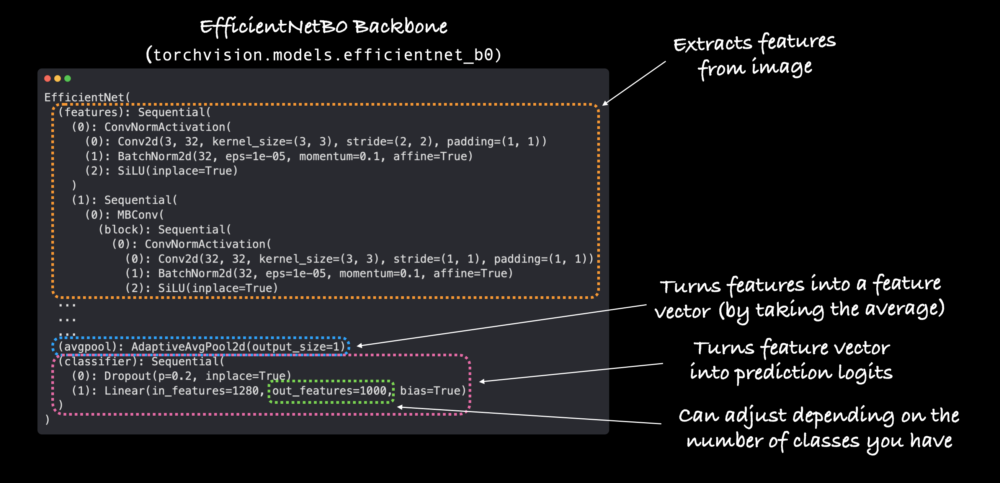
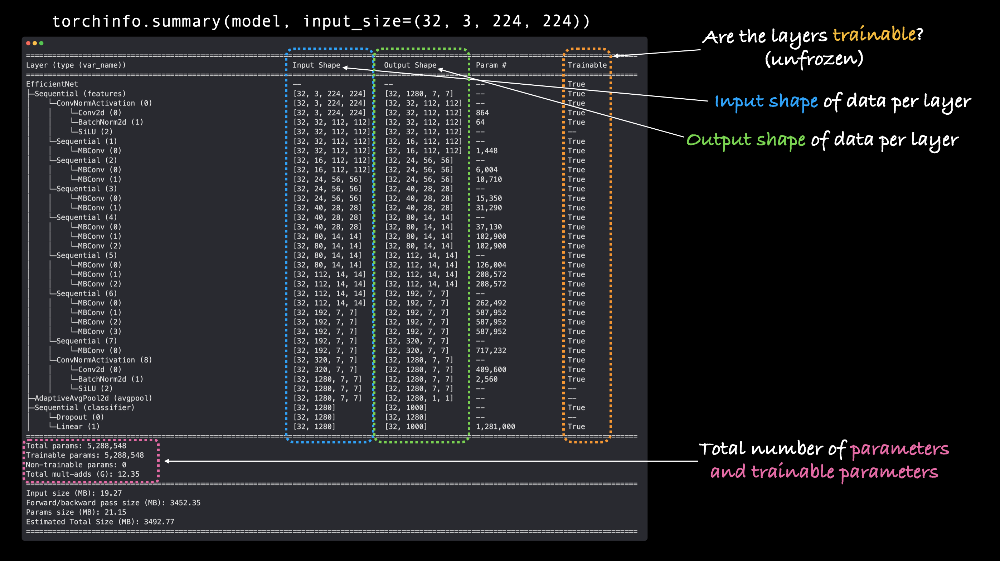
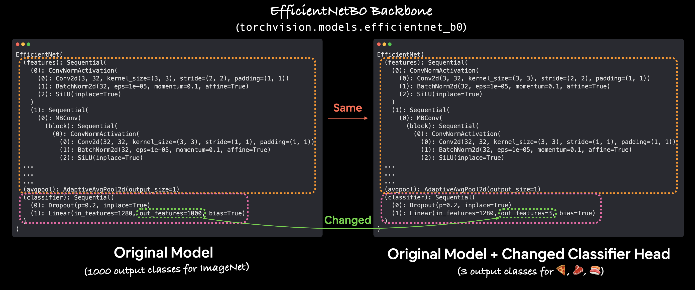
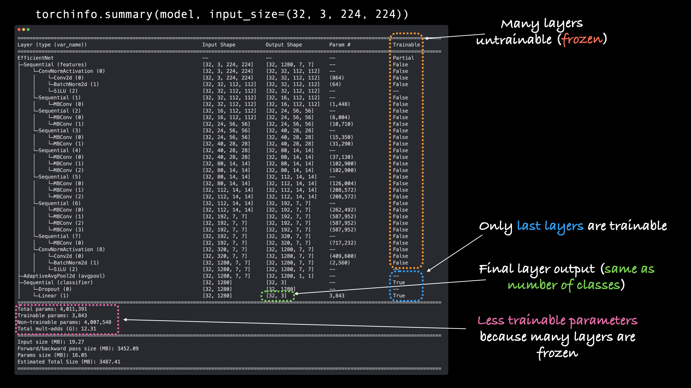
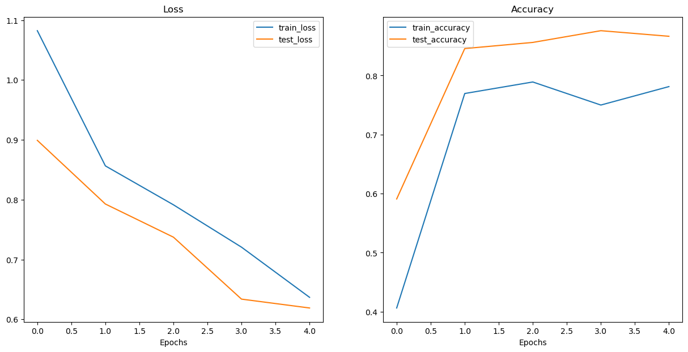
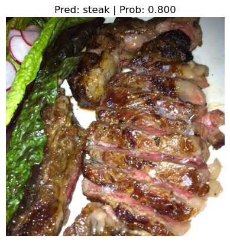
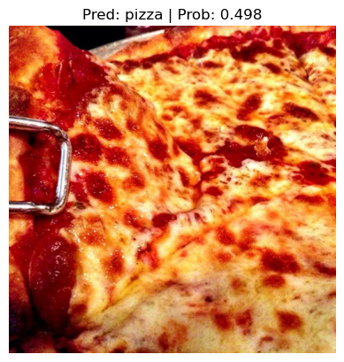
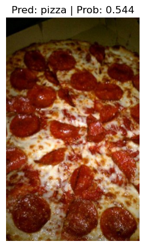
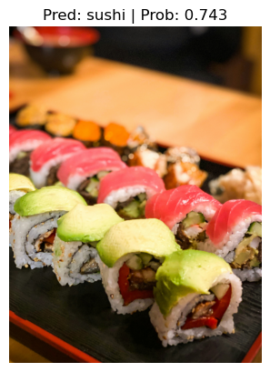

# PyTorch転移学習 - 事前学習済みモデルで画像分類精度を劇的に向上させる

## 概要

これまでいくつかのモデルを手作りで構築してきましたが、性能は期待通りではありませんでした。

**既存の高性能なモデルを自分の問題に活用できないか？**と考えたことはありませんか？

深層学習の世界では、その答えは多くの場合「**Yes**」です。

本記事では、**転移学習（Transfer Learning）**という強力な技術を使って、FoodVision Miniプロジェクトの性能を劇的に向上させる方法を学びます。

## 学習目標

この記事を読むことで、以下のスキルを身につけることができます：

- 転移学習の概念と利点の理解
- PyTorchの事前学習済みモデルの活用方法
- モデルの層の凍結とカスタマイズ技術
- 実際の画像データでの性能検証

## 前提知識

- PyTorchの基本的な使い方
- CNNの基本概念
- 画像分類の基礎知識
- DataLoaderの使用経験

## 転移学習とは？

**転移学習**は、他の問題で学習したモデルのパターン（重みとも呼ばれる）を、自分の問題に応用する技術です。

例えば：
- [ImageNet](https://www.image-net.org/)（数百万枚の様々な物体画像）で学習したコンピュータビジョンモデルのパターンを、FoodVision Miniモデルに活用
- 大量のテキストデータで学習した[言語モデル](https://developers.google.com/machine-learning/glossary#masked-language-model)のパターンを、テキスト分類問題の基盤として使用

基本的な考え方は：**高性能な既存モデルを見つけて、自分の問題に適用する**ことです。

*転移学習をコンピュータビジョンと自然言語処理（NLP）に適用した例。コンピュータビジョンでは、ImageNetの数百万枚の画像で学習したパターンを別の問題に適用し、NLPでは言語モデルがWikipedia全体（またはそれ以上）を読んで言語の構造を学習し、その知識を別の問題に適用します。*

## 転移学習を使う理由

転移学習には主に2つの利点があります：

### 1. 実証済みの既存モデルの活用
自分の問題に類似した問題で証明されたニューラルネットワークアーキテクチャを活用できます。

### 2. 事前学習済みの知識の利用
類似データで**既に学習済み**のモデルを活用できるため、**少ないカスタムデータで優れた結果**を達成できます。

*研究と実践の両方で転移学習の使用が支持されています。スクラッチからの学習と転移学習のどちらが実践的に優れているかを調査した研究では、コストと時間の観点から転移学習が圧倒的に有益であることが判明しました。*

## 事前学習済みモデルの入手先

深層学習の世界は素晴らしい場所です。多くの人々が自分の研究成果を共有しています。

最新の最先端研究のコードと事前学習済みモデルは、論文発表から数日以内にリリースされることが多いです。

| **場所** | **提供内容** | **リンク** | 
| ----- | ----- | ----- |
| **PyTorchドメインライブラリ** | 各PyTorchドメインライブラリ（`torchvision`、`torchtext`）には何らかの形で事前学習済みモデルが含まれています。これらのモデルはPyTorch内で直接動作します。 | [`torchvision.models`](https://pytorch.org/vision/stable/models.html), [`torchtext.models`](https://pytorch.org/text/main/models.html), [`torchaudio.models`](https://pytorch.org/audio/stable/models.html) |
| **HuggingFace Hub** | 世界中の組織による、様々なドメイン（視覚、テキスト、音声など）の事前学習済みモデルのコレクション。多様なデータセットも提供。 | [models](https://huggingface.co/models), [datasets](https://huggingface.co/datasets) | 
| **`timm`（PyTorch Image Models）ライブラリ** | 最新かつ最高のコンピュータビジョンモデルのほぼすべてをPyTorchコードで提供。その他多くの有用なコンピュータビジョン機能も含む。 | [GitHub](https://github.com/rwightman/pytorch-image-models)|
| **Paperswithcode** | 最新の最先端機械学習論文とコード実装のコレクション。異なるタスクでのモデル性能のベンチマークも確認可能。 | [paperswithcode.com](https://paperswithcode.com/) | 

> **重要なポイント：** 上記のような高品質なリソースへのアクセスがあることから、取り組む深層学習問題の開始時には「自分の問題に対する事前学習済みモデルは存在するか？」と問うことが一般的な実践となるべきです。

> **演習：** [`torchvision.models`](https://pytorch.org/vision/stable/models.html)と[HuggingFace Hub Models page](https://huggingface.co/models)を5分間探索してみてください。何を発見しましたか？

## 実装内容

`torchvision.models`から事前学習済みモデルを取得し、FoodVision Mini問題に合わせてカスタマイズします。

| **トピック** | **内容** |
| ----- | ----- |
| **0. 環境設定** | 過去のセクションで有用なコードを多く作成したので、それらをダウンロードして再利用できるようにします。 |
| **1. データ取得** | 使用してきたピザ、ステーキ、寿司の画像分類データセットを取得し、モデル結果の改善を試みます。 |
| **2. DatasetsとDataLoadersの作成** | 第06章で作成した`data_setup.py`スクリプトを使用してDataLoadersを設定します。 |
| **3. 事前学習済みモデルの取得とカスタマイズ** | `torchvision.models`から事前学習済みモデルをダウンロードし、自分の問題に合わせてカスタマイズします。 | 
| **4. モデル訓練** | 新しい事前学習済みモデルがピザ、ステーキ、寿司データセットでどのように動作するかを確認します。前章で作成した訓練関数を使用します。 |
| **5. 損失曲線の可視化によるモデル評価** | 最初の転移学習モデルの性能はどうでしたか？過学習や未学習は発生しましたか？ |
| **6. テストセットの画像での予測** | モデルの評価指標を確認することも重要ですが、テストサンプルでの予測を視覚化することも同様に重要です。*可視化、可視化、可視化！* |

## 0. 環境設定

このセクションに必要なモジュールをインポート/ダウンロードして開始しましょう。

コードの記述を節約するため、前のセクションで作成したPythonスクリプト（`data_setup.py`や`engine.py`など）を活用します。

また、後でモデルの視覚的表現を提供するのに役立つ[`torchinfo`](https://github.com/TylerYep/torchinfo)パッケージも取得します。

```python
# 通常のインポートを続行
import matplotlib.pyplot as plt
import torch
import torchvision

from torch import nn
from torchvision import transforms
from torchinfo import summary
# pip install -q torchinfo
from going_modular import data_setup, engine
```

デバイス非依存コードを設定しましょう。

```python
# デバイス非依存コードの設定
device = "mps" if torch.mps.is_available() else "cpu"
device
```

```
'mps'
```

## 1. データ取得

**転移学習**を使用する前に、データセットが必要です。

転移学習と以前のモデル構築の試みを比較するため、FoodVision Miniで使用してきた同じデータセットをダウンロードします。

GitHubから[`pizza_steak_sushi.zip`](https://github.com/vinsmoke-three/deeplearning-with-pytorch/raw/main/data/pizza_steak_sushi.zip)データセットをダウンロードして解凍するコードを書きましょう。

データが既に存在する場合は再ダウンロードしないようにすることもできます。

```python
import os
import zipfile

from pathlib import Path

import requests

# データフォルダへのパスを設定
data_path = Path("data/")
image_path = data_path / "pizza_steak_sushi"

# 画像フォルダが存在しない場合、ダウンロードして準備...
if image_path.is_dir():
    print(f"{image_path} ディレクトリが存在します。")
else:
    print(f"{image_path} ディレクトリが見つかりません。作成します...")
    image_path.mkdir(parents=True, exist_ok=True)
    
    # ピザ、ステーキ、寿司データをダウンロード
    with open(data_path / "pizza_steak_sushi.zip", "wb") as f:
        request = requests.get("https://github.com/vinsmoke-three/deeplearning-with-pytorch/raw/main/data/pizza_steak_sushi.zip")
        print("ピザ、ステーキ、寿司データをダウンロード中...")
        f.write(request.content)

    # ピザ、ステーキ、寿司データを解凍
    with zipfile.ZipFile(data_path / "pizza_steak_sushi.zip", "r") as zip_ref:
        print("ピザ、ステーキ、寿司データを解凍中...") 
        zip_ref.extractall(image_path)

    # .zipファイルを削除
    os.remove(data_path / "pizza_steak_sushi.zip")
```

```
data/pizza_steak_sushi ディレクトリが存在します。
```

訓練とテストディレクトリへのパスを作成しましょう。

```python
# ディレクトリの設定
train_dir = image_path / "train"
test_dir = image_path / "test"
```

## 2. DatasetsとDataLoadersの作成

### 2.1 `torchvision.models`用の変換の作成（手動作成）

事前学習済みモデルを使用する際は、**モデルに入力するカスタムデータが、モデルの元の訓練データと同じ方法で準備されている**ことが重要です。

`torchvision` v0.13+以前では、`torchvision.models`の事前学習済みモデル用の変換を作成するため、ドキュメントに以下のように記載されていました：

> すべての事前学習済みモデルは、同じ方法で正規化された入力画像を期待します。つまり、形状 (3 x H x W) の3チャンネルRGB画像のミニバッチで、HとWは少なくとも224である必要があります。
>
> 画像は `[0, 1]` の範囲にロードし、`mean = [0.485, 0.456, 0.406]` と `std = [0.229, 0.224, 0.225]` を使用して正規化する必要があります。
>
> 正規化には以下の変換を使用できます：
>
> ```
> normalize = transforms.Normalize(mean=[0.485, 0.456, 0.406],
>                                  std=[0.229, 0.224, 0.225])
> ```

良いニュースは、上記の変換を以下の組み合わせで実現できることです：

| **変換番号** | **必要な変換** | **変換を実行するコード** | 
| ----- | ----- | ----- |
| 1 | サイズ `[batch_size, 3, height, width]` のミニバッチ（heightとwidthは少なくとも224x224） | `torchvision.transforms.Resize()` で画像を `[3, 224, 224]` にリサイズし、`torch.utils.data.DataLoader()` で画像のバッチを作成 |
| 2 | 0と1の間の値 | `torchvision.transforms.ToTensor()` |
| 3 | `[0.485, 0.456, 0.406]` の平均（各カラーチャンネル全体の値） | `torchvision.transforms.Normalize(mean=...)` で画像の平均を調整 |
| 4 | `[0.229, 0.224, 0.225]` の標準偏差（各カラーチャンネル全体の値） | `torchvision.transforms.Normalize(std=...)` で画像の標準偏差を調整 | 

> **注意：** `torchvision.models`の一部の事前学習済みモデルは、`[3, 224, 224]`とは異なるサイズを取ります。例えば、`[3, 240, 240]`を取るものもあります。特定の入力画像サイズについては、ドキュメントを参照してください。

> **質問：** *平均と標準偏差の値はどこから来たのですか？なぜこれを行う必要があるのですか？*
>
> これらの値はデータから計算されました。具体的には、画像のサブセット全体で平均と標準偏差を取ることによって、ImageNetデータセットから計算されました。
>
> また、これを行う*必要*はありません。ニューラルネットワークは通常、適切なデータ分布を自分で把握する能力があります（平均と標準偏差がどこにある必要があるかを自分で計算します）が、開始時に設定することで、ネットワークがより良い性能をより早く達成するのに役立ちます。

上記の手順を実行するために、一連の`torchvision.transforms`を構成しましょう。

```python
# 変換パイプラインを手動で作成（torchvision < 0.13で必要）
manual_transforms = transforms.Compose([
    transforms.Resize((224, 224)), # 1. すべての画像を224x224にリシェイプ（一部のモデルでは異なるサイズが必要な場合があります）
    transforms.ToTensor(), # 2. 画像の値を0と1の間に変換
    transforms.Normalize(mean=[0.485, 0.456, 0.406], # 3. [0.485, 0.456, 0.406]の平均（各カラーチャンネル全体）
                         std=[0.229, 0.224, 0.225]) # 4. [0.229, 0.224, 0.225]の標準偏差（各カラーチャンネル全体）
])
```

素晴らしい！**手動で作成した一連の変換**が画像を準備する準備ができました。訓練とテスト用のDataLoadersを作成しましょう。

`data_setup.py`スクリプトの`create_dataloaders`関数を使用してこれらを作成できます。

モデルが一度に32サンプルのミニバッチを見るように`batch_size=32`を設定します。

そして、`transform=manual_transforms`を設定することで、上記で作成した変換パイプラインを使用して画像を変換できます。

```python
# 訓練とテスト用のDataLoadersを作成し、クラス名のリストも取得
train_dataloader, test_dataloader, class_names = data_setup.create_dataloaders(train_dir=str(train_dir),
                                                                               test_dir=str(test_dir),
                                                                               transform=manual_transforms, # 画像をリサイズ、0〜1に変換、正規化
                                                                               batch_size=32) # ミニバッチサイズを32に設定

train_dataloader, test_dataloader, class_names
```

```
(<torch.utils.data.dataloader.DataLoader at 0x3537e8170>,
 <torch.utils.data.dataloader.DataLoader at 0x35296dd00>,
 ['pizza', 'steak', 'sushi'])
```

### 2.2 `torchvision.models`用の変換の作成（自動作成）

前述のように、事前学習済みモデルを使用する際は、**モデルに入力するカスタムデータが、モデルの元の訓練データと同じ方法で準備されている**ことが重要です。

上記では、事前学習済みモデル用の変換を手動で作成する方法を見ました。

しかし、`torchvision` v0.13+以降、自動変換作成機能が追加されました。

`torchvision.models`からモデルを設定し、使用したい事前学習済みモデルの重みを選択する場合、例えば以下を使用したいとします：
    
```python
weights = torchvision.models.EfficientNet_B0_Weights.DEFAULT
```

ここで：
* `EfficientNet_B0_Weights`は使用したいモデルアーキテクチャの重みです（`torchvision.models`には多くの異なるモデルアーキテクチャオプションがあります）
* `DEFAULT`は*利用可能な最高*の重み（ImageNetでの最高性能）を意味します
    * **注意：** 選択するモデルアーキテクチャによって、`IMAGENET_V1`や`IMAGENET_V2`などの他のオプションも表示される場合があります。一般的に、バージョン番号が高いほど良好です。ただし、利用可能な最高のものが必要な場合は、`DEFAULT`が最も簡単なオプションです。詳細については、[`torchvision.models`ドキュメント](https://pytorch.org/vision/main/models.html)を参照してください。
    
試してみましょう。

```python
# 事前学習済みモデルの重みのセットを取得
weights = torchvision.models.EfficientNet_B0_Weights.DEFAULT # .DEFAULT = ImageNetでの事前学習から利用可能な最高の重み
weights
```

```
EfficientNet_B0_Weights.IMAGENET1K_V1
```

そして、`weights`に関連する変換にアクセスするために、`transforms()`メソッドを使用できます。

これは本質的に「ImageNet上で`EfficientNet_B0_Weights`を訓練するために使用されたデータ変換を取得する」と言っています。

```python
# 事前学習済み重みを作成するために使用された変換を取得
auto_transforms = weights.transforms()
auto_transforms
```

```
ImageClassification(
    crop_size=[224]
    resize_size=[256]
    mean=[0.485, 0.456, 0.406]
    std=[0.229, 0.224, 0.225]
    interpolation=InterpolationMode.BICUBIC
)
```

`auto_transforms`が`manual_transforms`と非常に似ていることに注目してください。唯一の違いは、`auto_transforms`が選択したモデルアーキテクチャに付属していたのに対し、`manual_transforms`は手動で作成する必要があったことです。

`weights.transforms()`を通じて自動的に変換を作成する利点は、事前学習済みモデルが訓練時に使用したのと同じデータ変換を確実に使用できることです。

ただし、自動作成された変換を使用するトレードオフは、カスタマイズの欠如です。

以前と同様に`auto_transforms`を使用して`create_dataloaders()`でDataLoadersを作成できます。

```python
# 訓練とテスト用のDataLoadersを作成し、クラス名のリストも取得
train_dataloader, test_dataloader, class_names = data_setup.create_dataloaders(train_dir=str(train_dir),
                                                                               test_dir=str(test_dir),
                                                                               transform=auto_transforms, # 事前学習済みモデルと同じデータ変換を自分のデータに実行
                                                                               batch_size=32) # ミニバッチサイズを32に設定

train_dataloader, test_dataloader, class_names
```

```
(<torch.utils.data.dataloader.DataLoader at 0x35466bfb0>,
 <torch.utils.data.dataloader.DataLoader at 0x3537bbda0>,
 ['pizza', 'steak', 'sushi'])
```

## 3. 事前学習済みモデルの取得

さて、ここからが楽しい部分です！

過去数回のノートブックでは、PyTorchニューラルネットワークをゼロから構築してきました。

それは良いスキルですが、モデルの性能は期待通りではありませんでした。

そこで**転移学習**の出番です。

転移学習の全体的なアイデアは、**自分の問題空間と類似した問題で既に良好な性能を示しているモデルを取得し、自分の用途にカスタマイズする**ことです。

コンピュータビジョン問題（FoodVision Miniでの画像分類）に取り組んでいるので、[`torchvision.models`](https://pytorch.org/vision/stable/models.html#classification)で事前学習済み分類モデルを見つけることができます。

ドキュメントを探索すると、以下のような一般的なコンピュータビジョンアーキテクチャバックボーンが多数見つかります：

| **アーキテクチャバックボーン** | **コード** |
| ----- | ----- |
| [ResNet](https://arxiv.org/abs/1512.03385) | `torchvision.models.resnet18()`, `torchvision.models.resnet50()`... | 
| [VGG](https://arxiv.org/abs/1409.1556)（TinyVGGで使用したものと類似） | `torchvision.models.vgg16()` | 
| [EfficientNet](https://arxiv.org/abs/1905.11946) | `torchvision.models.efficientnet_b0()`, `torchvision.models.efficientnet_b1()`... | 
| [VisionTransformer](https://arxiv.org/abs/2010.11929)（ViT） | `torchvision.models.vit_b_16()`, `torchvision.models.vit_b_32()`... | 
| [ConvNeXt](https://arxiv.org/abs/2201.03545) | `torchvision.models.convnext_tiny()`, `torchvision.models.convnext_small()`... |
| `torchvision.models`で利用可能なその他 | `torchvision.models...` | 

### 3.1 どの事前学習済みモデルを使用すべきか？

それは問題や作業しているデバイスによって異なります。

一般的に、モデル名の数字が高いほど（例：`efficientnet_b0()` → `efficientnet_b1()` → `efficientnet_b7()`）、*性能は向上*しますが、*モデルは大きく*なります。

性能の向上は*常に良い*と思うかもしれませんよね？

それは正しいですが、**一部の高性能モデルは一部のデバイスには大きすぎます**。

例えば、モバイルデバイスでモデルを実行したい場合、デバイスの限られた計算リソースを考慮する必要があり、より小さなモデルを探すことになります。

しかし、無制限の計算力がある場合、[*The Bitter Lesson*](http://www.incompleteideas.net/IncIdeas/BitterLesson.html)が述べるように、可能な限り大きく、計算量の多いモデルを選ぶでしょう。

この**性能 vs. 速度 vs. サイズ**のトレードオフを理解することは、時間と実践を通じて身につきます。

私にとっては、`efficientnet_bX`モデルで良いバランスを見つけました。

### 3.2 事前学習済みモデルの設定

使用する事前学習済みモデルは[`torchvision.models.efficientnet_b0()`](https://pytorch.org/vision/main/models/generated/torchvision.models.efficientnet_b0.html)です。

このアーキテクチャは論文*[EfficientNet: Rethinking Model Scaling for Convolutional Neural Networks](https://arxiv.org/abs/1905.11946)*からのものです。

*作成予定の内容の例：`torchvision.models`の事前学習済み[`EfficientNet_B0`モデル](https://ai.googleblog.com/2019/05/efficientnet-improving-accuracy-and.html)の出力層をピザ、ステーキ、寿司画像の分類用途に調整します。*

変換を作成するために使用したのと同じコードを使用して、`EfficientNet_B0`事前学習済みImageNet重みを設定できます。

```python
weights = torchvision.models.EfficientNet_B0_Weights.DEFAULT # .DEFAULT = ImageNetで利用可能な最高の重み
```

これは、モデルが既に数百万枚の画像で訓練されており、画像データの良好な基本表現を持っていることを意味します。

このPyTorch版の事前学習済みモデルは、ImageNetの1000クラス全体で約77.7%の精度を達成することができます。

また、ターゲットデバイスに送信します。

```python
# 事前学習済み重みでモデルを設定し、ターゲットデバイスに送信
weights = torchvision.models.EfficientNet_B0_Weights.DEFAULT # .DEFAULT = 利用可能な最高の重み 
model = torchvision.models.efficientnet_b0(weights=weights).to(device)
model.classifier
#model # コメントアウトを解除して出力（非常に長いです）
```

```
Sequential(
  (0): Dropout(p=0.2, inplace=True)
  (1): Linear(in_features=1280, out_features=1000, bias=True)
)
```

モデルを印刷すると、以下のようなものが得られます：



多くの層があります。

これは転移学習の利点の1つです。世界で最高のエンジニアの一部によって作られた既存のモデルを取得し、自分の問題に適用することです。

`efficientnet_b0`は主に3つの部分で構成されています：

1. **`features`** - 視覚データの基本表現を学習するための畳み込み層とその他の様々な活性化層のコレクション（この基本表現/層のコレクションは**特徴量**または**特徴抽出器**と呼ばれることが多く、「モデルの基本層は画像の異なる**特徴量**を学習する」）
2. **`avgpool`** - `features`層の出力の平均を取り、**特徴ベクトル**に変換
3. **`classifier`** - **特徴ベクトル**を必要な出力クラス数と同じ次元のベクトルに変換（`efficientnet_b0`はImageNetで事前学習されており、ImageNetには1000クラスがあるため、`out_features=1000`がデフォルト）

### 3.3 `torchinfo.summary()`でモデルの要約を取得

モデルについてさらに学ぶために、`torchinfo`の[`summary()`メソッド](https://github.com/TylerYep/torchinfo#documentation)を使用しましょう。

以下を渡します：
* `model` - 要約を取得したいモデル
* `input_size` - モデルに渡したいデータの形状。`efficientnet_b0`の場合、入力サイズは`(batch_size, 3, 224, 224)`ですが、[`efficientnet_bX`の他のバリアントは異なる入力サイズを持ちます](https://github.com/pytorch/vision/blob/d2bfd639e46e1c5dc3c177f889dc7750c8d137c7/references/classification/train.py#L92-L93)
    * **注意：** 多くの現代的なモデルは[`torch.nn.AdaptiveAvgPool2d()`](https://pytorch.org/docs/stable/generated/torch.nn.AdaptiveAvgPool2d.html)のおかげで、様々なサイズの入力画像を処理できます。この層は、必要に応じて与えられた入力の`output_size`を適応的に調整します。異なるサイズの入力画像を`summary()`やモデルに渡すことで試すことができます
* `col_names` - モデルについて表示したい様々な情報列
* `col_width` - 要約の列の幅
* `row_settings` - 行に表示する機能

```python
# torchinfoを使用して要約を印刷（実際の出力についてはコメントアウトを解除）
summary(model=model, 
        input_size=(32, 3, 224, 224), # これが "input_size" であることを確認、"input_shape" ではありません
        # col_names=["input_size"], # より小さな出力についてはコメントアウトを解除
        col_names=["input_size", "output_size", "num_params", "trainable"],
        col_width=20,
        row_settings=["var_names"]
) 
```



うわあ！これは大きなモデルです！

要約の出力から、画像データがモデルを通過する際の様々な入力と出力の形状変化をすべて見ることができます。

そして、データの異なるパターンを認識するための訓練済みパラメータ（事前学習済み重み）が大量にあります。

参考として、前のセクションのモデル**TinyVGGは8,083パラメータでしたが、`efficientnet_b0`は5,288,548パラメータで、約654倍の増加**です！

どう思いますか、これはより良い性能を意味するでしょうか？

### 3.4 ベースモデルの凍結と出力層の調整

転移学習のプロセスは通常以下のように進みます：事前学習済みモデルの一部のベース層（通常は`features`セクション）を凍結し、出力層（ヘッド/分類器層とも呼ばれる）を自分のニーズに合わせて調整します。



*事前学習済みモデルの出力層を自分の問題に合うように変更することで、出力をカスタマイズできます。元の`torchvision.models.efficientnet_b0()`は、訓練されたデータセットであるImageNetに1000クラスがあるため、`out_features=1000`で提供されます。しかし、ピザ、ステーキ、寿司の画像を分類する私たちの問題では、`out_features=3`のみが必要です。*

`efficientnet_b0`モデルの`features`セクションのすべての層/パラメータを凍結しましょう。

> **注意：** 層を*凍結*するということは、訓練中にそれらをそのまま保持することを意味します。例えば、モデルに事前学習済み層がある場合、それらを*凍結*するということは、「訓練中にこれらの層のパターンを変更せず、そのまま保持する」ということです。本質的に、ImageNetから学習したモデルの事前学習済み重み/パターンをバックボーンとして保持し、出力層のみを変更したいのです。

`requires_grad=False`属性を設定することで、`features`セクションのすべての層/パラメータを凍結できます。

`requires_grad=False`のパラメータについて、PyTorchは勾配更新を追跡せず、結果として、これらのパラメータは訓練中にオプティマイザーによって変更されません。

本質的に、`requires_grad=False`のパラメータは「訓練不可能」または「凍結」されています。

```python
# モデルの "features" セクション（特徴抽出器）のすべてのベース層を requires_grad=False に設定して凍結
for param in model.features.parameters():
    param.requires_grad = False
```

特徴抽出器層が凍結されました！

事前学習済みモデルの`classifier`部分を私たちのニーズに合わせて調整しましょう。

現在、事前学習済みモデルには、ImageNetに1000クラスがあるため`out_features=1000`があります。

しかし、私たちには1000クラスはなく、ピザ、ステーキ、寿司の3つしかありません。

新しい一連の層を作成することで、モデルの`classifier`部分を変更できます。

現在の`classifier`は以下で構成されています：

```
(classifier): Sequential(
    (0): Dropout(p=0.2, inplace=True)
    (1): Linear(in_features=1280, out_features=1000, bias=True)
```

[`torch.nn.Dropout(p=0.2, inplace=True)`](https://pytorch.org/docs/stable/generated/torch.nn.Dropout.html)を使用して`Dropout`層を同じまま保ちます。

> **注意：** [Dropout層](https://developers.google.com/machine-learning/glossary#dropout_regularization)は、確率`p`で2つのニューラルネットワーク層間の接続をランダムに削除します。例えば、`p=0.2`の場合、ニューラルネットワーク層間の接続の20%が各パスでランダムに削除されます。この実践は、残りの接続が他の接続の削除を補償するために特徴量を学習することを確実にすることで、モデルを正則化（過学習を防ぐ）することを意図しています（これらの残りの特徴量は*より一般的*であることを願って）。

`Linear`出力層については`in_features=1280`を保持しますが、`out_features`値を`class_names`の長さ（`len(['pizza', 'steak', 'sushi']) = 3`）に変更します。

新しい`classifier`層は`model`と同じデバイス上にある必要があります。

```python
# 手動シードを設定
torch.manual_seed(42)
torch.cuda.manual_seed(42)

# class_namesの長さを取得（各クラスに1つの出力ユニット）
output_shape = len(class_names)

# 分類器層を再作成し、ターゲットデバイスにシードする
model.classifier = torch.nn.Sequential(
    torch.nn.Dropout(p=0.2, inplace=True), 
    torch.nn.Linear(in_features=1280, 
                    out_features=output_shape, # クラス数と同じ出力ユニット数
                    bias=True)).to(device)
```

素晴らしい！出力層が更新されました。モデルの別の要約を取得して、何が変わったかを見てみましょう。

```python
# 特徴量を凍結し、出力分類器層を変更した*後*の要約を実行（実際の出力についてはコメントアウトを解除）
summary(model, 
        input_size=(32, 3, 224, 224), # これが "input_size" であることを確認、"input_shape" ではありません (batch_size, color_channels, height, width)
        verbose=0,
        col_names=["input_size", "output_size", "num_params", "trainable"],
        col_width=20,
        row_settings=["var_names"]
)
```



おお、おお！ここにはかなりの変化があります！

それらを見ていきましょう：

* **Trainable列** - 多くのベース層（`features`部分の層）のTrainable値が`False`になっていることがわかります。これは、属性`requires_grad=False`を設定したためです。これを変更しない限り、これらの層は将来の訓練で更新されません。
* **`classifier`の出力形状** - モデルの`classifier`部分のOutput Shape値が`[32, 1000]`ではなく`[32, 3]`になりました。Trainable値も`True`です。これは、そのパラメータが訓練中に更新されることを意味します。本質的に、`features`部分を使用して`classifier`部分に画像の基本表現を供給し、`classifier`層がその基本表現が私たちの問題とどのように整合するかを学習します。
* **訓練可能パラメータの減少** - 以前は5,288,548の訓練可能パラメータがありました。しかし、モデルの多くの層を凍結し、`classifier`のみを訓練可能のままにしたため、現在は3,843の訓練可能パラメータのみです（TinyVGGモデルよりもさらに少ない）。ただし、4,007,548の非訓練可能パラメータもあり、これらは`classifier`層に供給するための入力画像の基本表現を作成します。

> **注意：** モデルの訓練可能パラメータが多いほど、より多くの計算力/より長い訓練時間が必要です。モデルのベース層を凍結し、より少ない訓練可能パラメータを残すことで、モデルはかなり高速に訓練されるはずです。これは転移学習の大きな利点の1つで、自分の問題に類似した問題で訓練されたモデルの既に学習済みパラメータを取得し、自分の問題に合うように出力をわずかに調整するだけです。

## 4. モデル訓練

半凍結され、カスタマイズされた`classifier`を持つ事前学習済みモデルができたので、転移学習の実際の効果を見てみましょう。

訓練を開始するために、損失関数とオプティマイザーを作成しましょう。

まだマルチクラス分類に取り組んでいるので、損失関数には`nn.CrossEntropyLoss()`を使用します。

オプティマイザーは`lr=0.001`で`torch.optim.Adam()`を継続して使用します。

```python
# 損失とオプティマイザーを定義
loss_fn = nn.CrossEntropyLoss()
optimizer = torch.optim.Adam(model.parameters(), lr=0.001)
```

```python
# ランダムシードを設定
torch.manual_seed(42)
torch.mps.manual_seed(42)

# タイマーを開始
from timeit import default_timer as timer 
start_time = timer()

# 訓練を設定し、結果を保存
results = engine.train(model=model.to(device=device),
                       train_dataloader=train_dataloader,
                       test_dataloader=test_dataloader,
                       optimizer=optimizer,
                       loss_fn=loss_fn,
                       epochs=5,
                       device=device,
                       writer=None)

# タイマーを終了し、かかった時間を印刷
end_time = timer()
print(f"[INFO] 総訓練時間: {end_time-start_time:.3f} 秒")
```

```
  0%|          | 0/5 [00:00<?, ?it/s]/Users/vinsmoke/miniconda3/envs/deep-learning/lib/python3.12/site-packages/torch/utils/data/dataloader.py:683: UserWarning: 'pin_memory' argument is set as true but not supported on MPS now, then device pinned memory won't be used.
  warnings.warn(warn_msg)
 20%|██        | 1/5 [00:02<00:09,  2.35s/it]

Epoch: 1 | train_loss: 1.0823 | train_acc: 0.4062 | test_loss: 0.8991 | test_acc: 0.5909

 40%|████      | 2/5 [00:03<00:05,  1.71s/it]

Epoch: 2 | train_loss: 0.8564 | train_acc: 0.7695 | test_loss: 0.7927 | test_acc: 0.8456

 60%|██████    | 3/5 [00:04<00:03,  1.51s/it]

Epoch: 3 | train_loss: 0.7914 | train_acc: 0.7891 | test_loss: 0.7373 | test_acc: 0.8561

 80%|████████  | 4/5 [00:06<00:01,  1.41s/it]

Epoch: 4 | train_loss: 0.7206 | train_acc: 0.7500 | test_loss: 0.6338 | test_acc: 0.8759

100%|██████████| 5/5 [00:07<00:00,  1.48s/it]

Epoch: 5 | train_loss: 0.6368 | train_acc: 0.7812 | test_loss: 0.6190 | test_acc: 0.8665
[INFO] 総訓練時間: 7.524 秒
```

うわあ！モデルはかなり高速に訓練されました。

そして、以前のモデル結果を大幅に上回ったようです！

`efficientnet_b0`バックボーンを使用することで、モデルはテストデータセットでほぼ85%+の精度を達成し、TinyVGGで達成できたものの*約2倍*です。

数行のコードでダウンロードしたモデルとしては悪くありません。

## 5. 損失曲線の可視化によるモデル評価

モデルはかなり良好に実行されているようです。

時間の経過とともに訓練がどのようになっているかを確認するために、損失曲線をプロットしてみましょう。

`plot_loss_curves()`関数を使用して損失曲線をプロットできます。

この関数は[`helper_functions.py`](https://github.com/vinsmoke-three/deeplearning-with-pytorch/blob/main/helper_functions.py)スクリプトに保存されているので、インポートを試み、持っていない場合はスクリプトをダウンロードします。

```python
# helper_functions.pyからplot_loss_curves()関数を取得
from helper_functions import plot_loss_curves

# モデルの損失曲線をプロット
plot_loss_curves(results)
```



これらは素晴らしい損失曲線です！

両方のデータセット（訓練とテスト）の損失が正しい方向に向かっているようです。

精度値についても同様で、上昇傾向にあります。

これは**転移学習**の力を示しています。事前学習済みモデルを使用することで、少ないデータで短時間でかなり良い結果を得ることができます。

モデルをより長く訓練したり、より多くのデータを追加したりすると何が起こるか気になりませんか？

## 6. テストセットの画像での予測

モデルは定量的には良好に実行されているようですが、定性的にはどうでしょうか？

テストセット（訓練中に見られない）の画像でモデルを使って予測を行い、それらをプロットして確認してみましょう。

*可視化、可視化、可視化！*

モデルが画像で予測を行うために覚えておくべきことの1つは、画像がモデルが訓練された画像と*同じ*形式である必要があることです。

これは、画像が以下を持つ必要があることを意味します：

* **同じ形状** - 画像がモデルが訓練されたものと異なる形状の場合、形状エラーが発生します
* **同じデータ型** - 画像が異なるデータ型（例：`torch.int8` vs `torch.float32`）の場合、データ型エラーが発生します
* **同じデバイス** - 画像がモデルと異なるデバイス上にある場合、デバイスエラーが発生します
* **同じ変換** - モデルが特定の方法で変換された画像（例：特定の平均と標準偏差で正規化）で訓練され、異なる方法で変換された画像で予測を試みる場合、これらの予測は外れる可能性があります

> **注意：** これらの要件は、訓練済みモデルで予測を行う場合のあらゆる種類のデータに適用されます。予測したいデータは、モデルが訓練されたのと同じ形式である必要があります。

これらすべてを実行するために、以下を行う`pred_and_plot_image()`関数を作成します：

1. 訓練済みモデル、クラス名のリスト、ターゲット画像へのファイルパス、画像サイズ、変換、ターゲットデバイスを受け取る
2. [`PIL.Image.open()`](https://pillow.readthedocs.io/en/stable/reference/Image.html#PIL.Image.open)で画像を開く
3. 画像の変換を作成（これは上記で作成した`manual_transforms`にデフォルトするか、`weights.transforms()`から生成された変換を使用できます）
4. モデルがターゲットデバイス上にあることを確認
5. `model.eval()`でモデル評価モードをオンにし（これは推論では使用されない`nn.Dropout()`などの層をオフにします）、推論モードコンテキストマネージャーを使用
6. ステップ3で作成した変換でターゲット画像を変換し、`torch.unsqueeze(dim=0)`で追加のバッチ次元を追加して、入力画像が`[batch_size, color_channels, height, width]`の形状になるようにする
7. 画像をモデルに渡してターゲットデバイス上にあることを確認し、画像で予測を行う
8. `torch.softmax()`でモデルの出力ロジットを予測確率に変換
9. `torch.argmax()`でモデルの予測確率を予測ラベルに変換
10. `matplotlib`で画像をプロットし、タイトルをステップ9の予測ラベルとステップ8の予測確率に設定

```python
from typing import List, Tuple

from PIL import Image

# 1. 訓練済みモデル、クラス名、画像パス、画像サイズ、変換、ターゲットデバイスを受け取る
def pred_and_plot_image(model: torch.nn.Module,
                        image_path: str, 
                        class_names: List[str],
                        image_size: Tuple[int, int] = (224, 224),
                        transform: torchvision.transforms = None,
                        device: torch.device=device):
    
    # 2. 画像を開く
    img = Image.open(image_path)

    # 3. 画像の変換を作成（存在しない場合）
    if transform is not None:
        image_transform = transform
    else:
        image_transform = transforms.Compose([
            transforms.Resize(image_size),
            transforms.ToTensor(),
            transforms.Normalize(mean=[0.485, 0.456, 0.406],
                                 std=[0.229, 0.224, 0.225]),
        ])

    ### 画像で予測 ### 

    # 4. モデルがターゲットデバイス上にあることを確認
    model.to(device)

    # 5. モデル評価モードと推論モードをオンにする
    model.eval()
    with torch.inference_mode():
      # 6. 画像を変換し、追加の次元を追加（モデルは[batch_size, color_channels, height, width]のサンプルを必要とします）
      transformed_image = image_transform(img).unsqueeze(dim=0)

      # 7. 追加の次元を持つ画像で予測を行い、ターゲットデバイスに送信
      target_image_pred = model(transformed_image.to(device))

    # 8. ロジット -> 予測確率に変換（マルチクラス分類にはtorch.softmax()を使用）
    target_image_pred_probs = torch.softmax(target_image_pred, dim=1)

    # 9. 予測確率 -> 予測ラベルに変換
    target_image_pred_label = torch.argmax(target_image_pred_probs, dim=1)

    # 10. 予測ラベルと確率で画像をプロット
    plt.figure()
    plt.imshow(img)
    plt.title(f"予測: {class_names[target_image_pred_label]} | 確率: {target_image_pred_probs.max():.3f}")
    plt.axis(False)
```

テストセットからいくつかのランダムな画像で予測を行ってテストしてみましょう。

`list(Path(test_dir).glob("*/*.jpg"))`を使用してすべてのテスト画像パスのリストを取得できます。`glob()`メソッドの星は「このパターンに一致するファイル」を意味し、つまり`.jpg`で終わるファイル（すべての画像）を指します。

そして、Pythonの[`random.sample(population, k)`](https://docs.python.org/3/library/random.html#random.sample)を使用してこれらの一部をランダムにサンプリングできます。ここで`population`はサンプリングするシーケンス、`k`は取得するサンプル数です。

```python
# テストセットからランダムな画像パスのリストを取得
import random
num_images_to_plot = 3
test_image_path_list = list(Path(test_dir).glob("*/*.jpg")) # テストデータからすべての画像パスのリストを取得
test_image_path_sample = random.sample(population=test_image_path_list, # すべてのテスト画像パスを通る
                                       k=num_images_to_plot) # 予測とプロットのために 'k' 個の画像パスをランダムに選択

# 画像で予測を行いプロット
for image_path in test_image_path_sample:
    pred_and_plot_image(model=model, 
                        image_path=str(image_path),
                        class_names=class_names,
                        # transform=weights.transforms(), # オプションで事前学習済みモデル重みから指定された変換を渡す
                        image_size=(224, 224))
```





わーい！これらの予測は、TinyVGGモデルが以前に行っていたものよりもはるかに良く見えます。

### 6.1 カスタム画像での予測

モデルはテストセットのデータで定性的に良好に実行されているようです。しかし、自分のカスタム画像ではどうでしょうか？

ここに機械学習の本当の楽しさがあります！訓練やテストセット以外の自分のカスタムデータで予測を行うことです。

カスタム画像でモデルをテストするために、信頼できる`sushi.jpg`画像（寿司の画像）をインポートしましょう。

そして、上記で作成した`pred_and_plot_image()`関数に渡して何が起こるかを見てみましょう。

```python
# カスタム画像をダウンロード
import requests

# カスタム画像パスを設定
custom_image_path = data_path / "sushi.jpg"

# カスタム画像で予測
pred_and_plot_image(model=model,
                    image_path=str(custom_image_path),
                    class_names=class_names)
```



素晴らしい！モデルは寿司の画像を高い確信度で正しく分類しました。

## まとめ

この記事では、PyTorchの転移学習を使用して画像分類モデルの性能を劇的に向上させる方法を学びました。

### 主要な学習ポイント

* **転移学習の威力** - 比較的少ないカスタムデータで優秀な結果を得ることができる
* **事前学習済みモデルの活用** - ImageNetで訓練されたEfficientNet_B0を使用して85%以上の精度を達成
* **層の凍結とカスタマイズ** - ベース層を凍結し、分類器層のみを調整することで効率的な訓練を実現
* **適切なデータ前処理** - 事前学習済みモデルと同じ変換を適用することの重要性

### 技術的なハイライト

- **パラメータ数の比較**: TinyVGG（8,083パラメータ）vs EfficientNet_B0（5,288,548パラメータ）
- **訓練時間**: わずか7.5秒で5エポック完了
- **精度向上**: 前回の約50%から85%以上へと大幅改善
- **訓練可能パラメータ**: 層の凍結により3,843パラメータのみが更新対象

### 実装で使用した主要技術

1. **`torchvision.models`からの事前学習済みモデル取得**
2. **特徴量抽出器の凍結** (`requires_grad=False`)
3. **分類器ヘッドのカスタマイズ** (出力次元を3に変更)
4. **適切なデータ変換** (ImageNetと同じ正規化)
5. **効率的な訓練戦略** (少ない訓練可能パラメータ)

## 重要なポイント

* **転移学習**は、比較的少ないカスタムデータで優れた結果を得ることを可能にします
* 転移学習の力を知ることで、すべての問題の開始時に「自分の問題に対する既存の高性能モデルは存在するか？」と問うことが良いアイデアです
* 事前学習済みモデルを使用する場合、カスタムデータが元のモデルが訓練されたのと同じ方法でフォーマット/前処理されていることが重要です。そうでないと性能が低下する可能性があります
* カスタムデータで予測する場合も同様で、カスタムデータがモデルが訓練されたデータと同じ形式であることを確認してください
* PyTorchドメインライブラリ、HuggingFace Hub、`timm`（PyTorch Image Models）などのライブラリから事前学習済みモデルを見つけることができる場所がいくつかあります

転移学習は現代の深層学習における最も強力な技術の一つです。この知識を活用して、あなた自身の画像分類プロジェクトに取り組んでみてください！