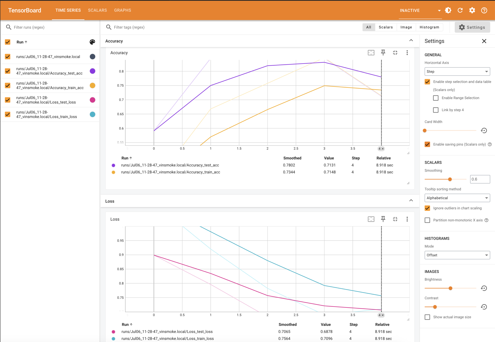
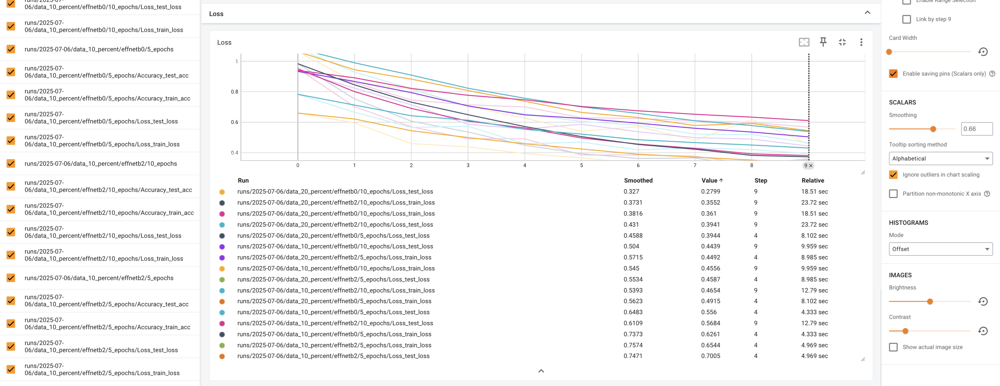
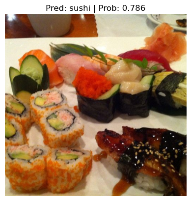
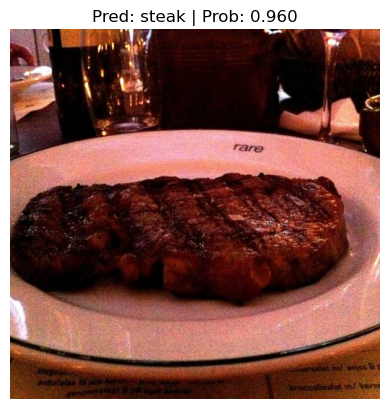
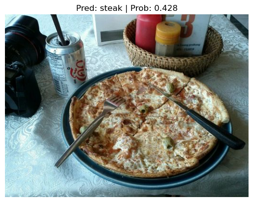

# PyTorch実験追跡 - FoodVision Mini実験プロジェクト

## 概要

機械学習プロジェクトが進むにつれて、複数のモデルを訓練し、その結果を追跡することが重要になります。この記事では、TensorBoardを使用してPyTorchの実験を効率的に追跡する方法を学習します。ピザ、ステーキ、寿司を分類するFoodVision Miniプロジェクトを通じて、実際の実験追跡ワークフローを体験していきます。

## 学習目標

- 実験追跡の重要性と方法を理解する
- TensorBoardを使用してPyTorchの実験を記録する
- 複数のモデルと設定を系統的に比較する
- 最適なモデルを選択し、評価する方法を学ぶ

## 前提知識

- PyTorchの基本的な使用方法
- 転移学習の概念
- 画像分類タスクの理解
- Python プログラミングの基礎

## 実験追跡とは何か？

機械学習と深層学習は非常に実験的な分野です。データ、モデルアーキテクチャ、訓練設定の様々な組み合わせの結果を追跡し、何が効果的で何がそうでないかを把握するために**実験追跡**が重要になります。

### なぜ実験を追跡するのか？

少数のモデルを実行している場合は、印刷出力と辞書で結果を追跡することも可能です。しかし、実験数が増加するにつれて、この単純な方法では管理が困難になります。

## 実験追跡方法の比較

| **方法** | **設定** | **利点** | **欠点** | **コスト** |
| ----- | ----- | ----- | ----- | ----- |
| Python辞書、CSVファイル、印刷出力 | なし | 設定が簡単、純粋なPythonで実行 | 大量の実験の追跡が困難 | 無料 |
| [TensorBoard](https://www.tensorflow.org/tensorboard/get_started) | 最小限、[`tensorboard`](https://pypi.org/project/tensorboard/)をインストール | PyTorchとの統合、広く認知され使用、簡単にスケール | 他のオプションほどユーザー体験が良くない | 無料 |
| [Weights & Biases](https://wandb.ai/site/experiment-tracking) | 最小限、[`wandb`](https://docs.wandb.ai/quickstart/)をインストール、アカウント作成 | 優れたユーザー体験、実験の公開、ほぼ全て追跡可能 | PyTorchの外部リソースが必要 | 個人使用は無料 | 
| [MLFlow](https://mlflow.org/) | 最小限、`mlflow`をインストールして追跡開始 | 完全オープンソースのMLOpsライフサイクル管理、多くの統合 | リモート追跡サーバーの設定が他より困難 | 無料 | 

## 環境設定

まず、必要なライブラリをインポートし、デバイスを設定します：

```python
# 必要なライブラリのインポート
import matplotlib.pyplot as plt
import torch
import torchvision

from torch import nn
from torchvision import transforms
from torchinfo import summary
from going_modular import data_setup, engine

# デバイス設定（Apple SiliconのMacではMPS、それ以外はCPU）
device = "mps" if torch.mps.is_available() else "cpu"
device
```

**実行結果:**
```
'mps'
```

### シード設定用のヘルパー関数作成

実験の再現性を確保するために、ランダムシードを設定する関数を作成します：

```python
def set_seeds(seed: int=42):
    """PyTorchの操作用にランダムシードを設定する
    
    Args:
        seed (int, optional): 設定するランダムシード。デフォルトは42
    """
    # 一般的なtorch操作用のシード設定
    torch.manual_seed(seed)
    # MPSでのtorch操作用のシード設定
    torch.mps.manual_seed(seed)
```

## 1. データの取得

画像分類データセット（ピザ、ステーキ、寿司）をダウンロードします：

```python
import os
import zipfile
from pathlib import Path
import requests

def download_data(source: str, 
                  destination: str,
                  remove_source: bool = True) -> Path:
    """ソースからzipファイルをダウンロードし、指定先に展開する
    
    Args:
        source (str): zipファイルのURL
        destination (str): 展開先ディレクトリ
        remove_source (bool): ダウンロード後にソースファイルを削除するか
    
    Returns:
        pathlib.Path: ダウンロードされたデータへのパス
    """
    # データフォルダのパス設定
    data_path = Path("data/")
    image_path = data_path / destination

    # 画像フォルダが存在しない場合、ダウンロードして準備
    if image_path.is_dir():
        print(f"[INFO] {image_path} ディレクトリが存在するため、ダウンロードをスキップします。")
    else:
        print(f"[INFO] {image_path} ディレクトリが見つからないため、作成します...")
        image_path.mkdir(parents=True, exist_ok=True)
        
        # データをダウンロード
        target_file = Path(source).name
        with open(data_path / target_file, "wb") as f:
            request = requests.get(source)
            print(f"[INFO] {source}から{target_file}をダウンロード中...")
            f.write(request.content)

        # データを展開
        with zipfile.ZipFile(data_path / target_file, "r") as zip_ref:
            print(f"[INFO] {target_file}データを展開中...") 
            zip_ref.extractall(image_path)

        # zipファイルを削除
        if remove_source:
            os.remove(data_path / target_file)
    
    return image_path

# データのダウンロード
image_path = download_data(
    source="https://github.com/vinsmoke-three/deeplearning-with-pytorch/raw/main/data/pizza_steak_sushi.zip",
    destination="pizza_steak_sushi"
)
```

**実行結果:**
```
[INFO] data/pizza_steak_sushi ディレクトリが存在するため、ダウンロードをスキップします。
```

## 2. データセットとDataLoaderの作成

### 2.1 手動作成のtransformを使用したDataLoader

ImageNet形式での正規化を含む変換パイプラインを手動で作成します：

```python
# ディレクトリの設定
train_dir = image_path / "train"
test_dir = image_path / "test"

# ImageNet正規化レベルの設定
normalize = transforms.Normalize(mean=[0.485, 0.456, 0.406],
                                 std=[0.229, 0.224, 0.225])

# 変換パイプラインを手動で作成
manual_transforms = transforms.Compose([
    transforms.Resize((224, 224)),
    transforms.ToTensor(),
    normalize
])           
print(f"手動作成された変換: {manual_transforms}")

# データローダーを作成
train_dataloader, test_dataloader, class_names = data_setup.create_dataloaders(
    train_dir=train_dir,
    test_dir=test_dir,
    transform=manual_transforms,
    batch_size=32
)
```

**実行結果:**
```
手動作成された変換: Compose(
    Resize(size=(224, 224), interpolation=bilinear, max_size=None, antialias=True)
    ToTensor()
    Normalize(mean=[0.485, 0.456, 0.406], std=[0.229, 0.224, 0.225])
)
```

### 2.2 自動作成のtransformを使用したDataLoader

事前訓練された重みから自動的に変換を取得する方法：

```python
# 事前訓練された重みの設定
weights = torchvision.models.EfficientNet_B0_Weights.DEFAULT

# 重みから変換を取得
automatic_transforms = weights.transforms() 
print(f"自動作成された変換: {automatic_transforms}")

# データローダーを作成
train_dataloader, test_dataloader, class_names = data_setup.create_dataloaders(
    train_dir=train_dir,
    test_dir=test_dir,
    transform=automatic_transforms,
    batch_size=32
)
```

**実行結果:**
```
自動作成された変換: ImageClassification(
    crop_size=[224]
    resize_size=[256]
    mean=[0.485, 0.456, 0.406]
    std=[0.229, 0.224, 0.225]
    interpolation=InterpolationMode.BICUBIC
)
```

## 3. 事前訓練モデルの取得と調整

EfficientNet-B0モデルをダウンロードし、特徴抽出器として準備します：

```python
# EfficientNet_B0の事前訓練重みをダウンロード
weights = torchvision.models.EfficientNet_B0_Weights.DEFAULT
model = torchvision.models.efficientnet_b0(weights=weights).to(device)

# ベースレイヤーをフリーズ（requires_grad=Falseに設定）
for param in model.features.parameters():
    param.requires_grad = False
    
# 新しいレイヤーを作成するためシードを設定
set_seeds() 

# 分類ヘッドを問題に合わせて更新
model.classifier = torch.nn.Sequential(
    nn.Dropout(p=0.2, inplace=True),
    nn.Linear(in_features=1280, 
              out_features=len(class_names),
              bias=True).to(device)
)
```

## 4. モデルの訓練と結果の追跡

TensorBoardを使用した実験追跡を行うために、`SummaryWriter`を使用します：

```python
try:
    from torch.utils.tensorboard import SummaryWriter
except:
    print("[INFO] tensorboardが見つかりません...インストール中。")
    !pip install -q tensorboard
    from torch.utils.tensorboard import SummaryWriter

# デフォルト設定でwriterを作成
writer = SummaryWriter()
```

### 実験追跡機能付きtrain()関数の作成

```python
from typing import Dict, List
from tqdm import tqdm
from going_modular.engine import train_step, test_step

def train(model: torch.nn.Module, 
          train_dataloader: torch.utils.data.DataLoader, 
          test_dataloader: torch.utils.data.DataLoader, 
          optimizer: torch.optim.Optimizer,
          loss_fn: torch.nn.Module,
          epochs: int,
          device: torch.device,
          writer: torch.utils.tensorboard.writer.SummaryWriter = None
          ) -> Dict[str, List]:
    """PyTorchモデルを訓練し、TensorBoardで結果を追跡する
    
    Args:
        model: 訓練・テストするPyTorchモデル
        train_dataloader: 訓練用DataLoader
        test_dataloader: テスト用DataLoader
        optimizer: PyTorchオプティマイザー
        loss_fn: PyTorch損失関数
        epochs: 訓練エポック数
        device: 計算デバイス
        writer: SummaryWriter インスタンス
        
    Returns:
        訓練・テスト損失および精度のメトリクスを含む辞書
    """
    # 空の結果辞書を作成
    results = {"train_loss": [],
               "train_acc": [],
               "test_loss": [],
               "test_acc": []}

    # エポック数分のループで訓練・テストを実行
    for epoch in tqdm(range(epochs)):
        train_loss, train_acc = train_step(model=model,
                                           dataloader=train_dataloader,
                                           loss_fn=loss_fn,
                                           optimizer=optimizer,
                                           device=device)
        test_loss, test_acc = test_step(model=model,
                                        dataloader=test_dataloader,
                                        loss_fn=loss_fn,
                                        device=device)

        # 進行状況を印刷
        print(
          f"Epoch: {epoch+1} | "
          f"train_loss: {train_loss:.4f} | "
          f"train_acc: {train_acc:.4f} | "
          f"test_loss: {test_loss:.4f} | "
          f"test_acc: {test_acc:.4f}"
        )

        # 結果辞書を更新
        results["train_loss"].append(train_loss)
        results["train_acc"].append(train_acc)
        results["test_loss"].append(test_loss)
        results["test_acc"].append(test_acc)

        ### 新機能: 実験追跡 ###
        # writerが存在する場合、結果をログに記録
        if writer:
            # 損失結果をSummaryWriterに追加
            writer.add_scalars(main_tag="Loss", 
                               tag_scalar_dict={"train_loss": train_loss,
                                                "test_loss": test_loss},
                               global_step=epoch)

            # 精度結果をSummaryWriterに追加
            writer.add_scalars(main_tag="Accuracy", 
                               tag_scalar_dict={"train_acc": train_acc,
                                                "test_acc": test_acc}, 
                               global_step=epoch)
        
            # PyTorchモデルアーキテクチャを追跡
            writer.add_graph(model=model, 
                             input_to_model=torch.randn(32, 3, 224, 224).to(device))
    
    # writerを閉じる
    if writer:
        writer.close()

    # エポック終了時に結果を返す
    return results
```

### モデルの訓練実行

```python
# 損失関数とオプティマイザーの定義
loss_fn = nn.CrossEntropyLoss()
optimizer = torch.optim.Adam(model.parameters(), lr=0.001)

# モデルの訓練
set_seeds()
results = train(model=model.to(device),
                train_dataloader=train_dataloader,
                test_dataloader=test_dataloader,
                optimizer=optimizer,
                loss_fn=loss_fn,
                epochs=5,
                device=device,
                writer=writer)
```

**実行結果:**
```
Epoch: 1 | train_loss: 1.0823 | train_acc: 0.4062 | test_loss: 0.8991 | test_acc: 0.5909
Epoch: 2 | train_loss: 0.9203 | train_acc: 0.6680 | test_loss: 0.7960 | test_acc: 0.8456
Epoch: 3 | train_loss: 0.7825 | train_acc: 0.7578 | test_loss: 0.6825 | test_acc: 0.8864
Epoch: 4 | train_loss: 0.6894 | train_acc: 0.8477 | test_loss: 0.6784 | test_acc: 0.8456
Epoch: 5 | train_loss: 0.7096 | train_acc: 0.7148 | test_loss: 0.6878 | test_acc: 0.7131
```

## 5. TensorBoardでの結果確認

`SummaryWriter()`クラスは、デフォルトでruns/というディレクトリにTensorBoard形式でモデルの結果を保存します。
TensorBoardは、TensorFlowチームが作成したモデルやデータに関する情報を表示・検査するための可視化プログラムです。

TensorBoardを起動して結果を確認する。

TensorBoardでは、訓練・テスト損失および精度の推移をグラフで確認できます。



## 6. 実験追跡のためのヘルパー関数作成

`SummaryWriter()`クラスは、`log_dir`パラメータで指定されたディレクトリに様々な情報をログ出力します。

各実験用にカスタムディレクトリを作成するヘルパー関数を作成しましょう。つまり、各実験が独自のログディレクトリを持つことになります。

例えば、以下のような内容を追跡したいとします：

* **実験日時/タイムスタンプ** - 実験はいつ行われたか？
* **実験名** - 実験に付けたい名前はあるか？
* **モデル名** - どのモデルが使用されたか？
* **追加情報** - 他に追跡すべきものはあるか？

理想的には、`log_dir`を以下のような形式にしたいと思います：

`runs/YYYY-MM-DD/experiment_name/model_name/extra`

ここで`YYYY-MM-DD`は実験が実行された日付です（必要に応じて時刻も追加できます）。

```python
def create_writer(experiment_name: str, 
                  model_name: str, 
                  extra: str=None) -> torch.utils.tensorboard.writer.SummaryWriter():
    """特定のlog_dirに保存するtorch.utils.tensorboard.writer.SummaryWriter()インスタンスを作成する

    log_dirは runs/timestamp/experiment_name/model_name/extra の組み合わせになります。

    timestampは現在の日付をYYYY-MM-DD形式で表示します。

    Args:
        experiment_name (str): 実験の名前
        model_name (str): モデルの名前
        extra (str, optional): ディレクトリに追加する任意の内容。デフォルトはNone

    Returns:
        torch.utils.tensorboard.writer.SummaryWriter(): log_dirに保存するwriterのインスタンス

    使用例:
        # "runs/2022-06-04/data_10_percent/effnetb2/5_epochs/"に保存するwriterを作成
        writer = create_writer(experiment_name="data_10_percent",
                               model_name="effnetb2",
                               extra="5_epochs")
        # 上記は以下と同じです:
        writer = SummaryWriter(log_dir="runs/2022-06-04/data_10_percent/effnetb2/5_epochs/")
    """
    from datetime import datetime
    import os

    # 現在の日付のタイムスタンプを取得（特定の日のすべての実験は同じフォルダに保存）
    timestamp = datetime.now().strftime("%Y-%m-%d") # 現在の日付をYYYY-MM-DD形式で返す

    if extra:
        # ログディレクトリパスを作成
        log_dir = os.path.join("runs", timestamp, experiment_name, model_name, extra)
    else:
        log_dir = os.path.join("runs", timestamp, experiment_name, model_name)
        
    print(f"[INFO] SummaryWriterを作成しました。保存先: {log_dir}...")
    return SummaryWriter(log_dir=log_dir)
```

`create_writer()`関数ができたので、試してみましょう。

```python
# サンプルwriterを作成
example_writer = create_writer(experiment_name="data_10_percent",
                               model_name="effnetb0",
                               extra="5_epochs")
```

**実行結果:**
```
[INFO] SummaryWriterを作成しました。保存先: runs/2025-07-06/data_10_percent/effnetb0/5_epochs...
```

### 6.1 `train()`関数に`writer`パラメータを追加

`create_writer()`関数は素晴らしく動作します。

`train()`関数に`writer`パラメータを取る機能を追加してみましょう。これにより、`train()`を呼び出すたびに使用する`SummaryWriter()`インスタンスを積極的に更新できます。

例えば、一連の実験を実行し、複数の異なるモデルに対して`train()`を複数回呼び出している場合、各実験で異なる`writer`を使用すると良いでしょう。

1つの実験につき1つの`writer` = 1つの実験につき1つのログディレクトリ。

`train()`関数を調整するために、`writer`パラメータを関数に追加し、`writer`があるかどうかを確認するコードを追加します。ある場合は、そこに情報を追跡します。

```python
from typing import Dict, List
from tqdm import tqdm

# train()にwriterパラメータを追加
def train(model: torch.nn.Module, 
          train_dataloader: torch.utils.data.DataLoader, 
          test_dataloader: torch.utils.data.DataLoader, 
          optimizer: torch.optim.Optimizer,
          loss_fn: torch.nn.Module,
          epochs: int,
          device: torch.device, 
          writer: torch.utils.tensorboard.writer.SummaryWriter = None
          ) -> Dict[str, List]:
    """PyTorchモデルを訓練・テストします。

    指定されたエポック数の間、train_step()とtest_step()関数を通して
    対象のPyTorchモデルを処理し、同じエポックループ内でモデルを
    訓練・テストします。

    評価メトリクスを全体を通して計算、印刷、保存します。

    writerが存在する場合、指定されたwriter log_dirにメトリクスを保存します。

    Args:
      model: 訓練・テストするPyTorchモデル
      train_dataloader: モデルを訓練するためのDataLoaderインスタンス
      test_dataloader: モデルをテストするためのDataLoaderインスタンス
      optimizer: 損失関数を最小化するためのPyTorchオプティマイザー
      loss_fn: 両方のデータセットで損失を計算するためのPyTorch損失関数
      epochs: 何エポック訓練するかを示す整数
      device: 計算するターゲットデバイス（例："cuda"または"cpu"）
      writer: モデル結果をログ出力するSummaryWriter()インスタンス

    Returns:
      訓練・テスト損失および訓練・テスト精度メトリクスの辞書。
      各メトリクスにはエポックごとのリストの値があります。
      形式: {train_loss: [...],
                train_acc: [...],
                test_loss: [...],
                test_acc: [...]} 
      例：epochs=2で訓練した場合: 
              {train_loss: [2.0616, 1.0537],
                train_acc: [0.3945, 0.3945],
                test_loss: [1.2641, 1.5706],
                test_acc: [0.3400, 0.2973]} 
    """
    # 空の結果辞書を作成
    results = {"train_loss": [],
               "train_acc": [],
               "test_loss": [],
               "test_acc": []}

    # 指定されたエポック数だけ訓練・テストステップをループ
    for epoch in tqdm(range(epochs)):
        train_loss, train_acc = train_step(model=model,
                                          dataloader=train_dataloader,
                                          loss_fn=loss_fn,
                                          optimizer=optimizer,
                                          device=device)
        test_loss, test_acc = test_step(model=model,
          dataloader=test_dataloader,
          loss_fn=loss_fn,
          device=device)

        # 進行状況を印刷
        print(
          f"Epoch: {epoch+1} | "
          f"train_loss: {train_loss:.4f} | "
          f"train_acc: {train_acc:.4f} | "
          f"test_loss: {test_loss:.4f} | "
          f"test_acc: {test_acc:.4f}"
        )

        # 結果辞書を更新
        results["train_loss"].append(train_loss)
        results["train_acc"].append(train_acc)
        results["test_loss"].append(test_loss)
        results["test_acc"].append(test_acc)


        ### 新機能: writerパラメータを使用して実験を追跡 ###
        # writerがあるかどうか確認し、ある場合はログ出力
        if writer:
            # 結果をSummaryWriterに追加
            writer.add_scalars(main_tag="Loss", 
                               tag_scalar_dict={"train_loss": train_loss,
                                                "test_loss": test_loss},
                               global_step=epoch)
            writer.add_scalars(main_tag="Accuracy", 
                               tag_scalar_dict={"train_acc": train_acc,
                                                "test_acc": test_acc}, 
                               global_step=epoch)

            # writerを閉じる
            writer.close()
        else:
            pass
    ### 新機能終了 ###

    # エポック終了時に結果を返す
    return results
```

## 7. 一連のモデリング実験の設定

### 7.1 どのような実験を実行すべきか？

これは機械学習における100万ドルの質問です。

なぜなら、実行できる実験には本当に制限がないからです。

このような自由があるからこそ、機械学習は同時にエキサイティングで恐ろしいものなのです。

ここでは科学者のコートを着て、機械学習実践者のモットーを思い出してください：*実験、実験、実験！*

すべてのハイパーパラメータは異なる実験の出発点となります：

* **エポック数**を変更する
* **レイヤー数/隠れユニット数**を変更する
* **データ量**を変更する
* **学習率**を変更する
* 異なる種類の**データ拡張**を試す
* 異なる**モデルアーキテクチャ**を選択する

実践と多くの異なる実験を実行することで、モデルを改善する*可能性のある*ものの直感を構築し始めます。

*可能性のある*と言うのは意図的です。なぜなら保証はないからです。

しかし一般的に、[*苦い教訓*](http://www.incompleteideas.net/IncIdeas/BitterLesson.html)に照らして（これはAIの世界で重要なエッセイなので二度目の言及です）、一般的にモデルが大きく（学習可能なパラメータが多く）、データが多い（学習機会が多い）ほど、パフォーマンスが向上します。

ただし、機械学習問題に最初に取り組むときは：小さく始めて、何かが機能すればスケールアップしてください。

最初の実験バッチは、実行に数秒から数分以上かかるべきではありません。

実験を早く行えるほど、何が*機能しない*かを早く把握でき、その結果、何が*機能する*かを早く把握できます。

### 7.2 どのような実験を実行するか？

目標は、FoodVision Miniを動かすモデルを大きくしすぎることなく改善することです。

本質的に、理想的なモデルは高いレベルのテストセット精度（90%以上）を達成しますが、訓練/推論実行（予測作成）に時間がかかりすぎません。

多くの選択肢がありますが、シンプルに保ちましょう。

以下の組み合わせを試してみましょう

  1. 異なるデータ量（ピザ、ステーキ、寿司の10% vs 20%）
  2. 異なるモデル（[`torchvision.models.efficientnet_b0`](https://pytorch.org/vision/stable/generated/torchvision.models.efficientnet_b0.html#torchvision.models.efficientnet_b0) vs [`torchvision.models.efficientnet_b2`](https://pytorch.org/vision/stable/generated/torchvision.models.efficientnet_b2.html#torchvision.models.efficientnet_b2)）
  3. 異なる訓練時間（5エポック vs 10エポック）

これらを分解すると以下のようになります：

| 実験番号 | 訓練データセット | モデル（ImageNetで事前訓練） | エポック数 |
| ----- | ----- | ----- | ----- |
| 1 | ピザ、ステーキ、寿司 10% | EfficientNetB0 | 5 |
| 2 | ピザ、ステーキ、寿司 10% | EfficientNetB2 | 5 | 
| 3 | ピザ、ステーキ、寿司 10% | EfficientNetB0 | 10 | 
| 4 | ピザ、ステーキ、寿司 10% | EfficientNetB2 | 10 |
| 5 | ピザ、ステーキ、寿司 20% | EfficientNetB0 | 5 |
| 6 | ピザ、ステーキ、寿司 20% | EfficientNetB2 | 5 |
| 7 | ピザ、ステーキ、寿司 20% | EfficientNetB0 | 10 |
| 8 | ピザ、ステーキ、寿司 20% | EfficientNetB2 | 10 |

徐々にスケールアップしている点に注目してください。

各実験で、データ量、モデルサイズ、訓練の長さを徐々に増加させています。

最終的に、実験8は実験1と比較して、2倍のデータ、2倍のモデルサイズ、2倍の訓練の長さを使用することになります。

### 7.3 異なるデータセットのダウンロード

一連の実験を実行し始める前に、データセットが準備されていることを確認する必要があります。

2つの形式の訓練セットが必要です：

1. Food101ピザ、ステーキ、寿司画像の**10%のデータ**を含む訓練セット（上記で既に作成しましたが、完全性のために再度行います）
2. Food101ピザ、ステーキ、寿司画像の**20%のデータ**を含む訓練セット

一貫性のために、すべての実験で同じテストデータセット（10%データ分割からのもの）を使用します。

コースGitHubから利用可能な様々なデータセットを、先ほど作成した`download_data()`関数を使用してダウンロードしてみましょう：

```python
# 10%と20%の訓練データをダウンロード（必要に応じて）
data_10_percent_path = download_data(
    source="https://github.com/vinsmoke-three/deeplearning-with-pytorch/raw/main/data/pizza_steak_sushi.zip",
    destination="pizza_steak_sushi"
)

data_20_percent_path = download_data(
    source="https://github.com/vinsmoke-three/deeplearning-with-pytorch/raw/main/data/pizza_steak_sushi_20_percent.zip",
    destination="pizza_steak_sushi_20_percent"
)
```

**実行結果:**
```
[INFO] data/pizza_steak_sushi ディレクトリが存在するため、ダウンロードをスキップします。
[INFO] data/pizza_steak_sushi_20_percent ディレクトリが見つからないため、作成します...
[INFO] https://github.com/vinsmoke-three/deeplearning-with-pytorch/raw/main/data/pizza_steak_sushi_20_percent.zip からpizza_steak_sushi_20_percent.zip をダウンロード中...
[INFO] pizza_steak_sushi_20_percent.zip データを展開中...
```

データがダウンロードされました！

次に、異なる実験で使用するデータのファイルパスを設定しましょう。

異なる訓練ディレクトリパスを作成しますが、すべての実験で同じテストデータセット（ピザ、ステーキ、寿司10%からのテストデータセット）を使用するため、テストディレクトリパスは1つだけ必要です。

```python
# 訓練ディレクトリパスの設定
train_dir_10_percent = data_10_percent_path / "train"
train_dir_20_percent = data_20_percent_path / "train"

# テストディレクトリパスの設定（注意：結果を比較するため両方で同じテストデータセットを使用）
test_dir = data_10_percent_path / "test"

# ディレクトリを確認
print(f"訓練ディレクトリ 10%: {train_dir_10_percent}")
print(f"訓練ディレクトリ 20%: {train_dir_20_percent}")
print(f"テストディレクトリ: {test_dir}")
```

**実行結果:**
```
訓練ディレクトリ 10%: data/pizza_steak_sushi/train
訓練ディレクトリ 20%: data_pizza_steak_sushi_20_percent/train
テストディレクトリ: data/pizza_steak_sushi/test
```

### 7.4 データセットの変換とDataLoaderの作成

次に、モデル用に画像を準備するための一連の変換を作成します。

一貫性を保つために、手動で変換を作成し（上記で行ったように）、すべてのデータセットで同じ変換を使用します。

変換は以下を行います：

1. すべての画像をリサイズ（224, 224から始めますが、これは変更可能）
2. 0から1の値を持つテンソルに変換
3. [`torchvision.models`](https://pytorch.org/vision/stable/models.html)のモデルがImageNetで事前訓練されているため、その分布がImageNetデータセットと一致するように正規化

```python
from torchvision import transforms

# データ分布をImageNetと一致させるための変換を作成
normalize = transforms.Normalize(mean=[0.485, 0.456, 0.406], # 色チャンネルごとの値 [red, green, blue]
                                 std=[0.229, 0.224, 0.225]) # 色チャンネルごとの値 [red, green, blue]

# 変換をパイプラインに構成
simple_transform = transforms.Compose([
    transforms.Resize((224, 224)), # 1. 画像をリサイズ
    transforms.ToTensor(), # 2. 画像を0から1の値を持つテンソルに変換
    normalize # 3. ImageNetデータセットと分布が一致するように画像を正規化
])
```

変換の準備ができました！

`data_setup.py`の`create_dataloaders()`関数を使用してDataLoaderを作成しましょう。

バッチサイズ32でDataLoaderを作成します。

すべての実験で同じ`test_dataloader`を使用します（比較の一貫性を保つため）。

```python
BATCH_SIZE = 32

# 10%訓練・テストDataLoaderを作成
train_dataloader_10_percent, test_dataloader, class_names = data_setup.create_dataloaders(
    train_dir=train_dir_10_percent,
    test_dir=test_dir, 
    transform=simple_transform,
    batch_size=BATCH_SIZE
)

# 20%訓練・テストDataLoaderを作成
train_dataloader_20_percent, test_dataloader, class_names = data_setup.create_dataloaders(
    train_dir=train_dir_20_percent,
    test_dir=test_dir,
    transform=simple_transform,
    batch_size=BATCH_SIZE
)

# 各dataloader内のサンプル数/バッチ数を確認（両実験で同じtest_dataloaderを使用）
print(f"10%訓練データ内のサイズ{BATCH_SIZE}のバッチ数: {len(train_dataloader_10_percent)}")
print(f"20%訓練データ内のサイズ{BATCH_SIZE}のバッチ数: {len(train_dataloader_20_percent)}")
print(f"テストデータ内のサイズ{BATCH_SIZE}のバッチ数: {len(test_dataloader)} （すべての実験で同じテストセットを使用）")
print(f"クラス数: {len(class_names)}、クラス名: {class_names}")
```

**実行結果:**
```
10%訓練データ内のサイズ32のバッチ数: 8
20%訓練データ内のサイズ32のバッチ数: 15
テストデータ内のサイズ32のバッチ数: 3 （すべての実験で同じテストセットを使用）
クラス数: 3、クラス名: ['pizza', 'steak', 'sushi']
```

### 7.5 特徴抽出器モデルの作成

モデルの構築を開始する時間です。

2つの特徴抽出器モデルを作成します：

1. [`torchvision.models.efficientnet_b0()`](https://pytorch.org/vision/main/models/generated/torchvision.models.efficientnet_b0.html) 事前訓練バックボーン + カスタム分類ヘッド（略してEffNetB0）
2. [`torchvision.models.efficientnet_b2()`](https://pytorch.org/vision/main/models/generated/torchvision.models.efficientnet_b2.html) 事前訓練バックボーン + カスタム分類ヘッド（略してEffNetB2）

前の章で、EffNetB0の分類ヘッドへの`in_features`パラメータが`1280`（バックボーンが入力画像をサイズ`1280`の特徴ベクトルに変換）であることを確認しました。

EffNetB2は異なる数のレイヤーとパラメータを持つため、それに応じて適応する必要があります。

> **注意:** 異なるモデルを使用する際に最初に検査すべきことの1つは、入力と出力の形状です。そうすることで、入力データをどのように準備し、正しい出力形状を持つようにモデルを更新する必要があるかがわかります。

[`torchinfo.summary()`](https://github.com/TylerYep/torchinfo)を使用し、`input_size=(32, 3, 224, 224)`パラメータを渡すことで、EffNetB2の入力と出力の形状を見つけることができます（`(32, 3, 224, 224)`は`(batch_size, color_channels, height, width)`と等価、つまり単一のデータバッチがモデルに渡されるもののサンプルです）。

EffNetB2の最終レイヤーへの必要な入力形状を見つけるために、以下を行いましょう：

1. `torchvision.models.efficientnet_b2(pretrained=True)`のインスタンスを作成
2. `torchinfo.summary()`を実行して様々な入力と出力の形状を確認
3. EffNetB2の分類部分の`state_dict()`を検査し、重み行列の長さを印刷して`in_features`の数を印刷

```python
import torchvision
from torch import nn

# 出力特徴数を取得（ピザ、ステーキ、寿司の各クラスに1つずつ）
OUT_FEATURES = len(class_names)

# EffNetB0特徴抽出器を作成
def create_effnetb0():
    # 1. 事前訓練重みでベースモデルを取得し、ターゲットデバイスに送信
    weights = torchvision.models.EfficientNet_B0_Weights.DEFAULT
    model = torchvision.models.efficientnet_b0(weights=weights).to(device)

    # 2. ベースモデルレイヤーをフリーズ
    for param in model.features.parameters():
        param.requires_grad = False

    # 3. シードを設定
    set_seeds()

    # 4. 分類ヘッドを変更
    model.classifier = nn.Sequential(
        nn.Dropout(p=0.2),
        nn.Linear(in_features=1280, out_features=OUT_FEATURES)
    ).to(device)

    # 5. モデルに名前を付ける
    model.name = "effnetb0"
    print(f"[INFO] 新しい{model.name}モデルを作成しました。")
    return model

# EffNetB2特徴抽出器を作成
def create_effnetb2():
    # 1. 事前訓練重みでベースモデルを取得し、ターゲットデバイスに送信
    weights = torchvision.models.EfficientNet_B2_Weights.DEFAULT
    model = torchvision.models.efficientnet_b2(weights=weights).to(device)

    # 2. ベースモデルレイヤーをフリーズ
    for param in model.features.parameters():
        param.requires_grad = False

    # 3. シードを設定
    set_seeds()

    # 4. 分類ヘッドを変更
    model.classifier = nn.Sequential(
        nn.Dropout(p=0.3),
        nn.Linear(in_features=1408, out_features=OUT_FEATURES)
    ).to(device)

    # 5. モデルに名前を付ける
    model.name = "effnetb2"
    print(f"[INFO] 新しい{model.name}モデルを作成しました。")
    return model
```

EffNetB0とEffNetB2のインスタンスを作成し、それらの`summary()`を確認してテストしてみましょう。

```python
effnetb0 = create_effnetb0() 

# EffNetB0特徴抽出器モデルのレイヤーの出力要約を取得（完全な出力を表示するにはコメントアウトを外す）
# summary(model=effnetb0, 
#         input_size=(32, 3, 224, 224), # これは"input_size"であることを確認、"input_shape"ではない
#         # col_names=["input_size"], # より小さな出力にはコメントアウトを外す
#         col_names=["input_size", "output_size", "num_params", "trainable"],
#         col_width=20,
#         row_settings=["var_names"]
# ) 
```

**実行結果:**
```
[INFO] 新しいeffnetb0モデルを作成しました。
```

```python
effnetb2 = create_effnetb2()

# EffNetB2特徴抽出器モデルのレイヤーの出力要約を取得（完全な出力を表示するにはコメントアウトを外す）
# summary(model=effnetb2, 
#         input_size=(32, 3, 224, 224), # これは"input_size"であることを確認、"input_shape"ではない
#         # col_names=["input_size"], # より小さな出力にはコメントアウトを外す
#         col_names=["input_size", "output_size", "num_params", "trainable"],
#         col_width=20,
#         row_settings=["var_names"]
# ) 
```

**実行結果:**
```
[INFO] 新しいeffnetb2モデルを作成しました。
```

要約の出力を見ると、EffNetB2バックボーンはEffNetB0のほぼ2倍のパラメータ数を持っているようです。

| モデル | 総パラメータ数（フリーズ/ヘッド変更前） | 総パラメータ数（フリーズ/ヘッド変更後） | 総訓練可能パラメータ数（フリーズ/ヘッド変更後） |
| ----- | ----- | ----- | ----- |
| EfficientNetB0 | 5,288,548 | 4,011,391 | 3,843 |  
| EfficientNetB2 | 9,109,994 | 7,705,221 | 4,227 |

これにより、EffNetB2モデルのバックボーンは、ピザ、ステーキ、寿司データの表現を形成するためのより多くの機会を得ることになります。

ただし、各モデルの訓練可能パラメータ（分類ヘッド）はそれほど異なりません。

これらの追加パラメータがより良い結果につながるでしょうか？

待って見る必要があります...

> **注意:** 実験の精神で、ここで行っているのと同様の方法で、`torchvision.models`からほぼ任意のモデルを試すことができます。例えば、`torchvision.models.convnext_tiny()`や`torchvision.models.convnext_small()`をミックスに投入することもできます。私はEffNetB0とEffNetB2を例として選んだだけです。

### 7.6 実験の作成と訓練コードの設定

データを準備し、モデルを準備したので、いくつかの実験を設定する時が来ました！

2つのリストと1つの辞書を作成することから始めます：

1. テストしたいエポック数のリスト（`[5, 10]`）
2. テストしたいモデルのリスト（`["effnetb0", "effnetb2"]`）
3. 異なる訓練DataLoaderの辞書

```python
# 1. エポックリストを作成
num_epochs = [5, 10]

# 2. モデルリストを作成（各実験用に新しいモデルを作成する必要がある）
models = ["effnetb0", "effnetb2"]

# 3. 様々なdataloaderのためのdataloaders辞書を作成
train_dataloaders = {"data_10_percent": train_dataloader_10_percent,
                     "data_20_percent": train_dataloader_20_percent}
```

リストと辞書が作成されました！

これで、異なるオプションのそれぞれを反復し、異なる組み合わせのそれぞれを試すコードを書くことができます。

また、各実験の終了時にモデルを保存し、後で最高のモデルをロードし直して予測に使用できるようにします。

具体的には、以下のステップを実行しましょう：

1. ランダムシードを設定（実験結果が再現可能になるように、実際には同じ実験を~3つの異なるシードで実行し、結果を平均化することもあります）
2. 異なる実験番号を追跡（これは主にきれいな印刷出力のため）
3. 異なる訓練DataLoaderのそれぞれについて`train_dataloaders`辞書項目をループ
4. エポック数のリストをループ
5. 異なるモデル名のリストをループ
6. 現在実行中の実験の情報印刷出力を作成（何が起こっているかわかるように）
7. どのモデルがターゲットモデルかを確認し、新しいEffNetB0またはEffNetB2インスタンスを作成（すべてのモデルが同じ出発点から始まるように、各実験で新しいモデルインスタンスを作成）
8. 新しい実験ごとに新しい損失関数（`torch.nn.CrossEntropyLoss()`）とオプティマイザー（`torch.optim.Adam(params=model.parameters(), lr=0.001)`）を作成
9. `writer`パラメータに適切な詳細を渡して、修正された`train()`関数でモデルを訓練
10. [`utils.py`](https://github.com/vinsmoke-three/deeplearning-with-pytorch/blob/main/going_modular/utils.py)の`save_model()`で適切なファイル名でファイルに訓練済みモデルを保存

単一のJupyter/Google Colabセル内ですべての実験にかかる時間を確認するために、`%%time`マジックも使用できます。

```python
%%time
from going_modular.utils import save_model

# 1. ランダムシードを設定
set_seeds(seed=42)

# 2. 実験番号を追跡
experiment_number = 0

# 3. 各DataLoaderをループ
for dataloader_name, train_dataloader in train_dataloaders.items():

    # 4. 各エポック数をループ
    for epochs in num_epochs: 

        # 5. 各モデル名をループし、名前に基づいて新しいモデルを作成
        for model_name in models:

            # 6. 情報印刷出力を作成
            experiment_number += 1
            print(f"[INFO] 実験番号: {experiment_number}")
            print(f"[INFO] モデル: {model_name}")
            print(f"[INFO] DataLoader: {dataloader_name}")
            print(f"[INFO] エポック数: {epochs}")  

            # 7. モデルを選択
            if model_name == "effnetb0":
                model = create_effnetb0() # 毎回新しいモデルを作成（各実験がスクラッチから始まるため重要）
            else:
                model = create_effnetb2() # 毎回新しいモデルを作成（各実験がスクラッチから始まるため重要）
            
            # 8. すべてのモデル用に新しい損失とオプティマイザーを作成
            loss_fn = nn.CrossEntropyLoss()
            optimizer = torch.optim.Adam(params=model.parameters(), lr=0.001)

            # 9. ターゲットDataLoaderでターゲットモデルを訓練し、実験を追跡
            train(model=model,
                  train_dataloader=train_dataloader,
                  test_dataloader=test_dataloader, 
                  optimizer=optimizer,
                  loss_fn=loss_fn,
                  epochs=epochs,
                  device=device,
                  writer=create_writer(experiment_name=dataloader_name,
                                       model_name=model_name,
                                       extra=f"{epochs}_epochs"))
            
            # 10. 最高のモデルを戻せるようにモデルをファイルに保存
            save_filepath = f"07_{model_name}_{dataloader_name}_{epochs}_epochs.pth"
            save_model(model=model,
                       target_dir="models",
                       model_name=save_filepath)
            print("-"*50 + "\n")
```

**実行結果:**
```
[INFO] 実験番号: 1
[INFO] モデル: effnetb0
[INFO] DataLoader: data_10_percent
[INFO] エポック数: 5
[INFO] 新しいeffnetb0モデルを作成しました。
[INFO] SummaryWriterを作成しました。保存先: runs/2025-07-06/data_10_percent/effnetb0/5_epochs...
Epoch: 1 | train_loss: 1.0823 | train_acc: 0.4062 | test_loss: 0.8991 | test_acc: 0.5909
Epoch: 2 | train_loss: 0.9203 | train_acc: 0.6680 | test_loss: 0.7960 | test_acc: 0.8456
Epoch: 3 | train_loss: 0.7825 | train_acc: 0.7578 | test_loss: 0.6825 | test_acc: 0.8864
Epoch: 4 | train_loss: 0.6894 | train_acc: 0.8477 | test_loss: 0.6784 | test_acc: 0.8456
Epoch: 5 | train_loss: 0.7096 | train_acc: 0.7148 | test_loss: 0.6878 | test_acc: 0.7131
[INFO] モデルをmodels/07_effnetb0_data_10_percent_5_epochs.pthに保存しました
--------------------------------------------------

[INFO] 実験番号: 2
[INFO] モデル: effnetb2
[INFO] DataLoader: data_10_percent
[INFO] エポック数: 5
...
（8つの実験すべてが順次実行されます）
```

## 8. TensorBoardで実験を表示

TensorBoardで結果を確認してみませんか？

VS CodeまたはJupyter/Colabからtensorboardを起動します。

```python
# Jupyter/Colabノートブックでの場合
# %load_ext tensorboard
# %tensorboard --logdir runs
```

TensorBoardでは、異なるモデリング実験のテスト損失値を可視化できます。一般的に、より多くのデータ、より大きなモデル、より長い訓練時間が良い結果をもたらすという全体的なトレンドを確認できます。

**実行結果:** TensorBoardダッシュボードが表示され、以下が確認できます：
- 8つの実験すべての損失・精度グラフ
- 実験間の性能比較
- 最も低いテスト損失を達成したモデルの特定



## 9. 最高のモデルをロードして予測を行う

8つの実験のTensorBoardログを見ると、実験番号8が全体的に最高の結果を達成したようです（最高のテスト精度、2番目に低いテスト損失）。

これは以下を使用した実験です：

* EffNetB2（EffNetB0の2倍のパラメータ）
* 20%ピザ、ステーキ、寿司訓練データ（元の訓練データの2倍）
* 10エポック（元の訓練時間の2倍）

本質的に、最大のモデルが最高の結果を達成しました。

ただし、これらの結果が他のモデルよりもはるかに良いというわけではありませんでした。

同じデータの同じモデルが半分の訓練時間（実験番号6）で類似の結果を達成しました。

これは、実験の最も影響力のある部分がパラメータ数とデータ量であったことを示唆しています。

結果をさらに検査すると、一般的により多くのパラメータ（EffNetB2）とより多くのデータ（20%ピザ、ステーキ、寿司訓練データ）を持つモデルがより良い性能（より低いテスト損失とより高いテスト精度）を示すようです。

これをさらにテストするためにより多くの実験を行うこともできますが、今のところ、実験8の最高性能モデル（`models/08_effnetb2_data_20_percent_10_epochs.pth`に保存）をインポートし、定性的評価を実行しましょう。

言い換えれば、*可視化、可視化、可視化！*しましょう。

`create_effnetb2()`関数を使用して新しいEffNetB2のインスタンスを作成し、`torch.load()`で保存された`state_dict()`をロードすることで、最高の保存されたモデルをインポートできます。

```python
# 最高のモデルファイルパスを設定
best_model_path = "models/08_effnetb2_data_20_percent_10_epochs.pth"

# 新しいEffNetB2のインスタンスを作成（保存されたstate_dict()をロードするため）
best_model = create_effnetb2()

# 保存された最高のモデルstate_dict()をロード
best_model.load_state_dict(torch.load(best_model_path))
```

**実行結果:**
```
[INFO] 新しいeffnetb2モデルを作成しました。
<All keys matched successfully>
```

最高のモデルがロードされました！

ここにいる間に、ファイルサイズを確認しましょう。

これは後でモデルをデプロイする（アプリに組み込む）際の重要な考慮事項です。

モデルが大きすぎる場合、デプロイが困難になる可能性があります。

```python
# モデルファイルサイズを確認
from pathlib import Path

# モデルサイズをバイトで取得してからメガバイトに変換
effnetb2_model_size = Path(best_model_path).stat().st_size // (1024*1024)
print(f"EfficientNetB2特徴抽出器モデルサイズ: {effnetb2_model_size} MB")
```

**実行結果:**
```
EfficientNetB2特徴抽出器モデルサイズ: 29 MB
```

これまでの最高のモデルは29MBのサイズのようです。後でデプロイしたい場合はこれを覚えておきます。

予測を作成して可視化する時間です。

訓練済みモデルを使用して画像の予測を行うための`pred_and_plot_image()`関数を作成しました。

[`going_modular.predictions.py`](https://github.com/vinsmoke-three/deeplearning-with-pytorch/blob/main/going_modular/predictions.py)から`pred_and_plot_image()`関数をインポートすることで、この関数を再利用できます（再利用できるようにスクリプトに`pred_and_plot_image()`関数を入れました）。

モデルが以前に見たことのない様々な画像で予測を行うために、まず20%ピザ、ステーキ、寿司テストデータセットからすべての画像ファイルパスのリストを取得し、次にこれらのファイルパスのサブセットをランダムに選択して`pred_and_plot_image()`関数に渡します。

```python
# 画像で予測を行いプロットする関数をインポート
from going_modular.predictions import pred_and_plot_image

# 20%テストセットからランダムに3つの画像のリストを取得
import random
num_images_to_plot = 3
test_image_path_list = list(Path(data_20_percent_path / "test").glob("*/*.jpg")) # 20%データセットからすべてのテスト画像パスを取得
test_image_path_sample = random.sample(population=test_image_path_list,
                                       k=num_images_to_plot) # k個の画像をランダムに選択

# ランダムなテスト画像パスを反復し、予測を行いプロット
for image_path in test_image_path_sample:
    pred_and_plot_image(model=best_model,
                        image_path=image_path,
                        class_names=class_names,
                        image_size=(224, 224))
```




    


**実行結果:** 
3つの予測結果画像が表示されます：
- 各画像について、実際のクラスと予測クラスが表示
- 予測確率も表示され、モデルの信頼度が確認できる
- モデルは一般的に高い予測確率を示し、以前のモデルよりも自信を持った決定を行っている

素晴らしい！

上記のセルを数回実行すると、モデルが非常によく動作し、以前に構築したモデルよりも高い予測確率を持つことが多いことがわかります。

これは、モデルが行っている決定により自信を持っていることを示唆しています。

### 9.1 最高のモデルでカスタム画像を予測

テストデータセットで予測を行うのはクールですが、機械学習の本当の魔法は独自のカスタム画像で予測を行うことです。

信頼できる寿司の画像（寿司の写真）をインポートし、モデルがそれでどのように動作するかを見てみましょう。

```python
# カスタム画像パス
custom_image_path = Path("data/sushi.jpg")

# カスタム画像で予測
pred_and_plot_image(model=best_model,
                    image_path=custom_image_path,
                    class_names=class_names)
```


## まとめ

### 学習ポイントの振り返り

1. **実験追跡の価値**: TensorBoardを使用することで、複数の実験を系統的に比較し、最適な構成を特定できました

2. **スケーリング法則の確認**: 一般的に、より多くのデータ、より大きなモデル、より長い訓練時間が良い結果をもたらすことが実験で確認されました

3. **効率的な実験設計**: 8つの実験を一度に実行することで、個別の要素（データ量、モデルサイズ、訓練時間）の影響を理解できました

4. **実用的な考慮事項**: 最高のモデル（29MB）のサイズは本番環境での展開時に重要な要素となります

5. **継続的改善**: 実験追跡により、機械学習プロジェクトの効率性と再現性が大幅に向上しました