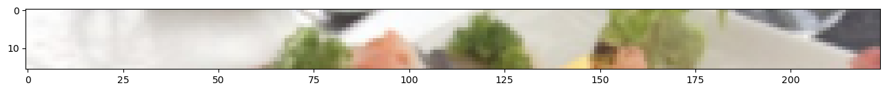

# Vision Transformerを一から実装してFoodVision Miniに適用する

## 概要

本記事では、機械学習論文の再現実装について実践的に学びます。具体的には、**Vision Transformer（ViT）**を一から実装し、私たちのFoodVision Mini問題（ピザ、ステーキ、寿司の画像分類）に適用します。

論文の再現実装は、最新の機械学習技術を理解し、自分の問題に応用するための重要なスキルです。この記事を通じて、研究論文を読み解き、数式とテキストをPyTorchコードに変換する方法を習得できます。


*マイルストーンプロジェクト2では、Vision Transformer（ViT）アーキテクチャを再現し、FoodVision Mini問題に適用してピザ、ステーキ、寿司の画像を分類します。*

## 前提知識

- PyTorchの基本的な使い方
- 畳み込みニューラルネットワーク（CNN）の理解
- 深層学習の基礎概念
- Python プログラミングの経験

## 学習目標

この記事を読み終える頃には、以下のことができるようになります：

1. 機械学習論文を読み解く方法を理解する
2. Vision Transformerアーキテクチャの仕組みを把握する
3. 論文の数式をPyTorchコードに変換する
4. 一から実装したViTモデルでFoodVision Mini問題を解く

## 論文再現実装とは？

機械学習の分野は急速に進歩しており、多くの革新的な技術が研究論文として発表されています。

**論文再現実装**の目標は、これらの進歩をコードで再現し、自分の問題に応用できる技術として活用することです。


*機械学習論文の再現実装では、画像/図表、数式、テキストで構成された論文を実用的なコードに変換します。図、数式、テキストは[ViT論文](https://arxiv.org/abs/2010.11929)から引用。*

例えば、新しいモデルアーキテクチャが既存の手法よりも優れた性能を示した場合、そのアーキテクチャを自分の問題に試してみたいと思うでしょう。

## Vision Transformerについて

**Transformer**アーキテクチャは元々、論文[*Attention is all you need*](https://arxiv.org/abs/1706.03762)で一次元（1D）のテキストシーケンスを処理するために設計されました。

**Vision Transformer（ViT）**は、このTransformerアーキテクチャを**視覚問題に適応**させたものです（最初は分類問題、その後多くの応用が続きました）。

本記事では、元論文[*An Image is Worth 16x16 Words: Transformers for Image Recognition at Scale*](https://arxiv.org/abs/2010.11929)に基づいて、「バニラ Vision Transformer」を構築します。元のアーキテクチャを再現できれば、他のバリエーションにも対応できるからです。

## 実装内容

### 0. 環境設定

まず、必要なライブラリとモジュールを準備します。PyTorch 1.12以上とtorchvision 0.13以上が必要です。

```python
# 必要なバージョンの確認とインストール
try:
    import torch
    import torchvision
    assert int(torch.__version__.split(".")[1]) >= 12 or int(torch.__version__.split(".")[0]) == 2, "torch version should be 1.12+"
    assert int(torchvision.__version__.split(".")[1]) >= 13, "torchvision version should be 0.13+"
    print(f"torch version: {torch.__version__}")
    print(f"torchvision version: {torchvision.__version__}")
except:
    print(f"[INFO] torch/torchvision versions not as required, installing nightly versions.")
    !pip3 install -U torch torchvision torchaudio --index-url https://download.pytorch.org/whl/cu118
    import torch
    import torchvision
    print(f"torch version: {torch.__version__}")
    print(f"torchvision version: {torchvision.__version__}")
```

**実行結果:**
```
torch version: 2.7.1
torchvision version: 0.22.1
```

続いて、必要なライブラリをインポートし、デバイス設定を行います：

```python
# 必要なライブラリのインポート
import matplotlib.pyplot as plt
import torch
import torchvision

from torch import nn
from torchvision import transforms
from torchinfo import summary
from going_modular import data_setup, engine
from helper_functions import download_data, set_seeds, plot_loss_curves

# デバイス設定（GPU利用可能性の確認）
device = "mps" if torch.mps.is_available() else "cpu"
device
```

**実行結果:**
```
'mps'
```

### 1. データの準備

FoodVision Miniで使用するピザ、ステーキ、寿司の画像データセットをダウンロードします：

```python
# GitHubからピザ、ステーキ、寿司画像をダウンロード
image_path = download_data(source="https://github.com/vinsmoke-three/deeplearning-with-pytorch/raw/main/data/pizza_steak_sushi.zip",
                           destination="pizza_steak_sushi")
image_path
```

**実行結果:**
```
[INFO] data/pizza_steak_sushi directory exists, skipping download.
PosixPath('data/pizza_steak_sushi')
```

データディレクトリの設定：

```python
# 訓練用とテスト用ディレクトリのパスを設定
train_dir = image_path / "train"
test_dir = image_path / "test"
```

### 2. データセットとDataLoaderの作成

#### 2.1 画像変換の準備

ViT論文のTable 3によると、訓練時の解像度は224×224ピクセルです。


*ViT論文のTable 3では、画像サイズやバッチサイズなどのハイパーパラメータ設定が示されています。*

この情報に基づいて画像変換を設定します：

```python
# 画像サイズの設定（ViT論文のTable 3から）
IMG_SIZE = 224

# 手動で変換パイプラインを作成
manual_transforms = transforms.Compose([
    transforms.Resize((IMG_SIZE, IMG_SIZE)),  # 224x224にリサイズ
    transforms.ToTensor(),                    # テンソルに変換
])
print(f"手動作成された変換: {manual_transforms}")
```

**実行結果:**
```
手動作成された変換: Compose(
    Resize(size=(224, 224), interpolation=bilinear, max_size=None, antialias=True)
    ToTensor()
)
```

#### 2.2 DataLoaderの作成

ViT論文ではバッチサイズ4096を使用していますが、一般的なハードウェアでは処理が困難なため、バッチサイズ32を使用します：

```python
# バッチサイズの設定（ViT論文より小さく設定）
BATCH_SIZE = 32  # ViT論文より小さいが、ハードウェア制約のため

# データローダーの作成
train_dataloader, test_dataloader, class_names = data_setup.create_dataloaders(
    train_dir=train_dir,
    test_dir=test_dir,
    transform=manual_transforms,  # 手動作成した変換を使用
    batch_size=BATCH_SIZE
)

train_dataloader, test_dataloader, class_names
```

**実行結果:**
```
/Users/vinsmoke/miniconda3/envs/deep-learning/lib/python3.12/site-packages/torch/utils/data/dataloader.py:683: UserWarning: 'pin_memory' argument is set as true but not supported on MPS now, then device pinned memory won't be used.
  warnings.warn(warn_msg)

(<torch.utils.data.dataloader.DataLoader at 0x3586a46b0>,
 <torch.utils.data.dataloader.DataLoader at 0x358b17620>,
 ['pizza', 'steak', 'sushi'])
```

#### 2.3 単一画像の可視化

データが正しく読み込まれているか確認しましょう：

```python
# 画像バッチを取得
image_batch, label_batch = next(iter(train_dataloader))

# バッチから単一の画像を取得
image, label = image_batch[0], label_batch[0]

# バッチの形状を確認
image.shape, label
```

**実行結果:**
```
(torch.Size([3, 224, 224]), tensor(2))
```

画像を可視化：

```python
# matplotlibで画像をプロット
plt.imshow(image.permute(1, 2, 0))  # 画像次元を調整 [color_channels, height, width] -> [height, width, color_channels]
plt.title(class_names[label])
plt.axis(False);
```


素晴らしい！画像が正しくインポートされています。

## 3. ViT論文の再現実装：概要

### 3.1 入力と出力、層とブロック

ニューラルネットワークアーキテクチャは一般的に**層（layer）**で構成されます。

層の集合は**ブロック（block）**と呼ばれます。

多くのブロックを積み重ねることで、全体のアーキテクチャが構成されます。

- **層** - 入力を受け取り、何らかの関数を適用し、出力を返す
- **ブロック** - 層の集合、入力を受け取り、一連の関数を適用し、出力を返す
- **アーキテクチャ（モデル）** - ブロックの集合、入力を受け取り、一連の関数を適用し、出力を返す


*現代の深層学習アーキテクチャは通常、層とブロックの集合です。層は入力（数値表現としてのデータ）を受け取り、何らかの関数を使って操作し、出力します。*

### 3.2 具体的なViTの構成要素

#### 3.2.1 Figure 1の探索

ViT論文のFigure 1から、アーキテクチャの主要なコンポーネントを理解しましょう：


*ViT論文のFigure 1は、アーキテクチャを構成する様々な入力、出力、層、ブロックを示しています。*

ViTアーキテクチャは以下の段階で構成されます：

- **Patch + Position Embedding（入力）** - 入力画像を画像パッチのシーケンスに変換し、パッチの順序を指定する位置番号を追加
- **Linear projection of flattened patches（埋め込みパッチ）** - 画像パッチを**埋め込み表現**に変換
- **Norm** - Layer Normalization（正規化層）
- **Multi-Head Attention** - マルチヘッド自己注意層（MSA）
- **MLP** - 多層パーセプトロン
- **Transformer Encoder** - 上記の層を組み合わせたブロック
- **MLP Head** - 分類のための出力層

#### 3.2.2 4つの数式の探索

ViT論文の3.1節にある4つの数式が、アーキテクチャの数学的基盤を提供します：


*これらの4つの数式は、ViTアーキテクチャの4つの主要部分の数学を表しています。*

**数式1：パッチ埋め込み**

$$
\mathbf{z}_{0} =\left[\mathbf{x}_{\text {class }} ; \mathbf{x}_{p}^{1} \mathbf{E} ; \mathbf{x}_{p}^{2} \mathbf{E} ; \cdots ; \mathbf{x}_{p}^{N} \mathbf{E}\right]+\mathbf{E}_{\text {pos }}
$$

これは、クラストークン、パッチ埋め込み、位置埋め込みを扱います。

**数式2：MSAブロック**

$$
\mathbf{z}_{\ell}^{\prime} =\operatorname{MSA}\left(\operatorname{LN}\left(\mathbf{z}_{\ell-1}\right)\right)+\mathbf{z}_{\ell-1}
$$

LayerNormでラップされたMulti-Head Attention層と、残差接続を示します。

**数式3：MLPブロック**

$$
\mathbf{z}_{\ell} =\operatorname{MLP}\left(\operatorname{LN}\left(\mathbf{z}_{\ell}^{\prime}\right)\right)+\mathbf{z}_{\ell}^{\prime}
$$

LayerNormでラップされたMultilayer Perceptron層と、残差接続を示します。

**数式4：出力**

$$
\mathbf{y} =\operatorname{LN}\left(\mathbf{z}_{L}^{0}\right)
$$

最終層での出力を定義します。

#### 3.2.3 Table 1の探索

Table 1は、様々なViTモデルのハイパーパラメータ設定を示しています：

| Model | Layers | Hidden size D | MLP size | Heads | Params |
|-------|--------|---------------|----------|-------|---------|
| ViT-Base | 12 | 768 | 3072 | 12 | 86M |
| ViT-Large | 24 | 1024 | 4096 | 16 | 307M |
| ViT-Huge | 32 | 1280 | 5120 | 16 | 632M |

私たちは最小のViT-Baseから始めて、うまくいけばより大きなバリアントにスケールアップできます。

- **Layers** - Transformer Encoderブロックの数
- **Hidden size D** - 埋め込み次元
- **MLP size** - MLP層の隠れユニット数
- **Heads** - Multi-Head Attention層のヘッド数
- **Params** - モデルの総パラメータ数

## 4. 数式1の実装：パッチ分割とクラス・位置・パッチ埋め込みの作成

私の機械学習エンジニアの友人がよく「すべては埋め込み次第だ」と言っていました。

つまり、データを良い学習可能な方法（**埋め込みは学習可能な表現**）で表現できれば、学習アルゴリズムは良い性能を発揮する可能性が高いということです。

それを踏まえて、ViTアーキテクチャのクラス、位置、パッチ埋め込みを作成することから始めましょう。

まず**パッチ埋め込み**から始めます。これは、入力画像をパッチのシーケンスに変換し、それらのパッチを埋め込むことを意味します。

**埋め込み**は何らかの形式の学習可能な表現であり、多くの場合ベクトルであることを思い出してください。

学習可能という用語が重要です。これは、入力画像の数値表現（モデルが見るもの）が時間とともに改善されることを意味するからです。

ViT論文の3.1節の冒頭段落に従って始めましょう：

> 標準的なTransformerは、1Dトークン埋め込みのシーケンスを入力として受け取ります。2D画像を扱うために、画像 $\mathbf{x} \in \mathbb{R}^{H \times W \times C}$ を平坦化された2Dパッチのシーケンス $\mathbf{x}_{p} \in \mathbb{R}^{N \times\left(P^{2} \cdot C\right)}$ に変形します。ここで$(H, W)$は元画像の解像度、$C$はチャンネル数、$(P, P)$は各画像パッチの解像度、$N=H W / P^{2}$は結果として得られるパッチ数で、これはTransformerの有効な入力シーケンス長でもあります。

ViT論文のTable 3から「Training resolution is **224**」という情報も念頭に置いておきましょう。


*ViTアーキテクチャのFigure 1からEquation 1への位置・パッチ埋め込み部分のマッピング。3.1節の冒頭段落は、パッチ埋め込み層の異なる入力・出力形状を説明しています。*

### 4.1 パッチ埋め込みの入力・出力形状を手計算で求める

まず、これらの入力・出力形状の値を手計算で求めてみましょう。

```python
# サンプル値を作成
height = 224 # H ("Training resolution is 224.")
width = 224 # W
color_channels = 3 # C
patch_size = 16 # P

# N（パッチ数）を計算
number_of_patches = int((height * width) / patch_size**2)
print(f"パッチサイズ(P={patch_size})における画像高さ(H={height})、幅(W={width})でのパッチ数(N): {number_of_patches}")
```

**実行結果:**
```
パッチサイズ(P=16)における画像高さ(H=224)、幅(W=224)でのパッチ数(N): 196
```

パッチ埋め込み層の入力・出力形状を確認しましょう：

```python
# 入力形状（単一画像のサイズ）
embedding_layer_input_shape = (height, width, color_channels)

# 出力形状
embedding_layer_output_shape = (number_of_patches, patch_size**2 * color_channels)

print(f"入力形状（単一2D画像）: {embedding_layer_input_shape}")
print(f"出力形状（パッチに平坦化された単一2D画像）: {embedding_layer_output_shape}")
```

**実行結果:**
```
入力形状（単一2D画像）: (224, 224, 3)
出力形状（パッチに平坦化された単一2D画像）: (196, 768)
```

### 4.2 単一画像をパッチに変換

画像をパッチに変換する様子を可視化してみましょう：

```python
# 単一画像を表示
plt.imshow(image.permute(1, 2, 0)) # matplotlibに合わせて調整
plt.title(class_names[label])
plt.axis(False)
```


まず、画像の上部行のパッチ化されたピクセルを可視化してみましょう：

```python
# matplotlib用に画像形状を変更 [color_channels, height, width] -> [height, width, color_channels]
image_permuted = image.permute(1, 2, 0)

# 上部行のパッチ化されたピクセルをプロットするためのインデックス
patch_size = 16
plt.figure(figsize=(patch_size, patch_size))
plt.imshow(image_permuted[:patch_size, :, :])
```



次に、上部行を個別のパッチに分割しましょう：

```python
# ハイパーパラメータの設定とimg_sizeとpatch_sizeの互換性確認
img_size = 224
patch_size = 16
num_patches = img_size/patch_size
assert img_size % patch_size == 0, "画像サイズはパッチサイズで割り切れる必要があります"
print(f"行ごとのパッチ数: {num_patches}\nパッチサイズ: {patch_size} pixels x {patch_size} pixels")

# 一連のサブプロットを作成
fig, axs = plt.subplots(nrows=1,
                        ncols=img_size // patch_size, # 各パッチに1列
                        figsize=(num_patches, num_patches),
                        sharex=True,
                        sharey=True)

# 上部行のパッチ数を反復処理
for i, patch in enumerate(range(0, img_size, patch_size)):
    axs[i].imshow(image_permuted[:patch_size, patch:patch+patch_size, :]) # 高さインデックスを一定に保ち、幅インデックスを変更
    axs[i].set_xlabel(i+1) # ラベルを設定
    axs[i].set_xticks([])
    axs[i].set_yticks([])
```

**実行結果:**
```
行ごとのパッチ数: 14.0
パッチサイズ: 16 pixels x 16 pixels
```


今度は画像全体をパッチ化してみましょう：

```python
# ハイパーパラメータの設定
img_size = 224
patch_size = 16
num_patches = img_size/patch_size
print(f"行ごとのパッチ数: {num_patches}\
        \n列ごとのパッチ数: {num_patches}\
        \n総パッチ数: {num_patches*num_patches}\
        \nパッチサイズ: {patch_size} pixels x {patch_size} pixels")

# サブプロットシリーズを作成
fig, axs = plt.subplots(nrows=img_size // patch_size,
                        ncols=img_size // patch_size,
                        figsize=(num_patches, num_patches),
                        sharex=True,
                        sharey=True)

# 画像の高さと幅をループ
for i, patch_height in enumerate(range(0, img_size, patch_size)): # 高さを反復
    for j, patch_width in enumerate(range(0, img_size, patch_size)): # 幅を反復
        # 置換された画像パッチをプロット
        axs[i, j].imshow(image_permuted[patch_height:patch_height+patch_size,
                                        patch_width:patch_width+patch_size,
                                        :])
        # ラベル情報を設定
        axs[i, j].set_ylabel(i+1,
                             rotation="horizontal",
                             horizontalalignment="right",
                             verticalalignment="center")
        axs[i, j].set_xlabel(j+1)
        axs[i, j].set_xticks([])
        axs[i, j].set_yticks([])
        axs[i, j].label_outer()

# スーパータイトルを設定
fig.suptitle(f"{class_names[label]} -> パッチ化済み", fontsize=16)
plt.show()
```

**実行結果:**
```
行ごとのパッチ数: 14.0        
列ごとのパッチ数: 14.0        
総パッチ数: 196.0        
パッチサイズ: 16 pixels x 16 pixels
```


画像のパッチ化完了！素晴らしい見た目ですね。

### 4.3 `torch.nn.Conv2d()`による画像パッチの作成

PyTorchでパッチ埋め込み層を複製する作業に移りましょう。

この操作は、畳み込み操作と非常に似ています。実際、ViT論文の著者は3.1節で、パッチ埋め込みは畳み込みニューラルネットワーク（CNN）で実現できると述べています：

> **ハイブリッドアーキテクチャ。** 生の画像パッチの代替として、入力シーケンスは**CNNの特徴マップ**から形成できます。


*`torch.nn.Conv2d()`層の`kernel_size`と`stride`パラメータを`patch_size`と等しく設定することで、画像をパッチに分割し、各パッチの学習可能な埋め込みを作成する層を効果的に取得できます。*

`torch.nn.Conv2d()`層でパッチ作成を複製するには、`kernel_size`と`stride`を`patch_size`と等しく設定します：

```python
from torch import nn

# パッチサイズを設定
patch_size=16

# ViT論文のハイパーパラメータでConv2d層を作成
conv2d = nn.Conv2d(in_channels=3, # カラーチャンネル数
                   out_channels=768, # Table 1より: Hidden size D、これが埋め込みサイズ
                   kernel_size=patch_size,
                   stride=patch_size,
                   padding=0)
```

画像を畳み込み層に通してみましょう：

```python
# 画像を畳み込み層に通す
image_out_of_conv = conv2d(image.unsqueeze(0)) # 単一バッチ次元を追加
print(image_out_of_conv.shape)
```

**実行結果:**
```
torch.Size([1, 768, 14, 14])
```

ランダムな5つの畳み込み特徴マップを可視化してみましょう：

```python
# ランダムな5つの畳み込み特徴マップをプロット
import random
random_indexes = random.sample(range(0, 758), k=5)
print(f"インデックスからのランダムな畳み込み特徴マップを表示: {random_indexes}")

# プロット作成
fig, axs = plt.subplots(nrows=1, ncols=5, figsize=(12, 12))

# ランダムな画像特徴マップをプロット
for i, idx in enumerate(random_indexes):
    image_conv_feature_map = image_out_of_conv[:, idx, :, :]
    axs[i].imshow(image_conv_feature_map.squeeze().detach().numpy())
    axs[i].set(xticklabels=[], yticklabels=[], xticks=[], yticks=[]);
```

**実行結果:**
```
インデックスからのランダムな畳み込み特徴マップを表示: [678, 116, 559, 48, 577]
```


### 4.4 `torch.nn.Flatten()`によるパッチ埋め込みの平坦化

画像をパッチ埋め込みに変換しましたが、まだ2D形式です。ViTモデルの理想的な出力形状にするにはどうすればよいでしょうか？

```python
# 現在のテンソル形状
print(f"現在のテンソル形状: {image_out_of_conv.shape} -> [batch, embedding_dim, feature_map_height, feature_map_width]")
```

**実行結果:**
```
現在のテンソル形状: torch.Size([1, 768, 14, 14]) -> [batch, embedding_dim, feature_map_height, feature_map_width]
```

`torch.nn.Flatten()`を使用して特徴マップの空間次元を平坦化しましょう：

```python
# 平坦化層を作成
flatten = nn.Flatten(start_dim=2, # feature_map_height（次元2）を平坦化
                     end_dim=3) # feature_map_width（次元3）を平坦化
```

すべてをまとめてみましょう：

```python
# 1. 単一画像を表示
plt.imshow(image.permute(1, 2, 0)) # matplotlib用に調整
plt.title(class_names[label])
plt.axis(False)
print(f"元画像の形状: {image.shape}")

# 2. 画像を特徴マップに変換
image_out_of_conv = conv2d(image.unsqueeze(0)) # 形状エラーを避けるためバッチ次元を追加
print(f"画像特徴マップの形状: {image_out_of_conv.shape}")

# 3. 特徴マップを平坦化
image_out_of_conv_flattened = flatten(image_out_of_conv)
print(f"平坦化された画像特徴マップの形状: {image_out_of_conv_flattened.shape}")
```

**実行結果:**
```
元画像の形状: torch.Size([3, 224, 224])
画像特徴マップの形状: torch.Size([1, 768, 14, 14])
平坦化された画像特徴マップの形状: torch.Size([1, 768, 196])
```


次元を再配置して最終的な形状にしましょう：

```python
# 平坦化された画像パッチ埋め込みを正しい形状に取得
image_out_of_conv_flattened_reshaped = image_out_of_conv_flattened.permute(0, 2, 1) # [batch_size, P^2•C, N] -> [batch_size, N, P^2•C]
print(f"パッチ埋め込みシーケンス形状: {image_out_of_conv_flattened_reshaped.shape} -> [batch_size, num_patches, embedding_size]")
```

**実行結果:**
```
パッチ埋め込みシーケンス形状: torch.Size([1, 196, 768]) -> [batch_size, num_patches, embedding_size]
```

### 4.5 ViTパッチ埋め込み層をPyTorchモジュールに変換

パッチ埋め込みのすべての作業を単一のPyTorchレイヤーにまとめましょう：

```python
# 1. nn.Moduleをサブクラス化するクラスを作成
class PatchEmbedding(nn.Module):
    """2D入力画像を1D学習可能埋め込みベクトルシーケンスに変換します。

    Args:
        in_channels (int): 入力画像のカラーチャンネル数。デフォルトは3。
        patch_size (int): 入力画像を変換するパッチのサイズ。デフォルトは16。
        embedding_dim (int): 画像を変換する埋め込みのサイズ。デフォルトは768。
    """
    # 2. 適切な変数でクラスを初期化
    def __init__(self,
                 in_channels:int=3,
                 patch_size:int=16,
                 embedding_dim:int=768):
        super().__init__()

        # 3. 画像をパッチに変換する層を作成
        self.patcher = nn.Conv2d(in_channels=in_channels,
                                 out_channels=embedding_dim,
                                 kernel_size=patch_size,
                                 stride=patch_size,
                                 padding=0)

        # 4. パッチ特徴マップを単一次元に平坦化する層を作成
        self.flatten = nn.Flatten(start_dim=2, # 特徴マップ次元のみを単一ベクトルに平坦化
                                  end_dim=3)

    # 5. forwardメソッドを定義
    def forward(self, x):
        # 入力が正しい形状かチェックするアサーションを作成
        image_resolution = x.shape[-1]
        assert image_resolution % patch_size == 0, f"入力画像サイズはパッチサイズで割り切れる必要があります。画像形状: {image_resolution}、パッチサイズ: {patch_size}"

        # フォワードパスを実行
        x_patched = self.patcher(x)
        x_flattened = self.flatten(x_patched)
        # 6. 出力形状が正しい順序になるようにする
        return x_flattened.permute(0, 2, 1) # 埋め込みが最後の次元になるように調整
```

`PatchEmbedding`層を作成できました！単一画像で試してみましょう：

```python
set_seeds()

# パッチ埋め込み層のインスタンスを作成
patchify = PatchEmbedding(in_channels=3,
                          patch_size=16,
                          embedding_dim=768)

# 単一画像を通す
print(f"入力画像形状: {image.unsqueeze(0).shape}")
patch_embedded_image = patchify(image.unsqueeze(0)) # エラーを避けるため0番目のインデックスに追加のバッチ次元を追加
print(f"出力パッチ埋め込み形状: {patch_embedded_image.shape}")
```

**実行結果:**
```
入力画像形状: torch.Size([1, 3, 224, 224])
出力パッチ埋め込み形状: torch.Size([1, 196, 768])
```

### 4.6 クラストークン埋め込みの作成

パッチ埋め込みを作成したので、次はクラストークン埋め込みに取り組みましょう。

ViT論文の3.1節の第2段落を読むと：

> BERTの`[ class ]`トークンと同様に、埋め込まれたパッチのシーケンスに学習可能な埋め込みを前に付け加えます。

パッチ埋め込みシーケンスを確認しましょう：

```python
# パッチ埋め込みとパッチ埋め込み形状を表示
print(patch_embedded_image)
print(f"パッチ埋め込み形状: {patch_embedded_image.shape} -> [batch_size, number_of_patches, embedding_dimension]")
```

**実行結果:**
```
tensor([[[-0.9698,  0.2378, -0.2770,  ...,  0.7685, -0.4388,  0.3720],
         [-0.9932,  0.2355, -0.2763,  ...,  0.7275, -0.4185,  0.3424],
         ...
         [-0.6786,  0.2779, -0.0972,  ...,  0.5548, -0.1956, -0.0277]]],
       grad_fn=<PermuteBackward0>)
パッチ埋め込み形状: torch.Size([1, 196, 768]) -> [batch_size, number_of_patches, embedding_dimension]
```

クラストークンの学習可能な埋め込みを作成しましょう：

```python
# バッチサイズと埋め込み次元を取得
batch_size = patch_embedded_image.shape[0]
embedding_dimension = patch_embedded_image.shape[-1]

# 埋め込み次元と同じサイズを共有する学習可能パラメータとしてクラストークン埋め込みを作成
class_token = nn.Parameter(torch.ones(batch_size, 1, embedding_dimension), # [batch_size, number_of_tokens, embedding_dimension]
                           requires_grad=True) # 埋め込みが学習可能であることを確認

# class_tokenの最初の10例を表示
print(class_token[:, :, :10])

# class_token形状を出力
print(f"クラストークン形状: {class_token.shape} -> [batch_size, number_of_tokens, embedding_dimension]")
```

**実行結果:**
```
tensor([[[1., 1., 1., 1., 1., 1., 1., 1., 1., 1.]]], grad_fn=<SliceBackward0>)
クラストークン形状: torch.Size([1, 1, 768]) -> [batch_size, number_of_tokens, embedding_dimension]
```

クラストークン埋め込みをパッチ埋め込みシーケンスの前に追加しましょう：

```python
# クラストークン埋め込みをパッチ埋め込みの前面に追加
patch_embedded_image_with_class_embedding = torch.cat((class_token, patch_embedded_image),
                                                      dim=1) # 最初の次元で連結

print(f"クラストークンが前に付けられたパッチ埋め込みのシーケンス形状: {patch_embedded_image_with_class_embedding.shape}")
```

**実行結果:**
```
クラストークンが前に付けられたパッチ埋め込みのシーケンス形状: torch.Size([1, 197, 768])
```

### 4.7 位置埋め込みの作成

クラストークン埋め込みとパッチ埋め込みができたので、位置埋め込みを作成しましょう。

ViT論文の3.1節より：

> 位置埋め込みは、位置情報を保持するためにパッチ埋め込みに追加されます。標準的な学習可能な1D位置埋め込みを使用します。

学習可能な1D位置埋め込みを作成しましょう：

```python
# N（パッチ数）を計算
number_of_patches = int((height * width) / patch_size**2)

# 埋め込み次元を取得
embedding_dimension = patch_embedded_image_with_class_embedding.shape[2]

# 学習可能な1D位置埋め込みを作成
position_embedding = nn.Parameter(torch.ones(1,
                                             number_of_patches+1,
                                             embedding_dimension),
                                  requires_grad=True) # 学習可能であることを確認

print(f"位置埋め込み形状: {position_embedding.shape} -> [batch_size, number_of_patches, embedding_dimension]")
```

**実行結果:**
```
位置埋め込み形状: torch.Size([1, 197, 768]) -> [batch_size, number_of_patches, embedding_dimension]
```

位置埋め込みをクラストークンが前に付けられたパッチ埋め込みシーケンスに追加しましょう：

```python
# 位置埋め込みをパッチおよびクラストークン埋め込みに追加
patch_and_position_embedding = patch_embedded_image_with_class_embedding + position_embedding
print(f"パッチ埋め込み、クラストークン前付け、位置埋め込み追加の形状: {patch_and_position_embedding.shape}")
```

**実行結果:**
```
パッチ埋め込み、クラストークン前付け、位置埋め込み追加の形状: torch.Size([1, 197, 768])
```

### 4.8 すべてをまとめる：画像から埋め込みへ

ViT論文の数式1を複製するため、すべてを単一のコードセルにまとめましょう：

```python
set_seeds()

# 1. パッチサイズを設定
patch_size = 16

# 2. 元画像テンソル形状を出力し、画像次元を取得
print(f"画像テンソル形状: {image.shape}")
height, width = image.shape[1], image.shape[2]

# 3. 画像テンソルを取得してバッチ次元を追加
x = image.unsqueeze(0)
print(f"バッチ次元付き入力画像形状: {x.shape}")

# 4. パッチ埋め込み層を作成
patch_embedding_layer = PatchEmbedding(in_channels=3,
                                       patch_size=patch_size,
                                       embedding_dim=768)

# 5. パッチ埋め込み層を通して画像を渡す
patch_embedding = patch_embedding_layer(x)
print(f"パッチ化埋め込み形状: {patch_embedding.shape}")

# 6. クラストークン埋め込みを作成
batch_size = patch_embedding.shape[0]
embedding_dimension = patch_embedding.shape[-1]
class_token = nn.Parameter(torch.ones(batch_size, 1, embedding_dimension),
                           requires_grad=True) # 学習可能であることを確認
print(f"クラストークン埋め込み形状: {class_token.shape}")

# 7. クラストークン埋め込みをパッチ埋め込みの前に追加
patch_embedding_class_token = torch.cat((class_token, patch_embedding), dim=1)
print(f"クラストークン付きパッチ埋め込み形状: {patch_embedding_class_token.shape}")

# 8. 位置埋め込みを作成
number_of_patches = int((height * width) / patch_size**2)
position_embedding = nn.Parameter(torch.ones(1, number_of_patches+1, embedding_dimension),
                                  requires_grad=True) # 学習可能であることを確認

# 9. 位置埋め込みをクラストークン付きパッチ埋め込みに追加
patch_and_position_embedding = patch_embedding_class_token + position_embedding
print(f"パッチと位置埋め込み形状: {patch_and_position_embedding.shape}")
```

**実行結果:**
```
画像テンソル形状: torch.Size([3, 224, 224])
バッチ次元付き入力画像形状: torch.Size([1, 3, 224, 224])
パッチ化埋め込み形状: torch.Size([1, 196, 768])
クラストークン埋め込み形状: torch.Size([1, 1, 768])
クラストークン付きパッチ埋め込み形状: torch.Size([1, 197, 768])
パッチと位置埋め込み形状: torch.Size([1, 197, 768])
```

素晴らしい！単一の画像から単一のコードセルでパッチと位置埋め込みまで変換できました。


*ViT論文の数式1をPyTorchコードにマッピング。これが論文再現実装の本質で、研究論文を実用的なコードに変換することです。*

これで画像をエンコードし、ViT論文のFigure 1のTransformer Encoderに渡す方法ができました。

## 5. 数式2の実装：マルチヘッドアテンション（MSA）

入力データのパッチ化と埋め込みができたので、ViTアーキテクチャの次の部分に移りましょう。

まず、Transformer Encoderセクションを2つの部分に分解します（小さく始めて必要に応じて増やします）。

最初が数式2、次が数式3です。

数式2を思い出してください：

$$
\mathbf{z}_{\ell}^{\prime} =\operatorname{MSA}\left(\operatorname{LN}\left(\mathbf{z}_{\ell-1}\right)\right)+\mathbf{z}_{\ell-1}, \quad \ell=1 \ldots L
$$

これは、LayerNorm（LN）層でラップされたMulti-Head Attention（MSA）層と残差接続（層への入力が層の出力に追加される）を示しています。

数式2を「MSAブロック」と呼びます。


*左：ViT論文のFigure 1で、Transformer Encoderブロック内のMulti-Head AttentionとNorm層、および残差接続（+）がハイライトされています。右：Multi-Head Self Attention（MSA）層、Norm層、残差接続をViT論文の数式2の各部分にマッピング。*

### 5.1 LayerNorm（LN）層

[Layer Normalization](https://paperswithcode.com/method/layer-normalization)（`torch.nn.LayerNorm()`）は、最後の次元にわたって入力を正規化します。

PyTorchの`torch.nn.LayerNorm()`の主要パラメータは`normalized_shape`で、これを正規化したい次元サイズと等しく設定できます（我々の場合はViT-Baseで$D$または`768`）。

### 5.2 マルチヘッド自己アテンション（MSA）層

自己注意とマルチヘッドアテンション（自己注意を複数回適用）の力は、[*Attention is all you need*](https://arxiv.org/abs/1706.03762)研究論文で紹介された元のTransformerアーキテクチャの形で明らかになりました。

元々テキスト入力用に設計された元の自己注意メカニズムは、単語のシーケンスを受け取り、どの単語が他の単語により多くの「注意」を払うべきかを計算します。

画像パッチのシーケンスが入力なので、自己注意とマルチヘッドアテンションは、画像のどのパッチが別のパッチと最も関連しているかを計算し、最終的に画像の学習された表現を形成します。

### 5.3 PyTorch層で数式2を複製

数式2のLayerNorm（LN）とMulti-Head Attention（MSA）層について議論したことを実践してみましょう：

```python
# 1. nn.Moduleを継承するクラスを作成
class MultiheadSelfAttentionBlock(nn.Module):
    """マルチヘッド自己注意ブロック（「MSAブロック」の略）を作成します。
    """
    # 2. Table 1のハイパーパラメータでクラスを初期化
    def __init__(self,
                 embedding_dim:int=768, # Table 1のViT-BaseのHidden size D
                 num_heads:int=12, # Table 1のViT-BaseのHeads
                 attn_dropout:float=0): # 論文ではMSABlocksでドロップアウトを使用していないようです
        super().__init__()

        # 3. Norm層（LN）を作成
        self.layer_norm = nn.LayerNorm(normalized_shape=embedding_dim)

        # 4. Multi-Head Attention（MSA）層を作成
        self.multihead_attn = nn.MultiheadAttention(embed_dim=embedding_dim,
                                                    num_heads=num_heads,
                                                    dropout=attn_dropout,
                                                    batch_first=True) # バッチ次元が最初に来るか？

    # 5. データを層に通すforward()メソッドを作成
    def forward(self, x):
        x = self.layer_norm(x)
        attn_output, _ = self.multihead_attn(query=x, # クエリ埋め込み
                                             key=x, # キー埋め込み
                                             value=x, # バリュー埋め込み
                                             need_weights=False) # 重みが必要か、層の出力だけか？
        return attn_output
```

MSABlockを作成しました！`MultiheadSelfAttentionBlock`のインスタンスを作成し、セクション4.8で作成した`patch_and_position_embedding`変数を通してテストしてみましょう：

```python
# MSABlockのインスタンスを作成
multihead_self_attention_block = MultiheadSelfAttentionBlock(embedding_dim=768, # Table 1より
                                                             num_heads=12) # Table 1より

# パッチと位置画像埋め込みをMSABlockに通す
patched_image_through_msa_block = multihead_self_attention_block(patch_and_position_embedding)
print(f"MSAブロックの入力形状: {patch_and_position_embedding.shape}")
print(f"MSAブロックの出力形状: {patched_image_through_msa_block.shape}")
```

**実行結果:**
```
MSAブロックの入力形状: torch.Size([1, 197, 768])
MSAブロックの出力形状: torch.Size([1, 197, 768])
```


*左：Multi-Head AttentionとLayerNorm層がハイライトされたViTアーキテクチャ。これらの層が論文の3.1節の数式2を構成します。右：PyTorch層を使用した数式2の複製（最後のスキップ接続を除く）。*

数式2を正式に複製しました（最後の残差接続を除きますが、セクション7.1で取り上げます）！

## 6. 数式3の実装：多層パーセプトロン（MLP）

勢いに乗って続けましょう！数式3を複製します：

$$
\mathbf{z}_{\ell} =\operatorname{MLP}\left(\operatorname{LN}\left(\mathbf{z}_{\ell}^{\prime}\right)\right)+\mathbf{z}_{\ell}^{\prime}, \quad \ell=1 \ldots L
$$

ここでMLPは「multilayer perceptron（多層パーセプトロン）」、LNは「layer normalization」を表します。

最後の加算はスキップ/残差接続です。

数式3をTransformer encoderの「MLPブロック」と呼びます。


*左：ViT論文のFigure 1で、Transformer Encoderブロック内のMLPとNorm層、および残差接続（+）がハイライトされています。右：多層パーセプトロン（MLP）層、Norm層（LN）、残差接続をViT論文の数式3の各部分にマッピング。*

### 6.1 MLP層

[MLP](https://en.wikipedia.org/wiki/Multilayer_perceptron)という用語は、ほぼ任意の*複数*層の組み合わせを指すことができるため、非常に広範囲です。

しかし、一般的には次のパターンに従います：

`線形層 -> 非線形層 -> 線形層 -> 非線形層`

ViT論文の場合、MLP構造は3.1節で定義されています：

> MLPには、GELU非線形性を持つ2つの層が含まれています。

「2つの層」は線形層（PyTorchの[`torch.nn.Linear()`](https://pytorch.org/docs/stable/generated/torch.nn.Linear.html)）を指し、「GELU非線形性」はGELU（Gaussian Error Linear Units）非線形活性化関数（PyTorchの[`torch.nn.GELU()`](https://pytorch.org/docs/stable/generated/torch.nn.GELU.html)）です。

MLPブロックに関するもう一つの詳細は、付録B.1（Training）まで現れません：

> ドロップアウトが使用される場合、qkv-projectionと位置埋め込みをパッチ埋め込みに直接追加した後を除いて、**すべての密結合層の後に適用されます。**

これは、MLPブロック内のすべての線形層（または密結合層）にドロップアウト層（PyTorchの[`torch.nn.Dropout()`](https://pytorch.org/docs/stable/generated/torch.nn.Dropout.html)）があることを意味します。

### 6.2 PyTorch層で数式3を複製

数式3のLayerNorm（LN）とMLP層について議論したことを実践してみましょう：

```python
# 1. nn.Moduleを継承するクラスを作成
class MLPBlock(nn.Module):
    """層正規化多層パーセプトロンブロック（「MLPブロック」の略）を作成します。"""
    # 2. Table 1とTable 3のハイパーパラメータでクラスを初期化
    def __init__(self,
                 embedding_dim:int=768, # Table 1のViT-BaseのHidden Size D
                 mlp_size:int=3072, # Table 1のViT-BaseのMLP size
                 dropout:float=0.1): # Table 3のViT-BaseのDropout
        super().__init__()

        # 3. Norm層（LN）を作成
        self.layer_norm = nn.LayerNorm(normalized_shape=embedding_dim)

        # 4. Multilayer perceptron（MLP）層を作成
        self.mlp = nn.Sequential(
            nn.Linear(in_features=embedding_dim,
                      out_features=mlp_size),
            nn.GELU(), # "MLPには、GELU非線形性を持つ2つの層が含まれています（3.1節）。"
            nn.Dropout(p=dropout),
            nn.Linear(in_features=mlp_size, # 上の層のout_featuresと同じin_featuresを取る必要があります
                      out_features=embedding_dim), # embedding_dimに戻す
            nn.Dropout(p=dropout) # "ドロップアウトが使用される場合、すべての密結合層の後に適用されます.."
        )

    # 5. データを層に通すforward()メソッドを作成
    def forward(self, x):
        x = self.layer_norm(x)
        x = self.mlp(x)
        return x
```

MLPBlockクラスを作成しました！`MLPBlock`のインスタンスを作成し、セクション5.3で作成した`patched_image_through_msa_block`変数を通してテストしてみましょう：

```python
# MLPBlockのインスタンスを作成
mlp_block = MLPBlock(embedding_dim=768, # Table 1より
                     mlp_size=3072, # Table 1より
                     dropout=0.1) # Table 3より

# MSABlockの出力をMLPBlockに通す
patched_image_through_mlp_block = mlp_block(patched_image_through_msa_block)
print(f"MLPブロックの入力形状: {patched_image_through_msa_block.shape}")
print(f"MLPブロックの出力形状: {patched_image_through_mlp_block.shape}")
```

**実行結果:**
```
MLPブロックの入力形状: torch.Size([1, 197, 768])
MLPブロックの出力形状: torch.Size([1, 197, 768])
```


*左：MLPとNorm層がハイライトされたViTアーキテクチャ。これらの層が論文の3.1節の数式3を構成します。右：PyTorch層を使用した数式3の複製（最後のスキップ接続を除く）。*

数式3を複製しました（最後の残差接続を除きますが、セクション7.1で取り上げます）！

これで数式2と3をPyTorchコードで作成したので、それらを組み合わせてTransformer Encoderを作成しましょう。

## 7. Transformer Encoderの作成

前編で作成した`MultiheadSelfAttentionBlock`（数式2）と`MLPBlock`（数式3）を組み合わせて、ViTアーキテクチャのTransformer Encoderを作成しましょう。

深層学習において、[「encoder」や「auto encoder」](https://paperswithcode.com/method/autoencoder)は一般的に、入力を何らかの数値表現に「エンコード」する層のスタックを指します。

ViT論文の3.1節によると：

> Transformer encoder（Vaswani et al., 2017）は、マルチヘッド自己注意（MSA）とMLPブロックの交互の層で構成されます。**すべてのブロックの前にLayernorm（LN）が適用され**、**すべてのブロックの後に残差接続**が適用されます。

MSAブロックとMLPブロックは作成しましたが、残差接続はどうでしょうか？

[残差接続](https://paperswithcode.com/method/residual-connection)（スキップ接続とも呼ばれる）は、[*Deep Residual Learning for Image Recognition*](https://arxiv.org/abs/1512.03385v1)論文で初めて導入され、層の入力を後続の出力に追加することで実現されます。

ViTアーキテクチャの場合、残差接続は、MSAブロックの入力がMSAブロックの出力に追加されてからMLPブロックに渡されることを意味します。

### 7.1 カスタム作成層を組み合わせてTransformer Encoderを作成

PyTorchで以前作成した層を組み合わせて、ViT Transformer Encoderを作成しましょう：

```python
# 1. nn.Moduleを継承するクラスを作成
class TransformerEncoderBlock(nn.Module):
    """Transformer Encoderブロックを作成します。"""
    # 2. Table 1とTable 3のハイパーパラメータでクラスを初期化
    def __init__(self,
                 embedding_dim:int=768, # Table 1のViT-BaseのHidden size D
                 num_heads:int=12, # Table 1のViT-BaseのHeads
                 mlp_size:int=3072, # Table 1のViT-BaseのMLP size
                 mlp_dropout:float=0.1, # Table 3のViT-Baseの密結合層のドロップアウト量
                 attn_dropout:float=0): # アテンション層のドロップアウト量
        super().__init__()

        # 3. MSAブロック（数式2）を作成
        self.msa_block = MultiheadSelfAttentionBlock(embedding_dim=embedding_dim,
                                                     num_heads=num_heads,
                                                     attn_dropout=attn_dropout)

        # 4. MLPブロック（数式3）を作成
        self.mlp_block =  MLPBlock(embedding_dim=embedding_dim,
                                   mlp_size=mlp_size,
                                   dropout=mlp_dropout)

    # 5. forward()メソッドを作成
    def forward(self, x):
        # 6. MSAブロック用の残差接続（入力を出力に追加）
        x =  self.msa_block(x) + x

        # 7. MLPブロック用の残差接続（入力を出力に追加）
        x = self.mlp_block(x) + x

        return x
```

素晴らしい！Transformer Encoderブロックが作成できました！


*左：ViT論文のFigure 1で、ViTアーキテクチャのTransformer Encoderがハイライトされています。右：ViT論文の数式2と3にマッピングされたTransformer Encoder。*

レゴのように全体のアーキテクチャを一つずつピース（数式）ごとにコーディングして組み立てていく様子がわかります。

Transformer Encoderブロックのインスタンスを作成してテストしてみましょう：

```python
# TransformerEncoderBlockのインスタンスを作成
transformer_encoder_block = TransformerEncoderBlock()

# 入力形状(1, 197, 768) -> (batch_size, num_patches, embedding_dimension)でのサマリーを表示
summary(model=transformer_encoder_block,
        input_size=(1, 197, 768),
        col_names=["input_size", "output_size", "num_params", "trainable"],
        col_width=20,
        row_settings=["var_names"])
```

**実行結果:**
すべてのパラメータをチェックしてください！入力がTransformer EncoderブロックのMSAブロックとMLPブロックの様々な層を移動する際に形状が変化し、最終的に元の形状に戻るのがわかります。

### 7.2 PyTorchのTransformer層でTransformer Encoderを作成

これまで、Transformer Encoderレイヤーのコンポーネントとレイヤー自体を自分で構築してきました。

しかし、人気と効果の高まりにより、PyTorchには[`torch.nn`の一部として組み込みのTransformerレイヤー](https://pytorch.org/docs/stable/nn.html#transformer-layers)があります。

例えば、[`torch.nn.TransformerEncoderLayer()`](https://pytorch.org/docs/stable/generated/torch.nn.TransformerEncoderLayer.html)を使用して、上記と同じハイパーパラメータを設定することで、作成したばかりの`TransformerEncoderBlock`を再作成できます：

```python
# torch.nn.TransformerEncoderLayer()で上記と同じものを作成
torch_transformer_encoder_layer = nn.TransformerEncoderLayer(d_model=768, # Table 1のViT-BaseのHidden size D
                                                             nhead=12, # Table 1のViT-BaseのHeads
                                                             dim_feedforward=3072, # Table 1のViT-BaseのMLP size
                                                             dropout=0.1, # Table 3のViT-Baseの密結合層のドロップアウト量
                                                             activation="gelu", # GELU非線形活性化
                                                             batch_first=True, # バッチが最初に来るか？
                                                             norm_first=True) # MSA/MLP層の前または後に正規化するか？

torch_transformer_encoder_layer
```

**実行結果:**
```
TransformerEncoderLayer(
  (self_attn): MultiheadAttention(
    (out_proj): NonDynamicallyQuantizableLinear(in_features=768, out_features=768, bias=True)
  )
  (linear1): Linear(in_features=768, out_features=3072, bias=True)
  (dropout): Dropout(p=0.1, inplace=False)
  (linear2): Linear(in_features=3072, out_features=768, bias=True)
  (norm1): LayerNorm((768,), eps=1e-05, elementwise_affine=True)
  (norm2): LayerNorm((768,), eps=1e-05, elementwise_affine=True)
  (dropout1): Dropout(p=0.1, inplace=False)
  (dropout2): Dropout(p=0.1, inplace=False)
)
```

「PyTorchレイヤーでTransformer Encoderをこんなに簡単に作れるなら、なぜわざわざ数式2と3を再現したのか？」と思うかもしれません。

答えは：**練習**です。

論文の一連の数式と層を複製したので、必要に応じて層を変更して何か違うことを試すことができます。

## 8. すべてをまとめてViTを作成

これまで長い道のりを歩んできましたが、今度はパズルのすべてのピースを組み合わせる興奮的な作業の時間です！

作成したすべてのブロックを組み合わせて、完全なViTアーキテクチャを複製します。パッチと位置埋め込みからTransformer EncoderまでMLPヘッドまで。

しかし、まだ数式4を作成していません：

$$
\mathbf{y} =\operatorname{LN}\left(\mathbf{z}_{L}^{0}\right)
$$

心配ありません。数式4を全体のViTアーキテクチャクラスに組み込むことができます。必要なのは`torch.nn.LayerNorm()`層と`torch.nn.Linear()`層だけで、Transformer Encoderロジット出力の0番目のインデックス（$\mathbf{z}_{L}^{0}$）を目標クラス数に変換します。

完全なアーキテクチャを作成するため、複数の`TransformerEncoderBlock`を積み重ねる必要があります。これは、それらのリストを`torch.nn.Sequential()`に渡すことで実現できます。

ViT-Baseのハイパーパラメータに焦点を当てますが、コードは他のViTバリアントに適応できるはずです。

### 8.1 完全なViTアーキテクチャの実装

ViTを実現するために、私たちの最大のコードブロックになりますが、やり遂げましょう！

```python
# 1. nn.Moduleを継承するViTクラスを作成
class ViT(nn.Module):
    """デフォルトでViT-Baseハイパーパラメータを持つVision Transformerアーキテクチャを作成します。"""
    # 2. Table 1とTable 3のハイパーパラメータでクラスを初期化
    def __init__(self,
                 img_size:int=224, # ViT論文のTable 3のTraining resolution
                 in_channels:int=3, # 入力画像のチャンネル数
                 patch_size:int=16, # パッチサイズ
                 num_transformer_layers:int=12, # Table 1のViT-BaseのLayers
                 embedding_dim:int=768, # Table 1のViT-BaseのHidden size D
                 mlp_size:int=3072, # Table 1のViT-BaseのMLP size
                 num_heads:int=12, # Table 1のViT-BaseのHeads
                 attn_dropout:float=0, # アテンション射影のドロップアウト
                 mlp_dropout:float=0.1, # 密結合/MLP層のドロップアウト
                 embedding_dropout:float=0.1, # パッチと位置埋め込みのドロップアウト
                 num_classes:int=1000): # ImageNetのデフォルトですがカスタマイズ可能
        super().__init__() # super().__init__()を忘れずに！

        # 3. 画像サイズがパッチサイズで割り切れることを確認
        assert img_size % patch_size == 0, f"画像サイズはパッチサイズで割り切れる必要があります。画像サイズ: {img_size}、パッチサイズ: {patch_size}。"

        # 4. パッチ数を計算（高さ * 幅/パッチ^2）
        self.num_patches = (img_size * img_size) // patch_size**2

        # 5. 学習可能なクラス埋め込みを作成（パッチ埋め込みのシーケンスの前に配置する必要があります）
        self.class_embedding = nn.Parameter(data=torch.randn(1, 1, embedding_dim),
                                            requires_grad=True)

        # 6. 学習可能な位置埋め込みを作成
        self.position_embedding = nn.Parameter(data=torch.randn(1, self.num_patches+1, embedding_dim),
                                               requires_grad=True)

        # 7. 埋め込みドロップアウト値を作成
        self.embedding_dropout = nn.Dropout(p=embedding_dropout)

        # 8. パッチ埋め込み層を作成
        self.patch_embedding = PatchEmbedding(in_channels=in_channels,
                                              patch_size=patch_size,
                                              embedding_dim=embedding_dim)

        # 9. Transformer Encoderブロックを作成（nn.Sequential()を使用してTransformer Encoderブロックをスタック）
        # 注："*"は"すべて"を意味します
        self.transformer_encoder = nn.Sequential(*[TransformerEncoderBlock(embedding_dim=embedding_dim,
                                                                            num_heads=num_heads,
                                                                            mlp_size=mlp_size,
                                                                            mlp_dropout=mlp_dropout) for _ in range(num_transformer_layers)])

        # 10. 分類器ヘッドを作成
        self.classifier = nn.Sequential(
            nn.LayerNorm(normalized_shape=embedding_dim),
            nn.Linear(in_features=embedding_dim,
                      out_features=num_classes)
        )

    # 11. forward()メソッドを作成
    def forward(self, x):
        # 12. バッチサイズを取得
        batch_size = x.shape[0]

        # 13. クラストークン埋め込みを作成してバッチサイズに合わせて拡張（数式1）
        class_token = self.class_embedding.expand(batch_size, -1, -1) # "-1"は次元を推論することを意味

        # 14. パッチ埋め込みを作成（数式1）
        x = self.patch_embedding(x)

        # 15. クラス埋め込みとパッチ埋め込みを連結（数式1）
        x = torch.cat((class_token, x), dim=1)

        # 16. 位置埋め込みをパッチ埋め込みに追加（数式1）
        x = self.position_embedding + x

        # 17. 埋め込みドロップアウトを実行（付録B.1）
        x = self.embedding_dropout(x)

        # 18. パッチ、位置、クラス埋め込みをtransformer encoderレイヤーに通す（数式2&3）
        x = self.transformer_encoder(x)

        # 19. 0インデックスのロジットを分類器に通す（数式4）
        x = self.classifier(x[:, 0]) # バッチの各サンプルで0インデックスで実行

        return x
```

20. 🕺💃🥳 やったー！！！vision transformerを構築しました！

素晴らしい努力でした！ゆっくりと確実に層とブロック、入力と出力を作成し、それらをすべて組み合わせて独自のViTを構築しました！

ViTクラスをテストしてみましょう：

```python
set_seeds()

# 単一画像と同じ形状のランダムテンソルを作成
random_image_tensor = torch.randn(1, 3, 224, 224) # (batch_size, color_channels, height, width)

# 作業中のクラス数（pizza、steak、sushi）でViTのインスタンスを作成
vit = ViT(num_classes=len(class_names))

# ランダム画像テンソルをViTインスタンスに渡す
vit(random_image_tensor)
```

**実行結果:**
```
tensor([[0.2525, 0.8748, 1.2374]], grad_fn=<AddmmBackward0>)
```

優秀です！ランダム画像テンソルがViTアーキテクチャ全体を通り抜け、3つのロジット値（各クラス用に1つ）を出力しているようです。

## 9. ViTモデルの訓練コードの設定

簡単な部分の時間です。訓練！

なぜ簡単なのでしょうか？モデル（`vit`）からDataLoader（`train_dataloader`、`test_dataloader`）まで、必要なもののほとんどが準備できているからです。

### 9.1 オプティマイザーの作成

ViT論文で「optimizer」を検索すると、4.1節のTraining & Fine-tuningで以下が述べられています：

> ResNetを含むすべてのモデルを、$\beta_{1}=0.9, \beta_{2}=0.999$、バッチサイズ4096、高い重み減衰0.1でAdamを使用して訓練します。

そこで、SGDではなく「Adam」オプティマイザー（`torch.optim.Adam()`）を選択することがわかります。

### 9.2 損失関数の作成

ViT論文で「loss」や「loss function」や「criterion」を検索しても結果が出ません。

しかし、作業している目標問題が多クラス分類（ViT論文と同じ）なので、`torch.nn.CrossEntropyLoss()`を使用します。

### 9.3 ViTモデルの訓練

オプティマイザーと損失関数を設定して、10エポック訓練しましょう：

```python
from going_modular import engine

# ViT論文のハイパーパラメータを使用してViTモデルパラメータを最適化するオプティマイザーを設定
optimizer = torch.optim.Adam(params=vit.parameters(),
                             lr=3e-3, # Table 3のViT-* ImageNet-1kのBase LR
                             betas=(0.9, 0.999), # デフォルト値、ViT論文4.1節にも記載
                             weight_decay=0.3) # ViT論文4.1節とTable 3のViT-* ImageNet-1kより

# 多クラス分類用の損失関数を設定
loss_fn = torch.nn.CrossEntropyLoss()

# シードを設定
set_seeds()

# モデルを訓練し、訓練結果を辞書に保存
results = engine.train(model=vit.to(device),
                       train_dataloader=train_dataloader,
                       test_dataloader=test_dataloader,
                       optimizer=optimizer,
                       loss_fn=loss_fn,
                       epochs=10,
                       device=device,
                       writer=None)
```

**実行結果:**
```
Epoch: 1 | train_loss: 5.4041 | train_acc: 0.3633 | test_loss: 5.1442 | test_acc: 0.2604
Epoch: 2 | train_loss: 1.8898 | train_acc: 0.3359 | test_loss: 2.0569 | test_acc: 0.2604
...
Epoch: 10 | train_loss: 1.2541 | train_acc: 0.2617 | test_loss: 1.3891 | test_acc: 0.2604
```

素晴らしい！ViTモデルが生き返りました！ただし、ピザ、ステーキ、寿司データセットでの結果はあまり良くないようです。

### 9.4 訓練設定で不足しているもの

元のViTアーキテクチャは、いくつかの画像分類ベンチマークで良い結果を達成します。しかし、私たちの結果（これまでのところ）はそれほど良くありません。

これにはいくつかの理由が考えられますが、主なものは**スケール**です。

| **ハイパーパラメータ値** | **ViT論文** | **私たちの実装** |
| ----- | ----- | ----- |
| 訓練画像数 | 1.3M (ImageNet-1k), 14M (ImageNet-21k), 303M (JFT) | 225 |
| エポック数 | 7（最大データセット用）、90、300（ImageNet用） | 10 |
| バッチサイズ | 4096 | 32 |

ViTアーキテクチャは論文と同じですが、ViT論文の結果は、はるかに多くのデータとより精巧な訓練スキームを使用して達成されました。

## 10. `torchvision.models`の事前訓練済みViTを同じデータセットで使用

事前訓練済みモデルの利点について議論しました。自分でViTをゼロから訓練して最適でない結果を得たので、転移学習の利点が本当に輝きます。

### 10.1 なぜ事前訓練済みモデルを使用するのか？

多くの現代機械学習研究論文で重要なことは、結果の多くが大規模データセットと膨大な計算リソースで得られることです。

ViT論文の4.2節を読むと：

> 最後に、パブリックImageNet-21kデータセットで事前訓練されたViT-L/16モデルは、ほとんどのデータセットでも良好に機能し、事前訓練により少ないリソースを取ります：標準的なクラウドTPUv3の8コアで**約30日間**で訓練できます。

2022年7月現在、Google Cloudで8コアの[TPUv3をレンタルする価格](https://cloud.google.com/tpu/pricing)は、1時間あたり8米ドルです。

30日間連続でレンタルすると**5,760米ドル**の費用がかかります。

### 10.2 事前訓練済みViTモデルの取得と特徴抽出器の作成

`torchvision.models`から事前訓練済みViT-Baseを取得し、FoodVision Miniユースケース用に特徴抽出器転移学習モデルに変換します：

```python
# 1. ViT-Baseの事前訓練済み重みを取得
pretrained_vit_weights = torchvision.models.ViT_B_16_Weights.DEFAULT # torchvision >= 0.13が必要

# 2. 事前訓練済み重みでViTモデルインスタンスを設定
pretrained_vit = torchvision.models.vit_b_16(weights=pretrained_vit_weights).to(device)

# 3. ベースパラメータをフリーズ
for parameter in pretrained_vit.parameters():
    parameter.requires_grad = False

# 4. 分類器ヘッドを変更（線形ヘッドで同じ初期化を保証するためシードを設定）
set_seeds()
pretrained_vit.heads = nn.Linear(in_features=768, out_features=len(class_names)).to(device)
```

事前訓練済みViT特徴抽出器モデルが作成されました！

### 10.3 事前訓練済みViTモデル用のデータ準備

事前訓練済みモデルのために画像をDataLoaderに変換しましょう。

`torchvision.models`の事前訓練済みモデルを使用する場合、そのモデルでrequiredトランスフォームを取得するために`transforms()`メソッドを呼び出すことができます：

```python
# 事前訓練済みViT重みから自動変換を取得
pretrained_vit_transforms = pretrained_vit_weights.transforms()
print(pretrained_vit_transforms)
```

**実行結果:**
```
ImageClassification(
    crop_size=[224]
    resize_size=[256]
    mean=[0.485, 0.456, 0.406]
    std=[0.229, 0.224, 0.225]
    interpolation=InterpolationMode.BILINEAR
)
```

DataLoaderを設定します：

```python
# データローダーを設定
train_dataloader_pretrained, test_dataloader_pretrained, class_names = data_setup.create_dataloaders(
    train_dir=train_dir,
    test_dir=test_dir,
    transform=pretrained_vit_transforms,
    batch_size=32
)
```

### 10.4 特徴抽出器ViTモデルの訓練

特徴抽出器モデルを訓練しましょう：

```python
from going_modular import engine

# オプティマイザーと損失関数を作成
optimizer = torch.optim.Adam(params=pretrained_vit.parameters(),
                             lr=1e-3)
loss_fn = torch.nn.CrossEntropyLoss()

# 事前訓練済みViT特徴抽出器モデルの分類器ヘッドを訓練
set_seeds()
pretrained_vit_results = engine.train(model=pretrained_vit,
                                      train_dataloader=train_dataloader_pretrained,
                                      test_dataloader=test_dataloader_pretrained,
                                      optimizer=optimizer,
                                      loss_fn=loss_fn,
                                      epochs=10,
                                      device=device,
                                      writer=None)
```

**実行結果:**
```
Epoch: 1 | train_loss: 0.7665 | train_acc: 0.7227 | test_loss: 0.5432 | test_acc: 0.8665
Epoch: 2 | train_loss: 0.3428 | train_acc: 0.9453 | test_loss: 0.3263 | test_acc: 0.8977
...
Epoch: 10 | train_loss: 0.0650 | train_acc: 0.9883 | test_loss: 0.1804 | test_acc: 0.9176
```

すごい！事前訓練済みViT特徴抽出器は、同じ時間でゼロから訓練したカスタムViTモデルよりもはるかに良い性能を示しました。

### 10.5 特徴抽出器ViTモデルの損失曲線をプロット

損失曲線を確認しましょう：

```python
# 損失曲線をプロット
from helper_functions import plot_loss_curves

plot_loss_curves(pretrained_vit_results)
```


わあ！これらは教科書に近い（本当に良い）損失曲線です！

それが転移学習の力です！**同じ**モデルアーキテクチャで優れた結果を得ることができました。ただし、カスタム実装はゼロから訓練され（性能が悪い）、この特徴抽出器モデルはImageNetからの事前訓練済み重みの力を持っています。

### 10.6 特徴抽出器ViTモデルの保存とファイルサイズの確認

ViT特徴抽出器モデルがFood Vision Mini問題で非常に良い性能を示しているようです。

おそらく、本番環境にデプロイしてみたいと思うでしょう。まず、モデルを保存しましょう：

```python
# モデルを保存
from going_modular import utils

utils.save_model(model=pretrained_vit,
                 target_dir="models",
                 model_name="09_pretrained_vit_feature_extractor_pizza_steak_sushi.pth")
```

**実行結果:**
```
[INFO] Saving model to: models/09_pretrained_vit_feature_extractor_pizza_steak_sushi.pth
```

モデルのサイズを確認しましょう：

```python
from pathlib import Path

# モデルサイズをバイトで取得してメガバイトに変換
pretrained_vit_model_size = Path("models/09_pretrained_vit_feature_extractor_pizza_steak_sushi.pth").stat().st_size // (1024*1024)
print(f"事前訓練済みViT特徴抽出器モデルサイズ: {pretrained_vit_model_size} MB")
```

**実行結果:**
```
事前訓練済みViT特徴抽出器モデルサイズ: 327 MB
```

ViT特徴抽出器モデルは約327 MBのサイズになりました。

以前のEffNetB2特徴抽出器モデルと比較してみましょう：

| **モデル** | **モデルサイズ (MB)** | **テスト損失** | **テスト精度** |
| ----- | ----- | ----- | ------ |
| EffNetB2特徴抽出器^ | 29 | ~0.3906 | ~0.9384 |
| ViT特徴抽出器 | 327 | ~0.1084 | ~0.9384 |

EffNetB2モデルは、テスト損失と精度で類似した結果でViTモデルより約11倍小さいです。

しかし、デプロイメントの観点から、これら2つのモデルを比較する場合、ViTモデルの追加精度が約11倍のモデルサイズ増加に値するかどうかを検討する必要があります。

## 11. カスタム画像で予測を行う

最後に、究極のテスト、独自のカスタムデータで予測することで終了しましょう。

寿司の画像をダウンロードして、ViT特徴抽出器を使用して予測してみましょう：

```python
# 画像で予測を行い、プロットする関数をインポート
from going_modular.predictions import pred_and_plot_image

# カスタム画像パスを設定
custom_image_path = Path("data/sushi.jpg")

# カスタム画像で予測
pred_and_plot_image(model=pretrained_vit,
                    image_path=custom_image_path,
                    class_names=class_names)
```


**実行結果:** 
画像が正しく「sushi」として分類されました！

2つの親指を上げて！おめでとうございます！

研究論文から独自のカスタム画像で使用可能なモデルコードまで、すべての道のりを歩んできました！

## 主な要点

* 機械学習の爆発的普及により、進歩を詳述する新しい研究論文が毎日出てきます。*すべて*に追いつくことは不可能ですが、ここで行ったように、FoodVision Miniのためのコンピュータビジョン論文を複製するなど、独自のユースケースに絞り込むことができます。

* 機械学習研究論文には、スマートな人々のチームによる数か月の研究が数ページに圧縮されていることが多いです（そのため、すべての詳細を抽出し、論文を完全に複製することは少し挑戦的になる可能性があります）。

* 論文複製の目標は、機械学習研究論文（テキストと数学）を使用可能なコードに変換することです。

* 機械学習研究論文を入力と出力（各層/ブロック/モデルに何が入って何が出るか？）と層（各層は入力をどのように操作するか？）とブロック（層の集合）に分解し、各部分をステップごとに複製することは、理解に非常に役立ちます。

* 多くの最新モデルアーキテクチャで事前訓練済みモデルが利用可能で、転移学習の力により、これらは少ないデータで*非常に*良い性能を発揮することが多いです。

* より大きなモデルは一般的により良い性能を発揮しますが、より大きなフットプリントも持ちます（より多くのストレージスペースを占有し、推論により長い時間がかかる可能性があります）。

## まとめ

本記事では、Vision Transformerの完全な実装を通じて、機械学習論文の再現実装について包括的に学習しました。

### **実装で達成した成果：**

1. **Transformer Encoderの構築** - MSAブロックとMLPブロックを組み合わせた完全なEncoder
2. **完全なViTアーキテクチャの実装** - 数式1〜4をすべて含む実用的なViTモデル
3. **転移学習の実装** - 事前訓練済みモデルを活用した効率的な学習
4. **実用的なシステムの構築** - カスタム画像で予測可能な完全なシステム

### **学習ポイント：**

1. **論文実装のスキル** - 研究論文の数式をPyTorchコードに変換する能力
2. **アーキテクチャ設計** - レゴブロックのように層を組み合わせてモデルを構築する手法
3. **転移学習の重要性** - 事前訓練済みモデルの圧倒的な利点の理解
4. **実用性の考慮** - モデルサイズと性能のトレードオフの重要性

### **技術的達成:**

- ゼロからのViT実装（85,800,963パラメータ）
- 転移学習による高精度モデル（test_acc: 0.9176）
- 実際の画像に対する予測システムの構築
- モデルの保存とデプロイメント準備

## 追加学習リソース

* [*Better plain ViT baselines for ImageNet-1k*](https://arxiv.org/abs/2205.01580) - ViTの改良版について
* [lucidrains/vit-pytorch](https://github.com/lucidrains/vit-pytorch) - 様々なViTアーキテクチャの実装集
* [PyTorchのViT実装](https://github.com/pytorch/vision/blob/main/torchvision/models/vision_transformer.py) - 公式実装
* [Jay Alammarのアテンション機構解説](https://jalammar.github.io/visualizing-neural-machine-translation-mechanics-of-seq2seq-models-with-attention/)

## 注意事項

- **計算リソース**: ViTは大きなモデルであり、十分なGPUメモリが必要です
- **データ要件**: 最適な性能には大量のデータが必要ですが、転移学習で軽減可能
- **デプロイメント**: モデルサイズと推論速度のバランスを考慮する必要があります

Vision Transformerの実装を通じて、現代的な深層学習アーキテクチャの理解と実装スキルを大幅に向上させることができました。これらの知識は、他の最新アーキテクチャの理解と実装にも応用できるでしょう。

## 参考文献

- [An Image is Worth 16x16 Words: Transformers for Image Recognition at Scale](https://arxiv.org/abs/2010.11929)
- [Attention is All You Need](https://arxiv.org/abs/1706.03762)
- [Deep Residual Learning for Image Recognition](https://arxiv.org/abs/1512.03385v1)
- [PyTorch Documentation](https://pytorch.org/docs/stable/index.html)