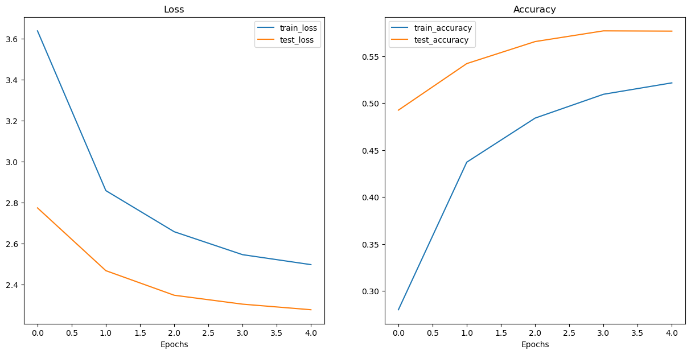
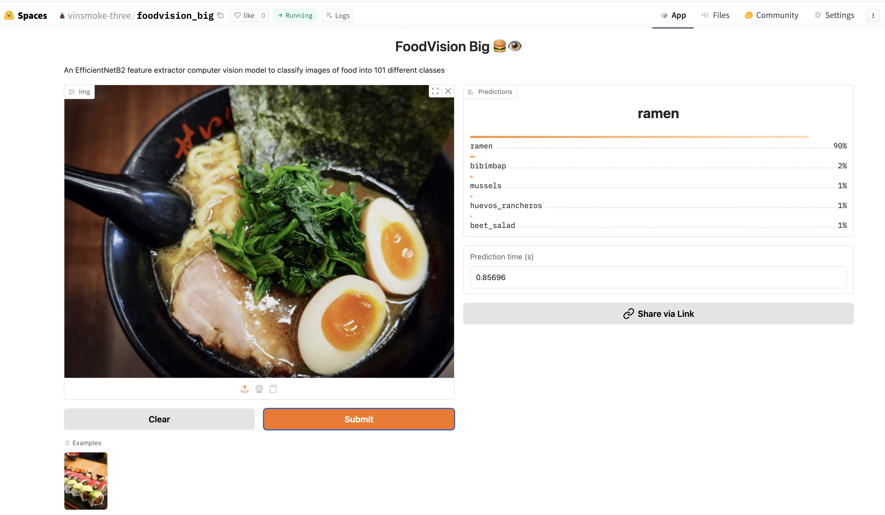

# PyTorchモデルのデプロイメント - FoodVision Bigの構築とHugging Face Spacesへの公開

## 概要
本記事では、PyTorchで構築した画像分類モデル「FoodVision Big」を実際に使えるWebアプリケーションとしてデプロイする方法を解説します。101種類の食品を分類できるモデルの学習から、Gradioを使ったインターフェースの作成、そしてHugging Face Spacesへの公開まで、実践的なMLOpsの基礎を学びます。

## 前提知識
- PyTorchの基本的な使い方
- 画像分類タスクの基礎知識
- Pythonプログラミングの基本
- コマンドライン操作の基本

## 実装内容

### 機械学習モデルのデプロイメントとは？

**機械学習モデルのデプロイメント**とは、学習済みのモデルを他の人やシステムがアクセスできるようにするプロセスのことです。

例えば：

- スマートフォンで食べ物の写真を撮影し、FoodVisionモデルでピザ、ステーキ、寿司などに分類する
- 銀行のデータベースが取引が詐欺かどうかを機械学習モデルで判定してから送金を実行する
- オペレーティングシステムが使用パターンを予測して電力消費を最適化する

### デプロイメントの種類

機械学習モデルのデプロイメントを考える際は、以下の問いから始めると良いでしょう：

> 「私のモデルにとって最も理想的な使用シナリオは何か？」

FoodVision Bigの場合、理想的なシナリオは：
1. モバイルデバイスで写真を撮影する（アプリまたはWebブラウザ経由）
2. 予測結果が高速に返ってくる

これは以下の2つの重要な問いに分解できます：

1. **どこに配置するか？** - モデルをどこに保存するか
2. **どのように機能するか？** - 予測は即座に返すか、後で返すか

#### デプロイメント場所の比較

| **デプロイ場所** | **メリット** | **デメリット** | 
| ----- | ----- | ----- |
| **オンデバイス（エッジ/ブラウザ内）** | 非常に高速（データがデバイスを離れない） | 計算能力が限定的（大きなモデルは実行に時間がかかる） | 
| | プライバシーを保護（データがデバイスを離れない） | ストレージ容量が限定的（小さなモデルサイズが必要） | 
| | インターネット接続不要（場合による） | デバイス固有のスキルが必要な場合が多い | 
| **クラウド** | ほぼ無制限の計算能力（必要に応じてスケールアップ可能） | コストが制御不能になる可能性（適切なスケーリング制限がない場合） |
| | 1つのモデルをデプロイしてどこでも使用可能（API経由） | ネットワーク遅延により予測が遅くなる可能性 |
| | 既存のクラウドエコシステムとの連携 | データがデバイスを離れる（プライバシーの懸念） |

### 環境のセットアップ

まず必要なライブラリをインポートします：

```python
# 必要なライブラリのインポート
import matplotlib.pyplot as plt
import torch
import torchvision

from torch import nn
from torchvision import transforms
from torchinfo import summary
from going_modular import data_setup, engine
from helper_functions import download_data, set_seeds, plot_loss_curves
```

デバイスに依存しないコードを設定：

```python
device = "mps" if torch.mps.is_available() else "cpu"
device
```

**実行結果：**
```
'mps'
```

### 1. EfficientNetB2特徴抽出器の作成

#### 1.1 EfficientNetB2特徴抽出器を作成する関数

転移学習を活用するため、事前学習済みのEfficientNetB2モデルを使用します：

```python
def create_effnetb2_model(num_classes:int=3, 
                          seed:int=42):
    """EfficientNetB2特徴抽出モデルと変換処理を作成します。

    Args:
        num_classes (int, optional): 分類器ヘッドのクラス数。デフォルトは3。
        seed (int, optional): ランダムシード値。デフォルトは42。

    Returns:
        model (torch.nn.Module): EfficientNetB2特徴抽出モデル
        transforms (torchvision.transforms): EfficientNetB2用の画像変換処理
    """
    # 1, 2, 3. EfficientNetB2の事前学習済み重み、変換処理、モデルを作成
    weights = torchvision.models.EfficientNet_B2_Weights.DEFAULT
    transforms = weights.transforms()
    model = torchvision.models.efficientnet_b2(weights=weights)

    # 4. ベースモデルの全レイヤーを凍結
    for param in model.parameters():
        param.requires_grad = False

    # 5. 再現性のためランダムシードを設定して分類器ヘッドを変更
    torch.manual_seed(seed)
    model.classifier = nn.Sequential(
        nn.Dropout(p=0.3, inplace=True),
        nn.Linear(in_features=1408, out_features=num_classes),
    )
    
    return model, transforms
```

### 2. FoodVision Bigの作成

#### 2.1 Food101データセット用のモデルと変換処理の作成

Food101は101種類の食品クラスを持つデータセットです。先ほど作成した関数を使って、101クラス対応のモデルを作成します：

```python
# Food101の101クラスに対応したEfficientNetB2モデルを作成
effnetb2_food101, effnetb2_transforms = create_effnetb2_model(num_classes=101)
```

データ拡張を含む学習用の変換処理を作成：

```python
# Food101学習データ用の変換処理（学習画像にのみデータ拡張を適用）
food101_train_transforms = torchvision.transforms.Compose([
    torchvision.transforms.TrivialAugmentWide(),
    effnetb2_transforms,
])
```

変換処理の比較：

```python
print(f"学習用変換処理:\n{food101_train_transforms}\n") 
print(f"テスト用変換処理:\n{effnetb2_transforms}")
```

**実行結果：**
```
学習用変換処理:
Compose(
    TrivialAugmentWide(num_magnitude_bins=31, interpolation=InterpolationMode.NEAREST, fill=None)
    ImageClassification(
    crop_size=[288]
    resize_size=[288]
    mean=[0.485, 0.456, 0.406]
    std=[0.229, 0.224, 0.225]
    interpolation=InterpolationMode.BICUBIC
)
)

テスト用変換処理:
ImageClassification(
    crop_size=[288]
    resize_size=[288]
    mean=[0.485, 0.456, 0.406]
    std=[0.229, 0.224, 0.225]
    interpolation=InterpolationMode.BICUBIC
)
```

#### 2.2 FoodVision Big用のデータ取得

PyTorchの`torchvision.datasets.Food101()`を使用してデータセットをダウンロード：

```python
from torchvision import datasets
from pathlib import Path

# データディレクトリの設定
data_dir = Path("data")

# 学習データの取得（~750画像 × 101食品クラス）
train_data = datasets.Food101(root=data_dir,
                              split="train",
                              transform=food101_train_transforms,
                              download=True)

# テストデータの取得（~250画像 × 101食品クラス）
test_data = datasets.Food101(root=data_dir,
                             split="test",
                             transform=effnetb2_transforms,
                             download=True)
```

クラス名の確認：

```python
# Food101のクラス名を取得
food101_class_names = train_data.classes

# 最初の10個を表示
food101_class_names[:10]
```

**実行結果：**
```python
['apple_pie',
 'baby_back_ribs',
 'baklava',
 'beef_carpaccio',
 'beef_tartare',
 'beet_salad',
 'beignets',
 'bibimbap',
 'bread_pudding',
 'breakfast_burrito']
```

#### 2.3 高速実験のためのFood101データセットのサブセット作成

学習を高速化するため、データセットの20%のみを使用します：

```python
def split_dataset(dataset:torchvision.datasets, split_size:float=0.2, seed:int=42):
    """データセットを指定された比率でランダムに分割します。

    Args:
        dataset (torchvision.datasets): PyTorchデータセット
        split_size (float, optional): 分割サイズ。デフォルトは0.2
        seed (int, optional): ランダムシード。デフォルトは42

    Returns:
        tuple: (分割1, 分割2)のタプル
    """
    # 元のデータセット長に基づいて分割長を作成
    length_1 = int(len(dataset) * split_size) # 希望する長さ
    length_2 = len(dataset) - length_1 # 残りの長さ
        
    # 情報を表示
    print(f"[INFO] 長さ{len(dataset)}のデータセットを以下のサイズに分割: {length_1} ({int(split_size*100)}%), {length_2} ({int((1-split_size)*100)}%)")
    
    # 指定されたランダムシードで分割を作成
    random_split_1, random_split_2 = torch.utils.data.random_split(dataset, 
                                                                   lengths=[length_1, length_2],
                                                                   generator=torch.manual_seed(seed))
    return random_split_1, random_split_2
```

20%のデータセット分割を作成：

```python
# Food101の学習データの20%分割を作成
train_data_food101_20_percent, _ = split_dataset(dataset=train_data,
                                                 split_size=0.2)

# Food101のテストデータの20%分割を作成
test_data_food101_20_percent, _ = split_dataset(dataset=test_data,
                                                split_size=0.2)

len(train_data_food101_20_percent), len(test_data_food101_20_percent)
```

**実行結果：**
```
[INFO] 長さ75750のデータセットを以下のサイズに分割: 15150 (20%), 60600 (80%)
[INFO] 長さ25250のデータセットを以下のサイズに分割: 5050 (20%), 20200 (80%)
(15150, 5050)
```

#### 2.4 Food101データセットをDataLoaderに変換

```python
import os

BATCH_SIZE = 32
NUM_WORKERS = 2 if os.cpu_count() <= 4 else 4

# Food101 20%学習用DataLoaderを作成
train_dataloader_food101_20_percent = torch.utils.data.DataLoader(train_data_food101_20_percent,
                                                                  batch_size=BATCH_SIZE,
                                                                  shuffle=True,
                                                                  num_workers=NUM_WORKERS)
# Food101 20%テスト用DataLoaderを作成
test_dataloader_food101_20_percent = torch.utils.data.DataLoader(test_data_food101_20_percent,
                                                                 batch_size=BATCH_SIZE,
                                                                 shuffle=False,
                                                                 num_workers=NUM_WORKERS)
```

#### 2.5 FoodVision Bigモデルの学習

オプティマイザと損失関数を設定し、モデルを学習します。ラベルスムージングを使用して正則化を行います：

```python
from going_modular import engine

# オプティマイザの設定
optimizer = torch.optim.Adam(params=effnetb2_food101.parameters(),
                             lr=1e-3)

# 損失関数の設定（クラス数が多いためラベルスムージングを使用）
loss_fn = torch.nn.CrossEntropyLoss(label_smoothing=0.1)

# 元のFood101論文の56.4%の精度を20%のデータで超えることが目標
set_seeds()    
effnetb2_food101_results = engine.train(model=effnetb2_food101.to(device),
                                        train_dataloader=train_dataloader_food101_20_percent,
                                        test_dataloader=test_dataloader_food101_20_percent,
                                        optimizer=optimizer,
                                        loss_fn=loss_fn,
                                        epochs=5,
                                        device=device,
                                        writer=None)
```

**実行結果：**
```
Epoch: 1 | train_loss: 3.6376 | train_acc: 0.2799 | test_loss: 2.7740 | test_acc: 0.4924
Epoch: 2 | train_loss: 2.8583 | train_acc: 0.4370 | test_loss: 2.4678 | test_acc: 0.5420
Epoch: 3 | train_loss: 2.6578 | train_acc: 0.4840 | test_loss: 2.3479 | test_acc: 0.5655
Epoch: 4 | train_loss: 2.5458 | train_acc: 0.5093 | test_loss: 2.3044 | test_acc: 0.5769
Epoch: 5 | train_loss: 2.4973 | train_acc: 0.5215 | test_loss: 2.2772 | test_acc: 0.5766
```

素晴らしい！元のFood101論文の56.4%の精度を、わずか20%の学習データで超えることができました。これが転移学習の力です！

#### 2.6 FoodVision Bigモデルの損失曲線の確認

```python
from helper_functions import plot_loss_curves

# FoodVision Bigの損失曲線を確認
plot_loss_curves(effnetb2_food101_results)
```

**実行結果：**


正則化技術（データ拡張とラベルスムージング）により、モデルの過学習を防ぐことができています。学習損失がテスト損失よりもまだ高いことから、モデルにはまだ学習能力が残っており、さらなる学習で改善の余地があることがわかります。

#### 2.7 FoodVision Bigの保存と読み込み

学習したモデルを保存します：

```python
from going_modular import utils

# モデルパスの作成
effnetb2_food101_model_path = "10_pretrained_effnetb2_feature_extractor_food101_20_percent.pth" 

# FoodVision Bigモデルを保存
utils.save_model(model=effnetb2_food101,
                 target_dir="models",
                 model_name=effnetb2_food101_model_path)
```

**実行結果：**
```
[INFO] Saving model to: models/10_pretrained_effnetb2_feature_extractor_food101_20_percent.pth
```

保存したモデルを読み込んで確認：

```python
# Food101対応のEfficientNetB2インスタンスを作成
loaded_effnetb2_food101, effnetb2_transforms = create_effnetb2_model(num_classes=101)

# 保存されたモデルのstate_dict()を読み込み
loaded_effnetb2_food101.load_state_dict(torch.load("models/10_pretrained_effnetb2_feature_extractor_food101_20_percent.pth"))
```

**実行結果：**
```
<All keys matched successfully>
```

#### 2.8 FoodVision Bigモデルのサイズ確認

FoodVision Bigは101クラスを分類できます。

```python
from pathlib import Path

# モデルサイズをバイトで取得し、メガバイトに変換
pretrained_effnetb2_food101_model_size = Path("models", effnetb2_food101_model_path).stat().st_size // (1024*1024)
print(f"事前学習済みEfficientNetB2特徴抽出器Food101モデルサイズ: {pretrained_effnetb2_food101_model_size} MB")
```

**実行結果：**
```
事前学習済みEfficientNetB2特徴抽出器Food101モデルサイズ: 30 MB
```

### 3. FoodVision Bigモデルをデプロイ可能なアプリに変換

#### 3.1 デモ用ディレクトリ構造の作成

```python
from pathlib import Path

# FoodVision Bigデモパスの作成
foodvision_big_demo_path = Path("demos/foodvision_big/")

# FoodVision Bigデモディレクトリの作成
foodvision_big_demo_path.mkdir(parents=True, exist_ok=True)

# FoodVision Bigデモ例ディレクトリの作成
(foodvision_big_demo_path / "examples").mkdir(parents=True, exist_ok=True)
```

必要なファイルを移動：

```python
# サンプル画像をコピー
!cp data/sushi.jpg demos/foodvision_big/examples/sushi.jpg

# 学習済みモデルをFoodVision Bigデモフォルダに移動
!mv models/10_pretrained_effnetb2_feature_extractor_food101_20_percent.pth demos/foodvision_big
```

#### 3.2 Food101クラス名をファイルに保存（`class_names.txt`）

101個のクラス名をテキストファイルに保存します：

```python
# Food101クラス名のパスを作成
foodvision_big_class_names_path = foodvision_big_demo_path / "class_names.txt"

# Food101クラス名リストをファイルに書き込み
with open(foodvision_big_class_names_path, "w") as f:
    print(f"[INFO] Food101クラス名を{foodvision_big_class_names_path}に保存")
    f.write("\n".join(food101_class_names)) # 各クラス間に改行を挿入
```

**実行結果：**
```
[INFO] Food101クラス名をdemos/foodvision_big/class_names.txtに保存
```

保存したクラス名を読み込んで確認：

```python
# Food101クラス名ファイルを開いて各行をリストに読み込み
with open(foodvision_big_class_names_path, "r") as f:
    food101_class_names_loaded = [food.strip() for food in  f.readlines()]
    
# 読み込んだ最初の5つのクラス名を表示
food101_class_names_loaded[:5]
```

**実行結果：**
```python
['apple_pie', 'baby_back_ribs', 'baklava', 'beef_carpaccio', 'beef_tartare']
```

#### 3.3 FoodVision BigモデルをPythonスクリプトに変換（`model.py`）

```python
%%writefile demos/foodvision_big/model.py
import torch
import torchvision

from torch import nn


def create_effnetb2_model(num_classes:int=3, 
                          seed:int=42):
    """EfficientNetB2特徴抽出モデルと変換処理を作成します。

    Args:
        num_classes (int, optional): 分類器ヘッドのクラス数。
            デフォルトは3。
        seed (int, optional): ランダムシード値。デフォルトは42。

    Returns:
        model (torch.nn.Module): EfficientNetB2特徴抽出モデル
        transforms (torchvision.transforms): EfficientNetB2画像変換処理
    """
    # EfficientNetB2の事前学習済み重み、変換処理、モデルを作成
    weights = torchvision.models.EfficientNet_B2_Weights.DEFAULT
    transforms = weights.transforms()
    model = torchvision.models.efficientnet_b2(weights=weights)

    # ベースモデルの全レイヤーを凍結
    for param in model.parameters():
        param.requires_grad = False

    # 再現性のためランダムシードを設定して分類器ヘッドを変更
    torch.manual_seed(seed)
    model.classifier = nn.Sequential(
        nn.Dropout(p=0.3, inplace=True),
        nn.Linear(in_features=1408, out_features=num_classes),
    )
    
    return model, transforms
```

#### 3.4 FoodVision Big GradioアプリをPythonスクリプトに変換（`app.py`）

```python
%%writefile demos/foodvision_big/app.py
### 1. インポートとクラス名の設定 ### 
import gradio as gr
import os
import torch

from model import create_effnetb2_model
from timeit import default_timer as timer
from typing import Tuple, Dict

# クラス名を設定
with open("class_names.txt", "r") as f: # class_names.txtから読み込み
    class_names = [food_name.strip() for food_name in  f.readlines()]
    
### 2. モデルと変換処理の準備 ###    

# モデルを作成
effnetb2, effnetb2_transforms = create_effnetb2_model(
    num_classes=101, # len(class_names)も使用可能
)

# 保存された重みを読み込み
effnetb2.load_state_dict(
    torch.load(
        f="10_pretrained_effnetb2_feature_extractor_food101_20_percent.pth",
        map_location=torch.device("cpu"),  # CPUに読み込み
    )
)

### 3. 予測関数 ###

# 予測関数を作成
def predict(img) -> Tuple[Dict, float]:
    """画像を変換して予測を実行し、予測結果と所要時間を返します。
    """
    # タイマーを開始
    start_time = timer()
    
    # 対象画像を変換してバッチ次元を追加
    img = effnetb2_transforms(img).unsqueeze(0)
    
    # モデルを評価モードにして推論モードをオンにする
    effnetb2.eval()
    with torch.inference_mode():
        # 変換された画像をモデルに通し、予測ロジットを予測確率に変換
        pred_probs = torch.softmax(effnetb2(img), dim=1)
    
    # 各予測クラスの予測ラベルと予測確率の辞書を作成（Gradioの出力パラメータに必要な形式）
    pred_labels_and_probs = {class_names[i]: float(pred_probs[0][i]) for i in range(len(class_names))}
    
    # 予測時間を計算
    pred_time = round(timer() - start_time, 5)
    
    # 予測辞書と予測時間を返す 
    return pred_labels_and_probs, pred_time

### 4. Gradioアプリ ###

# タイトル、説明、記事の文字列を作成
title = "FoodVision Big"
description = "101種類の食品画像を分類するEfficientNetB2特徴抽出コンピュータービジョンモデル。"
article = "[10. PyTorchモデルデプロイメント](https://vinsmoke-three.com/PyTorch/10_pytorch_model_deployment/)で作成。"

# "examples/"ディレクトリから例のリストを作成
example_list = [["examples/" + example] for example in os.listdir("examples")]

# Gradioインターフェースを作成 
demo = gr.Interface(
    fn=predict,
    inputs=gr.Image(type="pil"),
    outputs=[
        gr.Label(num_top_classes=5, label="予測結果"),
        gr.Number(label="予測時間 (秒)"),
    ],
    examples=example_list,
    title=title,
    description=description,
    article=article,
)

# アプリを起動！
demo.launch()
```

#### 3.5 FoodVision Big用の要件ファイルを作成（`requirements.txt`）

```python
%%writefile demos/foodvision_big/requirements.txt
torch>=2.3.1,<2.8.0
torchvision>=0.18.1,<0.23.0
gradio>=5.35.0,<6.0.0
```

### 3.6 FoodVision BigアプリをHugging Face Spacesにデプロイ

最後に、作成したFoodVision BigアプリをHugging Face Spacesにデプロイして、世界中の人々が使えるようにします！

デプロイ手順：

1. [Hugging Faceアカウントを作成](https://huggingface.co/join)
2. プロフィールから[「New Space」をクリック](https://huggingface.co/new-space)してSpace（コードリポジトリ）を開始
3. Spaceに名前を付ける（例：`vinsmoke-three/foodvision_big`）
4. ライセンスを選択（例：MIT）
5. Space SDKとしてGradioを選択
6. 公開/非公開を選択（公開推奨）
7. 「Create Space」をクリック
8. ターミナルでリポジトリをクローン：
   ```bash
   git clone https://huggingface.co/spaces/[YOUR_USERNAME]/[YOUR_SPACE_NAME]
   ```
9. `foodvision_big`フォルダの内容をクローンしたリポジトリフォルダにコピー
10. [Git LFS（Large File Storage）をインストール](https://git-lfs.github.com/)
11. Git LFSを有効化：
    ```bash
    git lfs install
    ```
12. 10MB以上のファイルをGit LFSで追跡：
    ```bash
    git lfs track "10_pretrained_effnetb2_feature_extractor_food101_20_percent.pth"
    ```
13. `.gitattributes`を追跡（Git LFSの設定ファイル）：
    ```bash
    git add .gitattributes
    ```
14. 残りのファイルを追加してコミット：
    ```bash
    git add *
    git commit -m "first commit"
    ```
15. Hugging Faceにプッシュ（アップロード）：
    ```bash
    git push
    ```
16. 3-5分待ってビルドが完了し、アプリが公開されるのを待つ

すべてが正しく動作すれば、FoodVision Big Gradioデモが食品を分類できるようになります！

完成したデモは[こちら](https://huggingface.co/spaces/vinsmoke-three/foodvision_big/)で確認できます。



素晴らしい成果です！単純な直線を予測するPyTorchモデルから始まり、今では世界中の人々がアクセスできるコンピュータービジョンモデルを構築できるようになりました！

## 重要なポイント

### デプロイメントの重要性
* **デプロイメントは学習と同じくらい重要です。** 良いモデルができたら、最初に考えるべきは「どのようにデプロイして他の人がアクセスできるようにするか」です。デプロイメントにより、プライベートな学習・テストセットではなく、実世界でモデルをテストできます。

### 機械学習モデルデプロイメントの3つの質問
1. **モデルの最も理想的な使用ケースは何か**（どの程度の性能と速度で動作するか）
2. **モデルをどこに配置するか**（オンデバイスかクラウドか）
3. **モデルはどのように機能するか**（予測はオンラインかオフラインか）

### デプロイメントオプション
* **選択肢は豊富ですが、シンプルに始めることが重要です。** 現在の最良の方法の1つは、Gradioを使用してデモを作成し、Hugging Face Spacesでホストすることです。シンプルに始めて、必要に応じてスケールアップしましょう。

### 継続的な実験
* **実験を続けることが重要です。** 機械学習モデルのニーズは時間とともに変化するため、単一のモデルをデプロイすることが最終ステップではありません。データセットが変化したり、新しい研究が発表されてより良いアーキテクチャが利用可能になったりする可能性があります。

### MLOpsの実践
* **機械学習モデルのデプロイメントはMLOps（機械学習運用）というエンジニアリング実践の一部です。** MLOpsはDevOps（開発運用）の拡張で、モデル学習に関わるすべてのエンジニアリング部分（データ収集と保存、データ前処理、モデルデプロイ、モデル監視、バージョン管理など）を含みます。

## まとめ

本記事では、PyTorchで構築した画像分類モデル「FoodVision Big」を実際に使えるWebアプリケーションとしてデプロイする方法を学びました。主な学習ポイントは以下の通りです：

1. **転移学習の威力** - わずか20%のデータで元の論文の精度を上回る結果を達成
2. **効率的なモデル設計** - EfficientNetB2を使用し、性能と速度のバランスを実現
3. **実践的なデプロイメント** - Gradioを使用した直感的なインターフェースの作成
4. **アクセシビリティの向上** - Hugging Face Spacesを通じて世界中からアクセス可能に

機械学習モデルの真の価値は、実際に使われてこそ発揮されます。優れたモデルを作成することも重要ですが、それを適切にデプロイし、人々が利用できるようにすることも同様に重要です。今回学んだ技術を活用して、あなたのモデルも世界に公開してみましょう！