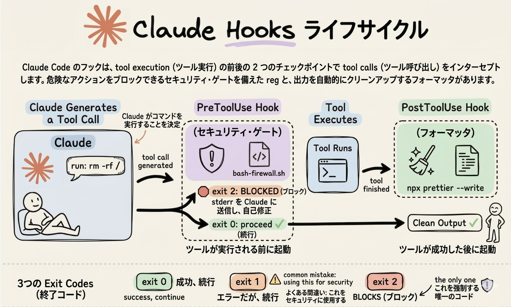

# Claude Code Hooks 入門

## Hooksとは何か？

多くの人は `CLAUDE.md` を設定して終わりにしています。

しかし、それは間違いです。

**CLAUDE.mdは提案であり、Hooksは保証です。**

Claudeは `CLAUDE.md` の指示に「ほとんどの場合」従いますが、「常に」ではありません。リンターを実行し忘れることもあります。承認しないはずのコマンドを実行することもあります。テストがまだ失敗しているのに「完了」と宣言することもあります。

Hooksは、重要な動作を**決定論的**にすることで、これらの問題を解決します。

---

## Hooksの仕組み

Claudeが行うすべてのツール呼び出しは、ライフサイクルを通過します。ツールが実行される前、実行後、Claudeが停止しようとする時。これらのライフサイクルイベントにシェルスクリプトを紐付けると、自動的に実行されます。「ほとんどの場合」ではなく、**毎回**です。

以下の図は、この仕組みを示しています。



---

## PreToolUse Hook（ツール実行前）

Claudeがツール呼び出しを生成すると、実行前に `PreToolUse` Hookがインターセプトします。

例えば、bashファイアウォールスクリプトでコマンドを危険なパターンと照合できます。`rm -rf /` や main への force-push にマッチした場合、**exit code 2** で呼び出しを完全にブロックし、エラーをClaudeに送り返して自己修正させます。安全な場合は、**exit code 0** で通過させます。

```json
{
  "hooks": {
    "PreToolUse": [
      {
        "matcher": "Bash",
        "command": "/path/to/bash_firewall.sh"
      }
    ]
  }
}
```

---

## PostToolUse Hook（ツール実行後）

ツールが実行された後、`PostToolUse` Hookが起動します。

例えば、Claudeが書いたファイルに対してPrettierを自動実行できます。Claudeが覚えておく必要なく、毎回クリーンな出力が得られます。

```json
{
  "hooks": {
    "PostToolUse": [
      {
        "matcher": "Write|Edit",
        "command": "prettier --write \"$CLAUDE_FILE_PATH\""
      }
    ]
  }
}
```

---

## その他の強力なHook

Hooksの本当の力は、何を強制するかにあります。

| Hook | 用途例 |
|------|--------|
| `Stop` | `npm test` を実行し、テストスイートがグリーンになるまでClaudeの終了をブロック |
| `SessionStart` | 現在のgitブランチを自動的にコンテキストに注入 |
| `Notification` | Claudeが注意を必要とする時にデスクトップ通知を送信 |

---

## Exit Codeの理解

最初のHookを書く前に、Exit Codeの動作を理解することが重要です。

| Exit Code | 意味 |
|-----------|------|
| `0` | 成功。実行を許可 |
| `1` | エラーだが非ブロッキング。実行は通常通り継続 |
| `2` | **ブロック**。エラーメッセージをClaudeにフィードバック |

!!! warning "よくある間違い"
    セキュリティHookで `exit 1` を使うのは最も一般的な間違いです。警告をログに記録するだけで、アクションを停止するためには**何もしません**。セキュリティ目的では必ず `exit 2` を使用してください。

---

## 設定方法

設定は `settings.json` の `hooks` キーに配置します。各Hookには、特定のツールをターゲットにするためのmatcher正規表現と、実行するシェルコマンドを指定します。

```json
{
  "hooks": {
    "PreToolUse": [
      {
        "matcher": "Bash",
        "command": "/path/to/firewall.sh"
      }
    ],
    "PostToolUse": [
      {
        "matcher": "Write|Edit",
        "command": "prettier --write \"$CLAUDE_FILE_PATH\""
      }
    ],
    "Stop": [
      {
        "matcher": ".*",
        "command": "npm test"
      }
    ]
  }
}
```

これをgitにコミットすれば、チーム全体で同じガードレールを共有できます。

---

## CLAUDE.md vs Hooks

| | CLAUDE.md | Hooks |
|---|-----------|-------|
| 実行 | 提案ベース（従わないことも） | 保証（毎回実行） |
| 用途 | ガイドライン、好み | 必須のルール、セキュリティ |
| 信頼性 | 信頼度に応じてスケール | 確実性でスケール |

> 「常にPrettierを実行する」と書かれた `CLAUDE.md` は**希望**です。
> Prettierを実行する `PostToolUse` Hookは**事実**です。

---

!!! tip "まとめ"
    - **提案は信頼度に応じてスケール**します
    - **Hooksは確実性でスケール**します
    - 重要な動作にはHooksを使用し、ガイドラインには `CLAUDE.md` を使用しましょう
